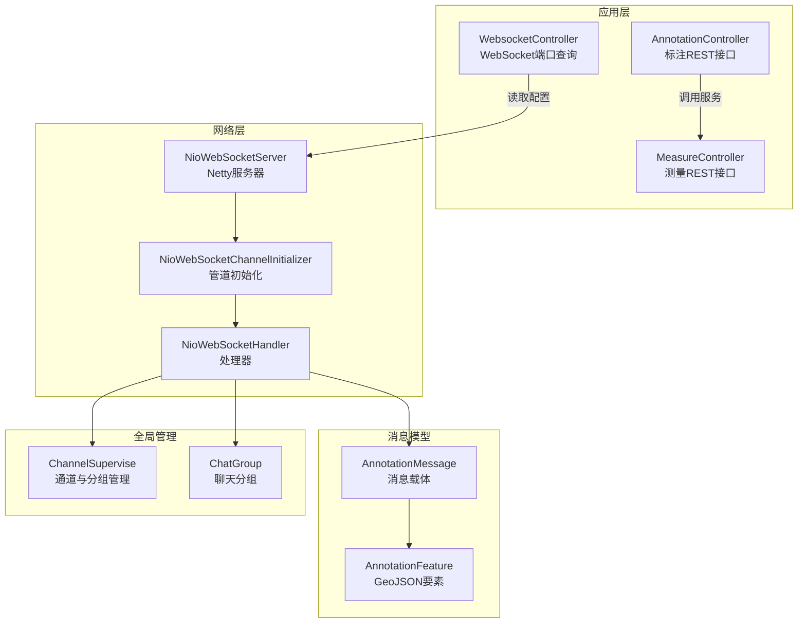
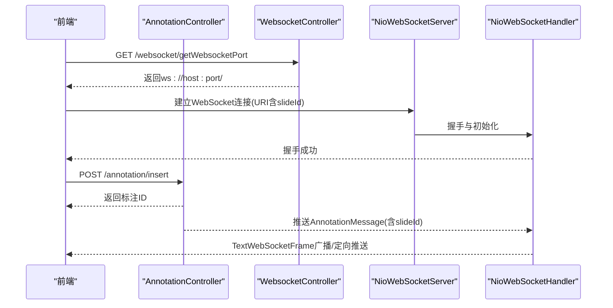
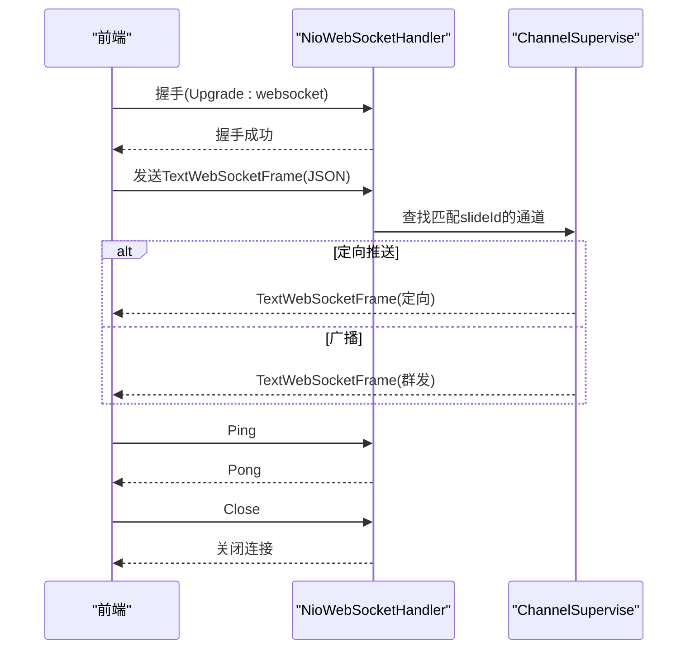
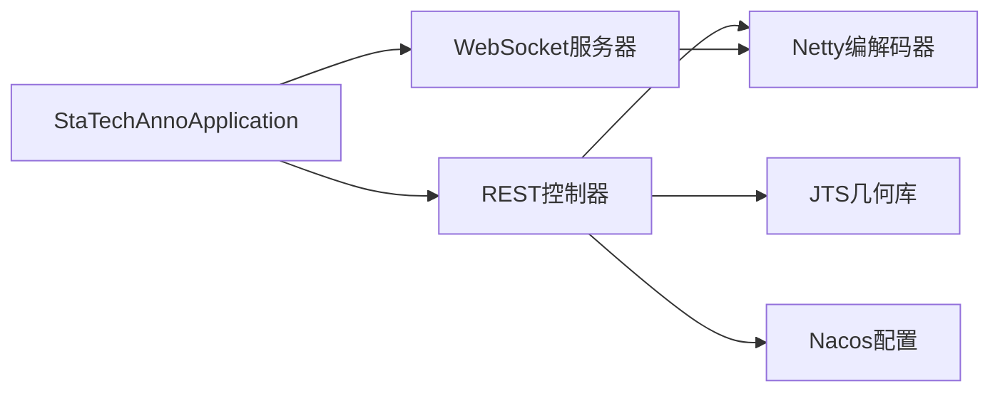

# API接口文档

<cite>
**本文引用的文件**
- [StaTechAnnoApplication.java](file://src/main/java/cn/staitech/annotation/StaTechAnnoApplication.java)
- [AnnotationController.java](file://src/main/java/cn/staitech/annotation/controller/AnnotationController.java)
- [MeasureController.java](file://src/main/java/cn/staitech/annotation/controller/MeasureController.java)
- [WebsocketController.java](file://src/main/java/cn/staitech/annotation/controller/WebsocketController.java)
- [NioWebSocketServer.java](file://src/main/java/cn/staitech/annotation/netty/websocket/NioWebSocketServer.java)
- [NioWebSocketChannelInitializer.java](file://src/main/java/cn/staitech/annotation/netty/websocket/NioWebSocketChannelInitializer.java)
- [NioWebSocketHandler.java](file://src/main/java/cn/staitech/annotation/netty/websocket/NioWebSocketHandler.java)
- [AnnotationMessage.java](file://src/main/java/cn/staitech/annotation/netty/message/AnnotationMessage.java)
- [AnnotationFeature.java](file://src/main/java/cn/staitech/annotation/netty/message/AnnotationFeature.java)
- [ChannelSupervise.java](file://src/main/java/cn/staitech/annotation/netty/global/ChannelSupervise.java)
- [ChatGroup.java](file://src/main/java/cn/staitech/annotation/netty/global/ChatGroup.java)
- [AnnotationAddReq.java](file://src/main/java/cn/staitech/annotation/vo/anno/AnnotationAddReq.java)
- [MeasureAddVo.java](file://src/main/java/cn/staitech/annotation/vo/measure/MeasureAddVo.java)
- [bootstrap.yml](file://src/main/resources/bootstrap.yml)
- [pom.xml](file://pom.xml)
</cite>

## 目录
1. [简介](#简介)
2. [项目结构](#项目结构)
3. [核心组件](#核心组件)
4. [架构总览](#架构总览)
5. [详细组件分析](#详细组件分析)
6. [依赖分析](#依赖分析)
7. [性能考虑](#性能考虑)
8. [故障排查指南](#故障排查指南)
9. [结论](#结论)
10. [附录](#附录)

## 简介
本文件为医学图像标注系统提供的完整API接口文档，覆盖以下能力：
- 标注管理REST API：新增、更新、删除、批量操作、撤销/重做、几何运算与距离计算等
- 测量计算REST API：分页查询、GeoJSON导出、测量数据新增与删除、截图标记等
- WebSocket通信API：连接建立、消息收发、事件类型与实时交互模式
- 错误码与响应格式：统一基于通用返回包装器
- 安全与认证：基于通用安全组件与审计注解
- 版本与部署：基于Nacos配置与多环境Profile

## 项目结构
系统采用Spring Boot微服务架构，标注与测量功能通过REST控制器暴露，WebSocket使用Netty实现，配置由Nacos集中管理。

图表来源
- [AnnotationController.java:1-251](file://src/main/java/cn/staitech/annotation/controller/AnnotationController.java#L1-L251)
- [MeasureController.java:1-118](file://src/main/java/cn/staitech/annotation/controller/MeasureController.java#L1-L118)
- [WebsocketController.java:1-41](file://src/main/java/cn/staitech/annotation/controller/WebsocketController.java#L1-L41)
- [NioWebSocketServer.java:1-44](file://src/main/java/cn/staitech/annotation/netty/websocket/NioWebSocketServer.java#L1-L44)
- [NioWebSocketChannelInitializer.java:1-30](file://src/main/java/cn/staitech/annotation/netty/websocket/NioWebSocketChannelInitializer.java#L1-L30)
- [NioWebSocketHandler.java:1-197](file://src/main/java/cn/staitech/annotation/netty/websocket/NioWebSocketHandler.java#L1-L197)
- [AnnotationMessage.java:1-28](file://src/main/java/cn/staitech/annotation/netty/message/AnnotationMessage.java#L1-L28)
- [AnnotationFeature.java:1-33](file://src/main/java/cn/staitech/annotation/netty/message/AnnotationFeature.java#L1-L33)
- [ChannelSupervise.java:1-45](file://src/main/java/cn/staitech/annotation/netty/global/ChannelSupervise.java#L1-L45)
- [ChatGroup.java:1-11](file://src/main/java/cn/staitech/annotation/netty/global/ChatGroup.java#L1-L11)

章节来源
- [bootstrap.yml:1-42](file://src/main/resources/bootstrap.yml#L1-L42)
- [pom.xml:1-265](file://pom.xml#L1-L265)

## 核心组件
- AnnotationController：提供标注新增、更新、删除、批量、撤销/重做、几何运算、距离计算、GeoJSON导出等接口
- MeasureController：提供测量分页、GeoJSON导出、新增、删除、导出Excel、截图标记等接口
- WebsocketController：提供WebSocket端口查询接口，便于前端建立连接
- NioWebSocketServer：Netty WebSocket服务器，负责启动与监听
- NioWebSocketHandler：WebSocket握手、消息处理、心跳、广播与按切片分发
- AnnotationMessage/AnnotationFeature：WebSocket消息载体与GeoJSON要素模型
- ChannelSupervise/ChatGroup：通道与分组管理，支持按切片ID定向推送

章节来源
- [AnnotationController.java:1-251](file://src/main/java/cn/staitech/annotation/controller/AnnotationController.java#L1-L251)
- [MeasureController.java:1-118](file://src/main/java/cn/staitech/annotation/controller/MeasureController.java#L1-L118)
- [WebsocketController.java:1-41](file://src/main/java/cn/staitech/annotation/controller/WebsocketController.java#L1-L41)
- [NioWebSocketServer.java:1-44](file://src/main/java/cn/staitech/annotation/netty/websocket/NioWebSocketServer.java#L1-L44)
- [NioWebSocketHandler.java:1-197](file://src/main/java/cn/staitech/annotation/netty/websocket/NioWebSocketHandler.java#L1-L197)
- [AnnotationMessage.java:1-28](file://src/main/java/cn/staitech/annotation/netty/message/AnnotationMessage.java#L1-L28)
- [AnnotationFeature.java:1-33](file://src/main/java/cn/staitech/annotation/netty/message/AnnotationFeature.java#L1-L33)
- [ChannelSupervise.java:1-45](file://src/main/java/cn/staitech/annotation/netty/global/ChannelSupervise.java#L1-L45)
- [ChatGroup.java:1-11](file://src/main/java/cn/staitech/annotation/netty/global/ChatGroup.java#L1-L11)

## 架构总览
系统通过REST API与WebSocket协同工作：
- REST API：面向标注与测量的CRUD与统计查询
- WebSocket：面向实时协作与广播，按切片ID定向推送标注变更

图表来源
- [WebsocketController.java:24-37](file://src/main/java/cn/staitech/annotation/controller/WebsocketController.java#L24-L37)
- [NioWebSocketServer.java:16-31](file://src/main/java/cn/staitech/annotation/netty/websocket/NioWebSocketServer.java#L16-L31)
- [NioWebSocketHandler.java:167-194](file://src/main/java/cn/staitech/annotation/netty/websocket/NioWebSocketHandler.java#L167-L194)
- [AnnotationController.java:50-59](file://src/main/java/cn/staitech/annotation/controller/AnnotationController.java#L50-L59)
- [AnnotationMessage.java:14-27](file://src/main/java/cn/staitech/annotation/netty/message/AnnotationMessage.java#L14-L27)

## 详细组件分析

### REST API：标注管理
- 基础路径：/annotation
- 统一响应：基于通用返回包装器，包含状态码、消息与数据体
- 认证与审计：部分接口使用审计注解，支持字段对比与删除标记

接口清单与规范
- 新增标注
  - 方法与路径：POST /annotation/insert
  - 请求体：AnnotationAddReq（包含几何、标签、切片ID、标注类型等）
  - 响应：字符串型标注ID
  - 示例：见“附录/请求示例”
  - 章节来源
    - [AnnotationController.java:50-59](file://src/main/java/cn/staitech/annotation/controller/AnnotationController.java#L50-L59)
    - [AnnotationAddReq.java:24-117](file://src/main/java/cn/staitech/annotation/vo/anno/AnnotationAddReq.java#L24-L117)

- AI新增标注
  - 方法与路径：POST /annotation/ai_insert
  - 请求体：AI专用请求体（与标注新增类似）
  - 响应：字符串型标注ID
  - 章节来源
    - [AnnotationController.java:61-69](file://src/main/java/cn/staitech/annotation/controller/AnnotationController.java#L61-L69)

- 删除标注
  - 方法与路径：POST /annotation/delete
  - 请求体：删除请求（包含标注ID）
  - 响应：操作结果字符串
  - 章节来源
    - [AnnotationController.java:84-89](file://src/main/java/cn/staitech/annotation/controller/AnnotationController.java#L84-L89)

- AI删除标注
  - 方法与路径：POST /annotation/ai_delete
  - 请求体：AI删除请求
  - 响应：操作结果字符串
  - 章节来源
    - [AnnotationController.java:77-81](file://src/main/java/cn/staitech/annotation/controller/AnnotationController.java#L77-L81)

- 按切片批量删除
  - 方法与路径：POST /annotation/deleteBySlide
  - 请求体：切片ID列表
  - 响应：布尔值
  - 章节来源
    - [AnnotationController.java:92-95](file://src/main/java/cn/staitech/annotation/controller/AnnotationController.java#L92-L95)

- 更新标注
  - 方法与路径：POST /annotation/update
  - 请求体：更新请求（包含标注ID与变更字段）
  - 响应：操作结果字符串
  - 章节来源
    - [AnnotationController.java:97-102](file://src/main/java/cn/staitech/annotation/controller/AnnotationController.java#L97-L102)

- AI更新标注
  - 方法与路径：POST /annotation/ai_update
  - 请求体：AI更新请求
  - 响应：操作结果字符串
  - 章节来源
    - [AnnotationController.java:104-110](file://src/main/java/cn/staitech/annotation/controller/AnnotationController.java#L104-L110)

- 填充轮廓
  - 方法与路径：POST /annotation/padding
  - 请求体：填充请求
  - 响应：操作结果字符串
  - 章节来源
    - [AnnotationController.java:112-116](file://src/main/java/cn/staitech/annotation/controller/AnnotationController.java#L112-L116)

- 复制/粘贴轮廓
  - 方法与路径：POST /annotation/stickup
  - 请求体：更新请求
  - 响应：操作结果字符串
  - 章节来源
    - [AnnotationController.java:118-123](file://src/main/java/cn/staitech/annotation/controller/AnnotationController.java#L118-L123)

- AI复制/粘贴轮廓
  - 方法与路径：POST /annotation/ai_stickup
  - 请求体：AI更新请求
  - 响应：操作结果字符串
  - 章节来源
    - [AnnotationController.java:125-131](file://src/main/java/cn/staitech/annotation/controller/AnnotationController.java#L125-L131)

- 轮廓合并预览
  - 方法与路径：POST /annotation/mergePreview
  - 请求体：合并预览请求（包含标注ID列表）
  - 响应：几何对象
  - 章节来源
    - [AnnotationController.java:133-138](file://src/main/java/cn/staitech/annotation/controller/AnnotationController.java#L133-L138)

- 获取GeoJSON数据
  - 方法与路径：POST /annotation/selectLists
  - 请求体：标注查询请求（包含切片ID与轮廓类型）
  - 响应：AnnotationFeature列表
  - 章节来源
    - [AnnotationController.java:140-153](file://src/main/java/cn/staitech/annotation/controller/AnnotationController.java#L140-L153)

- 获取筛差数据
  - 方法与路径：POST /annotation/selectSdLists
  - 请求体：筛差查询请求
  - 响应：筛差要素列表
  - 章节来源
    - [AnnotationController.java:158-164](file://src/main/java/cn/staitech/annotation/controller/AnnotationController.java#L158-L164)

- 合并/裁剪轮廓
  - 方法与路径：POST /annotation/updateOperation
  - 请求体：轮廓操作请求
  - 响应：几何对象
  - 章节来源
    - [AnnotationController.java:171-175](file://src/main/java/cn/staitech/annotation/controller/AnnotationController.java#L171-L175)

- 批量操作
  - 方法与路径：POST /annotation/batch
  - 请求体：批量请求（包含操作列表）
  - 响应：批量响应列表
  - 章节来源
    - [AnnotationController.java:177-192](file://src/main/java/cn/staitech/annotation/controller/AnnotationController.java#L177-L192)

- 检查标签使用状态
  - 方法与路径：POST /annotation/checkTagUsageStatus
  - 查询参数：id（标签ID）
  - 响应：布尔值
  - 章节来源
    - [AnnotationController.java:194-199](file://src/main/java/cn/staitech/annotation/controller/AnnotationController.java#L194-L199)

- 检查用户在切片上的标注数量
  - 方法与路径：POST /annotation/checkUserOperation
  - 请求体：用户与切片信息
  - 响应：数量
  - 章节来源
    - [AnnotationController.java:201-208](file://src/main/java/cn/staitech/annotation/controller/AnnotationController.java#L201-L208)

- 查询切片标注数量（单个）
  - 方法与路径：POST /annotation/countAnnoBySlide/{slideId}
  - 路径参数：slideId
  - 响应：数量
  - 章节来源
    - [AnnotationController.java:210-216](file://src/main/java/cn/staitech/annotation/controller/AnnotationController.java#L210-L216)

- 查询切片标注数量（多个）
  - 方法与路径：POST /annotation/countAnnoBySlides
  - 请求体：切片ID列表
  - 响应：数量
  - 章节来源
    - [AnnotationController.java:218-224](file://src/main/java/cn/staitech/annotation/controller/AnnotationController.java#L218-L224)

- 撤销标注
  - 方法与路径：POST /annotation/undoAnnotation/{slideId}
  - 路径参数：slideId
  - 响应：布尔值
  - 章节来源
    - [AnnotationController.java:226-230](file://src/main/java/cn/staitech/annotation/controller/AnnotationController.java#L226-L230)

- 重做标注
  - 方法与路径：POST /annotation/redoAnnotation/{slideId}
  - 路径参数：slideId
  - 响应：布尔值
  - 章节来源
    - [AnnotationController.java:232-236](file://src/main/java/cn/staitech/annotation/controller/AnnotationController.java#L232-L236)

- 清除撤销/重做栈
  - 方法与路径：POST /annotation/clear/{slideId}
  - 路径参数：slideId
  - 响应：布尔值
  - 章节来源
    - [AnnotationController.java:238-242](file://src/main/java/cn/staitech/annotation/controller/AnnotationController.java#L238-L242)

- 检查撤销/重做状态
  - 方法与路径：POST /annotation/checkUndoAndRedoStatus/{slideId}
  - 路径参数：slideId
  - 响应：布尔值
  - 章节来源
    - [AnnotationController.java:244-248](file://src/main/java/cn/staitech/annotation/controller/AnnotationController.java#L244-L248)

- 获取两点间距离
  - 方法与路径：POST /annotation/getDistance
  - 请求体：距离查询请求
  - 响应：距离结果
  - 章节来源
    - [AnnotationController.java:71-75](file://src/main/java/cn/staitech/annotation/controller/AnnotationController.java#L71-L75)

请求参数与响应格式要点
- 统一响应：包含状态码、消息与数据体；具体字段由通用返回包装器定义
- 参数校验：使用JSR-303注解进行参数校验
- GeoJSON：标注与测量数据以GeoJSON Feature形式返回
- 审计：部分接口启用审计注解，支持字段对比与删除标记

章节来源
- [AnnotationController.java:1-251](file://src/main/java/cn/staitech/annotation/controller/AnnotationController.java#L1-L251)
- [AnnotationAddReq.java:1-118](file://src/main/java/cn/staitech/annotation/vo/anno/AnnotationAddReq.java#L1-L118)

### REST API：测量计算
- 基础路径：/measure
- 统一响应：基于通用返回包装器

接口清单与规范
- 分页查询测量
  - 方法与路径：POST /measure/page
  - 请求体：测量分页查询请求（包含切片ID与模糊名称）
  - 响应：分页结果（包含普通测量与点数统计）
  - 章节来源
    - [MeasureController.java:41-68](file://src/main/java/cn/staitech/annotation/controller/MeasureController.java#L41-L68)

- 获取GeoJSON数据
  - 方法与路径：GET /measure/getDataList?slideId=...
  - 查询参数：slideId（切片ID）
  - 响应：AnnotationFeature列表
  - 章节来源
    - [MeasureController.java:70-79](file://src/main/java/cn/staitech/annotation/controller/MeasureController.java#L70-L79)

- 添加测量
  - 方法与路径：POST /measure/add
  - 请求体：MeasureAddVo（包含几何、测量类型、切片ID等）
  - 响应：测量ID字符串
  - 章节来源
    - [MeasureController.java:81-93](file://src/main/java/cn/staitech/annotation/controller/MeasureController.java#L81-L93)
    - [MeasureAddVo.java:26-173](file://src/main/java/cn/staitech/annotation/vo/measure/MeasureAddVo.java#L26-L173)

- 删除测量
  - 方法与路径：POST /measure/del
  - 请求体：删除请求（包含测量ID）
  - 响应：操作结果字符串
  - 章节来源
    - [MeasureController.java:95-100](file://src/main/java/cn/staitech/annotation/controller/MeasureController.java#L95-L100)

- 导出测量Excel
  - 方法与路径：POST /measure/export
  - 请求体：导出请求（包含切片ID）
  - 响应：无（触发下载）
  - 章节来源
    - [MeasureController.java:103-108](file://src/main/java/cn/staitech/annotation/controller/MeasureController.java#L103-L108)

- 截图标记
  - 方法与路径：POST /measure/screenshot
  - 请求体：截图请求
  - 响应：通用返回包装器
  - 章节来源
    - [MeasureController.java:111-117](file://src/main/java/cn/staitech/annotation/controller/MeasureController.java#L111-L117)

请求参数与响应格式要点
- 统一响应：包含状态码、消息与数据体
- 参数校验：使用JSR-303注解进行参数校验
- GeoJSON：测量数据以GeoJSON Feature形式返回

章节来源
- [MeasureController.java:1-118](file://src/main/java/cn/staitech/annotation/controller/MeasureController.java#L1-L118)
- [MeasureAddVo.java:1-174](file://src/main/java/cn/staitech/annotation/vo/measure/MeasureAddVo.java#L1-L174)

### WebSocket API：实时通信
- 端口查询
  - 方法与路径：GET /websocket/getWebsocketPort
  - 响应：ws://host:port/
  - 章节来源
    - [WebsocketController.java:27-37](file://src/main/java/cn/staitech/annotation/controller/WebsocketController.java#L27-L37)

- 连接建立
  - 协议：WebSocket
  - 地址：ws://host:port/{type}/{slideId}
  - 类型与切片：URI最后一段为类型（如slide），倒数第二段为slideId
  - 章节来源
    - [NioWebSocketHandler.java:178-183](file://src/main/java/cn/staitech/annotation/netty/websocket/NioWebSocketHandler.java#L178-L183)

- 消息格式
  - JSON对象，字段：
    - type：消息类型
    - slideId：切片ID
    - annotation_type：标注类型
    - data：单个要素
    - dataList：要素列表
  - 章节来源
    - [AnnotationMessage.java:14-27](file://src/main/java/cn/staitech/annotation/netty/message/AnnotationMessage.java#L14-L27)

- 事件类型与处理
  - 握手：HTTP升级为WebSocket
  - 心跳：Ping/Pong帧
  - 文本消息：TextWebSocketFrame
  - 关闭：CloseWebSocketFrame
  - 章节来源
    - [NioWebSocketHandler.java:139-152](file://src/main/java/cn/staitech/annotation/netty/websocket/NioWebSocketHandler.java#L139-L152)

- 实时交互模式
  - 广播：向所有连接推送
  - 定向：按slideId筛选通道并推送
  - 章节来源
    - [NioWebSocketHandler.java:38-68](file://src/main/java/cn/staitech/annotation/netty/websocket/NioWebSocketHandler.java#L38-L68)
    - [ChannelSupervise.java:33-43](file://src/main/java/cn/staitech/annotation/netty/global/ChannelSupervise.java#L33-L43)

- 通道管理
  - ChannelSupervise：维护通道与slideId映射，支持群发与定向
  - ChatGroup：备用分组管理
  - 章节来源
    - [ChannelSupervise.java:17-44](file://src/main/java/cn/staitech/annotation/netty/global/ChannelSupervise.java#L17-L44)
    - [ChatGroup.java:8-10](file://src/main/java/cn/staitech/annotation/netty/global/ChatGroup.java#L8-L10)

- Netty服务器与管道
  - NioWebSocketServer：启动服务器并绑定端口
  - NioWebSocketChannelInitializer：配置HTTP编解码器、聚合器与自定义处理器
  - 章节来源
    - [NioWebSocketServer.java:14-41](file://src/main/java/cn/staitech/annotation/netty/websocket/NioWebSocketServer.java#L14-L41)
    - [NioWebSocketChannelInitializer.java:13-28](file://src/main/java/cn/staitech/annotation/netty/websocket/NioWebSocketChannelInitializer.java#L13-L28)

图表来源
- [NioWebSocketHandler.java:94-162](file://src/main/java/cn/staitech/annotation/netty/websocket/NioWebSocketHandler.java#L94-L162)
- [ChannelSupervise.java:37-43](file://src/main/java/cn/staitech/annotation/netty/global/ChannelSupervise.java#L37-L43)

## 依赖分析
- 外部依赖
  - Netty：WebSocket服务器与编解码
  - JTS：几何计算与GeoJSON支持
  - Knife4j：API文档增强
  - Nacos：配置与服务发现
- 内部模块
  - 通用安全与审计：统一认证与日志审计
  - 通用返回包装器：统一响应格式

图表来源
- [StaTechAnnoApplication.java:25-33](file://src/main/java/cn/staitech/annotation/StaTechAnnoApplication.java#L25-L33)
- [pom.xml:82-105](file://pom.xml#L82-L105)

章节来源
- [pom.xml:1-265](file://pom.xml#L1-L265)

## 性能考虑
- WebSocket
  - 使用HttpObjectAggregator聚合HTTP请求，适合大消息分片传输
  - 使用ChunkedWriteHandler支持大数据分块写入
  - 建议前端合理控制消息频率，避免频繁广播
- REST
  - 对于批量操作与分页查询，建议前端分批处理，减少单次负载
  - GeoJSON导出建议在后台异步执行，避免阻塞主线程
- 几何计算
  - JTS几何运算可能较耗时，建议在服务端缓存常用结果或异步处理

## 故障排查指南
- WebSocket连接失败
  - 检查端口配置与防火墙
  - 确认URI包含正确的类型与slideId
  - 查看服务器日志与Handler异常
  - 章节来源
    - [NioWebSocketHandler.java:167-194](file://src/main/java/cn/staitech/annotation/netty/websocket/NioWebSocketHandler.java#L167-L194)
    - [NioWebSocketServer.java:20-40](file://src/main/java/cn/staitech/annotation/netty/websocket/NioWebSocketServer.java#L20-L40)

- 消息未送达
  - 确认slideId与通道映射正确
  - 检查通道状态是否活跃
  - 章节来源
    - [ChannelSupervise.java:19-43](file://src/main/java/cn/staitech/annotation/netty/global/ChannelSupervise.java#L19-L43)

- REST接口异常
  - 检查参数校验与必填项
  - 查看通用返回包装器的状态码与消息
  - 章节来源
    - [AnnotationController.java:50-59](file://src/main/java/cn/staitech/annotation/controller/AnnotationController.java#L50-L59)
    - [MeasureController.java:81-93](file://src/main/java/cn/staitech/annotation/controller/MeasureController.java#L81-L93)

## 结论
本API文档覆盖了标注与测量的REST接口以及WebSocket实时通信机制，提供了统一的响应格式、参数校验与审计能力。建议在生产环境中结合Nacos配置与Sentinel限流策略，确保系统稳定与可扩展性。

## 附录

### 响应格式与错误码
- 统一响应包装器：包含状态码、消息与数据体
- 常见HTTP状态码
  - 200：成功
  - 400：参数校验失败
  - 500：服务器内部错误
- 章节来源
  - [AnnotationController.java:50-59](file://src/main/java/cn/staitech/annotation/controller/AnnotationController.java#L50-L59)
  - [MeasureController.java:81-93](file://src/main/java/cn/staitech/annotation/controller/MeasureController.java#L81-L93)

### 配置与部署
- 应用端口：server.port（来自bootstrap.yml）
- WebSocket端口：netty.port（来自Nacos配置）
- 多环境Profile：开发/测试/生产
- 章节来源
  - [bootstrap.yml:2-3](file://src/main/resources/bootstrap.yml#L2-L3)
  - [NioWebSocketServer.java:16-17](file://src/main/java/cn/staitech/annotation/netty/websocket/NioWebSocketServer.java#L16-L17)
  - [pom.xml:226-261](file://pom.xml#L226-L261)

### 请求示例
- 新增标注（REST）
  - 方法：POST /annotation/insert
  - 请求体字段：geometry、tagId、slideId、annotationType、contourType等
  - 响应：字符串型标注ID
  - 章节来源
    - [AnnotationController.java:50-59](file://src/main/java/cn/staitech/annotation/controller/AnnotationController.java#L50-L59)
    - [AnnotationAddReq.java:24-117](file://src/main/java/cn/staitech/annotation/vo/anno/AnnotationAddReq.java#L24-L117)

- 添加测量（REST）
  - 方法：POST /measure/add
  - 请求体字段：geometry、slideId、measureType、locationType等
  - 响应：字符串型测量ID
  - 章节来源
    - [MeasureController.java:81-93](file://src/main/java/cn/staitech/annotation/controller/MeasureController.java#L81-L93)
    - [MeasureAddVo.java:26-173](file://src/main/java/cn/staitech/annotation/vo/measure/MeasureAddVo.java#L26-L173)

- WebSocket连接
  - 方法：GET /websocket/getWebsocketPort
  - 响应：ws://host:port/
  - 章节来源
    - [WebsocketController.java:27-37](file://src/main/java/cn/staitech/annotation/controller/WebsocketController.java#L27-L37)