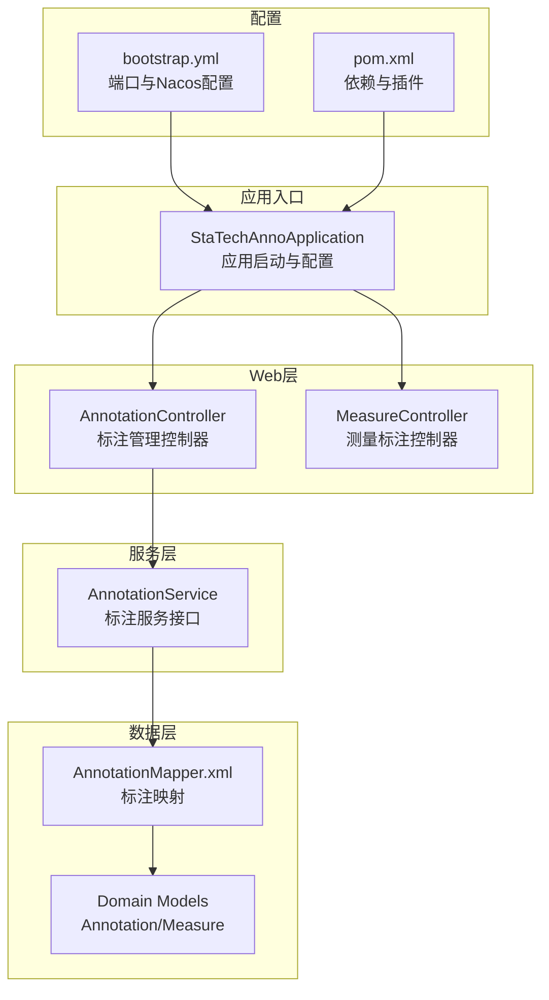
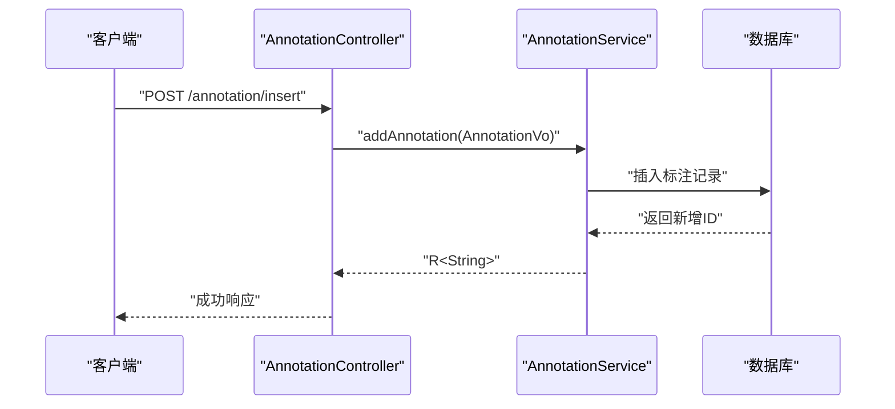
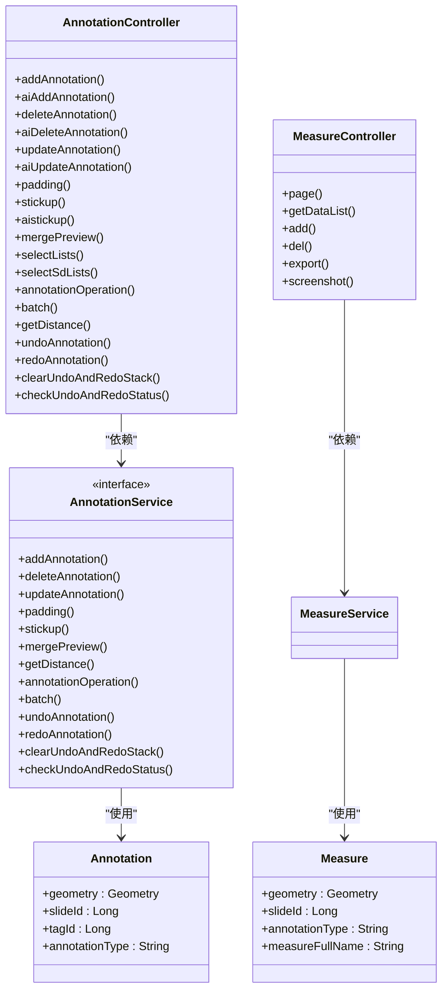

# HTTP RESTful API端点

<cite>
**本文引用的文件**
- [AnnotationController.java](file://src/main/java/cn/staitech/annotation/controller/AnnotationController.java)
- [MeasureController.java](file://src/main/java/cn/staitech/annotation/controller/MeasureController.java)
- [AnnotationService.java](file://src/main/java/cn/staitech/annotation/service/AnnotationService.java)
- [Annotation.java](file://src/main/java/cn/staitech/annotation/domain/Annotation.java)
- [Measure.java](file://src/main/java/cn/staitech/annotation/domain/Measure.java)
- [AnnotationAddReq.java](file://src/main/java/cn/staitech/annotation/vo/anno/AnnotationAddReq.java)
- [AnnotationUpdateVo.java](file://src/main/java/cn/staitech/annotation/vo/anno/AnnotationUpdateVo.java)
- [AnnotationDistanceReq.java](file://src/main/java/cn/staitech/annotation/vo/anno/AnnotationDistanceReq.java)
- [AnnotationBatchReq.java](file://src/main/java/cn/staitech/annotation/vo/anno/AnnotationBatchReq.java)
- [MeasureAddVo.java](file://src/main/java/cn/staitech/annotation/vo/measure/MeasureAddVo.java)
- [MeasureReq.java](file://src/main/java/cn/staitech/annotation/vo/measure/MeasureReq.java)
- [UndoRedoReq.java](file://src/main/java/cn/staitech/annotation/utils/annotation/UndoRedoReq.java)
- [StaTechAnnoApplication.java](file://src/main/java/cn/staitech/annotation/StaTechAnnoApplication.java)
- [bootstrap.yml](file://src/main/resources/bootstrap.yml)
- [AnnotationMapper.xml](file://src/main/resources/mapper/AnnotationMapper.xml)
- [pom.xml](file://pom.xml)
- [README.md](file://README.md)
</cite>

## 目录
1. [简介](#简介)
2. [项目结构](#项目结构)
3. [核心组件](#核心组件)
4. [架构总览](#架构总览)
5. [详细端点文档](#详细端点文档)
6. [依赖关系分析](#依赖关系分析)
7. [性能与并发特性](#性能与并发特性)
8. [故障排查指南](#故障排查指南)
9. [结论](#结论)
10. [附录](#附录)

## 简介
本文件为医学图像标注系统的HTTP RESTful API端点规范，覆盖标注管理、几何测量、批量操作、AI辅助标注、轮廓处理、撤销/重做等能力。文档基于实际控制器与领域模型生成，提供每个端点的HTTP方法、URL路径、请求参数、响应格式、状态码说明、错误处理策略、认证授权要求、参数验证规则及典型使用场景。

## 项目结构
系统采用Spring Boot微服务风格，通过注解驱动的REST控制器对外暴露HTTP接口，使用MyBatis-Plus进行数据持久化，集成Knife4j提供在线接口文档，使用JTS进行几何计算。

图表来源
- [StaTechAnnoApplication.java:1-51](file://src/main/java/cn/staitech/annotation/StaTechAnnoApplication.java#L1-L51)
- [AnnotationController.java:1-251](file://src/main/java/cn/staitech/annotation/controller/AnnotationController.java#L1-L251)
- [MeasureController.java:1-118](file://src/main/java/cn/staitech/annotation/controller/MeasureController.java#L1-L118)
- [AnnotationMapper.xml:1-9](file://src/main/resources/mapper/AnnotationMapper.xml#L1-L9)
- [Annotation.java:1-187](file://src/main/java/cn/staitech/annotation/domain/Annotation.java#L1-L187)
- [Measure.java:1-256](file://src/main/java/cn/staitech/annotation/domain/Measure.java#L1-L256)
- [bootstrap.yml:1-42](file://src/main/resources/bootstrap.yml#L1-L42)
- [pom.xml:1-200](file://pom.xml#L1-L200)

章节来源
- [StaTechAnnoApplication.java:1-51](file://src/main/java/cn/staitech/annotation/StaTechAnnoApplication.java#L1-L51)
- [bootstrap.yml:1-42](file://src/main/resources/bootstrap.yml#L1-L42)
- [pom.xml:1-200](file://pom.xml#L1-L200)

## 核心组件
- 控制器层：提供HTTP端点，负责参数接收、校验与调用服务层，并返回统一响应包装。
- 服务层：封装业务逻辑，包括标注增删改查、AI辅助标注、几何计算、批量操作、撤销/重做等。
- 数据模型：标注实体与测量实体，包含几何字段与业务字段。
- 配置：应用启动、端口、Nacos注册与Knife4j文档启用。

章节来源
- [AnnotationController.java:1-251](file://src/main/java/cn/staitech/annotation/controller/AnnotationController.java#L1-L251)
- [AnnotationService.java:1-44](file://src/main/java/cn/staitech/annotation/service/AnnotationService.java#L1-L44)
- [Annotation.java:1-187](file://src/main/java/cn/staitech/annotation/domain/Annotation.java#L1-L187)
- [Measure.java:1-256](file://src/main/java/cn/staitech/annotation/domain/Measure.java#L1-L256)

## 架构总览
系统通过控制器暴露REST接口，服务层协调数据访问与业务处理，底层使用JTS几何库进行空间计算，响应统一由通用返回体封装。

图表来源
- [AnnotationController.java:50-59](file://src/main/java/cn/staitech/annotation/controller/AnnotationController.java#L50-L59)
- [AnnotationService.java:19](file://src/main/java/cn/staitech/annotation/service/AnnotationService.java#L19)

## 详细端点文档

### 一、标注管理API

#### 1. 添加标注（标注）
- 方法与路径
  - POST /annotation/insert
- 请求体
  - 类型：JSON
  - 参数对象：[AnnotationAddReq.java:24-117](file://src/main/java/cn/staitech/annotation/vo/anno/AnnotationAddReq.java#L24-L117)
  - 关键字段
    - category_id：标签ID（Long，必填）
    - slide_id：切片ID（Long，必填）
    - location_type：轮廓类型（String，可选）
    - annotation_type：标注类型（AI/Draw）（String，可选）
    - contour：几何对象（Geometry，必填）
    - 其他：area、perimeter、description、jsonId等（可选）
- 响应
  - 成功：R<String>，返回新增标注的marking_id
  - 失败：R.fail(...)，包含错误信息
- 状态码
  - 200：成功
  - 400：参数校验失败
  - 500：服务器异常
- 错误处理
  - 必填字段缺失或非法时返回400
  - 业务异常按R.fail封装
- 认证与授权
  - 当前端点未显式声明拦截，但应用启用了安全相关注解，建议在网关或全局拦截器中统一鉴权
- 使用场景
  - 前端绘制或导入标注数据
- 示例
  - 请求示例（字段示意）
    - {
        "category_id": 1,
        "slide_id": 1001,
        "location_type": "Polygon",
        "annotation_type": "Draw",
        "contour": { "type": "Polygon", "coordinates": [[...]] },
        "area": "123.45",
        "perimeter": "45.67"
      }
  - 响应示例
    - {"code":200,"msg":"OK","data":"987654321"}

章节来源
- [AnnotationController.java:50-59](file://src/main/java/cn/staitech/annotation/controller/AnnotationController.java#L50-L59)
- [AnnotationAddReq.java:24-117](file://src/main/java/cn/staitech/annotation/vo/anno/AnnotationAddReq.java#L24-L117)

#### 2. AI辅助添加标注
- 方法与路径
  - POST /annotation/ai_insert
- 请求体
  - 类型：JSON
  - 参数对象：[AnnotationAddReq.java:24-117](file://src/main/java/cn/staitech/annotation/vo/anno/AnnotationAddReq.java#L24-L117)
- 响应
  - 成功：R<String>，返回新增标注的marking_id
- 状态码
  - 200：成功
  - 400：参数校验失败
  - 500：服务器异常
- 使用场景
  - AI模型生成标注后的入库
- 示例
  - 请求示例
    - {"category_id":2,"slide_id":1002,"annotation_type":"AI","contour":{...}}
  - 响应示例
    - {"code":200,"msg":"OK","data":"987654322"}

章节来源
- [AnnotationController.java:61-69](file://src/main/java/cn/staitech/annotation/controller/AnnotationController.java#L61-L69)
- [AnnotationAddReq.java:24-117](file://src/main/java/cn/staitech/annotation/vo/anno/AnnotationAddReq.java#L24-L117)

#### 3. 删除标注（标注）
- 方法与路径
  - POST /annotation/delete
- 请求体
  - JSON：{"marking_id": Long}
- 响应
  - 成功：R<String>，返回"OK"
- 状态码
  - 200：成功
  - 400：参数无效
  - 500：服务器异常
- 使用场景
  - 删除单个标注
- 示例
  - 请求
    - {"marking_id": 987654321}
  - 响应
    - {"code":200,"msg":"OK","data":"OK"}

章节来源
- [AnnotationController.java:83-89](file://src/main/java/cn/staitech/annotation/controller/AnnotationController.java#L83-L89)

#### 4. AI辅助删除标注
- 方法与路径
  - POST /annotation/ai_delete
- 请求体
  - JSON：{"marking_id": Long}
- 响应
  - 成功：R<String>，返回"OK"
- 使用场景
  - AI生成标注的删除
- 示例
  - 请求
    - {"marking_id": 987654322}
  - 响应
    - {"code":200,"msg":"OK","data":"OK"}

章节来源
- [AnnotationController.java:77-81](file://src/main/java/cn/staitech/annotation/controller/AnnotationController.java#L77-L81)

#### 5. 按切片批量删除标注
- 方法与路径
  - POST /annotation/deleteBySlide
- 请求体
  - JSON：数组[Long]，元素为slideId
- 响应
  - 成功：R<Boolean>，返回true/false
- 使用场景
  - 清理某切片的所有标注
- 示例
  - 请求
    - [1001,1002]
  - 响应
    - {"code":200,"msg":"OK","data":true}

章节来源
- [AnnotationController.java:92-95](file://src/main/java/cn/staitech/annotation/controller/AnnotationController.java#L92-L95)

#### 6. 更新标注
- 方法与路径
  - POST /annotation/update
- 请求体
  - 类型：JSON
  - 参数对象：[AnnotationUpdateVo.java:23-101](file://src/main/java/cn/staitech/annotation/vo/anno/AnnotationUpdateVo.java#L23-L101)
  - 关键字段
    - marking_id：主键（必填）
    - category_id：标签ID（可选）
    - contour：几何对象（可选）
    - location_type：轮廓类型（可选）
    - annotation_type：标注类型（可选）
    - 其他：area、perimeter、description等（可选）
- 响应
  - 成功：R<String>，返回"OK"
- 状态码
  - 200：成功
  - 400：参数校验失败
  - 500：服务器异常
- 使用场景
  - 修改标注属性或几何
- 示例
  - 请求
    - {"marking_id":987654321,"category_id":3,"contour":{...}}
  - 响应
    - {"code":200,"msg":"OK","data":"OK"}

章节来源
- [AnnotationController.java:97-102](file://src/main/java/cn/staitech/annotation/controller/AnnotationController.java#L97-L102)
- [AnnotationUpdateVo.java:23-101](file://src/main/java/cn/staitech/annotation/vo/anno/AnnotationUpdateVo.java#L23-L101)

#### 7. AI辅助更新标注
- 方法与路径
  - POST /annotation/ai_update
- 请求体
  - 类型：JSON
  - 参数对象：[AnnotationUpdateVo.java:23-101](file://src/main/java/cn/staitech/annotation/vo/anno/AnnotationUpdateVo.java#L23-L101)
- 响应
  - 成功：R<String>，返回"OK"
- 使用场景
  - AI生成标注的更新
- 示例
  - 请求
    - {"marking_id":987654322,"annotation_type":"AI",...}
  - 响应
    - {"code":200,"msg":"OK","data":"OK"}

章节来源
- [AnnotationController.java:104-110](file://src/main/java/cn/staitech/annotation/controller/AnnotationController.java#L104-L110)
- [AnnotationUpdateVo.java:23-101](file://src/main/java/cn/staitech/annotation/vo/anno/AnnotationUpdateVo.java#L23-L101)

#### 8. 填充轮廓
- 方法与路径
  - POST /annotation/padding
- 请求体
  - 类型：JSON
  - 参数对象：[AnnotationUpdateVo.java:23-101](file://src/main/java/cn/staitech/annotation/vo/anno/AnnotationUpdateVo.java#L23-L101)
- 响应
  - 成功：R<String>，返回"OK"
- 使用场景
  - 对标注进行轮廓填充处理
- 示例
  - 请求
    - {"marking_id":987654321,...}
  - 响应
    - {"code":200,"msg":"OK","data":"OK"}

章节来源
- [AnnotationController.java:112-116](file://src/main/java/cn/staitech/annotation/controller/AnnotationController.java#L112-L116)
- [AnnotationUpdateVo.java:23-101](file://src/main/java/cn/staitech/annotation/vo/anno/AnnotationUpdateVo.java#L23-L101)

#### 9. 复制/粘贴轮廓
- 方法与路径
  - POST /annotation/stickup
- 请求体
  - 类型：JSON
  - 参数对象：[AnnotationUpdateVo.java:23-101](file://src/main/java/cn/staitech/annotation/vo/anno/AnnotationUpdateVo.java#L23-L101)
- 响应
  - 成功：R<String>，返回"OK"
- 使用场景
  - 在不同标注间复制/粘贴轮廓
- 示例
  - 请求
    - {"marking_id":987654321,...}
  - 响应
    - {"code":200,"msg":"OK","data":"OK"}

章节来源
- [AnnotationController.java:118-123](file://src/main/java/cn/staitech/annotation/controller/AnnotationController.java#L118-L123)
- [AnnotationUpdateVo.java:23-101](file://src/main/java/cn/staitech/annotation/vo/anno/AnnotationUpdateVo.java#L23-L101)

#### 10. AI辅助复制/粘贴轮廓
- 方法与路径
  - POST /annotation/ai_stickup
- 请求体
  - 类型：JSON
  - 参数对象：[AnnotationUpdateVo.java:23-101](file://src/main/java/cn/staitech/annotation/vo/anno/AnnotationUpdateVo.java#L23-L101)
- 响应
  - 成功：R<String>，返回"OK"
- 使用场景
  - AI生成标注的复制/粘贴
- 示例
  - 请求
    - {"marking_id":987654322,...}
  - 响应
    - {"code":200,"msg":"OK","data":"OK"}

章节来源
- [AnnotationController.java:125-131](file://src/main/java/cn/staitech/annotation/controller/AnnotationController.java#L125-L131)
- [AnnotationUpdateVo.java:23-101](file://src/main/java/cn/staitech/annotation/vo/anno/AnnotationUpdateVo.java#L23-L101)

#### 11. 轮廓合并预览
- 方法与路径
  - POST /annotation/mergePreview
- 请求体
  - JSON：{"markingIdList": [Long, ...]}
- 响应
  - 成功：R<Geometry>，返回合并后的几何对象
- 使用场景
  - 合并多个标注轮廓以预览结果
- 示例
  - 请求
    - {"markingIdList":[987654321,987654322]}
  - 响应
    - {"code":200,"msg":"OK","data":{"type":"Polygon","coordinates":[[...]]}}

章节来源
- [AnnotationController.java:133-138](file://src/main/java/cn/staitech/annotation/controller/AnnotationController.java#L133-L138)

#### 12. 获取GeoJson标注数据
- 方法与路径
  - POST /annotation/selectLists
- 请求体
  - JSON：{"slide_id": Long, "contour_type": Integer（可选）}
- 响应
  - 成功：R<List<AnnotationFeature>>
- 使用场景
  - 前端渲染标注图层
- 示例
  - 请求
    - {"slide_id":1001,"contour_type":0}
  - 响应
    - {"code":200,"msg":"OK","data":[{"type":"Feature",...}]}

章节来源
- [AnnotationController.java:140-153](file://src/main/java/cn/staitech/annotation/controller/AnnotationController.java#L140-L153)

#### 13. 获取筛差数据（GeoJson）
- 方法与路径
  - POST /annotation/selectSdLists
- 请求体
  - JSON：[AnnotationSdReq]
- 响应
  - 成功：R<List<AnnotationSdFeature>>
- 使用场景
  - 展示筛差相关的标注
- 示例
  - 请求
    - {"slide_id":1001,...}
  - 响应
    - {"code":200,"msg":"OK","data":[{"type":"Feature",...}]}

章节来源
- [AnnotationController.java:158-164](file://src/main/java/cn/staitech/annotation/controller/AnnotationController.java#L158-L164)

#### 14. 合并/裁剪轮廓
- 方法与路径
  - POST /annotation/updateOperation
- 请求体
  - JSON：[AnnotationOperationReq]
- 响应
  - 成功：R<Geometry>，返回操作后的几何
- 使用场景
  - 对多个标注执行布尔运算
- 示例
  - 请求
    - {"operation":"UNION","ids":[987654321,987654322]}
  - 响应
    - {"code":200,"msg":"OK","data":{"type":"Polygon","coordinates":[[...]]}}

章节来源
- [AnnotationController.java:171-175](file://src/main/java/cn/staitech/annotation/controller/AnnotationController.java#L171-L175)

#### 15. 批量操作标注
- 方法与路径
  - POST /annotation/batch
- 请求体
  - JSON：[AnnotationBatchReq]
  - 包含slide_id与操作列表list，每项包含operation与annotationId
- 响应
  - 成功：R<List<AnnotationBatchRespVo>>
- 使用场景
  - 批量删除等操作
- 示例
  - 请求
    - {"slide_id":1001,"list":[{"operation":"DELETE","annotationId":987654321}]}
  - 响应
    - {"code":200,"msg":"OK","data":[{"operation":"DELETE","annotationId":987654321,"result":true}]}

章节来源
- [AnnotationController.java:177-192](file://src/main/java/cn/staitech/annotation/controller/AnnotationController.java#L177-L192)
- [AnnotationBatchReq.java:15-31](file://src/main/java/cn/staitech/annotation/vo/anno/AnnotationBatchReq.java#L15-L31)

#### 16. 查询标签是否被使用
- 方法与路径
  - POST /annotation/checkTagUsageStatus
- 请求参数
  - id：Long（标签ID）
- 响应
  - 成功：R<Boolean>
- 使用场景
  - 删除标签前检查引用
- 示例
  - 请求
    - ?id=1
  - 响应
    - {"code":200,"msg":"OK","data":false}

章节来源
- [AnnotationController.java:194-199](file://src/main/java/cn/staitech/annotation/controller/AnnotationController.java#L194-L199)

#### 17. 检查是否存在用户的标注数据
- 方法与路径
  - POST /annotation/checkUserOperation
- 请求体
  - JSON：{"userId": Long, "slideId": [Long,...]}
- 响应
  - 成功：R<Long>，返回数量
- 使用场景
  - 用户权限校验
- 示例
  - 请求
    - {"userId":101,"slideId":[1001,1002]}
  - 响应
    - {"code":200,"msg":"OK","data":2}

章节来源
- [AnnotationController.java:201-208](file://src/main/java/cn/staitech/annotation/controller/AnnotationController.java#L201-L208)

#### 18. 查询切片标注数量
- 方法与路径
  - POST /annotation/countAnnoBySlide/{slideId}
  - POST /annotation/countAnnoBySlides
- 请求参数
  - 路径参数：{slideId}
  - 或请求体：JSON数组[Long]
- 响应
  - 成功：R<Long>
- 使用场景
  - 统计与分页
- 示例
  - 请求
    - {"slideId":[1001,1002]}
  - 响应
    - {"code":200,"msg":"OK","data":10}

章节来源
- [AnnotationController.java:211-224](file://src/main/java/cn/staitech/annotation/controller/AnnotationController.java#L211-L224)

#### 19. 撤销标注
- 方法与路径
  - POST /annotation/undoAnnotation/{slideId}
- 请求参数
  - 路径参数：{slideId}
- 响应
  - 成功：R<Boolean>
- 使用场景
  - 撤销上一步标注操作
- 示例
  - 请求
    - /annotation/undoAnnotation/1001
  - 响应
    - {"code":200,"msg":"OK","data":true}

章节来源
- [AnnotationController.java:226-230](file://src/main/java/cn/staitech/annotation/controller/AnnotationController.java#L226-L230)
- [UndoRedoReq.java:14-17](file://src/main/java/cn/staitech/annotation/utils/annotation/UndoRedoReq.java#L14-L17)

#### 20. 重做标注
- 方法与路径
  - POST /annotation/redoAnnotation/{slideId}
- 请求参数
  - 路径参数：{slideId}
- 响应
  - 成功：R<Boolean>
- 使用场景
  - 重做被撤销的操作
- 示例
  - 请求
    - /annotation/redoAnnotation/1001
  - 响应
    - {"code":200,"msg":"OK","data":true}

章节来源
- [AnnotationController.java:232-236](file://src/main/java/cn/staitech/annotation/controller/AnnotationController.java#L232-L236)
- [UndoRedoReq.java:14-17](file://src/main/java/cn/staitech/annotation/utils/annotation/UndoRedoReq.java#L14-L17)

#### 21. 清除撤销/重做栈
- 方法与路径
  - POST /annotation/clear/{slideId}
- 请求参数
  - 路径参数：{slideId}
- 响应
  - 成功：R<Boolean>
- 使用场景
  - 清理历史操作记录
- 示例
  - 请求
    - /annotation/clear/1001
  - 响应
    - {"code":200,"msg":"OK","data":true}

章节来源
- [AnnotationController.java:238-242](file://src/main/java/cn/staitech/annotation/controller/AnnotationController.java#L238-L242)
- [UndoRedoReq.java:14-17](file://src/main/java/cn/staitech/annotation/utils/annotation/UndoRedoReq.java#L14-L17)

#### 22. 检查撤销/重做状态
- 方法与路径
  - POST /annotation/checkUndoAndRedoStatus/{slideId}
- 请求参数
  - 路径参数：{slideId}
- 响应
  - 成功：R<Boolean>
- 使用场景
  - 判断是否可撤销/重做
- 示例
  - 请求
    - /annotation/checkUndoAndRedoStatus/1001
  - 响应
    - {"code":200,"msg":"OK","data":true}

章节来源
- [AnnotationController.java:244-248](file://src/main/java/cn/staitech/annotation/controller/AnnotationController.java#L244-L248)
- [UndoRedoReq.java:14-17](file://src/main/java/cn/staitech/annotation/utils/annotation/UndoRedoReq.java#L14-L17)

#### 23. 几何距离计算
- 方法与路径
  - POST /annotation/getDistance
- 请求体
  - JSON：[AnnotationDistanceReq.java:15-33](file://src/main/java/cn/staitech/annotation/vo/anno/AnnotationDistanceReq.java#L15-L33)
  - 字段：annotationIdOne、annotationIdTwo、annotationTypeOne、annotationTypeTwo
- 响应
  - 成功：R<AnnotationDistanceVo>
- 使用场景
  - 计算两个标注之间的最小距离
- 示例
  - 请求
    - {"annotationIdOne":987654321,"annotationIdTwo":987654322,"annotationTypeOne":"Draw","annotationTypeTwo":"Draw"}
  - 响应
    - {"code":200,"msg":"OK","data":{"distance":123.45,"coordinates":[[...],[...]]}}

章节来源
- [AnnotationController.java:71-75](file://src/main/java/cn/staitech/annotation/controller/AnnotationController.java#L71-L75)
- [AnnotationDistanceReq.java:15-33](file://src/main/java/cn/staitech/annotation/vo/anno/AnnotationDistanceReq.java#L15-L33)

### 二、几何测量API

#### 1. 分页获取测量数据
- 方法与路径
  - POST /measure/page
- 请求体
  - JSON：[MeasureReq.java:16-24](file://src/main/java/cn/staitech/annotation/vo/measure/MeasureReq.java#L16-L24)
  - 字段：slideId（必填）、measureFullName（可选）
- 响应
  - 成功：R<CustomPage<MeasureVo>>
- 使用场景
  - 列表展示测量结果
- 示例
  - 请求
    - {"slideId":1001,"measureFullName":"L"}
  - 响应
    - {"code":200,"msg":"OK","data":{"records":[{"measureFullName":"L",...}],...}}

章节来源
- [MeasureController.java:41-68](file://src/main/java/cn/staitech/annotation/controller/MeasureController.java#L41-L68)
- [MeasureReq.java:16-24](file://src/main/java/cn/staitech/annotation/vo/measure/MeasureReq.java#L16-L24)

#### 2. 获取测量GeoJson数据
- 方法与路径
  - GET /measure/getDataList?slideId={slideId}
- 请求参数
  - slideId：Long（切片ID，必填）
- 响应
  - 成功：R<List<AnnotationFeature>>
- 使用场景
  - 前端渲染测量图层
- 示例
  - 请求
    - /measure/getDataList?slideId=1001
  - 响应
    - {"code":200,"msg":"OK","data":[{"type":"Feature",...}]}

章节来源
- [MeasureController.java:70-79](file://src/main/java/cn/staitech/annotation/controller/MeasureController.java#L70-L79)

#### 3. 添加测量
- 方法与路径
  - POST /measure/add
- 请求体
  - JSON：[MeasureAddVo.java:26-173](file://src/main/java/cn/staitech/annotation/vo/measure/MeasureAddVo.java#L26-L173)
  - 字段：slideId、annotationType、area、perimeter、number、measureType、measureRelation、measureName、measureNumber、meanDistance、maxDistance、minDistance、innerAngle、exteriorAngle、centerPoint、locationType、radius、contour、measureFullName等
- 响应
  - 成功：R<String>，返回新增测量的marking_id
- 使用场景
  - 手动或自动测量标注
- 示例
  - 请求
    - {"slideId":1001,"annotationType":"Measure","locationType":"LineString",...}
  - 响应
    - {"code":200,"msg":"OK","data":"123456789"}

章节来源
- [MeasureController.java:81-93](file://src/main/java/cn/staitech/annotation/controller/MeasureController.java#L81-L93)
- [MeasureAddVo.java:26-173](file://src/main/java/cn/staitech/annotation/vo/measure/MeasureAddVo.java#L26-L173)

#### 4. 删除测量
- 方法与路径
  - POST /measure/del
- 请求体
  - JSON：{"marking_id": Long}
- 响应
  - 成功：R<String>，返回"OK"
- 使用场景
  - 删除单个测量
- 示例
  - 请求
    - {"marking_id":123456789}
  - 响应
    - {"code":200,"msg":"OK","data":"OK"}

章节来源
- [MeasureController.java:95-100](file://src/main/java/cn/staitech/annotation/controller/MeasureController.java#L95-L100)

#### 5. 导出测量Excel
- 方法与路径
  - POST /measure/export
- 请求体
  - JSON：{"slideId": Long}
- 响应
  - 成功：无（触发下载）
- 使用场景
  - 导出某切片的测量结果
- 示例
  - 请求
    - {"slideId":1001}
  - 响应
    - 200，触发文件下载

章节来源
- [MeasureController.java:103-108](file://src/main/java/cn/staitech/annotation/controller/MeasureController.java#L103-L108)

#### 6. 截图（占位）
- 方法与路径
  - POST /measure/screenshot
- 请求体
  - JSON：[ScreenshotReq]
- 响应
  - 成功：R（空响应体）
- 使用场景
  - 触发截图流程（具体实现由后端服务处理）
- 示例
  - 请求
    - {}
  - 响应
    - {"code":200,"msg":"OK"}

章节来源
- [MeasureController.java:111-116](file://src/main/java/cn/staitech/annotation/controller/MeasureController.java#L111-L116)

## 依赖关系分析

图表来源
- [AnnotationController.java:1-251](file://src/main/java/cn/staitech/annotation/controller/AnnotationController.java#L1-L251)
- [MeasureController.java:1-118](file://src/main/java/cn/staitech/annotation/controller/MeasureController.java#L1-L118)
- [AnnotationService.java:1-44](file://src/main/java/cn/staitech/annotation/service/AnnotationService.java#L1-L44)
- [Annotation.java:1-187](file://src/main/java/cn/staitech/annotation/domain/Annotation.java#L1-L187)
- [Measure.java:1-256](file://src/main/java/cn/staitech/annotation/domain/Measure.java#L1-L256)

章节来源
- [AnnotationController.java:1-251](file://src/main/java/cn/staitech/annotation/controller/AnnotationController.java#L1-L251)
- [MeasureController.java:1-118](file://src/main/java/cn/staitech/annotation/controller/MeasureController.java#L1-L118)
- [AnnotationService.java:1-44](file://src/main/java/cn/staitech/annotation/service/AnnotationService.java#L1-L44)
- [Annotation.java:1-187](file://src/main/java/cn/staitech/annotation/domain/Annotation.java#L1-L187)
- [Measure.java:1-256](file://src/main/java/cn/staitech/annotation/domain/Measure.java#L1-L256)

## 性能与并发特性
- JTS几何计算：标注合并、距离计算、布尔运算等涉及复杂几何计算，建议在批量操作时控制批大小，避免长时间阻塞。
- 分页查询：测量列表已内置分页，建议前端合理设置页码与大小。
- 并发控制：标注更新与批量操作可能涉及高并发写入，建议结合数据库事务与锁策略，必要时引入队列异步处理。
- 缓存策略：对于只读的标注/测量数据，可在网关或服务层增加缓存以降低数据库压力。

## 故障排查指南
- 参数校验失败
  - 现象：返回400，提示参数非法
  - 排查：确认必填字段（如slide_id、contour、marking_id等）是否缺失或类型不符
- 业务异常
  - 现象：返回R.fail(...)
  - 排查：查看服务层抛出的具体异常信息，定位数据一致性或几何合法性问题
- 几何计算异常
  - 现象：合并/距离计算失败
  - 排查：检查contour是否为有效几何对象；确保坐标系一致
- 权限与认证
  - 现象：接口被拒绝
  - 排查：确认网关或全局拦截器中的认证与授权策略

章节来源
- [AnnotationController.java:50-59](file://src/main/java/cn/staitech/annotation/controller/AnnotationController.java#L50-L59)
- [AnnotationController.java:71-75](file://src/main/java/cn/staitech/annotation/controller/AnnotationController.java#L71-L75)
- [MeasureController.java:81-93](file://src/main/java/cn/staitech/annotation/controller/MeasureController.java#L81-L93)

## 结论
本文档基于实际代码生成了标注管理与几何测量的完整HTTP API规范，覆盖了CRUD、AI辅助标注、轮廓处理、批量操作、撤销/重做与几何计算等核心能力。建议在生产环境中结合网关统一鉴权、接入缓存与异步队列以提升性能与稳定性。

## 附录

### A. 统一响应结构
- 字段
  - code：状态码（200表示成功）
  - msg：消息
  - data：业务数据（可能为字符串、对象或集合）

### B. 端口与部署
- 默认端口：9998
- Knife4j在线文档：启用
- Nacos注册与配置中心：已配置

章节来源
- [bootstrap.yml:1-42](file://src/main/resources/bootstrap.yml#L1-L42)
- [StaTechAnnoApplication.java:1-51](file://src/main/java/cn/staitech/annotation/StaTechAnnoApplication.java#L1-L51)
- [README.md:1-95](file://README.md#L1-L95)