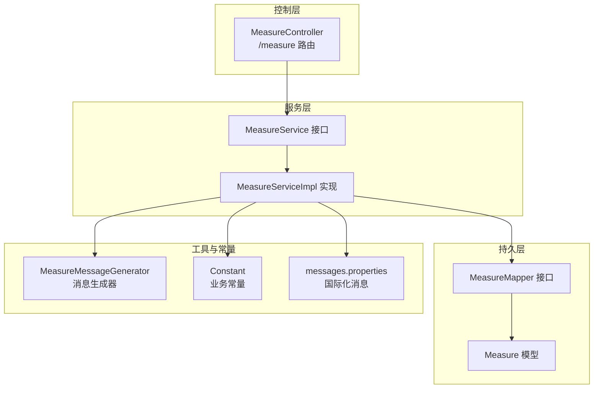
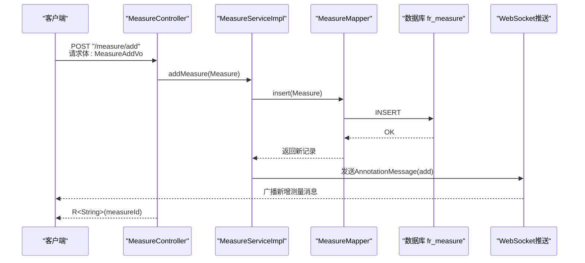
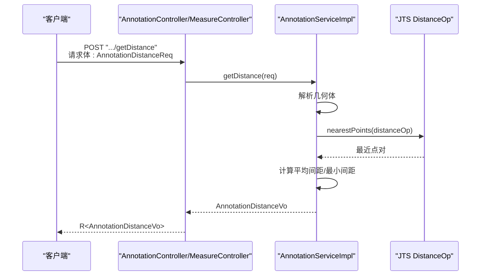
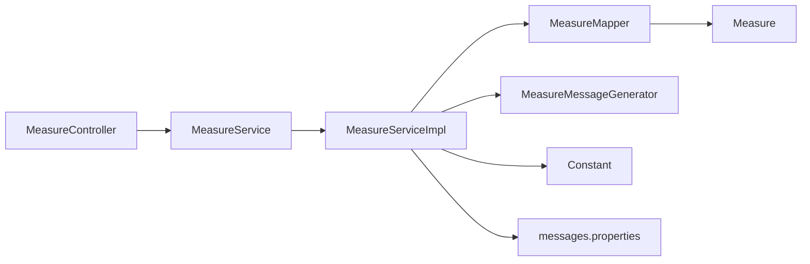
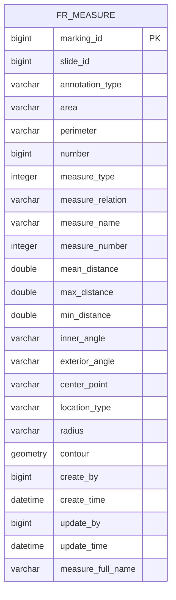

# 几何测量API

<cite>
**本文引用的文件**
- [MeasureController.java](file://src/main/java/cn/staitech/annotation/controller/MeasureController.java)
- [MeasureService.java](file://src/main/java/cn/staitech/annotation/service/MeasureService.java)
- [MeasureServiceImpl.java](file://src/main/java/cn/staitech/annotation/service/impl/MeasureServiceImpl.java)
- [Measure.java](file://src/main/java/cn/staitech/annotation/domain/Measure.java)
- [MeasureMapper.java](file://src/main/java/cn/staitech/annotation/mapper/MeasureMapper.java)
- [MeasureReq.java](file://src/main/java/cn/staitech/annotation/vo/measure/MeasureReq.java)
- [MeasureAddVo.java](file://src/main/java/cn/staitech/annotation/vo/measure/MeasureAddVo.java)
- [DelMeasureReq.java](file://src/main/java/cn/staitech/annotation/vo/measure/DelMeasureReq.java)
- [ExportSlideReq.java](file://src/main/java/cn/staitech/annotation/vo/measure/ExportSlideReq.java)
- [AnnotationDistanceReq.java](file://src/main/java/cn/staitech/annotation/vo/anno/AnnotationDistanceReq.java)
- [AnnotationDistanceVo.java](file://src/main/java/cn/staitech/annotation/vo/anno/AnnotationDistanceVo.java)
- [MeasureMessageGenerator.java](file://src/main/java/cn/staitech/annotation/utils/measure/MeasureMessageGenerator.java)
- [Constant.java](file://src/main/java/cn/staitech/annotation/constant/Constant.java)
- [messages.properties](file://src/main/resources/i18n/messages.properties)
</cite>

## 目录
1. [简介](#简介)
2. [项目结构](#项目结构)
3. [核心组件](#核心组件)
4. [架构总览](#架构总览)
5. [详细组件分析](#详细组件分析)
6. [依赖分析](#依赖分析)
7. [性能考虑](#性能考虑)
8. [故障排除指南](#故障排除指南)
9. [结论](#结论)
10. [附录](#附录)

## 简介
本文件为几何测量API的详细端点文档，覆盖以下能力：
- 距离计算API：获取两轮廓之间的间距与最近点信息
- 测量数据管理API：新增测量、删除测量、分页查询测量列表、导出切片测量数据
- 测量数据模型：包含面积、周长、间距统计、角度、中心点、半径等几何属性
- 数据导出：支持按切片导出测量结果为Excel，并根据语言环境输出中英文标题

本规范提供HTTP方法、URL路径、请求参数、响应格式、状态码说明、错误处理、参数校验规则、认证授权要求以及典型使用场景。

## 项目结构
后端采用Spring Boot + MyBatis-Plus架构，控制器层负责REST接口，服务层封装业务逻辑，领域模型映射数据库表，VO类用于请求/响应参数传递，工具类负责消息生成与WebSocket推送。

图表来源
- [MeasureController.java:1-118](file://src/main/java/cn/staitech/annotation/controller/MeasureController.java#L1-L118)
- [MeasureService.java:1-22](file://src/main/java/cn/staitech/annotation/service/MeasureService.java#L1-L22)
- [MeasureServiceImpl.java:1-161](file://src/main/java/cn/staitech/annotation/service/impl/MeasureServiceImpl.java#L1-L161)
- [MeasureMapper.java:1-19](file://src/main/java/cn/staitech/annotation/mapper/MeasureMapper.java#L1-L19)
- [Measure.java:1-256](file://src/main/java/cn/staitech/annotation/domain/Measure.java#L1-L256)
- [MeasureMessageGenerator.java:1-128](file://src/main/java/cn/staitech/annotation/utils/measure/MeasureMessageGenerator.java#L1-L128)
- [Constant.java:1-80](file://src/main/java/cn/staitech/annotation/constant/Constant.java#L1-L80)
- [messages.properties:1-328](file://src/main/resources/i18n/messages.properties#L1-L328)

章节来源
- [MeasureController.java:1-118](file://src/main/java/cn/staitech/annotation/controller/MeasureController.java#L1-L118)
- [MeasureService.java:1-22](file://src/main/java/cn/staitech/annotation/service/MeasureService.java#L1-L22)
- [MeasureServiceImpl.java:1-161](file://src/main/java/cn/staitech/annotation/service/impl/MeasureServiceImpl.java#L1-L161)
- [MeasureMapper.java:1-19](file://src/main/java/cn/staitech/annotation/mapper/MeasureMapper.java#L1-L19)
- [Measure.java:1-256](file://src/main/java/cn/staitech/annotation/domain/Measure.java#L1-L256)
- [MeasureMessageGenerator.java:1-128](file://src/main/java/cn/staitech/annotation/utils/measure/MeasureMessageGenerator.java#L1-L128)
- [Constant.java:1-80](file://src/main/java/cn/staitech/annotation/constant/Constant.java#L1-L80)
- [messages.properties:1-328](file://src/main/resources/i18n/messages.properties#L1-L328)

## 核心组件
- 控制器：提供REST接口，接收请求参数，调用服务层执行业务，返回统一响应包装R<T>
- 服务接口与实现：封装新增、删除、分页查询、导出等业务逻辑，集成WebSocket消息推送
- 持久层：基于MyBatis-Plus的Mapper接口，访问fr_measure表
- 领域模型：Measure实体映射几何测量数据，包含面积、周长、间距、角度、中心点、半径、几何体等字段
- 工具类：生成GeoJSON Feature与AnnotationMessage，推送至WebSocket客户端
- 国际化：通过messages.properties提供错误码与文案

章节来源
- [MeasureController.java:1-118](file://src/main/java/cn/staitech/annotation/controller/MeasureController.java#L1-L118)
- [MeasureService.java:1-22](file://src/main/java/cn/staitech/annotation/service/MeasureService.java#L1-L22)
- [MeasureServiceImpl.java:1-161](file://src/main/java/cn/staitech/annotation/service/impl/MeasureServiceImpl.java#L1-L161)
- [Measure.java:1-256](file://src/main/java/cn/staitech/annotation/domain/Measure.java#L1-L256)
- [MeasureMessageGenerator.java:1-128](file://src/main/java/cn/staitech/annotation/utils/measure/MeasureMessageGenerator.java#L1-L128)
- [messages.properties:1-328](file://src/main/resources/i18n/messages.properties#L1-L328)

## 架构总览
下图展示从客户端到数据库的数据流与消息推送链路：

图表来源
- [MeasureController.java:81-93](file://src/main/java/cn/staitech/annotation/controller/MeasureController.java#L81-L93)
- [MeasureServiceImpl.java:59-81](file://src/main/java/cn/staitech/annotation/service/impl/MeasureServiceImpl.java#L59-L81)
- [MeasureMapper.java:12-14](file://src/main/java/cn/staitech/annotation/mapper/MeasureMapper.java#L12-L14)
- [MeasureMessageGenerator.java:29-38](file://src/main/java/cn/staitech/annotation/utils/measure/MeasureMessageGenerator.java#L29-L38)

## 详细组件分析

### 距离计算API
- 功能概述：计算两个标注轮廓之间的最短距离、平均间距与最近点对
- 请求参数：annotationIdOne、annotationIdTwo、annotationTypeOne、annotationTypeTwo
- 响应内容：contourTypeOne、contourTypeTwo（最近点）、meanDistance、minDistance
- 错误处理：未找到标注数据、无法计算最近点时抛出相应异常
- 参数校验：四个字段均为必填
- 认证授权：需具备标注操作权限（具体以网关/安全策略为准）

图表来源
- [AnnotationDistanceReq.java:14-33](file://src/main/java/cn/staitech/annotation/vo/anno/AnnotationDistanceReq.java#L14-L33)
- [AnnotationDistanceVo.java:14-31](file://src/main/java/cn/staitech/annotation/vo/anno/AnnotationDistanceVo.java#L14-L31)

章节来源
- [AnnotationDistanceReq.java:1-34](file://src/main/java/cn/staitech/annotation/vo/anno/AnnotationDistanceReq.java#L1-L34)
- [AnnotationDistanceVo.java:1-31](file://src/main/java/cn/staitech/annotation/vo/anno/AnnotationDistanceVo.java#L1-L31)

### 测量数据管理API

#### 新增测量 /measure/add
- 方法与路径：POST /measure/add
- 请求体：MeasureAddVo
  - slide_id：切片ID（必填）
  - annotation_type：标注类型（Measure）
  - location_type：几何类型（LineString/Polygon/point/pc/p/L）
  - geometry：几何体（必填且必须为简单几何）
  - area/perimeter/radius/centerPoint/innerAngle/exteriorAngle：几何属性
  - meanDistance/maxDistance/minDistance：间距统计
  - measureName/measurFullName/number/measureNumber/measureType/measureRelation：测量标识与关系
- 响应：R<String>，返回新增测量的marking_id
- 状态码：200 成功；400 参数无效；500 服务器异常
- 错误处理：参数非法、几何不合法、写入失败
- 参数校验：geometry非空且为简单几何；必填字段校验由校验框架驱动
- 认证授权：需登录用户，创建人字段自动填充当前用户ID

章节来源
- [MeasureController.java:81-93](file://src/main/java/cn/staitech/annotation/controller/MeasureController.java#L81-L93)
- [MeasureServiceImpl.java:59-81](file://src/main/java/cn/staitech/annotation/service/impl/MeasureServiceImpl.java#L59-L81)
- [MeasureAddVo.java:1-174](file://src/main/java/cn/staitech/annotation/vo/measure/MeasureAddVo.java#L1-L174)
- [Measure.java:1-256](file://src/main/java/cn/staitech/annotation/domain/Measure.java#L1-L256)

#### 删除测量 /measure/del
- 方法与路径：POST /measure/del
- 请求体：DelMeasureReq
  - marking_id：测量ID（必填）
- 响应：R<String>，提示操作成功或失败
- 状态码：200 成功；400 参数无效；500 服务器异常
- 错误处理：ID为空、未找到测量数据
- 参数校验：marking_id非空
- 认证授权：需登录用户

章节来源
- [MeasureController.java:95-100](file://src/main/java/cn/staitech/annotation/controller/MeasureController.java#L95-L100)
- [MeasureServiceImpl.java:83-96](file://src/main/java/cn/staitech/annotation/service/impl/MeasureServiceImpl.java#L83-L96)
- [DelMeasureReq.java:1-10](file://src/main/java/cn/staitech/annotation/vo/measure/DelMeasureReq.java#L1-L10)

#### 分页查询测量 /measure/page
- 方法与路径：POST /measure/page
- 请求体：MeasureReq
  - slideId（必填）：切片ID
  - measureFullName：测量名称过滤
- 响应：R<CustomPage<MeasureVo>>
  - 若存在非点几何：返回分页记录，并在末尾追加点计数统计项
  - 若仅有点几何：返回点计数统计项
- 状态码：200 成功；400 参数无效；500 服务器异常
- 参数校验：slideId必填
- 认证授权：需登录用户

章节来源
- [MeasureController.java:41-68](file://src/main/java/cn/staitech/annotation/controller/MeasureController.java#L41-L68)
- [MeasureReq.java:1-25](file://src/main/java/cn/staitech/annotation/vo/measure/MeasureReq.java#L1-L25)

#### 获取GeoJSON数据 /measure/getDataList
- 方法与路径：GET /measure/getDataList?slideId={id}
- 查询参数：slideId（必填）
- 响应：R<List<AnnotationFeature>>
  - 将fr_measure中的几何记录转换为GeoJSON Feature集合
- 状态码：200 成功；400 参数无效；500 服务器异常
- 认证授权：需登录用户

章节来源
- [MeasureController.java:70-79](file://src/main/java/cn/staitech/annotation/controller/MeasureController.java#L70-L79)
- [MeasureMessageGenerator.java:40-54](file://src/main/java/cn/staitech/annotation/utils/measure/MeasureMessageGenerator.java#L40-L54)

### 导出API

#### 导出切片测量数据 /measure/export
- 方法与路径：POST /measure/export
- 请求体：ExportSlideReq
  - slideId：切片ID（必填）
- 响应：直接输出Excel文件（Content-Type: application/vnd.ms-excel）
  - 中文标题：标注测量详情.xlsx
  - 英文标题：根据语言环境输出英文标题
  - 内容：非点几何测量记录 + 点计数统计项
- 状态码：200 成功；400 参数无效；500 服务器异常
- 认证授权：需登录用户

章节来源
- [MeasureController.java:103-108](file://src/main/java/cn/staitech/annotation/controller/MeasureController.java#L103-L108)
- [MeasureServiceImpl.java:98-128](file://src/main/java/cn/staitech/annotation/service/impl/MeasureServiceImpl.java#L98-L128)
- [ExportSlideReq.java:1-10](file://src/main/java/cn/staitech/annotation/vo/measure/ExportSlideReq.java#L1-L10)
- [messages.properties:25](file://src/main/resources/i18n/messages.properties#L25)

### 截图API（辅助）
- 方法与路径：POST /measure/screenshot
- 请求体：ScreenshotReq
- 响应：R<Void>，空响应体
- 用途：用于Viewer页面截图流程的占位接口
- 状态码：200 成功；500 服务器异常
- 认证授权：需登录用户

章节来源
- [MeasureController.java:111-116](file://src/main/java/cn/staitech/annotation/controller/MeasureController.java#L111-L116)

## 依赖分析
- 控制器依赖服务接口，服务实现依赖Mapper与数据库
- 服务实现依赖WebSocket处理器推送消息，依赖远程用户服务渲染用户名
- 工具类依赖JTS几何库生成GeoJSON与AnnotationMessage
- 国际化消息提供错误码与文案

图表来源
- [MeasureController.java:1-118](file://src/main/java/cn/staitech/annotation/controller/MeasureController.java#L1-L118)
- [MeasureService.java:1-22](file://src/main/java/cn/staitech/annotation/service/MeasureService.java#L1-L22)
- [MeasureServiceImpl.java:1-161](file://src/main/java/cn/staitech/annotation/service/impl/MeasureServiceImpl.java#L1-L161)
- [MeasureMapper.java:1-19](file://src/main/java/cn/staitech/annotation/mapper/MeasureMapper.java#L1-L19)
- [Measure.java:1-256](file://src/main/java/cn/staitech/annotation/domain/Measure.java#L1-L256)
- [MeasureMessageGenerator.java:1-128](file://src/main/java/cn/staitech/annotation/utils/measure/MeasureMessageGenerator.java#L1-L128)
- [Constant.java:1-80](file://src/main/java/cn/staitech/annotation/constant/Constant.java#L1-L80)
- [messages.properties:1-328](file://src/main/resources/i18n/messages.properties#L1-L328)

## 性能考虑
- 批量导出：导出前先查询非点几何与点计数，避免一次性加载全部数据；使用流式写出Excel
- WebSocket推送：新增/删除测量后仅推送增量消息，减少广播压力
- 几何计算：距离计算采用采样点方式估算平均间距，复杂度与采样点数量成正比，建议合理设置采样密度
- 分页查询：对非点几何进行分页，点计数单独统计，避免全表扫描

## 故障排除指南
- 参数无效（ARGUMENT_INVALID）：检查请求体字段是否为空或格式错误
- 未找到标注数据（NO_ANNOTATION_DATA）：确认标注ID与类型正确
- 无法计算最近点（FAILED_TO_CALCULATE_NEAREST_POINTS）：几何为空或退化，检查几何有效性
- 操作成功/失败：参考响应消息，必要时查看日志定位异常

章节来源
- [messages.properties:22](file://src/main/resources/i18n/messages.properties#L22)
- [messages.properties:131](file://src/main/resources/i18n/messages.properties#L131)
- [messages.properties:1](file://src/main/resources/i18n/messages.properties#L1)
- [MeasureServiceImpl.java:63-65](file://src/main/java/cn/staitech/annotation/service/impl/MeasureServiceImpl.java#L63-L65)
- [MeasureServiceImpl.java:86-91](file://src/main/java/cn/staitech/annotation/service/impl/MeasureServiceImpl.java#L86-L91)

## 结论
本API提供了完整的几何测量能力：从距离计算到测量数据的增删改查与导出，配合WebSocket推送实现多端同步。通过严格的参数校验与国际化消息，提升了系统的健壮性与可维护性。建议在生产环境中结合网关鉴权与审计日志，确保接口安全与可追溯。

## 附录

### 数据模型与字段说明
- fr_measure 表字段映射至 Measure 实体，关键字段包括：
  - 标识：marking_id、slide_id、annotation_type、measureFullName、number
  - 几何：location_type、geometry（JTS Geometry）
  - 统计：area、perimeter、radius、centerPoint、meanDistance、maxDistance、minDistance
  - 角度：innerAngle、exteriorAngle
  - 关系：measureType、measureRelation、measureName、measureNumber
  - 时间与用户：createTime、updateTime、createBy、updateBy

图表来源
- [Measure.java:20-154](file://src/main/java/cn/staitech/annotation/domain/Measure.java#L20-L154)

### 常量与消息
- 业务常量：标注类型（Measure/AI/Draw）、操作动作（add/update/delete）、操作类型（INSERT/UPDATE/DELETE）
- 国际化消息：提供错误码与文案，如参数异常、未找到标注数据、导出标题等

章节来源
- [Constant.java:44-58](file://src/main/java/cn/staitech/annotation/constant/Constant.java#L44-L58)
- [messages.properties:25](file://src/main/resources/i18n/messages.properties#L25)
- [messages.properties:22](file://src/main/resources/i18n/messages.properties#L22)
- [messages.properties:131](file://src/main/resources/i18n/messages.properties#L131)