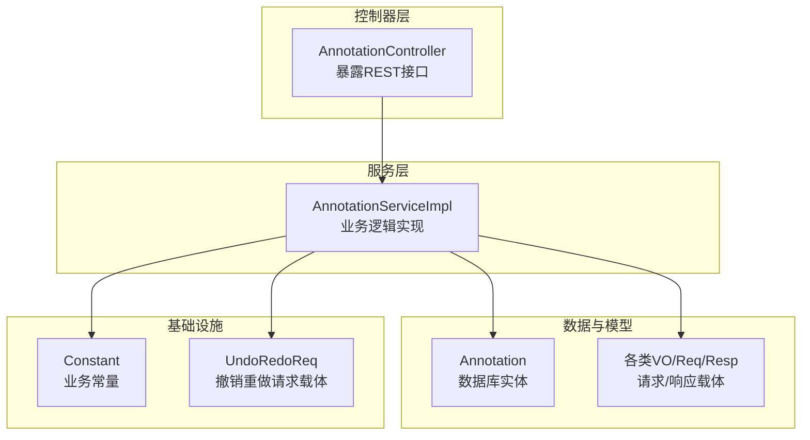
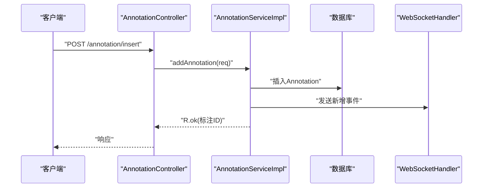
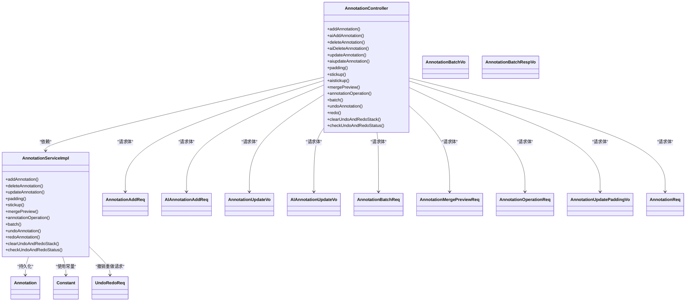

# 标注管理API

<cite>
**本文引用的文件**
- [AnnotationController.java](file://src/main/java/cn/staitech/annotation/controller/AnnotationController.java)
- [AnnotationServiceImpl.java](file://src/main/java/cn/staitech/annotation/service/impl/AnnotationServiceImpl.java)
- [Annotation.java](file://src/main/java/cn/staitech/annotation/domain/Annotation.java)
- [AnnotationAddReq.java](file://src/main/java/cn/staitech/annotation/vo/anno/AnnotationAddReq.java)
- [AIAnnotationAddReq.java](file://src/main/java/cn/staitech/annotation/vo/anno/AIAnnotationAddReq.java)
- [AnnotationUpdateVo.java](file://src/main/java/cn/staitech/annotation/vo/anno/AnnotationUpdateVo.java)
- [AIAnnotationUpdateVo.java](file://src/main/java/cn/staitech/annotation/vo/anno/AIAnnotationUpdateVo.java)
- [DeleteAnnotationReq.java](file://src/main/java/cn/staitech/annotation/vo/anno/DeleteAnnotationReq.java)
- [AIDeleteAnnotationReq.java](file://src/main/java/cn/staitech/annotation/vo/anno/AIDeleteAnnotationReq.java)
- [AnnotationBatchReq.java](file://src/main/java/cn/staitech/annotation/vo/anno/AnnotationBatchReq.java)
- [AnnotationBatchVo.java](file://src/main/java/cn/staitech/annotation/vo/anno/AnnotationBatchVo.java)
- [AnnotationBatchRespVo.java](file://src/main/java/cn/staitech/annotation/vo/anno/AnnotationBatchRespVo.java)
- [AnnotationMergePreviewReq.java](file://src/main/java/cn/staitech/annotation/vo/anno/AnnotationMergePreviewReq.java)
- [AnnotationOperationReq.java](file://src/main/java/cn/staitech/annotation/vo/anno/AnnotationOperationReq.java)
- [AnnotationUpdatePaddingVo.java](file://src/main/java/cn/staitech/annotation/vo/anno/AnnotationUpdatePaddingVo.java)
- [AnnotationReq.java](file://src/main/java/cn/staitech/annotation/vo/anno/AnnotationReq.java)
- [Constant.java](file://src/main/java/cn/staitech/annotation/constant/Constant.java)
- [UndoRedoReq.java](file://src/main/java/cn/staitech/annotation/utils/annotation/UndoRedoReq.java)
</cite>

## 目录
1. [简介](#简介)
2. [项目结构](#项目结构)
3. [核心组件](#核心组件)
4. [架构总览](#架构总览)
5. [详细端点文档](#详细端点文档)
6. [依赖关系分析](#依赖关系分析)
7. [性能与扩展性](#性能与扩展性)
8. [故障排查指南](#故障排查指南)
9. [结论](#结论)

## 简介
本文件为标注管理API的完整端点文档，覆盖标注CRUD（添加/删除/更新）、AI标注、轮廓处理（填充、复制粘贴、合并预览、合并裁剪）、批量操作、撤销/重做/清除/状态检查等全部能力。文档提供每个端点的HTTP方法、URL路径、请求参数、响应格式、状态码说明、错误处理策略、参数校验规则、认证授权要求及典型使用场景，帮助前后端协作与集成。

## 项目结构
标注管理模块采用典型的分层架构：
- 控制器层：统一暴露REST接口，负责参数接收、日志审计与响应封装
- 服务层：实现业务逻辑，包括几何运算、撤销重做、远程标签服务调用、WebSocket广播
- 数据模型与VO：定义数据库实体与对外请求/响应载体
- 常量与工具：统一业务常量、几何运算辅助、撤销重做事件管理

图表来源
- [AnnotationController.java:42-250](file://src/main/java/cn/staitech/annotation/controller/AnnotationController.java#L42-L250)
- [AnnotationServiceImpl.java:46-719](file://src/main/java/cn/staitech/annotation/service/impl/AnnotationServiceImpl.java#L46-L719)
- [Annotation.java:23-112](file://src/main/java/cn/staitech/annotation/domain/Annotation.java#L23-L112)
- [Constant.java:9-79](file://src/main/java/cn/staitech/annotation/constant/Constant.java#L9-L79)
- [UndoRedoReq.java:12-17](file://src/main/java/cn/staitech/annotation/utils/annotation/UndoRedoReq.java#L12-L17)

章节来源
- [AnnotationController.java:42-250](file://src/main/java/cn/staitech/annotation/controller/AnnotationController.java#L42-L250)
- [AnnotationServiceImpl.java:46-719](file://src/main/java/cn/staitech/annotation/service/impl/AnnotationServiceImpl.java#L46-L719)

## 核心组件
- 控制器：集中于AnnotationController，提供标注全生命周期与几何处理接口，并集成日志审计与响应封装
- 服务实现：AnnotationServiceImpl承载核心业务，包括几何运算、标签映射、撤销重做栈管理、远程标签服务交互、WebSocket消息推送
- 数据模型：Annotation实体承载标注字段（几何、面积、周长、标签、切片ID等）
- VO与常量：统一请求/响应载体与业务常量（标注类型、操作类型、撤销重做栈大小等）

章节来源
- [AnnotationController.java:42-250](file://src/main/java/cn/staitech/annotation/controller/AnnotationController.java#L42-L250)
- [AnnotationServiceImpl.java:46-719](file://src/main/java/cn/staitech/annotation/service/impl/AnnotationServiceImpl.java#L46-L719)
- [Annotation.java:23-112](file://src/main/java/cn/staitech/annotation/domain/Annotation.java#L23-L112)
- [Constant.java:9-79](file://src/main/java/cn/staitech/annotation/constant/Constant.java#L9-L79)

## 架构总览
标注管理API遵循“控制器-服务-数据”分层，结合几何库进行空间运算，通过撤销重做管理器维护历史快照，通过WebSocket向客户端广播变更事件。

图表来源
- [AnnotationController.java:50-59](file://src/main/java/cn/staitech/annotation/controller/AnnotationController.java#L50-L59)
- [AnnotationServiceImpl.java:184-238](file://src/main/java/cn/staitech/annotation/service/impl/AnnotationServiceImpl.java#L184-L238)

## 详细端点文档

### 1) 标注CRUD与AI标注

- 添加标注（人工）
  - 方法与路径：POST /annotation/insert
  - 请求体：AnnotationAddReq
    - 字段要点：geometry（必填）、slide_id（必填）、category_id、contour_type、annotation_type="Draw"
  - 响应：R<String>（标注ID字符串）
  - 状态码：200 成功；400 参数无效；500 服务器异常
  - 错误处理：参数校验失败抛出参数异常；内部异常抛出通用异常
  - 示例请求（示意）：见下方“请求参数校验规则”
  - 示例响应（示意）：{"code":200,"data":"123456","msg":"操作成功"}

- AI添加标注
  - 方法与路径：POST /annotation/ai_insert
  - 请求体：AIAnnotationAddReq（字段同上，annotation_type="AI"）
  - 响应：R<String>（标注ID字符串）
  - 状态码：200；400；500
  - 错误处理：同上

- 删除标注（人工）
  - 方法与路径：POST /annotation/delete
  - 请求体：DeleteAnnotationReq（包含marking_id）
  - 响应：R<String>（操作成功提示）
  - 状态码：200；400；500
  - 错误处理：未找到标注时抛出“无标注数据”异常

- AI删除标注
  - 方法与路径：POST /annotation/ai_delete
  - 请求体：AIDeleteAnnotationReq（包含marking_id）
  - 响应：R<String>
  - 状态码：200；400；500

- 删除标注（按切片ID列表）
  - 方法与路径：POST /annotation/deleteBySlide
  - 请求体：List<Long>（切片ID列表）
  - 响应：R<Boolean>
  - 状态码：200；500

- 更新标注（人工）
  - 方法与路径：POST /annotation/update
  - 请求体：AnnotationUpdateVo（包含marking_id、可选geometry、category_id等）
  - 响应：R<String>
  - 状态码：200；400；500
  - 特殊逻辑：若更新标签，会联动脏器（粗轮廓）的新增/删除

- AI更新标注
  - 方法与路径：POST /annotation/ai_update
  - 请求体：AIAnnotationUpdateVo（包含marking_id、可选geometry、category_id等）
  - 响应：R<String>
  - 状态码：200；400；500

- 批量操作
  - 方法与路径：POST /annotation/batch
  - 请求体：AnnotationBatchReq（包含slide_id、list：每项含marking_id、operation、可选geometry）
  - 支持operation：UPDATE、DELETE、INSERT（INSERT用于AI侧）
  - 响应：R<List<AnnotationBatchRespVo>>
  - 状态码：200；400；500
  - 特殊逻辑：批量内逐条执行，失败项不影响其他项；最终一次性入撤销重做栈

章节来源
- [AnnotationController.java:50-192](file://src/main/java/cn/staitech/annotation/controller/AnnotationController.java#L50-L192)
- [AnnotationServiceImpl.java:184-623](file://src/main/java/cn/staitech/annotation/service/impl/AnnotationServiceImpl.java#L184-L623)
- [AnnotationAddReq.java:24-117](file://src/main/java/cn/staitech/annotation/vo/anno/AnnotationAddReq.java#L24-L117)
- [AIAnnotationAddReq.java:24-117](file://src/main/java/cn/staitech/annotation/vo/anno/AIAnnotationAddReq.java#L24-L117)
- [AnnotationUpdateVo.java:23-101](file://src/main/java/cn/staitech/annotation/vo/anno/AnnotationUpdateVo.java#L23-L101)
- [AIAnnotationUpdateVo.java:22-100](file://src/main/java/cn/staitech/annotation/vo/anno/AIAnnotationUpdateVo.java#L22-L100)
- [DeleteAnnotationReq.java:10-17](file://src/main/java/cn/staitech/annotation/vo/anno/DeleteAnnotationReq.java#L10-L17)
- [AIDeleteAnnotationReq.java:7-15](file://src/main/java/cn/staitech/annotation/vo/anno/AIDeleteAnnotationReq.java#L7-L15)
- [AnnotationBatchReq.java:14-30](file://src/main/java/cn/staitech/annotation/vo/anno/AnnotationBatchReq.java#L14-L30)
- [AnnotationBatchVo.java:17-71](file://src/main/java/cn/staitech/annotation/vo/anno/AnnotationBatchVo.java#L17-L71)
- [AnnotationBatchRespVo.java:15-34](file://src/main/java/cn/staitech/annotation/vo/anno/AnnotationBatchRespVo.java#L15-L34)

### 2) 轮廓处理

- 填充轮廓（去除洞）
  - 方法与路径：POST /annotation/padding
  - 请求体：AnnotationUpdatePaddingVo（至少包含marking_id）
  - 行为：将多边形几何重置为仅外环，重新计算面积/周长
  - 响应：R<String>
  - 状态码：200；400；500

- 复制/粘贴轮廓（复制当前标注）
  - 方法与路径：POST /annotation/stickup
  - 请求体：AnnotationUpdateVo（包含marking_id）
  - 行为：复制原标注并插入新记录，同时入撤销重做栈
  - 响应：R<String>

- AI复制/粘贴轮廓
  - 方法与路径：POST /annotation/ai_stickup
  - 请求体：AIAnnotationUpdateVo（包含marking_id）
  - 行为：同上
  - 响应：R<String>

- 轮廓合并预览
  - 方法与路径：POST /annotation/mergePreview
  - 请求体：AnnotationMergePreviewReq（包含markingIdList）
  - 行为：对多个标注几何进行相交检测与合并，返回合并后的几何
  - 响应：R<Geometry>
  - 状态码：200；400；500
  - 错误：若标注不存在或不满足相交条件，抛出“图形标注不符合规则”

- 合并/裁剪轮廓
  - 方法与路径：POST /annotation/updateOperation
  - 请求体：AnnotationOperationReq（包含marking_id、geometry、operation=UNION/DIFFERENCE、check布尔值）
  - 行为：根据operation执行union/difference；check=true时要求新几何与原几何相交
  - 响应：R<Geometry>
  - 状态码：200；400；500
  - 错误：不相交或参数非法时抛出异常

章节来源
- [AnnotationController.java:112-175](file://src/main/java/cn/staitech/annotation/controller/AnnotationController.java#L112-L175)
- [AnnotationServiceImpl.java:442-571](file://src/main/java/cn/staitech/annotation/service/impl/AnnotationServiceImpl.java#L442-L571)
- [AnnotationUpdatePaddingVo.java:14-92](file://src/main/java/cn/staitech/annotation/vo/anno/AnnotationUpdatePaddingVo.java#L14-L92)
- [AnnotationMergePreviewReq.java:15-22](file://src/main/java/cn/staitech/annotation/vo/anno/AnnotationMergePreviewReq.java#L15-L22)
- [AnnotationOperationReq.java:14-36](file://src/main/java/cn/staitech/annotation/vo/anno/AnnotationOperationReq.java#L14-L36)

### 3) 撤销/重做/清除/状态检查

- 撤销
  - 方法与路径：POST /annotation/undoAnnotation/{slideId}
  - 请求体：无
  - 行为：按slide维度回滚最近一次操作事件
  - 响应：R<Boolean>
  - 状态码：200；400；500

- 重做
  - 方法与路径：POST /annotation/redoAnnotation/{slideId}
  - 请求体：无
  - 行为：按slide维度恢复最近一次撤销的操作
  - 响应：R<Boolean>
  - 状态码：200；400；500

- 清除撤销/重做栈
  - 方法与路径：POST /annotation/clear/{slideId}
  - 请求体：无
  - 行为：清理指定slide的撤销/重做历史
  - 响应：R<Boolean>
  - 状态码：200；500

- 检查撤销/重做状态
  - 方法与路径：POST /annotation/checkUndoAndRedoStatus/{slideId}
  - 请求体：无
  - 响应：R<Boolean>（返回包含undo/redo布尔值的对象）
  - 状态码：200；500

章节来源
- [AnnotationController.java:226-248](file://src/main/java/cn/staitech/annotation/controller/AnnotationController.java#L226-L248)
- [AnnotationServiceImpl.java:677-717](file://src/main/java/cn/staitech/annotation/service/impl/AnnotationServiceImpl.java#L677-L717)
- [UndoRedoReq.java:12-17](file://src/main/java/cn/staitech/annotation/utils/annotation/UndoRedoReq.java#L12-L17)

### 4) 其他辅助接口

- 获取间距（两点间最小距离与平均距离）
  - 方法与路径：POST /annotation/getDistance
  - 请求体：AnnotationDistanceReq（包含两个标注的id与类型）
  - 响应：R<AnnotationDistanceVo>（包含minDistance、meanDistance、最近点对）
  - 状态码：200；400；500

- 获取GeoJson数据
  - 方法与路径：POST /annotation/selectLists
  - 请求体：AnnotationReq（slide_id、可选contourType）
  - 响应：R<List<AnnotationFeature>>
  - 状态码：200；500

- 获取筛差数据
  - 方法与路径：POST /annotation/selectSdLists
  - 请求体：AnnotationSdReq
  - 响应：R<List<AnnotationSdFeature>>
  - 状态码：200；500

章节来源
- [AnnotationController.java:71-164](file://src/main/java/cn/staitech/annotation/controller/AnnotationController.java#L71-L164)
- [AnnotationServiceImpl.java:140-181](file://src/main/java/cn/staitech/annotation/service/impl/AnnotationServiceImpl.java#L140-L181)

## 依赖关系分析

图表来源
- [AnnotationController.java:42-250](file://src/main/java/cn/staitech/annotation/controller/AnnotationController.java#L42-L250)
- [AnnotationServiceImpl.java:46-719](file://src/main/java/cn/staitech/annotation/service/impl/AnnotationServiceImpl.java#L46-L719)
- [Annotation.java:23-112](file://src/main/java/cn/staitech/annotation/domain/Annotation.java#L23-L112)
- [Constant.java:9-79](file://src/main/java/cn/staitech/annotation/constant/Constant.java#L9-L79)
- [UndoRedoReq.java:12-17](file://src/main/java/cn/staitech/annotation/utils/annotation/UndoRedoReq.java#L12-L17)

## 性能与扩展性
- 几何运算：合并/裁剪/相交检测使用JTS库，建议在批量操作时控制批次数与几何复杂度，避免超大面的频繁union/difference
- 撤销重做：默认栈深为100，适合中小规模标注编辑；如需更大容量，可在常量中调整
- 广播与日志：每次变更均通过WebSocket广播，注意前端连接数与消息频率控制
- 远程标签服务：新增/更新标签时会调用远程服务进行标签映射，网络抖动可能影响响应时间

[本节为通用建议，不直接分析具体文件]

## 故障排查指南
- 常见错误与定位
  - “无标注数据”：请求的标注ID不存在或几何为空
  - “图形标注不符合规则”：合并/裁剪前未满足相交条件或输入为空
  - “参数无效”：必填字段缺失或格式不正确
  - “无法撤销/无法重做”：当前无历史/未来状态
- 排查步骤
  - 确认请求体字段（如marking_id、slide_id、geometry、operation等）是否齐全
  - 检查标注是否存在且几何有效
  - 对批量操作，关注单条失败项的message与status
  - 查看后端日志中的异常堆栈与国际化提示

章节来源
- [AnnotationServiceImpl.java:268-300](file://src/main/java/cn/staitech/annotation/service/impl/AnnotationServiceImpl.java#L268-L300)
- [AnnotationServiceImpl.java:537-571](file://src/main/java/cn/staitech/annotation/service/impl/AnnotationServiceImpl.java#L537-L571)
- [AnnotationServiceImpl.java:677-717](file://src/main/java/cn/staitech/annotation/service/impl/AnnotationServiceImpl.java#L677-L717)

## 结论
本文档系统梳理了标注管理API的全部端点，明确了请求/响应结构、参数校验、错误处理与典型使用场景。建议在集成时严格遵循请求体字段命名与必填约束，合理使用批量与撤销重做能力，并在前端做好几何复杂度与网络异常的容错设计。