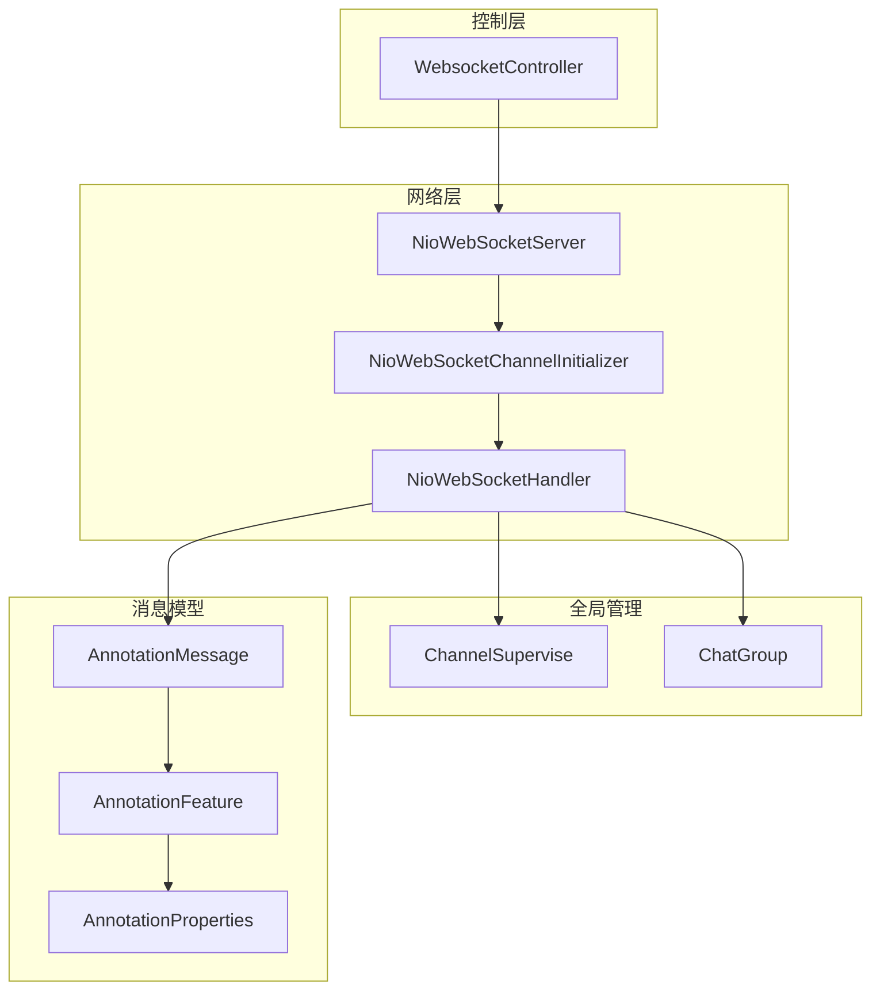
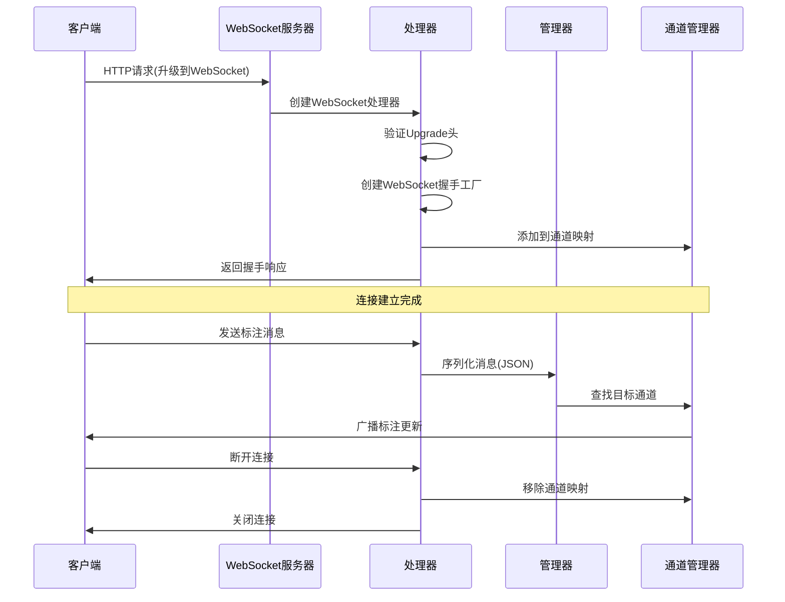
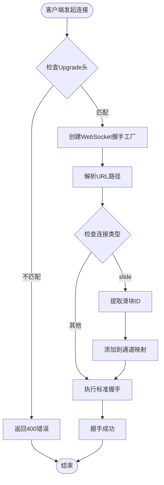
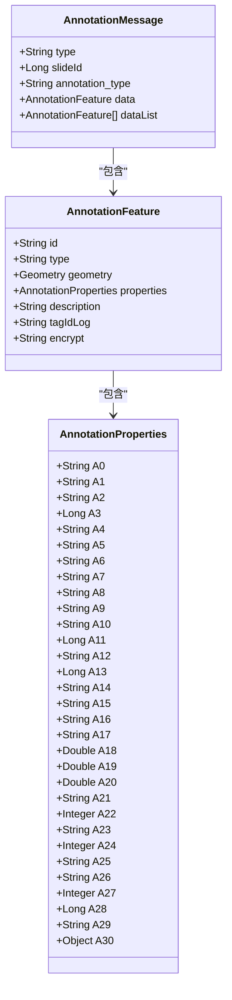
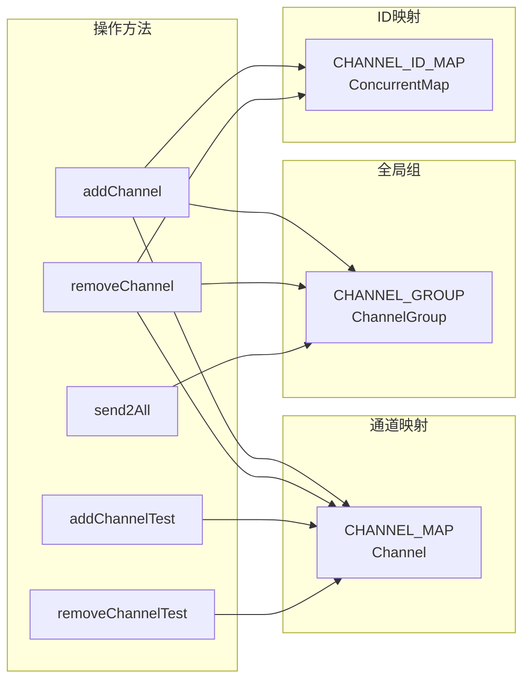
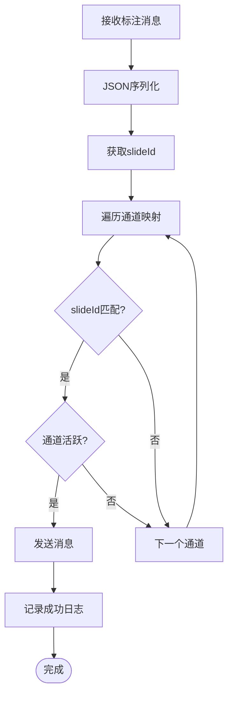
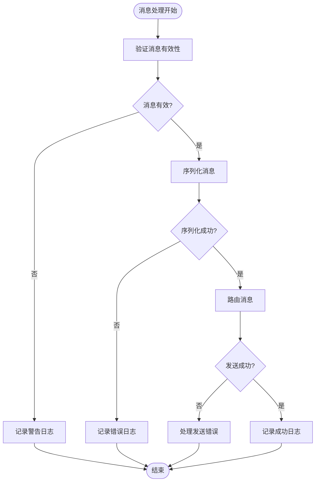
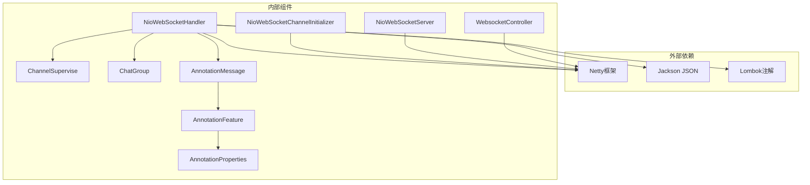

# WebSocket实时通信API

<cite>
**本文档引用的文件**
- [WebsocketController.java](file://src/main/java/cn/staitech/annotation/controller/WebsocketController.java)
- [NioWebSocketServer.java](file://src/main/java/cn/staitech/annotation/netty/websocket/NioWebSocketServer.java)
- [NioWebSocketHandler.java](file://src/main/java/cn/staitech/annotation/netty/websocket/NioWebSocketHandler.java)
- [NioWebSocketChannelInitializer.java](file://src/main/java/cn/staitech/annotation/netty/websocket/NioWebSocketChannelInitializer.java)
- [ChannelSupervise.java](file://src/main/java/cn/staitech/annotation/netty/global/ChannelSupervise.java)
- [ChatGroup.java](file://src/main/java/cn/staitech/annotation/netty/global/ChatGroup.java)
- [AnnotationMessage.java](file://src/main/java/cn/staitech/annotation/netty/message/AnnotationMessage.java)
- [AnnotationFeature.java](file://src/main/java/cn/staitech/annotation/netty/message/AnnotationFeature.java)
- [AnnotationProperties.java](file://src/main/java/cn/staitech/annotation/netty/message/AnnotationProperties.java)
- [bootstrap.yml](file://src/main/resources/bootstrap.yml)
</cite>

## 目录
1. [简介](#简介)
2. [项目结构](#项目结构)
3. [核心组件](#核心组件)
4. [架构概览](#架构概览)
5. [详细组件分析](#详细组件分析)
6. [依赖关系分析](#依赖关系分析)
7. [性能考虑](#性能考虑)
8. [故障排除指南](#故障排除指南)
9. [结论](#结论)

## 简介

本文件为医学图像标注系统的WebSocket实时通信API完整技术文档。该系统基于Netty框架实现，提供实时标注同步、用户状态通知和协作标注等核心功能。文档详细说明了WebSocket连接建立过程、消息格式规范、事件类型定义和实时交互模式，包括连接握手协议、消息序列化格式、客户端连接管理、断线重连机制和消息路由策略。

## 项目结构

医学图像标注系统的WebSocket通信模块采用分层架构设计，主要包含以下核心层次：

**图表来源**
- [WebsocketController.java:1-41](file://src/main/java/cn/staitech/annotation/controller/WebsocketController.java#L1-L41)
- [NioWebSocketServer.java:1-44](file://src/main/java/cn/staitech/annotation/netty/websocket/NioWebSocketServer.java#L1-L44)
- [NioWebSocketHandler.java:1-197](file://src/main/java/cn/staitech/annotation/netty/websocket/NioWebSocketHandler.java#L1-L197)

**章节来源**
- [WebsocketController.java:1-41](file://src/main/java/cn/staitech/annotation/controller/WebsocketController.java#L1-L41)
- [NioWebSocketServer.java:1-44](file://src/main/java/cn/staitech/annotation/netty/websocket/NioWebSocketServer.java#L1-L44)
- [NioWebSocketChannelInitializer.java:1-30](file://src/main/java/cn/staitech/annotation/netty/websocket/NioWebSocketChannelInitializer.java#L1-L30)

## 核心组件

### WebSocket服务器组件

系统的核心由三个主要组件构成：

1. **NioWebSocketServer**: Netty服务器启动器，负责初始化事件循环组和绑定端口
2. **NioWebSocketChannelInitializer**: 管道初始化器，配置HTTP编解码器和WebSocket处理器
3. **NioWebSocketHandler**: 主要的WebSocket处理器，处理连接、消息和断开逻辑

### 连接管理组件

- **ChannelSupervise**: 全局通道管理器，维护活跃连接映射和广播功能
- **ChatGroup**: 聊天分组管理器，支持按房间或分组的消息路由

### 消息模型组件

- **AnnotationMessage**: 标注消息载体，包含类型、滑块ID、标注类型和数据内容
- **AnnotationFeature**: 标注要素模型，封装几何数据和属性信息
- **AnnotationProperties**: 标注属性集合，存储各种标注相关的元数据

**章节来源**
- [NioWebSocketServer.java:14-41](file://src/main/java/cn/staitech/annotation/netty/websocket/NioWebSocketServer.java#L14-L41)
- [NioWebSocketHandler.java:27-68](file://src/main/java/cn/staitech/annotation/netty/websocket/NioWebSocketHandler.java#L27-L68)
- [ChannelSupervise.java:17-44](file://src/main/java/cn/staitech/annotation/netty/global/ChannelSupervise.java#L17-L44)

## 架构概览

系统采用Netty异步事件驱动架构，实现了高性能的WebSocket通信服务：

**图表来源**
- [NioWebSocketHandler.java:94-194](file://src/main/java/cn/staitech/annotation/netty/websocket/NioWebSocketHandler.java#L94-L194)
- [ChannelSupervise.java:23-43](file://src/main/java/cn/staitech/annotation/netty/global/ChannelSupervise.java#L23-L43)

## 详细组件分析

### WebSocket连接建立流程

系统支持两种连接模式：通用聊天连接和标注滑块专用连接。

#### 连接握手协议

**图表来源**
- [NioWebSocketHandler.java:167-194](file://src/main/java/cn/staitech/annotation/netty/websocket/NioWebSocketHandler.java#L167-L194)

#### 连接类型定义

系统支持以下连接类型：

| 连接类型 | URL模式 | 功能描述 |
|---------|---------|----------|
| 通用聊天 | `/chat/{roomId}` | 支持房间聊天功能 |
| 标注滑块 | `/slide/{slideId}` | 实时标注同步专用 |
| 用户状态 | `/user/{userId}` | 用户在线状态通知 |

**章节来源**
- [NioWebSocketHandler.java:175-183](file://src/main/java/cn/staitech/annotation/netty/websocket/NioWebSocketHandler.java#L175-L183)

### 消息格式规范

#### AnnotationMessage消息结构

**图表来源**
- [AnnotationMessage.java:14-27](file://src/main/java/cn/staitech/annotation/netty/message/AnnotationMessage.java#L14-L27)
- [AnnotationFeature.java:14-33](file://src/main/java/cn/staitech/annotation/netty/message/AnnotationFeature.java#L14-L33)
- [AnnotationProperties.java:12-75](file://src/main/java/cn/staitech/annotation/netty/message/AnnotationProperties.java#L12-L75)

#### 消息序列化格式

系统使用JSON格式进行消息序列化，支持以下字段：

**基础消息字段**:
- `type`: 消息类型标识
- `slideId`: 滑块唯一标识符
- `annotation_type`: 标注类型
- `data`: 单个标注要素
- `dataList`: 标注要素列表

**标注要素字段**:
- `id`: 要素唯一标识
- `geometry`: 几何形状数据
- `properties`: 标注属性集合
- `description`: 描述信息
- `tagIdLog`: 标签ID日志
- `encrypt`: 加密标识

**章节来源**
- [AnnotationMessage.java:14-27](file://src/main/java/cn/staitech/annotation/netty/message/AnnotationMessage.java#L14-L27)
- [AnnotationFeature.java:14-33](file://src/main/java/cn/staitech/annotation/netty/message/AnnotationFeature.java#L14-L33)
- [AnnotationProperties.java:12-75](file://src/main/java/cn/staitech/annotation/netty/message/AnnotationProperties.java#L12-L75)

### 客户端连接管理

#### 通道管理策略

**图表来源**
- [ChannelSupervise.java:19-43](file://src/main/java/cn/staitech/annotation/netty/global/ChannelSupervise.java#L19-L43)

#### 连接生命周期管理

系统提供完整的连接生命周期管理：

1. **连接建立**: `channelActive()` - 新连接加入全局组
2. **消息处理**: `channelRead0()` - 分发HTTP请求和WebSocket帧
3. **连接断开**: `channelInactive()` - 清理通道映射
4. **心跳检测**: 支持Ping/Pong帧处理

**章节来源**
- [NioWebSocketHandler.java:108-121](file://src/main/java/cn/staitech/annotation/netty/websocket/NioWebSocketHandler.java#L108-L121)
- [ChannelSupervise.java:23-35](file://src/main/java/cn/staitech/annotation/netty/global/ChannelSupervise.java#L23-L35)

### 消息路由策略

#### 按滑块ID路由

系统支持基于滑块ID的精确消息路由：

**图表来源**
- [NioWebSocketHandler.java:38-68](file://src/main/java/cn/staitech/annotation/netty/websocket/NioWebSocketHandler.java#L38-L68)

#### 广播与单播策略

- **单播**: 基于slideId精确匹配，只向相关客户端发送
- **广播**: 向所有连接的客户端发送（当前实现）
- **分组广播**: 通过ChatGroup实现房间级消息分发

**章节来源**
- [NioWebSocketHandler.java:56-66](file://src/main/java/cn/staitech/annotation/netty/websocket/NioWebSocketHandler.java#L56-L66)
- [ChannelSupervise.java:33-35](file://src/main/java/cn/staitech/annotation/netty/global/ChannelSupervise.java#L33-L35)

### 错误处理机制

#### 异常处理策略

系统实现了多层次的错误处理机制：

**图表来源**
- [NioWebSocketHandler.java:38-68](file://src/main/java/cn/staitech/annotation/netty/websocket/NioWebSocketHandler.java#L38-L68)

#### 错误类型分类

1. **序列化错误**: JSON转换异常
2. **路由错误**: 通道查找失败
3. **发送错误**: 网络传输问题
4. **协议错误**: 不支持的帧类型

**章节来源**
- [NioWebSocketHandler.java:43-54](file://src/main/java/cn/staitech/annotation/netty/websocket/NioWebSocketHandler.java#L43-L54)

## 依赖关系分析

### 组件依赖图

**图表来源**
- [NioWebSocketHandler.java:1-25](file://src/main/java/cn/staitech/annotation/netty/websocket/NioWebSocketHandler.java#L1-L25)
- [AnnotationMessage.java:1-6](file://src/main/java/cn/staitech/annotation/netty/message/AnnotationMessage.java#L1-L6)

### 数据流分析

系统采用事件驱动的数据流模式：

1. **请求阶段**: HTTP请求转换为WebSocket连接
2. **认证阶段**: 基于URL路径的访问控制
3. **处理阶段**: JSON消息解析和业务逻辑处理
4. **响应阶段**: 实时消息推送和状态更新

**章节来源**
- [NioWebSocketChannelInitializer.java:15-26](file://src/main/java/cn/staitech/annotation/netty/websocket/NioWebSocketChannelInitializer.java#L15-L26)
- [bootstrap.yml:1-42](file://src/main/resources/bootstrap.yml#L1-L42)

## 性能考虑

### 连接池优化

系统使用Netty的事件循环组实现高效的连接管理：

- **Boss线程组**: 处理新连接接入
- **Worker线程组**: 处理已建立连接的I/O操作
- **线程数量**: 默认CPU核心数×2，可根据负载调整

### 内存管理

- **零拷贝**: 使用ByteBuf实现高效内存管理
- **对象复用**: 通过Netty的池化机制减少GC压力
- **背压处理**: 自动处理消息积压情况

### 网络优化

- **HTTP聚合器**: 最大支持65536字节的HTTP消息
- **分块传输**: 支持大数据的分块传输
- **Keep-Alive**: 保持连接活跃状态

## 故障排除指南

### 常见问题诊断

#### 连接失败问题

**症状**: 客户端无法建立WebSocket连接
**可能原因**:
1. Upgrade头缺失或不正确
2. 端口被占用
3. 防火墙阻拦

**解决方案**:
1. 检查客户端是否正确设置Upgrade头
2. 验证netty.port配置
3. 检查防火墙设置

#### 消息丢失问题

**症状**: 标注更新未实时同步
**可能原因**:
1. 通道映射错误
2. JSON序列化失败
3. 网络中断

**解决方案**:
1. 检查slideId匹配逻辑
2. 验证消息格式完整性
3. 实现断线重连机制

#### 性能问题

**症状**: 系统响应缓慢或内存泄漏
**可能原因**:
1. 连接数过多
2. 消息队列积压
3. GC频繁触发

**解决方案**:
1. 实施连接数限制
2. 优化消息处理逻辑
3. 调整JVM参数

**章节来源**
- [NioWebSocketHandler.java:167-173](file://src/main/java/cn/staitech/annotation/netty/websocket/NioWebSocketHandler.java#L167-L173)
- [ChannelSupervise.java:19-43](file://src/main/java/cn/staitech/annotation/netty/global/ChannelSupervise.java#L19-L43)

## 结论

医学图像标注系统的WebSocket实时通信API基于Netty框架构建，提供了高性能、可扩展的实时通信能力。系统的主要特点包括：

1. **灵活的连接管理**: 支持多种连接类型和动态路由
2. **标准化的消息格式**: 基于JSON的统一消息协议
3. **完善的错误处理**: 多层次的异常处理和恢复机制
4. **高效的性能表现**: 事件驱动架构确保低延迟和高吞吐量

该API为医学图像标注场景提供了可靠的实时通信基础设施，支持标注同步、用户状态通知和协作标注等核心功能。通过合理的架构设计和优化策略，系统能够满足医疗领域的严格性能和可靠性要求。