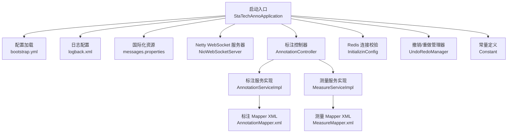
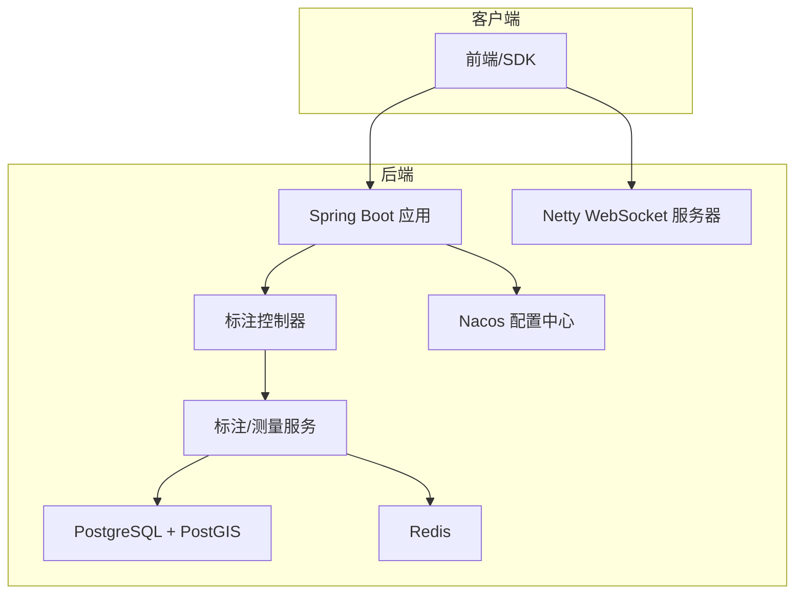
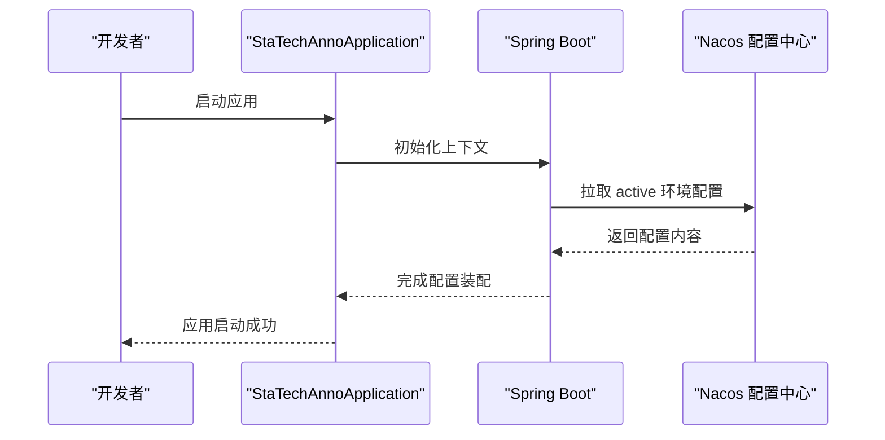
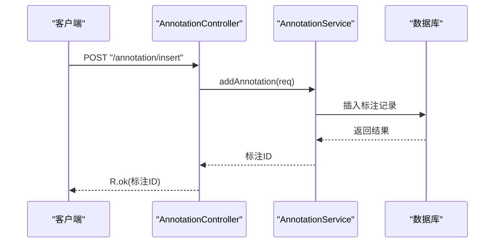
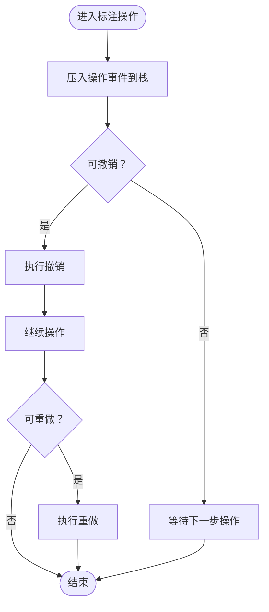
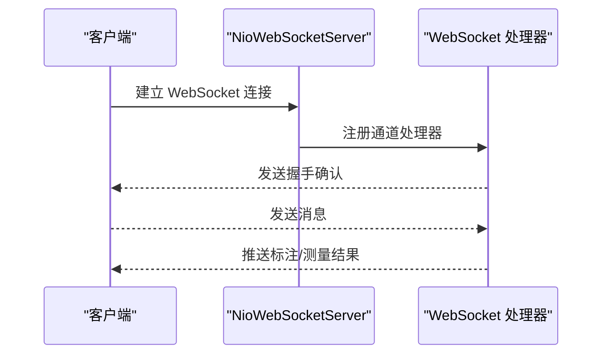
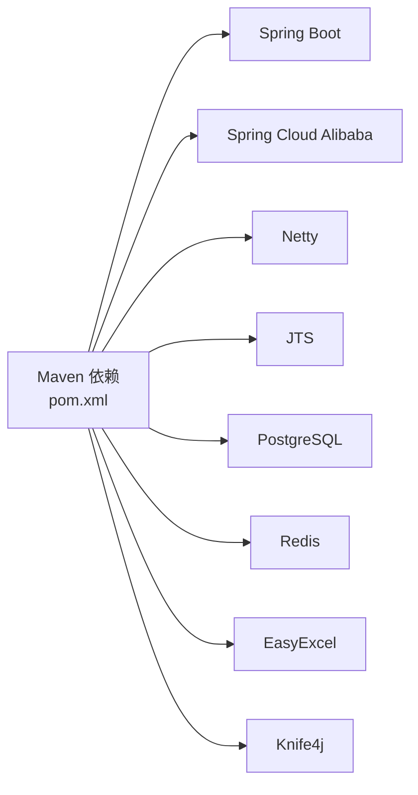

# 快速开始

<cite>
**本文引用的文件列表**
- [README.md](file://README.md)
- [pom.xml](file://pom.xml)
- [bootstrap.yml](file://src/main/resources/bootstrap.yml)
- [StaTechAnnoApplication.java](file://src/main/java/cn/staitech/annotation/StaTechAnnoApplication.java)
- [InitializinConfig.java](file://src/main/java/cn/staitech/annotation/config/InitializinConfig.java)
- [NioWebSocketServer.java](file://src/main/java/cn/staitech/annotation/netty/websocket/NioWebSocketServer.java)
- [AnnotationController.java](file://src/main/java/cn/staitech/annotation/controller/AnnotationController.java)
- [UndoRedoManager.java](file://src/main/java/cn/staitech/annotation/utils/annotation/UndoRedoManager.java)
- [Constant.java](file://src/main/java/cn/staitech/annotation/constant/Constant.java)
- [logback.xml](file://src/main/resources/logback.xml)
- [messages.properties](file://src/main/resources/i18n/messages.properties)
- [banner.txt](file://src/main/resources/banner.txt)
- [update_pg_v2.6.0.sql](file://sql/update_pg_v2.6.0.sql)
</cite>

## 目录
1. [简介](#简介)
2. [项目结构](#项目结构)
3. [核心组件](#核心组件)
4. [架构总览](#架构总览)
5. [详细组件分析](#详细组件分析)
6. [依赖分析](#依赖分析)
7. [性能考虑](#性能考虑)
8. [故障排除指南](#故障排除指南)
9. [结论](#结论)
10. [附录](#附录)

## 简介
本指南面向首次接触“医学图像标注系统”的开发者，帮助你在最短时间内完成环境准备、依赖安装、配置与启动，并理解基本使用流程。系统采用 Spring Boot + Netty WebSocket 的架构，支持标注数据的增删改查、测量标注、几何运算、撤销/重做等功能。

## 项目结构
该模块为标注子系统，主要包含以下层次：
- 启动入口与配置：应用启动类、Nacos 配置加载、日志配置、国际化资源
- 控制层：标注相关接口（新增、删除、更新、批量、距离计算、撤销/重做等）
- 业务层：标注与测量服务实现
- 数据访问层：MyBatis Mapper XML
- 基础设施：Netty WebSocket 服务器、Redis 连接校验初始化
- 数据模型：标注、测量、标注删除记录等实体
- 数据库脚本：PostgreSQL 表结构与索引定义



图表来源
- [StaTechAnnoApplication.java:19-51](file://src/main/java/cn/staitech/annotation/StaTechAnnoApplication.java#L19-L51)
- [bootstrap.yml:1-42](file://src/main/resources/bootstrap.yml#L1-L42)
- [logback.xml:1-101](file://src/main/resources/logback.xml#L1-L101)
- [messages.properties:1-328](file://src/main/resources/i18n/messages.properties#L1-L328)
- [NioWebSocketServer.java:1-44](file://src/main/java/cn/staitech/annotation/netty/websocket/NioWebSocketServer.java#L1-L44)
- [AnnotationController.java:1-251](file://src/main/java/cn/staitech/annotation/controller/AnnotationController.java#L1-L251)
- [InitializinConfig.java:1-31](file://src/main/java/cn/staitech/annotation/config/InitializinConfig.java#L1-L31)
- [UndoRedoManager.java:1-97](file://src/main/java/cn/staitech/annotation/utils/annotation/UndoRedoManager.java#L1-L97)
- [Constant.java:1-80](file://src/main/java/cn/staitech/annotation/constant/Constant.java#L1-L80)

章节来源
- [StaTechAnnoApplication.java:19-51](file://src/main/java/cn/staitech/annotation/StaTechAnnoApplication.java#L19-L51)
- [bootstrap.yml:1-42](file://src/main/resources/bootstrap.yml#L1-L42)
- [logback.xml:1-101](file://src/main/resources/logback.xml#L1-L101)
- [messages.properties:1-328](file://src/main/resources/i18n/messages.properties#L1-L328)

## 核心组件
- 应用启动类：负责启用发现、异步、事务、分页插件、Mapper 扫描等
- 配置加载：通过 Nacos 加载不同环境配置，支持 dev/test/prod
- 日志配置：统一输出格式与滚动策略，便于问题定位
- 国际化：多语言提示资源，覆盖业务错误码
- Netty WebSocket：独立端口提供实时通信能力
- 标注控制器：提供标注的增删改查、批量处理、距离计算、撤销/重做等接口
- 撤销/重做管理器：基于用户与切片维度的栈式管理，支持定时清理
- Redis 初始化：连接工厂校验，提升连接稳定性
- 常量定义：标注类型、操作、状态、尺寸等常量集中管理

章节来源
- [StaTechAnnoApplication.java:25-51](file://src/main/java/cn/staitech/annotation/StaTechAnnoApplication.java#L25-L51)
- [bootstrap.yml:19-41](file://src/main/resources/bootstrap.yml#L19-L41)
- [logback.xml:85-99](file://src/main/resources/logback.xml#L85-L99)
- [messages.properties:1-328](file://src/main/resources/i18n/messages.properties#L1-L328)
- [NioWebSocketServer.java:14-44](file://src/main/java/cn/staitech/annotation/netty/websocket/NioWebSocketServer.java#L14-L44)
- [AnnotationController.java:40-251](file://src/main/java/cn/staitech/annotation/controller/AnnotationController.java#L40-L251)
- [UndoRedoManager.java:16-97](file://src/main/java/cn/staitech/annotation/utils/annotation/UndoRedoManager.java#L16-L97)
- [InitializinConfig.java:15-31](file://src/main/java/cn/staitech/annotation/config/InitializinConfig.java#L15-L31)
- [Constant.java:9-80](file://src/main/java/cn/staitech/annotation/constant/Constant.java#L9-L80)

## 架构总览
系统采用“Spring Boot 应用 + Netty WebSocket + Nacos 配置中心 + PostgreSQL 数据库”的组合：
- 应用通过 Nacos 注册与配置中心拉取环境配置
- 标注接口通过 HTTP 提供 REST 服务
- 实时通信通过 Netty WebSocket 在独立端口提供
- 数据持久化使用 PostgreSQL，几何字段使用 PostGIS 扩展
- 日志统一由 Logback 输出，支持按模块与级别控制



图表来源
- [StaTechAnnoApplication.java:25-51](file://src/main/java/cn/staitech/annotation/StaTechAnnoApplication.java#L25-L51)
- [NioWebSocketServer.java:14-44](file://src/main/java/cn/staitech/annotation/netty/websocket/NioWebSocketServer.java#L14-L44)
- [AnnotationController.java:40-251](file://src/main/java/cn/staitech/annotation/controller/AnnotationController.java#L40-L251)
- [bootstrap.yml:19-41](file://src/main/resources/bootstrap.yml#L19-L41)

## 详细组件分析

### 启动与配置加载
- 应用启动类启用发现、异步、事务、MyBatis 分页拦截器、Mapper 扫描
- bootstrap.yml 指定端口、激活环境、Nacos 地址与命名空间、共享配置
- banner 展示当前加载的配置文件名，便于确认环境
- logback.xml 统一日志格式与滚动策略，提高可读性



图表来源
- [StaTechAnnoApplication.java:35-49](file://src/main/java/cn/staitech/annotation/StaTechAnnoApplication.java#L35-L49)
- [bootstrap.yml:19-41](file://src/main/resources/bootstrap.yml#L19-L41)
- [banner.txt:1-7](file://src/main/resources/banner.txt#L1-L7)

章节来源
- [StaTechAnnoApplication.java:25-51](file://src/main/java/cn/staitech/annotation/StaTechAnnoApplication.java#L25-L51)
- [bootstrap.yml:1-42](file://src/main/resources/bootstrap.yml#L1-L42)
- [banner.txt:1-7](file://src/main/resources/banner.txt#L1-L7)
- [logback.xml:85-99](file://src/main/resources/logback.xml#L85-L99)

### 标注控制器与业务流程
- 控制器提供标注的新增、删除、更新、批量、距离计算、撤销/重做等接口
- 业务层通过服务实现具体逻辑，返回统一响应体
- 接口支持加密响应、审计日志等安全与合规特性



图表来源
- [AnnotationController.java:50-69](file://src/main/java/cn/staitech/annotation/controller/AnnotationController.java#L50-L69)

章节来源
- [AnnotationController.java:40-251](file://src/main/java/cn/staitech/annotation/controller/AnnotationController.java#L40-L251)

### 撤销/重做机制
- 基于用户ID与切片ID的二维键管理撤销/重做栈
- 支持查询状态、清理、定时清空等能力
- 适用于标注过程中的精细回溯



图表来源
- [UndoRedoManager.java:21-97](file://src/main/java/cn/staitech/annotation/utils/annotation/UndoRedoManager.java#L21-L97)

章节来源
- [UndoRedoManager.java:16-97](file://src/main/java/cn/staitech/annotation/utils/annotation/UndoRedoManager.java#L16-L97)

### WebSocket 实时通信
- 独立端口启动 Netty WebSocket 服务器
- 用于实时消息推送、标注同步等场景



图表来源
- [NioWebSocketServer.java:19-41](file://src/main/java/cn/staitech/annotation/netty/websocket/NioWebSocketServer.java#L19-L41)

章节来源
- [NioWebSocketServer.java:1-44](file://src/main/java/cn/staitech/annotation/netty/websocket/NioWebSocketServer.java#L1-L44)

### 数据模型与数据库设计
- 标注表、测量表、标注删除表均包含几何字段，使用 PostGIS geometry 类型
- 为常用查询字段建立索引，提升检索效率
- 提供从旧版本迁移的 SQL 脚本

```mermaid
erDiagram
FR_ANNOTATION {
bigserial annotation_id PK
decimal area
decimal perimeter
varchar description
bigint tag_id
geometry contour
varchar location_type
varchar annotation_type
bigint create_by
timestamp create_time
bigint update_by
timestamp update_time
bigint slide_id
varchar json_id
}
FR_ANNOTATION_DEL {
bigserial annotation_id PK
decimal area
decimal perimeter
varchar description
bigint tag_id
geometry contour
varchar location_type
varchar annotation_type
bigint create_by
timestamp create_time
bigint update_by
timestamp update_time
bigint delete_by
timestamp delete_time
bigint slide_id
varchar json_id
}
FR_MEASURE {
bigserial measure_id PK
bigint slide_id
varchar annotation_type
varchar area
varchar perimeter
bigint number
int measure_type
varchar measure_relation
varchar measure_name
int measure_number
double precision mean_distance
double precision max_distance
double precision min_distance
varchar inner_angle
varchar exterior_angle
varchar center_point
varchar location_type
varchar radius
geometry contour
bigint create_by
timestamp create_time
bigint update_by
timestamp update_time
varchar measure_full_name
}
```

图表来源
- [update_pg_v2.6.0.sql:2-164](file://sql/update_pg_v2.6.0.sql#L2-L164)

章节来源
- [update_pg_v2.6.0.sql:1-245](file://sql/update_pg_v2.6.0.sql#L1-L245)

## 依赖分析
- 构建工具：Maven
- 运行时：Spring Boot 2.6.x、Spring Cloud Alibaba（Nacos Discovery/Config/Sentinel）
- 中间件：Redis（连接工厂校验）、PostgreSQL + PostGIS（几何类型）
- 工具库：Netty（HTTP/WebSocket）、JTS（几何计算）、EasyExcel（导入导出）
- 文档：Knife4j（Swagger 增强）



图表来源
- [pom.xml:19-134](file://pom.xml#L19-L134)

章节来源
- [pom.xml:19-134](file://pom.xml#L19-L134)

## 性能考虑
- 使用 MyBatis Plus 分页拦截器，避免全表扫描
- 对高频查询字段建立索引（如标注类型、切片ID、测量名称等）
- WebSocket 独立端口部署，避免与 HTTP 干扰
- Redis 连接工厂开启连接校验，降低无效连接带来的开销
- 日志按模块与级别控制，减少不必要的 IO

## 故障排除指南
- 端口占用与防火墙
  - 系统使用多个端口，需在防火墙放通相应 TCP 端口
  - 常见端口包括：80、8080、82、9998、9999、9000~9300、5672/15672（RabbitMQ）、3306/3307（MySQL/PG）、6379（Redis）
  - 参考命令：开放端口、重启防火墙、查看开放端口
- Nacos 配置加载失败
  - 检查 bootstrap.yml 中的 server-addr、namespace、group 是否正确
  - 确认共享配置文件 application-${spring.profiles.active}.yml 已在 Nacos 中存在
- WebSocket 启动异常
  - 检查 netty.port 配置与端口占用情况
  - 查看日志中 WebSocket 启动信息与错误堆栈
- Redis 连接问题
  - 确认 Redis 服务可用，连接工厂已启用 validateConnection
- PostgreSQL 几何字段报错
  - 确保 PostGIS 已安装并启用，几何类型与索引创建正确
- 国际化提示乱码
  - 检查 messages.properties 文件编码与内容完整性
- Swagger 文档无法访问
  - 确认 knife4j.enable=true，且端口未被屏蔽

章节来源
- [README.md:5-63](file://README.md#L5-L63)
- [bootstrap.yml:19-41](file://src/main/resources/bootstrap.yml#L19-L41)
- [NioWebSocketServer.java:16-31](file://src/main/java/cn/staitech/annotation/netty/websocket/NioWebSocketServer.java#L16-L31)
- [InitializinConfig.java:24-28](file://src/main/java/cn/staitech/annotation/config/InitializinConfig.java#L24-L28)
- [update_pg_v2.6.0.sql:1-245](file://sql/update_pg_v2.6.0.sql#L1-L245)
- [messages.properties:1-328](file://src/main/resources/i18n/messages.properties#L1-L328)
- [logback.xml:85-99](file://src/main/resources/logback.xml#L85-L99)

## 结论
通过本指南，你可以完成环境准备、依赖安装、配置加载与系统启动，并掌握标注系统的核心功能与常见问题排查方法。建议在本地先以开发环境启动，逐步接入数据库与中间件，再进行联调与部署。

## 附录
- 快速启动步骤
  1) 准备环境：JDK、Maven、PostgreSQL + PostGIS、Redis、RabbitMQ（如需）、Nacos
  2) 配置数据库与中间件，确保连通性
  3) 在 Nacos 中创建对应环境的共享配置 application-${spring.profiles.active}.yml
  4) 修改 bootstrap.yml 中的 server-addr、namespace、group 与 active profile
  5) 启动应用，访问 Knife4j 文档与业务接口
  6) 如需实时通信，启动 WebSocket 服务器并验证端口
- 常用接口参考
  - 新增标注：POST /annotation/insert
  - 删除标注：POST /annotation/delete
  - 更新标注：POST /annotation/update
  - 批量操作：POST /annotation/batch
  - 撤销/重做：POST /annotation/undoAnnotation/{slideId}、POST /annotation/redoAnnotation/{slideId}
  - 测量标注：参考测量相关接口（同前缀 /annotation）