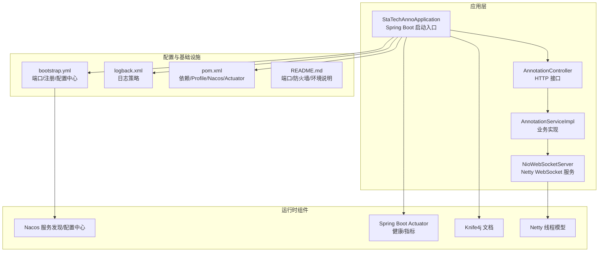
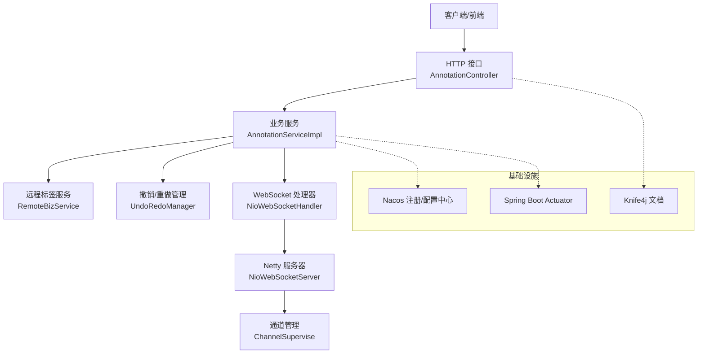
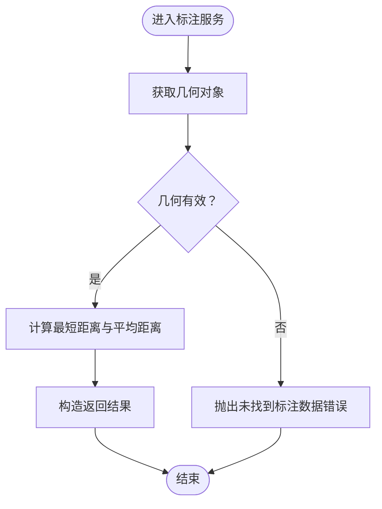
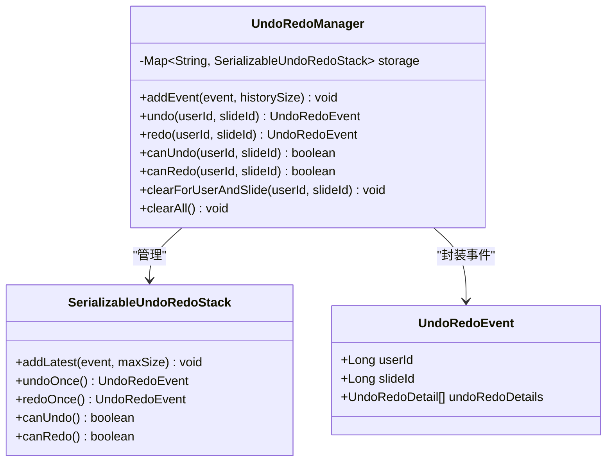
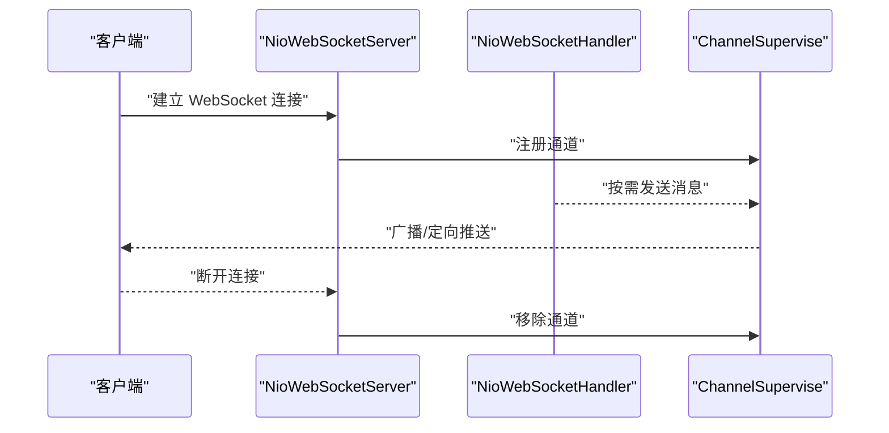
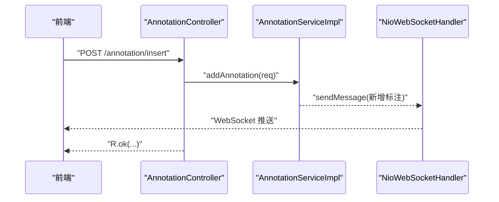
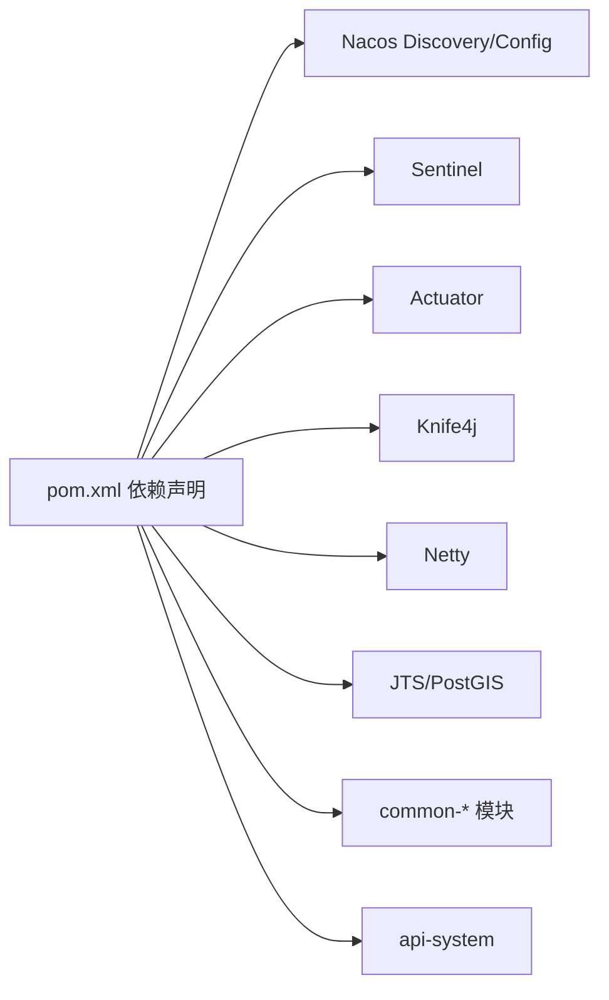

# 故障排查与测试

<cite>
**本文引用的文件**
- [StaTechAnnoApplication.java](file://src/main/java/cn/staitech/annotation/StaTechAnnoApplication.java)
- [bootstrap.yml](file://src/main/resources/bootstrap.yml)
- [logback.xml](file://src/main/resources/logback.xml)
- [pom.xml](file://pom.xml)
- [README.md](file://README.md)
- [AnnotationController.java](file://src/main/java/cn/staitech/annotation/controller/AnnotationController.java)
- [AnnotationServiceImpl.java](file://src/main/java/cn/staitech/annotation/service/impl/AnnotationServiceImpl.java)
- [NioWebSocketServer.java](file://src/main/java/cn/staitech/annotation/netty/websocket/NioWebSocketServer.java)
- [UndoRedoManager.java](file://src/main/java/cn/staitech/annotation/utils/annotation/UndoRedoManager.java)
- [ChannelSupervise.java](file://src/main/java/cn/staitech/annotation/netty/global/ChannelSupervise.java)
- [AnnotationMessage.java](file://src/main/java/cn/staitech/annotation/netty/message/AnnotationMessage.java)
- [Constant.java](file://src/main/java/cn/staitech/annotation/constant/Constant.java)
</cite>

## 目录
1. [简介](#简介)
2. [项目结构](#项目结构)
3. [核心组件](#核心组件)
4. [架构总览](#架构总览)
5. [详细组件分析](#详细组件分析)
6. [依赖分析](#依赖分析)
7. [性能考虑](#性能考虑)
8. [故障排查指南](#故障排查指南)
9. [测试指南](#测试指南)
10. [结论](#结论)
11. [附录](#附录)

## 简介
本文件面向开发者与运维人员，提供医学图像标注系统的故障排查与测试实践指南。内容覆盖启动失败、连接异常、性能问题的诊断与修复；日志采集与关键信息解读；单元测试、集成测试与性能测试的实施步骤；测试工具与环境搭建建议；调试技巧、监控指标与告警阈值设定，帮助快速定位问题并恢复服务。

## 项目结构
该模块为基于 Spring Boot 的标注服务，采用 Netty 提供 WebSocket 通道，结合 Nacos 注册与配置中心、Actuator 指标暴露、Knife4j 文档增强等能力，支撑标注数据的增删改查、几何运算、撤销/重做与实时推送。

图表来源
- [StaTechAnnoApplication.java:1-51](file://src/main/java/cn/staitech/annotation/StaTechAnnoApplication.java#L1-L51)
- [AnnotationController.java:1-251](file://src/main/java/cn/staitech/annotation/controller/AnnotationController.java#L1-L251)
- [AnnotationServiceImpl.java:1-724](file://src/main/java/cn/staitech/annotation/service/impl/AnnotationServiceImpl.java#L1-L724)
- [NioWebSocketServer.java:1-44](file://src/main/java/cn/staitech/annotation/netty/websocket/NioWebSocketServer.java#L1-L44)
- [bootstrap.yml:1-42](file://src/main/resources/bootstrap.yml#L1-L42)
- [logback.xml:1-101](file://src/main/resources/logback.xml#L1-L101)
- [pom.xml:1-265](file://pom.xml#L1-L265)
- [README.md:1-95](file://README.md#L1-L95)

章节来源
- [StaTechAnnoApplication.java:1-51](file://src/main/java/cn/staitech/annotation/StaTechAnnoApplication.java#L1-L51)
- [bootstrap.yml:1-42](file://src/main/resources/bootstrap.yml#L1-L42)
- [logback.xml:1-101](file://src/main/resources/logback.xml#L1-L101)
- [pom.xml:1-265](file://pom.xml#L1-L265)
- [README.md:1-95](file://README.md#L1-L95)

## 核心组件
- 应用入口与配置
  - 启动类启用 SpringUtil、自定义配置、Swagger、Feign 客户端、服务发现、异步、事务与 MyBatis Plus 分页拦截器。
  - 配置文件定义端口、Nacos 注册与配置中心参数、共享配置、国际化资源等。
- 控制器与服务
  - 控制器提供标注增删改、批量操作、几何运算、撤销/重做等接口，并通过审计注解与加密响应增强安全与可追溯性。
  - 服务实现负责几何计算、调用远程标签服务、撤销/重做栈管理、WebSocket 推送等。
- 实时通信
  - Netty WebSocket 服务独立启动，绑定配置端口，使用全局通道组进行广播与按切片分发。
- 日志与监控
  - Logback 按启动阶段分类输出，根日志器与模块日志级别可控；Actuator 暴露健康与指标；Knife4j 提供在线接口文档。

章节来源
- [StaTechAnnoApplication.java:25-50](file://src/main/java/cn/staitech/annotation/StaTechAnnoApplication.java#L25-L50)
- [bootstrap.yml:1-42](file://src/main/resources/bootstrap.yml#L1-L42)
- [AnnotationController.java:1-251](file://src/main/java/cn/staitech/annotation/controller/AnnotationController.java#L1-L251)
- [AnnotationServiceImpl.java:1-724](file://src/main/java/cn/staitech/annotation/service/impl/AnnotationServiceImpl.java#L1-L724)
- [NioWebSocketServer.java:1-44](file://src/main/java/cn/staitech/annotation/netty/websocket/NioWebSocketServer.java#L1-L44)
- [logback.xml:1-101](file://src/main/resources/logback.xml#L1-L101)
- [pom.xml:38-42](file://pom.xml#L38-L42)

## 架构总览
系统采用“HTTP 接口 + Netty WebSocket 实时推送”的双通道架构，业务逻辑集中在服务层，几何计算与撤销/重做由专用工具类与管理器承担，外部依赖通过 Nacos 与远程服务接口对接。

图表来源
- [AnnotationController.java:40-251](file://src/main/java/cn/staitech/annotation/controller/AnnotationController.java#L40-L251)
- [AnnotationServiceImpl.java:44-724](file://src/main/java/cn/staitech/annotation/service/impl/AnnotationServiceImpl.java#L44-L724)
- [NioWebSocketServer.java:14-44](file://src/main/java/cn/staitech/annotation/netty/websocket/NioWebSocketServer.java#L14-L44)
- [ChannelSupervise.java:17-45](file://src/main/java/cn/staitech/annotation/netty/global/ChannelSupervise.java#L17-L45)
- [bootstrap.yml:20-42](file://src/main/resources/bootstrap.yml#L20-L42)
- [pom.xml:38-42](file://pom.xml#L38-L42)

## 详细组件分析

### 组件一：标注服务与几何运算
标注服务实现包含距离计算、几何合并预览、几何运算（并/差）、批量操作、撤销/重做等核心流程。关键点：
- 几何采样与平均距离计算用于稳定度量。
- 合并前校验相交关系，避免非法拓扑。
- 批量操作对每条记录独立捕获异常，保证部分成功场景的可观测性。
- 撤销/重做基于用户+切片维度的栈管理，支持清理与定时清空。

图表来源
- [AnnotationServiceImpl.java:140-181](file://src/main/java/cn/staitech/annotation/service/impl/AnnotationServiceImpl.java#L140-L181)

章节来源
- [AnnotationServiceImpl.java:62-138](file://src/main/java/cn/staitech/annotation/service/impl/AnnotationServiceImpl.java#L62-L138)
- [AnnotationServiceImpl.java:504-535](file://src/main/java/cn/staitech/annotation/service/impl/AnnotationServiceImpl.java#L504-L535)
- [AnnotationServiceImpl.java:538-571](file://src/main/java/cn/staitech/annotation/service/impl/AnnotationServiceImpl.java#L538-L571)
- [AnnotationServiceImpl.java:574-623](file://src/main/java/cn/staitech/annotation/service/impl/AnnotationServiceImpl.java#L574-L623)

### 组件二：撤销/重做管理器
撤销/重做管理器以“用户ID:切片ID”为键的并发栈存储，支持添加事件、撤销、重做、状态查询与定时清理。

图表来源
- [UndoRedoManager.java:19-97](file://src/main/java/cn/staitech/annotation/utils/annotation/UndoRedoManager.java#L19-L97)

章节来源
- [UndoRedoManager.java:19-97](file://src/main/java/cn/staitech/annotation/utils/annotation/UndoRedoManager.java#L19-L97)

### 组件三：WebSocket 通信与通道管理
WebSocket 服务通过 Netty 启动，使用通道组进行广播与按切片分发；通道管理器维护活动连接与映射。

图表来源
- [NioWebSocketServer.java:14-44](file://src/main/java/cn/staitech/annotation/netty/websocket/NioWebSocketServer.java#L14-L44)
- [ChannelSupervise.java:17-45](file://src/main/java/cn/staitech/annotation/netty/global/ChannelSupervise.java#L17-L45)

章节来源
- [NioWebSocketServer.java:14-44](file://src/main/java/cn/staitech/annotation/netty/websocket/NioWebSocketServer.java#L14-L44)
- [ChannelSupervise.java:17-45](file://src/main/java/cn/staitech/annotation/netty/global/ChannelSupervise.java#L17-L45)
- [AnnotationMessage.java:14-28](file://src/main/java/cn/staitech/annotation/netty/message/AnnotationMessage.java#L14-L28)

### 组件四：HTTP 接口与业务编排
控制器聚合标注相关接口，统一返回包装与审计日志，便于前端与网关对接。

图表来源
- [AnnotationController.java:50-59](file://src/main/java/cn/staitech/annotation/controller/AnnotationController.java#L50-L59)
- [AnnotationServiceImpl.java:184-238](file://src/main/java/cn/staitech/annotation/service/impl/AnnotationServiceImpl.java#L184-L238)

章节来源
- [AnnotationController.java:1-251](file://src/main/java/cn/staitech/annotation/controller/AnnotationController.java#L1-L251)
- [AnnotationServiceImpl.java:184-238](file://src/main/java/cn/staitech/annotation/service/impl/AnnotationServiceImpl.java#L184-L238)

## 依赖分析
- 外部依赖
  - Nacos Discovery/Config：服务注册与配置中心。
  - Sentinel：流量治理（可选）。
  - Actuator：健康检查与指标暴露。
  - Knife4j：增强接口文档。
  - Netty：WebSocket 通信。
  - PostGIS/JTS：几何计算。
- 内部模块
  - common-*：通用能力（安全、Redis、核心）。
  - api-system：远程服务接口（标签、用户等）。

图表来源
- [pom.xml:19-134](file://pom.xml#L19-L134)

章节来源
- [pom.xml:19-134](file://pom.xml#L19-L134)

## 性能考虑
- 几何计算复杂度
  - 平均距离计算涉及两几何体采样点笛卡尔积，时间复杂度与采样点数平方成正比；建议合理控制采样密度或缓存中间结果。
- 批量操作
  - 单条记录异常不影响整体流程，但会增加日志体量；建议在高并发场景下限流与重试策略配合。
- WebSocket 广播
  - 使用通道组进行广播，注意消息体大小与频率，避免阻塞事件循环。
- 撤销/重做栈
  - 默认栈深为固定值，建议结合业务峰值与内存压力评估；定时清空策略可降低长期运行内存占用。

章节来源
- [AnnotationServiceImpl.java:68-113](file://src/main/java/cn/staitech/annotation/service/impl/AnnotationServiceImpl.java#L68-L113)
- [AnnotationServiceImpl.java:574-623](file://src/main/java/cn/staitech/annotation/service/impl/AnnotationServiceImpl.java#L574-L623)
- [UndoRedoManager.java:90-94](file://src/main/java/cn/staitech/annotation/utils/annotation/UndoRedoManager.java#L90-L94)

## 故障排查指南

### 启动失败
常见原因与排查步骤：
- 端口冲突
  - 确认端口已在配置中设置且未被占用；参考配置文件中的端口项与防火墙开放清单。
- Nacos 连接失败
  - 检查 Nacos 地址、命名空间与分组配置；确认网络可达与鉴权参数正确。
- 时区设置
  - 应用启动默认设置为 Asia/Shanghai，确保容器或主机时区一致。
- 依赖缺失
  - 检查本地仓库与镜像源配置，确认依赖可正常解析。

章节来源
- [bootstrap.yml:2-37](file://src/main/resources/bootstrap.yml#L2-L37)
- [README.md:5-60](file://README.md#L5-L60)
- [StaTechAnnoApplication.java:40-42](file://src/main/java/cn/staitech/annotation/StaTechAnnoApplication.java#L40-L42)
- [pom.xml:136-169](file://pom.xml#L136-L169)

### 连接异常
- WebSocket 无法建立
  - 检查 Netty 服务端口配置与防火墙放通；观察启动日志中“正在启动 websocket 服务器”与“启动成功”提示。
  - 关注通道注册/移除逻辑，确认客户端断线重连策略。
- HTTP 接口不可达
  - 使用 Knife4j 文档页面验证接口可用性；检查网关路由与跨域配置。
- 几何运算失败
  - 若出现“图形标注不符合规则”，检查输入几何是否相交与拓扑合法性。

章节来源
- [NioWebSocketServer.java:20-41](file://src/main/java/cn/staitech/annotation/netty/websocket/NioWebSocketServer.java#L20-L41)
- [ChannelSupervise.java:23-43](file://src/main/java/cn/staitech/annotation/netty/global/ChannelSupervise.java#L23-L43)
- [AnnotationController.java:140-153](file://src/main/java/cn/staitech/annotation/controller/AnnotationController.java#L140-L153)
- [AnnotationServiceImpl.java:521-535](file://src/main/java/cn/staitech/annotation/service/impl/AnnotationServiceImpl.java#L521-L535)

### 性能问题
- 高并发几何计算
  - 优化采样点策略，减少笛卡尔积规模；必要时引入缓存或异步化。
- 批量操作卡顿
  - 限制单次批量条数；对异常记录单独记录并回传前端。
- WebSocket 压力
  - 控制消息大小与频率；对大图场景采用增量推送或分片策略。
- 撤销/重做内存
  - 结合业务峰值评估栈深；利用定时清理降低内存占用。

章节来源
- [AnnotationServiceImpl.java:68-113](file://src/main/java/cn/staitech/annotation/service/impl/AnnotationServiceImpl.java#L68-L113)
- [AnnotationServiceImpl.java:574-623](file://src/main/java/cn/staitech/annotation/service/impl/AnnotationServiceImpl.java#L574-L623)
- [UndoRedoManager.java:90-94](file://src/main/java/cn/staitech/annotation/utils/annotation/UndoRedoManager.java#L90-L94)

### 日志分析与关键信息解读
- 日志位置与分类
  - 日志目录由配置定义；按启动阶段输出到不同文件，便于分段排查。
- 关键日志字段
  - 时间戳、线程、trace_id、日志级别、Logger 名称、方法行号、消息体。
- 常见关键字
  - “正在启动 websocket 服务器”、“启动成功”、“运行出错”：用于确认 WebSocket 启停状态。
  - “计算标注面积失败”：几何面积/周长计算异常，检查几何有效性。
  - “批量操作标注数据失败”：定位具体失败记录与错误原因。
  - “撤销还原操作标注数据失败”：定位撤销/重做链路异常。

章节来源
- [logback.xml:4-99](file://src/main/resources/logback.xml#L4-L99)
- [NioWebSocketServer.java:21-35](file://src/main/java/cn/staitech/annotation/netty/websocket/NioWebSocketServer.java#L21-L35)
- [AnnotationServiceImpl.java:378-380](file://src/main/java/cn/staitech/annotation/service/impl/AnnotationServiceImpl.java#L378-L380)
- [AnnotationServiceImpl.java:607-614](file://src/main/java/cn/staitech/annotation/service/impl/AnnotationServiceImpl.java#L607-L614)
- [AnnotationServiceImpl.java:642-646](file://src/main/java/cn/staitech/annotation/service/impl/AnnotationServiceImpl.java#L642-L646)

## 测试指南

### 单元测试
- 测试目标
  - 标注服务核心算法（距离计算、几何合并、批量操作）、撤销/重做栈行为、异常分支。
- 推荐工具
  - JUnit（已作为依赖引入）。
- 测试要点
  - 输入边界：空几何、单点、无效拓扑。
  - 异常路径：未找到标注数据、图形不符合规则、计算失败。
  - 并发与一致性：撤销/重做链路的原子性与幂等性。

章节来源
- [pom.xml:76-80](file://pom.xml#L76-L80)
- [AnnotationServiceImpl.java:68-113](file://src/main/java/cn/staitech/annotation/service/impl/AnnotationServiceImpl.java#L68-L113)
- [AnnotationServiceImpl.java:504-535](file://src/main/java/cn/staitech/annotation/service/impl/AnnotationServiceImpl.java#L504-L535)
- [AnnotationServiceImpl.java:677-717](file://src/main/java/cn/staitech/annotation/service/impl/AnnotationServiceImpl.java#L677-L717)

### 集成测试
- 测试目标
  - HTTP 接口与 WebSocket 推送链路、Nacos 注册与配置生效、远程标签服务调用。
- 推荐工具
  - RestAssured 或 Postman；WebSocket 客户端（如 wscat）。
- 测试要点
  - 接口：鉴权、参数校验、批量操作部分失败场景。
  - 通信：连接建立、消息订阅、断线重连、广播/定向推送。
  - 配置：不同 Profile 下 Nacos 参数生效情况。

章节来源
- [AnnotationController.java:1-251](file://src/main/java/cn/staitech/annotation/controller/AnnotationController.java#L1-L251)
- [NioWebSocketServer.java:14-44](file://src/main/java/cn/staitech/annotation/netty/websocket/NioWebSocketServer.java#L14-L44)
- [bootstrap.yml:20-42](file://src/main/resources/bootstrap.yml#L20-L42)
- [pom.xml:226-263](file://pom.xml#L226-L263)

### 性能测试
- 测试目标
  - 并发标注、几何运算吞吐、WebSocket 广播延迟、撤销/重做栈深度影响。
- 推荐工具
  - JMeter、Gatling（接口压测）；自定义 Netty 客户端（WebSocket 压测）。
- 测试要点
  - 指标：请求延迟、错误率、吞吐量、CPU/内存/GC。
  - 负载：逐步提升并发与批量大小，观察拐点与异常。

章节来源
- [AnnotationServiceImpl.java:68-113](file://src/main/java/cn/staitech/annotation/service/impl/AnnotationServiceImpl.java#L68-L113)
- [AnnotationServiceImpl.java:574-623](file://src/main/java/cn/staitech/annotation/service/impl/AnnotationServiceImpl.java#L574-L623)
- [NioWebSocketServer.java:14-44](file://src/main/java/cn/staitech/annotation/netty/websocket/NioWebSocketServer.java#L14-L44)

### 测试环境搭建
- 端口与防火墙
  - 参考 README 中的端口开放清单与重启命令。
- Nacos 与配置
  - 在不同 Profile 下配置 Nacos 地址、命名空间与分组。
- Actuator 与监控
  - 启用 Actuator，暴露健康与指标端点，结合外部监控平台采集。

章节来源
- [README.md:5-60](file://README.md#L5-L60)
- [bootstrap.yml:20-42](file://src/main/resources/bootstrap.yml#L20-L42)
- [pom.xml:38-42](file://pom.xml#L38-L42)

## 结论
本指南从架构、组件、日志与测试四个维度提供了系统化的故障排查与测试方法。建议在日常运维中结合 Actuator 指标、Logback 分类日志与自动化测试，形成“预防—观测—定位—修复—验证”的闭环，保障标注系统的稳定性与可维护性。

## 附录

### 调试技巧
- 启动阶段
  - 观察“正在启动 websocket 服务器”与“启动成功”日志，确认 Netty 启停。
- 接口调试
  - 使用 Knife4j 快速验证鉴权、参数与返回结构。
- 几何问题
  - 将几何序列化为标准格式，借助可视化工具辅助定位拓扑异常。

章节来源
- [NioWebSocketServer.java:21-35](file://src/main/java/cn/staitech/annotation/netty/websocket/NioWebSocketServer.java#L21-L35)
- [AnnotationController.java:140-153](file://src/main/java/cn/staitech/annotation/controller/AnnotationController.java#L140-L153)

### 监控指标与告警阈值（建议）
- 指标类别
  - HTTP 请求延迟与错误率、WebSocket 连接数、几何计算耗时、批量操作失败率、撤销/重做栈深度。
- 告警阈值（示例）
  - HTTP P95 延迟 > 2s；错误率 > 1%；WebSocket 连接数异常波动；几何计算耗时 > 5s；批量失败率 > 5%；栈深度接近上限。

章节来源
- [pom.xml:38-42](file://pom.xml#L38-L42)
- [AnnotationServiceImpl.java:68-113](file://src/main/java/cn/staitech/annotation/service/impl/AnnotationServiceImpl.java#L68-L113)
- [AnnotationServiceImpl.java:574-623](file://src/main/java/cn/staitech/annotation/service/impl/AnnotationServiceImpl.java#L574-L623)
- [UndoRedoManager.java:60-77](file://src/main/java/cn/staitech/annotation/utils/annotation/UndoRedoManager.java#L60-L77)