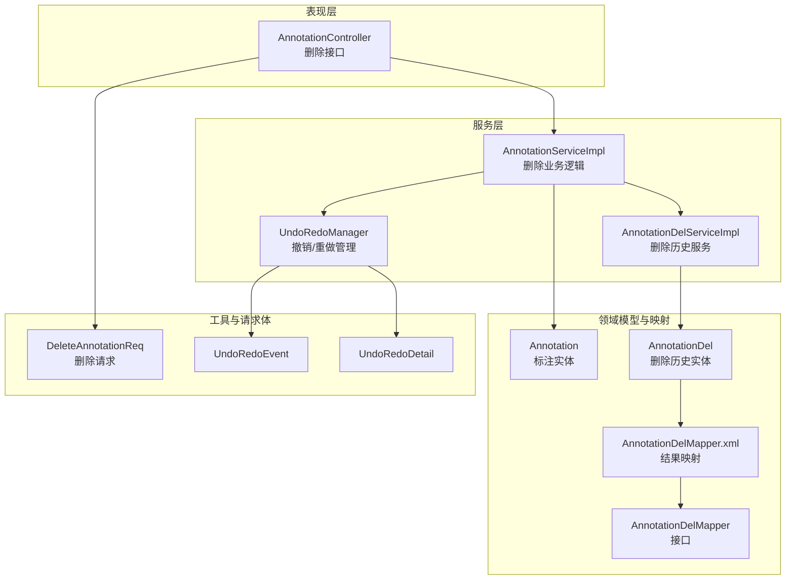
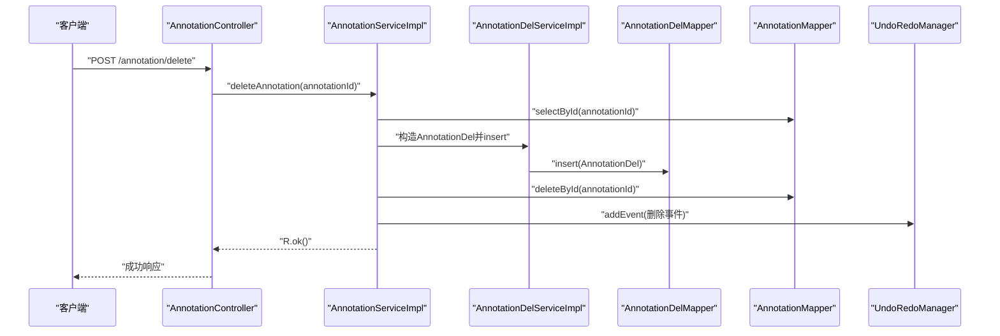
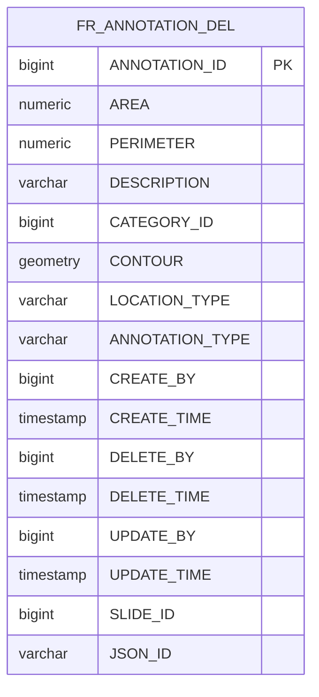
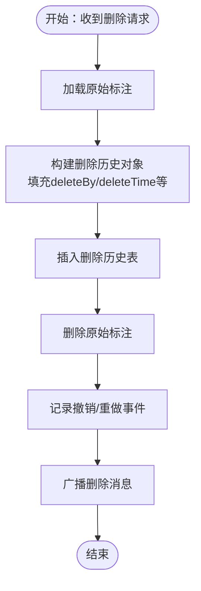
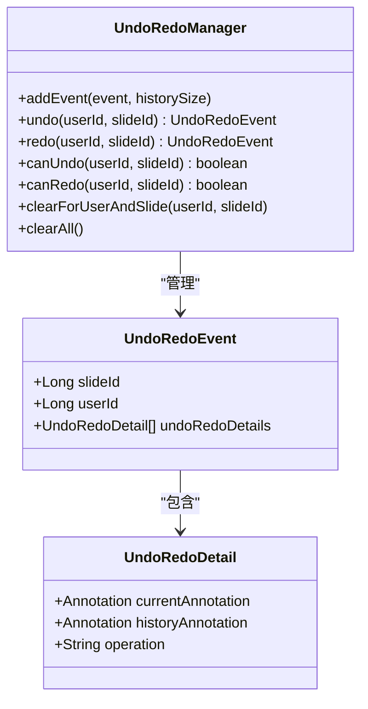
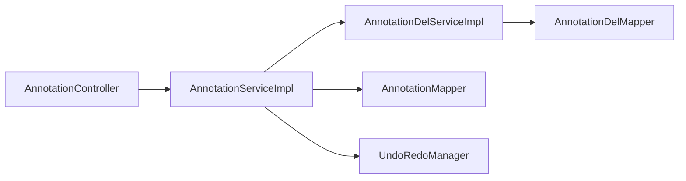

# 删除标注实体模型

<cite>
**本文引用的文件**
- [AnnotationDel.java](file://src/main/java/cn/staitech/annotation/domain/AnnotationDel.java)
- [AnnotationDelMapper.java](file://src/main/java/cn/staitech/annotation/mapper/AnnotationDelMapper.java)
- [AnnotationDelMapper.xml](file://src/main/resources/mapper/AnnotationDelMapper.xml)
- [AnnotationDelService.java](file://src/main/java/cn/staitech/annotation/service/AnnotationDelService.java)
- [AnnotationDelServiceImpl.java](file://src/main/java/cn/staitech/annotation/service/impl/AnnotationDelServiceImpl.java)
- [Annotation.java](file://src/main/java/cn/staitech/annotation/domain/Annotation.java)
- [AnnotationController.java](file://src/main/java/cn/staitech/annotation/controller/AnnotationController.java)
- [DeleteAnnotationReq.java](file://src/main/java/cn/staitech/annotation/vo/anno/DeleteAnnotationReq.java)
- [AnnotationServiceImpl.java](file://src/main/java/cn/staitech/annotation/service/impl/AnnotationServiceImpl.java)
- [UndoRedoManager.java](file://src/main/java/cn/staitech/annotation/utils/annotation/UndoRedoManager.java)
- [UndoRedoDetail.java](file://src/main/java/cn/staitech/annotation/utils/annotation/UndoRedoDetail.java)
- [UndoRedoEvent.java](file://src/main/java/cn/staitech/annotation/utils/annotation/UndoRedoEvent.java)
</cite>

## 目录
1. [简介](#简介)
2. [项目结构](#项目结构)
3. [核心组件](#核心组件)
4. [架构总览](#架构总览)
5. [详细组件分析](#详细组件分析)
6. [依赖分析](#依赖分析)
7. [性能考虑](#性能考虑)
8. [故障排查指南](#故障排查指南)
9. [结论](#结论)
10. [附录](#附录)

## 简介
本文件围绕“删除标注实体”的数据模型与实现进行系统化说明，重点覆盖以下方面：
- 删除历史表的设计目的与数据流转机制
- 删除标注的审计跟踪字段（删除时间、删除人等）
- 删除数据的备份与恢复机制（基于撤销/重做栈）
- 删除实体与原标注实体的关联关系与一致性保障
- 删除操作的权限控制与安全机制
- 删除历史的查询与统计能力说明
- 删除数据的生命周期管理与清理策略

## 项目结构
与删除标注相关的模块主要分布在领域模型、持久层、服务层、控制器与工具类中，采用分层设计与MyBatis-Plus映射。

图表来源
- [AnnotationController.java:77-89](file://src/main/java/cn/staitech/annotation/controller/AnnotationController.java#L77-L89)
- [AnnotationServiceImpl.java:280-300](file://src/main/java/cn/staitech/annotation/service/impl/AnnotationServiceImpl.java#L280-L300)
- [AnnotationDelServiceImpl.java:15-19](file://src/main/java/cn/staitech/annotation/service/impl/AnnotationDelServiceImpl.java#L15-L19)
- [AnnotationDel.java:12-98](file://src/main/java/cn/staitech/annotation/domain/AnnotationDel.java#L12-L98)
- [AnnotationDelMapper.xml:7-33](file://src/main/resources/mapper/AnnotationDelMapper.xml#L7-L33)
- [UndoRedoManager.java:19-94](file://src/main/java/cn/staitech/annotation/utils/annotation/UndoRedoManager.java#L19-L94)

章节来源
- [AnnotationController.java:77-89](file://src/main/java/cn/staitech/annotation/controller/AnnotationController.java#L77-L89)
- [AnnotationServiceImpl.java:280-300](file://src/main/java/cn/staitech/annotation/service/impl/AnnotationServiceImpl.java#L280-L300)
- [AnnotationDel.java:12-98](file://src/main/java/cn/staitech/annotation/domain/AnnotationDel.java#L12-L98)
- [AnnotationDelMapper.xml:7-33](file://src/main/resources/mapper/AnnotationDelMapper.xml#L7-L33)
- [UndoRedoManager.java:19-94](file://src/main/java/cn/staitech/annotation/utils/annotation/UndoRedoManager.java#L19-L94)

## 核心组件
- 删除历史实体：用于记录被删除标注的关键字段与审计信息，便于后续审计与恢复。
- 删除历史Mapper与XML：负责将数据库列映射到删除历史实体。
- 删除历史服务：提供对删除历史的CRUD能力。
- 标注实体：原始标注数据，删除时会从该表移除，并写入删除历史。
- 控制器与请求体：对外暴露删除接口，接收删除请求参数。
- 撤销/重做管理：通过内存栈保存删除前后的状态，支持恢复。

章节来源
- [AnnotationDel.java:12-98](file://src/main/java/cn/staitech/annotation/domain/AnnotationDel.java#L12-L98)
- [AnnotationDelMapper.java:12-14](file://src/main/java/cn/staitech/annotation/mapper/AnnotationDelMapper.java#L12-L14)
- [AnnotationDelMapper.xml:7-33](file://src/main/resources/mapper/AnnotationDelMapper.xml#L7-L33)
- [AnnotationDelService.java:12-14](file://src/main/java/cn/staitech/annotation/service/AnnotationDelService.java#L12-L14)
- [AnnotationDelServiceImpl.java:15-19](file://src/main/java/cn/staitech/annotation/service/impl/AnnotationDelServiceImpl.java#L15-L19)
- [Annotation.java:23-107](file://src/main/java/cn/staitech/annotation/domain/Annotation.java#L23-L107)
- [AnnotationController.java:77-89](file://src/main/java/cn/staitech/annotation/controller/AnnotationController.java#L77-L89)
- [DeleteAnnotationReq.java:10-17](file://src/main/java/cn/staitech/annotation/vo/anno/DeleteAnnotationReq.java#L10-L17)
- [UndoRedoManager.java:19-94](file://src/main/java/cn/staitech/annotation/utils/annotation/UndoRedoManager.java#L19-L94)

## 架构总览
删除标注的端到端流程如下：
- 控制器接收删除请求，解析请求体中的标注主键。
- 服务层根据主键查询原始标注，构造删除历史对象并写入删除历史表。
- 同步删除原始标注表中的对应记录。
- 记录撤销/重做事件，以便后续恢复。
- 广播删除消息（通过WebSocket）通知前端。

图表来源
- [AnnotationController.java:77-89](file://src/main/java/cn/staitech/annotation/controller/AnnotationController.java#L77-L89)
- [AnnotationServiceImpl.java:280-300](file://src/main/java/cn/staitech/annotation/service/impl/AnnotationServiceImpl.java#L280-L300)
- [AnnotationDelServiceImpl.java:15-19](file://src/main/java/cn/staitech/annotation/service/impl/AnnotationDelServiceImpl.java#L15-L19)
- [UndoRedoManager.java:42-45](file://src/main/java/cn/staitech/annotation/utils/annotation/UndoRedoManager.java#L42-L45)

## 详细组件分析

### 删除历史实体模型（AnnotationDel）
- 表名：fr_annotation_del
- 关键字段
  - 主键：annotationId（与原始标注主键一致）
  - 几何与描述：area、perimeter、geometry、description
  - 分类与位置：categoryId、locationType
  - 类型标识：annotationType（区分AI/绘制等）
  - 审计字段：createBy、createTime、deleteBy、deleteTime、updateBy、updateTime
  - 关联字段：slideId、jsonId
- 设计目的
  - 保留删除时的标注快照，支撑审计与恢复
  - 与原始标注保持字段一致性，确保可回放
- 数据一致性
  - 主键与原始标注一致，删除后仍可唯一定位
  - 审计字段记录删除人与时间，便于追踪

图表来源
- [AnnotationDel.java:12-98](file://src/main/java/cn/staitech/annotation/domain/AnnotationDel.java#L12-L98)
- [AnnotationDelMapper.xml:7-33](file://src/main/resources/mapper/AnnotationDelMapper.xml#L7-L33)

章节来源
- [AnnotationDel.java:12-98](file://src/main/java/cn/staitech/annotation/domain/AnnotationDel.java#L12-L98)
- [AnnotationDelMapper.xml:7-33](file://src/main/resources/mapper/AnnotationDelMapper.xml#L7-L33)

### 删除历史Mapper与XML映射
- XML中定义了完整的列映射与基础列清单，确保实体字段与数据库列一一对应。
- 接口继承MyBatis-Plus基础Mapper，提供通用CRUD能力。

章节来源
- [AnnotationDelMapper.java:12-14](file://src/main/java/cn/staitech/annotation/mapper/AnnotationDelMapper.java#L12-L14)
- [AnnotationDelMapper.xml:7-33](file://src/main/resources/mapper/AnnotationDelMapper.xml#L7-L33)

### 删除历史服务
- 采用MyBatis-Plus ServiceImpl模式，提供对删除历史实体的通用服务能力。
- 与Mapper配合完成插入、查询等操作。

章节来源
- [AnnotationDelService.java:12-14](file://src/main/java/cn/staitech/annotation/service/AnnotationDelService.java#L12-L14)
- [AnnotationDelServiceImpl.java:15-19](file://src/main/java/cn/staitech/annotation/service/impl/AnnotationDelServiceImpl.java#L15-L19)

### 控制器与请求体
- 控制器提供删除接口，绑定请求体DeleteAnnotationReq。
- 请求体包含标注主键字段，忽略日志字段以避免敏感信息泄露。

章节来源
- [AnnotationController.java:77-89](file://src/main/java/cn/staitech/annotation/controller/AnnotationController.java#L77-L89)
- [DeleteAnnotationReq.java:10-17](file://src/main/java/cn/staitech/annotation/vo/anno/DeleteAnnotationReq.java#L10-L17)

### 删除业务逻辑与审计跟踪
- 服务层在删除时：
  - 读取原始标注，填充删除历史对象（含删除人、删除时间等）
  - 插入删除历史表
  - 删除原始标注
  - 记录撤销/重做事件
- 审计字段覆盖：
  - 删除人：deleteBy
  - 删除时间：deleteTime
  - 更新人/时间：updateBy、updateTime
  - 创建人/时间：createBy、createTime

图表来源
- [AnnotationServiceImpl.java:280-300](file://src/main/java/cn/staitech/annotation/service/impl/AnnotationServiceImpl.java#L280-L300)
- [UndoRedoManager.java:42-45](file://src/main/java/cn/staitech/annotation/utils/annotation/UndoRedoManager.java#L42-L45)

章节来源
- [AnnotationServiceImpl.java:280-300](file://src/main/java/cn/staitech/annotation/service/impl/AnnotationServiceImpl.java#L280-L300)

### 撤销/重做与恢复机制
- UndoRedoManager维护用户+切片维度的撤销/重做栈，支持撤销与重做。
- 删除事件会被封装为UndoRedoEvent并入栈，支持恢复删除。
- 提供定时清理机制（每日午夜清空），避免内存膨胀。

图表来源
- [UndoRedoManager.java:19-94](file://src/main/java/cn/staitech/annotation/utils/annotation/UndoRedoManager.java#L19-L94)
- [UndoRedoEvent.java:19-28](file://src/main/java/cn/staitech/annotation/utils/annotation/UndoRedoEvent.java#L19-L28)
- [UndoRedoDetail.java:19-29](file://src/main/java/cn/staitech/annotation/utils/annotation/UndoRedoDetail.java#L19-L29)

章节来源
- [UndoRedoManager.java:19-94](file://src/main/java/cn/staitech/annotation/utils/annotation/UndoRedoManager.java#L19-L94)
- [UndoRedoEvent.java:19-28](file://src/main/java/cn/staitech/annotation/utils/annotation/UndoRedoEvent.java#L19-L28)
- [UndoRedoDetail.java:19-29](file://src/main/java/cn/staitech/annotation/utils/annotation/UndoRedoDetail.java#L19-L29)

### 权限控制与安全机制
- 安全上下文：服务层通过安全工具获取当前用户ID，作为删除人与审计字段。
- 审计注解：控制器接口使用审计注解，结合请求体与响应加密，增强审计与安全。
- 请求体字段：删除请求体包含标注主键，忽略日志字段，减少敏感信息暴露。

章节来源
- [AnnotationServiceImpl.java:280-288](file://src/main/java/cn/staitech/annotation/service/impl/AnnotationServiceImpl.java#L280-L288)
- [AnnotationController.java:86-88](file://src/main/java/cn/staitech/annotation/controller/AnnotationController.java#L86-L88)
- [DeleteAnnotationReq.java:10-17](file://src/main/java/cn/staitech/annotation/vo/anno/DeleteAnnotationReq.java#L10-L17)

### 删除历史的查询与统计
- 删除历史表提供标准CRUD能力，可通过Mapper与Service进行查询。
- 可基于以下条件进行查询与统计：
  - 按删除人（deleteBy）、删除时间范围（deleteTime）
  - 按切片（slideId）、标注类型（annotationType）、分类（categoryId）
  - 统计维度：按人、按切片、按日期、按类型等
- 建议在业务层封装查询接口，统一处理分页与过滤。

章节来源
- [AnnotationDelMapper.xml:7-33](file://src/main/resources/mapper/AnnotationDelMapper.xml#L7-L33)
- [AnnotationDelService.java:12-14](file://src/main/java/cn/staitech/annotation/service/AnnotationDelService.java#L12-L14)

### 删除数据的生命周期管理与清理策略
- 内存级清理：UndoRedoManager提供定时任务，每日午夜清空撤销/重做栈，释放内存。
- 数据库级清理：删除历史表未见自动清理策略，建议结合业务需求制定定期归档/清理策略（例如按时间阈值归档至冷存储或删除）。

章节来源
- [UndoRedoManager.java:88-94](file://src/main/java/cn/staitech/annotation/utils/annotation/UndoRedoManager.java#L88-L94)

## 依赖分析
- 控制器依赖服务层；服务层依赖删除历史服务与原始标注Mapper；删除历史服务依赖删除历史Mapper。
- 撤销/重做管理器独立于业务流程，但与服务层协作记录事件。
- 审计注解与安全工具贯穿控制器与服务层，确保删除行为可追溯。

图表来源
- [AnnotationController.java:77-89](file://src/main/java/cn/staitech/annotation/controller/AnnotationController.java#L77-L89)
- [AnnotationServiceImpl.java:280-300](file://src/main/java/cn/staitech/annotation/service/impl/AnnotationServiceImpl.java#L280-L300)
- [AnnotationDelServiceImpl.java:15-19](file://src/main/java/cn/staitech/annotation/service/impl/AnnotationDelServiceImpl.java#L15-L19)

章节来源
- [AnnotationController.java:77-89](file://src/main/java/cn/staitech/annotation/controller/AnnotationController.java#L77-L89)
- [AnnotationServiceImpl.java:280-300](file://src/main/java/cn/staitech/annotation/service/impl/AnnotationServiceImpl.java#L280-L300)
- [AnnotationDelServiceImpl.java:15-19](file://src/main/java/cn/staitech/annotation/service/impl/AnnotationDelServiceImpl.java#L15-L19)

## 性能考虑
- 删除操作涉及两次数据库写入（插入删除历史+删除原始记录），建议在高并发场景下评估事务边界与索引策略。
- 撤销/重做栈为内存结构，需关注栈深度与内存占用，可通过配置调整历史大小。
- 定时清理任务仅清理内存栈，数据库层面需另行规划清理策略。

## 故障排查指南
- 删除失败
  - 检查请求体是否包含有效标注主键
  - 确认当前用户具备删除权限
  - 查看服务层异常日志与返回码
- 无法恢复删除
  - 检查撤销/重做栈是否被定时任务清理
  - 确认UndoRedoManager中是否存在对应用户+切片的栈
- 审计信息缺失
  - 确认删除历史表是否正确写入deleteBy与deleteTime
  - 检查服务层是否正确设置审计字段

章节来源
- [AnnotationController.java:77-89](file://src/main/java/cn/staitech/annotation/controller/AnnotationController.java#L77-L89)
- [AnnotationServiceImpl.java:280-300](file://src/main/java/cn/staitech/annotation/service/impl/AnnotationServiceImpl.java#L280-L300)
- [UndoRedoManager.java:88-94](file://src/main/java/cn/staitech/annotation/utils/annotation/UndoRedoManager.java#L88-L94)

## 结论
删除标注实体通过“删除历史表+撤销/重做栈”实现了可审计、可恢复的闭环。删除历史表保留了删除时的关键字段与审计信息，服务层在删除时同步写入历史并记录撤销事件，结合安全上下文与审计注解，形成完整的权限与审计体系。建议在生产环境中配合数据库级清理策略与监控告警，确保系统稳定与合规。

## 附录
- 常用查询建议
  - 按删除人与时间段统计删除次数
  - 按切片与标注类型统计删除分布
  - 按删除原因（如业务扩展字段）进行聚合（若后续扩展）