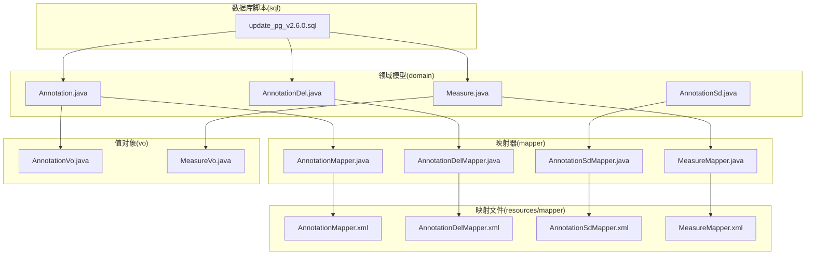
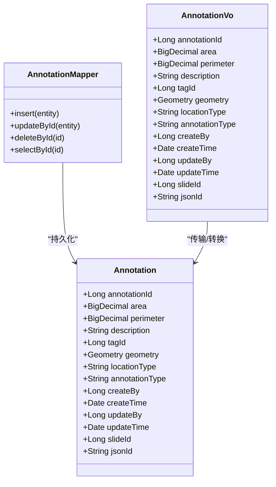
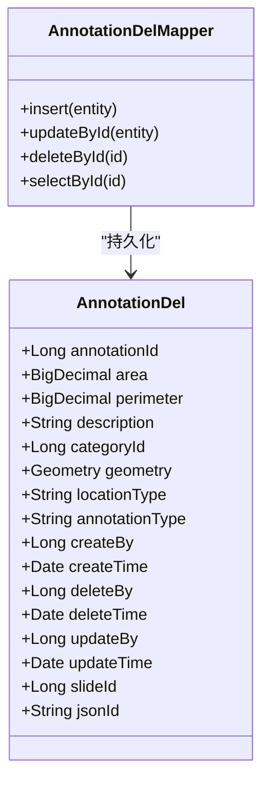
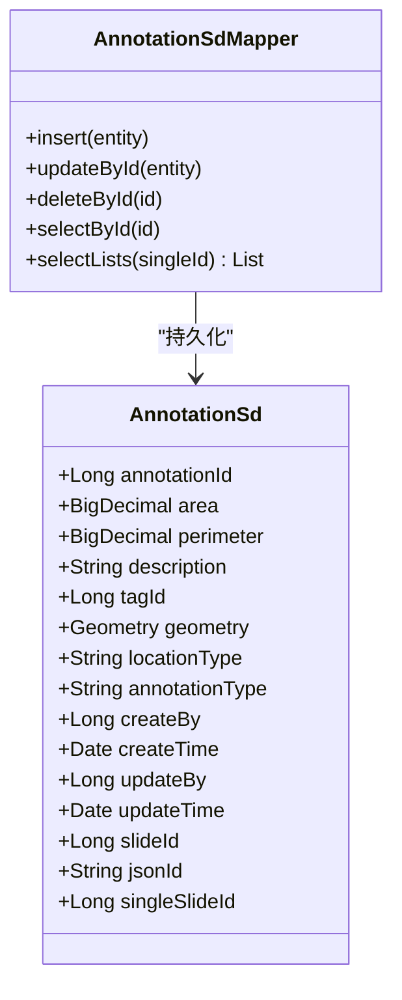
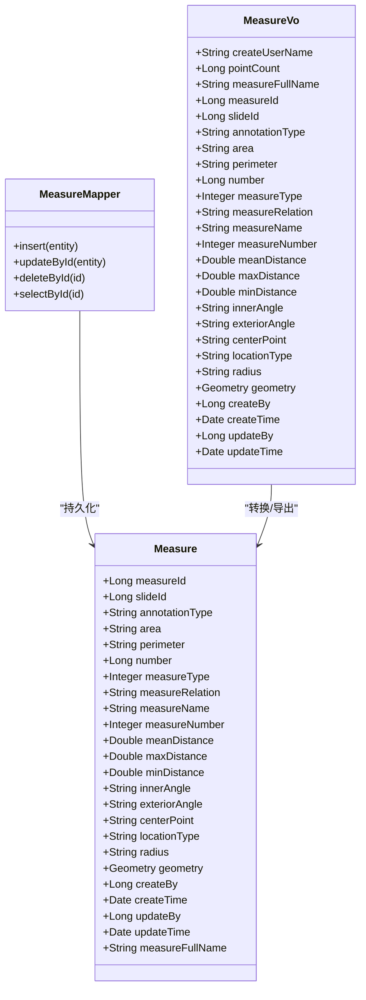
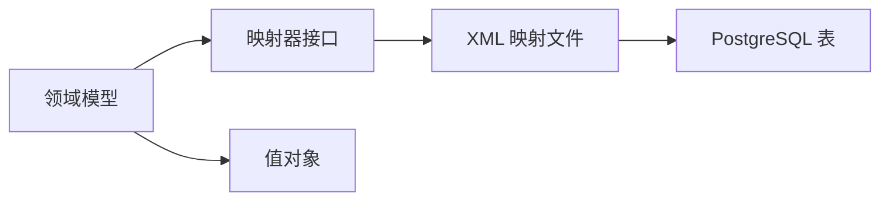
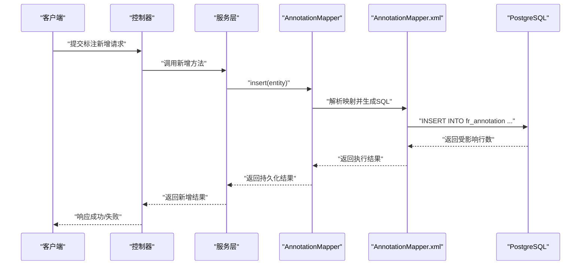

# 数据模型设计

<cite>
**本文引用的文件**
- [Annotation.java](file://src/main/java/cn/staitech/annotation/domain/Annotation.java)
- [AnnotationDel.java](file://src/main/java/cn/staitech/annotation/domain/AnnotationDel.java)
- [AnnotationSd.java](file://src/main/java/cn/staitech/annotation/domain/AnnotationSd.java)
- [Measure.java](file://src/main/java/cn/staitech/annotation/domain/Measure.java)
- [AnnotationMapper.java](file://src/main/java/cn/staitech/annotation/mapper/AnnotationMapper.java)
- [AnnotationDelMapper.java](file://src/main/java/cn/staitech/annotation/mapper/AnnotationDelMapper.java)
- [AnnotationSdMapper.java](file://src/main/java/cn/staitech/annotation/mapper/AnnotationSdMapper.java)
- [MeasureMapper.java](file://src/main/java/cn/staitech/annotation/mapper/MeasureMapper.java)
- [AnnotationMapper.xml](file://src/main/resources/mapper/AnnotationMapper.xml)
- [AnnotationDelMapper.xml](file://src/main/resources/mapper/AnnotationDelMapper.xml)
- [AnnotationSdMapper.xml](file://src/main/resources/mapper/AnnotationSdMapper.xml)
- [MeasureMapper.xml](file://src/main/resources/mapper/MeasureMapper.xml)
- [update_pg_v2.6.0.sql](file://sql/update_pg_v2.6.0.sql)
- [AnnotationVo.java](file://src/main/java/cn/staitech/annotation/vo/anno/AnnotationVo.java)
- [MeasureVo.java](file://src/main/java/cn/staitech/annotation/vo/measure/MeasureVo.java)
</cite>

## 目录
1. [简介](#简介)
2. [项目结构](#项目结构)
3. [核心组件](#核心组件)
4. [架构总览](#架构总览)
5. [详细组件分析](#详细组件分析)
6. [依赖分析](#依赖分析)
7. [性能考虑](#性能考虑)
8. [故障排查指南](#故障排查指南)
9. [结论](#结论)
10. [附录](#附录)

## 简介
本文件面向医学图像标注系统，提供全面的数据模型设计文档。内容覆盖实体关系、字段定义与数据类型、主键/外键关系、索引与约束、数据验证与业务规则、数据库模式图、示例数据、数据访问模式与缓存策略、性能考量、数据生命周期与归档、迁移路径与版本管理、以及数据安全与隐私要求。重点阐述标注实体、测量实体、删除历史实体等核心数据模型的设计思路与实现细节。

## 项目结构
系统采用分层架构，核心领域模型位于 domain 包，MyBatis 映射器位于 mapper 包，XML 映射文件位于 resources/mapper，值对象 VO 位于 vo 包，SQL 初始化脚本位于 sql 目录。



图表来源
- [Annotation.java:1-187](file://src/main/java/cn/staitech/annotation/domain/Annotation.java#L1-L187)
- [AnnotationDel.java:1-179](file://src/main/java/cn/staitech/annotation/domain/AnnotationDel.java#L1-L179)
- [AnnotationSd.java:1-82](file://src/main/java/cn/staitech/annotation/domain/AnnotationSd.java#L1-L82)
- [Measure.java:1-256](file://src/main/java/cn/staitech/annotation/domain/Measure.java#L1-L256)
- [AnnotationMapper.java:1-19](file://src/main/java/cn/staitech/annotation/mapper/AnnotationMapper.java#L1-L19)
- [AnnotationDelMapper.java:1-19](file://src/main/java/cn/staitech/annotation/mapper/AnnotationDelMapper.java#L1-L19)
- [AnnotationSdMapper.java:1-21](file://src/main/java/cn/staitech/annotation/mapper/AnnotationSdMapper.java#L1-L21)
- [MeasureMapper.java:1-19](file://src/main/java/cn/staitech/annotation/mapper/MeasureMapper.java#L1-L19)
- [AnnotationMapper.xml:1-9](file://src/main/resources/mapper/AnnotationMapper.xml#L1-L9)
- [AnnotationDelMapper.xml:1-35](file://src/main/resources/mapper/AnnotationDelMapper.xml#L1-L35)
- [AnnotationSdMapper.xml:1-28](file://src/main/resources/mapper/AnnotationSdMapper.xml#L1-L28)
- [MeasureMapper.xml:1-45](file://src/main/resources/mapper/MeasureMapper.xml#L1-L45)
- [update_pg_v2.6.0.sql:1-245](file://sql/update_pg_v2.6.0.sql#L1-L245)

章节来源
- [Annotation.java:1-187](file://src/main/java/cn/staitech/annotation/domain/Annotation.java#L1-L187)
- [AnnotationDel.java:1-179](file://src/main/java/cn/staitech/annotation/domain/AnnotationDel.java#L1-L179)
- [AnnotationSd.java:1-82](file://src/main/java/cn/staitech/annotation/domain/AnnotationSd.java#L1-L82)
- [Measure.java:1-256](file://src/main/java/cn/staitech/annotation/domain/Measure.java#L1-L256)
- [AnnotationMapper.java:1-19](file://src/main/java/cn/staitech/annotation/mapper/AnnotationMapper.java#L1-L19)
- [AnnotationDelMapper.java:1-19](file://src/main/java/cn/staitech/annotation/mapper/AnnotationDelMapper.java#L1-L19)
- [AnnotationSdMapper.java:1-21](file://src/main/java/cn/staitech/annotation/mapper/AnnotationSdMapper.java#L1-L21)
- [MeasureMapper.java:1-19](file://src/main/java/cn/staitech/annotation/mapper/MeasureMapper.java#L1-L19)
- [AnnotationMapper.xml:1-9](file://src/main/resources/mapper/AnnotationMapper.xml#L1-L9)
- [AnnotationDelMapper.xml:1-35](file://src/main/resources/mapper/AnnotationDelMapper.xml#L1-L35)
- [AnnotationSdMapper.xml:1-28](file://src/main/resources/mapper/AnnotationSdMapper.xml#L1-L28)
- [MeasureMapper.xml:1-45](file://src/main/resources/mapper/MeasureMapper.xml#L1-L45)
- [update_pg_v2.6.0.sql:1-245](file://sql/update_pg_v2.6.0.sql#L1-L245)

## 核心组件
本节概述四大核心数据模型：标注、标注删除历史、筛差标注、测量标注。每个模型均包含实体类、映射器接口、XML 映射文件，并在 SQL 脚本中定义了表结构、索引与注释。

- 标注实体
  - 表名：fr_annotation
  - 主键：annotation_id（自增）
  - 关键字段：area、perimeter、description、tag_id、contour（几何）、location_type、annotation_type、slide_id、json_id
  - 约束与索引：annotation_type、slide_id 索引；默认值与时间戳自动维护
- 标注删除历史实体
  - 表名：fr_annotation_del
  - 主键：annotation_id（自增）
  - 关键字段：area、perimeter、description、category_id、contour、location_type、annotation_type、delete_by、delete_time
  - 约束与索引：同标注表类似，但增加删除相关字段
- 筛差标注实体
  - 表名：fr_annotation_sd
  - 主键：annotation_id（自增）
  - 关键字段：area、perimeter、description、tag_id、contour、location_type、annotation_type、slide_id、json_id、single_slide_id
  - 约束与索引：无显式索引定义
- 测量标注实体
  - 表名：fr_measure
  - 主键：measure_id（自增）
  - 关键字段：slide_id（NOT NULL）、annotation_type、area、perimeter、number、measure_type、measure_relation、measure_name、measure_number、mean_distance、max_distance、min_distance、inner_angle、exterior_angle、center_point、location_type、radius、contour、measure_full_name
  - 约束与索引：slide_id、location_type、measure_full_name 索引；部分字段注释明确业务含义

章节来源
- [Annotation.java:23-102](file://src/main/java/cn/staitech/annotation/domain/Annotation.java#L23-L102)
- [AnnotationDel.java:12-90](file://src/main/java/cn/staitech/annotation/domain/AnnotationDel.java#L12-L90)
- [AnnotationSd.java:17-81](file://src/main/java/cn/staitech/annotation/domain/AnnotationSd.java#L17-L81)
- [Measure.java:20-151](file://src/main/java/cn/staitech/annotation/domain/Measure.java#L20-L151)
- [update_pg_v2.6.0.sql:3-19](file://sql/update_pg_v2.6.0.sql#L3-L19)
- [update_pg_v2.6.0.sql:54-72](file://sql/update_pg_v2.6.0.sql#L54-L72)
- [update_pg_v2.6.0.sql:107-133](file://sql/update_pg_v2.6.0.sql#L107-L133)

## 架构总览
下图展示数据模型与持久化层的整体关系：领域模型通过 MyBatis 映射器接口与 XML 映射文件交互，最终落地到 PostgreSQL 表结构。标注与测量模型还包含对应的值对象用于传输与导出。

```mermaid
erDiagram
FR_ANNOTATION {
bigserial annotation_id PK
numeric area
numeric perimeter
varchar description
bigint tag_id
geometry contour
varchar location_type
varchar annotation_type
bigint create_by
timestamp create_time
bigint update_by
timestamp update_time
bigint slide_id
varchar json_id
}
FR_ANNOTATION_DEL {
bigserial annotation_id PK
numeric area
numeric perimeter
varchar description
bigint category_id
geometry contour
varchar location_type
varchar annotation_type
bigint create_by
timestamp create_time
bigint delete_by
timestamp delete_time
bigint update_by
timestamp update_time
bigint slide_id
varchar json_id
}
FR_ANNOTATION_SD {
bigserial annotation_id PK
numeric area
numeric perimeter
varchar description
bigint tag_id
geometry contour
varchar location_type
varchar annotation_type
bigint create_by
timestamp create_time
bigint update_by
timestamp update_time
bigint slide_id
varchar json_id
bigint single_slide_id
}
FR_MEASURE {
bigserial measure_id PK
bigint slide_id
varchar annotation_type
varchar area
varchar perimeter
bigint number
integer measure_type
varchar measure_relation
varchar measure_name
integer measure_number
double precision mean_distance
double precision max_distance
double precision min_distance
varchar inner_angle
varchar exterior_angle
varchar center_point
varchar location_type
varchar radius
geometry contour
bigint create_by
timestamp create_time
bigint update_by
timestamp update_time
varchar measure_full_name
}
FR_ANNOTATION ||--o{ FR_ANNOTATION_DEL : "删除历史"
FR_ANNOTATION ||--o{ FR_ANNOTATION_SD : "筛差关联"
FR_ANNOTATION ||--o{ FR_MEASURE : "按切片关联"
```

图表来源
- [update_pg_v2.6.0.sql:3-19](file://sql/update_pg_v2.6.0.sql#L3-L19)
- [update_pg_v2.6.0.sql:54-72](file://sql/update_pg_v2.6.0.sql#L54-L72)
- [update_pg_v2.6.0.sql:107-133](file://sql/update_pg_v2.6.0.sql#L107-L133)

## 详细组件分析

### 标注实体（Annotation）
- 设计要点
  - 使用几何类型存储轮廓坐标，便于空间查询与分析
  - annotation_type 字段区分 AI、Draw、Measure 等类型，支持后续统计与过滤
  - slide_id 作为强约束，确保标注归属到具体切片
  - json_id 用于与 GeoJSON 数据源的关联
- 字段与类型
  - 主键：annotation_id（bigserial）
  - 数值：area、perimeter（numeric/decimal）
  - 文本：description、location_type、annotation_type、json_id
  - 几何：contour（geometry）
  - 时间戳：create_time、update_time
  - 用户：create_by、update_by
  - 关联：tag_id、slide_id
- 约束与索引
  - annotation_type、slide_id 建有索引，提升查询效率
  - 默认值与时间戳自动维护
- 数据访问模式
  - 通过 AnnotationMapper 接口进行 CRUD 操作
  - XML 映射文件定义列映射与结果集映射
- 值对象
  - AnnotationVo 提供传输与日志审计所需字段，含校验注解



图表来源
- [Annotation.java:25-102](file://src/main/java/cn/staitech/annotation/domain/Annotation.java#L25-L102)
- [AnnotationMapper.java:12-14](file://src/main/java/cn/staitech/annotation/mapper/AnnotationMapper.java#L12-L14)
- [AnnotationVo.java:26-126](file://src/main/java/cn/staitech/annotation/vo/anno/AnnotationVo.java#L26-L126)

章节来源
- [Annotation.java:23-102](file://src/main/java/cn/staitech/annotation/domain/Annotation.java#L23-L102)
- [AnnotationMapper.java:12-14](file://src/main/java/cn/staitech/annotation/mapper/AnnotationMapper.java#L12-L14)
- [AnnotationMapper.xml:1-9](file://src/main/resources/mapper/AnnotationMapper.xml#L1-L9)
- [AnnotationVo.java:26-126](file://src/main/java/cn/staitech/annotation/vo/anno/AnnotationVo.java#L26-L126)
- [update_pg_v2.6.0.sql:3-19](file://sql/update_pg_v2.6.0.sql#L3-L19)

### 标注删除历史实体（AnnotationDel）
- 设计要点
  - 记录删除时的标注快照，包含 area、perimeter、description、contour 等
  - 增加 delete_by、delete_time 字段，追踪删除操作
  - 保持与标注实体一致的字段命名风格
- 字段与类型
  - 主键：annotation_id（bigserial）
  - 数值：area、perimeter（numeric）
  - 文本：description、location_type、annotation_type、json_id
  - 几何：contour（geometry）
  - 时间戳：create_time、delete_time、update_time
  - 用户：create_by、delete_by、update_by
  - 关联：categoryId、slideId
- 约束与索引
  - 未见显式索引定义
- 数据访问模式
  - 通过 AnnotationDelMapper 接口进行 CRUD 操作
  - XML 映射文件定义完整列映射与结果集映射



图表来源
- [AnnotationDel.java:14-90](file://src/main/java/cn/staitech/annotation/domain/AnnotationDel.java#L14-L90)
- [AnnotationDelMapper.java:12-14](file://src/main/java/cn/staitech/annotation/mapper/AnnotationDelMapper.java#L12-L14)
- [AnnotationDelMapper.xml:7-24](file://src/main/resources/mapper/AnnotationDelMapper.xml#L7-L24)

章节来源
- [AnnotationDel.java:12-90](file://src/main/java/cn/staitech/annotation/domain/AnnotationDel.java#L12-L90)
- [AnnotationDelMapper.java:12-14](file://src/main/java/cn/staitech/annotation/mapper/AnnotationDelMapper.java#L12-L14)
- [AnnotationDelMapper.xml:1-35](file://src/main/resources/mapper/AnnotationDelMapper.xml#L1-L35)
- [update_pg_v2.6.0.sql:54-72](file://sql/update_pg_v2.6.0.sql#L54-L72)

### 筛差标注实体（AnnotationSd）
- 设计要点
  - 用于单切片对比分析，新增 single_slide_id 字段
  - 继承标注实体的核心字段，便于统一处理
- 字段与类型
  - 主键：annotation_id（bigserial）
  - 数值：area、perimeter（numeric）
  - 文本：description、location_type、annotation_type、json_id
  - 几何：contour（geometry）
  - 时间戳：create_time、update_time
  - 用户：create_by、update_by
  - 关联：tag_id、slide_id、single_slide_id
- 约束与索引
  - 未见显式索引定义
- 数据访问模式
  - 通过 AnnotationSdMapper 接口进行 CRUD 操作
  - XML 映射文件提供 SQL 查询，按 single_slide_id 过滤并返回 VO 结果



图表来源
- [AnnotationSd.java:19-81](file://src/main/java/cn/staitech/annotation/domain/AnnotationSd.java#L19-L81)
- [AnnotationSdMapper.java:13-16](file://src/main/java/cn/staitech/annotation/mapper/AnnotationSdMapper.java#L13-L16)
- [AnnotationSdMapper.xml:6-26](file://src/main/resources/mapper/AnnotationSdMapper.xml#L6-L26)

章节来源
- [AnnotationSd.java:17-81](file://src/main/java/cn/staitech/annotation/domain/AnnotationSd.java#L17-L81)
- [AnnotationSdMapper.java:13-16](file://src/main/java/cn/staitech/annotation/mapper/AnnotationSdMapper.java#L13-L16)
- [AnnotationSdMapper.xml:1-28](file://src/main/resources/mapper/AnnotationSdMapper.xml#L1-L28)
- [update_pg_v2.6.0.sql:107-133](file://sql/update_pg_v2.6.0.sql#L107-L133)

### 测量标注实体（Measure）
- 设计要点
  - 支持多种测量类型（线、多边形、点等），通过 location_type 与 contour 共同表达
  - 提供丰富的测量指标（面积、周长、角度、距离等），以字符串或数值形式存储
  - annotation_type 区分 AI、Draw、Measure 类型
  - slide_id 为必填项，确保测量归属
- 字段与类型
  - 主键：measure_id（bigserial）
  - 数值：mean_distance、max_distance、min_distance（double precision）
  - 文本：area、perimeter、inner_angle、exterior_angle、center_point、radius、measure_full_name
  - 整数：number、measure_type、measure_number（integer）
  - 几何：contour（geometry）
  - 时间戳：create_time、update_time
  - 用户：create_by、update_by
  - 关联：slide_id、annotation_type、location_type
- 约束与索引
  - slide_id、location_type、measure_full_name 建有索引
- 数据访问模式
  - 通过 MeasureMapper 接口进行 CRUD 操作
  - XML 映射文件定义列映射与结果集映射
- 值对象
  - MeasureVo 提供导出与展示所需的字段，包含 Excel 注解与序列化配置



图表来源
- [Measure.java:22-151](file://src/main/java/cn/staitech/annotation/domain/Measure.java#L22-L151)
- [MeasureMapper.java:12-14](file://src/main/java/cn/staitech/annotation/mapper/MeasureMapper.java#L12-L14)
- [MeasureVo.java:34-203](file://src/main/java/cn/staitech/annotation/vo/measure/MeasureVo.java#L34-L203)

章节来源
- [Measure.java:20-151](file://src/main/java/cn/staitech/annotation/domain/Measure.java#L20-L151)
- [MeasureMapper.java:12-14](file://src/main/java/cn/staitech/annotation/mapper/MeasureMapper.java#L12-L14)
- [MeasureMapper.xml:7-32](file://src/main/resources/mapper/MeasureMapper.xml#L7-L32)
- [MeasureVo.java:34-203](file://src/main/java/cn/staitech/annotation/vo/measure/MeasureVo.java#L34-L203)
- [update_pg_v2.6.0.sql:107-133](file://sql/update_pg_v2.6.0.sql#L107-L133)

### 数据验证与业务规则
- 参数校验
  - 标注实体：contour 字段非空校验；slide_id 字段非空校验
  - 筛差查询：selectLists 方法参数 singleId 非空校验
- 业务规则
  - annotation_type 用于区分 AI、Draw、Measure 类型，便于统计与权限控制
  - slide_id 作为强约束，确保数据隔离与切片维度分析
  - 删除历史表记录删除快照，支持审计与恢复

章节来源
- [Annotation.java:61-102](file://src/main/java/cn/staitech/annotation/domain/Annotation.java#L61-L102)
- [AnnotationSdMapper.java:15-15](file://src/main/java/cn/staitech/annotation/mapper/AnnotationSdMapper.java#L15-L15)
- [AnnotationVo.java:68-116](file://src/main/java/cn/staitech/annotation/vo/anno/AnnotationVo.java#L68-L116)

### 示例数据
- 标注表插入示例（来自迁移脚本）
  - 将旧表 fr_annotation_1/2/3 的 area、perimeter 等字段按规则转换后插入 fr_annotation
  - 转换逻辑：使用正则表达式判断是否为数字，否则置空
- 该流程体现了数据清洗与兼容性处理策略

章节来源
- [update_pg_v2.6.0.sql:167-234](file://sql/update_pg_v2.6.0.sql#L167-L234)

## 依赖分析
- 组件耦合
  - 领域模型与映射器接口松耦合，通过 MyBatis 解析 XML 映射文件执行 SQL
  - 值对象与领域模型之间存在转换关系，便于传输与导出
- 外部依赖
  - PostGIS 几何类型 geometry 用于空间数据存储与查询
  - MyBatis Plus 提供通用 Mapper 能力
- 可能的循环依赖
  - 当前结构未发现循环依赖，各层职责清晰



图表来源
- [AnnotationMapper.java:12-14](file://src/main/java/cn/staitech/annotation/mapper/AnnotationMapper.java#L12-L14)
- [AnnotationMapper.xml:5-8](file://src/main/resources/mapper/AnnotationMapper.xml#L5-L8)
- [update_pg_v2.6.0.sql:3-19](file://sql/update_pg_v2.6.0.sql#L3-L19)

章节来源
- [AnnotationMapper.java:12-14](file://src/main/java/cn/staitech/annotation/mapper/AnnotationMapper.java#L12-L14)
- [AnnotationDelMapper.java:12-14](file://src/main/java/cn/staitech/annotation/mapper/AnnotationDelMapper.java#L12-L14)
- [AnnotationSdMapper.java:13-16](file://src/main/java/cn/staitech/annotation/mapper/AnnotationSdMapper.java#L13-L16)
- [MeasureMapper.java:12-14](file://src/main/java/cn/staitech/annotation/mapper/MeasureMapper.java#L12-L14)

## 性能考虑
- 索引策略
  - 标注表：annotation_type、slide_id 索引，提升按类型与切片查询性能
  - 测量表：slide_id、location_type、measure_full_name 索引，优化多维检索
- 几何查询
  - contour 字段为 geometry 类型，建议结合 PostGIS 函数进行空间索引与查询优化
- 批量迁移
  - 迁移脚本采用正则转换与批量插入，减少手工处理成本
- 缓存策略
  - 建议对高频查询结果（如按 slide_id 的标注列表）引入应用层缓存，降低数据库压力
  - 对测量指标（如平均/最大/最小距离）可做聚合缓存，定期刷新

[本节为通用性能指导，不直接分析具体文件]

## 故障排查指南
- 常见问题
  - 几何数据导入失败：检查 contour 字段的几何类型与坐标格式是否符合 PostGIS 规范
  - 索引缺失导致查询慢：确认 annotation_type、slide_id、location_type、measure_full_name 等索引是否存在
  - 删除历史缺失：确认删除流程是否正确写入 fr_annotation_del 表
- 审计与回溯
  - 通过标注删除历史表与标注表的关联，定位删除时间与操作人
- 数据一致性
  - 迁移脚本中的正则转换可避免非法数值导致的插入异常

章节来源
- [update_pg_v2.6.0.sql:20-23](file://sql/update_pg_v2.6.0.sql#L20-L23)
- [update_pg_v2.6.0.sql:136-138](file://sql/update_pg_v2.6.0.sql#L136-L138)
- [AnnotationDelMapper.xml:7-24](file://src/main/resources/mapper/AnnotationDelMapper.xml#L7-L24)

## 结论
本数据模型围绕标注、删除历史、筛差与测量四类核心实体构建，采用 PostGIS 几何类型支撑空间分析，配合 MyBatis 映射实现高效持久化。通过索引与查询优化、值对象转换与缓存策略，可在保证数据完整性的同时满足医学图像标注场景的性能与可维护性需求。迁移脚本提供了从旧表到新表的平滑过渡方案，便于版本演进与数据治理。

[本节为总结性内容，不直接分析具体文件]

## 附录

### 数据库模式图（字段级）
```mermaid
erDiagram
FR_ANNOTATION {
bigserial annotation_id PK
numeric area
numeric perimeter
varchar description
bigint tag_id
geometry contour
varchar location_type
varchar annotation_type
bigint create_by
timestamp create_time
bigint update_by
timestamp update_time
bigint slide_id
varchar json_id
}
FR_ANNOTATION_DEL {
bigserial annotation_id PK
numeric area
numeric perimeter
varchar description
bigint category_id
geometry contour
varchar location_type
varchar annotation_type
bigint create_by
timestamp create_time
bigint delete_by
timestamp delete_time
bigint update_by
timestamp update_time
bigint slide_id
varchar json_id
}
FR_ANNOTATION_SD {
bigserial annotation_id PK
numeric area
numeric perimeter
varchar description
bigint tag_id
geometry contour
varchar location_type
varchar annotation_type
bigint create_by
timestamp create_time
bigint update_by
timestamp update_time
bigint slide_id
varchar json_id
bigint single_slide_id
}
FR_MEASURE {
bigserial measure_id PK
bigint slide_id
varchar annotation_type
varchar area
varchar perimeter
bigint number
integer measure_type
varchar measure_relation
varchar measure_name
integer measure_number
double precision mean_distance
double precision max_distance
double precision min_distance
varchar inner_angle
varchar exterior_angle
varchar center_point
varchar location_type
varchar radius
geometry contour
bigint create_by
timestamp create_time
bigint update_by
timestamp update_time
varchar measure_full_name
}
```

图表来源
- [update_pg_v2.6.0.sql:3-19](file://sql/update_pg_v2.6.0.sql#L3-L19)
- [update_pg_v2.6.0.sql:54-72](file://sql/update_pg_v2.6.0.sql#L54-L72)
- [update_pg_v2.6.0.sql:107-133](file://sql/update_pg_v2.6.0.sql#L107-L133)

### 数据访问流程（标注新增）


图表来源
- [AnnotationMapper.java:12-14](file://src/main/java/cn/staitech/annotation/mapper/AnnotationMapper.java#L12-L14)
- [AnnotationMapper.xml:5-8](file://src/main/resources/mapper/AnnotationMapper.xml#L5-L8)
- [update_pg_v2.6.0.sql:3-19](file://sql/update_pg_v2.6.0.sql#L3-L19)

### 数据生命周期与归档
- 生命周期
  - 创建：标注/测量数据随用户操作产生
  - 使用：按 slide_id 进行查询与分析
  - 删除：通过删除历史表记录快照，支持审计与回溯
- 归档策略
  - 建议按切片或时间维度归档历史标注与测量数据，保留必要元数据与几何信息
- 版本管理
  - 通过迁移脚本（如 update_pg_v2.6.0.sql）管理表结构变更，确保向后兼容

章节来源
- [update_pg_v2.6.0.sql:167-234](file://sql/update_pg_v2.6.0.sql#L167-L234)

### 数据安全与隐私
- 访问控制
  - 基于 slide_id 的强约束实现数据隔离，防止越权访问
  - annotation_type 字段可用于区分数据来源（AI/人工），辅助权限控制
- 审计与日志
  - 删除历史表记录 delete_by、delete_time，便于审计追踪
- 数据脱敏
  - 建议对敏感字段（如创建者、时间）在导出与展示层进行脱敏处理

[本节为通用安全指导，不直接分析具体文件]