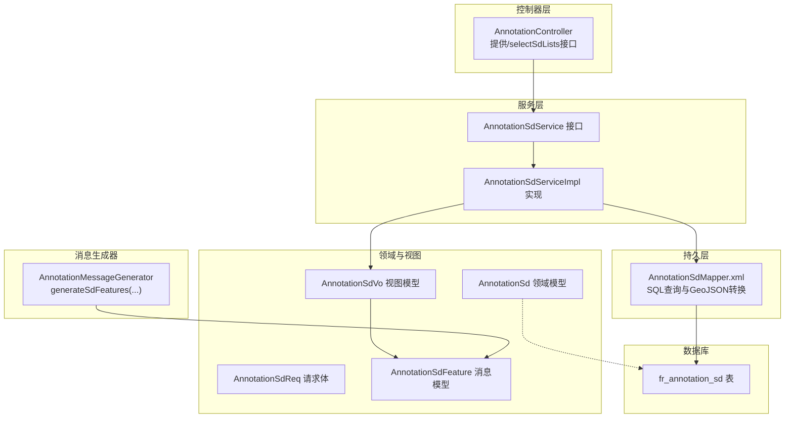
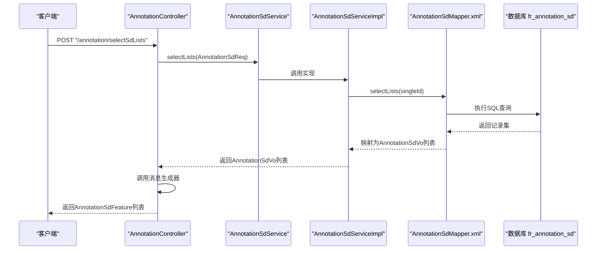
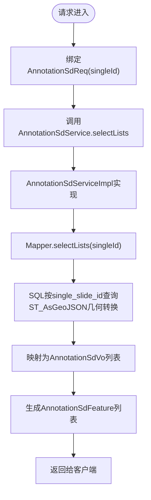
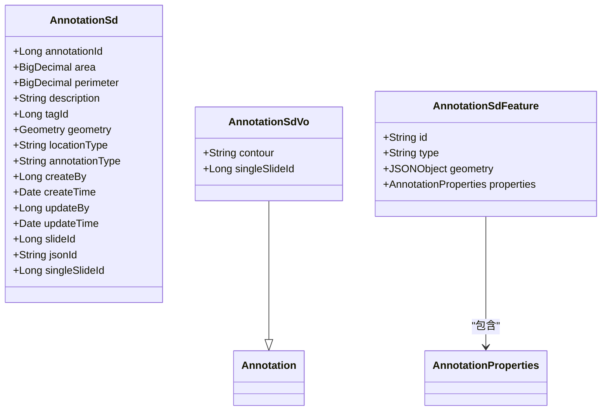

# 标注SD实体模型

<cite>
**本文引用的文件**
- [AnnotationSd.java](file://src/main/java/cn/staitech/annotation/domain/AnnotationSd.java)
- [AnnotationSdService.java](file://src/main/java/cn/staitech/annotation/service/AnnotationSdService.java)
- [AnnotationSdServiceImpl.java](file://src/main/java/cn/staitech/annotation/service/impl/AnnotationSdServiceImpl.java)
- [AnnotationSdMapper.xml](file://src/main/resources/mapper/AnnotationSdMapper.xml)
- [AnnotationSdReq.java](file://src/main/java/cn/staitech/annotation/vo/anno/AnnotationSdReq.java)
- [AnnotationSdVo.java](file://src/main/java/cn/staitech/annotation/vo/anno/AnnotationSdVo.java)
- [AnnotationController.java](file://src/main/java/cn/staitech/annotation/controller/AnnotationController.java)
- [AnnotationMessageGenerator.java](file://src/main/java/cn/staitech/annotation/utils/annotation/AnnotationMessageGenerator.java)
- [AnnotationSdFeature.java](file://src/main/java/cn/staitech/annotation/netty/message/AnnotationSdFeature.java)
- [Annotation.java](file://src/main/java/cn/staitech/annotation/domain/Annotation.java)
- [update_pg_v2.6.0.sql](file://sql/update_pg_v2.6.0.sql)
</cite>

## 目录
1. [简介](#简介)
2. [项目结构](#项目结构)
3. [核心组件](#核心组件)
4. [架构总览](#架构总览)
5. [详细组件分析](#详细组件分析)
6. [依赖分析](#依赖分析)
7. [性能考量](#性能考量)
8. [故障排查指南](#故障排查指南)
9. [结论](#结论)
10. [附录](#附录)

## 简介
本文件系统化梳理“标注SD实体”的数据模型与实现，重点覆盖以下方面：
- SD实体的业务定位与数据结构
- SD相关字段的语义与计算来源
- 统计分析能力与典型应用场景
- SD实体与标注实体的数据关联与同步机制
- SD数据的计算逻辑、存储格式与查询接口
- 在质量控制与数据分析中的作用
- 更新频率、缓存策略与性能优化建议

## 项目结构
围绕SD实体的关键代码分布在领域模型、服务层、持久层、控制器与消息生成器等模块，形成清晰的分层职责。

图表来源
- [AnnotationController.java:155-164](file://src/main/java/cn/staitech/annotation/controller/AnnotationController.java#L155-L164)
- [AnnotationSdService.java:13-21](file://src/main/java/cn/staitech/annotation/service/AnnotationSdService.java#L13-L21)
- [AnnotationSdServiceImpl.java:26-29](file://src/main/java/cn/staitech/annotation/service/impl/AnnotationSdServiceImpl.java#L26-L29)
- [AnnotationSdMapper.xml:6-26](file://src/main/resources/mapper/AnnotationSdMapper.xml#L6-L26)
- [AnnotationSd.java:17-82](file://src/main/java/cn/staitech/annotation/domain/AnnotationSd.java#L17-L82)
- [AnnotationSdReq.java:12-19](file://src/main/java/cn/staitech/annotation/vo/anno/AnnotationSdReq.java#L12-L19)
- [AnnotationSdVo.java:12-21](file://src/main/java/cn/staitech/annotation/vo/anno/AnnotationSdVo.java#L12-L21)
- [AnnotationSdFeature.java:10-15](file://src/main/java/cn/staitech/annotation/netty/message/AnnotationSdFeature.java#L10-L15)
- [AnnotationMessageGenerator.java:139-145](file://src/main/java/cn/staitech/annotation/utils/annotation/AnnotationMessageGenerator.java#L139-L145)

章节来源
- [AnnotationController.java:155-164](file://src/main/java/cn/staitech/annotation/controller/AnnotationController.java#L155-L164)
- [AnnotationSdMapper.xml:6-26](file://src/main/resources/mapper/AnnotationSdMapper.xml#L6-L26)

## 核心组件
- 领域模型 AnnotationSd：承载SD实体的完整字段定义，包括几何字段、面积、周长、标签、类型、时间戳与切片标识等。
- 查询请求 AnnotationSdReq：限定按单切片维度检索SD数据。
- 视图模型 AnnotationSdVo：扩展标注基础属性，附加几何字符串与单切片ID。
- 服务接口与实现 AnnotationSdService/AnnotationSdServiceImpl：封装查询逻辑，委托Mapper执行SQL。
- 持久层映射 AnnotationSdMapper.xml：提供SQL查询、GeoJSON序列化与字段映射。
- 控制器接口 AnnotationController.selectSdLists：对外暴露查询端点，返回SD特征集合。
- 消息模型 AnnotationSdFeature：用于前端渲染的GeoJSON Feature结构。
- 消息生成器 AnnotationMessageGenerator：将SD视图模型转换为SD Feature对象。

章节来源
- [AnnotationSd.java:17-82](file://src/main/java/cn/staitech/annotation/domain/AnnotationSd.java#L17-L82)
- [AnnotationSdReq.java:12-19](file://src/main/java/cn/staitech/annotation/vo/anno/AnnotationSdReq.java#L12-L19)
- [AnnotationSdVo.java:12-21](file://src/main/java/cn/staitech/annotation/vo/anno/AnnotationSdVo.java#L12-L21)
- [AnnotationSdService.java:13-21](file://src/main/java/cn/staitech/annotation/service/AnnotationSdService.java#L13-L21)
- [AnnotationSdServiceImpl.java:26-29](file://src/main/java/cn/staitech/annotation/service/impl/AnnotationSdServiceImpl.java#L26-L29)
- [AnnotationSdMapper.xml:6-26](file://src/main/resources/mapper/AnnotationSdMapper.xml#L6-L26)
- [AnnotationController.java:155-164](file://src/main/java/cn/staitech/annotation/controller/AnnotationController.java#L155-L164)
- [AnnotationSdFeature.java:10-15](file://src/main/java/cn/staitech/annotation/netty/message/AnnotationSdFeature.java#L10-L15)
- [AnnotationMessageGenerator.java:139-145](file://src/main/java/cn/staitech/annotation/utils/annotation/AnnotationMessageGenerator.java#L139-L145)

## 架构总览
SD实体查询链路从HTTP入口开始，经由控制器调用服务层，再由MyBatis执行SQL，最终通过消息生成器输出GeoJSON Feature。

图表来源
- [AnnotationController.java:155-164](file://src/main/java/cn/staitech/annotation/controller/AnnotationController.java#L155-L164)
- [AnnotationSdServiceImpl.java:26-29](file://src/main/java/cn/staitech/annotation/service/impl/AnnotationSdServiceImpl.java#L26-L29)
- [AnnotationSdMapper.xml:6-26](file://src/main/resources/mapper/AnnotationSdMapper.xml#L6-L26)
- [AnnotationMessageGenerator.java:139-145](file://src/main/java/cn/staitech/annotation/utils/annotation/AnnotationMessageGenerator.java#L139-L145)

## 详细组件分析

### 数据模型与字段定义
- 表名与主键
  - 表名：fr_annotation_sd
  - 主键：annotation_id（自增）
- 几何与空间字段
  - 几何字段：contour（PostGIS Geometry），通过ST_AsGeoJSON转换为GeoJSON字符串返回
  - 字段映射：geometry属性对应contour列，contour字符串字段用于前端渲染
- 几何度量字段
  - area：面积（数值型）
  - perimeter：周长（数值型）
- 业务标识
  - tagId：标签ID
  - description：轮廓描述
  - locationType：轮廓类型
  - annotationType：标注类型（AI/Draw/Measure）
  - slideId：切片ID
  - jsonId：GeoJSON中数据ID
  - singleSlideId：单切片ID（查询条件）
- 时间与审计
  - createBy/createTime、updateBy/updateTime

章节来源
- [AnnotationSd.java:17-82](file://src/main/java/cn/staitech/annotation/domain/AnnotationSd.java#L17-L82)
- [AnnotationSdMapper.xml:6-26](file://src/main/resources/mapper/AnnotationSdMapper.xml#L6-L26)

### 查询接口与数据流
- 入口
  - 控制器端点：POST /annotation/selectSdLists
  - 请求体：AnnotationSdReq（包含singleId）
  - 返回体：List<AnnotationSdFeature>
- 服务层
  - AnnotationSdService.selectLists(AnnotationSdReq) → List<AnnotationSdVo>
  - AnnotationSdServiceImpl基于Mapper执行查询
- 持久层
  - SQL按single_slide_id过滤
  - 使用ST_AsGeoJSON将几何转为GeoJSON字符串
  - 字段别名映射到AnnotationSdVo
- 消息生成
  - AnnotationMessageGenerator.generateSdFeatures将AnnotationSdVo转换为AnnotationSdFeature
  - Feature.geometry为GeoJSON对象，id取自jsonId

图表来源
- [AnnotationController.java:155-164](file://src/main/java/cn/staitech/annotation/controller/AnnotationController.java#L155-L164)
- [AnnotationSdServiceImpl.java:26-29](file://src/main/java/cn/staitech/annotation/service/impl/AnnotationSdServiceImpl.java#L26-L29)
- [AnnotationSdMapper.xml:6-26](file://src/main/resources/mapper/AnnotationSdMapper.xml#L6-L26)
- [AnnotationMessageGenerator.java:139-145](file://src/main/java/cn/staitech/annotation/utils/annotation/AnnotationMessageGenerator.java#L139-L145)

章节来源
- [AnnotationController.java:155-164](file://src/main/java/cn/staitech/annotation/controller/AnnotationController.java#L155-L164)
- [AnnotationSdServiceImpl.java:26-29](file://src/main/java/cn/staitech/annotation/service/impl/AnnotationSdServiceImpl.java#L26-L29)
- [AnnotationSdMapper.xml:6-26](file://src/main/resources/mapper/AnnotationSdMapper.xml#L6-L26)
- [AnnotationMessageGenerator.java:139-145](file://src/main/java/cn/staitech/annotation/utils/annotation/AnnotationMessageGenerator.java#L139-L145)

### SD字段的含义与计算方式
- 字段语义
  - area：区域面积（数值型）
  - perimeter：轮廓周长（数值型）
  - geometry：几何对象（PostGIS Geometry）
  - contour：GeoJSON字符串（由ST_AsGeoJSON转换）
- 计算来源
  - 当前仓库未提供SD实体的“计算逻辑”实现；area/perimeter/contour等字段由上游流程写入或由数据库函数生成
  - 若需重新计算，可在服务层引入几何处理（如JTS/PostGIS函数）进行重算，并回写至表

章节来源
- [AnnotationSd.java:28-45](file://src/main/java/cn/staitech/annotation/domain/AnnotationSd.java#L28-L45)
- [AnnotationSdMapper.xml:14](file://src/main/resources/mapper/AnnotationSdMapper.xml#L14)

### SD实体与标注实体的数据关联与同步
- 关联关系
  - SD实体与标注实体共享几何与标签等属性，且均支持GeoJSON渲染
  - SD实体通过singleSlideId进行单切片过滤，标注实体通过slideId过滤
- 同步机制
  - 仓库未提供SD实体的自动同步逻辑；若需要保持一致性，可设计定时任务或事件驱动机制，确保SD表与标注表在关键字段变更时同步

章节来源
- [AnnotationSd.java:73-81](file://src/main/java/cn/staitech/annotation/domain/AnnotationSd.java#L73-L81)
- [Annotation.java:100-102](file://src/main/java/cn/staitech/annotation/domain/Annotation.java#L100-L102)

### 统计分析功能与应用场景
- 统计分析能力
  - 仓库未提供针对SD实体的聚合统计接口；当前仅提供按单切片ID的查询
- 应用场景
  - 质量控制：对比不同标注者的轮廓一致性（基于几何与度量）
  - 数据分析：按标签、类型、切片维度统计面积/周长分布
  - 可扩展：可在服务层增加聚合查询，结合数据库函数实现统计指标

章节来源
- [AnnotationSdMapper.xml:6-26](file://src/main/resources/mapper/AnnotationSdMapper.xml#L6-L26)

### 存储格式与查询接口
- 存储格式
  - 几何：PostGIS Geometry
  - 几何字符串：GeoJSON（ST_AsGeoJSON转换）
  - 数值：BigDecimal（area/perimeter）
- 查询接口
  - 端点：POST /annotation/selectSdLists
  - 请求：AnnotationSdReq.singleId
  - 响应：List<AnnotationSdFeature>

章节来源
- [AnnotationSdMapper.xml:14](file://src/main/resources/mapper/AnnotationSdMapper.xml#L14)
- [AnnotationController.java:155-164](file://src/main/java/cn/staitech/annotation/controller/AnnotationController.java#L155-L164)

## 依赖分析
- 组件耦合
  - 控制器依赖服务接口，服务实现依赖Mapper，Mapper依赖数据库
  - 视图模型继承标注基础类，便于统一消息生成
- 外部依赖
  - PostGIS（几何类型与ST_AsGeoJSON）
  - MyBatis（XML映射）
  - Lombok（简化模型）

图表来源
- [AnnotationSd.java:17-82](file://src/main/java/cn/staitech/annotation/domain/AnnotationSd.java#L17-L82)
- [AnnotationSdVo.java:12-21](file://src/main/java/cn/staitech/annotation/vo/anno/AnnotationSdVo.java#L12-L21)
- [AnnotationSdFeature.java:10-15](file://src/main/java/cn/staitech/annotation/netty/message/AnnotationSdFeature.java#L10-L15)
- [Annotation.java:25-187](file://src/main/java/cn/staitech/annotation/domain/Annotation.java#L25-L187)

章节来源
- [AnnotationSd.java:17-82](file://src/main/java/cn/staitech/annotation/domain/AnnotationSd.java#L17-L82)
- [AnnotationSdVo.java:12-21](file://src/main/java/cn/staitech/annotation/vo/anno/AnnotationSdVo.java#L12-L21)
- [AnnotationSdFeature.java:10-15](file://src/main/java/cn/staitech/annotation/netty/message/AnnotationSdFeature.java#L10-L15)
- [Annotation.java:25-187](file://src/main/java/cn/staitech/annotation/domain/Annotation.java#L25-L187)

## 性能考量
- 查询性能
  - 建议在single_slide_id上建立索引（当前仓库未见该索引定义，可参考标注表索引模式）
  - GeoJSON转换在数据库侧完成，避免应用层重复转换
- 缓存策略
  - 按单切片维度缓存查询结果，设置合理TTL
  - 对热点标签/类型组合进行预聚合缓存
- 传输优化
  - 仅返回必要字段，避免冗余数据
  - 前端按需渲染，减少DOM压力

[本节为通用性能建议，不直接分析具体文件]

## 故障排查指南
- 常见问题
  - 几何为空或解析失败：检查contour字段是否为有效几何对象
  - GeoJSON字符串异常：确认ST_AsGeoJSON转换是否成功
  - 查询无结果：核对singleId是否正确传入
- 定位方法
  - 查看控制器日志与响应码
  - 核对Mapper SQL与字段映射
  - 检查消息生成器对contour的JSON解析

章节来源
- [AnnotationController.java:155-164](file://src/main/java/cn/staitech/annotation/controller/AnnotationController.java#L155-L164)
- [AnnotationSdMapper.xml:6-26](file://src/main/resources/mapper/AnnotationSdMapper.xml#L6-L26)
- [AnnotationMessageGenerator.java:139-145](file://src/main/java/cn/staitech/annotation/utils/annotation/AnnotationMessageGenerator.java#L139-L145)

## 结论
- SD实体以几何与度量为核心，服务于质量控制与数据分析
- 当前实现聚焦于查询与渲染，未包含SD的自动计算与同步逻辑
- 建议后续补充：几何重算、自动同步、聚合统计与缓存策略，以提升可用性与性能

[本节为总结性内容，不直接分析具体文件]

## 附录

### 数据库脚本要点（与SD相关）
- fr_annotation_sd表结构与注释（字段、索引、注释）
- 与标注表的差异：SD表包含几何与度量字段，适用于统计分析与可视化

章节来源
- [update_pg_v2.6.0.sql:167-188](file://sql/update_pg_v2.6.0.sql#L167-L188)