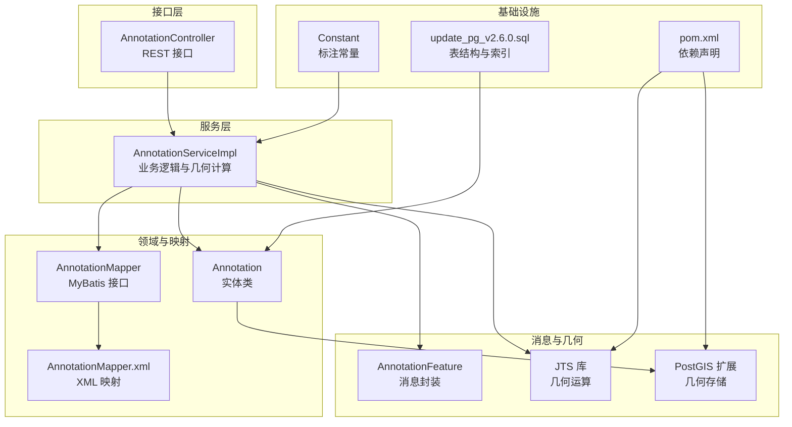
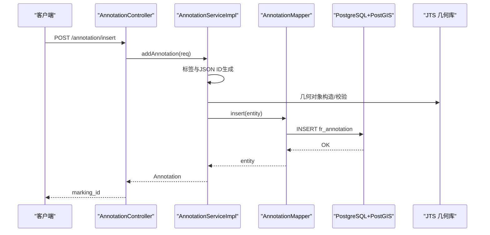
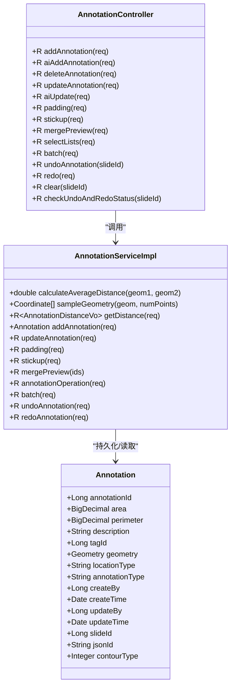
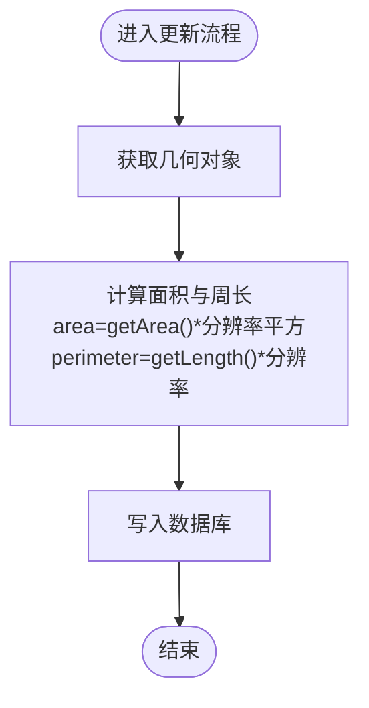
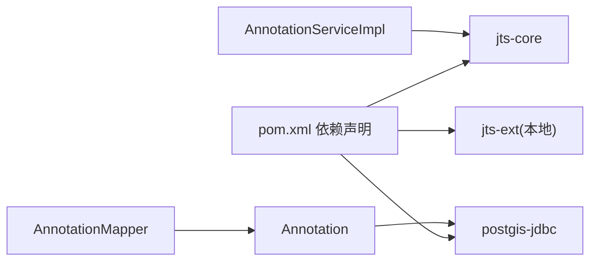

# 标注实体模型

<cite>
**本文引用的文件**
- [Annotation.java](file://src/main/java/cn/staitech/annotation/domain/Annotation.java)
- [AnnotationMapper.java](file://src/main/java/cn/staitech/annotation/mapper/AnnotationMapper.java)
- [AnnotationMapper.xml](file://src/main/resources/mapper/AnnotationMapper.xml)
- [AnnotationServiceImpl.java](file://src/main/java/cn/staitech/annotation/service/impl/AnnotationServiceImpl.java)
- [AnnotationController.java](file://src/main/java/cn/staitech/annotation/controller/AnnotationController.java)
- [AnnotationAddReq.java](file://src/main/java/cn/staitech/annotation/vo/anno/AnnotationAddReq.java)
- [AnnotationUpdateVo.java](file://src/main/java/cn/staitech/annotation/vo/anno/AnnotationUpdateVo.java)
- [AnnotationReq.java](file://src/main/java/cn/staitech/annotation/vo/anno/AnnotationReq.java)
- [AnnotationFeature.java](file://src/main/java/cn/staitech/annotation/netty/message/AnnotationFeature.java)
- [Constant.java](file://src/main/java/cn/staitech/annotation/constant/Constant.java)
- [update_pg_v2.6.0.sql](file://sql/update_pg_v2.6.0.sql)
- [pom.xml](file://pom.xml)
- [AnnotationJsonIdGenerator.java](file://src/main/java/cn/staitech/annotation/utils/annotation/AnnotationJsonIdGenerator.java)
</cite>

## 目录
1. [简介](#简介)
2. [项目结构](#项目结构)
3. [核心组件](#核心组件)
4. [架构总览](#架构总览)
5. [详细组件分析](#详细组件分析)
6. [依赖分析](#依赖分析)
7. [性能考虑](#性能考虑)
8. [故障排查指南](#故障排查指南)
9. [结论](#结论)
10. [附录](#附录)

## 简介
本文件面向标注实体的数据库与应用层建模，围绕标注表 fr_annotation 的字段定义、几何数据类型存储与处理、标注类型差异与场景、面积/周长等属性的计算逻辑、主键与索引设计、审计字段作用，以及数据验证与业务约束进行系统化说明。同时结合 JTS 库在后端的集成使用，给出从接口到服务再到数据库的全链路视图。

## 项目结构
标注模块采用分层架构：控制器层负责对外接口与请求参数封装；服务层实现业务逻辑与几何计算；领域模型映射数据库表；MyBatis 映射器负责持久化；SQL 脚本定义表结构与索引；JTS 与 PostGIS 提供几何能力支撑。

图表来源
- [AnnotationController.java:1-251](file://src/main/java/cn/staitech/annotation/controller/AnnotationController.java#L1-L251)
- [AnnotationServiceImpl.java:1-724](file://src/main/java/cn/staitech/annotation/service/impl/AnnotationServiceImpl.java#L1-L724)
- [Annotation.java:1-187](file://src/main/java/cn/staitech/annotation/domain/Annotation.java#L1-L187)
- [AnnotationMapper.java:1-19](file://src/main/java/cn/staitech/annotation/mapper/AnnotationMapper.java#L1-L19)
- [AnnotationMapper.xml:1-9](file://src/main/resources/mapper/AnnotationMapper.xml#L1-L9)
- [AnnotationFeature.java:1-33](file://src/main/java/cn/staitech/annotation/netty/message/AnnotationFeature.java#L1-L33)
- [update_pg_v2.6.0.sql:1-245](file://sql/update_pg_v2.6.0.sql#L1-L245)
- [Constant.java:1-80](file://src/main/java/cn/staitech/annotation/constant/Constant.java#L1-L80)
- [pom.xml:93-110](file://pom.xml#L93-L110)

章节来源
- [AnnotationController.java:1-251](file://src/main/java/cn/staitech/annotation/controller/AnnotationController.java#L1-L251)
- [AnnotationServiceImpl.java:1-724](file://src/main/java/cn/staitech/annotation/service/impl/AnnotationServiceImpl.java#L1-L724)
- [Annotation.java:1-187](file://src/main/java/cn/staitech/annotation/domain/Annotation.java#L1-L187)
- [update_pg_v2.6.0.sql:1-245](file://sql/update_pg_v2.6.0.sql#L1-L245)

## 核心组件
- 实体类：标注实体映射 fr_annotation 表，包含几何字段、面积、周长、标签、类型、切片 ID、审计字段等。
- 控制器：提供新增、更新、删除、合并预览、批量操作、撤销/重做等接口。
- 服务实现：负责几何运算（面积/周长换算、相交/差集运算、距离计算）、标签与 JSON ID 生成、撤销/重做栈管理。
- MyBatis 映射：通过注解与 XML 映射实体与表字段，支持几何字段的序列化/反序列化。
- 几何与存储：JTS 提供几何对象与运算，PostGIS 提供 geometry 存储与索引。
- 常量与依赖：标注类型、操作类型、分辨率换算常量，以及 JTS 与 PostGIS 依赖声明。

章节来源
- [Annotation.java:23-102](file://src/main/java/cn/staitech/annotation/domain/Annotation.java#L23-L102)
- [AnnotationController.java:50-192](file://src/main/java/cn/staitech/annotation/controller/AnnotationController.java#L50-L192)
- [AnnotationServiceImpl.java:38-724](file://src/main/java/cn/staitech/annotation/service/impl/AnnotationServiceImpl.java#L38-L724)
- [AnnotationMapper.java:12-14](file://src/main/java/cn/staitech/annotation/mapper/AnnotationMapper.java#L12-L14)
- [AnnotationMapper.xml:5-8](file://src/main/resources/mapper/AnnotationMapper.xml#L5-L8)
- [Constant.java:44-61](file://src/main/java/cn/staitech/annotation/constant/Constant.java#L44-L61)
- [pom.xml:93-110](file://pom.xml#L93-L110)

## 架构总览
标注实体在系统中的位置与交互如下：

图表来源
- [AnnotationController.java:50-59](file://src/main/java/cn/staitech/annotation/controller/AnnotationController.java#L50-L59)
- [AnnotationServiceImpl.java:188-238](file://src/main/java/cn/staitech/annotation/service/impl/AnnotationServiceImpl.java#L188-L238)
- [AnnotationMapper.java:12-14](file://src/main/java/cn/staitech/annotation/mapper/AnnotationMapper.java#L12-L14)
- [update_pg_v2.6.0.sql:2-19](file://sql/update_pg_v2.6.0.sql#L2-L19)
- [pom.xml:93-110](file://pom.xml#L93-L110)

## 详细组件分析

### 数据模型：fr_annotation 字段说明
- 主键与自增
  - annotation_id：BIGSERIAL 主键，唯一标识每条标注记录。
- 几何与空间属性
  - contour：geometry 类型，存储标注的几何轮廓（点、线、面），由 PostGIS 提供。
  - location_type：几何类型字符串（如 Polygon、LineString 等），用于区分几何形态。
- 标注与标签
  - annotation_type：标注类型，取值范围包含 Draw、AI、Measure，用于区分来源与用途。
  - tag_id：标签 ID，默认 0，关联结构或脏器标签。
  - description：轮廓描述文本，长度上限 100。
  - json_id：GeoJSON 中的数据 ID，便于前后端一致性管理。
  - contour_type：轮廓类型标识（如 0/1），用于区分普通标注与“粗轮廓”等。
- 空间度量
  - area：面积，decimal(16,4)，单位与分辨率换算相关。
  - perimeter：周长，decimal(16,4)，单位与分辨率换算相关。
- 审计与关联
  - slide_id：切片 ID，非空，用于标注归属。
  - create_by/create_time：创建者与创建时间，默认当前时间戳。
  - update_by/update_time：更新者与更新时间，默认当前时间戳。
- 索引设计
  - annotation_type：索引，加速按标注类型的筛选。
  - slide_id：索引，加速按切片维度的查询。

章节来源
- [update_pg_v2.6.0.sql:2-19](file://sql/update_pg_v2.6.0.sql#L2-L19)
- [update_pg_v2.6.0.sql:20-24](file://sql/update_pg_v2.6.0.sql#L20-L24)
- [Annotation.java:29-102](file://src/main/java/cn/staitech/annotation/domain/Annotation.java#L29-L102)

### 几何数据类型与 JTS 集成
- 几何存储
  - 数据库存储使用 PostGIS 的 geometry 类型，支持多类型几何对象。
- 几何对象与运算
  - 后端使用 JTS 的 GeometryFactory、DistanceOp 等进行几何运算，如面积、长度、最短距离、平均距离、相交/差集等。
- 解析与序列化
  - 实体类中几何字段直接映射为 Geometry 类型，由 MyBatis 与 PostGIS/JTS 配置完成序列化/反序列化。

图表来源
- [Annotation.java:25-112](file://src/main/java/cn/staitech/annotation/domain/Annotation.java#L25-L112)
- [AnnotationServiceImpl.java:46-724](file://src/main/java/cn/staitech/annotation/service/impl/AnnotationServiceImpl.java#L46-L724)
- [AnnotationController.java:43-251](file://src/main/java/cn/staitech/annotation/controller/AnnotationController.java#L43-L251)

章节来源
- [AnnotationServiceImpl.java:62-113](file://src/main/java/cn/staitech/annotation/service/impl/AnnotationServiceImpl.java#L62-L113)
- [Annotation.java:13-63](file://src/main/java/cn/staitech/annotation/domain/Annotation.java#L13-L63)
- [pom.xml:93-110](file://pom.xml#L93-L110)

### 标注类型（AI/Draw/Measure）与应用场景
- Draw：前端绘制的标注，常见于手动勾画区域或路径。
- AI：AI 算法生成的标注，通常具备高精度但需人工复核。
- Measure：测量工具产生的标注，包含距离、角度、半径等度量信息，常与 fr_measure 表配合使用。
- 场景差异
  - AI/Draw 更关注几何准确性与一致性；
  - Measure 关注度量指标与统计结果。

章节来源
- [Constant.java:44-47](file://src/main/java/cn/staitech/annotation/constant/Constant.java#L44-L47)
- [update_pg_v2.6.0.sql:39-39](file://sql/update_pg_v2.6.0.sql#L39-L39)
- [update_pg_v2.6.0.sql:143-143](file://sql/update_pg_v2.6.0.sql#L143-L143)

### 面积、周长、描述等属性的计算逻辑
- 面积与周长
  - 服务层在更新时通过几何对象的 getArea()/getLength() 计算，并乘以分辨率换算系数（平方与线性分辨率）写入 area/perimeter。
  - 单位换算常量来源于常量类，确保与显微镜像素分辨率一致。
- 描述
  - description 字段为文本描述，可由前端或后端生成，长度限制 100。
- 距离与采样
  - 通过 JTS 的 DistanceOp 计算最短距离与最近点；
  - 通过采样坐标计算平均距离，提升稳定性。

图表来源
- [AnnotationServiceImpl.java:371-381](file://src/main/java/cn/staitech/annotation/service/impl/AnnotationServiceImpl.java#L371-L381)
- [Constant.java:30-31](file://src/main/java/cn/staitech/annotation/constant/Constant.java#L30-L31)

章节来源
- [AnnotationServiceImpl.java:371-381](file://src/main/java/cn/staitech/annotation/service/impl/AnnotationServiceImpl.java#L371-L381)
- [Constant.java:30-31](file://src/main/java/cn/staitech/annotation/constant/Constant.java#L30-L31)

### 主键标识、外键关系与索引设计
- 主键
  - annotation_id：BIGSERIAL 自增主键，唯一标识每条标注。
- 外键关系
  - slide_id：标注归属的切片 ID，建议在业务层保证其有效性；
  - tag_id：标签 ID，建议与标签系统保持一致；
  - create_by/update_by：审计字段，建议与用户系统关联。
- 索引
  - annotation_type：加速按类型过滤；
  - slide_id：加速按切片查询。

章节来源
- [update_pg_v2.6.0.sql:5-24](file://sql/update_pg_v2.6.0.sql#L5-L24)
- [Annotation.java:100-102](file://src/main/java/cn/staitech/annotation/domain/Annotation.java#L100-L102)

### 审计字段与业务约束
- 审计字段
  - create_by/create_time：创建者与创建时间，默认当前时间戳；
  - update_by/update_time：更新者与更新时间，每次更新刷新。
- 业务约束
  - slide_id 非空，确保标注归属明确；
  - geometry 非空，保证几何数据完整性；
  - annotation_type 默认值为 Draw；
  - area/perimeter 为 decimal(16,4)，避免溢出与精度丢失。

章节来源
- [Annotation.java:100-102](file://src/main/java/cn/staitech/annotation/domain/Annotation.java#L100-L102)
- [AnnotationAddReq.java:57-60](file://src/main/java/cn/staitech/annotation/vo/anno/AnnotationAddReq.java#L57-L60)
- [update_pg_v2.6.0.sql:12-16](file://sql/update_pg_v2.6.0.sql#L12-L16)

### 请求参数与数据验证
- 新增请求
  - AnnotationAddReq：包含 geometry、annotation_type、slide_id 等，其中 geometry 与 slide_id 必填。
- 更新请求
  - AnnotationUpdateVo：包含 annotationId（必填）、geometry（可选）、tagId、description 等。
- 查询请求
  - AnnotationReq：包含 slideId 与可选 contourType。

章节来源
- [AnnotationAddReq.java:57-105](file://src/main/java/cn/staitech/annotation/vo/anno/AnnotationAddReq.java#L57-L105)
- [AnnotationUpdateVo.java:28-95](file://src/main/java/cn/staitech/annotation/vo/anno/AnnotationUpdateVo.java#L28-L95)
- [AnnotationReq.java:18-24](file://src/main/java/cn/staitech/annotation/vo/anno/AnnotationReq.java#L18-L24)

### JSON ID 生成与消息封装
- JSON ID 生成
  - 依据标签类型（结构/脏器）生成统一格式的 json_id，便于前后端一致性与追踪。
- 消息封装
  - AnnotationFeature 封装几何、属性与描述，便于 WebSocket 或导出传输。

章节来源
- [AnnotationJsonIdGenerator.java:25-51](file://src/main/java/cn/staitech/annotation/utils/annotation/AnnotationJsonIdGenerator.java#L25-L51)
- [AnnotationFeature.java:14-32](file://src/main/java/cn/staitech/annotation/netty/message/AnnotationFeature.java#L14-L32)

## 依赖分析
- JTS 与 PostGIS
  - JTS-core 提供几何对象与运算能力；
  - PostGIS 提供 geometry 存储与索引；
  - jts-ext 本地依赖补充扩展功能。
- MyBatis 与实体映射
  - 注解驱动的实体映射与 XML 映射共同完成几何字段的序列化/反序列化。

图表来源
- [pom.xml:93-110](file://pom.xml#L93-L110)
- [AnnotationServiceImpl.java:28-29](file://src/main/java/cn/staitech/annotation/service/impl/AnnotationServiceImpl.java#L28-L29)
- [Annotation.java:13](file://src/main/java/cn/staitech/annotation/domain/Annotation.java#L13)
- [AnnotationMapper.java:12-14](file://src/main/java/cn/staitech/annotation/mapper/AnnotationMapper.java#L12-L14)

章节来源
- [pom.xml:93-110](file://pom.xml#L93-L110)
- [AnnotationServiceImpl.java:28-29](file://src/main/java/cn/staitech/annotation/service/impl/AnnotationServiceImpl.java#L28-L29)

## 性能考虑
- 几何运算复杂度
  - 面积/周长计算与 DistanceOp 运算的时间复杂度与几何顶点数相关，建议控制几何复杂度或在批量场景中分批处理。
- 索引策略
  - annotation_type 与 slide_id 已建立索引，建议在高频查询场景下避免全表扫描。
- 分辨率换算
  - 统一使用常量进行换算，减少重复计算与误差累积。

## 故障排查指南
- 常见错误与定位
  - 未找到标注数据：检查 annotationId 与 geometry 是否为空。
  - 几何不满足规则：如合并/相交/差集操作要求几何相交，否则抛出异常。
  - 撤销/重做不可用：检查撤销栈状态与用户/切片维度。
- 日志与审计
  - 控制器层使用日志审计注解，便于问题回溯与定位。

章节来源
- [AnnotationServiceImpl.java:122-138](file://src/main/java/cn/staitech/annotation/service/impl/AnnotationServiceImpl.java#L122-L138)
- [AnnotationServiceImpl.java:538-571](file://src/main/java/cn/staitech/annotation/service/impl/AnnotationServiceImpl.java#L538-L571)
- [AnnotationController.java:50-192](file://src/main/java/cn/staitech/annotation/controller/AnnotationController.java#L50-L192)

## 结论
标注实体模型以 fr_annotation 为核心，结合 JTS 与 PostGIS 实现高效的几何存储与运算，通过清晰的标注类型与审计字段保障业务可追溯性。服务层在更新时自动计算面积/周长并写入数据库，控制器层提供丰富的接口覆盖标注生命周期管理。建议在实际部署中结合索引与几何复杂度控制，持续优化查询与运算性能。

## 附录
- 关键常量
  - 标注类型：Draw、AI、Measure；
  - 操作类型：UNION、DIFFERENCE、UPDATE、DELETE、INSERT；
  - 分辨率常量：IMAGE_RESOLUTION、IMAGE_RESOLUTION_SQUARE。
- 参考文件
  - [update_pg_v2.6.0.sql](file://sql/update_pg_v2.6.0.sql)
  - [Constant.java](file://src/main/java/cn/staitech/annotation/constant/Constant.java)
  - [AnnotationServiceImpl.java](file://src/main/java/cn/staitech/annotation/service/impl/AnnotationServiceImpl.java)
  - [AnnotationController.java](file://src/main/java/cn/staitech/annotation/controller/AnnotationController.java)