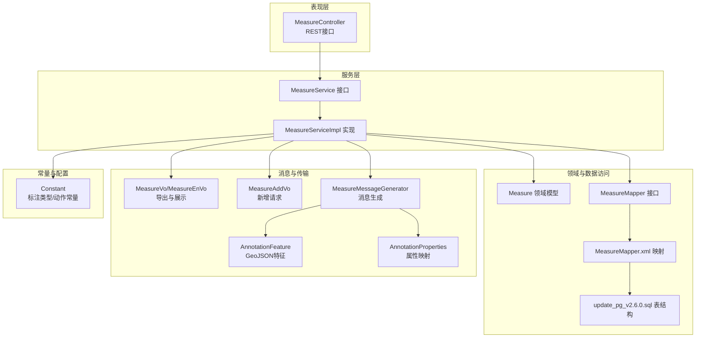
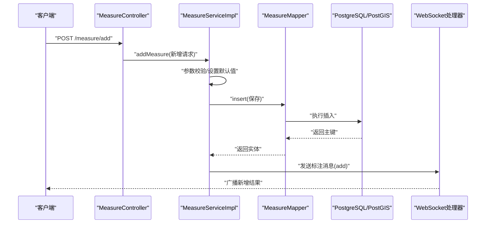
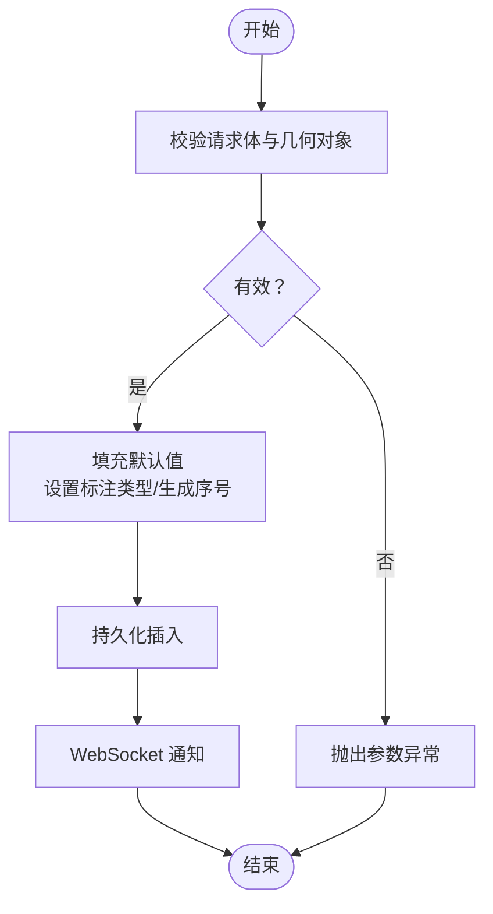
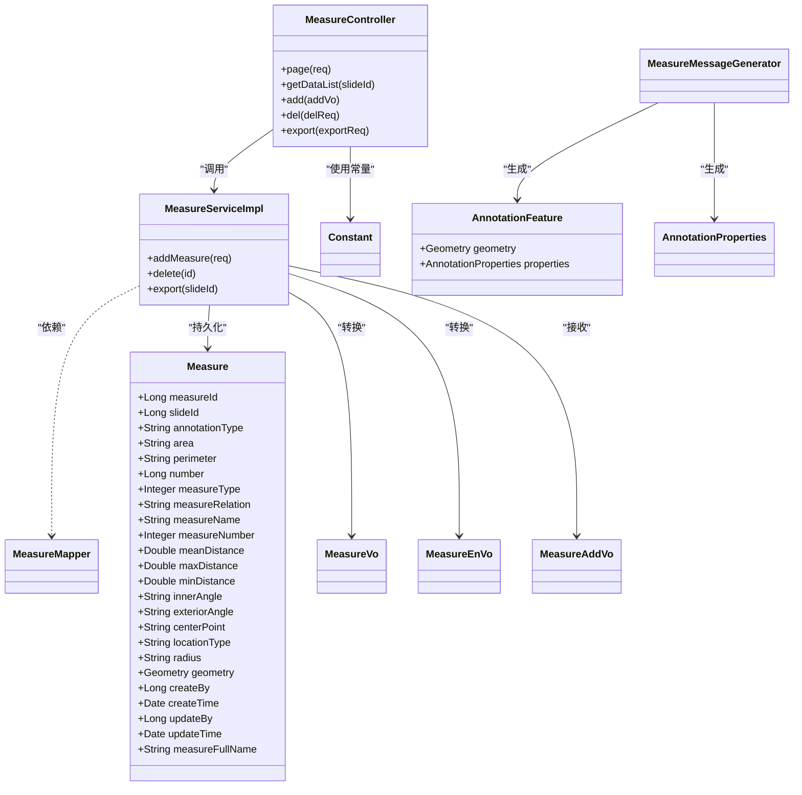

# 测量实体模型

<cite>
**本文引用的文件**
- [Measure.java](file://src/main/java/cn/staitech/annotation/domain/Measure.java)
- [MeasureMapper.java](file://src/main/java/cn/staitech/annotation/mapper/MeasureMapper.java)
- [MeasureMapper.xml](file://src/main/resources/mapper/MeasureMapper.xml)
- [MeasureService.java](file://src/main/java/cn/staitech/annotation/service/MeasureService.java)
- [MeasureServiceImpl.java](file://src/main/java/cn/staitech/annotation/service/impl/MeasureServiceImpl.java)
- [MeasureController.java](file://src/main/java/cn/staitech/annotation/controller/MeasureController.java)
- [MeasureVo.java](file://src/main/java/cn/staitech/annotation/vo/measure/MeasureVo.java)
- [MeasureEnVo.java](file://src/main/java/cn/staitech/annotation/vo/measure/MeasureEnVo.java)
- [MeasureAddVo.java](file://src/main/java/cn/staitech/annotation/vo/measure/MeasureAddVo.java)
- [MeasureMessageGenerator.java](file://src/main/java/cn/staitech/annotation/utils/measure/MeasureMessageGenerator.java)
- [AnnotationFeature.java](file://src/main/java/cn/staitech/annotation/netty/message/AnnotationFeature.java)
- [AnnotationProperties.java](file://src/main/java/cn/staitech/annotation/netty/message/AnnotationProperties.java)
- [Constant.java](file://src/main/java/cn/staitech/annotation/constant/Constant.java)
- [update_pg_v2.6.0.sql](file://sql/update_pg_v2.6.0.sql)
</cite>

## 目录
1. [简介](#简介)
2. [项目结构](#项目结构)
3. [核心组件](#核心组件)
4. [架构总览](#架构总览)
5. [详细组件分析](#详细组件分析)
6. [依赖关系分析](#依赖关系分析)
7. [性能考虑](#性能考虑)
8. [故障排查指南](#故障排查指南)
9. [结论](#结论)
10. [附录](#附录)

## 简介
本文件系统化梳理“测量实体”在标注系统中的数据模型与业务流程，覆盖以下方面：
- 测量表字段结构与数据类型定义
- 几何数据存储格式与几何计算方式
- 精度控制与单位换算规则
- 测量实体与标注实体的关系与关联方式
- 测量创建、更新的业务逻辑与数据验证规则
- 完整字段说明、计算公式与使用示例
- 医学图像分析中的应用场景与价值

## 项目结构
测量实体相关代码采用典型的分层架构组织，主要涉及领域模型、持久层、服务层、控制层与消息传输对象（VO/DTO），以及数据库映射配置与SQL脚本。

图表来源
- [MeasureController.java:1-118](file://src/main/java/cn/staitech/annotation/controller/MeasureController.java#L1-L118)
- [MeasureService.java:1-22](file://src/main/java/cn/staitech/annotation/service/MeasureService.java#L1-L22)
- [MeasureServiceImpl.java:1-161](file://src/main/java/cn/staitech/annotation/service/impl/MeasureServiceImpl.java#L1-L161)
- [MeasureMapper.java:1-19](file://src/main/java/cn/staitech/annotation/mapper/MeasureMapper.java#L1-L19)
- [MeasureMapper.xml:1-45](file://src/main/resources/mapper/MeasureMapper.xml#L1-L45)
- [update_pg_v2.6.0.sql:105-164](file://sql/update_pg_v2.6.0.sql#L105-L164)
- [MeasureVo.java:1-205](file://src/main/java/cn/staitech/annotation/vo/measure/MeasureVo.java#L1-L205)
- [MeasureEnVo.java:1-204](file://src/main/java/cn/staitech/annotation/vo/measure/MeasureEnVo.java#L1-L204)
- [MeasureAddVo.java:1-125](file://src/main/java/cn/staitech/annotation/vo/measure/MeasureAddVo.java#L1-L125)
- [MeasureMessageGenerator.java:1-128](file://src/main/java/cn/staitech/annotation/utils/measure/MeasureMessageGenerator.java#L1-L128)
- [AnnotationFeature.java:1-33](file://src/main/java/cn/staitech/annotation/netty/message/AnnotationFeature.java#L1-L33)
- [AnnotationProperties.java:1-75](file://src/main/java/cn/staitech/annotation/netty/message/AnnotationProperties.java#L1-L75)
- [Constant.java:1-80](file://src/main/java/cn/staitech/annotation/constant/Constant.java#L1-L80)

章节来源
- [MeasureController.java:1-118](file://src/main/java/cn/staitech/annotation/controller/MeasureController.java#L1-L118)
- [MeasureService.java:1-22](file://src/main/java/cn/staitech/annotation/service/MeasureService.java#L1-L22)
- [MeasureServiceImpl.java:1-161](file://src/main/java/cn/staitech/annotation/service/impl/MeasureServiceImpl.java#L1-L161)
- [MeasureMapper.java:1-19](file://src/main/java/cn/staitech/annotation/mapper/MeasureMapper.java#L1-L19)
- [MeasureMapper.xml:1-45](file://src/main/resources/mapper/MeasureMapper.xml#L1-L45)
- [update_pg_v2.6.0.sql:105-164](file://sql/update_pg_v2.6.0.sql#L105-L164)

## 核心组件
- 领域模型：Measure（测量实体），承载几何数据与测量指标
- 数据访问：MeasureMapper + MyBatis XML 映射
- 服务层：MeasureService 及其实现 MeasureServiceImpl
- 控制器：MeasureController 提供分页查询、新增、删除、导出、GeoJSON 获取等接口
- 消息与传输：MeasureVo/MeasureEnVo 用于导出与展示；MeasureAddVo 用于新增请求；MeasureMessageGenerator 生成标注消息
- 常量：Constant 定义标注类型与动作常量

章节来源
- [Measure.java:1-256](file://src/main/java/cn/staitech/annotation/domain/Measure.java#L1-L256)
- [MeasureMapper.java:1-19](file://src/main/java/cn/staitech/annotation/mapper/MeasureMapper.java#L1-L19)
- [MeasureMapper.xml:1-45](file://src/main/resources/mapper/MeasureMapper.xml#L1-L45)
- [MeasureService.java:1-22](file://src/main/java/cn/staitech/annotation/service/MeasureService.java#L1-L22)
- [MeasureServiceImpl.java:1-161](file://src/main/java/cn/staitech/annotation/service/impl/MeasureServiceImpl.java#L1-L161)
- [MeasureController.java:1-118](file://src/main/java/cn/staitech/annotation/controller/MeasureController.java#L1-L118)
- [MeasureVo.java:1-205](file://src/main/java/cn/staitech/annotation/vo/measure/MeasureVo.java#L1-L205)
- [MeasureEnVo.java:1-204](file://src/main/java/cn/staitech/annotation/vo/measure/MeasureEnVo.java#L1-L204)
- [MeasureAddVo.java:1-125](file://src/main/java/cn/staitech/annotation/vo/measure/MeasureAddVo.java#L1-L125)
- [MeasureMessageGenerator.java:1-128](file://src/main/java/cn/staitech/annotation/utils/measure/MeasureMessageGenerator.java#L1-L128)
- [Constant.java:1-80](file://src/main/java/cn/staitech/annotation/constant/Constant.java#L1-L80)

## 架构总览
测量实体在系统中的交互路径如下：

图表来源
- [MeasureController.java:81-93](file://src/main/java/cn/staitech/annotation/controller/MeasureController.java#L81-L93)
- [MeasureServiceImpl.java:59-81](file://src/main/java/cn/staitech/annotation/service/impl/MeasureServiceImpl.java#L59-L81)
- [MeasureMapper.java:12](file://src/main/java/cn/staitech/annotation/mapper/MeasureMapper.java#L12)
- [MeasureMessageGenerator.java:29-38](file://src/main/java/cn/staitech/annotation/utils/measure/MeasureMessageGenerator.java#L29-L38)
- [Constant.java:47-52](file://src/main/java/cn/staitech/annotation/constant/Constant.java#L47-L52)

## 详细组件分析

### 数据模型与字段定义
测量表（fr_measure）字段与类型定义如下（以数据库脚本为准）：
- 主键：measure_id（自增）
- 切片：slide_id（bigint）
- 标注类型：annotation_type（varchar）
- 面积：area（varchar）
- 周长：perimeter（varchar）
- 标注名称：number（bigint）
- 测量轮廓类型：measure_type（int）
- 测量关系：measure_relation（varchar）
- 测量轮廓表示名称：measure_name（varchar）
- 测量轮廓标识：measure_number（int）
- 平均间距：mean_distance（double precision）
- 最大间距：max_distance（double precision）
- 最小间距：min_distance（double precision）
- 内角：inner_angle（varchar）
- 外角：exterior_angle（varchar）
- 中心：center_point（varchar）
- 标注数据类型：location_type（varchar）
- 半径：radius（varchar）
- 几何数据：contour（geometry，PostGIS）
- 创建者：create_by（bigint）
- 创建时间：create_time（timestamp）
- 更新者：update_by（bigint）
- 更新时间：update_time（timestamp）
- 标注全名：measure_full_name（varchar）

字段说明要点：
- 几何数据以 PostGIS 的 geometry 类型存储，支持多种几何类型（如 Point、LineString、Polygon 等）
- area/perimeter/radius 等字段在数据库中为 varchar，实际业务中可能以字符串形式存储数值或表达式
- measure_full_name 由 measure_name 与 number 组合生成，用于唯一标识同一切片下的测量项序列
- location_type 用于区分几何类型（如 LineString、Polygon、point 等）

章节来源
- [update_pg_v2.6.0.sql:107-133](file://sql/update_pg_v2.6.0.sql#L107-L133)
- [update_pg_v2.6.0.sql:141-164](file://sql/update_pg_v2.6.0.sql#L141-L164)
- [MeasureMapper.xml:7-32](file://src/main/resources/mapper/MeasureMapper.xml#L7-L32)
- [Measure.java:20-154](file://src/main/java/cn/staitech/annotation/domain/Measure.java#L20-L154)

### 几何数据存储格式与计算方式
- 存储格式：contour 字段为 PostGIS 的 geometry 类型，可存储点、线、面等几何对象
- 计算方式：
  - 平均间距：通过采样两个几何体上的点并计算平均距离（参考标注服务中的通用距离计算方法）
  - 角度：内角与外角以字符串形式存储，通常为数值或角度表达式
  - 面积/周长：area/perimeter 以字符串形式存储，可能与几何对象一致或由后处理生成

注意：平均间距的具体计算逻辑在标注服务中实现，测量服务复用该能力进行跨几何体的距离统计。

章节来源
- [Measure.java:123-124](file://src/main/java/cn/staitech/annotation/domain/Measure.java#L123-L124)
- [update_pg_v2.6.0.sql:127](file://sql/update_pg_v2.6.0.sql#L127)
- [MeasureServiceImpl.java:59-81](file://src/main/java/cn/staitech/annotation/service/impl/MeasureServiceImpl.java#L59-L81)

### 精度控制与单位换算规则
- 单位：所有长度类指标（周长、间距、半径）统一以微米（μm）为单位
- 精度：数值显示采用千分位格式化，保留三位小数
- 解析与换算：
  - 图像分辨率常量为 0.262 微米/像素（用于像素到物理尺寸的换算）
  - 导出时对面积按平方换算（0.262×0.262 平方微米/像素）

章节来源
- [Constant.java:30-31](file://src/main/java/cn/staitech/annotation/constant/Constant.java#L30-L31)
- [MeasureMessageGenerator.java:99-105](file://src/main/java/cn/staitech/annotation/utils/measure/MeasureMessageGenerator.java#L99-L105)
- [MeasureVo.java:67-74](file://src/main/java/cn/staitech/annotation/vo/measure/MeasureVo.java#L67-L74)
- [MeasureVo.java:109-125](file://src/main/java/cn/staitech/annotation/vo/measure/MeasureVo.java#L109-L125)
- [MeasureVo.java:130-139](file://src/main/java/cn/staitech/annotation/vo/measure/MeasureVo.java#L130-L139)

### 测量实体与标注实体的关系与关联
- 关联方式：两者均以 slide_id 关联到同一张切片；测量实体通过 measure_full_name 与 number 组合形成序列标识
- 关系说明：
  - 标注实体（Annotation）用于一般性标注与分类
  - 测量实体（Measure）专门用于几何测量与统计指标
- 消息传输：测量实体通过 MeasureMessageGenerator 生成 AnnotationFeature/AnnotationProperties，以便在前端以 GeoJSON 形式展示

章节来源
- [Measure.java:34](file://src/main/java/cn/staitech/annotation/domain/Measure.java#L34)
- [MeasureVo.java:55](file://src/main/java/cn/staitech/annotation/vo/measure/MeasureVo.java#L55)
- [MeasureMessageGenerator.java:40-97](file://src/main/java/cn/staitech/annotation/utils/measure/MeasureMessageGenerator.java#L40-L97)
- [AnnotationFeature.java:14-23](file://src/main/java/cn/staitech/annotation/netty/message/AnnotationFeature.java#L14-L23)
- [AnnotationProperties.java:12-74](file://src/main/java/cn/staitech/annotation/netty/message/AnnotationProperties.java#L12-L74)

### 测量创建、更新的业务逻辑与数据验证
- 新增流程：
  - 参数校验：请求体不可为空，且几何对象必须为简单几何（isSimple）
  - 默认值填充：设置 annotation_type 为“Measure”，根据同名测量项的最大 number 自动累加生成 measure_full_name 与 number
  - 持久化：调用 Mapper 插入记录
  - 通知：通过 WebSocket 发送标注消息（动作类型为 add）
- 删除流程：
  - 参数校验：传入的 marking_id 必须存在
  - 查询与删除：先查询再删除，并发送标注消息（动作类型为 add，便于前端刷新）
- 分页与导出：
  - 分页：排除点类型（Point）的测量项，单独统计点数量
  - 导出：支持中英文两种导出模板（MeasureVo/MeasureEnVo），并写入 Excel

图表来源
- [MeasureServiceImpl.java:63-81](file://src/main/java/cn/staitech/annotation/service/impl/MeasureServiceImpl.java#L63-L81)
- [MeasureController.java:81-93](file://src/main/java/cn/staitech/annotation/controller/MeasureController.java#L81-L93)
- [MeasureMessageGenerator.java:29-38](file://src/main/java/cn/staitech/annotation/utils/measure/MeasureMessageGenerator.java#L29-L38)

章节来源
- [MeasureServiceImpl.java:59-128](file://src/main/java/cn/staitech/annotation/service/impl/MeasureServiceImpl.java#L59-L128)
- [MeasureController.java:41-68](file://src/main/java/cn/staitech/annotation/controller/MeasureController.java#L41-L68)
- [MeasureController.java:103-108](file://src/main/java/cn/staitech/annotation/controller/MeasureController.java#L103-L108)

### 字段说明、计算公式与使用示例
- 字段说明（摘取关键字段）：
  - measure_full_name：测量项全名，由 measure_name 与 number 组合而成
  - location_type：几何类型标识（如 LineString、Polygon、point 等）
  - contour：几何对象（PostGIS geometry）
  - area/perimeter：面积与周长（字符串形式）
  - mean_distance/max_distance/min_distance：平均/最大/最小间距（微米）
  - inner_angle/exterior_angle：内角/外角（字符串形式）
  - center_point/radius：中心点与半径（字符串形式）
- 计算公式（参考标注服务通用实现）：
  - 平均间距 = Σ(点对距离)/点对总数
  - 角度与中心点可通过几何对象的拓扑属性计算
- 使用示例（示意步骤）：
  - 新增测量：前端提交 MeasureAddVo，后端生成 measure_full_name 并保存
  - 导出测量：调用导出接口，系统输出包含面积、长度/周长、间距、角度等列的 Excel 文件

章节来源
- [MeasureVo.java:43-191](file://src/main/java/cn/staitech/annotation/vo/measure/MeasureVo.java#L43-L191)
- [MeasureEnVo.java:42-190](file://src/main/java/cn/staitech/annotation/vo/measure/MeasureEnVo.java#L42-L190)
- [MeasureAddVo.java:26-125](file://src/main/java/cn/staitech/annotation/vo/measure/MeasureAddVo.java#L26-L125)

### 医学图像分析中的应用场景与价值
- 应用场景：
  - 病变区域测量：通过 Polygon 计算面积与周长，辅助病灶体积评估
  - 距离测量：通过 LineString 或点集计算平均/最大/最小间距，用于评估病变间距离或边界不规则程度
  - 角度测量：内角/外角用于分析边缘形态与结构复杂度
- 价值：
  - 标准化指标：统一微米单位与精度格式，提升多中心对比一致性
  - 可视化与共享：通过 GeoJSON 特征与标注消息，实现跨平台可视化与协作
  - 可追溯性：记录创建者、时间与操作动作，满足医学研究与质控要求

## 依赖关系分析

图表来源
- [Measure.java:22-154](file://src/main/java/cn/staitech/annotation/domain/Measure.java#L22-L154)
- [MeasureMapper.java:12](file://src/main/java/cn/staitech/annotation/mapper/MeasureMapper.java#L12)
- [MeasureServiceImpl.java:49-155](file://src/main/java/cn/staitech/annotation/service/impl/MeasureServiceImpl.java#L49-L155)
- [MeasureController.java:36-117](file://src/main/java/cn/staitech/annotation/controller/MeasureController.java#L36-L117)
- [MeasureVo.java:34-204](file://src/main/java/cn/staitech/annotation/vo/measure/MeasureVo.java#L34-L204)
- [MeasureEnVo.java:33-203](file://src/main/java/cn/staitech/annotation/vo/measure/MeasureEnVo.java#L33-L203)
- [MeasureAddVo.java:26-125](file://src/main/java/cn/staitech/annotation/vo/measure/MeasureAddVo.java#L26-L125)
- [AnnotationFeature.java:14-23](file://src/main/java/cn/staitech/annotation/netty/message/AnnotationFeature.java#L14-L23)
- [AnnotationProperties.java:12-74](file://src/main/java/cn/staitech/annotation/netty/message/AnnotationProperties.java#L12-L74)
- [MeasureMessageGenerator.java:29-97](file://src/main/java/cn/staitech/annotation/utils/measure/MeasureMessageGenerator.java#L29-L97)
- [Constant.java:44-58](file://src/main/java/cn/staitech/annotation/constant/Constant.java#L44-L58)

## 性能考虑
- 几何计算复杂度：平均间距计算涉及点对组合，当几何点数较多时，整体复杂度较高，建议在前端或服务端进行采样或阈值控制
- 数据库索引：已为 slide_id、location_type、measure_full_name 建立索引，有助于分页与筛选
- 导出性能：导出时需遍历测量列表并转换为 VO，建议分批处理与流式写出，避免内存峰值

## 故障排查指南
- 参数无效：当请求体为空或几何对象非简单几何时，会抛出参数异常
- 无测量数据：删除时若未找到对应记录，会提示无测量数据
- 导出异常：检查语言环境与用户映射，确保远程用户服务可用

章节来源
- [MeasureServiceImpl.java:63-96](file://src/main/java/cn/staitech/annotation/service/impl/MeasureServiceImpl.java#L63-L96)
- [MeasureController.java:41-68](file://src/main/java/cn/staitech/annotation/controller/MeasureController.java#L41-L68)

## 结论
测量实体模型以 PostGIS 几何为核心，结合标准化的指标字段与严格的业务流程，实现了医学图像分析中的面积、长度、间距与角度等关键测量能力。通过统一的单位与精度控制、完善的导出与消息机制，为多中心协作与长期随访提供了可靠支撑。

## 附录
- 常用常量（节选）：
  - 标注类型：Draw、AI、Measure
  - 操作动作：add、update、delete
  - 图像分辨率：0.262 微米/像素
  - 面积换算：0.262×0.262 平方微米/像素
- 相关接口：
  - 新增测量：POST /measure/add
  - 删除测量：POST /measure/del
  - 分页查询：POST /measure/page
  - 导出测量：POST /measure/export
  - 获取 GeoJSON：GET /measure/getDataList

章节来源
- [Constant.java:44-58](file://src/main/java/cn/staitech/annotation/constant/Constant.java#L44-L58)
- [MeasureController.java:81-108](file://src/main/java/cn/staitech/annotation/controller/MeasureController.java#L81-L108)