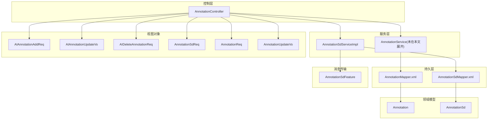
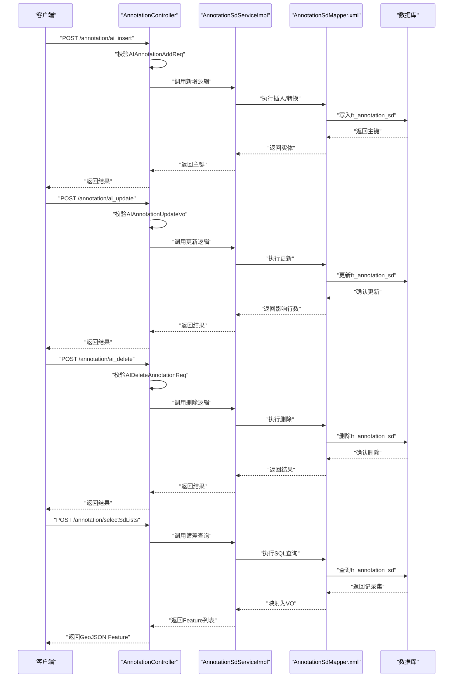
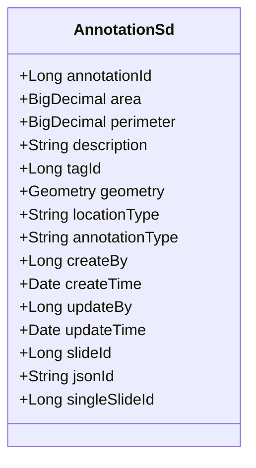
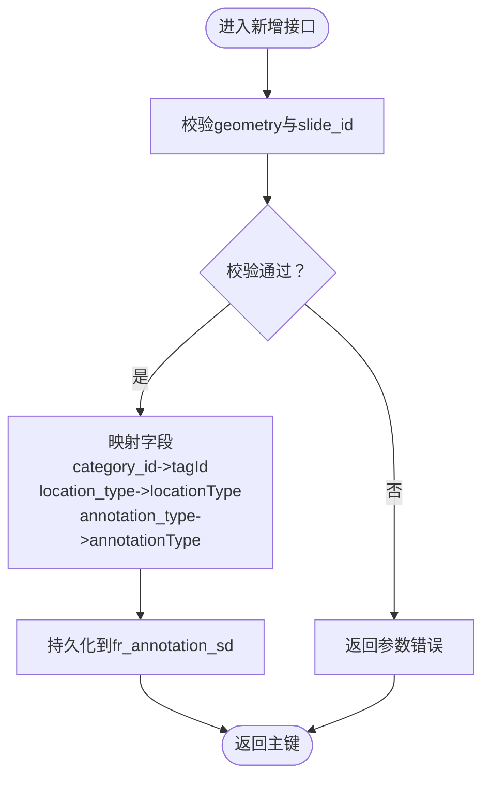
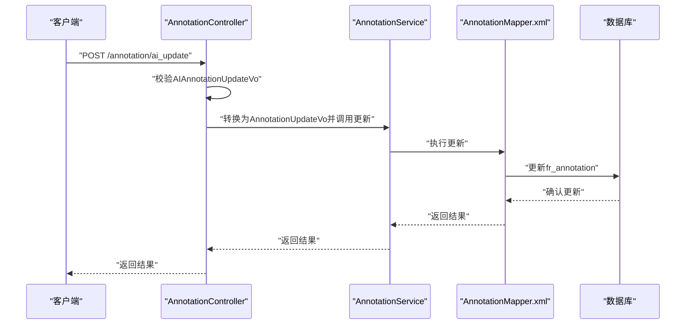
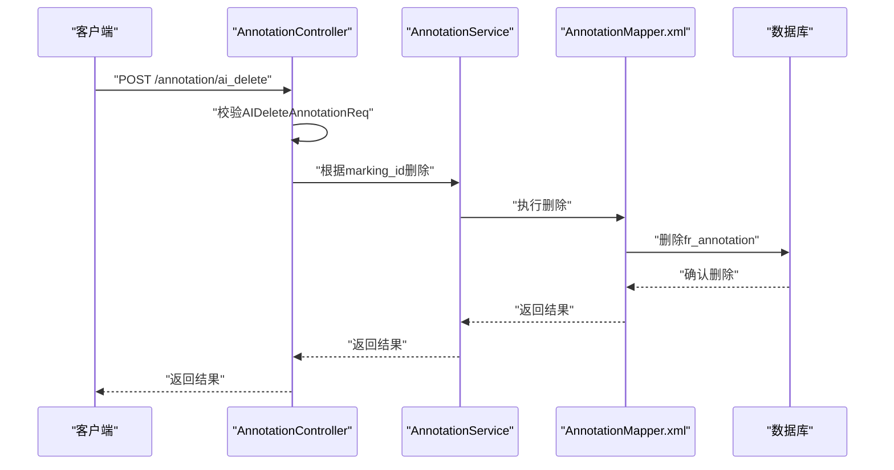
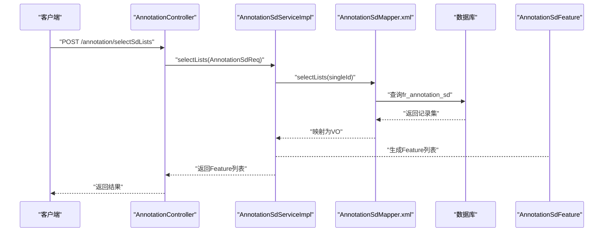
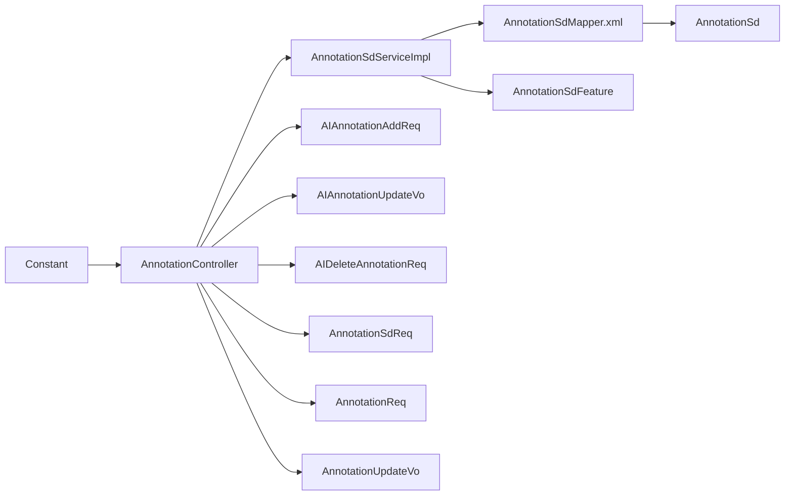

# AI标注数据模型

<cite>
**本文引用的文件**
- [AnnotationSd.java](file://src/main/java/cn/staitech/annotation/domain/AnnotationSd.java)
- [AIAnnotationAddReq.java](file://src/main/java/cn/staitech/annotation/vo/anno/AIAnnotationAddReq.java)
- [AIAnnotationUpdateVo.java](file://src/main/java/cn/staitech/annotation/vo/anno/AIAnnotationUpdateVo.java)
- [AIDeleteAnnotationReq.java](file://src/main/java/cn/staitech/annotation/vo/anno/AIDeleteAnnotationReq.java)
- [AnnotationSdReq.java](file://src/main/java/cn/staitech/annotation/vo/anno/AnnotationSdReq.java)
- [Annotation.java](file://src/main/java/cn/staitech/annotation/domain/Annotation.java)
- [AnnotationReq.java](file://src/main/java/cn/staitech/annotation/vo/anno/AnnotationReq.java)
- [AnnotationUpdateVo.java](file://src/main/java/cn/staitech/annotation/vo/anno/AnnotationUpdateVo.java)
- [AnnotationSdMapper.xml](file://src/main/resources/mapper/AnnotationSdMapper.xml)
- [AnnotationMapper.xml](file://src/main/resources/mapper/AnnotationMapper.xml)
- [AnnotationSdServiceImpl.java](file://src/main/java/cn/staitech/annotation/service/impl/AnnotationSdServiceImpl.java)
- [AnnotationController.java](file://src/main/java/cn/staitech/annotation/controller/AnnotationController.java)
- [AnnotationSdFeature.java](file://src/main/java/cn/staitech/annotation/netty/message/AnnotationSdFeature.java)
- [Constant.java](file://src/main/java/cn/staitech/annotation/constant/Constant.java)
- [bootstrap.yml](file://src/main/resources/bootstrap.yml)
</cite>

## 目录
1. [简介](#简介)
2. [项目结构](#项目结构)
3. [核心组件](#核心组件)
4. [架构总览](#架构总览)
5. [详细组件分析](#详细组件分析)
6. [依赖分析](#依赖分析)
7. [性能考虑](#性能考虑)
8. [故障排查指南](#故障排查指南)
9. [结论](#结论)
10. [附录](#附录)

## 简介
本文件系统化梳理AI辅助标注系统的数据模型，重点覆盖以下方面：
- AI标注请求参数的数据结构：几何轮廓、标签信息、切片标识等核心字段的定义与约束
- AI标注更新与删除操作的数据格式：字段验证规则、数据类型转换、空值处理机制
- AnnotationSd实体类的设计理念：与基础标注模型的关系、扩展字段的作用、数据持久化策略
- 完整字段说明：含义、取值范围、业务规则、默认值
- 版本管理、向后兼容与迁移策略
- 开发者最佳实践与常见问题解决方案

## 项目结构
围绕标注功能的核心模块由“领域模型(domain)”、“视图对象(vo)”、“持久层(mapper/xml)”、“服务(service)”、“控制层(controller)”、“消息传输(netty message)”构成，形成清晰的分层架构。

图表来源
- [AnnotationController.java:42-250](file://src/main/java/cn/staitech/annotation/controller/AnnotationController.java#L42-L250)
- [AnnotationSdServiceImpl.java:17-35](file://src/main/java/cn/staitech/annotation/service/impl/AnnotationSdServiceImpl.java#L17-L35)
- [AnnotationSdMapper.xml:5-27](file://src/main/resources/mapper/AnnotationSdMapper.xml#L5-L27)
- [AnnotationMapper.xml:5-8](file://src/main/resources/mapper/AnnotationMapper.xml#L5-L8)
- [AnnotationSd.java:17-82](file://src/main/java/cn/staitech/annotation/domain/AnnotationSd.java#L17-L82)
- [Annotation.java:23-187](file://src/main/java/cn/staitech/annotation/domain/Annotation.java#L23-L187)
- [AIAnnotationAddReq.java:24-118](file://src/main/java/cn/staitech/annotation/vo/anno/AIAnnotationAddReq.java#L24-L118)
- [AIAnnotationUpdateVo.java:22-101](file://src/main/java/cn/staitech/annotation/vo/anno/AIAnnotationUpdateVo.java#L22-L101)
- [AIDeleteAnnotationReq.java:8-16](file://src/main/java/cn/staitech/annotation/vo/anno/AIDeleteAnnotationReq.java#L8-L16)
- [AnnotationSdReq.java:12-19](file://src/main/java/cn/staitech/annotation/vo/anno/AnnotationSdReq.java#L12-L19)
- [AnnotationReq.java:16-24](file://src/main/java/cn/staitech/annotation/vo/anno/AnnotationReq.java#L16-L24)
- [AnnotationUpdateVo.java:23-102](file://src/main/java/cn/staitech/annotation/vo/anno/AnnotationUpdateVo.java#L23-L102)
- [AnnotationSdFeature.java:10-16](file://src/main/java/cn/staitech/annotation/netty/message/AnnotationSdFeature.java#L10-L16)

章节来源
- [AnnotationController.java:42-250](file://src/main/java/cn/staitech/annotation/controller/AnnotationController.java#L42-L250)
- [AnnotationSdServiceImpl.java:17-35](file://src/main/java/cn/staitech/annotation/service/impl/AnnotationSdServiceImpl.java#L17-L35)
- [AnnotationSdMapper.xml:5-27](file://src/main/resources/mapper/AnnotationSdMapper.xml#L5-L27)
- [AnnotationMapper.xml:5-8](file://src/main/resources/mapper/AnnotationMapper.xml#L5-L8)

## 核心组件
本节聚焦AI标注相关的数据模型与请求/响应对象，明确字段语义、约束与映射关系。

- AnnotationSd 实体类
  - 数据库表映射：fr_annotation_sd
  - 关键字段：主键、面积、周长、轮廓描述、标签ID、几何轮廓、轮廓类型、标注类型、创建/更新人与时间、切片ID、GeoJSON数据ID、单切片ID
  - 设计要点：继承MyBatis-Plus注解，几何字段通过JTS Geometry存储；提供序列化支持

- AI标注请求对象
  - AIAnnotationAddReq：新增AI标注时的入参，包含面积、周长、描述、标签ID(category_id)、几何轮廓、轮廓类型(location_type)、标注类型(annotation_type)、切片ID(slide_id)、GeoJSON数据ID、轮廓类型标记(contour_type)等
  - AIAnnotationUpdateVo：更新AI标注时的入参，包含主键(marking_id)、面积、周长、描述、标签ID(category_id)、几何轮廓、轮廓类型、标注类型(annotation_type)、更新人、更新时间、切片ID(slide_id)、GeoJSON数据ID
  - AIDeleteAnnotationReq：删除AI标注时的入参，包含主键(marking_id)

- 基础标注模型与扩展
  - Annotation：通用标注模型，字段与AnnotationSd高度一致，但不包含单切片ID(single_slide_id)，用于常规标注场景
  - 两者差异体现在扩展字段与用途：AnnotationSd用于筛差/单切片聚合场景，Annotation用于通用标注

- 查询与展示
  - AnnotationSdReq：按单切片ID查询筛差数据
  - AnnotationSdMapper.xml：将几何字段通过ST_AsGeoJSON转换为GeoJSON字符串返回
  - AnnotationSdFeature：用于WebSocket/消息推送的GeoJSON Feature封装

章节来源
- [AnnotationSd.java:17-82](file://src/main/java/cn/staitech/annotation/domain/AnnotationSd.java#L17-L82)
- [AIAnnotationAddReq.java:24-118](file://src/main/java/cn/staitech/annotation/vo/anno/AIAnnotationAddReq.java#L24-L118)
- [AIAnnotationUpdateVo.java:22-101](file://src/main/java/cn/staitech/annotation/vo/anno/AIAnnotationUpdateVo.java#L22-L101)
- [AIDeleteAnnotationReq.java:8-16](file://src/main/java/cn/staitech/annotation/vo/anno/AIDeleteAnnotationReq.java#L8-L16)
- [Annotation.java:23-187](file://src/main/java/cn/staitech/annotation/domain/Annotation.java#L23-L187)
- [AnnotationSdReq.java:12-19](file://src/main/java/cn/staitech/annotation/vo/anno/AnnotationSdReq.java#L12-L19)
- [AnnotationSdMapper.xml:6-26](file://src/main/resources/mapper/AnnotationSdMapper.xml#L6-L26)
- [AnnotationSdFeature.java:10-16](file://src/main/java/cn/staitech/annotation/netty/message/AnnotationSdFeature.java#L10-L16)

## 架构总览
下图展示从HTTP请求到数据库持久化与返回的端到端流程，涵盖AI标注新增、更新、删除与筛差查询。

图表来源
- [AnnotationController.java:51-164](file://src/main/java/cn/staitech/annotation/controller/AnnotationController.java#L51-L164)
- [AnnotationSdServiceImpl.java:26-29](file://src/main/java/cn/staitech/annotation/service/impl/AnnotationSdServiceImpl.java#L26-L29)
- [AnnotationSdMapper.xml:6-26](file://src/main/resources/mapper/AnnotationSdMapper.xml#L6-L26)

## 详细组件分析

### AnnotationSd 实体类设计
- 表映射与主键：fr_annotation_sd，主键annotation_id自增
- 几何字段：contour 使用JTS Geometry类型，持久化为PostGIS几何类型
- 扩展字段：single_slide_id 仅用于筛差/单切片场景，便于按单切片聚合
- 时间戳与审计：createBy/createTime/updateBy/updateTime 支持审计追踪
- 字段命名与别名：与请求对象保持一致，便于自动映射

图表来源
- [AnnotationSd.java:17-82](file://src/main/java/cn/staitech/annotation/domain/AnnotationSd.java#L17-L82)

章节来源
- [AnnotationSd.java:17-82](file://src/main/java/cn/staitech/annotation/domain/AnnotationSd.java#L17-L82)

### AI标注新增请求模型
- 必填字段与校验
  - geometry：非空，必须为有效几何对象
  - slide_id：非空，标识所属切片
- 字段映射
  - category_id 映射到 tagId
  - location_type 映射到 locationType
  - annotation_type 映射到 annotationType
- 日志与审计
  - 多数字段标注忽略日志，tagIdLog 通过注解转换为日志字段
- 可选扩展
  - contour_type：脏器识别校对页面的标记字段

图表来源
- [AIAnnotationAddReq.java:57-105](file://src/main/java/cn/staitech/annotation/vo/anno/AIAnnotationAddReq.java#L57-L105)
- [AnnotationController.java:62-69](file://src/main/java/cn/staitech/annotation/controller/AnnotationController.java#L62-L69)

章节来源
- [AIAnnotationAddReq.java:24-118](file://src/main/java/cn/staitech/annotation/vo/anno/AIAnnotationAddReq.java#L24-L118)
- [AnnotationController.java:62-69](file://src/main/java/cn/staitech/annotation/controller/AnnotationController.java#L62-L69)

### AI标注更新请求模型
- 必填字段与校验
  - marking_id：非空，作为更新依据
- 字段映射
  - category_id 映射到 tagId
  - annotation_type 映射到 annotationType
- 可选字段
  - area/perimeter/description/tagId/geometry/locationType/jsonId 等可选更新
- 审计字段
  - updateBy/updateTime 通常由服务层或拦截器填充

图表来源
- [AIAnnotationUpdateVo.java:27-94](file://src/main/java/cn/staitech/annotation/vo/anno/AIAnnotationUpdateVo.java#L27-L94)
- [AnnotationUpdateVo.java:28-95](file://src/main/java/cn/staitech/annotation/vo/anno/AnnotationUpdateVo.java#L28-L95)
- [AnnotationController.java:105-110](file://src/main/java/cn/staitech/annotation/controller/AnnotationController.java#L105-L110)

章节来源
- [AIAnnotationUpdateVo.java:22-101](file://src/main/java/cn/staitech/annotation/vo/anno/AIAnnotationUpdateVo.java#L22-L101)
- [AnnotationUpdateVo.java:23-102](file://src/main/java/cn/staitech/annotation/vo/anno/AnnotationUpdateVo.java#L23-L102)
- [AnnotationController.java:105-110](file://src/main/java/cn/staitech/annotation/controller/AnnotationController.java#L105-L110)

### AI标注删除请求模型
- 必填字段
  - marking_id：非空，删除依据
- 控制层直接透传至服务层执行删除

图表来源
- [AIDeleteAnnotationReq.java:12-14](file://src/main/java/cn/staitech/annotation/vo/anno/AIDeleteAnnotationReq.java#L12-L14)
- [AnnotationController.java:78-81](file://src/main/java/cn/staitech/annotation/controller/AnnotationController.java#L78-L81)

章节来源
- [AIDeleteAnnotationReq.java:8-16](file://src/main/java/cn/staitech/annotation/vo/anno/AIDeleteAnnotationReq.java#L8-L16)
- [AnnotationController.java:78-81](file://src/main/java/cn/staitech/annotation/controller/AnnotationController.java#L78-L81)

### 筛差查询与GeoJSON输出
- 查询入口
  - AnnotationSdReq：按 singleId 查询筛差数据
- 持久层映射
  - AnnotationSdMapper.xml：将几何字段通过 ST_AsGeoJSON 输出为字符串，同时查询其他字段
- 返回封装
  - AnnotationSdServiceImpl：调用Mapper并返回 VO 列表
  - 控制层：通过消息生成器将 VO 转换为 AnnotationSdFeature 列表返回

图表来源
- [AnnotationSdReq.java:12-19](file://src/main/java/cn/staitech/annotation/vo/anno/AnnotationSdReq.java#L12-L19)
- [AnnotationSdMapper.xml:6-26](file://src/main/resources/mapper/AnnotationSdMapper.xml#L6-L26)
- [AnnotationSdServiceImpl.java:26-29](file://src/main/java/cn/staitech/annotation/service/impl/AnnotationSdServiceImpl.java#L26-L29)
- [AnnotationController.java:158-164](file://src/main/java/cn/staitech/annotation/controller/AnnotationController.java#L158-L164)
- [AnnotationSdFeature.java:10-16](file://src/main/java/cn/staitech/annotation/netty/message/AnnotationSdFeature.java#L10-L16)

章节来源
- [AnnotationSdReq.java:12-19](file://src/main/java/cn/staitech/annotation/vo/anno/AnnotationSdReq.java#L12-L19)
- [AnnotationSdMapper.xml:6-26](file://src/main/resources/mapper/AnnotationSdMapper.xml#L6-L26)
- [AnnotationSdServiceImpl.java:26-29](file://src/main/java/cn/staitech/annotation/service/impl/AnnotationSdServiceImpl.java#L26-L29)
- [AnnotationController.java:158-164](file://src/main/java/cn/staitech/annotation/controller/AnnotationController.java#L158-L164)
- [AnnotationSdFeature.java:10-16](file://src/main/java/cn/staitech/annotation/netty/message/AnnotationSdFeature.java#L10-L16)

## 依赖分析
- 控制层依赖服务层，服务层依赖持久层Mapper，Mapper映射到数据库表
- 请求对象与实体类之间通过Bean拷贝或MyBatis映射进行数据转换
- 几何字段依赖JTS Geometry与PostGIS函数(ST_AsGeoJSON)
- 常量集中定义标注类型与操作类型，统一业务语义

图表来源
- [AnnotationController.java:42-250](file://src/main/java/cn/staitech/annotation/controller/AnnotationController.java#L42-L250)
- [AnnotationSdServiceImpl.java:17-35](file://src/main/java/cn/staitech/annotation/service/impl/AnnotationSdServiceImpl.java#L17-L35)
- [AnnotationSdMapper.xml:5-27](file://src/main/resources/mapper/AnnotationSdMapper.xml#L5-L27)
- [AnnotationSd.java:17-82](file://src/main/java/cn/staitech/annotation/domain/AnnotationSd.java#L17-L82)
- [AIAnnotationAddReq.java:24-118](file://src/main/java/cn/staitech/annotation/vo/anno/AIAnnotationAddReq.java#L24-L118)
- [AIAnnotationUpdateVo.java:22-101](file://src/main/java/cn/staitech/annotation/vo/anno/AIAnnotationUpdateVo.java#L22-L101)
- [AIDeleteAnnotationReq.java:8-16](file://src/main/java/cn/staitech/annotation/vo/anno/AIDeleteAnnotationReq.java#L8-L16)
- [AnnotationSdReq.java:12-19](file://src/main/java/cn/staitech/annotation/vo/anno/AnnotationSdReq.java#L12-L19)
- [AnnotationReq.java:16-24](file://src/main/java/cn/staitech/annotation/vo/anno/AnnotationReq.java#L16-L24)
- [AnnotationUpdateVo.java:23-102](file://src/main/java/cn/staitech/annotation/vo/anno/AnnotationUpdateVo.java#L23-L102)
- [AnnotationSdFeature.java:10-16](file://src/main/java/cn/staitech/annotation/netty/message/AnnotationSdFeature.java#L10-L16)
- [Constant.java:44-58](file://src/main/java/cn/staitech/annotation/constant/Constant.java#L44-L58)

章节来源
- [AnnotationController.java:42-250](file://src/main/java/cn/staitech/annotation/controller/AnnotationController.java#L42-L250)
- [AnnotationSdServiceImpl.java:17-35](file://src/main/java/cn/staitech/annotation/service/impl/AnnotationSdServiceImpl.java#L17-L35)
- [AnnotationSdMapper.xml:5-27](file://src/main/resources/mapper/AnnotationSdMapper.xml#L5-L27)
- [AnnotationSd.java:17-82](file://src/main/java/cn/staitech/annotation/domain/AnnotationSd.java#L17-L82)
- [AIAnnotationAddReq.java:24-118](file://src/main/java/cn/staitech/annotation/vo/anno/AIAnnotationAddReq.java#L24-L118)
- [AIAnnotationUpdateVo.java:22-101](file://src/main/java/cn/staitech/annotation/vo/anno/AIAnnotationUpdateVo.java#L22-L101)
- [AIDeleteAnnotationReq.java:8-16](file://src/main/java/cn/staitech/annotation/vo/anno/AIDeleteAnnotationReq.java#L8-L16)
- [AnnotationSdReq.java:12-19](file://src/main/java/cn/staitech/annotation/vo/anno/AnnotationSdReq.java#L12-L19)
- [AnnotationReq.java:16-24](file://src/main/java/cn/staitech/annotation/vo/anno/AnnotationReq.java#L16-L24)
- [AnnotationUpdateVo.java:23-102](file://src/main/java/cn/staitech/annotation/vo/anno/AnnotationUpdateVo.java#L23-L102)
- [AnnotationSdFeature.java:10-16](file://src/main/java/cn/staitech/annotation/netty/message/AnnotationSdFeature.java#L10-L16)
- [Constant.java:44-58](file://src/main/java/cn/staitech/annotation/constant/Constant.java#L44-L58)

## 性能考虑
- 几何字段查询：通过 ST_AsGeoJSON 将几何转换为GeoJSON字符串，避免复杂对象序列化开销
- 分页与过滤：筛差查询按 singleId 过滤，建议在数据库层面建立索引以提升查询性能
- 批量操作：批量删除/更新可通过服务层聚合处理，减少网络往返
- 审计字段：日志字段通过注解转换，避免频繁序列化，降低写入压力

## 故障排查指南
- 参数校验失败
  - geometry 为空：检查前端是否正确提交几何对象
  - slide_id 为空：确认切片ID是否正确传递
  - marking_id 为空：确认更新/删除请求是否携带主键
- 几何转换异常
  - 确认PostGIS扩展已启用，ST_AsGeoJSON可用
  - 检查几何对象有效性，确保为闭合多边形或多点序列
- 数据不一致
  - 标注类型与轮廓类型不匹配：核对 annotation_type 与 location_type 的取值
  - 单切片ID与切片ID不一致：确保 single_slide_id 与 slide_id 的对应关系

章节来源
- [AIAnnotationAddReq.java:57-105](file://src/main/java/cn/staitech/annotation/vo/anno/AIAnnotationAddReq.java#L57-L105)
- [AIAnnotationUpdateVo.java:27-94](file://src/main/java/cn/staitech/annotation/vo/anno/AIAnnotationUpdateVo.java#L27-L94)
- [AIDeleteAnnotationReq.java:12-14](file://src/main/java/cn/staitech/annotation/vo/anno/AIDeleteAnnotationReq.java#L12-L14)
- [AnnotationSdMapper.xml:14-14](file://src/main/resources/mapper/AnnotationSdMapper.xml#L14-L14)

## 结论
本数据模型围绕AI标注的新增、更新、删除与筛差查询构建，通过清晰的分层设计与严格的参数校验保障数据一致性。AnnotationSd在通用标注模型基础上增加单切片维度，满足筛差场景需求；几何字段采用JTS+PostGIS方案，兼顾精度与性能。建议在生产环境中完善索引、缓存与监控，持续优化几何处理与批量操作性能。

## 附录

### 字段说明与业务规则
- 主键(annotation_id)
  - 类型：Long
  - 含义：标注唯一标识
  - 默认值：数据库自增
  - 业务规则：新增后由数据库生成
- 面积(area)、周长(perimeter)
  - 类型：BigDecimal
  - 含义：几何面积与周长
  - 默认值：可空
  - 业务规则：AI新增时可为空，由算法计算后更新
- 轮廓描述(description)
  - 类型：String
  - 含义：标注描述文本
  - 默认值：可空
- 标签ID(tagId)
  - 类型：Long
  - 含义：标注分类标签
  - 默认值：可空
  - 业务规则：与日志字段 tagIdLog 对应，用于审计
- 几何轮廓(geometry)
  - 类型：JTS Geometry
  - 含义：标注的几何形状
  - 默认值：不可空
  - 业务规则：新增时必填，更新时可选
- 轮廓类型(locationType)
  - 类型：String
  - 含义：几何类型标识
  - 默认值：可空
- 标注类型(annotationType)
  - 类型：String
  - 含义：AI/Draw/Measure
  - 默认值：可空
  - 业务规则：见常量定义
- 创建/更新人(createBy/updateBy)
  - 类型：Long
  - 含义：操作人ID
  - 默认值：可空
- 创建/更新时间(createTime/updateTime)
  - 类型：Date
  - 含义：操作时间
  - 默认值：可空
- 切片ID(slideId)
  - 类型：Long
  - 含义：所属切片
  - 默认值：不可空
  - 业务规则：新增时必填
- GeoJSON数据ID(jsonId)
  - 类型：String
  - 含义：GeoJSON中的数据ID
  - 默认值：可空
- 单切片ID(singleSlideId)
  - 类型：Long
  - 含义：筛差场景下的单切片标识
  - 默认值：可空
  - 业务规则：仅在筛差查询中使用

章节来源
- [AnnotationSd.java:17-82](file://src/main/java/cn/staitech/annotation/domain/AnnotationSd.java#L17-L82)
- [AIAnnotationAddReq.java:24-118](file://src/main/java/cn/staitech/annotation/vo/anno/AIAnnotationAddReq.java#L24-L118)
- [AIAnnotationUpdateVo.java:22-101](file://src/main/java/cn/staitech/annotation/vo/anno/AIAnnotationUpdateVo.java#L22-L101)
- [Annotation.java:23-187](file://src/main/java/cn/staitech/annotation/domain/Annotation.java#L23-L187)
- [Constant.java:44-58](file://src/main/java/cn/staitech/annotation/constant/Constant.java#L44-L58)

### 版本管理、向后兼容与迁移策略
- 版本演进
  - 新增字段：如 contourType、singleSlideId 等，建议在数据库层面提供默认值或迁移脚本
- 向后兼容
  - 字段重命名：通过 JSON 属性别名(category_id/slide_id/location_type/annotation_type) 保持接口稳定
  - 几何字段：保持 Geometry 类型不变，仅调整映射
- 迁移策略
  - 新增列：先加列再发布，避免灰度期间的兼容问题
  - 删除列：预留过渡期，提供兼容读取逻辑
  - 几何字段：确保PostGIS版本升级与兼容性测试

章节来源
- [AIAnnotationAddReq.java:47-74](file://src/main/java/cn/staitech/annotation/vo/anno/AIAnnotationAddReq.java#L47-L74)
- [AIAnnotationUpdateVo.java:52-75](file://src/main/java/cn/staitech/annotation/vo/anno/AIAnnotationUpdateVo.java#L52-L75)
- [AnnotationReq.java:18-23](file://src/main/java/cn/staitech/annotation/vo/anno/AnnotationReq.java#L18-L23)

### 开发者最佳实践
- 参数校验
  - 使用注解驱动的校验，确保必填字段与类型正确
- 字段映射
  - 统一使用 JSON 属性别名，避免前后端歧义
- 几何处理
  - 严格校验几何有效性，避免无效几何导致的查询异常
- 审计与日志
  - 合理使用日志字段注解，平衡审计与性能
- 接口设计
  - 区分通用标注与筛差场景，避免混用字段造成混淆

章节来源
- [AnnotationController.java:51-164](file://src/main/java/cn/staitech/annotation/controller/AnnotationController.java#L51-L164)
- [bootstrap.yml:9-13](file://src/main/resources/bootstrap.yml#L9-L13)