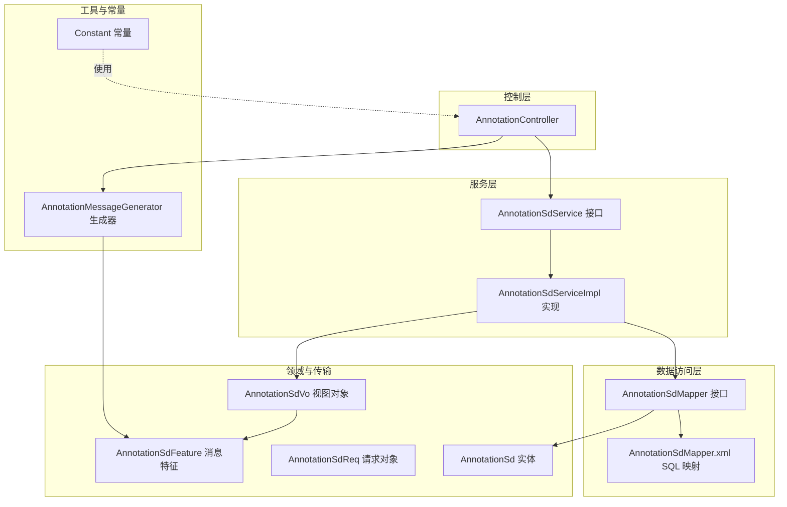
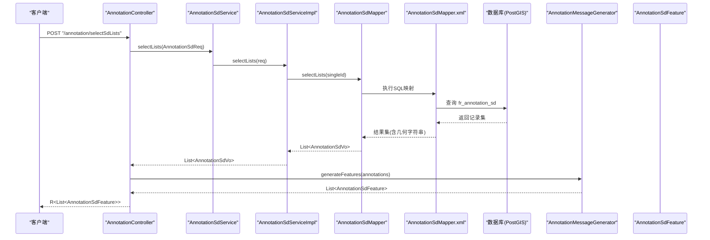
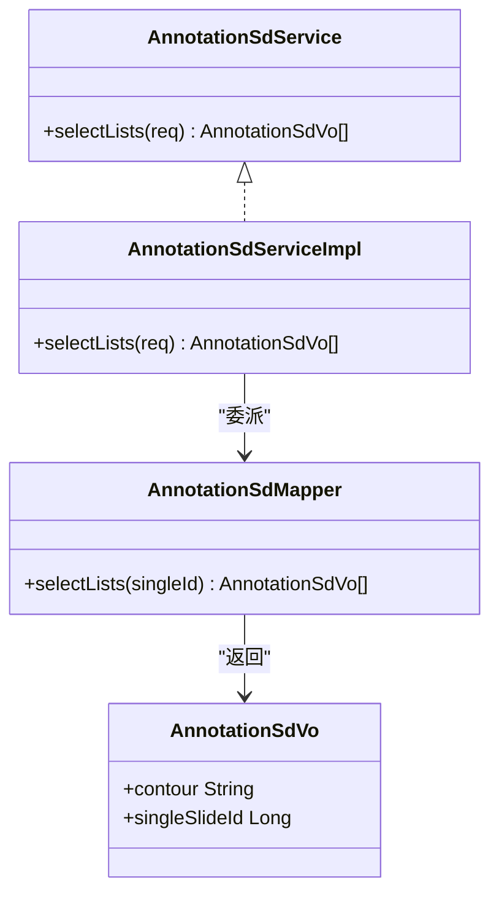
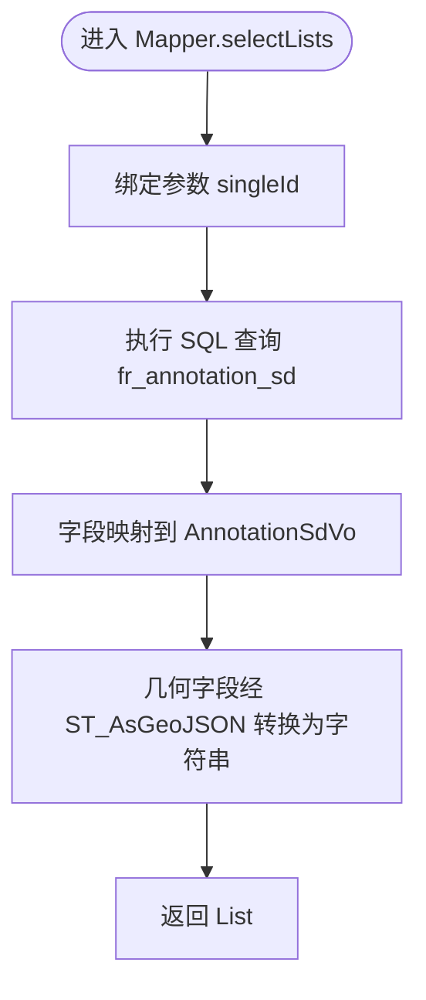
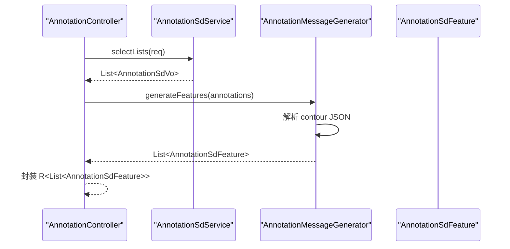
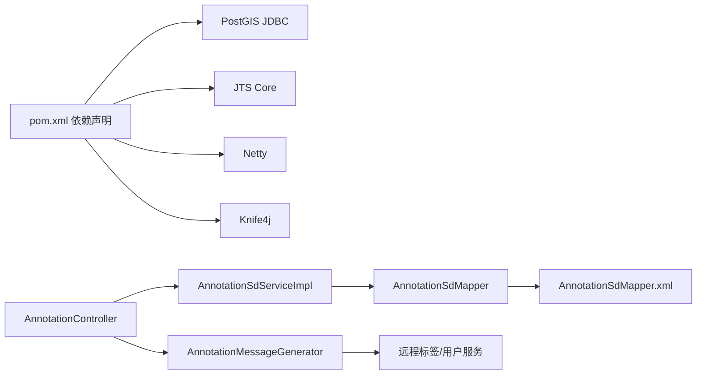

# AI标注服务层

<cite>
**本文引用的文件**
- [AnnotationSdService.java](file://src/main/java/cn/staitech/annotation/service/AnnotationSdService.java)
- [AnnotationSdServiceImpl.java](file://src/main/java/cn/staitech/annotation/service/impl/AnnotationSdServiceImpl.java)
- [AnnotationSdMapper.java](file://src/main/java/cn/staitech/annotation/mapper/AnnotationSdMapper.java)
- [AnnotationSdMapper.xml](file://src/main/resources/mapper/AnnotationSdMapper.xml)
- [AnnotationSd.java](file://src/main/java/cn/staitech/annotation/domain/AnnotationSd.java)
- [AnnotationSdReq.java](file://src/main/java/cn/staitech/annotation/vo/anno/AnnotationSdReq.java)
- [AnnotationSdVo.java](file://src/main/java/cn/staitech/annotation/vo/anno/AnnotationSdVo.java)
- [AnnotationController.java](file://src/main/java/cn/staitech/annotation/controller/AnnotationController.java)
- [AnnotationMessageGenerator.java](file://src/main/java/cn/staitech/annotation/utils/annotation/AnnotationMessageGenerator.java)
- [AnnotationSdFeature.java](file://src/main/java/cn/staitech/annotation/netty/message/AnnotationSdFeature.java)
- [Annotation.java](file://src/main/java/cn/staitech/annotation/domain/Annotation.java)
- [Constant.java](file://src/main/java/cn/staitech/annotation/constant/Constant.java)
- [pom.xml](file://pom.xml)
- [bootstrap.yml](file://src/main/resources/bootstrap.yml)
</cite>

## 目录
1. [简介](#简介)
2. [项目结构](#项目结构)
3. [核心组件](#核心组件)
4. [架构总览](#架构总览)
5. [详细组件分析](#详细组件分析)
6. [依赖分析](#依赖分析)
7. [性能考虑](#性能考虑)
8. [故障排查指南](#故障排查指南)
9. [结论](#结论)
10. [附录](#附录)

## 简介
本技术文档聚焦于AI辅助标注服务层，围绕“筛差”（AI标注）数据的查询能力进行系统化梳理。文档从接口设计、实现细节、数据访问层、消息转换与序列化、调用示例与最佳实践、扩展点与自定义实现等方面展开，帮助开发者快速理解并高效扩展AI标注服务。

## 项目结构
该模块采用典型的分层架构：
- 控制层：负责HTTP请求接入与响应封装
- 服务层：面向业务的服务接口与实现
- 数据访问层：MyBatis Mapper接口与XML映射
- 领域模型与VO：实体与传输对象
- 工具类：消息生成与属性装配
- 配置：Spring Boot与Nacos集成配置

图表来源
- [AnnotationController.java:155-164](file://src/main/java/cn/staitech/annotation/controller/AnnotationController.java#L155-L164)
- [AnnotationSdService.java:10-21](file://src/main/java/cn/staitech/annotation/service/AnnotationSdService.java#L10-L21)
- [AnnotationSdServiceImpl.java:14-30](file://src/main/java/cn/staitech/annotation/service/impl/AnnotationSdServiceImpl.java#L14-L30)
- [AnnotationSdMapper.java:10-16](file://src/main/java/cn/staitech/annotation/mapper/AnnotationSdMapper.java#L10-L16)
- [AnnotationSdMapper.xml:6-26](file://src/main/resources/mapper/AnnotationSdMapper.xml#L6-L26)
- [AnnotationSd.java:14-82](file://src/main/java/cn/staitech/annotation/domain/AnnotationSd.java#L14-L82)
- [AnnotationSdVo.java:6-22](file://src/main/java/cn/staitech/annotation/vo/anno/AnnotationSdVo.java#L6-L22)
- [AnnotationMessageGenerator.java:139-145](file://src/main/java/cn/staitech/annotation/utils/annotation/AnnotationMessageGenerator.java#L139-L145)
- [AnnotationSdFeature.java:6-16](file://src/main/java/cn/staitech/annotation/netty/message/AnnotationSdFeature.java#L6-L16)

章节来源
- [AnnotationController.java:155-164](file://src/main/java/cn/staitech/annotation/controller/AnnotationController.java#L155-L164)
- [AnnotationSdService.java:10-21](file://src/main/java/cn/staitech/annotation/service/AnnotationSdService.java#L10-L21)
- [AnnotationSdServiceImpl.java:14-30](file://src/main/java/cn/staitech/annotation/service/impl/AnnotationSdServiceImpl.java#L14-L30)
- [AnnotationSdMapper.java:10-16](file://src/main/java/cn/staitech/annotation/mapper/AnnotationSdMapper.java#L10-L16)
- [AnnotationSdMapper.xml:6-26](file://src/main/resources/mapper/AnnotationSdMapper.xml#L6-L26)
- [AnnotationSd.java:14-82](file://src/main/java/cn/staitech/annotation/domain/AnnotationSd.java#L14-L82)
- [AnnotationSdVo.java:6-22](file://src/main/java/cn/staitech/annotation/vo/anno/AnnotationSdVo.java#L6-L22)
- [AnnotationMessageGenerator.java:139-145](file://src/main/java/cn/staitech/annotation/utils/annotation/AnnotationMessageGenerator.java#L139-L145)
- [AnnotationSdFeature.java:6-16](file://src/main/java/cn/staitech/annotation/netty/message/AnnotationSdFeature.java#L6-L16)

## 核心组件
- AnnotationSdService：定义筛差数据查询接口，继承通用IService，提供按单切片ID查询列表的能力。
- AnnotationSdServiceImpl：基于MyBatis-Plus的ServiceImpl，直接委托Mapper执行查询。
- AnnotationSdMapper：定义原生方法selectLists(Long singleId)，用于筛选单切片下的AI标注。
- AnnotationSdMapper.xml：SQL映射，将数据库字段映射到视图对象，并通过PostGIS函数输出几何为GeoJSON字符串。
- AnnotationSd：实体类，映射fr_annotation_sd表，包含面积、周长、几何、标签等字段。
- AnnotationSdReq/AnnotationSdVo：请求与视图对象，承载单切片ID与筛差几何字符串等。
- AnnotationController：对外提供/selectSdLists接口，调用服务层并使用消息生成器转换为前端可消费的Feature结构。
- AnnotationMessageGenerator：将筛差数据转换为AnnotationSdFeature，组装属性与用户/标签信息。
- AnnotationSdFeature：Netty消息特征对象，包含id、type、geometry(JSON)、properties。

章节来源
- [AnnotationSdService.java:10-21](file://src/main/java/cn/staitech/annotation/service/AnnotationSdService.java#L10-L21)
- [AnnotationSdServiceImpl.java:14-30](file://src/main/java/cn/staitech/annotation/service/impl/AnnotationSdServiceImpl.java#L14-L30)
- [AnnotationSdMapper.java:10-16](file://src/main/java/cn/staitech/annotation/mapper/AnnotationSdMapper.java#L10-L16)
- [AnnotationSdMapper.xml:6-26](file://src/main/resources/mapper/AnnotationSdMapper.xml#L6-L26)
- [AnnotationSd.java:14-82](file://src/main/java/cn/staitech/annotation/domain/AnnotationSd.java#L14-L82)
- [AnnotationSdReq.java:8-19](file://src/main/java/cn/staitech/annotation/vo/anno/AnnotationSdReq.java#L8-L19)
- [AnnotationSdVo.java:6-22](file://src/main/java/cn/staitech/annotation/vo/anno/AnnotationSdVo.java#L6-L22)
- [AnnotationController.java:155-164](file://src/main/java/cn/staitech/annotation/controller/AnnotationController.java#L155-L164)
- [AnnotationMessageGenerator.java:139-145](file://src/main/java/cn/staitech/annotation/utils/annotation/AnnotationMessageGenerator.java#L139-L145)
- [AnnotationSdFeature.java:6-16](file://src/main/java/cn/staitech/annotation/netty/message/AnnotationSdFeature.java#L6-L16)

## 架构总览
下图展示从HTTP请求到数据返回的关键交互链路，包括服务层调用、SQL执行、结果映射与消息生成。

图表来源
- [AnnotationController.java:155-164](file://src/main/java/cn/staitech/annotation/controller/AnnotationController.java#L155-L164)
- [AnnotationSdService.java:14-20](file://src/main/java/cn/staitech/annotation/service/AnnotationSdService.java#L14-L20)
- [AnnotationSdServiceImpl.java:26-29](file://src/main/java/cn/staitech/annotation/service/impl/AnnotationSdServiceImpl.java#L26-L29)
- [AnnotationSdMapper.java](file://src/main/java/cn/staitech/annotation/mapper/AnnotationSdMapper.java#L15)
- [AnnotationSdMapper.xml:6-26](file://src/main/resources/mapper/AnnotationSdMapper.xml#L6-L26)
- [AnnotationMessageGenerator.java:333-346](file://src/main/java/cn/staitech/annotation/utils/annotation/AnnotationMessageGenerator.java#L333-L346)

## 详细组件分析

### 接口与实现：AnnotationSdService 与 AnnotationSdServiceImpl
- 设计理念
  - 以单一职责为核心：仅提供按单切片ID查询筛差数据的能力，避免过度耦合其他业务。
  - 继承通用IService，复用MyBatis-Plus提供的基础CRUD能力，便于未来扩展。
- 业务职责
  - 输入：AnnotationSdReq（包含单切片ID）
  - 输出：List<AnnotationSdVo>（包含几何字符串、标签、元信息等）
- 实现要点
  - 服务实现直接委派给Mapper，保持薄层逻辑，降低异常传播复杂度。
  - 日志采用SLF4J注解，便于统一记录与追踪。

图表来源
- [AnnotationSdService.java:13-21](file://src/main/java/cn/staitech/annotation/service/AnnotationSdService.java#L13-L21)
- [AnnotationSdServiceImpl.java:19-30](file://src/main/java/cn/staitech/annotation/service/impl/AnnotationSdServiceImpl.java#L19-L30)
- [AnnotationSdMapper.java:13-16](file://src/main/java/cn/staitech/annotation/mapper/AnnotationSdMapper.java#L13-L16)
- [AnnotationSdVo.java:12-21](file://src/main/java/cn/staitech/annotation/vo/anno/AnnotationSdVo.java#L12-L21)

章节来源
- [AnnotationSdService.java:10-21](file://src/main/java/cn/staitech/annotation/service/AnnotationSdService.java#L10-L21)
- [AnnotationSdServiceImpl.java:14-30](file://src/main/java/cn/staitech/annotation/service/impl/AnnotationSdServiceImpl.java#L14-L30)

### 数据访问层：AnnotationSdMapper 与 SQL 映射
- Mapper接口
  - 定义selectLists(Long singleId)方法，参数校验由上层请求对象完成。
- SQL映射
  - 字段映射：将数据库列映射到AnnotationSdVo的属性名（如annotation_id->annotationId）。
  - 几何处理：利用PostGIS函数ST_AsGeoJSON将几何字段转换为GeoJSON字符串，供前端直接消费。
  - 过滤条件：WHERE single_slide_id = #{singleId}，确保按单切片维度查询。
- 参数绑定与结果映射
  - MyBatis自动映射，命名约定遵循驼峰规则，避免手动手工映射。
- 缓存策略
  - 当前未见显式二级缓存配置；若需提升热点查询性能，可在Mapper或XML中启用缓存（建议结合读写比与一致性需求评估）。

图表来源
- [AnnotationSdMapper.java](file://src/main/java/cn/staitech/annotation/mapper/AnnotationSdMapper.java#L15)
- [AnnotationSdMapper.xml:6-26](file://src/main/resources/mapper/AnnotationSdMapper.xml#L6-L26)

章节来源
- [AnnotationSdMapper.java:10-16](file://src/main/java/cn/staitech/annotation/mapper/AnnotationSdMapper.java#L10-L16)
- [AnnotationSdMapper.xml:6-26](file://src/main/resources/mapper/AnnotationSdMapper.xml#L6-L26)

### 领域模型与传输对象
- AnnotationSd（实体）
  - 映射fr_annotation_sd表，包含面积、周长、几何、标签、创建/更新信息、单切片ID等。
  - 几何类型为JTS Geometry，支持PostGIS空间运算。
- AnnotationSdVo（视图对象）
  - 继承自Annotation，新增contour（几何字符串）与singleSlideId字段，用于筛差数据的序列化输出。
- AnnotationSdReq（请求对象）
  - 包含单切片ID，使用注解进行非空校验，保证服务层输入的有效性。

章节来源
- [AnnotationSd.java:14-82](file://src/main/java/cn/staitech/annotation/domain/AnnotationSd.java#L14-L82)
- [AnnotationSdVo.java:6-22](file://src/main/java/cn/staitech/annotation/vo/anno/AnnotationSdVo.java#L6-L22)
- [AnnotationSdReq.java:8-19](file://src/main/java/cn/staitech/annotation/vo/anno/AnnotationSdReq.java#L8-L19)

### 控制层与消息生成：AnnotationController 与 AnnotationMessageGenerator
- 控制层
  - 提供/selectSdLists接口，接收AnnotationSdReq，调用服务层获取筛差数据，再通过消息生成器转换为AnnotationSdFeature列表返回。
- 消息生成器
  - generateFeatures(List<AnnotationSdVo>)：构建AnnotationSdFeature，将contour字符串解析为JSON对象注入geometry。
  - 同时装配用户信息与标签信息，形成前端所需的完整属性集合。
- 常量与类型
  - 标注类型常量（如AI、Draw、Measure）在Constant中定义，便于统一管理。

图表来源
- [AnnotationController.java:155-164](file://src/main/java/cn/staitech/annotation/controller/AnnotationController.java#L155-L164)
- [AnnotationMessageGenerator.java:333-346](file://src/main/java/cn/staitech/annotation/utils/annotation/AnnotationMessageGenerator.java#L333-L346)
- [AnnotationSdFeature.java:6-16](file://src/main/java/cn/staitech/annotation/netty/message/AnnotationSdFeature.java#L6-L16)

章节来源
- [AnnotationController.java:155-164](file://src/main/java/cn/staitech/annotation/controller/AnnotationController.java#L155-L164)
- [AnnotationMessageGenerator.java:139-145](file://src/main/java/cn/staitech/annotation/utils/annotation/AnnotationMessageGenerator.java#L139-L145)
- [AnnotationSdFeature.java:6-16](file://src/main/java/cn/staitech/annotation/netty/message/AnnotationSdFeature.java#L6-L16)
- [Constant.java:44-58](file://src/main/java/cn/staitech/annotation/constant/Constant.java#L44-L58)

## 依赖分析
- 外部依赖
  - PostGIS JDBC：提供PostgreSQL的空间扩展能力，支持几何函数与空间索引。
  - JTS Core：Java Topology Suite，用于几何对象的构造、运算与序列化。
  - Netty：用于WebSocket通信与消息推送。
  - Knife4j：Swagger增强，便于接口文档与调试。
- 内部依赖
  - 服务层依赖Mapper接口；Mapper依赖XML映射；控制层依赖服务层与消息生成器。
  - AnnotationMessageGenerator依赖远程系统服务（标签与用户），用于属性装配。

图表来源
- [pom.xml:93-116](file://pom.xml#L93-L116)
- [AnnotationSdServiceImpl.java](file://src/main/java/cn/staitech/annotation/service/impl/AnnotationSdServiceImpl.java#L19)
- [AnnotationSdMapper.java:13-16](file://src/main/java/cn/staitech/annotation/mapper/AnnotationSdMapper.java#L13-L16)
- [AnnotationSdMapper.xml:6-26](file://src/main/resources/mapper/AnnotationSdMapper.xml#L6-L26)
- [AnnotationController.java:155-164](file://src/main/java/cn/staitech/annotation/controller/AnnotationController.java#L155-L164)
- [AnnotationMessageGenerator.java:114-126](file://src/main/java/cn/staitech/annotation/utils/annotation/AnnotationMessageGenerator.java#L114-L126)

章节来源
- [pom.xml:93-116](file://pom.xml#L93-L116)
- [AnnotationSdServiceImpl.java](file://src/main/java/cn/staitech/annotation/service/impl/AnnotationSdServiceImpl.java#L19)
- [AnnotationSdMapper.java:13-16](file://src/main/java/cn/staitech/annotation/mapper/AnnotationSdMapper.java#L13-L16)
- [AnnotationSdMapper.xml:6-26](file://src/main/resources/mapper/AnnotationSdMapper.xml#L6-L26)
- [AnnotationController.java:155-164](file://src/main/java/cn/staitech/annotation/controller/AnnotationController.java#L155-L164)
- [AnnotationMessageGenerator.java:114-126](file://src/main/java/cn/staitech/annotation/utils/annotation/AnnotationMessageGenerator.java#L114-L126)

## 性能考虑
- SQL层面
  - 建议为single_slide_id建立索引，以加速筛差查询。
  - ST_AsGeoJSON为函数计算，若数据量大，可考虑在应用侧进行批量序列化，减少数据库端开销。
- 结果映射
  - 使用MyBatis自动映射，命名规范清晰，避免手写映射带来的性能损耗。
- 缓存策略
  - 可在Mapper层开启二级缓存（如Ehcache或Redis），针对热点单切片ID进行缓存，降低重复查询成本。
- 并发与事务
  - 当前查询为只读，无需事务；若后续扩展写入，应结合业务场景使用事务管理，确保一致性与回滚能力。

[本节为通用性能建议，不直接分析具体文件]

## 故障排查指南
- 常见问题
  - 单切片ID为空：请求对象注解校验会拦截非法输入，需检查调用方参数。
  - 几何字符串解析失败：确保contour字段为有效的GeoJSON字符串，消息生成器会将其解析为JSONObject。
  - 标签/用户信息缺失：远程服务返回异常或为空时，属性装配可能不完整，需检查远程服务可用性。
- 日志与监控
  - 服务层与消息生成器均使用SLF4J记录关键步骤，便于定位问题。
  - 控制层接口返回R封装，便于统一错误处理与前端提示。
- 异常处理
  - 当前实现未显式捕获异常，建议在服务层增加try-catch包装，记录上下文并抛出自定义异常，便于统一处理与审计。

章节来源
- [AnnotationSdReq.java](file://src/main/java/cn/staitech/annotation/vo/anno/AnnotationSdReq.java#L16)
- [AnnotationMessageGenerator.java:114-126](file://src/main/java/cn/staitech/annotation/utils/annotation/AnnotationMessageGenerator.java#L114-L126)
- [AnnotationController.java:155-164](file://src/main/java/cn/staitech/annotation/controller/AnnotationController.java#L155-L164)

## 结论
AI标注服务层以简洁的接口与薄层实现为核心，通过MyBatis-Plus与PostGIS的组合，实现了高效的筛差数据查询与消息转换。当前实现专注于查询能力，未包含批量处理与事务管理，后续可在服务层引入事务与批处理策略，同时结合缓存与索引优化，进一步提升性能与可维护性。

[本节为总结性内容，不直接分析具体文件]

## 附录

### 调用示例与最佳实践
- 接口调用
  - 方法：POST /annotation/selectSdLists
  - 请求体：包含单切片ID（singleId）
  - 响应体：R<List<AnnotationSdFeature>>，包含几何与属性
- 最佳实践
  - 参数校验：确保singleId非空，避免无效查询。
  - 错误处理：在服务层捕获异常并记录上下文，返回统一错误码。
  - 日志记录：关键路径打点，便于问题定位与审计。
  - 监控指标：统计查询耗时、命中率、异常数，结合APM工具进行告警。

章节来源
- [AnnotationController.java:155-164](file://src/main/java/cn/staitech/annotation/controller/AnnotationController.java#L155-L164)
- [AnnotationSdReq.java:8-19](file://src/main/java/cn/staitech/annotation/vo/anno/AnnotationSdReq.java#L8-L19)

### 扩展点与自定义实现指南
- 扩展查询能力
  - 在AnnotationSdService中新增方法，如按标签过滤、按时间范围过滤等。
  - 在AnnotationSdMapper中新增方法签名，并在XML中编写对应SQL。
- 批量处理机制
  - 引入批量插入/更新/删除方法，结合事务管理保证一致性。
  - 使用MyBatis的批量执行器或JDBC批处理，提升吞吐。
- 事务管理策略
  - 使用@Transactional注解或编程式事务，确保跨多表操作的一致性。
  - 对高并发场景，合理设置隔离级别与超时时间。
- 缓存与索引
  - 为高频查询字段建立索引，结合二级缓存减少数据库压力。
  - 对热点数据采用本地缓存+分布式缓存双层策略。
- 消息与协议
  - 若前端协议变更，调整AnnotationMessageGenerator中的属性装配逻辑。
  - 对几何数据，可考虑在应用层进行序列化，减少数据库端函数调用。

章节来源
- [AnnotationSdService.java:13-21](file://src/main/java/cn/staitech/annotation/service/AnnotationSdService.java#L13-L21)
- [AnnotationSdMapper.java:13-16](file://src/main/java/cn/staitech/annotation/mapper/AnnotationSdMapper.java#L13-L16)
- [AnnotationSdMapper.xml:6-26](file://src/main/resources/mapper/AnnotationSdMapper.xml#L6-L26)
- [AnnotationMessageGenerator.java:333-346](file://src/main/java/cn/staitech/annotation/utils/annotation/AnnotationMessageGenerator.java#L333-L346)