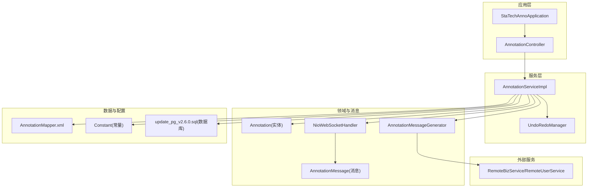
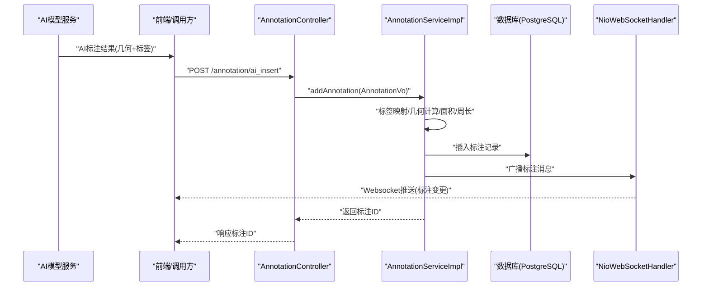
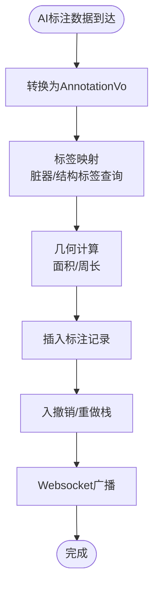
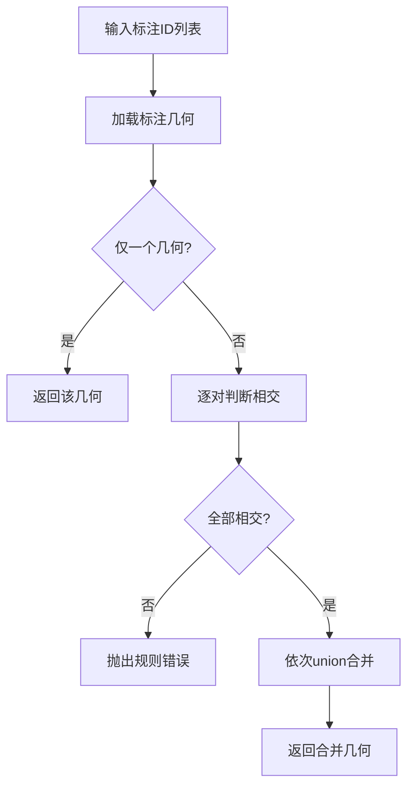
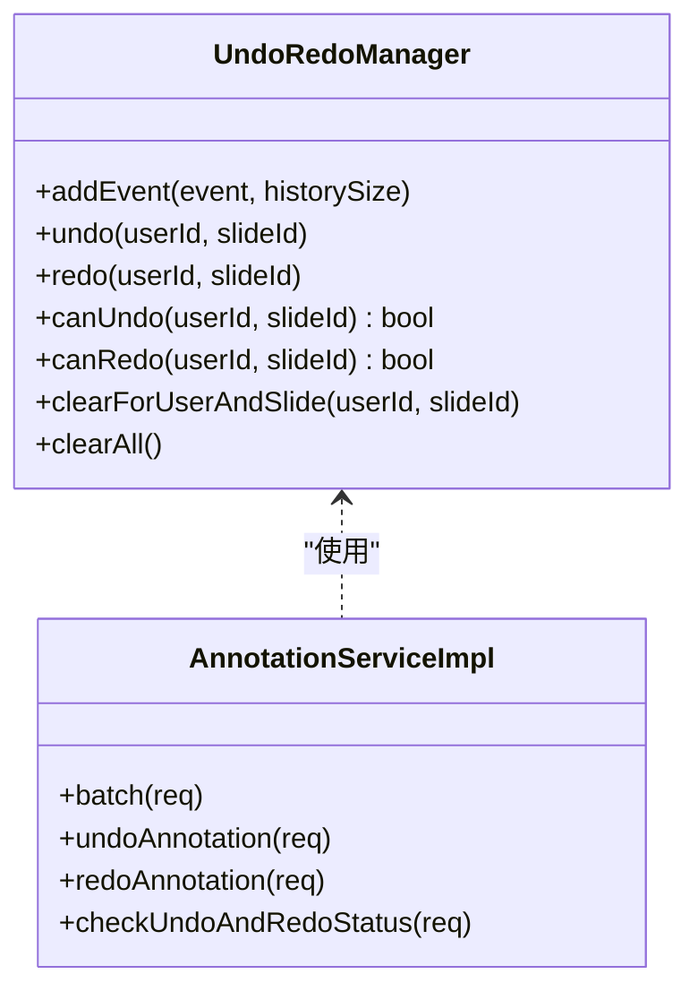
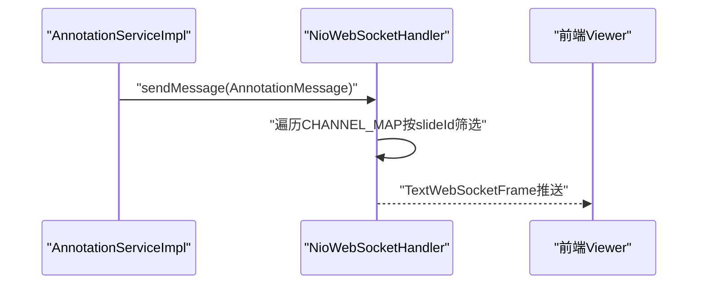
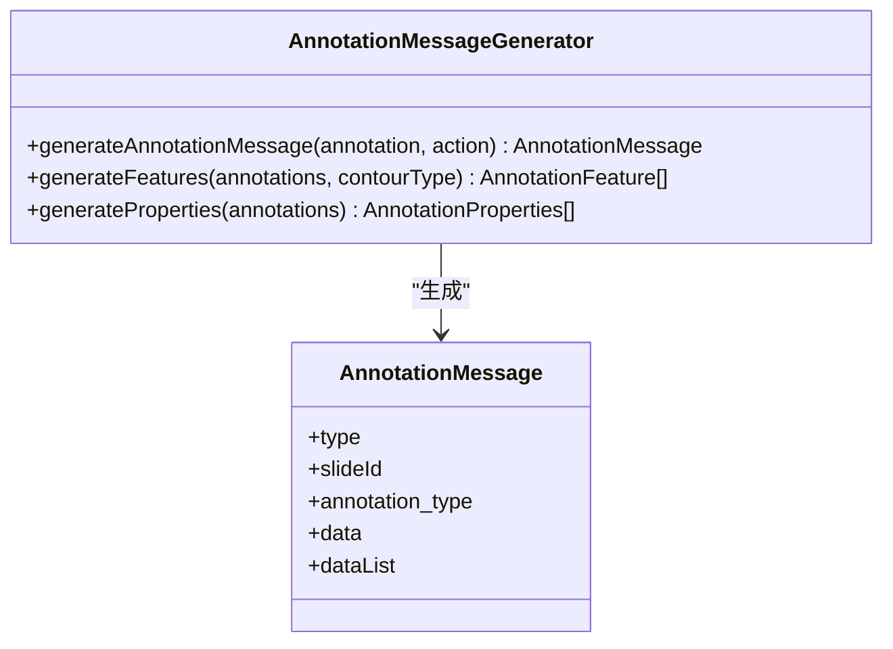
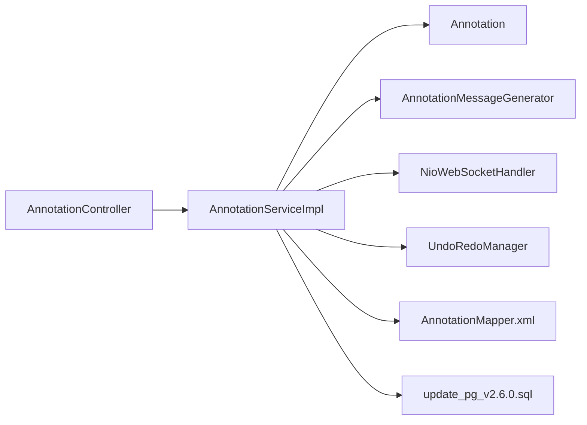

# AI标注系统集成

<cite>
**本文引用的文件**
- [StaTechAnnoApplication.java](file://src/main/java/cn/staitech/annotation/StaTechAnnoApplication.java)
- [AnnotationController.java](file://src/main/java/cn/staitech/annotation/controller/AnnotationController.java)
- [AnnotationServiceImpl.java](file://src/main/java/cn/staitech/annotation/service/impl/AnnotationServiceImpl.java)
- [Annotation.java](file://src/main/java/cn/staitech/annotation/domain/Annotation.java)
- [AIAnnotationAddReq.java](file://src/main/java/cn/staitech/annotation/vo/anno/AIAnnotationAddReq.java)
- [AnnotationAddReq.java](file://src/main/java/cn/staitech/annotation/vo/anno/AnnotationAddReq.java)
- [AnnotationMessageGenerator.java](file://src/main/java/cn/staitech/annotation/utils/annotation/AnnotationMessageGenerator.java)
- [NioWebSocketHandler.java](file://src/main/java/cn/staitech/annotation/netty/websocket/NioWebSocketHandler.java)
- [Constant.java](file://src/main/java/cn/staitech/annotation/constant/Constant.java)
- [AnnotationMapper.xml](file://src/main/resources/mapper/AnnotationMapper.xml)
- [update_pg_v2.6.0.sql](file://sql/update_pg_v2.6.0.sql)
- [UndoRedoManager.java](file://src/main/java/cn/staitech/annotation/utils/annotation/UndoRedoManager.java)
- [AnnotationMessage.java](file://src/main/java/cn/staitech/annotation/netty/message/AnnotationMessage.java)
- [README.md](file://README.md)
</cite>

## 目录
1. [简介](#简介)
2. [项目结构](#项目结构)
3. [核心组件](#核心组件)
4. [架构总览](#架构总览)
5. [详细组件分析](#详细组件分析)
6. [依赖分析](#依赖分析)
7. [性能考虑](#性能考虑)
8. [故障排查指南](#故障排查指南)
9. [结论](#结论)
10. [附录](#附录)

## 简介
本文件面向AI辅助标注系统的集成开发者，提供从架构设计、数据流、状态同步、冲突处理到生命周期管理、协同工作模式、API与数据格式标准化、错误处理与重试、集成测试与性能监控、故障恢复策略的完整实施指南。系统通过REST接口接收AI标注数据，结合标签与用户信息查询、几何计算与Websocket广播，实现标注数据的入库、可视化与协同编辑能力。

## 项目结构
后端采用Spring Boot工程，模块按职责分层组织：
- 应用入口与配置：StaTechAnnoApplication
- 控制层：AnnotationController 提供标注相关REST接口
- 服务层：AnnotationServiceImpl 实现标注业务逻辑、几何运算、撤销/重做、批量操作
- 领域模型：Annotation 数据实体
- VO/请求参数：AIAnnotationAddReq、AnnotationAddReq 等
- 工具与消息：AnnotationMessageGenerator、NioWebSocketHandler、UndoRedoManager
- 常量：Constant 定义标注类型、操作常量
- 数据访问：MyBatis Mapper XML
- 数据库：PostgreSQL 表结构与索引定义
- 文档：README 提供部署与端口说明

图表来源
- [StaTechAnnoApplication.java:1-51](file://src/main/java/cn/staitech/annotation/StaTechAnnoApplication.java#L1-L51)
- [AnnotationController.java:1-251](file://src/main/java/cn/staitech/annotation/controller/AnnotationController.java#L1-L251)
- [AnnotationServiceImpl.java:1-724](file://src/main/java/cn/staitech/annotation/service/impl/AnnotationServiceImpl.java#L1-L724)
- [Annotation.java:1-187](file://src/main/java/cn/staitech/annotation/domain/Annotation.java#L1-L187)
- [AnnotationMessageGenerator.java:1-349](file://src/main/java/cn/staitech/annotation/utils/annotation/AnnotationMessageGenerator.java#L1-L349)
- [NioWebSocketHandler.java:1-197](file://src/main/java/cn/staitech/annotation/netty/websocket/NioWebSocketHandler.java#L1-L197)
- [AnnotationMapper.xml:1-9](file://src/main/resources/mapper/AnnotationMapper.xml#L1-L9)
- [Constant.java:1-80](file://src/main/java/cn/staitech/annotation/constant/Constant.java#L1-L80)
- [update_pg_v2.6.0.sql:1-245](file://sql/update_pg_v2.6.0.sql#L1-L245)

章节来源
- [StaTechAnnoApplication.java:1-51](file://src/main/java/cn/staitech/annotation/StaTechAnnoApplication.java#L1-L51)
- [AnnotationController.java:1-251](file://src/main/java/cn/staitech/annotation/controller/AnnotationController.java#L1-L251)
- [AnnotationServiceImpl.java:1-724](file://src/main/java/cn/staitech/annotation/service/impl/AnnotationServiceImpl.java#L1-L724)
- [Annotation.java:1-187](file://src/main/java/cn/staitech/annotation/domain/Annotation.java#L1-L187)
- [AnnotationMessageGenerator.java:1-349](file://src/main/java/cn/staitech/annotation/utils/annotation/AnnotationMessageGenerator.java#L1-L349)
- [NioWebSocketHandler.java:1-197](file://src/main/java/cn/staitech/annotation/netty/websocket/NioWebSocketHandler.java#L1-L197)
- [AnnotationMapper.xml:1-9](file://src/main/resources/mapper/AnnotationMapper.xml#L1-L9)
- [Constant.java:1-80](file://src/main/java/cn/staitech/annotation/constant/Constant.java#L1-L80)
- [update_pg_v2.6.0.sql:1-245](file://sql/update_pg_v2.6.0.sql#L1-L245)

## 核心组件
- 应用入口与配置：启用Spring Util、自定义配置、Swagger、Feign客户端、发现客户端、异步、事务、MyBatis分页拦截器
- 控制器：提供标注新增、更新、删除、批量、几何运算、撤销/重做、Websocket通道等接口
- 服务实现：封装标注CRUD、几何计算、标签与用户映射、脏器单切片联动、Websocket广播、撤销/重做栈
- 领域模型：标注实体，包含几何字段、标注类型、切片ID、标签日志等
- 工具与消息：消息生成器负责将标注转换为GeoJSON Feature与属性，Websocket处理器负责向目标切片广播
- 常量：标注类型（AI/Draw/Measure）、操作动作（add/update/delete）、几何运算（UNION/DIFFERENCE）
- 数据库：标注表、删除归档表、测量表，含索引与注释

章节来源
- [StaTechAnnoApplication.java:1-51](file://src/main/java/cn/staitech/annotation/StaTechAnnoApplication.java#L1-L51)
- [AnnotationController.java:1-251](file://src/main/java/cn/staitech/annotation/controller/AnnotationController.java#L1-L251)
- [AnnotationServiceImpl.java:1-724](file://src/main/java/cn/staitech/annotation/service/impl/AnnotationServiceImpl.java#L1-L724)
- [Annotation.java:1-187](file://src/main/java/cn/staitech/annotation/domain/Annotation.java#L1-L187)
- [AnnotationMessageGenerator.java:1-349](file://src/main/java/cn/staitech/annotation/utils/annotation/AnnotationMessageGenerator.java#L1-L349)
- [NioWebSocketHandler.java:1-197](file://src/main/java/cn/staitech/annotation/netty/websocket/NioWebSocketHandler.java#L1-L197)
- [Constant.java:1-80](file://src/main/java/cn/staitech/annotation/constant/Constant.java#L1-L80)
- [update_pg_v2.6.0.sql:1-245](file://sql/update_pg_v2.6.0.sql#L1-L245)

## 架构总览
系统通过REST接口接收AI标注数据，服务层完成标签映射、几何计算、面积/周长换算、撤销/重做栈维护与Websocket广播。数据库采用PostgreSQL，几何类型由PostGIS支持。

图表来源
- [AnnotationController.java:60-70](file://src/main/java/cn/staitech/annotation/controller/AnnotationController.java#L60-L70)
- [AnnotationServiceImpl.java:183-238](file://src/main/java/cn/staitech/annotation/service/impl/AnnotationServiceImpl.java#L183-L238)
- [NioWebSocketHandler.java:38-68](file://src/main/java/cn/staitech/annotation/netty/websocket/NioWebSocketHandler.java#L38-L68)
- [update_pg_v2.6.0.sql:2-24](file://sql/update_pg_v2.6.0.sql#L2-L24)

## 详细组件分析

### 组件A：AI标注数据生命周期与状态同步
- 接收与入库：控制器提供“/annotation/ai_insert”接口，将AIAnnotationAddReq转换为AnnotationVo后调用服务层新增
- 标签映射与日志：根据contourType区分脏器标签与结构标签，调用远程服务查询标签信息，生成tagIdLog与jsonId
- 几何与度量：计算面积与周长，乘以图像分辨率系数，存入实体
- 撤销/重做：新增标注事件入栈，支持按用户与切片维度的撤销/重做
- 状态同步：Websocket广播标注消息，目标为对应slideId的连接

图表来源
- [AnnotationController.java:60-70](file://src/main/java/cn/staitech/annotation/controller/AnnotationController.java#L60-L70)
- [AnnotationServiceImpl.java:189-238](file://src/main/java/cn/staitech/annotation/service/impl/AnnotationServiceImpl.java#L189-L238)
- [AnnotationMessageGenerator.java:114-126](file://src/main/java/cn/staitech/annotation/utils/annotation/AnnotationMessageGenerator.java#L114-L126)
- [NioWebSocketHandler.java:38-68](file://src/main/java/cn/staitech/annotation/netty/websocket/NioWebSocketHandler.java#L38-L68)

章节来源
- [AnnotationController.java:60-70](file://src/main/java/cn/staitech/annotation/controller/AnnotationController.java#L60-L70)
- [AnnotationServiceImpl.java:183-238](file://src/main/java/cn/staitech/annotation/service/impl/AnnotationServiceImpl.java#L183-L238)
- [AnnotationMessageGenerator.java:114-126](file://src/main/java/cn/staitech/annotation/utils/annotation/AnnotationMessageGenerator.java#L114-L126)
- [NioWebSocketHandler.java:38-68](file://src/main/java/cn/staitech/annotation/netty/websocket/NioWebSocketHandler.java#L38-L68)

### 组件B：几何运算与合并策略
- 合并预览：对多个标注几何进行相交判断，必要时合并
- 几何运算：支持UNION与DIFFERENCE，校验几何相交性
- 距离计算：基于采样点计算两几何的平均距离与最近点

图表来源
- [AnnotationServiceImpl.java:503-535](file://src/main/java/cn/staitech/annotation/service/impl/AnnotationServiceImpl.java#L503-L535)

章节来源
- [AnnotationServiceImpl.java:503-535](file://src/main/java/cn/staitech/annotation/service/impl/AnnotationServiceImpl.java#L503-L535)

### 组件C：撤销/重做与冲突处理
- 撤销/重做栈：按用户与切片维度维护可序列化的事件栈，支持查询状态、清理
- 冲突处理：批量操作时逐条执行，异常不影响其他条目；Websocket广播确保前端状态一致

图表来源
- [UndoRedoManager.java:1-97](file://src/main/java/cn/staitech/annotation/utils/annotation/UndoRedoManager.java#L1-L97)
- [AnnotationServiceImpl.java:574-717](file://src/main/java/cn/staitech/annotation/service/impl/AnnotationServiceImpl.java#L574-L717)

章节来源
- [UndoRedoManager.java:1-97](file://src/main/java/cn/staitech/annotation/utils/annotation/UndoRedoManager.java#L1-L97)
- [AnnotationServiceImpl.java:574-717](file://src/main/java/cn/staitech/annotation/service/impl/AnnotationServiceImpl.java#L574-L717)

### 组件D：Websocket广播与前端协作
- 广播策略：根据slideId匹配已建立的WebSocket连接，向目标切片推送标注消息
- 消息结构：包含type、annotation_type、slideId与data/dataList

图表来源
- [AnnotationServiceImpl.java:236](file://src/main/java/cn/staitech/annotation/service/impl/AnnotationServiceImpl.java#L236)
- [NioWebSocketHandler.java:38-68](file://src/main/java/cn/staitech/annotation/netty/websocket/NioWebSocketHandler.java#L38-L68)
- [AnnotationMessage.java:1-28](file://src/main/java/cn/staitech/annotation/netty/message/AnnotationMessage.java#L1-L28)

章节来源
- [AnnotationServiceImpl.java:236](file://src/main/java/cn/staitech/annotation/service/impl/AnnotationServiceImpl.java#L236)
- [NioWebSocketHandler.java:38-68](file://src/main/java/cn/staitech/annotation/netty/websocket/NioWebSocketHandler.java#L38-L68)
- [AnnotationMessage.java:1-28](file://src/main/java/cn/staitech/annotation/netty/message/AnnotationMessage.java#L1-L28)

### 组件E：标签与用户映射、消息生成
- 标签映射：脏器标签与结构标签分别查询远程服务，生成属性字段
- 用户映射：查询用户列表，填充创建者/更新者用户名
- 消息生成：将标注实体转换为GeoJSON Feature与属性对象

图表来源
- [AnnotationMessageGenerator.java:40-50](file://src/main/java/cn/staitech/annotation/utils/annotation/AnnotationMessageGenerator.java#L40-L50)
- [AnnotationMessageGenerator.java:61-88](file://src/main/java/cn/staitech/annotation/utils/annotation/AnnotationMessageGenerator.java#L61-L88)
- [AnnotationMessageGenerator.java:162-202](file://src/main/java/cn/staitech/annotation/utils/annotation/AnnotationMessageGenerator.java#L162-L202)
- [AnnotationMessage.java:1-28](file://src/main/java/cn/staitech/annotation/netty/message/AnnotationMessage.java#L1-L28)

章节来源
- [AnnotationMessageGenerator.java:40-50](file://src/main/java/cn/staitech/annotation/utils/annotation/AnnotationMessageGenerator.java#L40-L50)
- [AnnotationMessageGenerator.java:61-88](file://src/main/java/cn/staitech/annotation/utils/annotation/AnnotationMessageGenerator.java#L61-L88)
- [AnnotationMessageGenerator.java:162-202](file://src/main/java/cn/staitech/annotation/utils/annotation/AnnotationMessageGenerator.java#L162-L202)
- [AnnotationMessage.java:1-28](file://src/main/java/cn/staitech/annotation/netty/message/AnnotationMessage.java#L1-L28)

## 依赖分析
- 控制器依赖服务层；服务层依赖实体、消息生成器、Websocket处理器、远程服务、撤销/重做管理器
- 数据访问通过MyBatis Mapper XML命名空间与SQL映射
- 数据库表包含标注、删除归档、测量三类，标注表含几何字段与索引

图表来源
- [AnnotationController.java:1-251](file://src/main/java/cn/staitech/annotation/controller/AnnotationController.java#L1-L251)
- [AnnotationServiceImpl.java:1-724](file://src/main/java/cn/staitech/annotation/service/impl/AnnotationServiceImpl.java#L1-L724)
- [AnnotationMapper.xml:1-9](file://src/main/resources/mapper/AnnotationMapper.xml#L1-L9)
- [update_pg_v2.6.0.sql:1-245](file://sql/update_pg_v2.6.0.sql#L1-L245)

章节来源
- [AnnotationController.java:1-251](file://src/main/java/cn/staitech/annotation/controller/AnnotationController.java#L1-L251)
- [AnnotationServiceImpl.java:1-724](file://src/main/java/cn/staitech/annotation/service/impl/AnnotationServiceImpl.java#L1-L724)
- [AnnotationMapper.xml:1-9](file://src/main/resources/mapper/AnnotationMapper.xml#L1-L9)
- [update_pg_v2.6.0.sql:1-245](file://sql/update_pg_v2.6.0.sql#L1-L245)

## 性能考虑
- 几何计算：采样点数量与几何复杂度成正比，建议在AI侧先做几何简化
- 批量操作：逐条执行并记录状态，避免单次事务过大；可考虑分批提交
- Websocket广播：按slideId筛选，避免全量广播；保持连接池健康
- 数据库：为annotation_type与slide_id建立索引，提升查询效率
- 缓存：标签与用户映射可缓存，减少远程调用次数

## 故障排查指南
- 常见错误与提示：无标注数据、几何规则不符、参数无效、无法撤销/重做
- 日志审计：控制器方法标注日志审计注解，便于追踪操作
- Websocket：检查握手URI与slideId绑定，确认CHANNEL_MAP中存在对应连接
- 远程服务：标签与用户查询异常时，关注远程服务可用性与返回码

章节来源
- [AnnotationServiceImpl.java:140-181](file://src/main/java/cn/staitech/annotation/service/impl/AnnotationServiceImpl.java#L140-L181)
- [AnnotationServiceImpl.java:574-623](file://src/main/java/cn/staitech/annotation/service/impl/AnnotationServiceImpl.java#L574-L623)
- [NioWebSocketHandler.java:167-194](file://src/main/java/cn/staitech/annotation/netty/websocket/NioWebSocketHandler.java#L167-L194)

## 结论
本系统通过清晰的分层与消息驱动架构，实现了AI标注数据的高效接入与可视化同步。通过标签映射、几何计算、撤销/重做与Websocket广播，满足AI与人工协同标注场景下的数据一致性与交互体验。建议在生产环境中强化AI侧数据质量控制、批量操作的幂等性与回滚策略，并完善监控与告警体系。

## 附录

### API接口设计与数据格式
- 新增AI标注
  - 方法：POST
  - 路径：/annotation/ai_insert
  - 请求体：AIAnnotationAddReq（包含几何、标签、切片ID、标注类型等）
  - 响应：标注ID字符串
- 更新AI标注
  - 方法：POST
  - 路径：/annotation/ai_update
  - 请求体：AIAnnotationUpdateVo
  - 响应：操作结果
- 删除AI标注
  - 方法：POST
  - 路径：/annotation/ai_delete
  - 请求体：AIDeleteAnnotationReq
  - 响应：操作结果
- Websocket通道
  - 握手路径：/anno/slide/{slideId}/websocket
  - 消息类型：AnnotationMessage（包含type、annotation_type、slideId、data/dataList）

章节来源
- [AnnotationController.java:60-131](file://src/main/java/cn/staitech/annotation/controller/AnnotationController.java#L60-L131)
- [NioWebSocketHandler.java:167-194](file://src/main/java/cn/staitech/annotation/netty/websocket/NioWebSocketHandler.java#L167-L194)
- [AnnotationMessage.java:1-28](file://src/main/java/cn/staitech/annotation/netty/message/AnnotationMessage.java#L1-L28)

### 数据模型与数据库
- 标注表：包含几何字段、标注类型、切片ID、标签ID、面积、周长、创建/更新信息等
- 删除归档表：记录删除前的标注快照
- 测量表：存储测量相关字段与几何

章节来源
- [update_pg_v2.6.0.sql:2-104](file://sql/update_pg_v2.6.0.sql#L2-L104)

### 错误处理与重试机制
- 参数校验：注解驱动的参数校验与国际化提示
- 异常捕获：批量操作逐条处理，异常不影响整体流程
- Websocket序列化：失败时记录日志并跳过发送
- 撤销/重做：失败项跳过，保证栈一致性

章节来源
- [AnnotationController.java:50-131](file://src/main/java/cn/staitech/annotation/controller/AnnotationController.java#L50-L131)
- [AnnotationServiceImpl.java:574-623](file://src/main/java/cn/staitech/annotation/service/impl/AnnotationServiceImpl.java#L574-L623)
- [NioWebSocketHandler.java:44-54](file://src/main/java/cn/staitech/annotation/netty/websocket/NioWebSocketHandler.java#L44-L54)

### 集成测试方案
- 单元测试：针对几何运算、标签映射、撤销/重做栈进行单元测试
- 集成测试：Websocket连通性、消息广播正确性、批量操作原子性
- 回归测试：数据库迁移脚本执行、索引与约束生效

### 性能监控
- 关键指标：标注新增/更新/删除耗时、Websocket消息延迟、批量操作吞吐
- 告警阈值：几何计算超时、批量操作失败率、Websocket丢包率

### 故障恢复策略
- 数据恢复：利用删除归档表进行数据回溯与恢复
- 服务重启：撤销/重做栈每日清理，避免内存膨胀
- 网络异常：Websocket断线重连，前端轮询状态检查