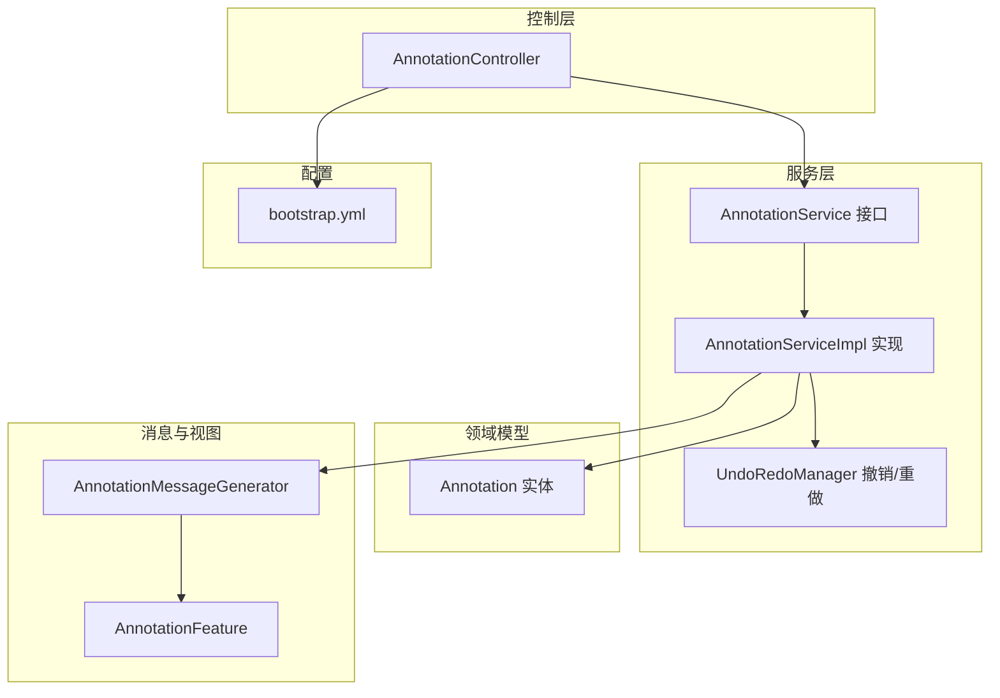
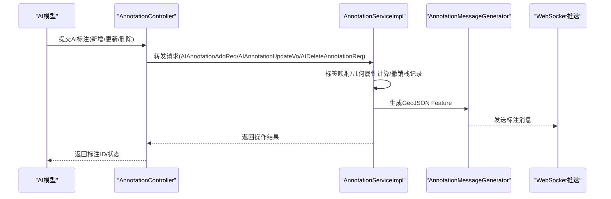
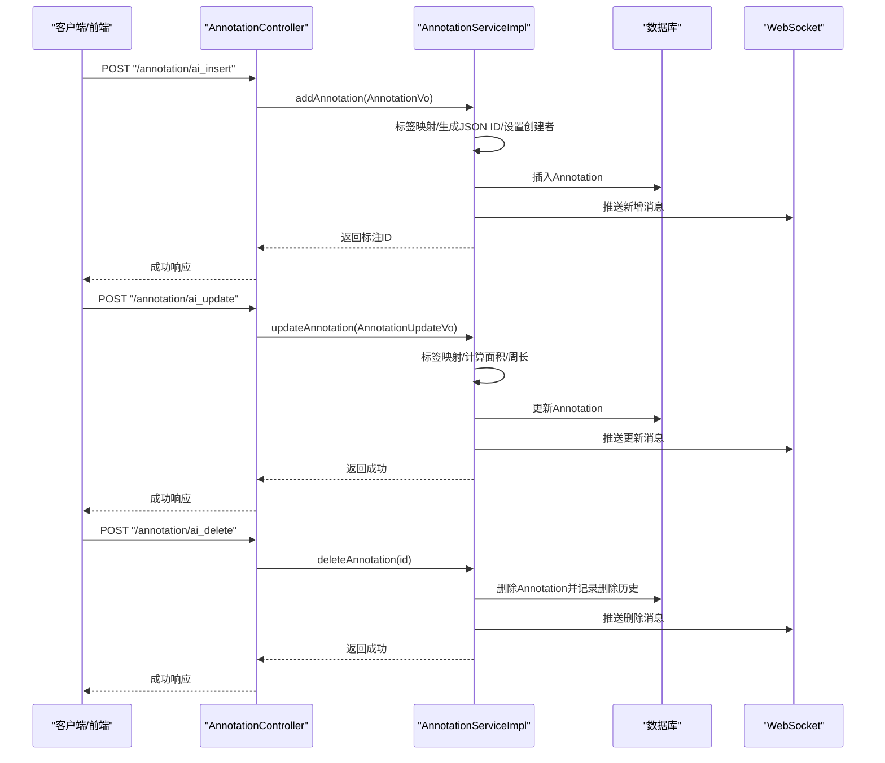
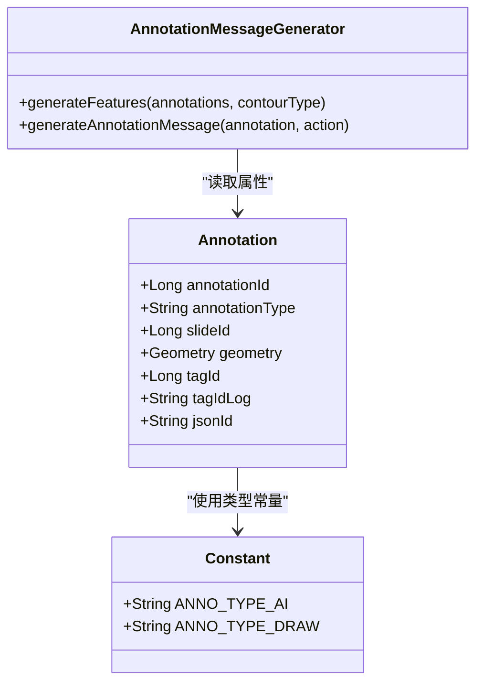
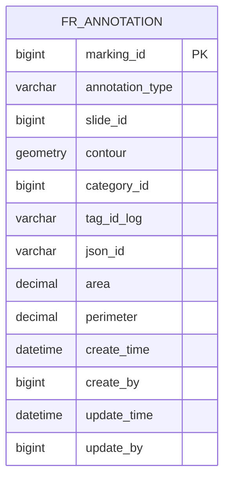
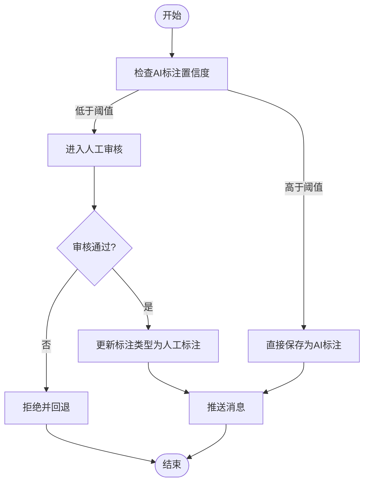
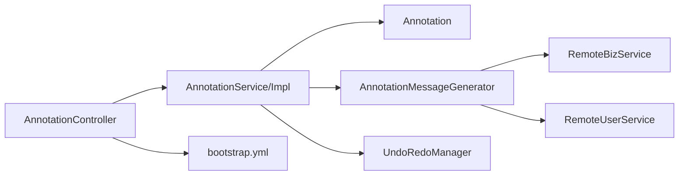

# AI辅助标注系统

<cite>
**本文引用的文件**
- [AnnotationController.java](file://src/main/java/cn/staitech/annotation/controller/AnnotationController.java)
- [AnnotationService.java](file://src/main/java/cn/staitech/annotation/service/AnnotationService.java)
- [AnnotationServiceImpl.java](file://src/main/java/cn/staitech/annotation/service/impl/AnnotationServiceImpl.java)
- [Annotation.java](file://src/main/java/cn/staitech/annotation/domain/Annotation.java)
- [AIAnnotationAddReq.java](file://src/main/java/cn/staitech/annotation/vo/anno/AIAnnotationAddReq.java)
- [AIAnnotationUpdateVo.java](file://src/main/java/cn/staitech/annotation/vo/anno/AIAnnotationUpdateVo.java)
- [AIDeleteAnnotationReq.java](file://src/main/java/cn/staitech/annotation/vo/anno/AIDeleteAnnotationReq.java)
- [AnnotationMessageGenerator.java](file://src/main/java/cn/staitech/annotation/utils/annotation/AnnotationMessageGenerator.java)
- [AnnotationFeature.java](file://src/main/java/cn/staitech/annotation/netty/message/AnnotationFeature.java)
- [Constant.java](file://src/main/java/cn/staitech/annotation/constant/Constant.java)
- [UndoRedoManager.java](file://src/main/java/cn/staitech/annotation/utils/annotation/UndoRedoManager.java)
- [AnnotationSdServiceImpl.java](file://src/main/java/cn/staitech/annotation/service/impl/AnnotationSdServiceImpl.java)
- [bootstrap.yml](file://src/main/resources/bootstrap.yml)
- [README.md](file://README.md)
</cite>

## 目录
1. [简介](#简介)
2. [项目结构](#项目结构)
3. [核心组件](#核心组件)
4. [架构总览](#架构总览)
5. [详细组件分析](#详细组件分析)
6. [依赖分析](#依赖分析)
7. [性能考虑](#性能考虑)
8. [故障排查指南](#故障排查指南)
9. [结论](#结论)
10. [附录](#附录)

## 简介
本文件面向医学图像标注系统的AI辅助标注能力，系统支持AI模型输出的标注数据接入、解析、验证与修正，并与人工标注流程深度融合。本文档从概念到实现逐层展开，覆盖AI标注的数据流、API规范、存储与版本化、质量评估与持续改进策略，以及与标注管理系统的集成方式。

## 项目结构
后端采用Spring Boot工程，标注相关模块集中在cn.staitech.annotation包下，主要层次如下：
- controller：对外HTTP接口，负责接收AI标注请求并转发至服务层
- service：标注业务接口与实现，包含AI标注的新增、更新、删除、批量处理与撤销/重做
- domain：标注实体模型，承载几何、标签、类型、切片ID等字段
- vo：请求/响应参数对象，包含AI标注专用的新增与更新请求体
- utils：消息生成、撤销/重做管理等工具类
- netty/message：标注消息结构，用于WebSocket推送
- resources：配置文件，包含应用名、端口、Nacos配置中心等

图表来源
- [AnnotationController.java:1-251](file://src/main/java/cn/staitech/annotation/controller/AnnotationController.java#L1-L251)
- [AnnotationService.java:1-44](file://src/main/java/cn/staitech/annotation/service/AnnotationService.java#L1-L44)
- [AnnotationServiceImpl.java:1-724](file://src/main/java/cn/staitech/annotation/service/impl/AnnotationServiceImpl.java#L1-L724)
- [Annotation.java:1-187](file://src/main/java/cn/staitech/annotation/domain/Annotation.java#L1-L187)
- [AnnotationMessageGenerator.java:1-349](file://src/main/java/cn/staitech/annotation/utils/annotation/AnnotationMessageGenerator.java#L1-L349)
- [AnnotationFeature.java:1-33](file://src/main/java/cn/staitech/annotation/netty/message/AnnotationFeature.java#L1-L33)
- [bootstrap.yml:1-42](file://src/main/resources/bootstrap.yml#L1-L42)

章节来源
- [AnnotationController.java:1-251](file://src/main/java/cn/staitech/annotation/controller/AnnotationController.java#L1-L251)
- [bootstrap.yml:1-42](file://src/main/resources/bootstrap.yml#L1-L42)

## 核心组件
- 控制器：提供AI标注的提交、更新、删除、查询等HTTP接口，区分AI与人工标注的路由
- 服务层：封装AI标注的业务逻辑，包括标签映射、几何面积/周长计算、撤销/重做、批量处理
- 实体模型：标注实体包含几何、标签、类型、切片ID、JSON ID等字段，支持AI标注类型标识
- 工具类：消息生成器负责将标注转换为GeoJSON Feature并注入属性；撤销/重做管理器按用户+切片维度维护历史栈
- 配置：应用端口、国际化、Nacos注册与配置中心等

章节来源
- [AnnotationController.java:62-110](file://src/main/java/cn/staitech/annotation/controller/AnnotationController.java#L62-L110)
- [AnnotationService.java:17-43](file://src/main/java/cn/staitech/annotation/service/AnnotationService.java#L17-L43)
- [AnnotationServiceImpl.java:184-238](file://src/main/java/cn/staitech/annotation/service/impl/AnnotationServiceImpl.java#L184-L238)
- [Annotation.java:23-112](file://src/main/java/cn/staitech/annotation/domain/Annotation.java#L23-L112)
- [AnnotationMessageGenerator.java:40-88](file://src/main/java/cn/staitech/annotation/utils/annotation/AnnotationMessageGenerator.java#L40-L88)
- [UndoRedoManager.java:16-97](file://src/main/java/cn/staitech/annotation/utils/annotation/UndoRedoManager.java#L16-L97)

## 架构总览
AI辅助标注的端到端流程：
- AI模型输出标注（几何、标签、切片ID等）经由控制器接收
- 服务层进行标签映射、几何属性计算、撤销/重做记录
- 通过消息生成器将标注转换为GeoJSON Feature并通过WebSocket推送
- 数据持久化至数据库，支持后续查询与历史追踪

图表来源
- [AnnotationController.java:62-110](file://src/main/java/cn/staitech/annotation/controller/AnnotationController.java#L62-L110)
- [AnnotationServiceImpl.java:184-238](file://src/main/java/cn/staitech/annotation/service/impl/AnnotationServiceImpl.java#L184-L238)
- [AnnotationMessageGenerator.java:40-50](file://src/main/java/cn/staitech/annotation/utils/annotation/AnnotationMessageGenerator.java#L40-L50)

## 详细组件分析

### AI标注提交与更新流程
- 提交流程：控制器接收AI新增请求，复制为通用标注请求，调用服务层新增逻辑，生成JSON ID与标签日志，插入数据库并推送消息
- 更新流程：控制器接收AI更新请求，复制为通用更新请求，调用服务层更新逻辑，计算面积/周长，更新标签日志，推送消息
- 删除流程：控制器接收AI删除请求，调用服务层删除逻辑，记录删除历史并推送消息

图表来源
- [AnnotationController.java:62-110](file://src/main/java/cn/staitech/annotation/controller/AnnotationController.java#L62-L110)
- [AnnotationServiceImpl.java:184-300](file://src/main/java/cn/staitech/annotation/service/impl/AnnotationServiceImpl.java#L184-L300)
- [AnnotationMessageGenerator.java:40-50](file://src/main/java/cn/staitech/annotation/utils/annotation/AnnotationMessageGenerator.java#L40-L50)

章节来源
- [AnnotationController.java:62-110](file://src/main/java/cn/staitech/annotation/controller/AnnotationController.java#L62-L110)
- [AnnotationServiceImpl.java:184-300](file://src/main/java/cn/staitech/annotation/service/impl/AnnotationServiceImpl.java#L184-L300)

### AI标注与人工标注的融合策略
- 类型标识：实体包含标注类型字段，AI标注类型常量与人工标注类型常量明确区分
- 标签映射：根据标注类型与轮廓类型，分别查询脏器标签或结构标签，生成标签日志，确保前后端一致显示
- 几何属性：统一计算面积与周长，单位换算由常量控制，保证不同来源标注的一致性
- 消息推送：统一通过消息生成器生成GeoJSON Feature并推送，前端可按类型渲染

图表来源
- [Annotation.java:23-112](file://src/main/java/cn/staitech/annotation/domain/Annotation.java#L23-L112)
- [Constant.java:44-47](file://src/main/java/cn/staitech/annotation/constant/Constant.java#L44-L47)
- [AnnotationMessageGenerator.java:61-88](file://src/main/java/cn/staitech/annotation/utils/annotation/AnnotationMessageGenerator.java#L61-L88)

章节来源
- [Annotation.java:70-76](file://src/main/java/cn/staitech/annotation/domain/Annotation.java#L70-L76)
- [Constant.java:44-47](file://src/main/java/cn/staitech/annotation/constant/Constant.java#L44-L47)
- [AnnotationMessageGenerator.java:61-88](file://src/main/java/cn/staitech/annotation/utils/annotation/AnnotationMessageGenerator.java#L61-L88)

### AI标注API接口规范
- 新增AI标注
  - 方法与路径：POST /annotation/ai_insert
  - 请求体：AIAnnotationAddReq（包含几何、标签、切片ID、轮廓类型等）
  - 响应：返回新标注ID字符串
- 更新AI标注
  - 方法与路径：POST /annotation/ai_update
  - 请求体：AIAnnotationUpdateVo（包含标注ID、几何、标签等）
  - 响应：成功状态
- 删除AI标注
  - 方法与路径：POST /annotation/ai_delete
  - 请求体：AIDeleteAnnotationReq（包含标注ID）
  - 响应：成功状态
- 查询标注
  - 方法与路径：POST /annotation/selectLists
  - 请求体：AnnotationReq（包含切片ID与轮廓类型）
  - 响应：GeoJSON Feature列表

章节来源
- [AnnotationController.java:62-110](file://src/main/java/cn/staitech/annotation/controller/AnnotationController.java#L62-L110)
- [AnnotationController.java:141-153](file://src/main/java/cn/staitech/annotation/controller/AnnotationController.java#L141-L153)
- [AIAnnotationAddReq.java:24-118](file://src/main/java/cn/staitech/annotation/vo/anno/AIAnnotationAddReq.java#L24-L118)
- [AIAnnotationUpdateVo.java:22-101](file://src/main/java/cn/staitech/annotation/vo/anno/AIAnnotationUpdateVo.java#L22-L101)
- [AIDeleteAnnotationReq.java:8-16](file://src/main/java/cn/staitech/annotation/vo/anno/AIDeleteAnnotationReq.java#L8-L16)

### AI标注数据存储结构与版本管理
- 表结构：标注实体对应fr_annotation表，包含主键、几何、标签、类型、切片ID、JSON ID、创建/更新信息等
- 版本与历史：删除时将标注记录复制到删除表，便于审计与回溯；撤销/重做通过内存栈维护历史快照
- 消息结构：Feature包含几何与属性，属性中包含标注ID、类型、标签、面积、周长、描述、创建/更新用户与时间等

图表来源
- [Annotation.java:23-112](file://src/main/java/cn/staitech/annotation/domain/Annotation.java#L23-L112)

章节来源
- [Annotation.java:23-112](file://src/main/java/cn/staitech/annotation/domain/Annotation.java#L23-L112)
- [AnnotationServiceImpl.java:273-300](file://src/main/java/cn/staitech/annotation/service/impl/AnnotationServiceImpl.java#L273-L300)
- [AnnotationFeature.java:14-33](file://src/main/java/cn/staitech/annotation/netty/message/AnnotationFeature.java#L14-L33)

### AI标注质量评估与置信度阈值
- 标签映射一致性：通过查询脏器/结构标签，生成统一的日志字段，避免前端显示差异
- 几何属性一致性：统一计算面积与周长，使用分辨率常量进行单位换算
- 审计与回溯：删除记录落库，支持历史追踪；撤销/重做栈支持快速恢复
- 建议：在AI模型侧引入置信度字段并在请求体中携带，服务层可根据阈值决定是否直接入库或进入人工审核队列

章节来源
- [AnnotationServiceImpl.java:190-218](file://src/main/java/cn/staitech/annotation/service/impl/AnnotationServiceImpl.java#L190-L218)
- [AnnotationServiceImpl.java:371-381](file://src/main/java/cn/staitech/annotation/service/impl/AnnotationServiceImpl.java#L371-L381)
- [Constant.java:30-31](file://src/main/java/cn/staitech/annotation/constant/Constant.java#L30-L31)

### 人工审核流程与冲突处理
- 撤销/重做：按用户+切片维度维护历史栈，支持撤销与重做操作
- 冲突处理：当同一切片同标签的粗轮廓存在时，避免重复添加/删除脏器；批量操作中按操作类型分别处理
- 审核建议：对低置信度AI标注进行人工复核，复核通过后更新标注类型与属性

图表来源
- [UndoRedoManager.java:42-61](file://src/main/java/cn/staitech/annotation/utils/annotation/UndoRedoManager.java#L42-L61)
- [AnnotationServiceImpl.java:247-265](file://src/main/java/cn/staitech/annotation/service/impl/AnnotationServiceImpl.java#L247-L265)

章节来源
- [UndoRedoManager.java:16-97](file://src/main/java/cn/staitech/annotation/utils/annotation/UndoRedoManager.java#L16-L97)
- [AnnotationServiceImpl.java:247-265](file://src/main/java/cn/staitech/annotation/service/impl/AnnotationServiceImpl.java#L247-L265)

### 与标注管理系统的集成
- 数据同步：服务层通过消息生成器统一生成GeoJSON Feature并推送，前端按类型渲染
- 状态管理：标注类型字段区分AI与人工；撤销/重做栈维护状态变更历史
- 冲突处理：针对粗轮廓与标签组合进行唯一性检查，避免重复脏器状态

章节来源
- [AnnotationMessageGenerator.java:40-88](file://src/main/java/cn/staitech/annotation/utils/annotation/AnnotationMessageGenerator.java#L40-L88)
- [AnnotationServiceImpl.java:247-265](file://src/main/java/cn/staitech/annotation/service/impl/AnnotationServiceImpl.java#L247-L265)

## 依赖分析
- 控制器依赖服务层接口，服务层依赖实体、消息生成器与撤销/重做管理器
- 标签查询依赖远程业务服务，用户查询依赖远程用户服务
- 配置依赖Nacos注册与配置中心

图表来源
- [AnnotationController.java:45-48](file://src/main/java/cn/staitech/annotation/controller/AnnotationController.java#L45-L48)
- [AnnotationServiceImpl.java:17-60](file://src/main/java/cn/staitech/annotation/service/impl/AnnotationServiceImpl.java#L17-L60)
- [AnnotationMessageGenerator.java:114-126](file://src/main/java/cn/staitech/annotation/utils/annotation/AnnotationMessageGenerator.java#L114-L126)
- [bootstrap.yml:20-41](file://src/main/resources/bootstrap.yml#L20-L41)

章节来源
- [AnnotationController.java:45-48](file://src/main/java/cn/staitech/annotation/controller/AnnotationController.java#L45-L48)
- [AnnotationServiceImpl.java:17-60](file://src/main/java/cn/staitech/annotation/service/impl/AnnotationServiceImpl.java#L17-L60)
- [AnnotationMessageGenerator.java:114-126](file://src/main/java/cn/staitech/annotation/utils/annotation/AnnotationMessageGenerator.java#L114-L126)
- [bootstrap.yml:20-41](file://src/main/resources/bootstrap.yml#L20-L41)

## 性能考虑
- 几何计算：面积与周长计算在服务层进行，注意几何有效性与异常处理
- 撤销/重做：内存栈大小受常量限制，合理设置以平衡性能与内存占用
- 标签查询：批量查询标签与用户信息，减少网络往返次数
- WebSocket推送：统一消息生成与推送，避免重复序列化

## 故障排查指南
- 无标注数据：当查询或更新的目标不存在时抛出异常，需检查请求参数与数据一致性
- 几何规则错误：合并/裁剪操作要求几何相交，否则抛出规则错误
- 撤销/重做不可用：当历史栈为空或超出范围时返回相应提示
- 标签映射失败：远程标签查询失败时抛出运行时异常，需检查远程服务可用性

章节来源
- [AnnotationServiceImpl.java:153-165](file://src/main/java/cn/staitech/annotation/service/impl/AnnotationServiceImpl.java#L153-L165)
- [AnnotationServiceImpl.java:531-533](file://src/main/java/cn/staitech/annotation/service/impl/AnnotationServiceImpl.java#L531-L533)
- [AnnotationServiceImpl.java:678-687](file://src/main/java/cn/staitech/annotation/service/impl/AnnotationServiceImpl.java#L678-L687)

## 结论
本系统通过清晰的分层设计与统一的消息协议，实现了AI辅助标注与人工标注的无缝融合。AI标注的提交、更新、删除均具备完善的验证与审计机制，结合撤销/重做与历史追踪，满足医学图像标注的高可靠性需求。建议在后续迭代中引入置信度阈值与人工审核流程，进一步提升标注质量与效率。

## 附录
- 应用配置：端口、国际化、Nacos注册与配置中心等
- 项目说明：后端项目说明与端口开放情况

章节来源
- [bootstrap.yml:1-42](file://src/main/resources/bootstrap.yml#L1-L42)
- [README.md:1-95](file://README.md#L1-L95)