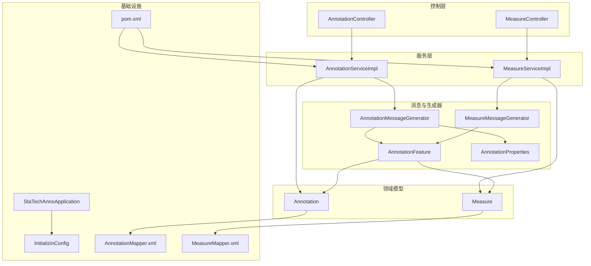
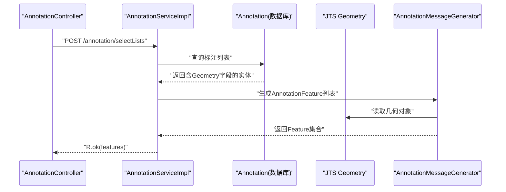
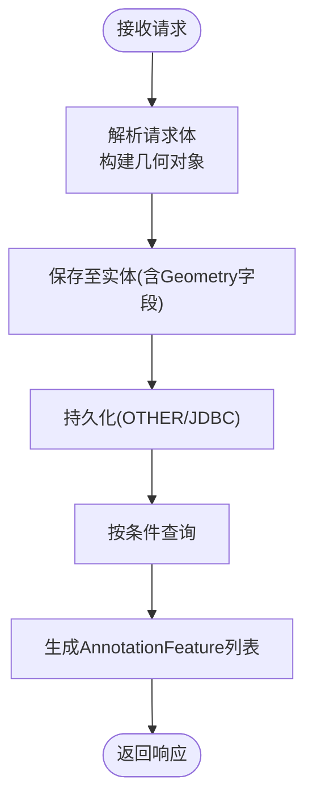
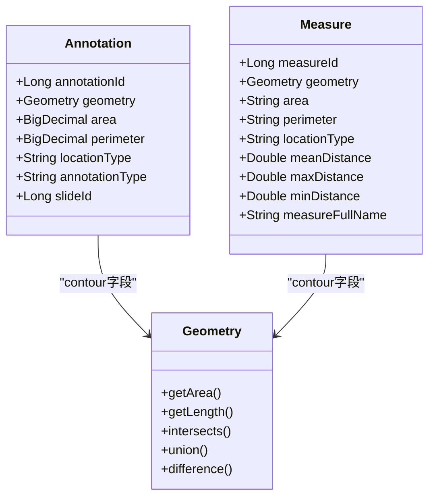
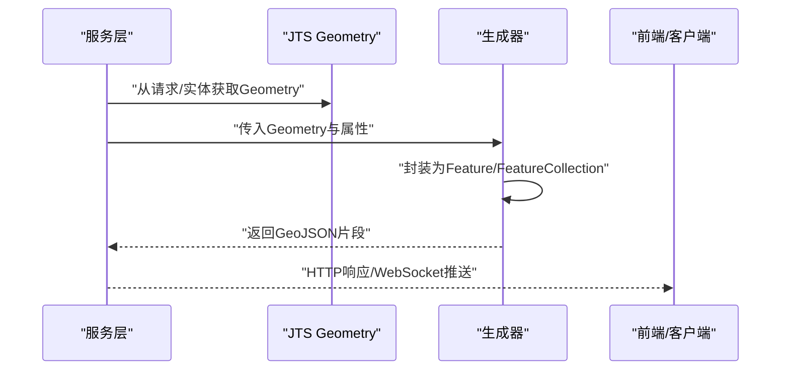
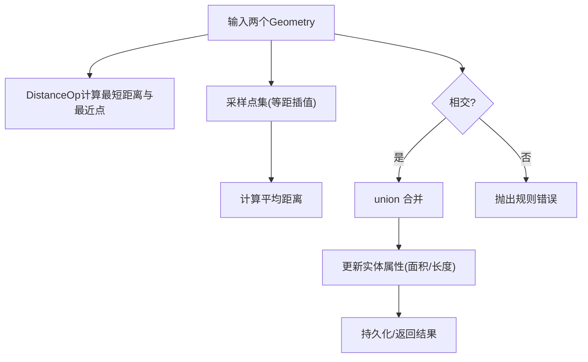
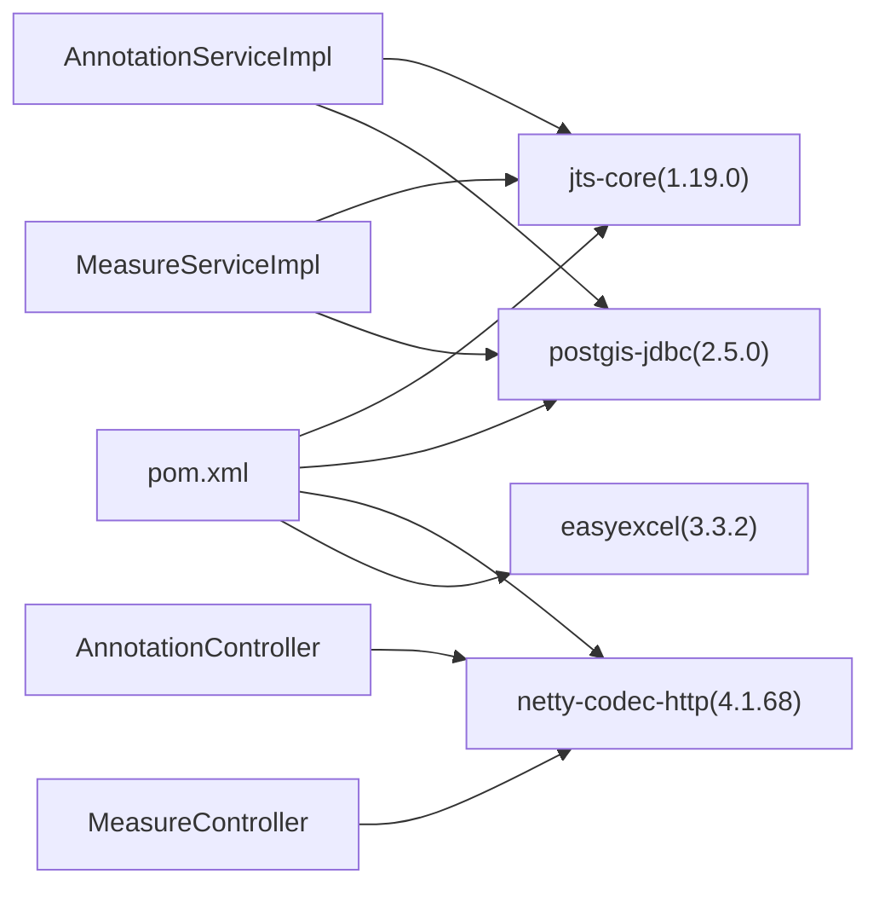

# 几何数据处理

<cite>
**本文引用的文件**   
- [StaTechAnnoApplication.java](file://src/main/java/cn/staitech/annotation/StaTechAnnoApplication.java)
- [InitializinConfig.java](file://src/main/java/cn/staitech/annotation/config/InitializinConfig.java)
- [Annotation.java](file://src/main/java/cn/staitech/annotation/domain/Annotation.java)
- [Measure.java](file://src/main/java/cn/staitech/annotation/domain/Measure.java)
- [AnnotationFeature.java](file://src/main/java/cn/staitech/annotation/netty/message/AnnotationFeature.java)
- [AnnotationProperties.java](file://src/main/java/cn/staitech/annotation/netty/message/AnnotationProperties.java)
- [AnnotationServiceImpl.java](file://src/main/java/cn/staitech/annotation/service/impl/AnnotationServiceImpl.java)
- [MeasureServiceImpl.java](file://src/main/java/cn/staitech/annotation/service/impl/MeasureServiceImpl.java)
- [AnnotationMessageGenerator.java](file://src/main/java/cn/staitech/annotation/utils/annotation/AnnotationMessageGenerator.java)
- [MeasureMessageGenerator.java](file://src/main/java/cn/staitech/annotation/utils/measure/MeasureMessageGenerator.java)
- [Constant.java](file://src/main/java/cn/staitech/annotation/constant/Constant.java)
- [AnnotationController.java](file://src/main/java/cn/staitech/annotation/controller/AnnotationController.java)
- [MeasureController.java](file://src/main/java/cn/staitech/annotation/controller/MeasureController.java)
- [AnnotationMapper.xml](file://src/main/resources/mapper/AnnotationMapper.xml)
- [MeasureMapper.xml](file://src/main/resources/mapper/MeasureMapper.xml)
- [pom.xml](file://pom.xml)
</cite>

## 目录
1. [简介](#简介)
2. [项目结构](#项目结构)
3. [核心组件](#核心组件)
4. [架构总览](#架构总览)
5. [详细组件分析](#详细组件分析)
6. [依赖分析](#依赖分析)
7. [性能考虑](#性能考虑)
8. [故障排查指南](#故障排查指南)
9. [结论](#结论)
10. [附录](#附录)

## 简介
本技术文档围绕基于 JTS Topology Suite 的几何数据处理模块展开，系统性阐述几何对象的创建、存储、查询与计算，覆盖点、线、面、多边形等几何类型的构造与属性提取；说明几何数据的序列化与反序列化（GeoJSON 生成与解析）；解释坐标变换、投影转换与单位换算的关键思路；给出几何运算（距离、面积、相交判断、缓冲区分析等）的实现要点；并提供几何数据的验证、修复与优化流程建议，以及面向开发者的最佳实践与性能优化策略。

## 项目结构
该模块采用典型的分层架构：控制层负责对外接口与请求转发；服务层承载业务逻辑与几何运算；领域模型承载持久化字段与 JTS 几何字段；消息与生成器负责将几何与属性封装为前端可消费的 GeoJSON 片段；XML 映射文件定义数据库列与 JDBC 类型映射；pom.xml 引入 JTS、PostGIS、Netty、EasyExcel 等关键依赖。

**图表来源**
- [AnnotationController.java:1-251](file://src/main/java/cn/staitech/annotation/controller/AnnotationController.java#L1-251)
- [MeasureController.java:1-118](file://src/main/java/cn/staitech/annotation/controller/MeasureController.java#L1-118)
- [AnnotationServiceImpl.java:1-724](file://src/main/java/cn/staitech/annotation/service/impl/AnnotationServiceImpl.java#L1-724)
- [MeasureServiceImpl.java:1-161](file://src/main/java/cn/staitech/annotation/service/impl/MeasureServiceImpl.java#L1-161)
- [Annotation.java:1-187](file://src/main/java/cn/staitech/annotation/domain/Annotation.java#L1-187)
- [Measure.java:1-256](file://src/main/java/cn/staitech/annotation/domain/Measure.java#L1-256)
- [AnnotationMessageGenerator.java:1-349](file://src/main/java/cn/staitech/annotation/utils/annotation/AnnotationMessageGenerator.java#L1-349)
- [MeasureMessageGenerator.java:1-128](file://src/main/java/cn/staitech/annotation/utils/measure/MeasureMessageGenerator.java#L1-128)
- [AnnotationFeature.java:1-33](file://src/main/java/cn/staitech/annotation/netty/message/AnnotationFeature.java#L1-33)
- [AnnotationProperties.java:1-75](file://src/main/java/cn/staitech/annotation/netty/message/AnnotationProperties.java#L1-75)
- [AnnotationMapper.xml:1-9](file://src/main/resources/mapper/AnnotationMapper.xml#L1-9)
- [MeasureMapper.xml:1-45](file://src/main/resources/mapper/MeasureMapper.xml#L1-45)
- [StaTechAnnoApplication.java:1-51](file://src/main/java/cn/staitech/annotation/StaTechAnnoApplication.java#L1-51)
- [InitializinConfig.java:1-31](file://src/main/java/cn/staitech/annotation/config/InitializinConfig.java#L1-31)
- [pom.xml:1-265](file://pom.xml#L1-265)

**章节来源**
- [AnnotationController.java:1-251](file://src/main/java/cn/staitech/annotation/controller/AnnotationController.java#L1-L251)
- [MeasureController.java:1-118](file://src/main/java/cn/staitech/annotation/controller/MeasureController.java#L1-L118)
- [AnnotationServiceImpl.java:1-724](file://src/main/java/cn/staitech/annotation/service/impl/AnnotationServiceImpl.java#L1-L724)
- [MeasureServiceImpl.java:1-161](file://src/main/java/cn/staitech/annotation/service/impl/MeasureServiceImpl.java#L1-L161)
- [Annotation.java:1-187](file://src/main/java/cn/staitech/annotation/domain/Annotation.java#L1-L187)
- [Measure.java:1-256](file://src/main/java/cn/staitech/annotation/domain/Measure.java#L1-L256)
- [AnnotationMessageGenerator.java:1-349](file://src/main/java/cn/staitech/annotation/utils/annotation/AnnotationMessageGenerator.java#L1-L349)
- [MeasureMessageGenerator.java:1-128](file://src/main/java/cn/staitech/annotation/utils/measure/MeasureMessageGenerator.java#L1-L128)
- [AnnotationFeature.java:1-33](file://src/main/java/cn/staitech/annotation/netty/message/AnnotationFeature.java#L1-L33)
- [AnnotationProperties.java:1-75](file://src/main/java/cn/staitech/annotation/netty/message/AnnotationProperties.java#L1-L75)
- [AnnotationMapper.xml:1-9](file://src/main/resources/mapper/AnnotationMapper.xml#L1-L9)
- [MeasureMapper.xml:1-45](file://src/main/resources/mapper/MeasureMapper.xml#L1-L45)
- [StaTechAnnoApplication.java:1-51](file://src/main/java/cn/staitech/annotation/StaTechAnnoApplication.java#L1-L51)
- [InitializinConfig.java:1-31](file://src/main/java/cn/staitech/annotation/config/InitializinConfig.java#L1-L31)
- [pom.xml:1-265](file://pom.xml#L1-L265)

## 核心组件
- 控制层：提供标注与测量的 REST 接口，负责参数校验、调用服务层并返回统一响应。
- 服务层：实现几何对象的创建、存储、查询、计算与批量处理；封装撤销/重做栈；生成前端可用的 GeoJSON 片段。
- 领域模型：标注与测量实体，包含 JTS 几何字段与业务属性；通过 XML 映射将几何字段映射为数据库的 OTHER/JDBC 类型。
- 消息与生成器：将几何与属性封装为 AnnotationFeature/AnnotationSdFeature，供 WebSocket 或 HTTP 返回。
- 基础设施：应用启动、Redis 连接工厂初始化、常量定义、依赖声明。

**章节来源**
- [AnnotationController.java:1-251](file://src/main/java/cn/staitech/annotation/controller/AnnotationController.java#L1-L251)
- [MeasureController.java:1-118](file://src/main/java/cn/staitech/annotation/controller/MeasureController.java#L1-L118)
- [AnnotationServiceImpl.java:1-724](file://src/main/java/cn/staitech/annotation/service/impl/AnnotationServiceImpl.java#L1-L724)
- [MeasureServiceImpl.java:1-161](file://src/main/java/cn/staitech/annotation/service/impl/MeasureServiceImpl.java#L1-L161)
- [Annotation.java:1-187](file://src/main/java/cn/staitech/annotation/domain/Annotation.java#L1-L187)
- [Measure.java:1-256](file://src/main/java/cn/staitech/annotation/domain/Measure.java#L1-L256)
- [AnnotationMessageGenerator.java:1-349](file://src/main/java/cn/staitech/annotation/utils/annotation/AnnotationMessageGenerator.java#L1-L349)
- [MeasureMessageGenerator.java:1-128](file://src/main/java/cn/staitech/annotation/utils/measure/MeasureMessageGenerator.java#L1-L128)
- [AnnotationMapper.xml:1-9](file://src/main/resources/mapper/AnnotationMapper.xml#L1-L9)
- [MeasureMapper.xml:1-45](file://src/main/resources/mapper/MeasureMapper.xml#L1-L45)
- [StaTechAnnoApplication.java:1-51](file://src/main/java/cn/staitech/annotation/StaTechAnnoApplication.java#L1-L51)
- [InitializinConfig.java:1-31](file://src/main/java/cn/staitech/annotation/config/InitializinConfig.java#L1-L31)
- [pom.xml:1-265](file://pom.xml#L1-L265)

## 架构总览
下图展示从控制器到服务层、领域模型与消息生成器之间的交互，以及几何字段在持久化层的映射关系。

**图表来源**
- [AnnotationController.java:140-153](file://src/main/java/cn/staitech/annotation/controller/AnnotationController.java#L140-L153)
- [AnnotationServiceImpl.java:504-519](file://src/main/java/cn/staitech/annotation/service/impl/AnnotationServiceImpl.java#L504-L519)
- [Annotation.java:62-63](file://src/main/java/cn/staitech/annotation/domain/Annotation.java#L62-L63)
- [AnnotationMessageGenerator.java:61-88](file://src/main/java/cn/staitech/annotation/utils/annotation/AnnotationMessageGenerator.java#L61-L88)

## 详细组件分析

### 几何对象的创建、存储与查询
- 创建与更新时，服务层从请求对象中提取 JTS 几何对象，写入标注或测量实体，并持久化到数据库。
- 存储映射：标注与测量实体中的几何字段映射为数据库的 OTHER/JDBC 类型，由驱动或扩展库负责序列化/反序列化。
- 查询：控制器按切片 ID 等条件查询，服务层将实体转为前端可用的 Feature 列表。

**图表来源**
- [AnnotationServiceImpl.java:188-238](file://src/main/java/cn/staitech/annotation/service/impl/AnnotationServiceImpl.java#L188-L238)
- [MeasureServiceImpl.java:61-81](file://src/main/java/cn/staitech/annotation/service/impl/MeasureServiceImpl.java#L61-L81)
- [AnnotationMapper.xml:1-9](file://src/main/resources/mapper/AnnotationMapper.xml#L1-L9)
- [MeasureMapper.xml:26:1](file://src/main/resources/mapper/MeasureMapper.xml#L26-L26)

**章节来源**
- [AnnotationServiceImpl.java:188-238](file://src/main/java/cn/staitech/annotation/service/impl/AnnotationServiceImpl.java#L188-L238)
- [MeasureServiceImpl.java:61-81](file://src/main/java/cn/staitech/annotation/service/impl/MeasureServiceImpl.java#L61-L81)
- [AnnotationMapper.xml:1-9](file://src/main/resources/mapper/AnnotationMapper.xml#L1-L9)
- [MeasureMapper.xml:1-45](file://src/main/resources/mapper/MeasureMapper.xml#L1-L45)

### 几何类型与属性
- 支持的几何类型：点、线、面、多边形等，均由 JTS 提供的 Geometry 及其子类表示。
- 属性提取：面积、长度等属性通过几何对象的 API 计算，并结合分辨率常量进行单位换算。
- 标注类型区分：标注、AI、测量三类类型在常量中定义，用于前端识别与业务分支。

**图表来源**
- [Annotation.java:39-63](file://src/main/java/cn/staitech/annotation/domain/Annotation.java#L39-L63)
- [Measure.java:44-124](file://src/main/java/cn/staitech/annotation/domain/Measure.java#L44-L124)
- [AnnotationServiceImpl.java:374-381](file://src/main/java/cn/staitech/annotation/service/impl/AnnotationServiceImpl.java#L374-L381)

**章节来源**
- [Annotation.java:1-187](file://src/main/java/cn/staitech/annotation/domain/Annotation.java#L1-L187)
- [Measure.java:1-256](file://src/main/java/cn/staitech/annotation/domain/Measure.java#L1-L256)
- [AnnotationServiceImpl.java:374-381](file://src/main/java/cn/staitech/annotation/service/impl/AnnotationServiceImpl.java#L374-L381)

### 序列化与反序列化（GeoJSON）
- 生成：服务层将实体的几何字段与属性封装为 AnnotationFeature/AnnotationSdFeature，再由生成器统一输出。
- 解析：前端传入的几何数据通常来自编辑器或测量工具，服务层将其转换为 JTS 几何对象后入库。
- 字段映射：几何字段映射为数据库的 OTHER/JDBC 类型，依赖 PostGIS/扩展库完成序列化/反序列化。

**图表来源**
- [AnnotationMessageGenerator.java:40-50](file://src/main/java/cn/staitech/annotation/utils/annotation/AnnotationMessageGenerator.java#L40-L50)
- [MeasureMessageGenerator.java:29-38](file://src/main/java/cn/staitech/annotation/utils/measure/MeasureMessageGenerator.java#L29-L38)
- [AnnotationFeature.java:14-32](file://src/main/java/cn/staitech/annotation/netty/message/AnnotationFeature.java#L14-L32)
- [MeasureMapper.xml:26:1](file://src/main/resources/mapper/MeasureMapper.xml#L26-L26)

**章节来源**
- [AnnotationMessageGenerator.java:1-349](file://src/main/java/cn/staitech/annotation/utils/annotation/AnnotationMessageGenerator.java#L1-L349)
- [MeasureMessageGenerator.java:1-128](file://src/main/java/cn/staitech/annotation/utils/measure/MeasureMessageGenerator.java#L1-L128)
- [AnnotationFeature.java:1-33](file://src/main/java/cn/staitech/annotation/netty/message/AnnotationFeature.java#L1-L33)
- [MeasureMapper.xml:1-45](file://src/main/resources/mapper/MeasureMapper.xml#L1-L45)

### 坐标变换、投影转换与单位换算
- 单位换算：通过常量对面积与长度进行像素到微米（µm）单位换算，确保前端显示与实际尺度一致。
- 投影与坐标系：当前代码未直接体现投影转换逻辑；如需支持投影转换，可在几何入库前或查询时引入坐标参考系统（CRS）转换（例如通过 JTS 扩展或外部库）。
- 建议：在几何入库前统一转换到目标投影（如 Web Mercator 或本地投影），并在查询时保持一致性。

**章节来源**
- [Constant.java:30-31](file://src/main/java/cn/staitech/annotation/constant/Constant.java#L30-L31)
- [AnnotationServiceImpl.java:376-377](file://src/main/java/cn/staitech/annotation/service/impl/AnnotationServiceImpl.java#L376-L377)

### 几何运算实现细节
- 距离计算：使用 JTS 的 DistanceOp 计算两几何对象的最短距离与最近点；另提供基于采样点的平均距离计算。
- 相交判断：通过 intersects 判断几何对象是否相交，用于合并规则校验。
- 合并/裁剪：支持 union 与 difference 运算，生成新的几何对象并回写实体。
- 缓冲区分析：当前未见显式缓冲区实现；如需缓冲区分析，可调用 JTS 的 buffer 方法并结合业务需求进行阈值与精度控制。

**图表来源**
- [AnnotationServiceImpl.java:140-181](file://src/main/java/cn/staitech/annotation/service/impl/AnnotationServiceImpl.java#L140-L181)
- [AnnotationServiceImpl.java:521-535](file://src/main/java/cn/staitech/annotation/service/impl/AnnotationServiceImpl.java#L521-L535)
- [AnnotationServiceImpl.java:68-113](file://src/main/java/cn/staitech/annotation/service/impl/AnnotationServiceImpl.java#L68-L113)

**章节来源**
- [AnnotationServiceImpl.java:140-181](file://src/main/java/cn/staitech/annotation/service/impl/AnnotationServiceImpl.java#L140-L181)
- [AnnotationServiceImpl.java:521-535](file://src/main/java/cn/staitech/annotation/service/impl/AnnotationServiceImpl.java#L521-L535)
- [AnnotationServiceImpl.java:68-113](file://src/main/java/cn/staitech/annotation/service/impl/AnnotationServiceImpl.java#L68-L113)

### 几何数据验证、修复与优化
- 验证：测量标注在入库前会校验几何是否为空且为简单几何；标注更新时计算面积与周长并进行单位换算。
- 修复：可通过“填充轮廓”功能将多边形外环转为仅外环，去除内部洞；通过“粘贴/复制”功能复用标注几何。
- 优化：批量操作与撤销/重做栈减少重复计算与网络往返；合并前先判断相交，避免无效合并。

**章节来源**
- [MeasureServiceImpl.java:63-65](file://src/main/java/cn/staitech/annotation/service/impl/MeasureServiceImpl.java#L63-L65)
- [AnnotationServiceImpl.java:442-470](file://src/main/java/cn/staitech/annotation/service/impl/AnnotationServiceImpl.java#L442-L470)
- [AnnotationServiceImpl.java:537-571](file://src/main/java/cn/staitech/annotation/service/impl/AnnotationServiceImpl.java#L537-L571)

### 控制器与消息生成器
- 控制器：提供标注与测量的增删改查、批量操作、撤销/重做、GeoJSON 导出等接口。
- 消息生成器：将实体的几何与属性封装为 AnnotationFeature/AnnotationSdFeature，支持脏器标签与结构标签的差异化属性映射。

**章节来源**
- [AnnotationController.java:1-251](file://src/main/java/cn/staitech/annotation/controller/AnnotationController.java#L1-L251)
- [MeasureController.java:1-118](file://src/main/java/cn/staitech/annotation/controller/MeasureController.java#L1-L118)
- [AnnotationMessageGenerator.java:1-349](file://src/main/java/cn/staitech/annotation/utils/annotation/AnnotationMessageGenerator.java#L1-L349)
- [MeasureMessageGenerator.java:1-128](file://src/main/java/cn/staitech/annotation/utils/measure/MeasureMessageGenerator.java#L1-L128)

## 依赖分析
- JTS：几何建模与运算核心，提供 Geometry、DistanceOp、buffer 等能力。
- PostGIS JDBC：支持几何字段的序列化/反序列化，映射为数据库的 OTHER/JDBC 类型。
- Netty：用于 WebSocket 推送标注变更事件。
- EasyExcel：导出测量数据为 Excel。
- MyBatis Plus：提供通用 CRUD 与分页能力。

**图表来源**
- [pom.xml:93-122](file://pom.xml#L93-L122)
- [AnnotationServiceImpl.java:28-31](file://src/main/java/cn/staitech/annotation/service/impl/AnnotationServiceImpl.java#L28-L31)
- [MeasureServiceImpl.java:31:1](file://src/main/java/cn/staitech/annotation/service/impl/MeasureServiceImpl.java#L31-L31)

**章节来源**
- [pom.xml:1-265](file://pom.xml#L1-L265)
- [AnnotationServiceImpl.java:1-724](file://src/main/java/cn/staitech/annotation/service/impl/AnnotationServiceImpl.java#L1-L724)
- [MeasureServiceImpl.java:1-161](file://src/main/java/cn/staitech/annotation/service/impl/MeasureServiceImpl.java#L1-L161)

## 性能考虑
- 采样点策略：平均距离计算采用等距线性插值采样，采样点数可调；在高复杂度几何上应谨慎设置采样密度，避免 O(n^2) 计算膨胀。
- 几何运算：union/difference/intersects 等操作在复杂多边形上成本较高，建议在批量处理时分批执行并缓存中间结果。
- 数据库映射：几何字段为 OTHER/JDBC，序列化/反序列化由驱动负责；建议在入库前进行有效性校验，减少无效几何进入数据库。
- 导出与推送：Excel 导出与 WebSocket 推送应异步化，避免阻塞主线程。

[本节为通用指导，不直接分析具体文件]

## 故障排查指南
- “无标注数据”：当几何对象为空或查询不到实体时抛出异常，检查请求参数与数据库状态。
- “无法计算最近点”：DistanceOp.nearestPoints 返回为空时抛出异常，检查几何有效性与相交情况。
- “图形标注不符合规则”：合并前未相交或操作不合法时抛出异常，检查几何拓扑关系。
- “参数无效”：测量标注入库前校验几何是否为空且为简单几何，修正前端传入数据。

**章节来源**
- [AnnotationServiceImpl.java:122-138](file://src/main/java/cn/staitech/annotation/service/impl/AnnotationServiceImpl.java#L122-L138)
- [AnnotationServiceImpl.java:153-165](file://src/main/java/cn/staitech/annotation/service/impl/AnnotationServiceImpl.java#L153-L165)
- [AnnotationServiceImpl.java:521-535](file://src/main/java/cn/staitech/annotation/service/impl/AnnotationServiceImpl.java#L521-L535)
- [MeasureServiceImpl.java:63-65](file://src/main/java/cn/staitech/annotation/service/impl/MeasureServiceImpl.java#L63-L65)

## 结论
本模块以 JTS 为核心，实现了从几何对象创建、存储、查询到计算与序列化的完整链路；通过消息生成器将几何与属性封装为前端友好的 GeoJSON 片段；结合常量与单位换算确保显示尺度一致；通过批量与撤销/重做机制提升用户体验。后续可在投影转换、缓冲区分析与性能优化方面进一步完善。

[本节为总结性内容，不直接分析具体文件]

## 附录
- 常量定义：标注类型、操作类型、分辨率、撤销/重做栈大小等。
- 应用启动与 Redis 初始化：设置时区、启用分页拦截器、Redis 连接工厂校验。
- 依赖清单：JTS、PostGIS、Netty、EasyExcel 等。

**章节来源**
- [Constant.java:1-80](file://src/main/java/cn/staitech/annotation/constant/Constant.java#L1-L80)
- [StaTechAnnoApplication.java:1-51](file://src/main/java/cn/staitech/annotation/StaTechAnnoApplication.java#L1-L51)
- [InitializinConfig.java:1-31](file://src/main/java/cn/staitech/annotation/config/InitializinConfig.java#L1-L31)
- [pom.xml:1-265](file://pom.xml#L1-L265)