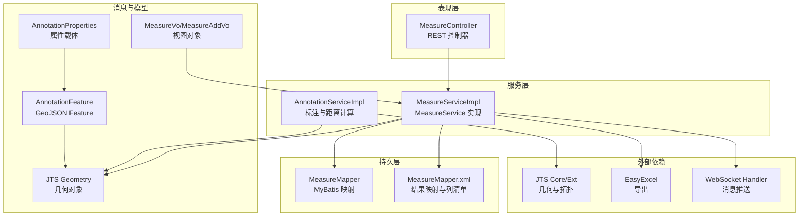
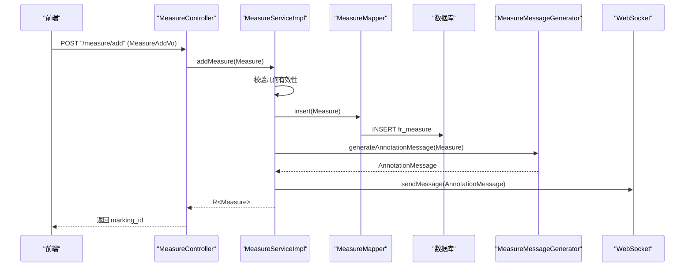
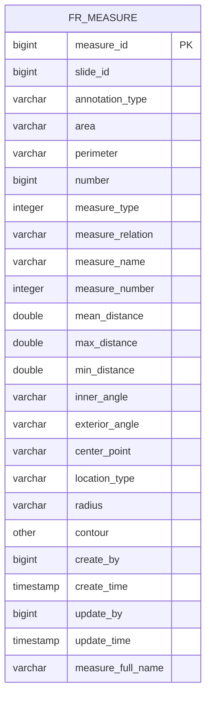
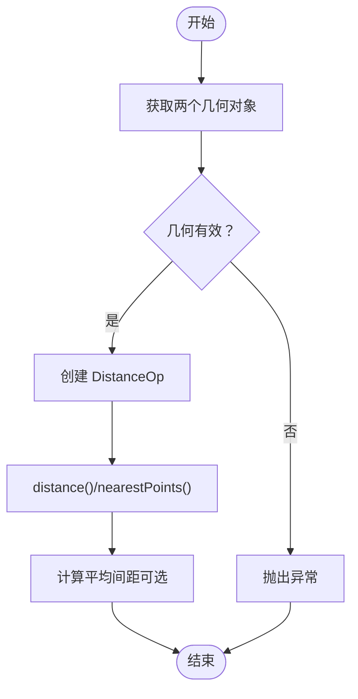
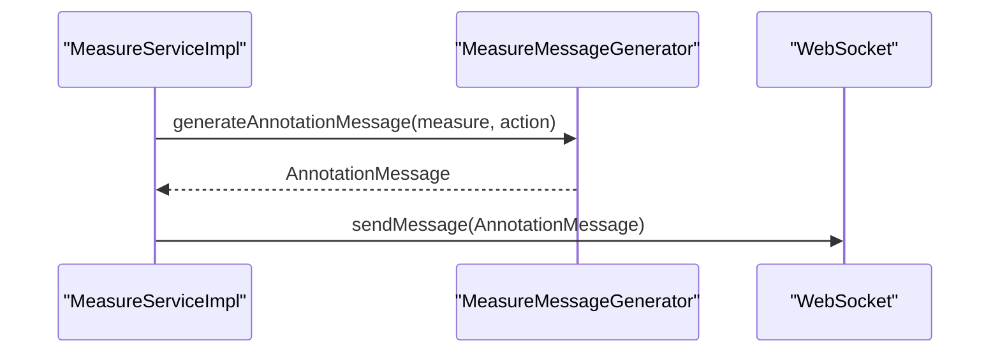
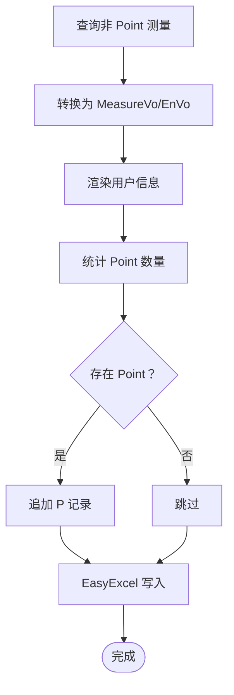
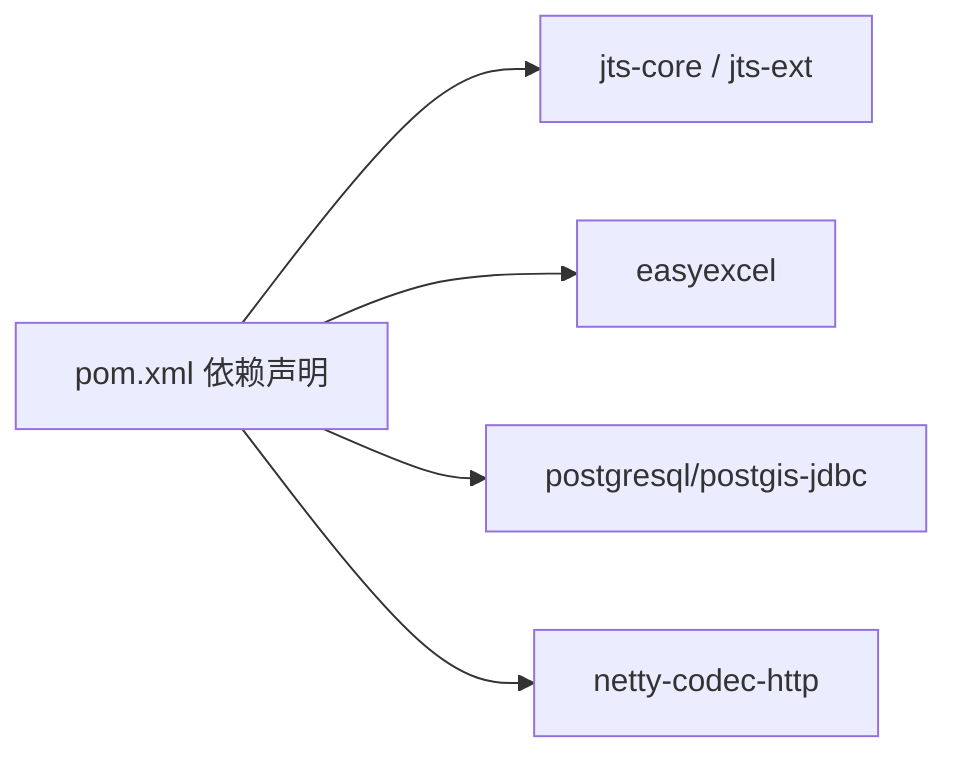

# 几何测量系统

<cite>
**本文引用的文件**
- [Measure.java](file://src/main/java/cn/staitech/annotation/domain/Measure.java)
- [MeasureService.java](file://src/main/java/cn/staitech/annotation/service/MeasureService.java)
- [MeasureServiceImpl.java](file://src/main/java/cn/staitech/annotation/service/impl/MeasureServiceImpl.java)
- [MeasureController.java](file://src/main/java/cn/staitech/annotation/controller/MeasureController.java)
- [MeasureMapper.java](file://src/main/java/cn/staitech/annotation/mapper/MeasureMapper.java)
- [MeasureMapper.xml](file://src/main/resources/mapper/MeasureMapper.xml)
- [MeasureMessageGenerator.java](file://src/main/java/cn/staitech/annotation/utils/measure/MeasureMessageGenerator.java)
- [AnnotationFeature.java](file://src/main/java/cn/staitech/annotation/netty/message/AnnotationFeature.java)
- [AnnotationProperties.java](file://src/main/java/cn/staitech/annotation/netty/message/AnnotationProperties.java)
- [MeasureVo.java](file://src/main/java/cn/staitech/annotation/vo/measure/MeasureVo.java)
- [MeasureAddVo.java](file://src/main/java/cn/staitech/annotation/vo/measure/MeasureAddVo.java)
- [MeasureReq.java](file://src/main/java/cn/staitech/annotation/vo/measure/MeasureReq.java)
- [AnnotationServiceImpl.java](file://src/main/java/cn/staitech/annotation/service/impl/AnnotationServiceImpl.java)
- [pom.xml](file://pom.xml)
</cite>

## 目录
1. [简介](#简介)
2. [项目结构](#项目结构)
3. [核心组件](#核心组件)
4. [架构总览](#架构总览)
5. [详细组件分析](#详细组件分析)
6. [依赖分析](#依赖分析)
7. [性能考虑](#性能考虑)
8. [故障排查指南](#故障排查指南)
9. [结论](#结论)
10. [附录](#附录)

## 简介
本文件面向医学图像标注系统的几何测量子系统，围绕基于 JTS Topology Suite 的几何数据处理与测量能力，系统化阐述几何对象的创建、存储、计算与展示流程；覆盖距离测量、面积/周长计算、坐标系与单位换算、测量实体数据模型、测量 API 接口、可视化与导出、批量处理、精度验证、异常处理与性能优化等主题。文档同时兼顾初学者的几何测量基础概念与开发者的实现细节。

## 项目结构
测量系统采用典型的分层架构：控制器层负责对外暴露 REST API；服务层封装业务逻辑与 JTS 计算；持久层通过 MyBatis 映射数据库；消息与 VO/DTO 负责前后端交互与导出；JTS 提供几何对象与拓扑运算能力。

图表来源
- [MeasureController.java:32-118](file://src/main/java/cn/staitech/annotation/controller/MeasureController.java#L32-L118)
- [MeasureServiceImpl.java:48-161](file://src/main/java/cn/staitech/annotation/service/impl/MeasureServiceImpl.java#L48-L161)
- [MeasureMapper.java:12-14](file://src/main/java/cn/staitech/annotation/mapper/MeasureMapper.java#L12-L14)
- [MeasureMapper.xml:7-43](file://src/main/resources/mapper/MeasureMapper.xml#L7-L43)
- [AnnotationFeature.java:14-33](file://src/main/java/cn/staitech/annotation/netty/message/AnnotationFeature.java#L14-L33)
- [AnnotationProperties.java:12-75](file://src/main/java/cn/staitech/annotation/netty/message/AnnotationProperties.java#L12-L75)
- [MeasureVo.java:34-204](file://src/main/java/cn/staitech/annotation/vo/measure/MeasureVo.java#L34-L204)
- [MeasureAddVo.java:26-174](file://src/main/java/cn/staitech/annotation/vo/measure/MeasureAddVo.java#L26-L174)
- [pom.xml:94-105](file://pom.xml#L94-L105)

章节来源
- [MeasureController.java:32-118](file://src/main/java/cn/staitech/annotation/controller/MeasureController.java#L32-L118)
- [MeasureServiceImpl.java:48-161](file://src/main/java/cn/staitech/annotation/service/impl/MeasureServiceImpl.java#L48-L161)
- [MeasureMapper.java:12-14](file://src/main/java/cn/staitech/annotation/mapper/MeasureMapper.java#L12-L14)
- [MeasureMapper.xml:7-43](file://src/main/resources/mapper/MeasureMapper.xml#L7-L43)
- [AnnotationFeature.java:14-33](file://src/main/java/cn/staitech/annotation/netty/message/AnnotationFeature.java#L14-L33)
- [AnnotationProperties.java:12-75](file://src/main/java/cn/staitech/annotation/netty/message/AnnotationProperties.java#L12-L75)
- [MeasureVo.java:34-204](file://src/main/java/cn/staitech/annotation/vo/measure/MeasureVo.java#L34-L204)
- [MeasureAddVo.java:26-174](file://src/main/java/cn/staitech/annotation/vo/measure/MeasureAddVo.java#L26-L174)
- [pom.xml:94-105](file://pom.xml#L94-L105)

## 核心组件
- 数据模型与持久化
  - 实体类：Measure，承载测量几何轮廓、面积、周长、角度、距离统计、中心点、半径、命名规则等字段，并使用 JTS 的 Geometry 字段存储几何数据。
  - 映射：MeasureMapper 及 XML 结果映射 BaseResultMap 定义了所有字段与数据库列的对应关系，含几何列 contour 的 OTHER 类型映射。
- 服务与业务
  - MeasureService 接口定义新增、删除、导出等能力。
  - MeasureServiceImpl 实现新增校验（几何有效性）、编号序列生成、WebSocket 推送、导出 Excel（中英文）。
- 控制器
  - MeasureController 提供分页查询、GeoJSON 导出、新增、删除、导出等接口。
- 消息与展示
  - MeasureMessageGenerator 将 Measure 转换为 AnnotationFeature/AnnotationProperties，用于 WebSocket 推送与前端渲染。
  - AnnotationFeature/AnnotationProperties 作为 GeoJSON 特征与属性载体。
- 视图对象
  - MeasureVo/MeasureAddVo/MeasureReq 用于接口入参/出参与导出列映射。
- 几何计算
  - AnnotationServiceImpl 中使用 JTS 的 DistanceOp 进行两几何体间最短距离与最近点计算；支持面积/长度计算与采样平均距离等。

章节来源
- [Measure.java:22-154](file://src/main/java/cn/staitech/annotation/domain/Measure.java#L22-L154)
- [MeasureMapper.java:12-14](file://src/main/java/cn/staitech/annotation/mapper/MeasureMapper.java#L12-L14)
- [MeasureMapper.xml:7-43](file://src/main/resources/mapper/MeasureMapper.xml#L7-L43)
- [MeasureService.java:13-21](file://src/main/java/cn/staitech/annotation/service/MeasureService.java#L13-L21)
- [MeasureServiceImpl.java:48-161](file://src/main/java/cn/staitech/annotation/service/impl/MeasureServiceImpl.java#L48-L161)
- [MeasureController.java:32-118](file://src/main/java/cn/staitech/annotation/controller/MeasureController.java#L32-L118)
- [MeasureMessageGenerator.java:28-126](file://src/main/java/cn/staitech/annotation/utils/measure/MeasureMessageGenerator.java#L28-L126)
- [AnnotationFeature.java:14-33](file://src/main/java/cn/staitech/annotation/netty/message/AnnotationFeature.java#L14-L33)
- [AnnotationProperties.java:12-75](file://src/main/java/cn/staitech/annotation/netty/message/AnnotationProperties.java#L12-L75)
- [MeasureVo.java:34-204](file://src/main/java/cn/staitech/annotation/vo/measure/MeasureVo.java#L34-L204)
- [MeasureAddVo.java:26-174](file://src/main/java/cn/staitech/annotation/vo/measure/MeasureAddVo.java#L26-L174)
- [AnnotationServiceImpl.java:68-83](file://src/main/java/cn/staitech/annotation/service/impl/AnnotationServiceImpl.java#L68-L83)

## 架构总览
系统以“控制器-服务-持久层”为核心，结合 JTS 几何对象与 MyBatis 持久化，通过消息生成器将几何与属性组装为 GeoJSON 特征并通过 WebSocket 推送至前端；导出功能使用 EasyExcel 输出中英文报表。

图表来源
- [MeasureController.java:82-93](file://src/main/java/cn/staitech/annotation/controller/MeasureController.java#L82-L93)
- [MeasureServiceImpl.java:59-81](file://src/main/java/cn/staitech/annotation/service/impl/MeasureServiceImpl.java#L59-L81)
- [MeasureMapper.java:12-14](file://src/main/java/cn/staitech/annotation/mapper/MeasureMapper.java#L12-L14)
- [MeasureMessageGenerator.java:29-38](file://src/main/java/cn/staitech/annotation/utils/measure/MeasureMessageGenerator.java#L29-L38)

## 详细组件分析

### 数据模型与几何存储
- 字段设计要点
  - 几何轮廓：contour 使用 JTS Geometry 存储，数据库映射为 OTHER 类型。
  - 几何类型：locationType 表示 LineString、Polygon、Point 等类型字符串。
  - 统计指标：area/perimeter、meanDistance/maxDistance/minDistance、innerAngle/exteriorAngle、centerPoint、radius 等。
  - 命名规则：measureName + number 组成 measureFullName，用于前端展示与排序。
- 关系与约束
  - slideId 作为切片标识，贯穿查询与导出。
  - createBy/updateBy 与时间字段用于审计与导出用户信息渲染。

图表来源
- [MeasureMapper.xml:7-43](file://src/main/resources/mapper/MeasureMapper.xml#L7-L43)

章节来源
- [Measure.java:22-154](file://src/main/java/cn/staitech/annotation/domain/Measure.java#L22-L154)
- [MeasureMapper.xml:7-43](file://src/main/resources/mapper/MeasureMapper.xml#L7-L43)

### 几何对象创建与计算
- 几何对象来源
  - 前端绘制或 AI 生成的几何，经控制器转换为 Measure 后入库。
- JTS 计算能力
  - 最短距离与最近点：使用 DistanceOp.distance() 与 nearestPoints()。
  - 面积/长度：直接调用几何对象的面积与长度方法（在标注服务中已有应用）。
  - 平均间距：通过采样点对计算平均欧氏距离（在标注服务中实现）。
- 精度与坐标系
  - 系统未内置坐标系转换逻辑，建议在几何入库前完成投影/坐标系统一；导出时可按需进行单位换算（如像素到微米）。

图表来源
- [AnnotationServiceImpl.java:141-167](file://src/main/java/cn/staitech/annotation/service/impl/AnnotationServiceImpl.java#L141-L167)

章节来源
- [AnnotationServiceImpl.java:68-83](file://src/main/java/cn/staitech/annotation/service/impl/AnnotationServiceImpl.java#L68-L83)
- [AnnotationServiceImpl.java:141-167](file://src/main/java/cn/staitech/annotation/service/impl/AnnotationServiceImpl.java#L141-L167)

### API 接口文档
- 分页查询
  - 方法：POST /measure/page
  - 入参：MeasureReq（slideId、measureFullName）
  - 出参：CustomPage<MeasureVo>，包含普通测量与点计数（当存在 Point 类型时追加一条记录）
- GeoJSON 数据获取
  - 方法：GET /measure/getDataList?slideId=...
  - 出参：List<AnnotationFeature>，每个元素包含 geometry 与 properties
- 新增测量
  - 方法：POST /measure/add
  - 入参：MeasureAddVo（包含 slideId、locationType、geometry、统计字段等）
  - 出参：R<String>（返回 marking_id）
- 删除测量
  - 方法：POST /measure/del
  - 入参：DelMeasureReq（marking_id）
  - 出参：R<String>
- 导出测量
  - 方法：POST /measure/export
  - 入参：ExportSlideReq（slideId）
  - 出参：HTTP 下载 Excel（中/英两种模板）

章节来源
- [MeasureController.java:41-108](file://src/main/java/cn/staitech/annotation/controller/MeasureController.java#L41-L108)
- [MeasureReq.java:16-24](file://src/main/java/cn/staitech/annotation/vo/measure/MeasureReq.java#L16-L24)
- [MeasureAddVo.java:26-174](file://src/main/java/cn/staitech/annotation/vo/measure/MeasureAddVo.java#L26-L174)

### 可视化与消息推送
- 消息生成
  - 将 Measure 转换为 AnnotationFeature，geometry 为 JTS Geometry，properties 包含面积、周长、距离、角度、命名等。
- 推送机制
  - 通过 WebSocket Handler 将 AnnotationMessage 发送给前端，实现测量的实时同步。

图表来源
- [MeasureServiceImpl.java:79-80](file://src/main/java/cn/staitech/annotation/service/impl/MeasureServiceImpl.java#L79-L80)
- [MeasureMessageGenerator.java:29-38](file://src/main/java/cn/staitech/annotation/utils/measure/MeasureMessageGenerator.java#L29-L38)

章节来源
- [MeasureMessageGenerator.java:28-126](file://src/main/java/cn/staitech/annotation/utils/measure/MeasureMessageGenerator.java#L28-L126)
- [AnnotationFeature.java:14-33](file://src/main/java/cn/staitech/annotation/netty/message/AnnotationFeature.java#L14-L33)
- [AnnotationProperties.java:12-75](file://src/main/java/cn/staitech/annotation/netty/message/AnnotationProperties.java#L12-L75)

### 数据导出与批量处理
- 导出策略
  - 查询非 Point 类型测量，转为 MeasureVo/MeasureEnVo，渲染创建者姓名后写入 Excel。
  - 若存在 Point 类型，单独统计数量并在结果中追加一条记录（名称标记为 P）。
- 批量处理
  - 分页查询与导出天然支持大批量数据的分批处理。

图表来源
- [MeasureServiceImpl.java:98-128](file://src/main/java/cn/staitech/annotation/service/impl/MeasureServiceImpl.java#L98-L128)

章节来源
- [MeasureServiceImpl.java:98-155](file://src/main/java/cn/staitech/annotation/service/impl/MeasureServiceImpl.java#L98-L155)

### 异常处理与精度控制
- 参数校验
  - 新增时校验请求与几何有效性；删除时校验主键与是否存在。
- 异常消息
  - 使用 MessageSource 国际化提示（如参数无效、无标注数据、计算失败等）。
- 精度控制
  - 属性格式化使用 DecimalFormat 保证数值显示一致性；几何计算依赖 JTS 默认精度，必要时可在入库前进行坐标归一化或裁剪。

章节来源
- [MeasureServiceImpl.java:61-96](file://src/main/java/cn/staitech/annotation/service/impl/MeasureServiceImpl.java#L61-L96)
- [MeasureMessageGenerator.java:99-105](file://src/main/java/cn/staitech/annotation/utils/measure/MeasureMessageGenerator.java#L99-L105)

## 依赖分析
- JTS 依赖
  - jts-core 与本地 jts-ext 依赖被引入，用于几何对象与扩展能力。
- 导出与消息
  - EasyExcel 用于导出；Netty 用于 WebSocket。
- 数据库与 JDBC
  - PostgreSQL 与 PostGIS JDBC 用于地理空间数据存储与查询。

图表来源
- [pom.xml:94-110](file://pom.xml#L94-L110)
- [pom.xml:113-122](file://pom.xml#L113-L122)
- [pom.xml:82-85](file://pom.xml#L82-L85)

章节来源
- [pom.xml:94-133](file://pom.xml#L94-L133)

## 性能考虑
- 几何复杂度
  - 复杂 Polygon/LineString 的 DistanceOp 计算成本较高，建议在入库前进行简化或抽稀。
- 批处理与分页
  - 导出与分页查询采用分页策略，避免一次性加载全部数据。
- 缓存与去重
  - 用户信息渲染可缓存 SysUser 列表，减少远程调用次数。
- I/O 优化
  - Excel 写入使用流式输出，降低内存占用。

## 故障排查指南
- 常见错误与定位
  - 参数无效：检查 MeasureAddVo 与请求体 JSON 结构。
  - 无标注数据：确认 slideId 与几何类型匹配。
  - 计算失败：检查几何有效性与最近点获取结果。
- 日志与审计
  - 控制器使用日志审计注解，便于追踪操作行为。
- 单元测试与集成测试
  - 建议针对导出、消息生成、几何计算等关键路径编写测试用例。

章节来源
- [MeasureController.java:82-108](file://src/main/java/cn/staitech/annotation/controller/MeasureController.java#L82-L108)
- [MeasureServiceImpl.java:61-96](file://src/main/java/cn/staitech/annotation/service/impl/MeasureServiceImpl.java#L61-L96)
- [AnnotationServiceImpl.java:141-167](file://src/main/java/cn/staitech/annotation/service/impl/AnnotationServiceImpl.java#L141-L167)

## 结论
该几何测量系统以 JTS 为核心，结合分层架构实现了从几何创建、存储、计算到可视化与导出的完整闭环。通过清晰的数据模型、完善的 API 与消息推送机制，满足医学图像标注场景下的测量需求。后续可在坐标系转换、几何简化、精度控制与性能优化方面进一步增强。

## 附录
- 基础概念
  - 几何类型：Point、LineString、Polygon 等，分别用于点位标注、线性测量与面域测量。
  - 距离与面积：基于 JTS 的几何对象直接计算；平均间距可通过采样点对实现。
  - 单位换算：建议在前端或预处理阶段完成像素到实际长度/面积的换算。
- 开发建议
  - 在入库前统一坐标系与单位，确保跨切片与跨设备的一致性。
  - 对复杂几何进行预处理（简化、抽稀），提升计算与渲染性能。
  - 为关键计算增加容错与降级策略，保障系统稳定性。