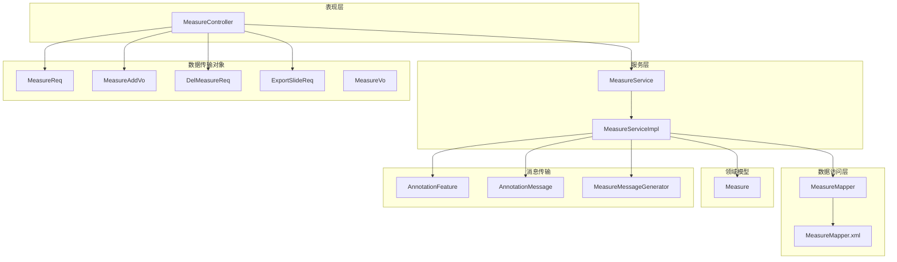
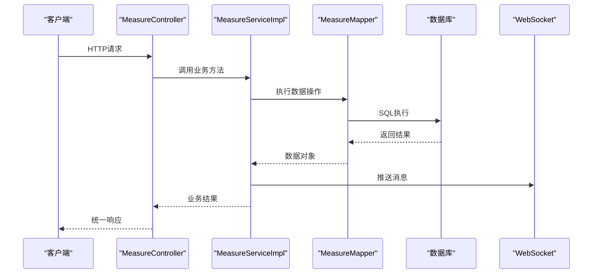
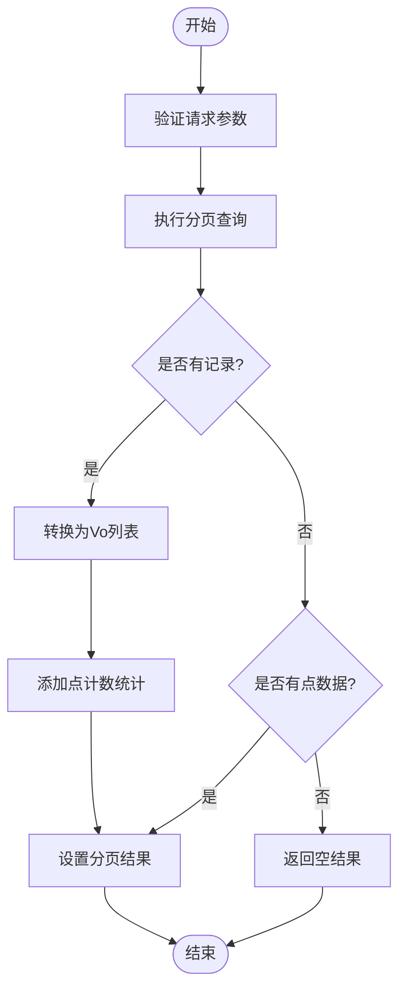
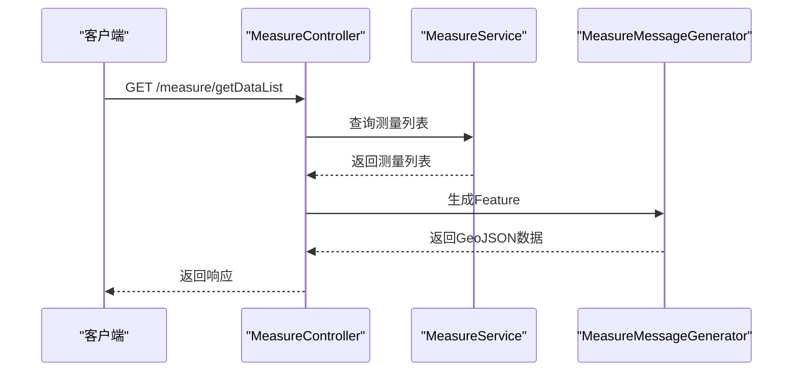
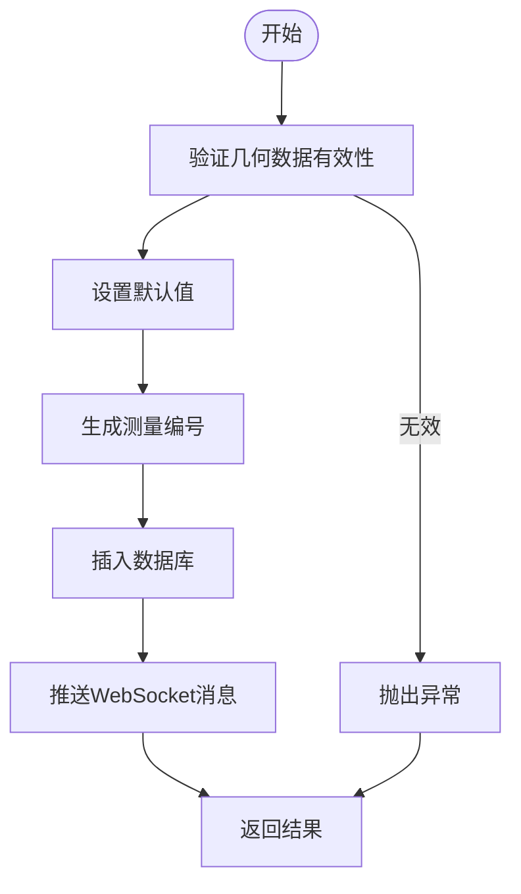
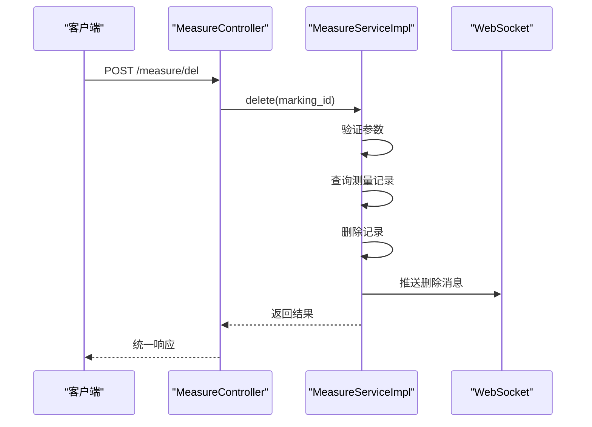
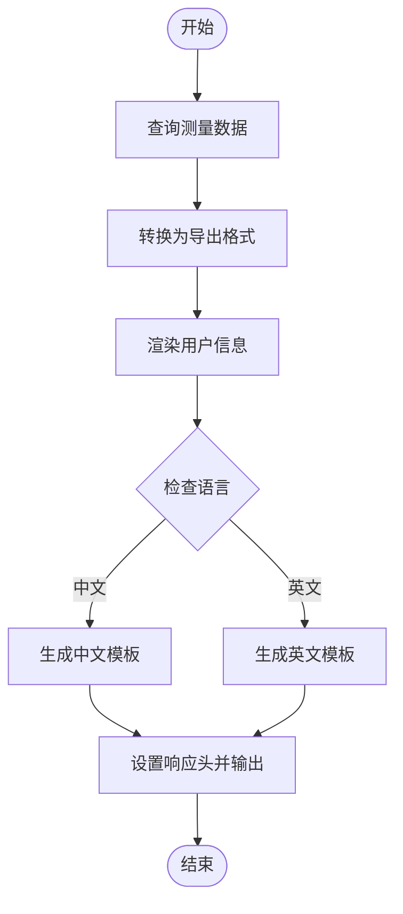
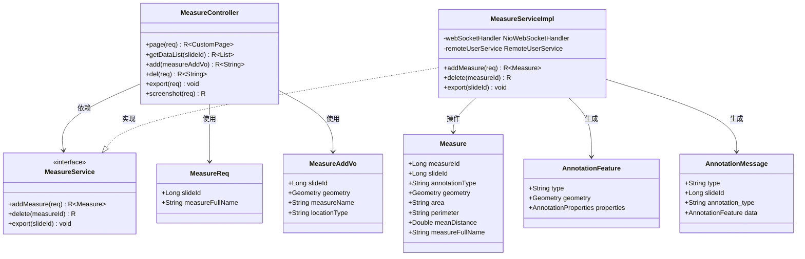
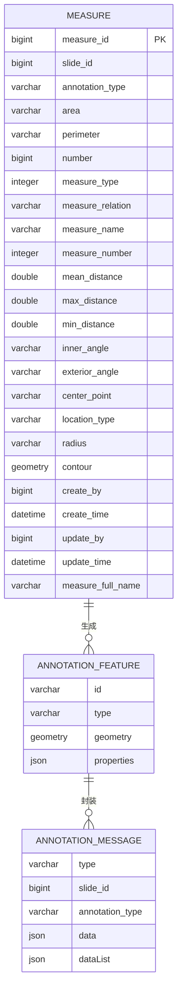
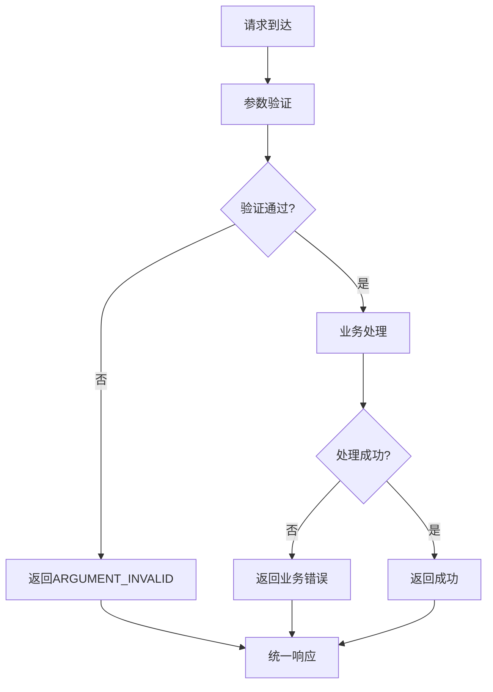

# 测量API接口

<cite>
**本文档引用的文件**
- [MeasureController.java](file://src/main/java/cn/staitech/annotation/controller/MeasureController.java)
- [MeasureService.java](file://src/main/java/cn/staitech/annotation/service/MeasureService.java)
- [MeasureServiceImpl.java](file://src/main/java/cn/staitech/annotation/service/impl/MeasureServiceImpl.java)
- [Measure.java](file://src/main/java/cn/staitech/annotation/domain/Measure.java)
- [MeasureMapper.java](file://src/main/java/cn/staitech/annotation/mapper/MeasureMapper.java)
- [MeasureMapper.xml](file://src/main/resources/mapper/MeasureMapper.xml)
- [MeasureReq.java](file://src/main/java/cn/staitech/annotation/vo/measure/MeasureReq.java)
- [MeasureVo.java](file://src/main/java/cn/staitech/annotation/vo/measure/MeasureVo.java)
- [MeasureAddVo.java](file://src/main/java/cn/staitech/annotation/vo/measure/MeasureAddVo.java)
- [DelMeasureReq.java](file://src/main/java/cn/staitech/annotation/vo/measure/DelMeasureReq.java)
- [ExportSlideReq.java](file://src/main/java/cn/staitech/annotation/vo/measure/ExportSlideReq.java)
- [Constant.java](file://src/main/java/cn/staitech/annotation/constant/Constant.java)
- [MeasureMessageGenerator.java](file://src/main/java/cn/staitech/annotation/utils/measure/MeasureMessageGenerator.java)
- [AnnotationFeature.java](file://src/main/java/cn/staitech/annotation/netty/message/AnnotationFeature.java)
- [AnnotationMessage.java](file://src/main/java/cn/staitech/annotation/netty/message/AnnotationMessage.java)
- [README.md](file://README.md)
</cite>

## 目录
1. [简介](#简介)
2. [项目结构](#项目结构)
3. [核心组件](#核心组件)
4. [架构概览](#架构概览)
5. [详细接口分析](#详细接口分析)
6. [依赖关系分析](#依赖关系分析)
7. [性能考虑](#性能考虑)
8. [故障排除指南](#故障排除指南)
9. [结论](#结论)
10. [附录](#附录)

## 简介
本文件为测量API接口的完整技术文档，涵盖测量相关的RESTful API接口设计与实现细节。该系统基于Spring Boot框架，采用MyBatis-Plus进行数据持久化，支持测量数据的分页查询、GeoJSON数据获取、新增、删除以及Excel导出等功能。接口遵循RESTful风格，提供统一的响应格式，并通过WebSocket推送实时消息。

## 项目结构
项目采用标准的MVC分层架构，主要模块包括控制器层、服务层、数据访问层、领域模型、VO类、工具类和Netty消息传输组件。



**图表来源**
- [MeasureController.java:1-118](file://src/main/java/cn/staitech/annotation/controller/MeasureController.java#L1-L118)
- [MeasureServiceImpl.java:1-161](file://src/main/java/cn/staitech/annotation/service/impl/MeasureServiceImpl.java#L1-L161)
- [MeasureMapper.java:1-19](file://src/main/java/cn/staitech/annotation/mapper/MeasureMapper.java#L1-L19)
- [MeasureMapper.xml:1-45](file://src/main/resources/mapper/MeasureMapper.xml#L1-L45)

**章节来源**
- [MeasureController.java:1-118](file://src/main/java/cn/staitech/annotation/controller/MeasureController.java#L1-L118)
- [MeasureServiceImpl.java:1-161](file://src/main/java/cn/staitech/annotation/service/impl/MeasureServiceImpl.java#L1-L161)

## 核心组件
本节详细介绍测量API的核心组件及其职责分工：

### 控制器层
- **MeasureController**: 提供测量相关的RESTful API接口，包括分页查询、GeoJSON数据获取、新增、删除、导出等功能
- 采用Swagger注解提供API文档元数据
- 使用统一响应包装类R<T>返回结果

### 服务层
- **MeasureService**: 定义测量业务接口，包括新增、删除、导出等核心业务方法
- **MeasureServiceImpl**: 实现具体的业务逻辑，包含事务管理、数据校验、WebSocket消息推送

### 数据访问层
- **MeasureMapper**: 继承MyBatis-Plus基础Mapper，提供通用的数据访问方法
- **MeasureMapper.xml**: 定义数据库映射关系和SQL语句

### 领域模型
- **Measure**: 测量数据实体类，包含几何图形字段和各种测量属性
- 支持JTS Geometry类型，用于存储GeoJSON几何数据

**章节来源**
- [MeasureController.java:32-36](file://src/main/java/cn/staitech/annotation/controller/MeasureController.java#L32-L36)
- [MeasureService.java:13-21](file://src/main/java/cn/staitech/annotation/service/MeasureService.java#L13-L21)
- [MeasureServiceImpl.java:48-50](file://src/main/java/cn/staitech/annotation/service/impl/MeasureServiceImpl.java#L48-L50)

## 架构概览
系统采用分层架构设计，各层职责清晰分离，通过依赖注入实现松耦合。



**图表来源**
- [MeasureController.java:84-93](file://src/main/java/cn/staitech/annotation/controller/MeasureController.java#L84-L93)
- [MeasureServiceImpl.java:79-80](file://src/main/java/cn/staitech/annotation/service/impl/MeasureServiceImpl.java#L79-L80)

## 详细接口分析

### 接口总览
系统提供以下测量相关API接口：

| 接口名称 | 方法 | 路径 | 功能描述 |
|---------|------|------|----------|
| 获取测量分页 | POST | /measure/page | 分页查询测量数据 |
| 获取GeoJSON数据 | GET | /measure/getDataList | 获取切片的GeoJSON数据 |
| 添加测量 | POST | /measure/add | 新增测量数据 |
| 删除测量 | POST | /measure/del | 删除指定测量 |
| 导出测量 | POST | /measure/export | 导出测量数据为Excel |
| 截图 | POST | /measure/screenshot | 截图功能 |

### 获取测量分页接口
**接口地址**: POST `/measure/page`

**请求参数**:
- Content-Type: application/json
- 请求体: MeasureReq对象

**MeasureReq参数说明**:
- slideId (Long, 必填): 切片ID
- measureFullName (String): 测量名称过滤条件
- 继承自PageRequest的分页参数

**响应格式**:
```json
{
  "code": 200,
  "msg": "操作成功",
  "data": {
    "records": [
      {
        "measure_full_name": "测量名称",
        "point_count": 5,
        "marking_id": 123456789,
        "area": "100.50",
        "perimeter": "45.20",
        "mean_distance": 12.34,
        "min_distance": 8.90,
        "max_distance": 15.67,
        "inner_angle": "85.50",
        "exterior_angle": "95.20",
        "create_time": "2025-05-21 14:30:00"
      }
    ],
    "total": 10,
    "size": 10,
    "current": 1
  }
}
```

**业务逻辑**:
1. 参数验证：确保slideId非空
2. 分页查询：根据slideId和可选的测量名称进行分页查询
3. 特殊处理：统计点状测量的数量并添加到结果中
4. 结果转换：将Domain对象转换为Vo对象

**调用流程**:


**图表来源**
- [MeasureController.java:41-68](file://src/main/java/cn/staitech/annotation/controller/MeasureController.java#L41-L68)

**错误处理**:
- ARGUMENT_INVALID: 参数验证失败
- 无数据时返回空列表而非错误

**章节来源**
- [MeasureController.java:41-68](file://src/main/java/cn/staitech/annotation/controller/MeasureController.java#L41-L68)
- [MeasureReq.java:15-24](file://src/main/java/cn/staitech/annotation/vo/measure/MeasureReq.java#L15-L24)

### 获取GeoJSON数据接口
**接口地址**: GET `/measure/getDataList`

**请求参数**:
- slideId (Long, 必填): 切片ID

**响应格式**:
```json
{
  "code": 200,
  "msg": "操作成功",
  "data": [
    {
      "type": "Feature",
      "geometry": {
        "type": "Polygon",
        "coordinates": [[...]]
      },
      "properties": {
        "a0": "123456789",
        "a1": "Polygon",
        "a2": "Measure",
        "a6": "100.50",
        "a7": "45.20",
        "a12": "2025-05-21 14:30:00",
        "a15": "95.20",
        "a16": "85.50",
        "a17": "5.00",
        "a18": "15.67",
        "a19": "12.34",
        "a20": "8.90",
        "a21": "测量名称",
        "a22": 1,
        "a23": "关系描述",
        "a24": 0,
        "a25": "测量名称1"
      }
    }
  ]
}
```

**业务逻辑**:
1. 查询指定切片的所有测量数据
2. 将每个测量项转换为GeoJSON Feature格式
3. 使用MeasureMessageGenerator生成AnnotationFeature对象

**调用流程**:


**图表来源**
- [MeasureController.java:70-79](file://src/main/java/cn/staitech/annotation/controller/MeasureController.java#L70-L79)
- [MeasureMessageGenerator.java:40-54](file://src/main/java/cn/staitech/annotation/utils/measure/MeasureMessageGenerator.java#L40-L54)

**章节来源**
- [MeasureController.java:70-79](file://src/main/java/cn/staitech/annotation/controller/MeasureController.java#L70-L79)
- [MeasureMessageGenerator.java:28-54](file://src/main/java/cn/staitech/annotation/utils/measure/MeasureMessageGenerator.java#L28-L54)

### 添加测量接口
**接口地址**: POST `/measure/add`

**请求参数**:
- Content-Type: application/json
- 请求体: MeasureAddVo对象

**MeasureAddVo参数说明**:
- slide_id (Long, 必填): 切片ID
- annotation_type (String): 标注类型，默认"Measure"
- area (String): 面积
- perimeter (String): 周长
- number (Long): 序号
- measure_type (Integer): 测量类型
- measure_relation (String): 测量关系
- measure_name (String): 测量名称
- measure_number (Integer): 测量编号
- mean_distance (Double): 平均距离
- max_distance (Double): 最大距离
- min_distance (Double): 最小距离
- inner_angle (String): 内角
- exterior_angle (String): 外角
- center_point (String): 中心点
- location_type (String): 位置类型
- radius (String): 半径
- geometry (Geometry): 几何数据
- 其他字段: create_time, update_time等

**响应格式**:
```json
{
  "code": 200,
  "msg": "操作成功",
  "data": "123456789"
}
```

**业务逻辑**:
1. 参数校验：确保请求对象和几何数据有效
2. 设置默认值：标注类型设为"Measure"
3. 编号生成：根据同名测量项自动生成序号
4. 数据插入：保存到数据库
5. 消息推送：通过WebSocket推送新增消息

**调用流程**:


**图表来源**
- [MeasureServiceImpl.java:59-81](file://src/main/java/cn/staitech/annotation/service/impl/MeasureServiceImpl.java#L59-L81)

**错误处理**:
- ARGUMENT_INVALID: 几何数据为空或无效
- NO_ANNOTATION_DATA: 无法找到对应的测量数据

**章节来源**
- [MeasureServiceImpl.java:59-81](file://src/main/java/cn/staitech/annotation/service/impl/MeasureServiceImpl.java#L59-L81)
- [MeasureAddVo.java:26-173](file://src/main/java/cn/staitech/annotation/vo/measure/MeasureAddVo.java#L26-L173)

### 删除测量接口
**接口地址**: POST `/measure/del`

**请求参数**:
- Content-Type: application/json
- 请求体: DelMeasureReq对象

**DelMeasureReq参数说明**:
- marking_id (Long, 必填): 测量ID

**响应格式**:
```json
{
  "code": 200,
  "msg": "操作成功",
  "data": null
}
```

**业务逻辑**:
1. 参数验证：确保测量ID存在
2. 数据查询：获取要删除的测量记录
3. 删除操作：从数据库中删除
4. 消息推送：通过WebSocket推送删除消息

**调用流程**:


**图表来源**
- [MeasureController.java:95-100](file://src/main/java/cn/staitech/annotation/controller/MeasureController.java#L95-L100)
- [MeasureServiceImpl.java:83-96](file://src/main/java/cn/staitech/annotation/service/impl/MeasureServiceImpl.java#L83-L96)

**错误处理**:
- ARGUMENT_INVALID: 测量ID为空
- NO_ANNOTATION_DATA: 未找到对应测量数据

**章节来源**
- [MeasureController.java:95-100](file://src/main/java/cn/staitech/annotation/controller/MeasureController.java#L95-L100)
- [DelMeasureReq.java:7-9](file://src/main/java/cn/staitech/annotation/vo/measure/DelMeasureReq.java#L7-L9)

### 导出测量接口
**接口地址**: POST `/measure/export`

**请求参数**:
- Content-Type: application/json
- 请求体: ExportSlideReq对象

**ExportSlideReq参数说明**:
- slideId (Long, 必填): 切片ID

**响应格式**:
- 直接输出Excel文件流

**业务逻辑**:
1. 查询指定切片的测量数据（排除点状数据）
2. 转换为导出格式：支持中英文两种格式
3. 用户信息渲染：获取创建者用户名
4. Excel生成：使用EasyExcel生成文件
5. 文件下载：设置HTTP响应头并输出文件流

**调用流程**:


**图表来源**
- [MeasureServiceImpl.java:98-128](file://src/main/java/cn/staitech/annotation/service/impl/MeasureServiceImpl.java#L98-L128)

**错误处理**:
- 无特定异常处理，直接抛出业务异常

**章节来源**
- [MeasureServiceImpl.java:98-128](file://src/main/java/cn/staitech/annotation/service/impl/MeasureServiceImpl.java#L98-L128)
- [ExportSlideReq.java:7-9](file://src/main/java/cn/staitech/annotation/vo/measure/ExportSlideReq.java#L7-L9)

### 截图接口
**接口地址**: POST `/measure/screenshot`

**请求参数**:
- Content-Type: application/json
- 请求体: ScreenshotReq对象

**响应格式**:
```json
{
  "code": 200,
  "msg": "操作成功",
  "data": {}
}
```

**业务逻辑**:
- 当前实现为空操作，仅返回成功响应

**章节来源**
- [MeasureController.java:111-116](file://src/main/java/cn/staitech/annotation/controller/MeasureController.java#L111-L116)

## 依赖关系分析

### 类关系图


**图表来源**
- [MeasureController.java:38-117](file://src/main/java/cn/staitech/annotation/controller/MeasureController.java#L38-L117)
- [MeasureService.java:13-21](file://src/main/java/cn/staitech/annotation/service/MeasureService.java#L13-L21)
- [MeasureServiceImpl.java:49-155](file://src/main/java/cn/staitech/annotation/service/impl/MeasureServiceImpl.java#L49-L155)
- [Measure.java:22-256](file://src/main/java/cn/staitech/annotation/domain/Measure.java#L22-L256)

### 数据模型关系


**图表来源**
- [MeasureMapper.xml:7-32](file://src/main/resources/mapper/MeasureMapper.xml#L7-L32)
- [AnnotationFeature.java:14-32](file://src/main/java/cn/staitech/annotation/netty/message/AnnotationFeature.java#L14-L32)
- [AnnotationMessage.java:14-27](file://src/main/java/cn/staitech/annotation/netty/message/AnnotationMessage.java#L14-L27)

**章节来源**
- [MeasureMapper.xml:1-45](file://src/main/resources/mapper/MeasureMapper.xml#L1-L45)
- [AnnotationFeature.java:1-33](file://src/main/java/cn/staitech/annotation/netty/message/AnnotationFeature.java#L1-L33)
- [AnnotationMessage.java:1-28](file://src/main/java/cn/staitech/annotation/netty/message/AnnotationMessage.java#L1-L28)

## 性能考虑

### 数据库性能
- **索引优化**: 建议在`slide_id`和`measure_full_name`字段上建立索引以提升查询性能
- **分页查询**: 使用MyBatis-Plus的分页插件，避免全表扫描
- **几何数据**: JTS Geometry类型可能影响查询性能，建议对常用查询条件建立适当的索引

### 缓存策略
- **用户信息缓存**: 远程用户查询结果可以考虑缓存，减少远程调用次数
- **热点数据缓存**: 对频繁访问的测量数据可以考虑本地缓存

### 并发控制
- **事务管理**: 关键业务操作使用@Transactional注解确保数据一致性
- **线程安全**: WebSocket消息推送使用单例模式，注意线程安全问题

### 频率限制
- 当前代码未实现API频率限制，建议在网关层或控制器层添加限流机制
- 可考虑基于IP、用户ID或API维度的限流策略

### 数据量限制
- **导出限制**: Excel导出功能可能受到内存限制，建议对大数据量进行分批处理
- **几何数据**: 大型几何对象可能影响序列化性能，建议进行数据压缩或简化

## 故障排除指南

### 常见错误码
系统使用统一的响应格式，包含以下错误场景：

**参数验证错误**:
- ARGUMENT_INVALID: 参数验证失败
- 适用场景: 缺少必填参数、参数格式错误

**业务逻辑错误**:
- NO_ANNOTATION_DATA: 未找到对应的标注数据
- 适用场景: 删除操作时目标不存在

**系统异常**:
- 未捕获的业务异常会返回相应的错误信息

### 错误处理机制


**图表来源**
- [MeasureServiceImpl.java:63-65](file://src/main/java/cn/staitech/annotation/service/impl/MeasureServiceImpl.java#L63-L65)
- [MeasureServiceImpl.java:86-92](file://src/main/java/cn/staitech/annotation/service/impl/MeasureServiceImpl.java#L86-L92)

### 调试建议
1. **日志监控**: 启用详细日志记录，特别是业务异常和性能瓶颈
2. **数据库监控**: 监控慢查询和高负载SQL
3. **内存监控**: 监控WebSocket连接和内存使用情况
4. **网络监控**: 监控API响应时间和错误率

**章节来源**
- [MeasureServiceImpl.java:63-65](file://src/main/java/cn/staitech/annotation/service/impl/MeasureServiceImpl.java#L63-L65)
- [MeasureServiceImpl.java:86-92](file://src/main/java/cn/staitech/annotation/service/impl/MeasureServiceImpl.java#L86-L92)

## 结论
本测量API接口设计合理，实现了完整的测量数据生命周期管理。系统采用分层架构，职责清晰，扩展性强。主要优势包括：

1. **完整的功能覆盖**: 包含测量数据的增删改查、导出和实时消息推送
2. **标准化的响应格式**: 统一的R<T>响应包装，便于客户端处理
3. **良好的扩展性**: 基于接口的设计便于功能扩展和替换
4. **实时通信**: 通过WebSocket实现实时数据同步

建议后续改进方向：
- 添加API频率限制和安全认证
- 优化大数据量场景下的性能
- 增加更完善的错误码体系
- 添加单元测试和集成测试

## 附录

### 接口版本管理
当前项目未显示明确的版本管理机制。建议采用以下策略：
- **URL版本化**: 在API路径中包含版本号，如`/api/v1/measure/`
- **Header版本化**: 通过Accept头部指定版本
- **向后兼容**: 保持现有接口不变，新增接口时采用新版本号

### 安全考虑
- **输入验证**: 已实现基本的参数验证，建议增加更严格的输入过滤
- **权限控制**: 建议添加基于角色的访问控制
- **SQL注入防护**: 已使用MyBatis-Plus，建议定期更新依赖版本

### 集成最佳实践
1. **错误处理**: 始终检查响应码和错误信息
2. **重试机制**: 对网络异常实现指数退避重试
3. **超时设置**: 为每个请求设置合理的超时时间
4. **批量操作**: 对大量数据操作建议使用批量接口

**章节来源**
- [README.md:1-95](file://README.md#L1-L95)