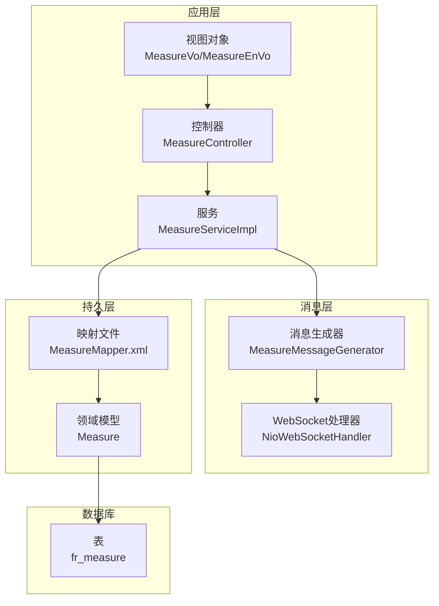
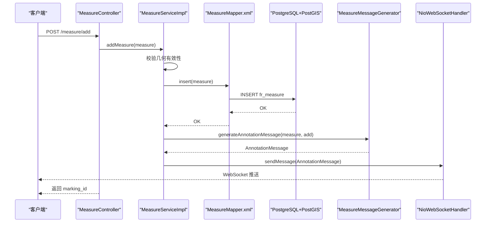
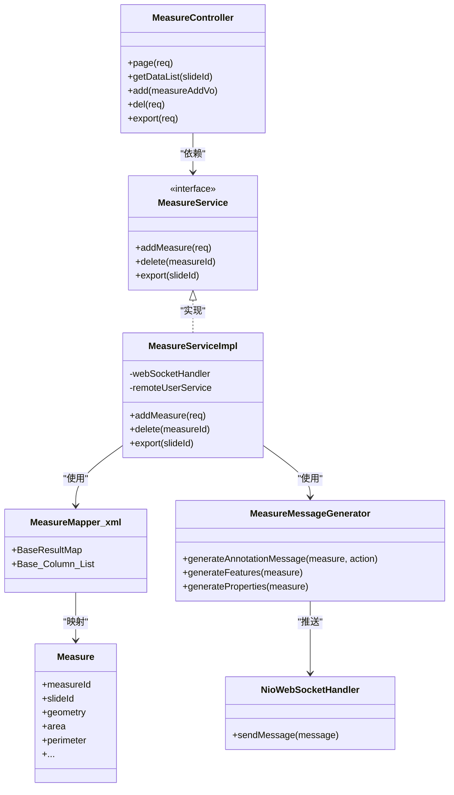

# 测量数据模型

<cite>
**本文引用的文件**
- [Measure.java](file://src/main/java/cn/staitech/annotation/domain/Measure.java)
- [MeasureMapper.xml](file://src/main/resources/mapper/MeasureMapper.xml)
- [MeasureService.java](file://src/main/java/cn/staitech/annotation/service/MeasureService.java)
- [MeasureServiceImpl.java](file://src/main/java/cn/staitech/annotation/service/impl/MeasureServiceImpl.java)
- [MeasureController.java](file://src/main/java/cn/staitech/annotation/controller/MeasureController.java)
- [MeasureVo.java](file://src/main/java/cn/staitech/annotation/vo/measure/MeasureVo.java)
- [MeasureEnVo.java](file://src/main/java/cn/staitech/annotation/vo/measure/MeasureEnVo.java)
- [MeasureMessageGenerator.java](file://src/main/java/cn/staitech/annotation/utils/measure/MeasureMessageGenerator.java)
- [AnnotationMessage.java](file://src/main/java/cn/staitech/annotation/netty/message/AnnotationMessage.java)
- [NioWebSocketHandler.java](file://src/main/java/cn/staitech/annotation/netty/websocket/NioWebSocketHandler.java)
- [WebsocketController.java](file://src/main/java/cn/staitech/annotation/controller/WebsocketController.java)
- [update_pg_v2.6.0.sql](file://sql/update_pg_v2.6.0.sql)
- [Constant.java](file://src/main/java/cn/staitech/annotation/constant/Constant.java)
- [Annotation.java](file://src/main/java/cn/staitech/annotation/domain/Annotation.java)
</cite>

## 目录
1. [简介](#简介)
2. [项目结构](#项目结构)
3. [核心组件](#核心组件)
4. [架构总览](#架构总览)
5. [详细组件分析](#详细组件分析)
6. [依赖分析](#依赖分析)
7. [性能考虑](#性能考虑)
8. [故障排查指南](#故障排查指南)
9. [结论](#结论)
10. [附录](#附录)

## 简介
本文件面向数据库管理员与后端开发人员，系统性梳理“测量数据模型”的数据结构设计、存储策略、与切片数据的关系、生命周期管理、备份恢复机制、安全访问控制以及运维监控建议。重点围绕 PostGIS 几何类型存储、MyBatis 映射、分页查询、导出与实时推送等能力展开，并结合数据库脚本中的索引与注释说明，给出可落地的实践建议。

## 项目结构
- 数据模型层：领域对象 Measure 及其 MyBatis 映射文件
- 服务层：MeasureService 接口与实现，负责业务逻辑、导出、WebSocket 推送
- 控制器层：MeasureController 提供分页、导出、获取 GeoJSON、增删等接口
- 视图层：MeasureVo/MeasureEnVo 用于导出与展示
- 消息层：MeasureMessageGenerator 将测量数据转换为 AnnotationMessage，通过 NioWebSocketHandler 推送到客户端
- 数据库层：update_pg_v2.6.0.sql 定义 fr_measure 表及索引

图表来源
- [MeasureController.java:32-118](file://src/main/java/cn/staitech/annotation/controller/MeasureController.java#L32-L118)
- [MeasureServiceImpl.java:48-161](file://src/main/java/cn/staitech/annotation/service/impl/MeasureServiceImpl.java#L48-L161)
- [MeasureMapper.xml:5-45](file://src/main/resources/mapper/MeasureMapper.xml#L5-L45)
- [Measure.java:20-154](file://src/main/java/cn/staitech/annotation/domain/Measure.java#L20-L154)
- [MeasureMessageGenerator.java:28-97](file://src/main/java/cn/staitech/annotation/utils/measure/MeasureMessageGenerator.java#L28-L97)
- [NioWebSocketHandler.java:29-68](file://src/main/java/cn/staitech/annotation/netty/websocket/NioWebSocketHandler.java#L29-L68)
- [update_pg_v2.6.0.sql:107-133](file://sql/update_pg_v2.6.0.sql#L107-L133)

章节来源
- [MeasureController.java:32-118](file://src/main/java/cn/staitech/annotation/controller/MeasureController.java#L32-L118)
- [MeasureServiceImpl.java:48-161](file://src/main/java/cn/staitech/annotation/service/impl/MeasureServiceImpl.java#L48-L161)
- [MeasureMapper.xml:5-45](file://src/main/resources/mapper/MeasureMapper.xml#L5-L45)
- [Measure.java:20-154](file://src/main/java/cn/staitech/annotation/domain/Measure.java#L20-L154)
- [update_pg_v2.6.0.sql:107-133](file://sql/update_pg_v2.6.0.sql#L107-L133)

## 核心组件
- 领域模型 Measure：承载测量标注的全部字段，包含几何字段 contour（PostGIS 几何类型）、审计字段（createBy/createTime/updateBy/updateTime）、测量指标（面积、周长、角度、距离等）以及命名规则字段（measureName/measureNumber/measureFullName）
- MyBatis 映射：BaseResultMap 将数据库列映射到领域模型，geometry 字段映射为 OTHER 类型，由驱动或框架处理 PostGIS 几何
- 服务层：提供新增、删除、分页查询、导出 Excel、WebSocket 推送等功能
- 控制器层：对外暴露分页、导出、获取 GeoJSON、增删等接口
- 视图层：MeasureVo/MeasureEnVo 用于导出与展示，包含字段别名与国际化标题
- 消息层：将测量数据封装为 AnnotationMessage，通过 WebSocket 推送给客户端

章节来源
- [Measure.java:20-154](file://src/main/java/cn/staitech/annotation/domain/Measure.java#L20-L154)
- [MeasureMapper.xml:7-32](file://src/main/resources/mapper/MeasureMapper.xml#L7-L32)
- [MeasureService.java:13-21](file://src/main/java/cn/staitech/annotation/service/MeasureService.java#L13-L21)
- [MeasureServiceImpl.java:59-128](file://src/main/java/cn/staitech/annotation/service/impl/MeasureServiceImpl.java#L59-L128)
- [MeasureController.java:41-108](file://src/main/java/cn/staitech/annotation/controller/MeasureController.java#L41-L108)
- [MeasureVo.java:34-204](file://src/main/java/cn/staitech/annotation/vo/measure/MeasureVo.java#L34-L204)
- [MeasureEnVo.java:33-203](file://src/main/java/cn/staitech/annotation/vo/measure/MeasureEnVo.java#L33-L203)
- [MeasureMessageGenerator.java:28-97](file://src/main/java/cn/staitech/annotation/utils/measure/MeasureMessageGenerator.java#L28-L97)
- [NioWebSocketHandler.java:29-68](file://src/main/java/cn/staitech/annotation/netty/websocket/NioWebSocketHandler.java#L29-L68)

## 架构总览
测量数据从控制器进入，经服务层落库，同时通过消息生成器与 WebSocket 推送至客户端；导出时将非点要素与点计数合并输出 Excel。

图表来源
- [MeasureController.java:82-93](file://src/main/java/cn/staitech/annotation/controller/MeasureController.java#L82-L93)
- [MeasureServiceImpl.java:59-81](file://src/main/java/cn/staitech/annotation/service/impl/MeasureServiceImpl.java#L59-L81)
- [MeasureMapper.xml:5-45](file://src/main/resources/mapper/MeasureMapper.xml#L5-L45)
- [MeasureMessageGenerator.java:28-38](file://src/main/java/cn/staitech/annotation/utils/measure/MeasureMessageGenerator.java#L28-L38)
- [NioWebSocketHandler.java:38-68](file://src/main/java/cn/staitech/annotation/netty/websocket/NioWebSocketHandler.java#L38-L68)

## 详细组件分析

### 数据模型与字段定义
- 表名与主键
  - 表名：fr_measure
  - 主键：measure_id（自增序列）
- 字段概览（按用途分类）
  - 关联字段：slide_id（非空），用于与切片关联
  - 标注类型：annotation_type（取值包含 Measure）
  - 几何字段：contour（geometry，PostGIS）
  - 测量指标：area、perimeter、mean_distance、max_distance、min_distance、inner_angle、exterior_angle、center_point、radius、location_type
  - 命名与编号：measure_name、measure_number、measure_full_name、number
  - 审计字段：create_by、create_time、update_by、update_time（默认当前时间戳）
  - 关系与类型：measure_type、measure_relation
- 字段类型与约束（来自数据库脚本）
  - measure_id：BIGSERIAL PRIMARY KEY
  - slide_id：BIGINT NOT NULL
  - annotation_type：VARCHAR(255)
  - area/perimeter/mean_distance/max_distance/min_distance/radius：VARCHAR(255)/DOUBLE PRECISION
  - location_type：VARCHAR(255)
  - contour：geometry（PostGIS）
  - create_time/update_time：timestamp(0) default CURRENT_TIMESTAMP
  - measure_full_name：VARCHAR(255)
- 字段注释（来自数据库脚本）
  - 含义覆盖：面积、周长、测量关系、测量名称、测量编号、平均/最大/最小间距、内角/外角、中心点、轮廓类型、半径、几何、创建/更新者与时间、完整名称等

章节来源
- [update_pg_v2.6.0.sql:107-164](file://sql/update_pg_v2.6.0.sql#L107-L164)
- [Measure.java:20-154](file://src/main/java/cn/staitech/annotation/domain/Measure.java#L20-L154)
- [MeasureMapper.xml:7-32](file://src/main/resources/mapper/MeasureMapper.xml#L7-L32)

### 几何数据存储与索引
- 存储格式
  - contour 字段为 PostGIS 的 geometry 类型，支持多种几何类型（如 Point、LineString、Polygon 等）
  - 在 MyBatis 映射中以 OTHER JDBC 类型映射，交由驱动处理
- 索引设计
  - 已创建索引：
    - fr_measure_slide_id_index：按 slide_id 查询
    - fr_measure_location_type_index：按 location_type 过滤
    - fr_measure_measure_full_name_index：按 measure_full_name 查询
- 查询优化建议
  - 建议在高频查询字段上建立复合索引（如 slide_id + location_type）
  - 对几何字段可考虑 GIST 索引（PostGIS 默认已建立，但需确认实际使用场景）
  - 导出时按 location_type 排除点要素，避免大体量几何导出

章节来源
- [update_pg_v2.6.0.sql:136-138](file://sql/update_pg_v2.6.0.sql#L136-L138)
- [MeasureMapper.xml:26-26](file://src/main/resources/mapper/MeasureMapper.xml#L26-L26)
- [MeasureServiceImpl.java:99-101](file://src/main/java/cn/staitech/annotation/service/impl/MeasureServiceImpl.java#L99-L101)

### 与切片数据的关系
- 外键约束
  - 数据库脚本未显式声明外键约束（fr_measure.slide_id 未设置 REFERENCES），但业务上通过 slide_id 关联切片
- 级联操作
  - 未见级联删除/更新策略
- 数据一致性保证
  - 业务层通过查询 slide_id 精确限定范围，避免跨切片误操作
  - 导出时分别统计点要素数量，避免遗漏

章节来源
- [update_pg_v2.6.0.sql:110-110](file://sql/update_pg_v2.6.0.sql#L110-L110)
- [MeasureServiceImpl.java:100-101](file://src/main/java/cn/staitech/annotation/service/impl/MeasureServiceImpl.java#L100-L101)
- [MeasureController.java:45-50](file://src/main/java/cn/staitech/annotation/controller/MeasureController.java#L45-L50)

### 生命周期管理（审计字段）
- 审计字段
  - create_by、create_time：创建者与创建时间，默认当前时间戳
  - update_by、update_time：更新者与更新时间，默认当前时间戳
- 使用方式
  - 新增时自动填充 create_by（当前登录用户），annotation_type 固定为 Measure
  - 更新时自动更新 update_by 与 update_time（由框架或业务逻辑处理）

章节来源
- [MeasureServiceImpl.java:67-68](file://src/main/java/cn/staitech/annotation/service/impl/MeasureServiceImpl.java#L67-L68)
- [update_pg_v2.6.0.sql:129-131](file://sql/update_pg_v2.6.0.sql#L129-L131)
- [Measure.java:129-146](file://src/main/java/cn/staitech/annotation/domain/Measure.java#L129-L146)

### 表结构与索引策略
- 主键设计：measure_id（自增序列）
- 索引策略：
  - 单列索引：slide_id、location_type、measure_full_name
  - 建议：根据查询模式增加复合索引（如 slide_id + location_type）
- 分区方案
  - 当前未见分区策略；若数据量巨大，可考虑按 slide_id 或 create_time 分区

章节来源
- [update_pg_v2.6.0.sql:109-138](file://sql/update_pg_v2.6.0.sql#L109-L138)

### 备份与恢复机制
- 数据迁移
  - 数据库脚本包含从旧表迁移到 fr_measure 的插入逻辑，涉及数值字段的正则校验与类型转换
- 版本升级
  - 通过 SQL 脚本统一执行，包含注释与索引重建
- 数据校验
  - 新增时对几何有效性进行校验（isSimple），防止无效几何入库
- 备份建议
  - 建议定期全量备份 + 归档日志备份
  - 对几何字段进行一致性校验（PostGIS ST_IsValid）

章节来源
- [update_pg_v2.6.0.sql:167-234](file://sql/update_pg_v2.6.0.sql#L167-L234)
- [MeasureServiceImpl.java:63-65](file://src/main/java/cn/staitech/annotation/service/impl/MeasureServiceImpl.java#L63-L65)

### 安全访问控制
- 权限模型
  - 通过 SecurityUtils 获取当前用户 ID，填充 create_by/update_by
- 数据脱敏
  - 导出时仅输出必要字段，避免敏感字段泄露
- 审计日志
  - 控制器方法标注 @LogAudit，记录操作行为
- WebSocket 访问
  - 通过 NioWebSocketHandler 按 slideId 过滤通道，确保消息只推送到对应切片的连接

章节来源
- [MeasureServiceImpl.java:67-68](file://src/main/java/cn/staitech/annotation/service/impl/MeasureServiceImpl.java#L67-L68)
- [MeasureController.java:83-93](file://src/main/java/cn/staitech/annotation/controller/MeasureController.java#L83-L93)
- [WebsocketController.java:24-36](file://src/main/java/cn/staitech/annotation/controller/WebsocketController.java#L24-L36)
- [NioWebSocketHandler.java:56-65](file://src/main/java/cn/staitech/annotation/netty/websocket/NioWebSocketHandler.java#L56-L65)

### 维护指南与性能监控
- 维护建议
  - 定期检查索引使用情况，优化缺失的复合索引
  - 对几何字段执行 ST_IsValid 校验，清理无效几何
  - 监控 WebSocket 连接数与消息推送延迟
- 性能监控
  - 分页查询与导出时关注 location_type 过滤与点计数统计
  - 导出 Excel 时注意内存占用，必要时分批导出

章节来源
- [MeasureController.java:41-68](file://src/main/java/cn/staitech/annotation/controller/MeasureController.java#L41-L68)
- [MeasureServiceImpl.java:99-128](file://src/main/java/cn/staitech/annotation/service/impl/MeasureServiceImpl.java#L99-L128)

## 依赖分析
- 控制器依赖服务层，服务层依赖 Mapper 与消息生成器
- 消息生成器依赖远程用户服务，用于填充用户名
- WebSocket 处理器依赖 ObjectMapper 与通道管理

图表来源
- [MeasureController.java:32-118](file://src/main/java/cn/staitech/annotation/controller/MeasureController.java#L32-L118)
- [MeasureService.java:13-21](file://src/main/java/cn/staitech/annotation/service/MeasureService.java#L13-L21)
- [MeasureServiceImpl.java:48-161](file://src/main/java/cn/staitech/annotation/service/impl/MeasureServiceImpl.java#L48-L161)
- [MeasureMapper.xml:5-45](file://src/main/resources/mapper/MeasureMapper.xml#L5-L45)
- [MeasureMessageGenerator.java:28-97](file://src/main/java/cn/staitech/annotation/utils/measure/MeasureMessageGenerator.java#L28-L97)
- [NioWebSocketHandler.java:29-68](file://src/main/java/cn/staitech/annotation/netty/websocket/NioWebSocketHandler.java#L29-L68)
- [Measure.java:20-154](file://src/main/java/cn/staitech/annotation/domain/Measure.java#L20-L154)

## 性能考虑
- 查询路径
  - 分页查询按 slide_id 与 measure_full_name 过滤，location_type 排除点要素
  - 点要素单独计数，避免大几何导出
- 导出路径
  - 使用 EasyExcel 输出，注意内存与网络带宽
- 几何处理
  - 新增前校验几何有效性，减少无效几何带来的后续查询成本

章节来源
- [MeasureController.java:41-68](file://src/main/java/cn/staitech/annotation/controller/MeasureController.java#L41-L68)
- [MeasureServiceImpl.java:99-128](file://src/main/java/cn/staitech/annotation/service/impl/MeasureServiceImpl.java#L99-L128)

## 故障排查指南
- 常见问题
  - 几何无效：新增时报错，检查几何有效性与坐标范围
  - 参数非法：传入参数为空或不合法，检查前端参数与后端校验
  - 无数据：查询结果为空，确认 slide_id 与 location_type 条件
- 日志与审计
  - 控制器方法标注 @LogAudit，便于追踪操作
  - WebSocket 序列化失败时会记录错误日志，检查消息体与 ObjectMapper 配置

章节来源
- [MeasureServiceImpl.java:63-65](file://src/main/java/cn/staitech/annotation/service/impl/MeasureServiceImpl.java#L63-L65)
- [MeasureController.java:83-93](file://src/main/java/cn/staitech/annotation/controller/MeasureController.java#L83-L93)
- [NioWebSocketHandler.java:44-54](file://src/main/java/cn/staitech/annotation/netty/websocket/NioWebSocketHandler.java#L44-L54)

## 结论
该测量数据模型以 PostGIS 几何为核心，结合 MyBatis 映射与服务层逻辑，实现了从新增、查询、导出到实时推送的完整闭环。数据库层面提供了必要的索引与注释，业务层通过几何校验与审计字段保障了数据质量与可追溯性。建议在生产环境中进一步完善外键约束、复合索引与分区策略，并加强几何数据的健康检查与备份演练。

## 附录

### 字段对照表（数据库列与领域模型）
- measure_id ↔ measureId
- slide_id ↔ slideId
- annotation_type ↔ annotationType
- area ↔ area
- perimeter ↔ perimeter
- number ↔ number
- measure_type ↔ measureType
- measure_relation ↔ measureRelation
- measure_name ↔ measureName
- measure_number ↔ measureNumber
- mean_distance ↔ meanDistance
- max_distance ↔ maxDistance
- min_distance ↔ minDistance
- inner_angle ↔ innerAngle
- exterior_angle ↔ exteriorAngle
- center_point ↔ centerPoint
- location_type ↔ locationType
- radius ↔ radius
- contour ↔ geometry
- create_by ↔ createBy
- create_time ↔ createTime
- update_by ↔ updateBy
- update_time ↔ updateTime
- measure_full_name ↔ measureFullName

章节来源
- [MeasureMapper.xml:7-32](file://src/main/resources/mapper/MeasureMapper.xml#L7-L32)
- [Measure.java:20-154](file://src/main/java/cn/staitech/annotation/domain/Measure.java#L20-L154)