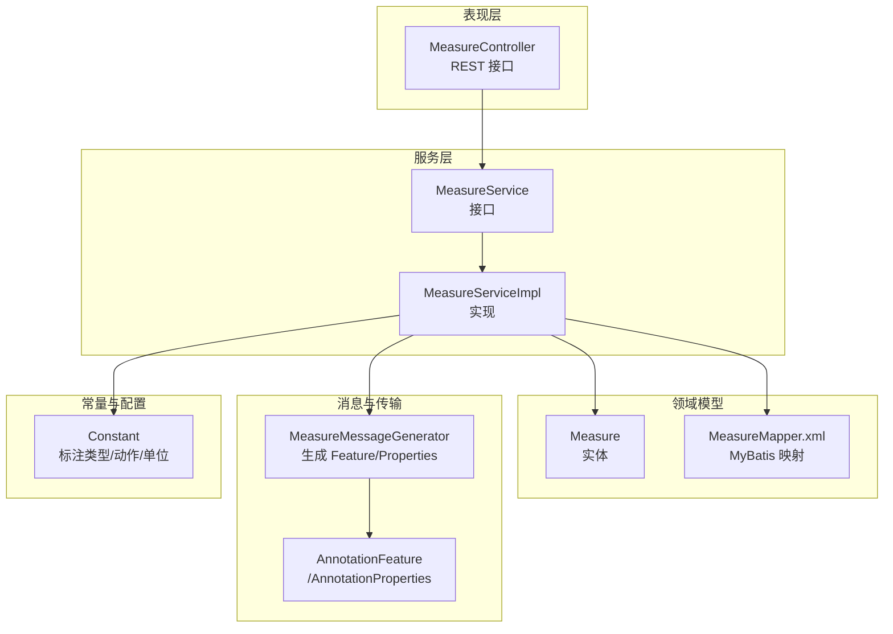
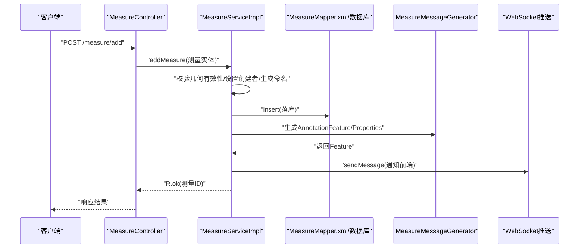
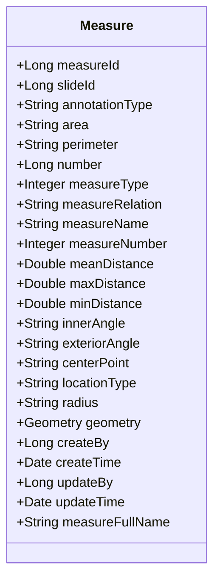
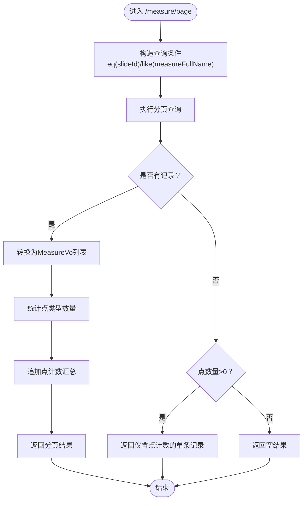
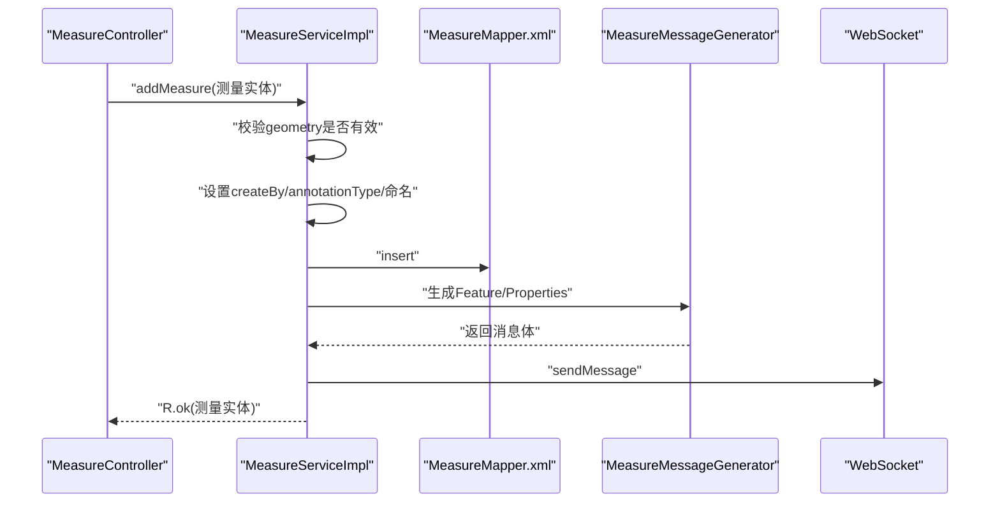
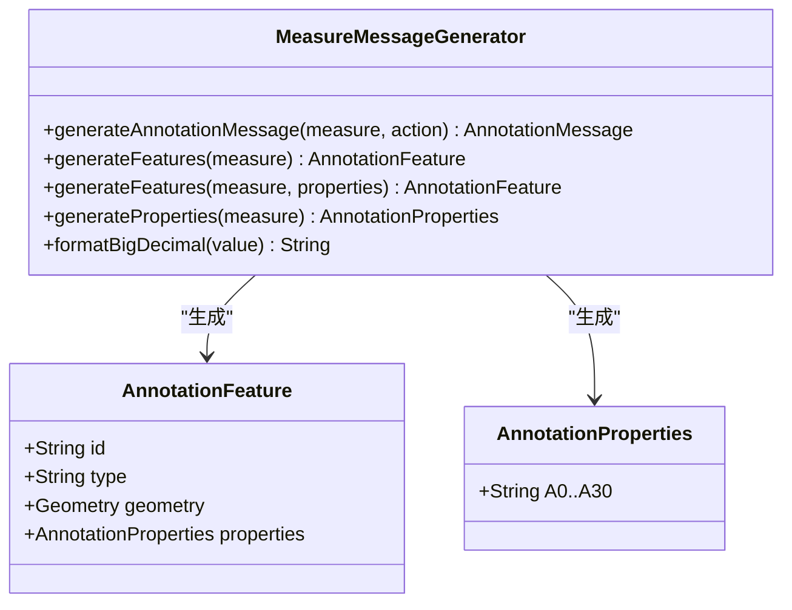
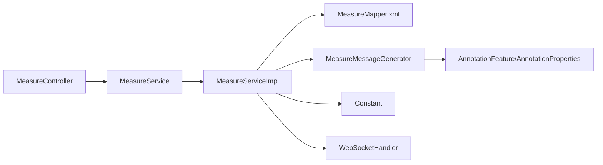

# 测量核心概念

<cite>
**本文引用的文件**
- [Measure.java](file://src/main/java/cn/staitech/annotation/domain/Measure.java)
- [MeasureService.java](file://src/main/java/cn/staitech/annotation/service/MeasureService.java)
- [MeasureServiceImpl.java](file://src/main/java/cn/staitech/annotation/service/impl/MeasureServiceImpl.java)
- [MeasureController.java](file://src/main/java/cn/staitech/annotation/controller/MeasureController.java)
- [MeasureMessageGenerator.java](file://src/main/java/cn/staitech/annotation/utils/measure/MeasureMessageGenerator.java)
- [MeasureVo.java](file://src/main/java/cn/staitech/annotation/vo/measure/MeasureVo.java)
- [MeasureAddVo.java](file://src/main/java/cn/staitech/annotation/vo/measure/MeasureAddVo.java)
- [MeasureEnVo.java](file://src/main/java/cn/staitech/annotation/vo/measure/MeasureEnVo.java)
- [MeasureReq.java](file://src/main/java/cn/staitech/annotation/vo/measure/MeasureReq.java)
- [AnnotationFeature.java](file://src/main/java/cn/staitech/annotation/netty/message/AnnotationFeature.java)
- [AnnotationProperties.java](file://src/main/java/cn/staitech/annotation/netty/message/AnnotationProperties.java)
- [Constant.java](file://src/main/java/cn/staitech/annotation/constant/Constant.java)
- [MeasureMapper.xml](file://src/main/resources/mapper/MeasureMapper.xml)
- [README.md](file://README.md)
</cite>

## 目录
1. [引言](#引言)
2. [项目结构](#项目结构)
3. [核心组件](#核心组件)
4. [架构总览](#架构总览)
5. [详细组件分析](#详细组件分析)
6. [依赖分析](#依赖分析)
7. [性能考虑](#性能考虑)
8. [故障排查指南](#故障排查指南)
9. [结论](#结论)
10. [附录](#附录)

## 引言
本文件围绕几何测量系统的核心概念进行系统化阐述，结合后端代码实现，解释医学图像测量的基本原理与业务含义，覆盖测量类型（距离、面积、角度等）、几何对象表示方法、坐标系与单位系统、测量数据的物理意义与解读方法、精度与误差控制、在医学影像诊断中的应用与重要性，以及测量相关的标准与规范。同时，面向初学者提供测量学基础，面向专业用户提供医学影像测量的专业指导。

## 项目结构
该模块属于标注与测量子系统，采用典型的分层架构：控制器层负责对外接口与请求参数校验；服务层封装业务逻辑与事务控制；数据访问层通过MyBatis映射数据库表；消息生成器负责将测量结果转换为前端可消费的GeoJSON Feature与属性对象；常量类统一管理标注类型、操作动作、单位换算等通用配置。

图表来源
- [MeasureController.java:1-118](file://src/main/java/cn/staitech/annotation/controller/MeasureController.java#L1-L118)
- [MeasureService.java:1-22](file://src/main/java/cn/staitech/annotation/service/MeasureService.java#L1-L22)
- [MeasureServiceImpl.java:1-161](file://src/main/java/cn/staitech/annotation/service/impl/MeasureServiceImpl.java#L1-L161)
- [Measure.java:1-256](file://src/main/java/cn/staitech/annotation/domain/Measure.java#L1-L256)
- [MeasureMapper.xml:1-45](file://src/main/resources/mapper/MeasureMapper.xml#L1-L45)
- [MeasureMessageGenerator.java:1-128](file://src/main/java/cn/staitech/annotation/utils/measure/MeasureMessageGenerator.java#L1-L128)
- [AnnotationFeature.java:1-33](file://src/main/java/cn/staitech/annotation/netty/message/AnnotationFeature.java#L1-L33)
- [AnnotationProperties.java:1-75](file://src/main/java/cn/staitech/annotation/netty/message/AnnotationProperties.java#L1-L75)
- [Constant.java:1-80](file://src/main/java/cn/staitech/annotation/constant/Constant.java#L1-L80)

章节来源
- [README.md:1-95](file://README.md#L1-L95)

## 核心组件
- 实体模型：Measure 表示一次测量标注，包含几何轮廓、测量指标（面积、周长、距离、角度等）、几何类型、命名规则、创建与更新信息等。
- 控制器：提供测量的分页查询、GeoJSON 数据获取、新增、删除、导出等接口。
- 服务层：封装新增测量、删除测量、导出统计等业务逻辑，处理用户渲染、事务控制与消息推送。
- 消息生成器：将测量实体转换为前端可用的 GeoJSON Feature 与属性对象，便于实时通信与可视化展示。
- VO/DTO：提供中文与英文导出模板，统一字段含义与单位显示。
- 常量：统一标注类型（Measure/AI/Draw）、操作动作（add/update/delete）与单位换算（微米、像素分辨率等）。

章节来源
- [Measure.java:14-256](file://src/main/java/cn/staitech/annotation/domain/Measure.java#L14-L256)
- [MeasureController.java:26-118](file://src/main/java/cn/staitech/annotation/controller/MeasureController.java#L26-L118)
- [MeasureServiceImpl.java:42-161](file://src/main/java/cn/staitech/annotation/service/impl/MeasureServiceImpl.java#L42-L161)
- [MeasureMessageGenerator.java:22-128](file://src/main/java/cn/staitech/annotation/utils/measure/MeasureMessageGenerator.java#L22-L128)
- [MeasureVo.java:23-205](file://src/main/java/cn/staitech/annotation/vo/measure/MeasureVo.java#L23-L205)
- [MeasureEnVo.java:22-204](file://src/main/java/cn/staitech/annotation/vo/measure/MeasureEnVo.java#L22-L204)
- [MeasureAddVo.java:16-174](file://src/main/java/cn/staitech/annotation/vo/measure/MeasureAddVo.java#L16-L174)
- [MeasureReq.java:9-25](file://src/main/java/cn/staitech/annotation/vo/measure/MeasureReq.java#L9-L25)
- [Constant.java:9-80](file://src/main/java/cn/staitech/annotation/constant/Constant.java#L9-L80)

## 架构总览
测量系统以“控制器-服务-持久层-消息生成”为主线，结合常量与VO层，形成完整的测量数据生命周期：新增测量时进行参数校验与几何有效性检查，生成唯一命名并落库；删除测量时进行存在性校验；导出时按切片聚合统计并输出Excel；消息生成器将测量结果转换为GeoJSON Feature，便于前端渲染与交互。

图表来源
- [MeasureController.java:81-93](file://src/main/java/cn/staitech/annotation/controller/MeasureController.java#L81-L93)
- [MeasureServiceImpl.java:59-81](file://src/main/java/cn/staitech/annotation/service/impl/MeasureServiceImpl.java#L59-L81)
- [MeasureMessageGenerator.java:28-46](file://src/main/java/cn/staitech/annotation/utils/measure/MeasureMessageGenerator.java#L28-L46)

## 详细组件分析

### 实体模型：Measure
- 几何对象：使用JTS Geometry存储轮廓，支持点、线、面等几何类型。
- 测量指标：面积、周长、平均/最大/最小间距、内角/外角、半径、中心点等。
- 命名规则：根据切片与测量名称生成唯一全称，序号自增。
- 标注类型：统一标记为“Measure”，便于区分AI/手绘/测量三类标注。
- 时间与人员：记录创建/更新时间与用户ID，用于审计与溯源。

图表来源
- [Measure.java:20-154](file://src/main/java/cn/staitech/annotation/domain/Measure.java#L20-L154)

章节来源
- [Measure.java:14-256](file://src/main/java/cn/staitech/annotation/domain/Measure.java#L14-L256)
- [MeasureMapper.xml:7-32](file://src/main/resources/mapper/MeasureMapper.xml#L7-L32)

### 控制器：MeasureController
- 分页查询：按切片ID与名称模糊匹配，排除点类型，统计点数量并在结果末尾追加点计数汇总。
- GeoJSON 获取：将所有测量转换为AnnotationFeature列表，供前端渲染。
- 新增测量：接收MeasureAddVo，复制到Measure实体后调用服务层新增。
- 删除测量：校验参数与存在性，执行删除并推送消息。
- 导出：按切片导出非点类型的测量统计，点类型单独计数并加入导出。

图表来源
- [MeasureController.java:41-68](file://src/main/java/cn/staitech/annotation/controller/MeasureController.java#L41-L68)

章节来源
- [MeasureController.java:26-118](file://src/main/java/cn/staitech/annotation/controller/MeasureController.java#L26-L118)

### 服务实现：MeasureServiceImpl
- 新增测量：校验输入与几何有效性，设置创建者、标注类型为“Measure”，生成唯一命名并插入数据库，随后通过WebSocket推送消息。
- 删除测量：校验参数与存在性，删除后推送消息。
- 导出：筛选非点类型测量，转换为MeasureVo或MeasureEnVo（按语言），统计点数量并追加汇总行，输出Excel文件。

图表来源
- [MeasureServiceImpl.java:59-81](file://src/main/java/cn/staitech/annotation/service/impl/MeasureServiceImpl.java#L59-L81)
- [MeasureMessageGenerator.java:28-46](file://src/main/java/cn/staitech/annotation/utils/measure/MeasureMessageGenerator.java#L28-L46)

章节来源
- [MeasureServiceImpl.java:42-161](file://src/main/java/cn/staitech/annotation/service/impl/MeasureServiceImpl.java#L42-L161)

### 消息生成与传输：MeasureMessageGenerator
- 将Measure实体转换为AnnotationFeature，几何部分直接使用geometry，属性部分映射面积、周长、距离、角度、命名等字段。
- 支持中英文导出属性名映射，便于国际化展示。
- 提供数值格式化工具，确保导出与展示的一致性。

图表来源
- [MeasureMessageGenerator.java:28-128](file://src/main/java/cn/staitech/annotation/utils/measure/MeasureMessageGenerator.java#L28-L128)
- [AnnotationFeature.java:13-33](file://src/main/java/cn/staitech/annotation/netty/message/AnnotationFeature.java#L13-L33)
- [AnnotationProperties.java:11-75](file://src/main/java/cn/staitech/annotation/netty/message/AnnotationProperties.java#L11-L75)

章节来源
- [MeasureMessageGenerator.java:22-128](file://src/main/java/cn/staitech/annotation/utils/measure/MeasureMessageGenerator.java#L22-L128)

### 单位系统与坐标系
- 单位换算：系统常量提供微米与像素分辨率的换算关系，用于将几何计算结果从像素转换为微米，保证测量值的物理意义。
- 几何类型：支持点、线、面等类型，分别对应不同的测量指标（长度/周长、面积、点集统计等）。
- 坐标系：几何对象由JTS Geometry承载，坐标系与分辨率由上游数据源决定；导出时以微米为单位展示，便于跨设备与跨系统一致性。

章节来源
- [Constant.java:30-31](file://src/main/java/cn/staitech/annotation/constant/Constant.java#L30-L31)
- [MeasureVo.java:67-157](file://src/main/java/cn/staitech/annotation/vo/measure/MeasureVo.java#L67-L157)
- [MeasureEnVo.java:66-156](file://src/main/java/cn/staitech/annotation/vo/measure/MeasureEnVo.java#L66-L156)

### 测量类型与业务含义
- 距离类：平均/最大/最小间距，适用于组织间距离、病灶边界距离等场景。
- 面积类：面积与周长，用于量化病灶或感兴趣区域大小。
- 角度类：内角/外角，辅助分析组织形态与边界方向。
- 点计数：独立于几何形状的点集合统计，便于密度分析。
- 命名与编号：基于切片与测量名称生成唯一全称，序号自增，便于检索与版本管理。

章节来源
- [Measure.java:43-118](file://src/main/java/cn/staitech/annotation/domain/Measure.java#L43-L118)
- [MeasureServiceImpl.java:69-78](file://src/main/java/cn/staitech/annotation/service/impl/MeasureServiceImpl.java#L69-L78)

### 测量结果解读与精度控制
- 结果解读：面积与周长以平方微米与微米为单位；距离以微米为单位；角度以度为单位；点计数为整数。
- 精度与误差：导出时采用三位小数格式化，确保展示一致性；几何有效性在新增时通过JTS简单性校验，避免无效几何导致的异常。
- 审计与溯源：记录创建者与更新者、时间戳，便于质量控制与责任追溯。

章节来源
- [MeasureMessageGenerator.java:99-105](file://src/main/java/cn/staitech/annotation/utils/measure/MeasureMessageGenerator.java#L99-L105)
- [MeasureServiceImpl.java:63-65](file://src/main/java/cn/staitech/annotation/service/impl/MeasureServiceImpl.java#L63-L65)
- [MeasureVo.java:169-191](file://src/main/java/cn/staitech/annotation/vo/measure/MeasureVo.java#L169-L191)

### 医学影像诊断中的应用与重要性
- 病灶量化：通过面积与周长评估病灶大小变化，辅助疗效评价与预后判断。
- 形态分析：通过角度与距离分析病灶边界形态与组织排列，为病理分型提供依据。
- 密度与分布：点计数用于评估细胞密度与分布均匀性，辅助定量诊断。
- 实时协作：通过WebSocket推送测量结果，支持多阅片者协同与远程会诊。

章节来源
- [MeasureController.java:70-79](file://src/main/java/cn/staitech/annotation/controller/MeasureController.java#L70-L79)
- [MeasureServiceImpl.java:79-80](file://src/main/java/cn/staitech/annotation/service/impl/MeasureServiceImpl.java#L79-L80)

### 测量标准与规范
- 国际标准：遵循DICOM测量标准与GeoJSON规范，确保数据互通与可视化兼容。
- 行业规范：统一标注类型与命名规则，保证不同系统间的一致性。
- 医院内部标准：建议制定本地化的测量命名与导出模板规范，明确字段含义与精度要求。

章节来源
- [Constant.java:44-58](file://src/main/java/cn/staitech/annotation/constant/Constant.java#L44-L58)
- [MeasureVo.java:66-157](file://src/main/java/cn/staitech/annotation/vo/measure/MeasureVo.java#L66-L157)
- [MeasureEnVo.java:66-156](file://src/main/java/cn/staitech/annotation/vo/measure/MeasureEnVo.java#L66-L156)

## 依赖分析
- 组件耦合：控制器依赖服务接口，服务实现依赖Mapper与消息生成器；实体与Mapper XML保持一一对应。
- 外部依赖：JTS用于几何计算与存储；EasyExcel用于导出；WebSocket用于实时推送；远程用户服务用于用户信息渲染。
- 潜在风险：几何有效性校验依赖JTS，需确保输入几何合法；导出时需注意大数据量性能与内存占用。

图表来源
- [MeasureController.java:38-40](file://src/main/java/cn/staitech/annotation/controller/MeasureController.java#L38-L40)
- [MeasureServiceImpl.java:52-57](file://src/main/java/cn/staitech/annotation/service/impl/MeasureServiceImpl.java#L52-L57)
- [MeasureMessageGenerator.java:28-46](file://src/main/java/cn/staitech/annotation/utils/measure/MeasureMessageGenerator.java#L28-L46)
- [Constant.java:44-58](file://src/main/java/cn/staitech/annotation/constant/Constant.java#L44-L58)

章节来源
- [MeasureController.java:1-118](file://src/main/java/cn/staitech/annotation/controller/MeasureController.java#L1-L118)
- [MeasureServiceImpl.java:1-161](file://src/main/java/cn/staitech/annotation/service/impl/MeasureServiceImpl.java#L1-L161)

## 性能考虑
- 导出性能：对于大规模测量数据，建议分批导出或增加分页阈值控制，避免一次性加载过多记录导致内存压力。
- 几何计算：JTS几何运算复杂度与顶点数量相关，建议在前端限制复杂度或在入库前进行简化。
- 实时推送：WebSocket推送应控制频率与批量大小，避免阻塞主线程。

## 故障排查指南
- 参数错误：当传入为空或几何无效时，服务层抛出参数无效异常；请检查输入参数与几何有效性。
- 数据不存在：删除时若测量ID不存在，返回无此标注数据异常；请确认ID正确性。
- 导出异常：检查响应头设置与Excel写入流程，确保字符编码与文件名正确。

章节来源
- [MeasureServiceImpl.java:63-65](file://src/main/java/cn/staitech/annotation/service/impl/MeasureServiceImpl.java#L63-L65)
- [MeasureServiceImpl.java:86-92](file://src/main/java/cn/staitech/annotation/service/impl/MeasureServiceImpl.java#L86-L92)
- [MeasureServiceImpl.java:111-127](file://src/main/java/cn/staitech/annotation/service/impl/MeasureServiceImpl.java#L111-L127)

## 结论
该测量系统以清晰的分层架构与完善的实体模型支撑医学图像测量需求，通过统一的命名规则、单位换算与消息生成机制，实现了从新增、删除、导出到实时推送的完整闭环。结合DICOM与GeoJSON标准，系统具备良好的互操作性与可扩展性，能够满足临床与科研场景下的定量分析与协作需求。

## 附录
- 初学者建议：先掌握像素与微米换算、几何类型与测量指标的关系，再学习命名规则与导出流程。
- 专业用户建议：严格遵循命名与精度规范，关注几何有效性与导出性能，配合审计日志进行质量控制。