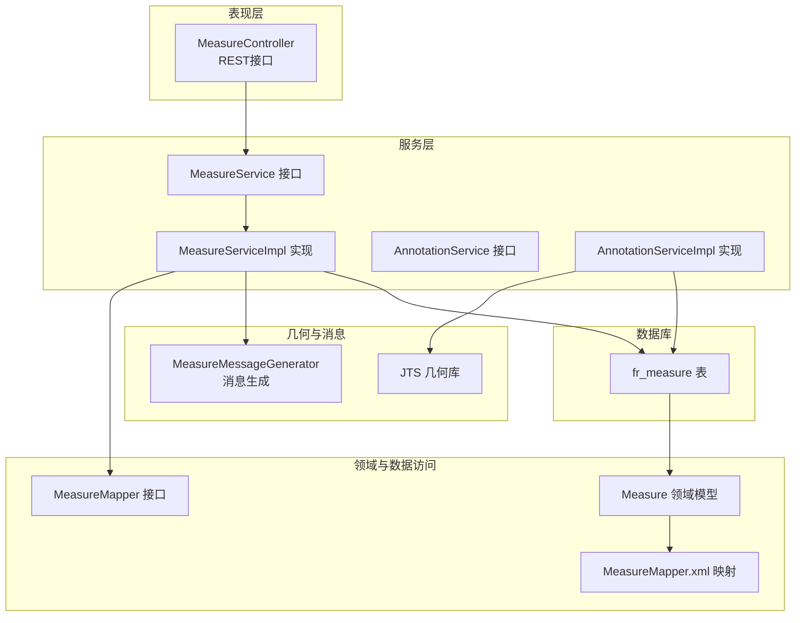
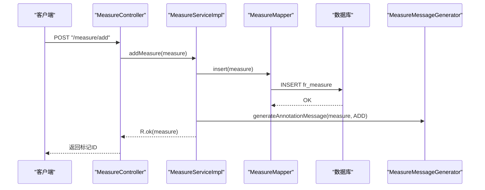
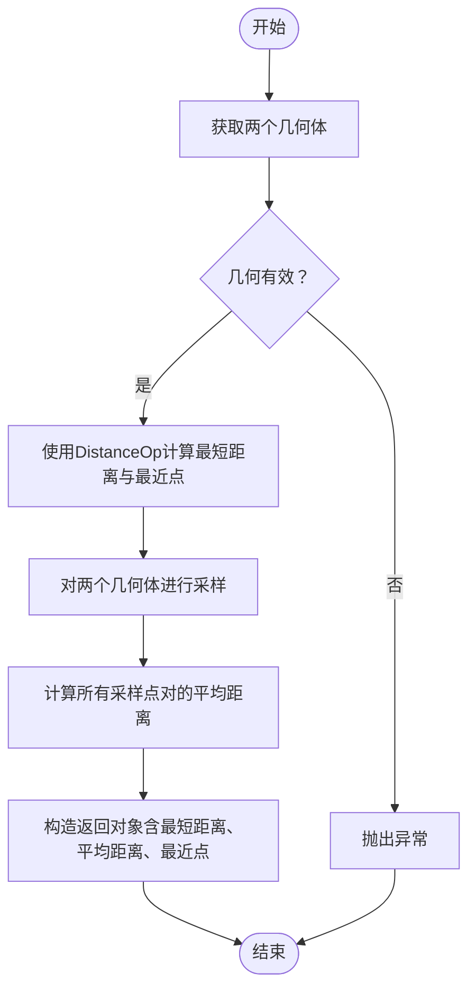
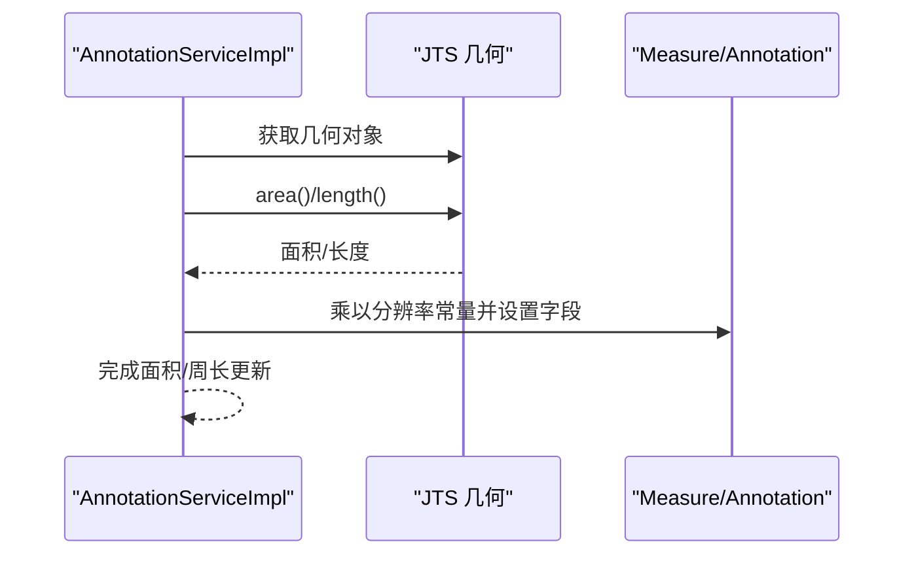
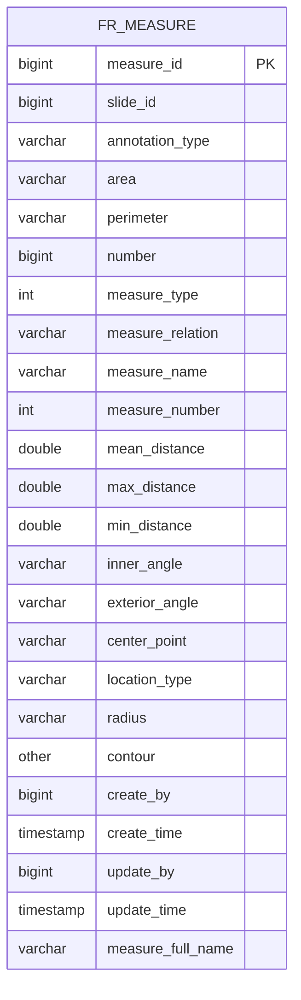
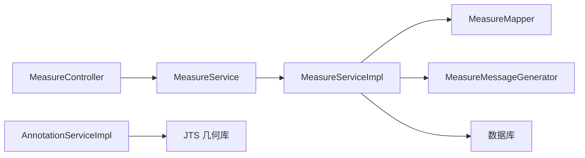

# 测量算法实现

<cite>
**本文引用的文件**
- [MeasureController.java](file://src/main/java/cn/staitech/annotation/controller/MeasureController.java)
- [MeasureService.java](file://src/main/java/cn/staitech/annotation/service/MeasureService.java)
- [MeasureServiceImpl.java](file://src/main/java/cn/staitech/annotation/service/impl/MeasureServiceImpl.java)
- [Measure.java](file://src/main/java/cn/staitech/annotation/domain/Measure.java)
- [MeasureMapper.java](file://src/main/java/cn/staitech/annotation/mapper/MeasureMapper.java)
- [MeasureMapper.xml](file://src/main/resources/mapper/MeasureMapper.xml)
- [MeasureMessageGenerator.java](file://src/main/java/cn/staitech/annotation/utils/measure/MeasureMessageGenerator.java)
- [MeasureVo.java](file://src/main/java/cn/staitech/annotation/vo/measure/MeasureVo.java)
- [MeasureReq.java](file://src/main/java/cn/staitech/annotation/vo/measure/MeasureReq.java)
- [AnnotationDistanceReq.java](file://src/main/java/cn/staitech/annotation/vo/anno/AnnotationDistanceReq.java)
- [AnnotationDistanceVo.java](file://src/main/java/cn/staitech/annotation/vo/anno/AnnotationDistanceVo.java)
- [AnnotationServiceImpl.java](file://src/main/java/cn/staitech/annotation/service/impl/AnnotationServiceImpl.java)
- [update_pg_v2.6.0.sql](file://sql/update_pg_v2.6.0.sql)
</cite>

## 目录
1. [简介](#简介)
2. [项目结构](#项目结构)
3. [核心组件](#核心组件)
4. [架构总览](#架构总览)
5. [详细组件分析](#详细组件分析)
6. [依赖分析](#依赖分析)
7. [性能考虑](#性能考虑)
8. [故障排查指南](#故障排查指南)
9. [结论](#结论)
10. [附录](#附录)

## 简介
本技术文档围绕测量算法实现展开，重点覆盖以下方面：
- 距离测量：两点间距离、路径长度、曲面距离与平均间距计算
- 面积测量：多边形面积、路径长度（周长）、半径/圆周长
- 角度测量与弧长计算：内角、外角、半径字段
- 算法精度控制：浮点数精度处理、舍入规则、误差累积控制
- 性能优化策略：JTS几何库高效使用、采样策略、缓存与并行化思路
- 适用范围与限制：几何类型约束、精度要求、计算复杂度
- 开发者实践：代码示例路径、调试技巧与最佳实践

## 项目结构
该项目采用典型的分层架构，测量功能主要由控制器、服务层、领域模型、映射器与消息生成器组成，并通过JTS几何库进行几何运算。

图表来源
- [MeasureController.java:1-118](file://src/main/java/cn/staitech/annotation/controller/MeasureController.java#L1-L118)
- [MeasureServiceImpl.java:1-161](file://src/main/java/cn/staitech/annotation/service/impl/MeasureServiceImpl.java#L1-L161)
- [MeasureMapper.java:1-19](file://src/main/java/cn/staitech/annotation/mapper/MeasureMapper.java#L1-L19)
- [MeasureMapper.xml:1-45](file://src/main/resources/mapper/MeasureMapper.xml#L1-L45)
- [Measure.java:1-256](file://src/main/java/cn/staitech/annotation/domain/Measure.java#L1-L256)
- [AnnotationServiceImpl.java:1-724](file://src/main/java/cn/staitech/annotation/service/impl/AnnotationServiceImpl.java#L1-L724)

章节来源
- [MeasureController.java:1-118](file://src/main/java/cn/staitech/annotation/controller/MeasureController.java#L1-L118)
- [MeasureServiceImpl.java:1-161](file://src/main/java/cn/staitech/annotation/service/impl/MeasureServiceImpl.java#L1-L161)
- [MeasureMapper.java:1-19](file://src/main/java/cn/staitech/annotation/mapper/MeasureMapper.java#L1-L19)
- [MeasureMapper.xml:1-45](file://src/main/resources/mapper/MeasureMapper.xml#L1-L45)
- [Measure.java:1-256](file://src/main/java/cn/staitech/annotation/domain/Measure.java#L1-L256)
- [AnnotationServiceImpl.java:1-724](file://src/main/java/cn/staitech/annotation/service/impl/AnnotationServiceImpl.java#L1-L724)

## 核心组件
- 控制器层：提供测量分页查询、GeoJSON数据获取、新增测量、删除测量、导出等功能。
- 服务层：负责业务逻辑，包括测量数据的新增、删除、导出、距离计算等。
- 领域模型：封装测量数据，包含面积、周长、间距、角度、半径、几何类型等字段。
- 数据访问层：MyBatis映射器与XML配置，完成数据库读写。
- 消息生成器：将测量数据转换为前端可消费的GeoJSON Feature与属性对象。
- 几何运算：基于JTS库进行距离、长度、面积等几何计算。

章节来源
- [MeasureController.java:1-118](file://src/main/java/cn/staitech/annotation/controller/MeasureController.java#L1-L118)
- [MeasureService.java:1-22](file://src/main/java/cn/staitech/annotation/service/MeasureService.java#L1-L22)
- [MeasureServiceImpl.java:1-161](file://src/main/java/cn/staitech/annotation/service/impl/MeasureServiceImpl.java#L1-L161)
- [Measure.java:1-256](file://src/main/java/cn/staitech/annotation/domain/Measure.java#L1-L256)
- [MeasureMapper.xml:1-45](file://src/main/resources/mapper/MeasureMapper.xml#L1-L45)
- [MeasureMessageGenerator.java:1-128](file://src/main/java/cn/staitech/annotation/utils/measure/MeasureMessageGenerator.java#L1-L128)

## 架构总览
测量模块通过控制器接收请求，调用服务层执行业务逻辑；服务层对测量数据进行持久化与消息推送，并在需要时调用几何运算能力。导出功能将测量数据转换为Excel报表。

图表来源
- [MeasureController.java:82-93](file://src/main/java/cn/staitech/annotation/controller/MeasureController.java#L82-L93)
- [MeasureServiceImpl.java:59-81](file://src/main/java/cn/staitech/annotation/service/impl/MeasureServiceImpl.java#L59-L81)
- [MeasureMapper.java:12-14](file://src/main/java/cn/staitech/annotation/mapper/MeasureMapper.java#L12-L14)
- [MeasureMessageGenerator.java:29-38](file://src/main/java/cn/staitech/annotation/utils/measure/MeasureMessageGenerator.java#L29-L38)

## 详细组件分析

### 距离测量算法
- 最短距离：使用JTS的DistanceOp计算两几何体之间的最短距离，并返回最近点对。
- 平均间距：通过在两个几何体上进行采样，计算所有采样点对之间的欧氏距离平均值。
- 采样策略：当前实现采用线性插值在几何坐标之间均匀采样，便于控制采样密度与性能平衡。

图表来源
- [AnnotationServiceImpl.java:140-181](file://src/main/java/cn/staitech/annotation/service/impl/AnnotationServiceImpl.java#L140-L181)
- [AnnotationServiceImpl.java:68-113](file://src/main/java/cn/staitech/annotation/service/impl/AnnotationServiceImpl.java#L68-L113)

章节来源
- [AnnotationServiceImpl.java:140-181](file://src/main/java/cn/staitech/annotation/service/impl/AnnotationServiceImpl.java#L140-L181)
- [AnnotationServiceImpl.java:68-113](file://src/main/java/cn/staitech/annotation/service/impl/AnnotationServiceImpl.java#L68-L113)
- [AnnotationDistanceReq.java:1-34](file://src/main/java/cn/staitech/annotation/vo/anno/AnnotationDistanceReq.java#L1-L34)
- [AnnotationDistanceVo.java:1-31](file://src/main/java/cn/staitech/annotation/vo/anno/AnnotationDistanceVo.java#L1-L31)

### 面积与路径长度计算
- 面积与周长：在标注更新或几何变更时，使用JTS几何对象的面积与长度方法，并结合图像分辨率常量进行单位换算，结果保存至测量记录。
- 半径/圆周长：提供半径字段以支持圆形测量场景，便于后续导出与展示。

图表来源
- [AnnotationServiceImpl.java:374-381](file://src/main/java/cn/staitech/annotation/service/impl/AnnotationServiceImpl.java#L374-L381)
- [AnnotationServiceImpl.java:561-564](file://src/main/java/cn/staitech/annotation/service/impl/AnnotationServiceImpl.java#L561-L564)

章节来源
- [AnnotationServiceImpl.java:374-381](file://src/main/java/cn/staitech/annotation/service/impl/AnnotationServiceImpl.java#L374-L381)
- [AnnotationServiceImpl.java:561-564](file://src/main/java/cn/staitech/annotation/service/impl/AnnotationServiceImpl.java#L561-L564)

### 角度测量与弧长计算
- 内角/外角：测量记录中包含内角与外角字段，用于表达几何转折处的角度信息。
- 弧长：当前实现未直接提供弧长计算函数，可通过自定义几何采样与累计弦长的方式实现，建议在几何预处理阶段进行细分以提升精度。

章节来源
- [Measure.java:95-102](file://src/main/java/cn/staitech/annotation/domain/Measure.java#L95-L102)
- [MeasureVo.java:127-139](file://src/main/java/cn/staitech/annotation/vo/measure/MeasureVo.java#L127-L139)

### 曲面距离计算
- 当前代码未提供曲面距离专用实现。若需在三维或投影坐标系下计算曲面距离，建议引入高斯投影或球面三角公式，并结合采样点集进行数值积分或分段累加。

章节来源
- [AnnotationServiceImpl.java:140-181](file://src/main/java/cn/staitech/annotation/service/impl/AnnotationServiceImpl.java#L140-L181)

### 算法精度控制机制
- 浮点数精度：使用BigDecimal进行面积与长度的单位换算，避免连续运算中的精度损失。
- 舍入规则：导出时使用DecimalFormat对数值进行格式化显示，确保统一的舍入与千分位分隔符。
- 误差累积控制：平均间距计算采用全点对组合，复杂度较高；可通过减少采样点数或采用分层采样降低误差累积与计算开销。

章节来源
- [MeasureMessageGenerator.java:99-105](file://src/main/java/cn/staitech/annotation/utils/measure/MeasureMessageGenerator.java#L99-L105)
- [AnnotationServiceImpl.java:68-83](file://src/main/java/cn/staitech/annotation/service/impl/AnnotationServiceImpl.java#L68-L83)

### 数据模型与字段说明
- 关键字段：面积、周长、平均/最大/最小间距、内角/外角、中心点、几何类型、半径、完整名称等。
- 字段映射：通过MyBatis XML映射到数据库表fr_measure，确保前后端一致的数据契约。

图表来源
- [MeasureMapper.xml:7-32](file://src/main/resources/mapper/MeasureMapper.xml#L7-L32)
- [update_pg_v2.6.0.sql:141-160](file://sql/update_pg_v2.6.0.sql#L141-L160)

章节来源
- [Measure.java:1-256](file://src/main/java/cn/staitech/annotation/domain/Measure.java#L1-L256)
- [MeasureMapper.xml:1-45](file://src/main/resources/mapper/MeasureMapper.xml#L1-L45)
- [update_pg_v2.6.0.sql:139-160](file://sql/update_pg_v2.6.0.sql#L139-L160)

## 依赖分析
- 组件耦合：控制器仅依赖服务接口；服务实现依赖映射器与远程服务；消息生成器依赖系统用户服务以填充创建/更新者信息。
- 外部依赖：JTS几何库用于距离、面积、长度等几何运算；EasyExcel用于导出；MyBatis用于数据持久化。
- 循环依赖：未发现循环依赖迹象，职责清晰。

图表来源
- [MeasureController.java:38-93](file://src/main/java/cn/staitech/annotation/controller/MeasureController.java#L38-L93)
- [MeasureServiceImpl.java:52-81](file://src/main/java/cn/staitech/annotation/service/impl/MeasureServiceImpl.java#L52-L81)
- [AnnotationServiceImpl.java:28-31](file://src/main/java/cn/staitech/annotation/service/impl/AnnotationServiceImpl.java#L28-L31)

章节来源
- [MeasureController.java:1-118](file://src/main/java/cn/staitech/annotation/controller/MeasureController.java#L1-L118)
- [MeasureServiceImpl.java:1-161](file://src/main/java/cn/staitech/annotation/service/impl/MeasureServiceImpl.java#L1-L161)
- [AnnotationServiceImpl.java:1-724](file://src/main/java/cn/staitech/annotation/service/impl/AnnotationServiceImpl.java#L1-L724)

## 性能考虑
- 几何运算：优先使用JTS提供的原生方法（如distance、area、length），避免手动循环计算。
- 采样策略：平均间距计算采用全点对组合，复杂度为O(n*m)。可通过减少采样点数或采用分层采样、空间索引（如R-tree）预筛选来优化。
- 缓存机制：对常用几何结果（如面积、周长）可在会话或应用级缓存中短期存储，避免重复计算。
- 并行计算：在批量处理场景（如批量导出）可采用并行流处理，但需注意线程安全与共享资源竞争。
- I/O优化：导出时使用流式写入，避免一次性加载全部数据到内存。

## 故障排查指南
- 参数校验：新增测量时对几何有效性进行检查，无效参数将抛出“参数无效”异常。
- 数据存在性：删除测量前检查目标是否存在，不存在则抛出“无标注数据”异常。
- 导出异常：检查语言环境与用户映射，确保导出列与用户信息正确填充。
- 几何计算异常：当无法计算最近点或几何为空时，抛出相应异常提示。

章节来源
- [MeasureServiceImpl.java:63-65](file://src/main/java/cn/staitech/annotation/service/impl/MeasureServiceImpl.java#L63-L65)
- [MeasureServiceImpl.java:86-92](file://src/main/java/cn/staitech/annotation/service/impl/MeasureServiceImpl.java#L86-L92)
- [MeasureServiceImpl.java:99-127](file://src/main/java/cn/staitech/annotation/service/impl/MeasureServiceImpl.java#L99-L127)
- [AnnotationServiceImpl.java:153-165](file://src/main/java/cn/staitech/annotation/service/impl/AnnotationServiceImpl.java#L153-L165)

## 结论
本测量算法实现以JTS为核心，提供了距离、面积、长度等基础几何测量能力，并通过消息生成与导出功能支撑前端展示与报表输出。未来可在曲面距离、弧长计算、采样策略优化与缓存机制等方面进一步增强，以满足更高精度与性能需求。

## 附录
- 代码示例路径（不含具体代码内容）：
  - 距离计算流程：[AnnotationServiceImpl.java:140-181](file://src/main/java/cn/staitech/annotation/service/impl/AnnotationServiceImpl.java#L140-L181)
  - 平均间距采样：[AnnotationServiceImpl.java:68-113](file://src/main/java/cn/staitech/annotation/service/impl/AnnotationServiceImpl.java#L68-L113)
  - 面积/周长计算：[AnnotationServiceImpl.java:374-381](file://src/main/java/cn/staitech/annotation/service/impl/AnnotationServiceImpl.java#L374-L381)
  - 导出流程：[MeasureServiceImpl.java:99-127](file://src/main/java/cn/staitech/annotation/service/impl/MeasureServiceImpl.java#L99-L127)
  - 消息生成：[MeasureMessageGenerator.java:29-97](file://src/main/java/cn/staitech/annotation/utils/measure/MeasureMessageGenerator.java#L29-L97)
- 调试技巧：
  - 使用日志定位几何为空或计算失败的位置。
  - 在导出前检查用户映射与语言环境。
  - 对批量操作启用事务，确保一致性与可回滚。