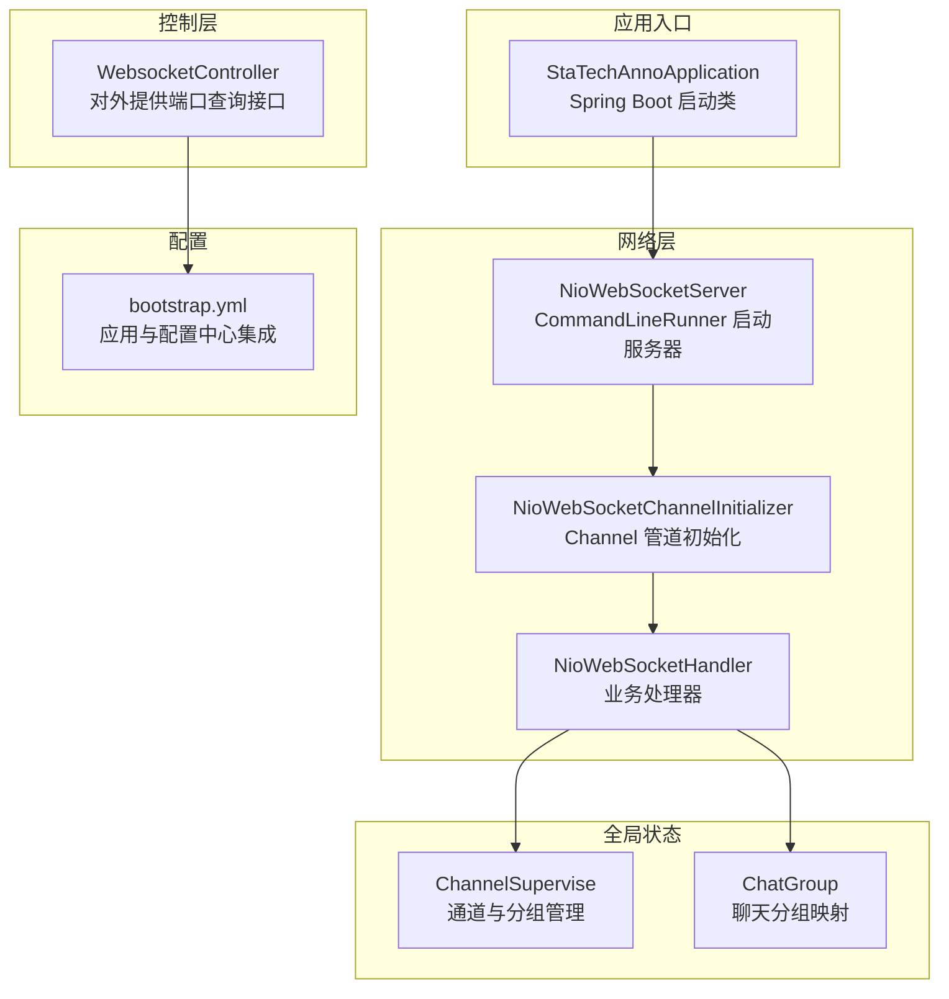
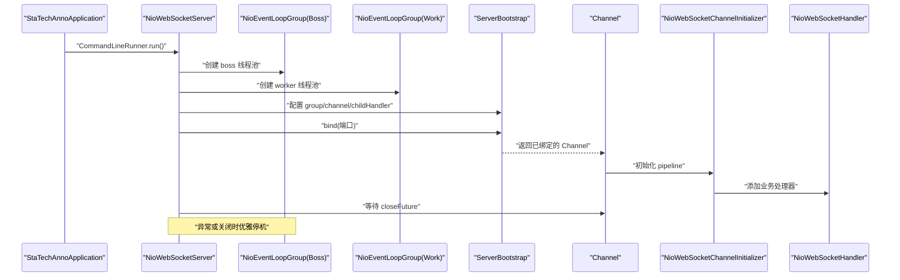
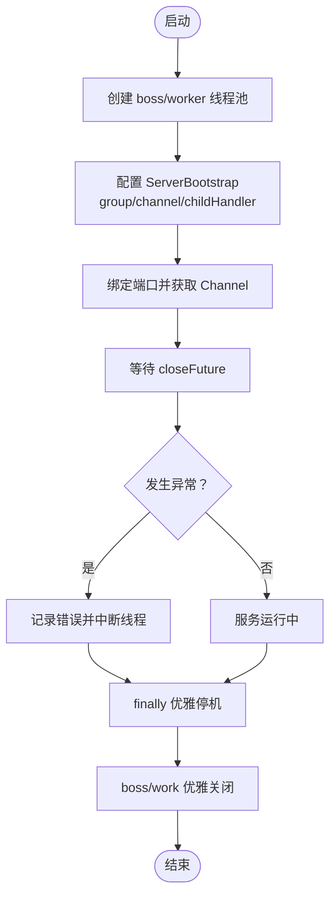
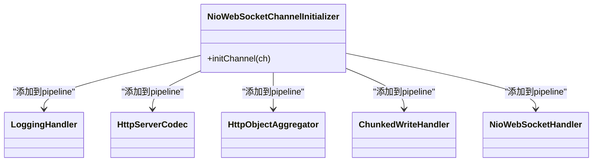
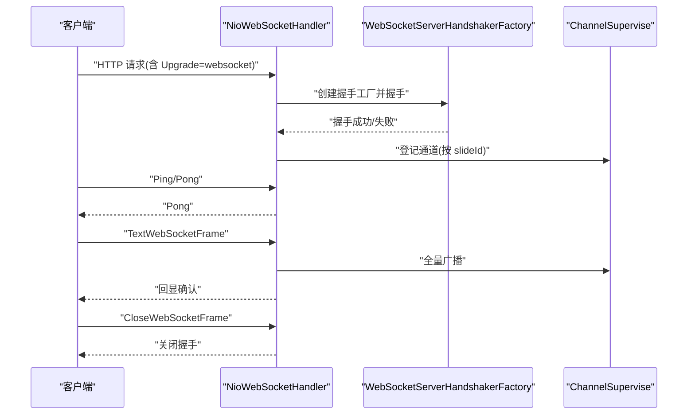
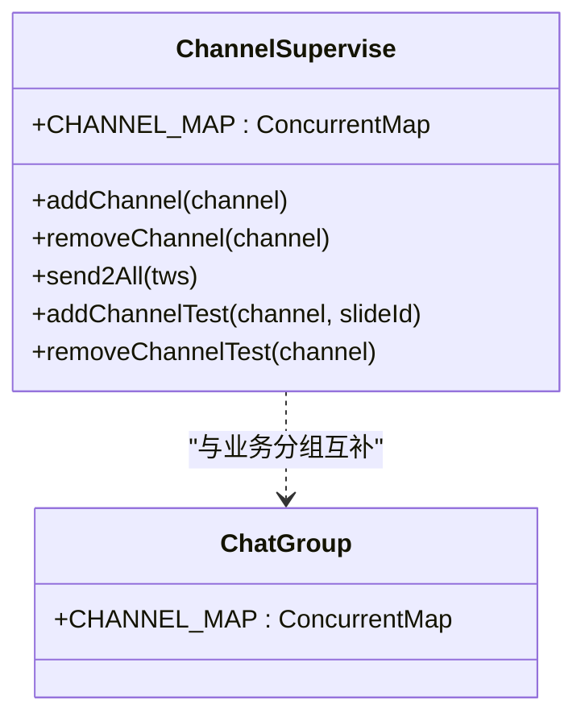
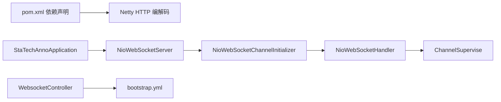

# WebSocket服务器架构

<cite>
**本文引用的文件**
- [NioWebSocketServer.java](file://src/main/java/cn/staitech/annotation/netty/websocket/NioWebSocketServer.java)
- [NioWebSocketChannelInitializer.java](file://src/main/java/cn/staitech/annotation/netty/websocket/NioWebSocketChannelInitializer.java)
- [NioWebSocketHandler.java](file://src/main/java/cn/staitech/annotation/netty/websocket/NioWebSocketHandler.java)
- [ChannelSupervise.java](file://src/main/java/cn/staitech/annotation/netty/global/ChannelSupervise.java)
- [ChatGroup.java](file://src/main/java/cn/staitech/annotation/netty/global/ChatGroup.java)
- [WebsocketController.java](file://src/main/java/cn/staitech/annotation/controller/WebsocketController.java)
- [bootstrap.yml](file://src/main/resources/bootstrap.yml)
- [StaTechAnnoApplication.java](file://src/main/java/cn/staitech/annotation/StaTechAnnoApplication.java)
- [pom.xml](file://pom.xml)
</cite>

## 目录
1. [引言](#引言)
2. [项目结构](#项目结构)
3. [核心组件](#核心组件)
4. [架构总览](#架构总览)
5. [组件详解](#组件详解)
6. [依赖关系分析](#依赖关系分析)
7. [性能与调优](#性能与调优)
8. [监控与故障排查](#监控与故障排查)
9. [结论](#结论)
10. [附录](#附录)

## 引言
本文件面向开发者与运维人员，系统性解析基于 Netty 的 WebSocket 服务器实现。重点覆盖以下方面：
- ServerBootstrap 的配置与启动流程
- EventLoopGroup 线程池管理与生命周期
- 端口绑定与启动顺序
- CommandLineRunner 生命周期与异常处理
- NioWebSocketChannelInitializer 的管道配置（编解码器、处理器链路、连接参数）
- 服务器配置项（端口、线程池、内存）与调优建议
- 监控指标、性能基准测试方法与故障排查指南

## 项目结构
该模块采用按功能域划分的目录组织，WebSocket 相关代码集中在 netty 子包中，控制器层提供对外访问入口。

图表来源
- [StaTechAnnoApplication.java:1-51](file://src/main/java/cn/staitech/annotation/StaTechAnnoApplication.java#L1-L51)
- [NioWebSocketServer.java:1-44](file://src/main/java/cn/staitech/annotation/netty/websocket/NioWebSocketServer.java#L1-L44)
- [NioWebSocketChannelInitializer.java:1-30](file://src/main/java/cn/staitech/annotation/netty/websocket/NioWebSocketChannelInitializer.java#L1-L30)
- [NioWebSocketHandler.java:1-197](file://src/main/java/cn/staitech/annotation/netty/websocket/NioWebSocketHandler.java#L1-L197)
- [ChannelSupervise.java:1-45](file://src/main/java/cn/staitech/annotation/netty/global/ChannelSupervise.java#L1-L45)
- [ChatGroup.java:1-11](file://src/main/java/cn/staitech/annotation/netty/global/ChatGroup.java#L1-L11)
- [WebsocketController.java:1-41](file://src/main/java/cn/staitech/annotation/controller/WebsocketController.java#L1-L41)
- [bootstrap.yml:1-42](file://src/main/resources/bootstrap.yml#L1-L42)

章节来源
- [StaTechAnnoApplication.java:1-51](file://src/main/java/cn/staitech/annotation/StaTechAnnoApplication.java#L1-L51)
- [bootstrap.yml:1-42](file://src/main/resources/bootstrap.yml#L1-L42)

## 核心组件
- NioWebSocketServer：通过 CommandLineRunner 在应用启动时创建并启动 Netty 服务器，负责绑定端口、等待关闭信号以及优雅停机。
- NioWebSocketChannelInitializer：为每个新连接建立 ChannelPipeline，按序装配编解码器与业务处理器。
- NioWebSocketHandler：处理握手、心跳、文本帧广播、连接增删等业务逻辑；通过 ChannelSupervise 维护连接集合。
- ChannelSupervise：维护在线通道集合、按 slideId 分组映射，支持全量广播与定向发送。
- ChatGroup：提供另一种通道映射结构（整型键），便于扩展不同维度的分组场景。
- WebsocketController：对外暴露查询 WebSocket 地址的接口，读取配置中的端口值。

章节来源
- [NioWebSocketServer.java:1-44](file://src/main/java/cn/staitech/annotation/netty/websocket/NioWebSocketServer.java#L1-L44)
- [NioWebSocketChannelInitializer.java:1-30](file://src/main/java/cn/staitech/annotation/netty/websocket/NioWebSocketChannelInitializer.java#L1-L30)
- [NioWebSocketHandler.java:1-197](file://src/main/java/cn/staitech/annotation/netty/websocket/NioWebSocketHandler.java#L1-L197)
- [ChannelSupervise.java:1-45](file://src/main/java/cn/staitech/annotation/netty/global/ChannelSupervise.java#L1-L45)
- [ChatGroup.java:1-11](file://src/main/java/cn/staitech/annotation/netty/global/ChatGroup.java#L1-L11)
- [WebsocketController.java:1-41](file://src/main/java/cn/staitech/annotation/controller/WebsocketController.java#L1-L41)

## 架构总览
下图展示从应用启动到服务就绪的关键交互与职责分工：

图表来源
- [NioWebSocketServer.java:19-41](file://src/main/java/cn/staitech/annotation/netty/websocket/NioWebSocketServer.java#L19-L41)
- [NioWebSocketChannelInitializer.java:13-28](file://src/main/java/cn/staitech/annotation/netty/websocket/NioWebSocketChannelInitializer.java#L13-L28)
- [NioWebSocketHandler.java:29-196](file://src/main/java/cn/staitech/annotation/netty/websocket/NioWebSocketHandler.java#L29-L196)

## 组件详解

### NioWebSocketServer：启动与生命周期
- 启动时机：实现 CommandLineRunner，在 Spring 容器启动完成后执行 run()。
- 线程池：创建两个 NioEventLoopGroup，分别作为 boss 与 worker。
- 绑定与等待：通过 ServerBootstrap 绑定端口，阻塞等待 closeFuture。
- 异常处理：捕获中断异常，记录错误日志并恢复中断状态；finally 中优雅关闭线程池。
- 关闭流程：boss 与 work 依次 shutdownGracefully，确保资源回收。

图表来源
- [NioWebSocketServer.java:19-41](file://src/main/java/cn/staitech/annotation/netty/websocket/NioWebSocketServer.java#L19-L41)

章节来源
- [NioWebSocketServer.java:1-44](file://src/main/java/cn/staitech/annotation/netty/websocket/NioWebSocketServer.java#L1-L44)

### NioWebSocketChannelInitializer：管道配置
- 日志处理器：LoggingHandler，便于调试观察请求流转。
- HTTP 编解码：HttpServerCodec，支持 HTTP 请求解析。
- 聚合器：HttpObjectAggregator，限制聚合体大小，适配 WebSocket 握手与大消息。
- 分块写：ChunkedWriteHandler，支持大数据分块传输。
- 业务处理器：NioWebSocketHandler，完成握手、心跳、消息处理与广播。

图表来源
- [NioWebSocketChannelInitializer.java:13-28](file://src/main/java/cn/staitech/annotation/netty/websocket/NioWebSocketChannelInitializer.java#L13-L28)

章节来源
- [NioWebSocketChannelInitializer.java:1-30](file://src/main/java/cn/staitech/annotation/netty/websocket/NioWebSocketChannelInitializer.java#L1-L30)

### NioWebSocketHandler：握手、心跳与消息处理
- 握手：校验 Upgrade 头，构造 WebSocketServerHandshakerFactory 并完成握手；根据 URI 片段区分 slide 类型并登记分组。
- 心跳：识别 Ping 帧并回送 Pong 帧。
- 文本帧：仅支持 TextWebSocketFrame，收到后进行广播；关闭帧触发关闭握手。
- 连接生命周期：channelActive/Inactive 时维护全局通道集合。
- 发送消息：将 AnnotationMessage 序列化为 JSON，按 slideId 查找目标通道并发送。

图表来源
- [NioWebSocketHandler.java:94-196](file://src/main/java/cn/staitech/annotation/netty/websocket/NioWebSocketHandler.java#L94-L196)
- [ChannelSupervise.java:17-44](file://src/main/java/cn/staitech/annotation/netty/global/ChannelSupervise.java#L17-L44)

章节来源
- [NioWebSocketHandler.java:1-197](file://src/main/java/cn/staitech/annotation/netty/websocket/NioWebSocketHandler.java#L1-L197)
- [ChannelSupervise.java:1-45](file://src/main/java/cn/staitech/annotation/netty/global/ChannelSupervise.java#L1-L45)

### ChannelSupervise 与 ChatGroup：连接与分组管理
- ChannelSupervise
  - 维护在线通道集合与通道 ID 映射，支持全量广播与按 slideId 分组查找。
  - 提供 add/remove/send2All 等操作。
- ChatGroup
  - 提供整型键到 Channel 的映射，便于按业务维度分组。

图表来源
- [ChannelSupervise.java:17-44](file://src/main/java/cn/staitech/annotation/netty/global/ChannelSupervise.java#L17-L44)
- [ChatGroup.java:8-10](file://src/main/java/cn/staitech/annotation/netty/global/ChatGroup.java#L8-L10)

章节来源
- [ChannelSupervise.java:1-45](file://src/main/java/cn/staitech/annotation/netty/global/ChannelSupervise.java#L1-L45)
- [ChatGroup.java:1-11](file://src/main/java/cn/staitech/annotation/netty/global/ChatGroup.java#L1-L11)

### WebsocketController：对外提供端口查询
- 读取配置中的 netty.port，拼接 ws:// 地址返回给前端或调用方。
- 通过 RequestContextHolder 获取本地地址，保证返回地址与实际部署一致。

章节来源
- [WebsocketController.java:1-41](file://src/main/java/cn/staitech/annotation/controller/WebsocketController.java#L1-L41)

## 依赖关系分析
- 服务器启动依赖 Spring Boot 自动装配与 CommandLineRunner 机制。
- Netty 依赖通过 Maven 引入，版本在 pom.xml 中声明。
- 控制器依赖 Spring MVC，提供对外查询接口。
- 应用入口通过注解启用发现、异步、事务等能力。

图表来源
- [pom.xml:82-85](file://pom.xml#L82-L85)
- [StaTechAnnoApplication.java:11-33](file://src/main/java/cn/staitech/annotation/StaTechAnnoApplication.java#L11-L33)
- [NioWebSocketServer.java:1-44](file://src/main/java/cn/staitech/annotation/netty/websocket/NioWebSocketServer.java#L1-L44)
- [NioWebSocketChannelInitializer.java:1-30](file://src/main/java/cn/staitech/annotation/netty/websocket/NioWebSocketChannelInitializer.java#L1-L30)
- [NioWebSocketHandler.java:1-197](file://src/main/java/cn/staitech/annotation/netty/websocket/NioWebSocketHandler.java#L1-L197)
- [ChannelSupervise.java:1-45](file://src/main/java/cn/staitech/annotation/netty/global/ChannelSupervise.java#L1-L45)
- [WebsocketController.java:1-41](file://src/main/java/cn/staitech/annotation/controller/WebsocketController.java#L1-L41)
- [bootstrap.yml:1-42](file://src/main/resources/bootstrap.yml#L1-L42)

章节来源
- [pom.xml:1-265](file://pom.xml#L1-L265)
- [bootstrap.yml:1-42](file://src/main/resources/bootstrap.yml#L1-L42)

## 性能与调优
- 端口配置
  - 通过配置项 netty.port 指定监听端口，控制器提供查询接口便于前端拼接地址。
- 线程池大小
  - 默认使用单线程 boss 与默认大小的 worker。可根据 CPU 核数与并发连接数调整线程池大小，以提升吞吐与降低上下文切换。
- 内存管理
  - HttpObjectAggregator 聚合体大小限制为 65536 字节，避免单条消息过大导致内存峰值过高。可根据业务消息规模适当调整。
  - 使用 Unpooled/ByteBuf 时注意及时释放，避免内存泄漏。
- 广播与分组
  - 全量广播使用 ChannelGroup，按 slideId 分组查找遍历 CHANNEL_MAP。在高并发场景下可考虑引入更细粒度的分组与限流策略。
- I/O 模式
  - 当前使用 NIO 模式，适合高并发低延迟场景。如需进一步优化可评估 Epoll/KQueue（Linux）或开启零拷贝策略。

章节来源
- [NioWebSocketChannelInitializer.java:1-30](file://src/main/java/cn/staitech/annotation/netty/websocket/NioWebSocketChannelInitializer.java#L1-L30)
- [NioWebSocketHandler.java:1-197](file://src/main/java/cn/staitech/annotation/netty/websocket/NioWebSocketHandler.java#L1-L197)
- [ChannelSupervise.java:1-45](file://src/main/java/cn/staitech/annotation/netty/global/ChannelSupervise.java#L1-L45)
- [WebsocketController.java:1-41](file://src/main/java/cn/staitech/annotation/controller/WebsocketController.java#L1-L41)

## 监控与故障排查
- 监控指标建议
  - 连接数：ChannelSupervise.CHANNEL_GROUP.size()
  - 活跃连接：按通道活跃状态统计
  - 消息速率：统计单位时间收到/发送的消息数量
  - 内存占用：Heap/Off-heap 使用情况，结合 JVM 垃圾回收日志
  - 错误率：握手失败、序列化失败、广播失败等计数
- 性能基准测试
  - 使用压测工具模拟多客户端并发连接与消息发送，观察 CPU、内存、连接数与延迟曲线。
  - 关注握手耗时、消息处理耗时、GC 次数与停顿时间。
- 故障排查
  - 握手失败：检查 Upgrade 头是否正确、URI 是否包含 slideId 片段、Handshaker 创建是否为空。
  - 心跳异常：确认 Ping/Pong 帧处理逻辑未被其他处理器拦截。
  - 广播无效：核对 CHANNEL_MAP 与 CHANNEL_GROUP 的登记与移除逻辑，确保连接断开时清理。
  - 端口冲突：确认 netty.port 未被占用，或在启动参数中动态指定。
  - 日志定位：利用 LoggingHandler 输出的 DEBUG 日志，追踪请求进入与处理路径。

章节来源
- [NioWebSocketHandler.java:1-197](file://src/main/java/cn/staitech/annotation/netty/websocket/NioWebSocketHandler.java#L1-L197)
- [ChannelSupervise.java:1-45](file://src/main/java/cn/staitech/annotation/netty/global/ChannelSupervise.java#L1-L45)
- [NioWebSocketChannelInitializer.java:1-30](file://src/main/java/cn/staitech/annotation/netty/websocket/NioWebSocketChannelInitializer.java#L1-L30)

## 结论
该 WebSocket 服务器以 Netty 为核心，通过简洁的管道配置与清晰的生命周期管理，实现了稳定的长连接服务。结合全局连接管理与控制器提供的端口查询能力，满足了标注系统中实时通信的需求。建议在生产环境中结合监控指标与压测结果持续优化线程池、内存与消息聚合阈值，确保高并发下的稳定性与性能。

## 附录
- 配置项说明
  - netty.port：WebSocket 服务监听端口
  - spring.profiles.active：激活的环境配置（与 Nacos 集成）
  - knife4j.enable：接口文档开关
- 依赖版本
  - Netty HTTP 编解码：见 pom.xml 中对应依赖声明

章节来源
- [bootstrap.yml:1-42](file://src/main/resources/bootstrap.yml#L1-L42)
- [pom.xml:82-85](file://pom.xml#L82-L85)