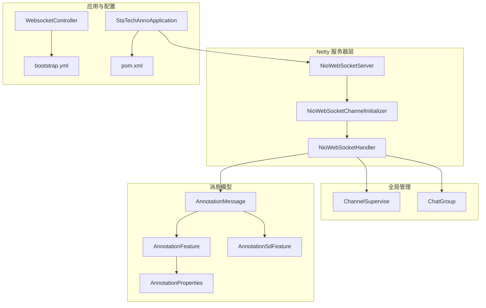
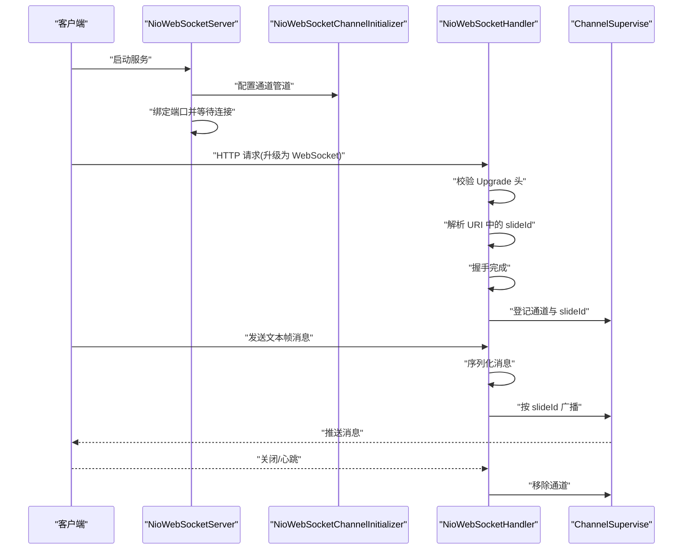
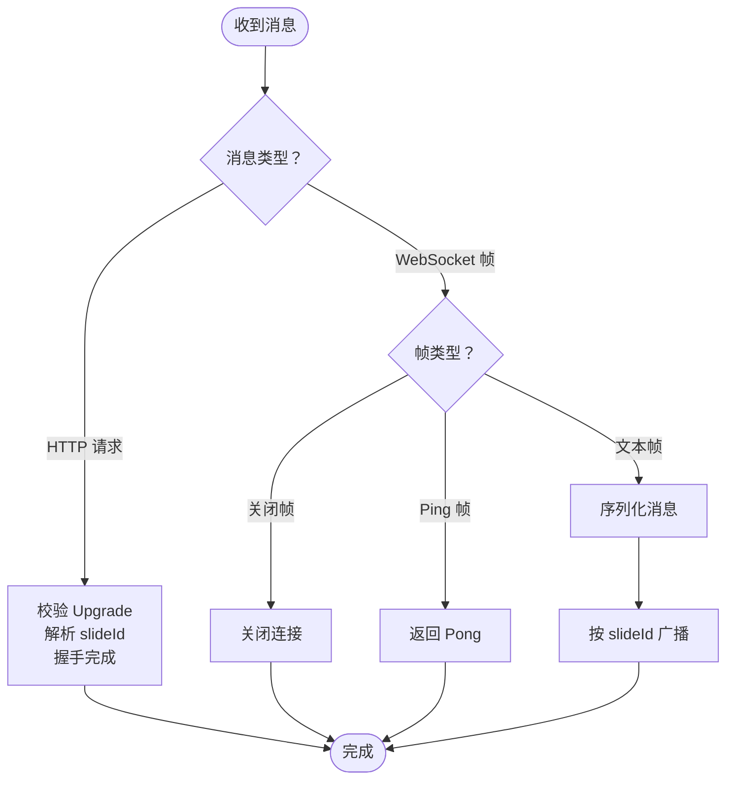
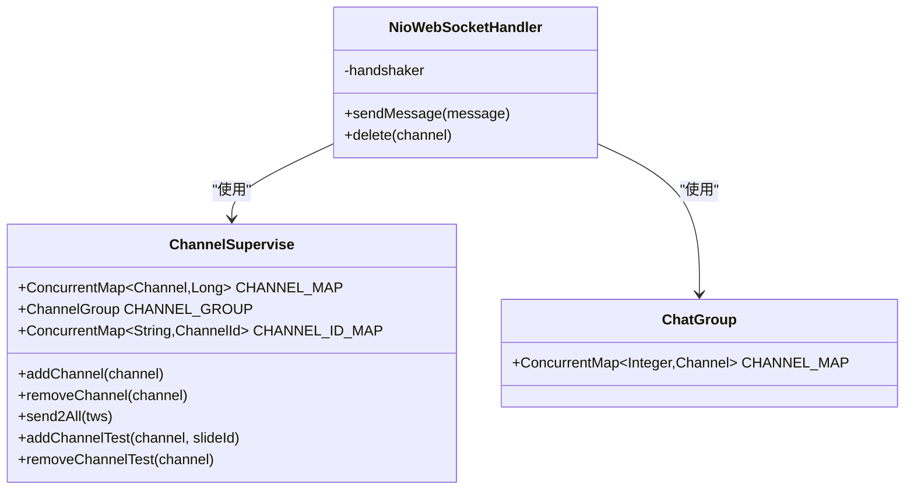
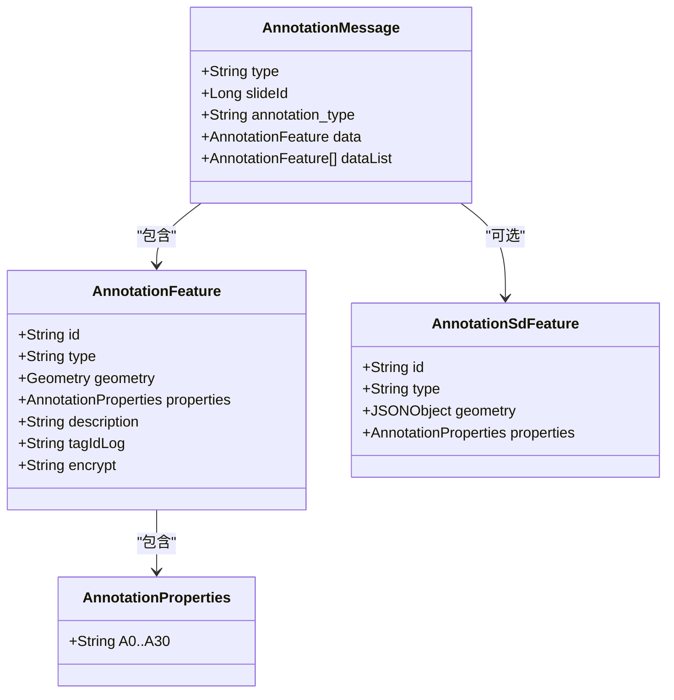
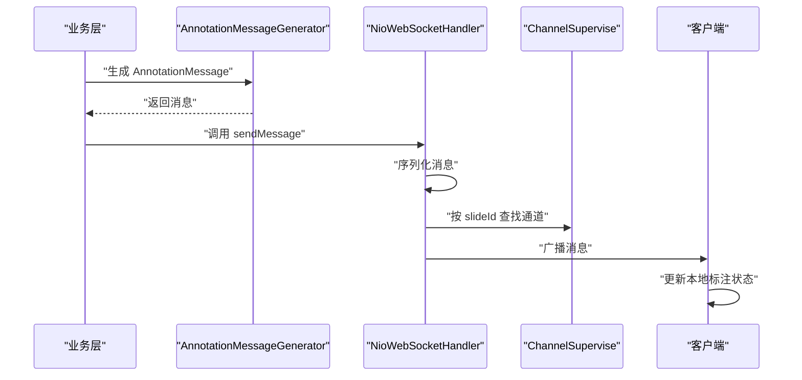
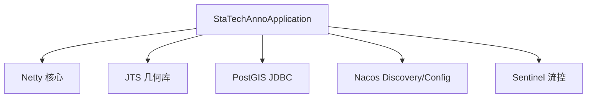

# 实时通信系统

<cite>
**本文引用的文件**
- [NioWebSocketServer.java](file://src/main/java/cn/staitech/annotation/netty/websocket/NioWebSocketServer.java)
- [NioWebSocketChannelInitializer.java](file://src/main/java/cn/staitech/annotation/netty/websocket/NioWebSocketChannelInitializer.java)
- [NioWebSocketHandler.java](file://src/main/java/cn/staitech/annotation/netty/websocket/NioWebSocketHandler.java)
- [ChannelSupervise.java](file://src/main/java/cn/staitech/annotation/netty/global/ChannelSupervise.java)
- [ChatGroup.java](file://src/main/java/cn/staitech/annotation/netty/global/ChatGroup.java)
- [AnnotationMessage.java](file://src/main/java/cn/staitech/annotation/netty/message/AnnotationMessage.java)
- [AnnotationFeature.java](file://src/main/java/cn/staitech/annotation/netty/message/AnnotationFeature.java)
- [AnnotationProperties.java](file://src/main/java/cn/staitech/annotation/netty/message/AnnotationProperties.java)
- [AnnotationSdFeature.java](file://src/main/java/cn/staitech/annotation/netty/message/AnnotationSdFeature.java)
- [AnnotationMessageGenerator.java](file://src/main/java/cn/staitech/annotation/utils/annotation/AnnotationMessageGenerator.java)
- [UndoRedoManager.java](file://src/main/java/cn/staitech/annotation/utils/annotation/UndoRedoManager.java)
- [WebsocketController.java](file://src/main/java/cn/staitech/annotation/controller/WebsocketController.java)
- [bootstrap.yml](file://src/main/resources/bootstrap.yml)
- [update_pg_v2.6.0.sql](file://sql/update_pg_v2.6.0.sql)
- [StaTechAnnoApplication.java](file://src/main/java/cn/staitech/annotation/StaTechAnnoApplication.java)
- [pom.xml](file://pom.xml)
</cite>

## 目录
1. [简介](#简介)
2. [项目结构](#项目结构)
3. [核心组件](#核心组件)
4. [架构总览](#架构总览)
5. [详细组件分析](#详细组件分析)
6. [依赖分析](#依赖分析)
7. [性能考虑](#性能考虑)
8. [故障排查指南](#故障排查指南)
9. [结论](#结论)
10. [附录](#附录)

## 简介
本文件面向医学图像标注系统的实时通信子系统，系统基于 Netty 构建 WebSocket 服务，提供标注数据的实时同步与广播能力。文档覆盖服务器初始化、连接管理、消息处理、消息格式与事件类型、客户端集成要点、在线状态与群组通信、消息持久化策略以及并发控制策略，并给出面向初学者的概念说明与面向开发者的性能优化建议。

## 项目结构
实时通信相关代码主要位于以下包与文件：
- 服务器与通道管线：NioWebSocketServer、NioWebSocketChannelInitializer、NioWebSocketHandler
- 全局连接与分组：ChannelSupervise、ChatGroup
- 消息模型：AnnotationMessage、AnnotationFeature、AnnotationProperties、AnnotationSdFeature
- 消息生成与撤销重做：AnnotationMessageGenerator、UndoRedoManager
- 控制层与配置：WebsocketController、bootstrap.yml
- 数据库结构：update_pg_v2.6.0.sql
- 启动入口：StaTechAnnoApplication
- 依赖：pom.xml

图表来源
- [NioWebSocketServer.java:1-44](file://src/main/java/cn/staitech/annotation/netty/websocket/NioWebSocketServer.java#L1-L44)
- [NioWebSocketChannelInitializer.java:1-30](file://src/main/java/cn/staitech/annotation/netty/websocket/NioWebSocketChannelInitializer.java#L1-L30)
- [NioWebSocketHandler.java:1-197](file://src/main/java/cn/staitech/annotation/netty/websocket/NioWebSocketHandler.java#L1-L197)
- [ChannelSupervise.java:1-45](file://src/main/java/cn/staitech/annotation/netty/global/ChannelSupervise.java#L1-L45)
- [ChatGroup.java:1-11](file://src/main/java/cn/staitech/annotation/netty/global/ChatGroup.java#L1-L11)
- [AnnotationMessage.java:1-28](file://src/main/java/cn/staitech/annotation/netty/message/AnnotationMessage.java#L1-L28)
- [AnnotationFeature.java:1-33](file://src/main/java/cn/staitech/annotation/netty/message/AnnotationFeature.java#L1-L33)
- [AnnotationProperties.java:1-75](file://src/main/java/cn/staitech/annotation/netty/message/AnnotationProperties.java#L1-L75)
- [AnnotationSdFeature.java:1-16](file://src/main/java/cn/staitech/annotation/netty/message/AnnotationSdFeature.java#L1-L16)
- [WebsocketController.java:1-41](file://src/main/java/cn/staitech/annotation/controller/WebsocketController.java#L1-L41)
- [bootstrap.yml:1-42](file://src/main/resources/bootstrap.yml#L1-L42)
- [StaTechAnnoApplication.java:1-51](file://src/main/java/cn/staitech/annotation/StaTechAnnoApplication.java#L1-L51)
- [pom.xml:1-265](file://pom.xml#L1-L265)

章节来源
- [NioWebSocketServer.java:1-44](file://src/main/java/cn/staitech/annotation/netty/websocket/NioWebSocketServer.java#L1-L44)
- [NioWebSocketChannelInitializer.java:1-30](file://src/main/java/cn/staitech/annotation/netty/websocket/NioWebSocketChannelInitializer.java#L1-L30)
- [NioWebSocketHandler.java:1-197](file://src/main/java/cn/staitech/annotation/netty/websocket/NioWebSocketHandler.java#L1-L197)
- [ChannelSupervise.java:1-45](file://src/main/java/cn/staitech/annotation/netty/global/ChannelSupervise.java#L1-L45)
- [ChatGroup.java:1-11](file://src/main/java/cn/staitech/annotation/netty/global/ChatGroup.java#L1-L11)
- [AnnotationMessage.java:1-28](file://src/main/java/cn/staitech/annotation/netty/message/AnnotationMessage.java#L1-L28)
- [AnnotationFeature.java:1-33](file://src/main/java/cn/staitech/annotation/netty/message/AnnotationFeature.java#L1-L33)
- [AnnotationProperties.java:1-75](file://src/main/java/cn/staitech/annotation/netty/message/AnnotationProperties.java#L1-L75)
- [AnnotationSdFeature.java:1-16](file://src/main/java/cn/staitech/annotation/netty/message/AnnotationSdFeature.java#L1-L16)
- [WebsocketController.java:1-41](file://src/main/java/cn/staitech/annotation/controller/WebsocketController.java#L1-L41)
- [bootstrap.yml:1-42](file://src/main/resources/bootstrap.yml#L1-L42)
- [StaTechAnnoApplication.java:1-51](file://src/main/java/cn/staitech/annotation/StaTechAnnoApplication.java#L1-L51)
- [pom.xml:1-265](file://pom.xml#L1-L265)

## 核心组件
- 服务器启动器：负责绑定端口、初始化 EventLoopGroup、配置 ServerBootstrap 并阻塞等待关闭。
- 通道初始化器：在 ChannelPipeline 中装配 HTTP 编解码器、聚合器、分块写处理器与自定义处理器。
- 自定义处理器：完成握手、连接生命周期管理、消息解析与广播、心跳处理、错误处理。
- 全局连接管理：维护在线通道集合、按切片维度映射通道与 slideId，支持全量广播与按切片广播。
- 群组通信：提供按整数标识的频道映射，便于扩展多房间/群组场景。
- 消息模型：统一标注消息体结构，包含类型、切片标识、要素与属性等字段。
- 消息生成器：将领域对象转换为 WebSocket 消息，填充属性与几何信息，并进行加密标记。
- 撤销重做管理：按用户与切片维度维护可序列化的撤销重做栈，支持定时清理。

章节来源
- [NioWebSocketServer.java:14-41](file://src/main/java/cn/staitech/annotation/netty/websocket/NioWebSocketServer.java#L14-L41)
- [NioWebSocketChannelInitializer.java:13-28](file://src/main/java/cn/staitech/annotation/netty/websocket/NioWebSocketChannelInitializer.java#L13-L28)
- [NioWebSocketHandler.java:29-196](file://src/main/java/cn/staitech/annotation/netty/websocket/NioWebSocketHandler.java#L29-L196)
- [ChannelSupervise.java:17-44](file://src/main/java/cn/staitech/annotation/netty/global/ChannelSupervise.java#L17-L44)
- [ChatGroup.java:8-10](file://src/main/java/cn/staitech/annotation/netty/global/ChatGroup.java#L8-L10)
- [AnnotationMessage.java:14-27](file://src/main/java/cn/staitech/annotation/netty/message/AnnotationMessage.java#L14-L27)
- [AnnotationMessageGenerator.java:38-50](file://src/main/java/cn/staitech/annotation/utils/annotation/AnnotationMessageGenerator.java#L38-L50)
- [UndoRedoManager.java:19-94](file://src/main/java/cn/staitech/annotation/utils/annotation/UndoRedoManager.java#L19-L94)

## 架构总览
系统采用 Netty 的非阻塞 I/O 与事件驱动模型，通过 HTTP 升级握手建立 WebSocket 连接。处理器负责：
- 握手阶段：校验请求头 Upgrade，解析 URI 中的切片标识，建立握手。
- 运行阶段：处理关闭帧、Ping/Pong 心跳、文本帧消息；对消息进行序列化后按切片广播。
- 生命周期：连接建立与断开时维护全局通道集合与按切片映射。

图表来源
- [NioWebSocketServer.java:19-41](file://src/main/java/cn/staitech/annotation/netty/websocket/NioWebSocketServer.java#L19-L41)
- [NioWebSocketChannelInitializer.java:15-26](file://src/main/java/cn/staitech/annotation/netty/websocket/NioWebSocketChannelInitializer.java#L15-L26)
- [NioWebSocketHandler.java:94-196](file://src/main/java/cn/staitech/annotation/netty/websocket/NioWebSocketHandler.java#L94-L196)
- [ChannelSupervise.java:23-43](file://src/main/java/cn/staitech/annotation/netty/global/ChannelSupervise.java#L23-L43)

## 详细组件分析

### 服务器初始化与启动
- 使用 NIO 事件循环组，配置 ServerBootstrap，绑定端口并阻塞等待关闭。
- 通过 Spring 的 CommandLineRunner 在应用启动时执行，确保服务随应用启动。
- 端口来源于配置项 netty.port。

章节来源
- [NioWebSocketServer.java:14-41](file://src/main/java/cn/staitech/annotation/netty/websocket/NioWebSocketServer.java#L14-L41)
- [bootstrap.yml:1-42](file://src/main/resources/bootstrap.yml#L1-L42)
- [StaTechAnnoApplication.java:40-42](file://src/main/java/cn/staitech/annotation/StaTechAnnoApplication.java#L40-L42)

### 通道初始化与管线
- 日志处理器：便于调试观察运行流程。
- HTTP 编解码器：支持 HTTP 请求解析。
- 聚合器：将多个片段聚合为完整请求，适配 WebSocket。
- 分块写处理器：支持大数据分块传输。
- 自定义处理器：承载业务逻辑。

章节来源
- [NioWebSocketChannelInitializer.java:13-28](file://src/main/java/cn/staitech/annotation/netty/websocket/NioWebSocketChannelInitializer.java#L13-L28)

### 自定义处理器：握手、连接生命周期与消息处理
- 握手：校验 Upgrade 头，从 URI 解析切片标识，建立握手。
- 生命周期：连接建立时登记通道，断开时移除；同时清理群组映射。
- 文本帧：支持关闭帧、Ping 帧、文本帧；对非文本帧抛出不支持异常。
- 广播：将消息序列化后按切片广播至对应通道。

图表来源
- [NioWebSocketHandler.java:94-196](file://src/main/java/cn/staitech/annotation/netty/websocket/NioWebSocketHandler.java#L94-L196)

章节来源
- [NioWebSocketHandler.java:29-196](file://src/main/java/cn/staitech/annotation/netty/websocket/NioWebSocketHandler.java#L29-L196)

### 连接管理与广播策略
- 全局通道组：维护所有活跃通道，支持全量广播。
- 按切片映射：维护 Channel 到 slideId 的映射，实现按切片精准广播。
- 群组通信：提供整数标识的频道映射，便于扩展多房间/群组。

图表来源
- [ChannelSupervise.java:17-44](file://src/main/java/cn/staitech/annotation/netty/global/ChannelSupervise.java#L17-L44)
- [ChatGroup.java:8-10](file://src/main/java/cn/staitech/annotation/netty/global/ChatGroup.java#L8-L10)
- [NioWebSocketHandler.java:37-130](file://src/main/java/cn/staitech/annotation/netty/websocket/NioWebSocketHandler.java#L37-L130)

章节来源
- [ChannelSupervise.java:17-44](file://src/main/java/cn/staitech/annotation/netty/global/ChannelSupervise.java#L17-L44)
- [ChatGroup.java:8-10](file://src/main/java/cn/staitech/annotation/netty/global/ChatGroup.java#L8-L10)
- [NioWebSocketHandler.java:37-130](file://src/main/java/cn/staitech/annotation/netty/websocket/NioWebSocketHandler.java#L37-L130)

### 消息格式与事件类型
- 消息载体：AnnotationMessage，包含 type、slideId、annotation_type、data、dataList 等字段。
- 要素结构：AnnotationFeature，包含 id、type、geometry、properties、描述与加密标记等。
- 属性结构：AnnotationProperties，包含丰富的标注元信息字段（如 A0-A30）。
- 筛差要素：AnnotationSdFeature，用于筛差场景的数据封装。
- 生成器：AnnotationMessageGenerator 将领域对象转换为消息，填充属性与几何信息，并进行加密标记。

图表来源
- [AnnotationMessage.java:14-27](file://src/main/java/cn/staitech/annotation/netty/message/AnnotationMessage.java#L14-L27)
- [AnnotationFeature.java:14-32](file://src/main/java/cn/staitech/annotation/netty/message/AnnotationFeature.java#L14-L32)
- [AnnotationProperties.java:12-74](file://src/main/java/cn/staitech/annotation/netty/message/AnnotationProperties.java#L12-L74)
- [AnnotationSdFeature.java:10-15](file://src/main/java/cn/staitech/annotation/netty/message/AnnotationSdFeature.java#L10-L15)

章节来源
- [AnnotationMessage.java:14-27](file://src/main/java/cn/staitech/annotation/netty/message/AnnotationMessage.java#L14-L27)
- [AnnotationFeature.java:14-32](file://src/main/java/cn/staitech/annotation/netty/message/AnnotationFeature.java#L14-L32)
- [AnnotationProperties.java:12-74](file://src/main/java/cn/staitech/annotation/netty/message/AnnotationProperties.java#L12-L74)
- [AnnotationSdFeature.java:10-15](file://src/main/java/cn/staitech/annotation/netty/message/AnnotationSdFeature.java#L10-L15)
- [AnnotationMessageGenerator.java:38-50](file://src/main/java/cn/staitech/annotation/utils/annotation/AnnotationMessageGenerator.java#L38-L50)

### 实时标注同步工作机制
- 标注变更触发：当标注新增、修改或删除时，由业务层生成 AnnotationMessage。
- 序列化与广播：处理器将消息序列化为 JSON 字符串，按 slideId 查找对应通道并广播。
- 客户端状态同步：客户端收到消息后，根据 type 与 data 更新本地标注状态。
- 并发控制策略：使用并发安全的映射与通道组，避免竞态；对空消息与序列化异常进行保护性处理。

图表来源
- [AnnotationMessageGenerator.java:38-50](file://src/main/java/cn/staitech/annotation/utils/annotation/AnnotationMessageGenerator.java#L38-L50)
- [NioWebSocketHandler.java:38-68](file://src/main/java/cn/staitech/annotation/netty/websocket/NioWebSocketHandler.java#L38-L68)
- [ChannelSupervise.java:19-43](file://src/main/java/cn/staitech/annotation/netty/global/ChannelSupervise.java#L19-L43)

章节来源
- [AnnotationMessageGenerator.java:38-50](file://src/main/java/cn/staitech/annotation/utils/annotation/AnnotationMessageGenerator.java#L38-L50)
- [NioWebSocketHandler.java:38-68](file://src/main/java/cn/staitech/annotation/netty/websocket/NioWebSocketHandler.java#L38-L68)
- [ChannelSupervise.java:19-43](file://src/main/java/cn/staitech/annotation/netty/global/ChannelSupervise.java#L19-L43)

### 撤销重做与历史管理
- 维护按 userId:slideId 的键空间，每个键对应一个可序列化的撤销重做栈。
- 提供添加事件、撤销、重做、查询能力，并支持定时清理。

章节来源
- [UndoRedoManager.java:19-94](file://src/main/java/cn/staitech/annotation/utils/annotation/UndoRedoManager.java#L19-L94)

### 客户端集成指南
- 连接建立：通过 WebsocketController 获取 WebSocket 地址，使用 ws://host:port/ 即可发起连接。
- 消息发送接收：客户端发送文本帧消息，遵循 AnnotationMessage 结构；服务端按 slideId 广播。
- 错误处理：客户端需处理连接失败、握手失败、Ping/Pong 心跳、关闭帧等场景。

章节来源
- [WebsocketController.java:24-37](file://src/main/java/cn/staitech/annotation/controller/WebsocketController.java#L24-L37)
- [NioWebSocketHandler.java:167-194](file://src/main/java/cn/staitech/annotation/netty/websocket/NioWebSocketHandler.java#L167-L194)

### 用户在线状态管理与群组通信
- 在线状态：通过连接建立与断开事件维护通道集合，结合按切片映射实现按切片在线状态。
- 群组通信：提供整数标识的频道映射，便于扩展多房间/群组场景。

章节来源
- [ChannelSupervise.java:23-43](file://src/main/java/cn/staitech/annotation/netty/global/ChannelSupervise.java#L23-L43)
- [ChatGroup.java:8-10](file://src/main/java/cn/staitech/annotation/netty/global/ChatGroup.java#L8-L10)

### 消息持久化策略
- 数据库存储：标注与筛差数据存储于 PostgreSQL 表 fr_annotation、fr_annotation_del、fr_measure，包含切片标识、几何信息与元数据。
- 消息持久化：系统未见专用消息持久化表，建议在业务层将标注变更落库后触发消息广播，确保消息与数据一致性。

章节来源
- [update_pg_v2.6.0.sql:2-19](file://sql/update_pg_v2.6.0.sql#L2-L19)
- [update_pg_v2.6.0.sql:53-104](file://sql/update_pg_v2.6.0.sql#L53-L104)
- [update_pg_v2.6.0.sql:106-164](file://sql/update_pg_v2.6.0.sql#L106-L164)

## 依赖分析
- Netty：提供 HTTP 与 WebSocket 编解码、事件循环与通道管线。
- JTS：提供几何类型支持，用于标注几何数据的序列化与处理。
- PostGIS/JDBC：提供几何类型与数据库交互能力。
- Spring Cloud Alibaba：Nacos 发现与配置、Sentinel 流控。

图表来源
- [pom.xml:82-110](file://pom.xml#L82-L110)
- [pom.xml:21-36](file://pom.xml#L21-L36)
- [StaTechAnnoApplication.java:3-17](file://src/main/java/cn/staitech/annotation/StaTechAnnoApplication.java#L3-L17)

章节来源
- [pom.xml:19-134](file://pom.xml#L19-L134)
- [StaTechAnnoApplication.java:3-17](file://src/main/java/cn/staitech/annotation/StaTechAnnoApplication.java#L3-L17)

## 性能考虑
- 事件循环分离：Boss 与 Worker 线程池分离，提升高并发下的吞吐。
- 非阻塞 I/O：基于 NIO，减少上下文切换与阻塞等待。
- 管线化处理：HTTP 解码、聚合与 WebSocket 处理在同一条管线内，降低拷贝成本。
- 广播优化：按切片映射快速定位目标通道，避免全量遍历。
- 序列化：使用 Jackson 进行消息序列化，建议在高频场景下评估对象复用与缓冲区策略。
- 心跳与保活：Ping/Pong 机制维持连接健康，建议客户端实现超时重连与退避策略。

## 故障排查指南
- 握手失败：检查请求头 Upgrade 是否为 websocket，确认 URI 中包含正确的切片标识。
- 序列化异常：关注消息体完整性与字段类型，避免空值导致序列化失败。
- 连接断开：检查客户端网络与服务端日志，确认断开原因（主动关闭、超时、异常）。
- 广播无响应：确认 CHANNEL_MAP 中是否存在 slideId 映射，检查通道活跃状态。

章节来源
- [NioWebSocketHandler.java:167-194](file://src/main/java/cn/staitech/annotation/netty/websocket/NioWebSocketHandler.java#L167-L194)
- [NioWebSocketHandler.java:44-54](file://src/main/java/cn/staitech/annotation/netty/websocket/NioWebSocketHandler.java#L44-L54)
- [ChannelSupervise.java:19-43](file://src/main/java/cn/staitech/annotation/netty/global/ChannelSupervise.java#L19-L43)

## 结论
该实时通信系统以 Netty 为核心，构建了简洁高效的 WebSocket 服务，具备良好的扩展性与并发性能。通过按切片映射与全局广播机制，满足医学图像标注的实时同步需求。建议在生产环境中完善消息持久化、客户端重连与限流策略，并持续监控通道健康与序列化性能。

## 附录
- WebSocket 接口：通过 WebsocketController 获取 ws 地址，端口来自配置项 netty.port。
- 启动顺序：应用启动后由 NioWebSocketServer 在 CommandLineRunner 中启动 Netty 服务。
- 依赖版本：Netty、JTS、PostGIS、Nacos、Sentinel 等依赖在 pom.xml 中声明。

章节来源
- [WebsocketController.java:24-37](file://src/main/java/cn/staitech/annotation/controller/WebsocketController.java#L24-L37)
- [bootstrap.yml:1-42](file://src/main/resources/bootstrap.yml#L1-L42)
- [NioWebSocketServer.java:19-41](file://src/main/java/cn/staitech/annotation/netty/websocket/NioWebSocketServer.java#L19-L41)
- [pom.xml:82-110](file://pom.xml#L82-L110)