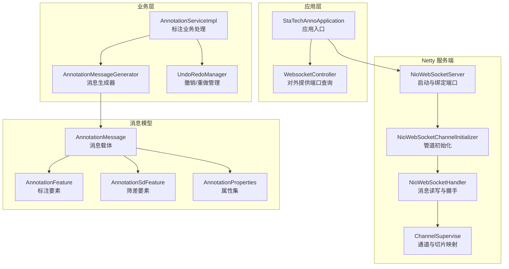
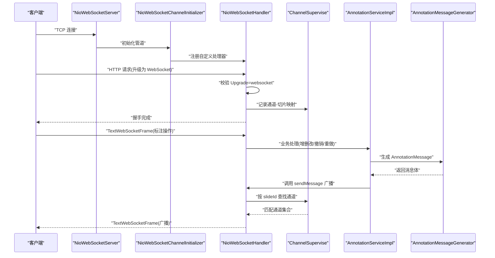
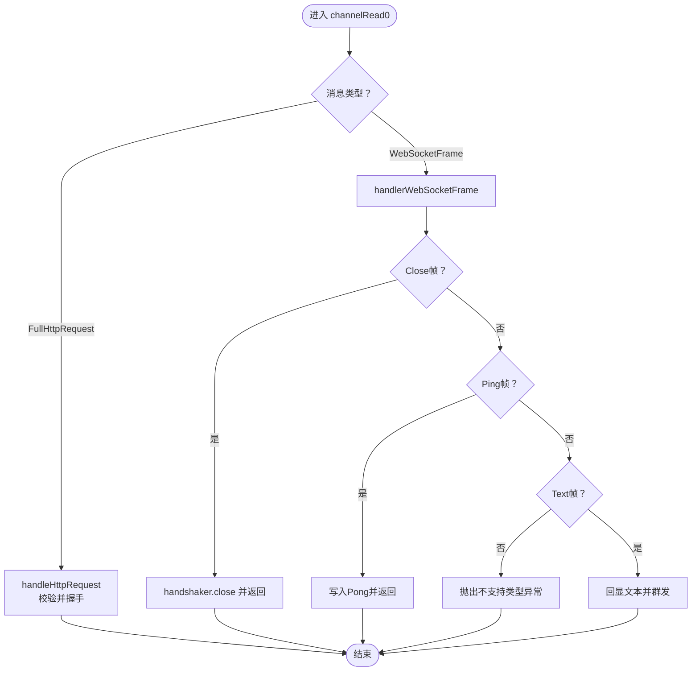
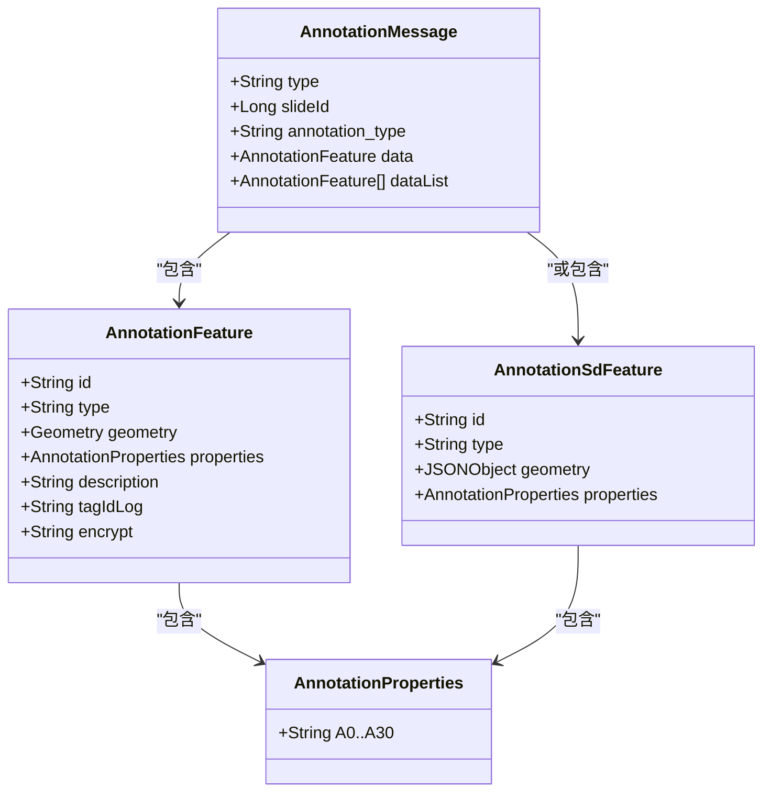
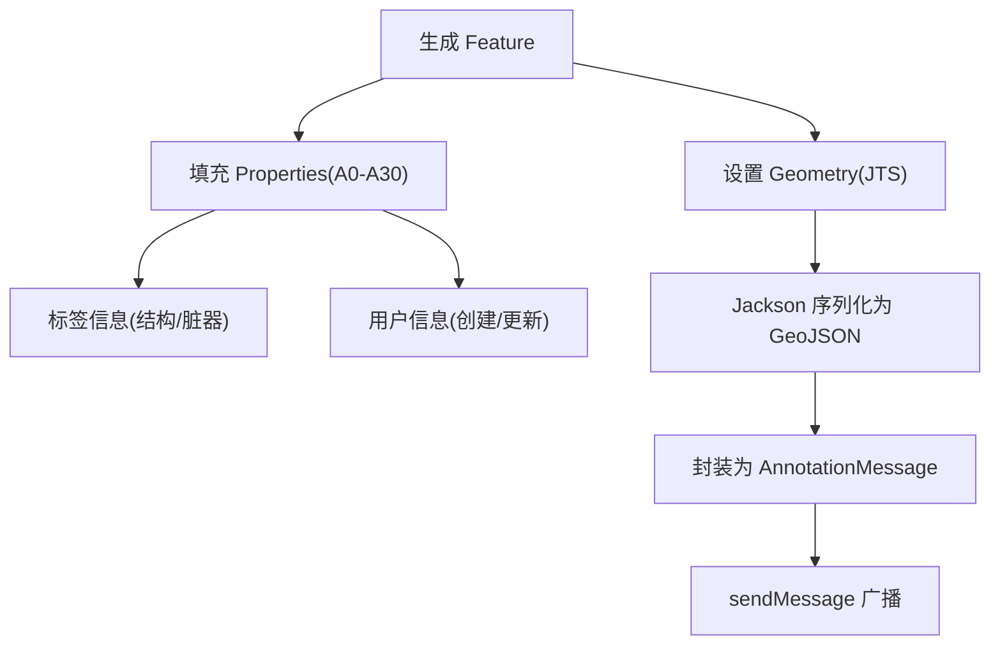
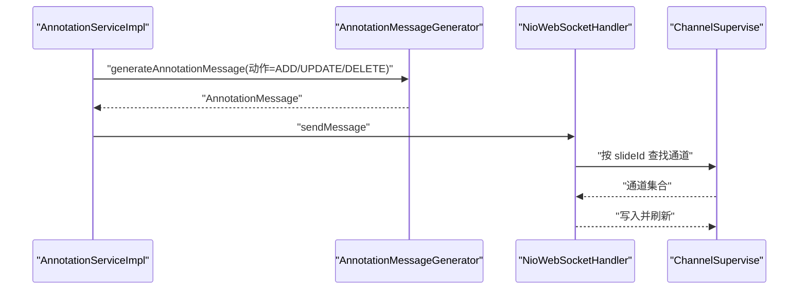
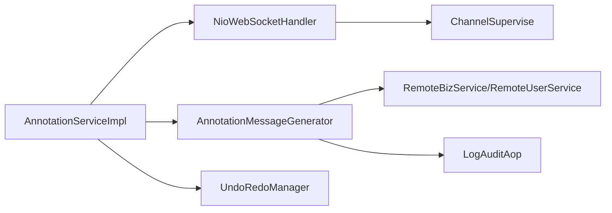

# 消息处理系统

<cite>
**本文引用的文件**
- [NioWebSocketHandler.java](file://src/main/java/cn/staitech/annotation/netty/websocket/NioWebSocketHandler.java)
- [NioWebSocketServer.java](file://src/main/java/cn/staitech/annotation/netty/websocket/NioWebSocketServer.java)
- [NioWebSocketChannelInitializer.java](file://src/main/java/cn/staitech/annotation/netty/websocket/NioWebSocketChannelInitializer.java)
- [ChannelSupervise.java](file://src/main/java/cn/staitech/annotation/netty/global/ChannelSupervise.java)
- [AnnotationMessage.java](file://src/main/java/cn/staitech/annotation/netty/message/AnnotationMessage.java)
- [AnnotationFeature.java](file://src/main/java/cn/staitech/annotation/netty/message/AnnotationFeature.java)
- [AnnotationSdFeature.java](file://src/main/java/cn/staitech/annotation/netty/message/AnnotationSdFeature.java)
- [AnnotationProperties.java](file://src/main/java/cn/staitech/annotation/netty/message/AnnotationProperties.java)
- [AnnotationMessageGenerator.java](file://src/main/java/cn/staitech/annotation/utils/annotation/AnnotationMessageGenerator.java)
- [AnnotationServiceImpl.java](file://src/main/java/cn/staitech/annotation/service/impl/AnnotationServiceImpl.java)
- [WebsocketController.java](file://src/main/java/cn/staitech/annotation/controller/WebsocketController.java)
- [StaTechAnnoApplication.java](file://src/main/java/cn/staitech/annotation/StaTechAnnoApplication.java)
- [bootstrap.yml](file://src/main/resources/bootstrap.yml)
- [UndoRedoManager.java](file://src/main/java/cn/staitech/annotation/utils/annotation/UndoRedoManager.java)
</cite>

## 目录
1. [简介](#简介)
2. [项目结构](#项目结构)
3. [核心组件](#核心组件)
4. [架构总览](#架构总览)
5. [详细组件分析](#详细组件分析)
6. [依赖分析](#依赖分析)
7. [性能考虑](#性能考虑)
8. [故障排查指南](#故障排查指南)
9. [结论](#结论)
10. [附录](#附录)

## 简介
本文件面向消息处理系统，围绕 Netty WebSocket 实现，系统性梳理从连接建立、消息接收、业务处理到响应发送的完整生命周期；深入解析 AnnotationMessage 消息格式设计与序列化机制；阐述标注创建、更新、删除、撤销/重做等消息类型的处理策略；详解 AnnotationFeature 与 AnnotationSdFeature 的数据结构及地理空间数据的序列化/反序列化；并给出消息路由、负载均衡、消息队列与异步处理建议，以及性能优化、错误恢复与监控告警配置要点。

## 项目结构
系统采用 Spring Boot + Netty 的组合：应用入口负责装配与扫描，Netty 提供 WebSocket 服务端，消息编解码通过 Jackson 与 FastJSON 完成，业务层通过 UndoRedoManager 维护撤销/重做历史，最终通过 WebSocket 广播至同切片内的所有客户端。

图表来源
- [StaTechAnnoApplication.java:25-50](file://src/main/java/cn/staitech/annotation/StaTechAnnoApplication.java#L25-L50)
- [NioWebSocketServer.java:14-43](file://src/main/java/cn/staitech/annotation/netty/websocket/NioWebSocketServer.java#L14-L43)
- [NioWebSocketChannelInitializer.java:13-28](file://src/main/java/cn/staitech/annotation/netty/websocket/NioWebSocketChannelInitializer.java#L13-L28)
- [NioWebSocketHandler.java:29-196](file://src/main/java/cn/staitech/annotation/netty/websocket/NioWebSocketHandler.java#L29-L196)
- [ChannelSupervise.java:17-44](file://src/main/java/cn/staitech/annotation/netty/global/ChannelSupervise.java#L17-L44)
- [AnnotationMessage.java:14-27](file://src/main/java/cn/staitech/annotation/netty/message/AnnotationMessage.java#L14-L27)
- [AnnotationFeature.java:14-32](file://src/main/java/cn/staitech/annotation/netty/message/AnnotationFeature.java#L14-L32)
- [AnnotationSdFeature.java:10-15](file://src/main/java/cn/staitech/annotation/netty/message/AnnotationSdFeature.java#L10-L15)
- [AnnotationProperties.java:12-74](file://src/main/java/cn/staitech/annotation/netty/message/AnnotationProperties.java#L12-L74)
- [AnnotationMessageGenerator.java:38-50](file://src/main/java/cn/staitech/annotation/utils/annotation/AnnotationMessageGenerator.java#L38-L50)
- [AnnotationServiceImpl.java:46-60](file://src/main/java/cn/staitech/annotation/service/impl/AnnotationServiceImpl.java#L46-L60)
- [UndoRedoManager.java:19-94](file://src/main/java/cn/staitech/annotation/utils/annotation/UndoRedoManager.java#L19-L94)

章节来源
- [StaTechAnnoApplication.java:25-50](file://src/main/java/cn/staitech/annotation/StaTechAnnoApplication.java#L25-L50)
- [bootstrap.yml:1-42](file://src/main/resources/bootstrap.yml#L1-L42)

## 核心组件
- Netty 服务端与通道管理
  - NioWebSocketServer：启动 NIO 事件循环组，绑定端口，启动服务。
  - NioWebSocketChannelInitializer：配置 HTTP 编解码器、聚合器、分块写处理器与自定义处理器。
  - NioWebSocketHandler：实现握手、消息读取、文本帧处理、心跳 ping/pong、通道生命周期管理与广播。
  - ChannelSupervise：维护全局通道组与“通道-切片ID”映射，支持按切片广播。
- 消息模型
  - AnnotationMessage：消息头（type、slideId、annotation_type），消息体（data 或 dataList）。
  - AnnotationFeature：要素标识、类型、几何、属性、日志字段。
  - AnnotationSdFeature：筛差要素（JSON 几何）。
  - AnnotationProperties：统一属性容器，承载标注元信息与标签/用户映射。
- 业务与消息生成
  - AnnotationMessageGenerator：根据 Annotation 生成 Feature 与 Properties，注入加密标记，构造 AnnotationMessage。
  - AnnotationServiceImpl：标注 CRUD、几何运算、批量处理、撤销/重做、WebSocket 广播。
  - UndoRedoManager：按用户+切片维度维护可序列化的撤销/重做栈，支持定时清理。

章节来源
- [NioWebSocketServer.java:14-43](file://src/main/java/cn/staitech/annotation/netty/websocket/NioWebSocketServer.java#L14-L43)
- [NioWebSocketChannelInitializer.java:13-28](file://src/main/java/cn/staitech/annotation/netty/websocket/NioWebSocketChannelInitializer.java#L13-L28)
- [NioWebSocketHandler.java:29-196](file://src/main/java/cn/staitech/annotation/netty/websocket/NioWebSocketHandler.java#L29-L196)
- [ChannelSupervise.java:17-44](file://src/main/java/cn/staitech/annotation/netty/global/ChannelSupervise.java#L17-L44)
- [AnnotationMessage.java:14-27](file://src/main/java/cn/staitech/annotation/netty/message/AnnotationMessage.java#L14-L27)
- [AnnotationFeature.java:14-32](file://src/main/java/cn/staitech/annotation/netty/message/AnnotationFeature.java#L14-L32)
- [AnnotationSdFeature.java:10-15](file://src/main/java/cn/staitech/annotation/netty/message/AnnotationSdFeature.java#L10-L15)
- [AnnotationProperties.java:12-74](file://src/main/java/cn/staitech/annotation/netty/message/AnnotationProperties.java#L12-L74)
- [AnnotationMessageGenerator.java:38-50](file://src/main/java/cn/staitech/annotation/utils/annotation/AnnotationMessageGenerator.java#L38-L50)
- [AnnotationServiceImpl.java:46-60](file://src/main/java/cn/staitech/annotation/service/impl/AnnotationServiceImpl.java#L46-L60)
- [UndoRedoManager.java:19-94](file://src/main/java/cn/staitech/annotation/utils/annotation/UndoRedoManager.java#L19-L94)

## 架构总览
系统以 Netty 作为 WebSocket 传输层，Spring 管理业务与消息生成，消息通过 Jackson/FastJSON 序列化为文本帧，按切片维度进行广播。业务侧通过 UndoRedoManager 维护历史状态，支持撤销/重做。

图表来源
- [NioWebSocketServer.java:19-31](file://src/main/java/cn/staitech/annotation/netty/websocket/NioWebSocketServer.java#L19-L31)
- [NioWebSocketChannelInitializer.java:15-26](file://src/main/java/cn/staitech/annotation/netty/websocket/NioWebSocketChannelInitializer.java#L15-L26)
- [NioWebSocketHandler.java:94-194](file://src/main/java/cn/staitech/annotation/netty/websocket/NioWebSocketHandler.java#L94-L194)
- [ChannelSupervise.java:33-43](file://src/main/java/cn/staitech/annotation/netty/global/ChannelSupervise.java#L33-L43)
- [AnnotationServiceImpl.java:236-237](file://src/main/java/cn/staitech/annotation/service/impl/AnnotationServiceImpl.java#L236-L237)
- [AnnotationMessageGenerator.java:40-50](file://src/main/java/cn/staitech/annotation/utils/annotation/AnnotationMessageGenerator.java#L40-L50)

## 详细组件分析

### NioWebSocketHandler：连接与消息生命周期
- 握手与连接建立
  - 处理 HTTP 升级请求，校验 Upgrade 头，创建 WebSocketServerHandshaker，记录通道与切片映射。
- 消息接收与处理
  - 识别 FullHttpRequest 与 WebSocketFrame；仅支持文本帧；对 Close/Ping 帧分别处理。
  - 将收到的文本帧回显并广播给所有连接（群发）。
- 发送与路由
  - sendMessage 将 AnnotationMessage 序列化为 JSON 文本，按 slideId 在 CHANNEL_MAP 中查找目标通道并发送。
- 生命周期管理
  - channelActive/channelInactive：加入/移除通道与测试通道映射。
- 错误处理
  - 对非文本帧抛出不支持的操作异常；序列化失败记录错误日志。

图表来源
- [NioWebSocketHandler.java:94-162](file://src/main/java/cn/staitech/annotation/netty/websocket/NioWebSocketHandler.java#L94-L162)

章节来源
- [NioWebSocketHandler.java:29-196](file://src/main/java/cn/staitech/annotation/netty/websocket/NioWebSocketHandler.java#L29-L196)
- [ChannelSupervise.java:17-44](file://src/main/java/cn/staitech/annotation/netty/global/ChannelSupervise.java#L17-L44)

### AnnotationMessage 消息格式设计
- 消息头
  - type：事件类型（如新增、更新、删除、撤销、重做）。
  - slideId：切片标识，用于路由到对应会话组。
  - annotation_type：标注类型（如 Draw/AI/Measure）。
- 消息体
  - data：单个要素（AnnotationFeature 或 AnnotationSdFeature）。
  - dataList：要素列表（批量场景）。
- 数据序列化
  - 使用 Jackson 将消息对象序列化为 JSON 字符串；失败时记录错误并丢弃。

图表来源
- [AnnotationMessage.java:14-27](file://src/main/java/cn/staitech/annotation/netty/message/AnnotationMessage.java#L14-L27)
- [AnnotationFeature.java:14-32](file://src/main/java/cn/staitech/annotation/netty/message/AnnotationFeature.java#L14-L32)
- [AnnotationSdFeature.java:10-15](file://src/main/java/cn/staitech/annotation/netty/message/AnnotationSdFeature.java#L10-L15)
- [AnnotationProperties.java:12-74](file://src/main/java/cn/staitech/annotation/netty/message/AnnotationProperties.java#L12-L74)

章节来源
- [AnnotationMessage.java:14-27](file://src/main/java/cn/staitech/annotation/netty/message/AnnotationMessage.java#L14-L27)
- [AnnotationFeature.java:14-32](file://src/main/java/cn/staitech/annotation/netty/message/AnnotationFeature.java#L14-L32)
- [AnnotationSdFeature.java:10-15](file://src/main/java/cn/staitech/annotation/netty/message/AnnotationSdFeature.java#L10-L15)
- [AnnotationProperties.java:12-74](file://src/main/java/cn/staitech/annotation/netty/message/AnnotationProperties.java#L12-L74)

### 地理空间数据的序列化与反序列化
- AnnotationFeature.geometry 使用 JTS Geometry，通过 Jackson 序列化为 GeoJSON 几何对象。
- AnnotationSdFeature.geometry 使用 FastJSON 的 JSONObject，便于跨系统兼容与传输。
- AnnotationMessageGenerator 在生成 Feature 时，将标签与用户信息注入 Properties，同时对敏感字段进行加密标记。

图表来源
- [AnnotationMessageGenerator.java:52-88](file://src/main/java/cn/staitech/annotation/utils/annotation/AnnotationMessageGenerator.java#L52-L88)
- [AnnotationFeature.java:21-23](file://src/main/java/cn/staitech/annotation/netty/message/AnnotationFeature.java#L21-L23)
- [AnnotationSdFeature.java:13-14](file://src/main/java/cn/staitech/annotation/netty/message/AnnotationSdFeature.java#L13-L14)
- [AnnotationMessage.java:22-24](file://src/main/java/cn/staitech/annotation/netty/message/AnnotationMessage.java#L22-L24)

章节来源
- [AnnotationMessageGenerator.java:52-88](file://src/main/java/cn/staitech/annotation/utils/annotation/AnnotationMessageGenerator.java#L52-L88)
- [AnnotationFeature.java:21-23](file://src/main/java/cn/staitech/annotation/netty/message/AnnotationFeature.java#L21-L23)
- [AnnotationSdFeature.java:13-14](file://src/main/java/cn/staitech/annotation/netty/message/AnnotationSdFeature.java#L13-L14)

### 不同消息类型的处理策略
- 新增（ADD）
  - 生成 JSON ID 与标签日志，插入数据库，记录撤销事件，广播 AnnotationMessage。
- 更新（UPDATE）
  - 计算面积/周长，更新历史快照，记录撤销事件，广播更新消息。
- 删除（DELETE）
  - 写入删除归档表，删除主表记录，记录撤销事件，广播删除消息。
- 撤销/重做（UNDO/REDO）
  - 依据 UndoRedoManager 栈顶事件回放历史/未来状态，逐条执行 ADD/UPDATE/DELETE。
- 批量处理（BATCH）
  - 逐条执行 UPDATE/DELETE，收集 UndoRedoDetail，一次性入栈。

图表来源
- [AnnotationServiceImpl.java:224-237](file://src/main/java/cn/staitech/annotation/service/impl/AnnotationServiceImpl.java#L224-L237)
- [AnnotationServiceImpl.java:285-297](file://src/main/java/cn/staitech/annotation/service/impl/AnnotationServiceImpl.java#L285-L297)
- [AnnotationServiceImpl.java:390-394](file://src/main/java/cn/staitech/annotation/service/impl/AnnotationServiceImpl.java#L390-L394)
- [AnnotationMessageGenerator.java:40-50](file://src/main/java/cn/staitech/annotation/utils/annotation/AnnotationMessageGenerator.java#L40-L50)
- [NioWebSocketHandler.java:38-68](file://src/main/java/cn/staitech/annotation/netty/websocket/NioWebSocketHandler.java#L38-L68)
- [ChannelSupervise.java:37-43](file://src/main/java/cn/staitech/annotation/netty/global/ChannelSupervise.java#L37-L43)

章节来源
- [AnnotationServiceImpl.java:184-238](file://src/main/java/cn/staitech/annotation/service/impl/AnnotationServiceImpl.java#L184-L238)
- [AnnotationServiceImpl.java:267-300](file://src/main/java/cn/staitech/annotation/service/impl/AnnotationServiceImpl.java#L267-L300)
- [AnnotationServiceImpl.java:329-440](file://src/main/java/cn/staitech/annotation/service/impl/AnnotationServiceImpl.java#L329-L440)
- [AnnotationServiceImpl.java:677-701](file://src/main/java/cn/staitech/annotation/service/impl/AnnotationServiceImpl.java#L677-L701)

### 消息路由、负载均衡与异步处理
- 消息路由
  - 通过 slideId 在 CHANNEL_MAP 中定位目标通道，实现按切片广播。
- 负载均衡
  - 当前实现为单机多连接广播；若需水平扩展，可在网关层引入一致性哈希或基于 Redis 的分布式会话路由。
- 消息队列与异步
  - 可在业务层引入异步消息队列（如 RocketMQ/RabbitMQ），将“标注变更”入队，消费者异步落库与广播，降低主流程阻塞。
- 异步处理模式
  - Spring 已启用异步注解开关，可在关键耗时操作（远程标签查询、用户查询）使用异步执行。

章节来源
- [ChannelSupervise.java:19-43](file://src/main/java/cn/staitech/annotation/netty/global/ChannelSupervise.java#L19-L43)
- [NioWebSocketHandler.java:56-65](file://src/main/java/cn/staitech/annotation/netty/websocket/NioWebSocketHandler.java#L56-L65)
- [StaTechAnnoApplication.java:31-33](file://src/main/java/cn/staitech/annotation/StaTechAnnoApplication.java#L31-L33)

## 依赖分析
- 组件耦合
  - AnnotationServiceImpl 依赖 NioWebSocketHandler 进行广播，依赖 AnnotationMessageGenerator 生成消息，依赖 UndoRedoManager 维护历史。
  - NioWebSocketHandler 依赖 ChannelSupervise 进行通道管理与广播。
  - AnnotationMessageGenerator 依赖远程服务查询标签与用户信息，依赖日志审计组件进行字段加密标记。
- 外部依赖
  - Netty、Jackson、FastJSON、JTS、Spring Cloud（Nacos）、MyBatis Plus。

图表来源
- [AnnotationServiceImpl.java:49-60](file://src/main/java/cn/staitech/annotation/service/impl/AnnotationServiceImpl.java#L49-L60)
- [NioWebSocketHandler.java:31-32](file://src/main/java/cn/staitech/annotation/netty/websocket/NioWebSocketHandler.java#L31-L32)
- [AnnotationMessageGenerator.java:14-22](file://src/main/java/cn/staitech/annotation/utils/annotation/AnnotationMessageGenerator.java#L14-L22)
- [UndoRedoManager.java:19-22](file://src/main/java/cn/staitech/annotation/utils/annotation/UndoRedoManager.java#L19-L22)

章节来源
- [AnnotationServiceImpl.java:49-60](file://src/main/java/cn/staitech/annotation/service/impl/AnnotationServiceImpl.java#L49-L60)
- [NioWebSocketHandler.java:31-32](file://src/main/java/cn/staitech/annotation/netty/websocket/NioWebSocketHandler.java#L31-L32)
- [AnnotationMessageGenerator.java:14-22](file://src/main/java/cn/staitech/annotation/utils/annotation/AnnotationMessageGenerator.java#L14-L22)
- [UndoRedoManager.java:19-22](file://src/main/java/cn/staitech/annotation/utils/annotation/UndoRedoManager.java#L19-L22)

## 性能考虑
- 序列化性能
  - 优先使用 Jackson 对 Geometry 进行流式序列化；对大批量要素使用 dataList 分批发送，避免单帧过大。
- 广播效率
  - 使用 ChannelGroup 进行群发；按 slideId 进行局部广播，减少无效转发。
- 异步化
  - 标注变更入队异步处理，避免阻塞 Netty I/O 线程；对远程标签/用户查询使用异步调用。
- 资源管理
  - 合理配置 Netty EventLoop 数量与线程池大小；及时关闭非 Keep-Alive 连接。
- 地理空间计算
  - 对复杂几何运算（合并、差集）进行缓存与采样，避免重复计算。

## 故障排查指南
- 握手失败
  - 检查请求头 Upgrade 是否为 websocket；确认工厂创建与握手是否成功。
- 非文本帧
  - 仅支持 TextWebSocketFrame；二进制帧会被拒绝。
- 序列化失败
  - AnnotationMessage 的序列化异常会记录错误日志；检查消息体完整性与字段类型。
- 广播无响应
  - 确认 CHANNEL_MAP 中是否存在目标 slideId 的通道；检查通道状态是否活跃。
- 撤销/重做异常
  - 检查 UndoRedoManager 栈状态与事件详情；确保历史快照正确保存。

章节来源
- [NioWebSocketHandler.java:167-194](file://src/main/java/cn/staitech/annotation/netty/websocket/NioWebSocketHandler.java#L167-L194)
- [NioWebSocketHandler.java:149-152](file://src/main/java/cn/staitech/annotation/netty/websocket/NioWebSocketHandler.java#L149-L152)
- [NioWebSocketHandler.java:46-54](file://src/main/java/cn/staitech/annotation/netty/websocket/NioWebSocketHandler.java#L46-L54)
- [ChannelSupervise.java:37-43](file://src/main/java/cn/staitech/annotation/netty/global/ChannelSupervise.java#L37-L43)
- [UndoRedoManager.java:66-77](file://src/main/java/cn/staitech/annotation/utils/annotation/UndoRedoManager.java#L66-L77)

## 结论
该消息处理系统以 Netty 为核心，结合 Spring 生态与地理空间库，实现了标注数据的实时广播与交互。通过 AnnotationMessage 统一消息格式与 AnnotationMessageGenerator 规范化生成流程，配合 UndoRedoManager 的历史管理，满足了标注业务的高并发与可追溯需求。后续可在消息队列、分布式路由与异步化方面进一步增强系统弹性与吞吐能力。

## 附录
- 端口配置
  - 应用端口与 Netty 端口由配置文件提供；可通过 WebsocketController 接口获取 WebSocket 地址。
- 开启异步
  - 应用已启用异步注解，便于在业务层扩展异步处理能力。

章节来源
- [bootstrap.yml:1-42](file://src/main/resources/bootstrap.yml#L1-L42)
- [WebsocketController.java:24-37](file://src/main/java/cn/staitech/annotation/controller/WebsocketController.java#L24-L37)
- [StaTechAnnoApplication.java:31-33](file://src/main/java/cn/staitech/annotation/StaTechAnnoApplication.java#L31-L33)