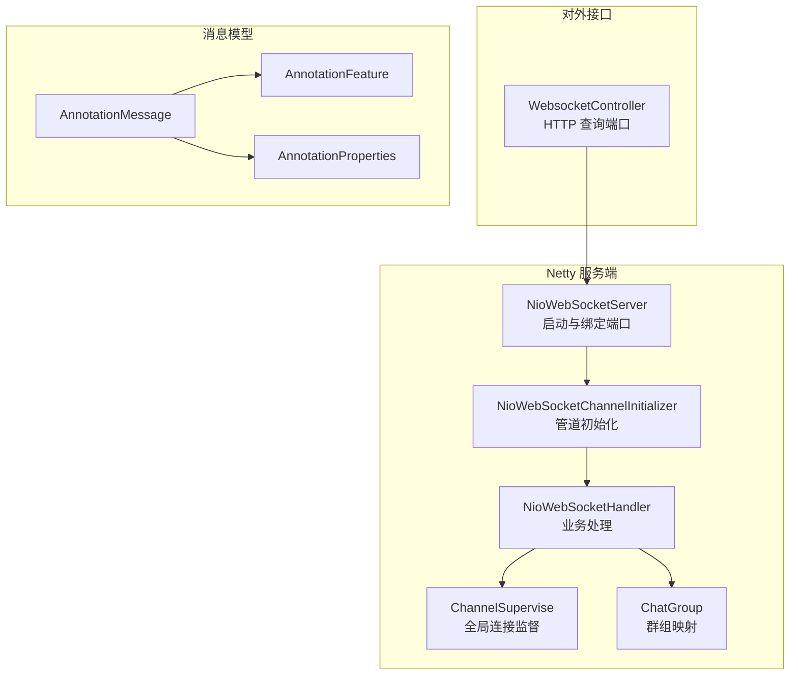
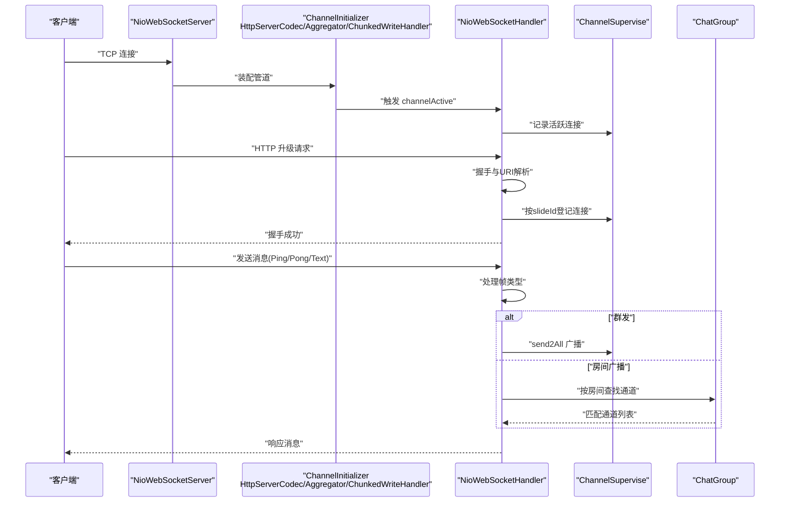
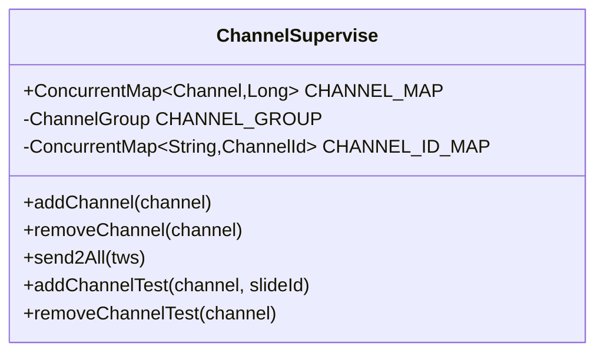
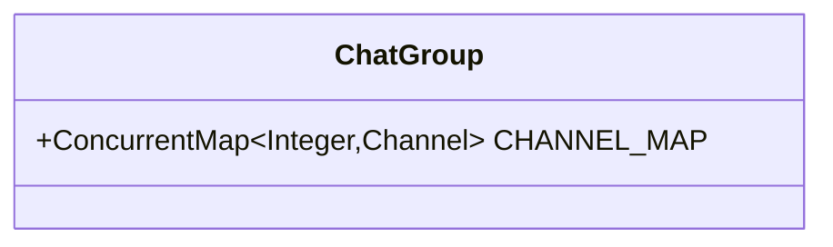
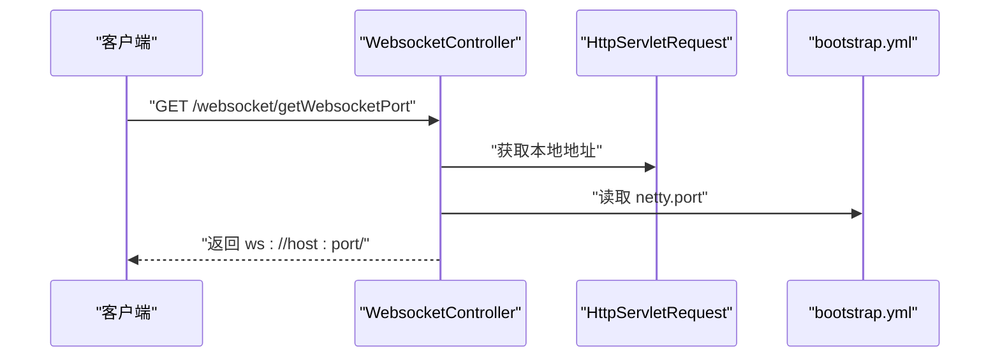
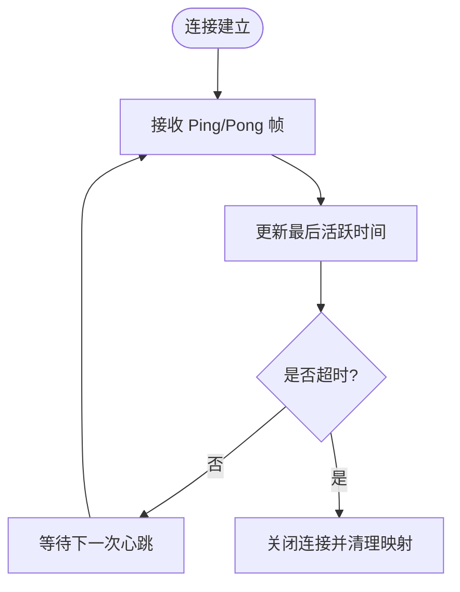
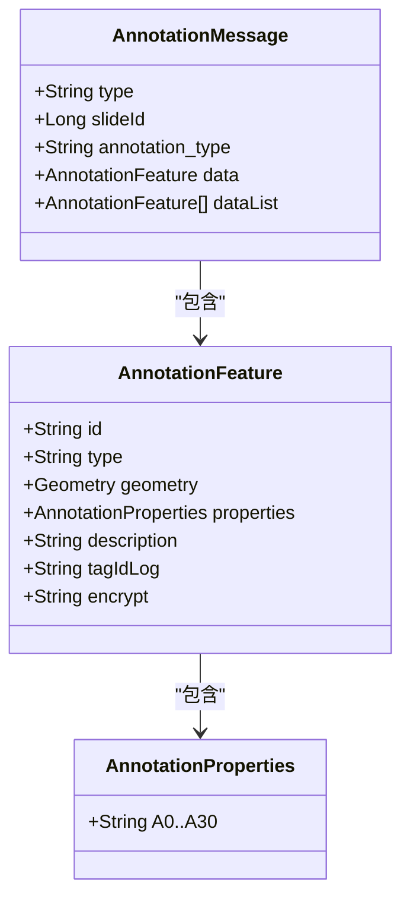
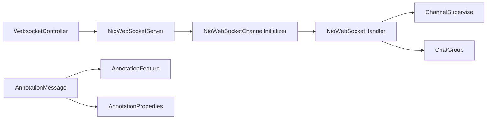

# 连接管理与状态同步

<cite>
**本文引用的文件**
- [ChannelSupervise.java](file://src/main/java/cn/staitech/annotation/netty/global/ChannelSupervise.java)
- [ChatGroup.java](file://src/main/java/cn/staitech/annotation/netty/global/ChatGroup.java)
- [NioWebSocketHandler.java](file://src/main/java/cn/staitech/annotation/netty/websocket/NioWebSocketHandler.java)
- [NioWebSocketServer.java](file://src/main/java/cn/staitech/annotation/netty/websocket/NioWebSocketServer.java)
- [NioWebSocketChannelInitializer.java](file://src/main/java/cn/staitech/annotation/netty/websocket/NioWebSocketChannelInitializer.java)
- [WebsocketController.java](file://src/main/java/cn/staitech/annotation/controller/WebsocketController.java)
- [AnnotationMessage.java](file://src/main/java/cn/staitech/annotation/netty/message/AnnotationMessage.java)
- [AnnotationFeature.java](file://src/main/java/cn/staitech/annotation/netty/message/AnnotationFeature.java)
- [AnnotationProperties.java](file://src/main/java/cn/staitech/annotation/netty/message/AnnotationProperties.java)
- [bootstrap.yml](file://src/main/resources/bootstrap.yml)
- [StaTechAnnoApplication.java](file://src/main/java/cn/staitech/annotation/StaTechAnnoApplication.java)
- [README.md](file://README.md)
</cite>

## 目录
1. [引言](#引言)
2. [项目结构](#项目结构)
3. [核心组件](#核心组件)
4. [架构总览](#架构总览)
5. [详细组件分析](#详细组件分析)
6. [依赖分析](#依赖分析)
7. [性能考虑](#性能考虑)
8. [故障排查指南](#故障排查指南)
9. [结论](#结论)
10. [附录](#附录)

## 引言
本文件围绕连接管理与状态同步展开，重点解析以下主题：
- ChannelSupervise 连接监督机制：活跃连接跟踪、连接状态维护、断线检测与自动重连策略建议
- ChatGroup 群组管理功能：用户分组、房间管理、权限控制与消息广播机制
- WebSocketController 的 HTTP 接口设计：连接建立、用户认证、房间加入与状态查询等 REST API
- 用户在线状态管理：心跳检测、超时处理、并发连接限制与资源清理策略
- 连接池管理、负载均衡配置、集群部署方案与高可用保障措施
- 连接监控指标、性能调优参数与故障恢复机制

## 项目结构
该模块采用 Netty + Spring Boot 架构，核心目录组织如下：
- netty/global：全局连接与群组管理（ChannelSupervise、ChatGroup）
- netty/websocket：Netty WebSocket 服务端实现（Server、ChannelInitializer、Handler）
- netty/message：消息模型（AnnotationMessage、AnnotationFeature、AnnotationProperties）
- controller：对外 HTTP 接口（WebsocketController）
- resources：应用配置（bootstrap.yml）、国际化资源等
- 启动入口：StaTechAnnoApplication

图表来源
- [NioWebSocketServer.java:14-41](file://src/main/java/cn/staitech/annotation/netty/websocket/NioWebSocketServer.java#L14-L41)
- [NioWebSocketChannelInitializer.java:13-28](file://src/main/java/cn/staitech/annotation/netty/websocket/NioWebSocketChannelInitializer.java#L13-L28)
- [NioWebSocketHandler.java:29-196](file://src/main/java/cn/staitech/annotation/netty/websocket/NioWebSocketHandler.java#L29-L196)
- [ChannelSupervise.java:17-44](file://src/main/java/cn/staitech/annotation/netty/global/ChannelSupervise.java#L17-L44)
- [ChatGroup.java:8-10](file://src/main/java/cn/staitech/annotation/netty/global/ChatGroup.java#L8-L10)
- [WebsocketController.java:20-40](file://src/main/java/cn/staitech/annotation/controller/WebsocketController.java#L20-L40)
- [AnnotationMessage.java:14-27](file://src/main/java/cn/staitech/annotation/netty/message/AnnotationMessage.java#L14-L27)
- [AnnotationFeature.java:14-32](file://src/main/java/cn/staitech/annotation/netty/message/AnnotationFeature.java#L14-L32)
- [AnnotationProperties.java:11-74](file://src/main/java/cn/staitech/annotation/netty/message/AnnotationProperties.java#L11-L74)

章节来源
- [NioWebSocketServer.java:14-41](file://src/main/java/cn/staitech/annotation/netty/websocket/NioWebSocketServer.java#L14-L41)
- [NioWebSocketChannelInitializer.java:13-28](file://src/main/java/cn/staitech/annotation/netty/websocket/NioWebSocketChannelInitializer.java#L13-L28)
- [NioWebSocketHandler.java:29-196](file://src/main/java/cn/staitech/annotation/netty/websocket/NioWebSocketHandler.java#L29-L196)
- [ChannelSupervise.java:17-44](file://src/main/java/cn/staitech/annotation/netty/global/ChannelSupervise.java#L17-L44)
- [ChatGroup.java:8-10](file://src/main/java/cn/staitech/annotation/netty/global/ChatGroup.java#L8-L10)
- [WebsocketController.java:20-40](file://src/main/java/cn/staitech/annotation/controller/WebsocketController.java#L20-L40)
- [AnnotationMessage.java:14-27](file://src/main/java/cn/staitech/annotation/netty/message/AnnotationMessage.java#L14-L27)
- [AnnotationFeature.java:14-32](file://src/main/java/cn/staitech/annotation/netty/message/AnnotationFeature.java#L14-L32)
- [AnnotationProperties.java:11-74](file://src/main/java/cn/staitech/annotation/netty/message/AnnotationProperties.java#L11-L74)

## 核心组件
- ChannelSupervise：全局连接监督，维护活跃连接集合、按幻灯片 ID 分组的连接映射、通道 ID 映射，并提供全量广播能力
- ChatGroup：按房间/群组维度的通道映射，便于房间级消息广播与权限控制扩展
- NioWebSocketHandler：握手、消息编解码、心跳（Ping/Pong）处理、群发与单播逻辑
- NioWebSocketServer：Netty 服务端启动、事件循环组配置、端口绑定与生命周期管理
- NioWebSocketChannelInitializer：HTTP 解码器链与 WebSocket 处理器装配
- WebsocketController：对外提供查询 WebSocket 端口的 HTTP 接口
- AnnotationMessage/AnnotationFeature/AnnotationProperties：标注消息的数据模型

章节来源
- [ChannelSupervise.java:17-44](file://src/main/java/cn/staitech/annotation/netty/global/ChannelSupervise.java#L17-L44)
- [ChatGroup.java:8-10](file://src/main/java/cn/staitech/annotation/netty/global/ChatGroup.java#L8-L10)
- [NioWebSocketHandler.java:29-196](file://src/main/java/cn/staitech/annotation/netty/websocket/NioWebSocketHandler.java#L29-L196)
- [NioWebSocketServer.java:14-41](file://src/main/java/cn/staitech/annotation/netty/websocket/NioWebSocketServer.java#L14-L41)
- [NioWebSocketChannelInitializer.java:13-28](file://src/main/java/cn/staitech/annotation/netty/websocket/NioWebSocketChannelInitializer.java#L13-L28)
- [WebsocketController.java:20-40](file://src/main/java/cn/staitech/annotation/controller/WebsocketController.java#L20-L40)
- [AnnotationMessage.java:14-27](file://src/main/java/cn/staitech/annotation/netty/message/AnnotationMessage.java#L14-L27)
- [AnnotationFeature.java:14-32](file://src/main/java/cn/staitech/annotation/netty/message/AnnotationFeature.java#L14-L32)
- [AnnotationProperties.java:11-74](file://src/main/java/cn/staitech/annotation/netty/message/AnnotationProperties.java#L11-L74)

## 架构总览
下图展示从客户端到服务端的完整交互路径，以及消息广播与房间管理的协作关系。

图表来源
- [NioWebSocketServer.java:19-31](file://src/main/java/cn/staitech/annotation/netty/websocket/NioWebSocketServer.java#L19-L31)
- [NioWebSocketChannelInitializer.java:15-26](file://src/main/java/cn/staitech/annotation/netty/websocket/NioWebSocketChannelInitializer.java#L15-L26)
- [NioWebSocketHandler.java:94-194](file://src/main/java/cn/staitech/annotation/netty/websocket/NioWebSocketHandler.java#L94-L194)
- [ChannelSupervise.java:23-35](file://src/main/java/cn/staitech/annotation/netty/global/ChannelSupervise.java#L23-L35)
- [ChatGroup.java:8-10](file://src/main/java/cn/staitech/annotation/netty/global/ChatGroup.java#L8-L10)

## 详细组件分析

### ChannelSupervise 连接监督机制
- 活跃连接跟踪：通过全局通道组维护所有活跃连接，并记录通道 ID 映射，便于快速定位与清理
- 连接状态维护：在连接建立与断开时分别登记与移除，确保状态一致性
- 断线检测：基于 Netty 的 channelInactive 回调，自动清理连接与按幻灯片 ID 的映射
- 自动重连策略建议：当前未实现自动重连逻辑，可在握手阶段或业务层引入指数退避与最大重试次数，结合心跳与超时阈值实现

图表来源
- [ChannelSupervise.java:17-44](file://src/main/java/cn/staitech/annotation/netty/global/ChannelSupervise.java#L17-L44)

章节来源
- [ChannelSupervise.java:17-44](file://src/main/java/cn/staitech/annotation/netty/global/ChannelSupervise.java#L17-L44)
- [NioWebSocketHandler.java:108-121](file://src/main/java/cn/staitech/annotation/netty/websocket/NioWebSocketHandler.java#L108-L121)

### ChatGroup 群组管理功能
- 用户分组：通过房间/群组键到 Channel 的映射，实现房间级消息广播
- 房间管理：可扩展为房间创建、加入、离开等操作；当前具备基础映射结构
- 权限控制：可在房间维度增加鉴权与角色校验，结合业务上下文实现细粒度权限
- 消息广播机制：结合 ChannelSupervise 的全量广播与 ChatGroup 的房间广播，形成两级广播策略

图表来源
- [ChatGroup.java:8-10](file://src/main/java/cn/staitech/annotation/netty/global/ChatGroup.java#L8-L10)

章节来源
- [ChatGroup.java:8-10](file://src/main/java/cn/staitech/annotation/netty/global/ChatGroup.java#L8-L10)
- [NioWebSocketHandler.java:123-130](file://src/main/java/cn/staitech/annotation/netty/websocket/NioWebSocketHandler.java#L123-L130)

### WebSocketController 的 HTTP 接口设计
- 连接建立：通过查询 WebSocket 端口，前端拼接 ws://host:port/.../slide/{slideId} 完成握手
- 用户认证：当前接口未包含认证逻辑，建议在握手前或业务消息中引入令牌校验
- 房间加入：通过 URI 路径参数区分连接类型（如 slide），并在握手时登记到按幻灯片 ID 的连接映射
- 状态查询：可扩展提供在线人数、房间占用情况等查询接口

图表来源
- [WebsocketController.java:27-37](file://src/main/java/cn/staitech/annotation/controller/WebsocketController.java#L27-L37)
- [bootstrap.yml:16-17](file://src/main/resources/bootstrap.yml#L16-L17)

章节来源
- [WebsocketController.java:20-40](file://src/main/java/cn/staitech/annotation/controller/WebsocketController.java#L20-L40)
- [bootstrap.yml:1-42](file://src/main/resources/bootstrap.yml#L1-L42)

### 用户在线状态管理
- 心跳检测：Handler 已支持 Ping/Pong 帧，客户端需定期发送 Ping 以维持连接
- 超时处理：当前未实现超时断开逻辑，建议在业务层维护 lastReadTime 并结合定时任务清理长时间无活动连接
- 并发连接限制：可通过房间维度或用户维度设置上限，超过阈值拒绝新连接
- 资源清理策略：在 channelInactive 中统一清理 CHANNEL_MAP、CHANNEL_ID_MAP 与房间映射

图表来源
- [NioWebSocketHandler.java:143-147](file://src/main/java/cn/staitech/annotation/netty/websocket/NioWebSocketHandler.java#L143-L147)
- [ChannelSupervise.java:28-31](file://src/main/java/cn/staitech/annotation/netty/global/ChannelSupervise.java#L28-L31)

章节来源
- [NioWebSocketHandler.java:137-162](file://src/main/java/cn/staitech/annotation/netty/websocket/NioWebSocketHandler.java#L137-L162)
- [ChannelSupervise.java:19-35](file://src/main/java/cn/staitech/annotation/netty/global/ChannelSupervise.java#L19-L35)

### 消息模型与广播流程
- AnnotationMessage：承载消息类型、幻灯片 ID、标注要素与要素列表等
- AnnotationFeature/AnnotationProperties：标注几何与属性结构，支持日志脱敏
- 广播流程：Handler 在收到消息后，根据目标 slideId 在 CHANNEL_MAP 中筛选对应连接并发送；同时可选择全量广播

图表来源
- [AnnotationMessage.java:14-27](file://src/main/java/cn/staitech/annotation/netty/message/AnnotationMessage.java#L14-L27)
- [AnnotationFeature.java:14-32](file://src/main/java/cn/staitech/annotation/netty/message/AnnotationFeature.java#L14-L32)
- [AnnotationProperties.java:11-74](file://src/main/java/cn/staitech/annotation/netty/message/AnnotationProperties.java#L11-L74)

章节来源
- [NioWebSocketHandler.java:38-68](file://src/main/java/cn/staitech/annotation/netty/websocket/NioWebSocketHandler.java#L38-L68)
- [AnnotationMessage.java:14-27](file://src/main/java/cn/staitech/annotation/netty/message/AnnotationMessage.java#L14-L27)
- [AnnotationFeature.java:14-32](file://src/main/java/cn/staitech/annotation/netty/message/AnnotationFeature.java#L14-L32)
- [AnnotationProperties.java:11-74](file://src/main/java/cn/staitech/annotation/netty/message/AnnotationProperties.java#L11-L74)

## 依赖分析
- 组件耦合与内聚：Handler 依赖 ChannelSupervise 与 ChatGroup 实现连接与房间管理；Server 与 ChannelInitializer 负责网络栈装配
- 外部依赖：Netty（网络与协议栈）、Jackson（消息序列化）、Spring Cloud（Nacos 注册与配置中心）

图表来源
- [NioWebSocketHandler.java:29-196](file://src/main/java/cn/staitech/annotation/netty/websocket/NioWebSocketHandler.java#L29-L196)
- [ChannelSupervise.java:17-44](file://src/main/java/cn/staitech/annotation/netty/global/ChannelSupervise.java#L17-L44)
- [ChatGroup.java:8-10](file://src/main/java/cn/staitech/annotation/netty/global/ChatGroup.java#L8-L10)
- [NioWebSocketServer.java:14-41](file://src/main/java/cn/staitech/annotation/netty/websocket/NioWebSocketServer.java#L14-L41)
- [NioWebSocketChannelInitializer.java:13-28](file://src/main/java/cn/staitech/annotation/netty/websocket/NioWebSocketChannelInitializer.java#L13-L28)
- [WebsocketController.java:20-40](file://src/main/java/cn/staitech/annotation/controller/WebsocketController.java#L20-L40)
- [AnnotationMessage.java:14-27](file://src/main/java/cn/staitech/annotation/netty/message/AnnotationMessage.java#L14-L27)
- [AnnotationFeature.java:14-32](file://src/main/java/cn/staitech/annotation/netty/message/AnnotationFeature.java#L14-L32)
- [AnnotationProperties.java:11-74](file://src/main/java/cn/staitech/annotation/netty/message/AnnotationProperties.java#L11-L74)

章节来源
- [NioWebSocketHandler.java:29-196](file://src/main/java/cn/staitech/annotation/netty/websocket/NioWebSocketHandler.java#L29-L196)
- [NioWebSocketServer.java:14-41](file://src/main/java/cn/staitech/annotation/netty/websocket/NioWebSocketServer.java#L14-L41)
- [NioWebSocketChannelInitializer.java:13-28](file://src/main/java/cn/staitech/annotation/netty/websocket/NioWebSocketChannelInitializer.java#L13-L28)
- [WebsocketController.java:20-40](file://src/main/java/cn/staitech/annotation/controller/WebsocketController.java#L20-L40)

## 性能考虑
- 连接池与线程模型：使用 NIO 事件循环组，合理设置 boss/work 线程数以适配 CPU 核心数
- 消息序列化：使用 Jackson，建议开启合适的序列化特性与缓存策略
- 广播策略：全量广播与房间广播结合，避免对非目标用户广播造成带宽浪费
- 超时与心跳：建议在业务层维护心跳时间戳，超时自动断开，降低僵尸连接占用
- 资源清理：在断线回调中清理映射，防止内存泄漏

## 故障排查指南
- 握手失败：检查 HTTP 请求头 Upgrade 是否为 websocket，确认 URI 路径包含连接类型与参数
- 心跳异常：确认客户端定期发送 Ping，服务端正确返回 Pong
- 广播无效：核对 CHANNEL_MAP 与房间映射是否正确登记，目标 slideId 是否一致
- 端口不可达：确认防火墙放行 netty.port，参考项目 README 的端口开放说明

章节来源
- [NioWebSocketHandler.java:167-194](file://src/main/java/cn/staitech/annotation/netty/websocket/NioWebSocketHandler.java#L167-L194)
- [README.md:5-59](file://README.md#L5-L59)

## 结论
本项目通过 ChannelSupervise 与 ChatGroup 实现了连接与房间两级管理，配合 Netty 的高效网络栈与 Spring Boot 的装配能力，提供了清晰的连接生命周期与消息广播路径。建议后续补充自动重连、超时断开、并发限制与权限控制等机制，以满足生产环境的高可用与高性能需求。

## 附录
- 配置项参考
  - netty.port：WebSocket 服务端口
  - spring.cloud.nacos.*：服务注册与配置中心参数
- 端口开放参考：README 中列出的防火墙端口清单

章节来源
- [bootstrap.yml:1-42](file://src/main/resources/bootstrap.yml#L1-L42)
- [README.md:5-59](file://README.md#L5-L59)