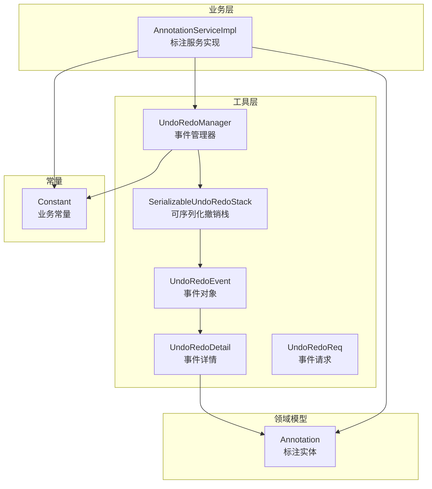
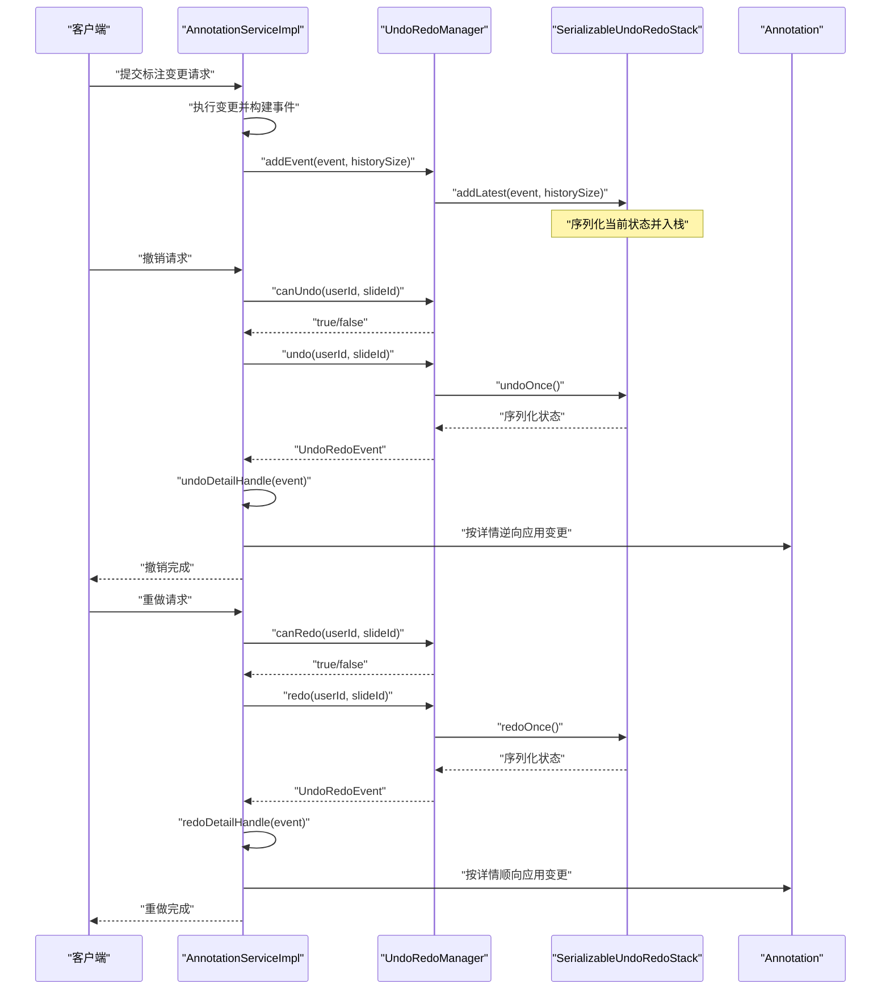
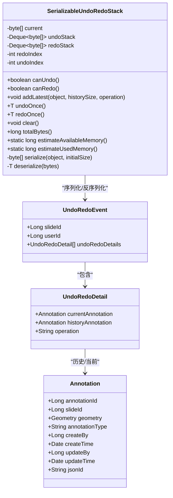
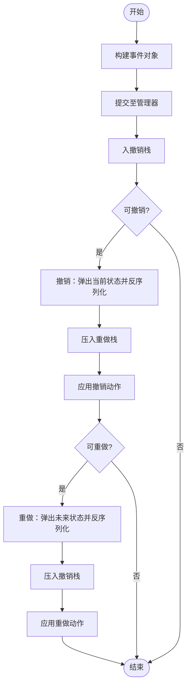
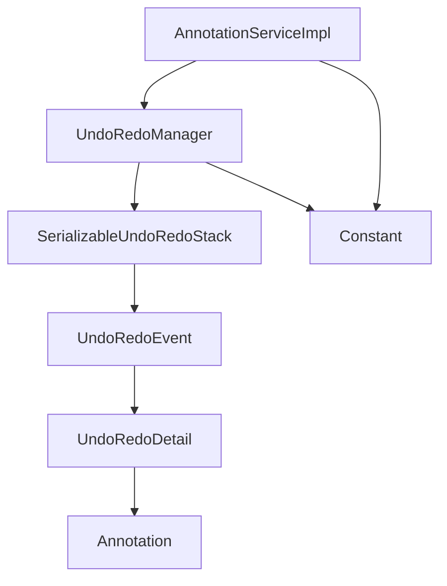

# 事件管理机制

<cite>
**本文引用的文件**
- [UndoRedoEvent.java](file://src/main/java/cn/staitech/annotation/utils/annotation/UndoRedoEvent.java)
- [UndoRedoDetail.java](file://src/main/java/cn/staitech/annotation/utils/annotation/UndoRedoDetail.java)
- [UndoRedoReq.java](file://src/main/java/cn/staitech/annotation/utils/annotation/UndoRedoReq.java)
- [UndoRedoManager.java](file://src/main/java/cn/staitech/annotation/utils/annotation/UndoRedoManager.java)
- [SerializableUndoRedoStack.java](file://src/main/java/cn/staitech/annotation/utils/annotation/SerializableUndoRedoStack.java)
- [Annotation.java](file://src/main/java/cn/staitech/annotation/domain/Annotation.java)
- [Constant.java](file://src/main/java/cn/staitech/annotation/constant/Constant.java)
- [AnnotationServiceImpl.java](file://src/main/java/cn/staitech/annotation/service/impl/AnnotationServiceImpl.java)
</cite>

## 目录
1. [简介](#简介)
2. [项目结构](#项目结构)
3. [核心组件](#核心组件)
4. [架构总览](#架构总览)
5. [详细组件分析](#详细组件分析)
6. [依赖分析](#依赖分析)
7. [性能考量](#性能考量)
8. [故障排查指南](#故障排查指南)
9. [结论](#结论)
10. [附录](#附录)

## 简介
本文件围绕撤销重做系统的事件管理机制展开，系统通过事件对象记录标注变更的历史状态，支持按用户与切片维度的撤销与重做操作。文档重点覆盖以下方面：
- 事件对象设计：事件类型定义、状态快照机制、时间戳与用户标识追踪现状与建议
- 事件详情结构：标注变更前后状态对比、操作类型分类、数据序列化方案
- 事件请求参数：触发条件、执行参数、响应格式
- 生命周期管理：事件创建、状态转换、持久化存储、清理回收
- 序列化与反序列化：实现细节与版本兼容性处理
- 开发者实现指南：从事件创建到撤销/重做的完整流程

## 项目结构
事件管理机制位于工具层，核心类包括事件对象、事件详情、请求参数、管理器与可序列化栈。业务服务在关键标注操作处创建事件并提交至管理器。

**图表来源**
- [UndoRedoEvent.java:1-29](file://src/main/java/cn/staitech/annotation/utils/annotation/UndoRedoEvent.java#L1-L29)
- [UndoRedoDetail.java:1-30](file://src/main/java/cn/staitech/annotation/utils/annotation/UndoRedoDetail.java#L1-L30)
- [UndoRedoReq.java:1-18](file://src/main/java/cn/staitech/annotation/utils/annotation/UndoRedoReq.java#L1-L18)
- [UndoRedoManager.java:1-97](file://src/main/java/cn/staitech/annotation/utils/annotation/UndoRedoManager.java#L1-L97)
- [SerializableUndoRedoStack.java:1-246](file://src/main/java/cn/staitech/annotation/utils/annotation/SerializableUndoRedoStack.java#L1-L246)
- [Annotation.java:1-187](file://src/main/java/cn/staitech/annotation/domain/Annotation.java#L1-L187)
- [Constant.java:1-80](file://src/main/java/cn/staitech/annotation/constant/Constant.java#L1-L80)
- [AnnotationServiceImpl.java:1-724](file://src/main/java/cn/staitech/annotation/service/impl/AnnotationServiceImpl.java#L1-L724)

**章节来源**
- [UndoRedoEvent.java:1-29](file://src/main/java/cn/staitech/annotation/utils/annotation/UndoRedoEvent.java#L1-L29)
- [UndoRedoDetail.java:1-30](file://src/main/java/cn/staitech/annotation/utils/annotation/UndoRedoDetail.java#L1-L30)
- [UndoRedoReq.java:1-18](file://src/main/java/cn/staitech/annotation/utils/annotation/UndoRedoReq.java#L1-L18)
- [UndoRedoManager.java:1-97](file://src/main/java/cn/staitech/annotation/utils/annotation/UndoRedoManager.java#L1-L97)
- [SerializableUndoRedoStack.java:1-246](file://src/main/java/cn/staitech/annotation/utils/annotation/SerializableUndoRedoStack.java#L1-L246)
- [Annotation.java:1-187](file://src/main/java/cn/staitech/annotation/domain/Annotation.java#L1-L187)
- [Constant.java:1-80](file://src/main/java/cn/staitech/annotation/constant/Constant.java#L1-L80)
- [AnnotationServiceImpl.java:1-724](file://src/main/java/cn/staitech/annotation/service/impl/AnnotationServiceImpl.java#L1-L724)

## 核心组件
- 事件对象：封装一次标注变更的上下文，包含切片标识、用户标识与事件详情列表
- 事件详情：记录单个标注的变更前后状态及操作类型
- 请求参数：撤销/重做接口的输入参数，包含用户与切片标识
- 事件管理器：按用户+切片维度维护撤销/重做栈，提供查询与清理能力
- 可序列化撤销栈：以字节数组形式保存状态快照，支持撤销/重做与内存管理
- 标注实体：事件详情中的历史与当前标注对象
- 业务常量：操作类型、默认历史长度等配置
- 业务服务：在关键标注操作处创建事件并提交，提供撤销/重做入口

**章节来源**
- [UndoRedoEvent.java:19-28](file://src/main/java/cn/staitech/annotation/utils/annotation/UndoRedoEvent.java#L19-L28)
- [UndoRedoDetail.java:19-29](file://src/main/java/cn/staitech/annotation/utils/annotation/UndoRedoDetail.java#L19-L29)
- [UndoRedoReq.java:14-17](file://src/main/java/cn/staitech/annotation/utils/annotation/UndoRedoReq.java#L14-L17)
- [UndoRedoManager.java:19-94](file://src/main/java/cn/staitech/annotation/utils/annotation/UndoRedoManager.java#L19-L94)
- [SerializableUndoRedoStack.java:18-243](file://src/main/java/cn/staitech/annotation/utils/annotation/SerializableUndoRedoStack.java#L18-L243)
- [Annotation.java:25-110](file://src/main/java/cn/staitech/annotation/domain/Annotation.java#L25-L110)
- [Constant.java:44-62](file://src/main/java/cn/staitech/annotation/constant/Constant.java#L44-L62)
- [AnnotationServiceImpl.java:677-717](file://src/main/java/cn/staitech/annotation/service/impl/AnnotationServiceImpl.java#L677-L717)

## 架构总览
事件管理机制采用“事件对象 + 可序列化栈”的设计，业务服务在关键标注操作时构建事件并提交至管理器，管理器根据用户与切片维度维护撤销/重做栈。撤销/重做时，管理器从栈中取出序列化状态并反序列化为事件对象，业务服务据此对标注进行逆向或顺向操作。

**图表来源**
- [AnnotationServiceImpl.java:224-226](file://src/main/java/cn/staitech/annotation/service/impl/AnnotationServiceImpl.java#L224-L226)
- [UndoRedoManager.java:42-61](file://src/main/java/cn/staitech/annotation/utils/annotation/UndoRedoManager.java#L42-L61)
- [SerializableUndoRedoStack.java:87-135](file://src/main/java/cn/staitech/annotation/utils/annotation/SerializableUndoRedoStack.java#L87-L135)
- [UndoRedoEvent.java:19-28](file://src/main/java/cn/staitech/annotation/utils/annotation/UndoRedoEvent.java#L19-L28)
- [UndoRedoDetail.java:19-29](file://src/main/java/cn/staitech/annotation/utils/annotation/UndoRedoDetail.java#L19-L29)

## 详细组件分析

### 事件对象 UndoRedoEvent
- 设计要点
  - 用户标识与切片标识：用于多租户与多会话隔离
  - 事件详情列表：一次变更可能涉及多个标注，每个详情记录变更前后状态与操作类型
  - 序列化支持：事件对象本身可被序列化，便于持久化与网络传输
- 时间戳与用户追踪
  - 当前未内置时间戳字段；如需审计与排序，可在事件对象中增加时间戳字段并在创建时填充
  - 用户标识已在对象中提供，结合业务安全上下文可实现用户级追踪

**章节来源**
- [UndoRedoEvent.java:19-28](file://src/main/java/cn/staitech/annotation/utils/annotation/UndoRedoEvent.java#L19-L28)

### 事件详情 UndoRedoDetail
- 数据结构
  - 历史标注与当前标注：用于对比变更前后状态
  - 操作类型：区分新增、修改、删除等操作
- 状态对比
  - 通过历史与当前标注对象的差异计算变更范围
  - 业务侧据此决定撤销/重做的具体动作

**章节来源**
- [UndoRedoDetail.java:19-29](file://src/main/java/cn/staitech/annotation/utils/annotation/UndoRedoDetail.java#L19-L29)
- [Annotation.java:25-110](file://src/main/java/cn/staitech/annotation/domain/Annotation.java#L25-L110)

### 事件请求 UndoRedoReq
- 参数设计
  - 用户标识：触发撤销/重做操作的用户
  - 切片标识：目标标注所在的切片
- 触发条件
  - 撤销/重做仅在对应栈非空时允许
- 响应格式
  - 成功时返回操作结果；失败时返回错误码与提示信息

**章节来源**
- [UndoRedoReq.java:14-17](file://src/main/java/cn/staitech/annotation/utils/annotation/UndoRedoReq.java#L14-L17)
- [AnnotationServiceImpl.java:677-717](file://src/main/java/cn/staitech/annotation/service/impl/AnnotationServiceImpl.java#L677-L717)

### 事件管理器 UndoRedoManager
- 维度与存储
  - 以“用户ID:切片ID”为键，维护独立的撤销/重做栈
- 栈操作
  - 添加事件：将事件序列化后入栈，并限制历史长度
  - 撤销/重做：从栈中弹出序列化状态并反序列化为事件对象
  - 查询能力：判断是否可撤销/重做
  - 清理：按用户+切片清理或定时清空全部

**章节来源**
- [UndoRedoManager.java:19-94](file://src/main/java/cn/staitech/annotation/utils/annotation/UndoRedoManager.java#L19-L94)

### 可序列化撤销栈 SerializableUndoRedoStack
- 快照机制
  - 当前状态以字节数组保存；撤销时将当前状态压入重做栈，再从撤销栈弹出状态
  - 重做时将当前状态压入撤销栈，再从重做栈弹出状态
- 内存管理
  - 提供可用内存估算与阈值清理，避免内存溢出
  - 历史长度上限控制，超出时丢弃最旧的状态
- 序列化与反序列化
  - 使用自定义类加载器进行反序列化，增强安全性
  - 异常处理覆盖IO与类加载异常，保证稳健性

**图表来源**
- [SerializableUndoRedoStack.java:18-243](file://src/main/java/cn/staitech/annotation/utils/annotation/SerializableUndoRedoStack.java#L18-L243)
- [UndoRedoEvent.java:19-28](file://src/main/java/cn/staitech/annotation/utils/annotation/UndoRedoEvent.java#L19-L28)
- [UndoRedoDetail.java:19-29](file://src/main/java/cn/staitech/annotation/utils/annotation/UndoRedoDetail.java#L19-L29)
- [Annotation.java:25-110](file://src/main/java/cn/staitech/annotation/domain/Annotation.java#L25-L110)

**章节来源**
- [SerializableUndoRedoStack.java:18-243](file://src/main/java/cn/staitech/annotation/utils/annotation/SerializableUndoRedoStack.java#L18-L243)

### 事件生命周期管理
- 创建：业务服务在关键标注操作完成后构建事件对象并提交
- 状态转换：事件进入撤销栈；撤销时从撤销栈弹出并压入重做栈；重做时从重做栈弹出并压入撤销栈
- 持久化存储：事件对象可序列化，适合落盘或跨节点传输
- 清理回收：按用户+切片清理或定时清空全部

**图表来源**
- [AnnotationServiceImpl.java:677-717](file://src/main/java/cn/staitech/annotation/service/impl/AnnotationServiceImpl.java#L677-L717)
- [UndoRedoManager.java:42-61](file://src/main/java/cn/staitech/annotation/utils/annotation/UndoRedoManager.java#L42-L61)
- [SerializableUndoRedoStack.java:87-135](file://src/main/java/cn/staitech/annotation/utils/annotation/SerializableUndoRedoStack.java#L87-L135)

**章节来源**
- [AnnotationServiceImpl.java:624-675](file://src/main/java/cn/staitech/annotation/service/impl/AnnotationServiceImpl.java#L624-L675)
- [UndoRedoManager.java:82-94](file://src/main/java/cn/staitech/annotation/utils/annotation/UndoRedoManager.java#L82-L94)
- [SerializableUndoRedoStack.java:75-80](file://src/main/java/cn/staitech/annotation/utils/annotation/SerializableUndoRedoStack.java#L75-L80)

### 事件序列化与反序列化
- 实现细节
  - 序列化：将对象写入字节数组，初始容量按经验估算提升性能
  - 反序列化：使用自定义类加载器解析类名，避免类路径不一致导致的问题
  - 内存估算：定期GC后估算可用内存，低水位时清理撤销栈
- 版本兼容性
  - 建议在事件对象中引入版本号字段，以便在未来升级时兼容旧格式
  - 反序列化阶段可加入版本校验与降级策略

**章节来源**
- [SerializableUndoRedoStack.java:183-221](file://src/main/java/cn/staitech/annotation/utils/annotation/SerializableUndoRedoStack.java#L183-L221)
- [UndoRedoEvent.java:21-21](file://src/main/java/cn/staitech/annotation/utils/annotation/UndoRedoEvent.java#L21-L21)

### 开发者实现指南
- 创建事件
  - 在关键标注操作完成后，收集当前状态与历史状态，构造事件对象并设置用户与切片标识
  - 将事件提交至管理器并传入历史长度上限
- 撤销/重做
  - 先检查是否可撤销/重做，再调用管理器执行撤销/重做
  - 业务服务根据事件详情逆向或顺向应用变更
- 错误处理
  - 反序列化失败时抛出运行时异常；业务层捕获并记录日志
  - 对于部分详情应用失败的情况，记录错误并继续处理其他详情
- 定时清理
  - 使用调度任务每日清空全部撤销/重做记录，避免长期占用内存

**章节来源**
- [AnnotationServiceImpl.java:224-226](file://src/main/java/cn/staitech/annotation/service/impl/AnnotationServiceImpl.java#L224-L226)
- [AnnotationServiceImpl.java:677-717](file://src/main/java/cn/staitech/annotation/service/impl/AnnotationServiceImpl.java#L677-L717)
- [UndoRedoManager.java:87-94](file://src/main/java/cn/staitech/annotation/utils/annotation/UndoRedoManager.java#L87-L94)
- [SerializableUndoRedoStack.java:100-105](file://src/main/java/cn/staitech/annotation/utils/annotation/SerializableUndoRedoStack.java#L100-L105)

## 依赖分析
- 组件耦合
  - 业务服务依赖事件管理器与可序列化栈
  - 事件管理器依赖可序列化栈与常量配置
  - 事件详情依赖标注实体
- 外部依赖
  - Spring容器管理事件管理器与调度任务
  - MyBatis Plus用于标注实体的持久化

**图表来源**
- [AnnotationServiceImpl.java:55-56](file://src/main/java/cn/staitech/annotation/service/impl/AnnotationServiceImpl.java#L55-L56)
- [UndoRedoManager.java:22-22](file://src/main/java/cn/staitech/annotation/utils/annotation/UndoRedoManager.java#L22-L22)
- [SerializableUndoRedoStack.java:20-22](file://src/main/java/cn/staitech/annotation/utils/annotation/SerializableUndoRedoStack.java#L20-L22)
- [UndoRedoEvent.java:27-27](file://src/main/java/cn/staitech/annotation/utils/annotation/UndoRedoEvent.java#L27-L27)
- [UndoRedoDetail.java:22-24](file://src/main/java/cn/staitech/annotation/utils/annotation/UndoRedoDetail.java#L22-L24)
- [Annotation.java:25-110](file://src/main/java/cn/staitech/annotation/domain/Annotation.java#L25-L110)
- [Constant.java:61-61](file://src/main/java/cn/staitech/annotation/constant/Constant.java#L61-L61)

**章节来源**
- [AnnotationServiceImpl.java:55-56](file://src/main/java/cn/staitech/annotation/service/impl/AnnotationServiceImpl.java#L55-L56)
- [UndoRedoManager.java:22-22](file://src/main/java/cn/staitech/annotation/utils/annotation/UndoRedoManager.java#L22-L22)
- [SerializableUndoRedoStack.java:20-22](file://src/main/java/cn/staitech/annotation/utils/annotation/SerializableUndoRedoStack.java#L20-L22)

## 性能考量
- 内存占用
  - 每次事件序列化会产生字节数组，建议合理设置历史长度上限
  - 低可用内存时自动清理撤销栈，防止OOM
- 反序列化成本
  - 反序列化过程涉及类加载与对象重建，建议在批量撤销/重做时合并请求
- 并发安全
  - 栈操作与内存估算均采用同步块，确保并发安全

**章节来源**
- [SerializableUndoRedoStack.java:61-70](file://src/main/java/cn/staitech/annotation/utils/annotation/SerializableUndoRedoStack.java#L61-L70)
- [SerializableUndoRedoStack.java:151-173](file://src/main/java/cn/staitech/annotation/utils/annotation/SerializableUndoRedoStack.java#L151-L173)

## 故障排查指南
- 撤销/重做不可用
  - 检查管理器的可撤销/可重做状态
  - 确认事件是否已正确提交至管理器
- 反序列化失败
  - 查看日志中的类加载与IO异常
  - 确认事件对象的类版本与运行时一致
- 部分详情应用失败
  - 记录失败详情并跳过，继续处理其他详情
  - 检查标注实体的完整性与一致性

**章节来源**
- [AnnotationServiceImpl.java:642-646](file://src/main/java/cn/staitech/annotation/service/impl/AnnotationServiceImpl.java#L642-L646)
- [AnnotationServiceImpl.java:668-672](file://src/main/java/cn/staitech/annotation/service/impl/AnnotationServiceImpl.java#L668-L672)
- [SerializableUndoRedoStack.java:100-105](file://src/main/java/cn/staitech/annotation/utils/annotation/SerializableUndoRedoStack.java#L100-L105)

## 结论
该事件管理机制通过事件对象与可序列化栈实现了高效的撤销/重做能力，具备良好的扩展性与稳定性。建议后续增强时间戳与版本兼容性设计，以满足更复杂的审计与迁移需求。

## 附录
- 常用操作类型
  - 新增：用于恢复被删除的标注
  - 修改：用于回滚到历史标注状态
  - 删除：用于恢复被修改的标注
- 默认历史长度
  - 默认保留100条历史记录，可根据业务需要调整

**章节来源**
- [Constant.java:50-62](file://src/main/java/cn/staitech/annotation/constant/Constant.java#L50-L62)