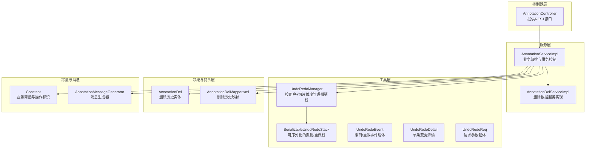
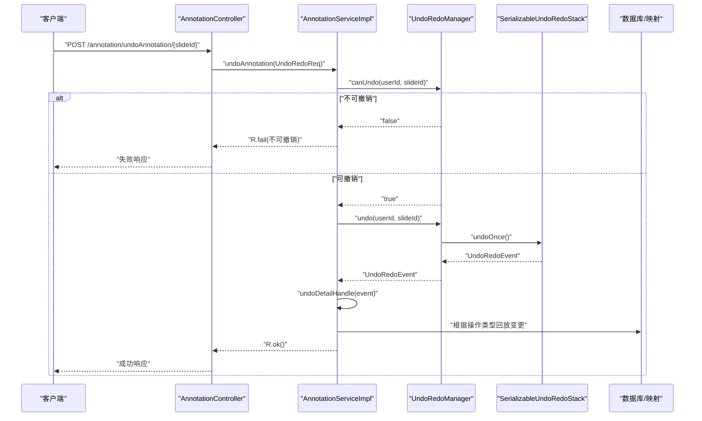
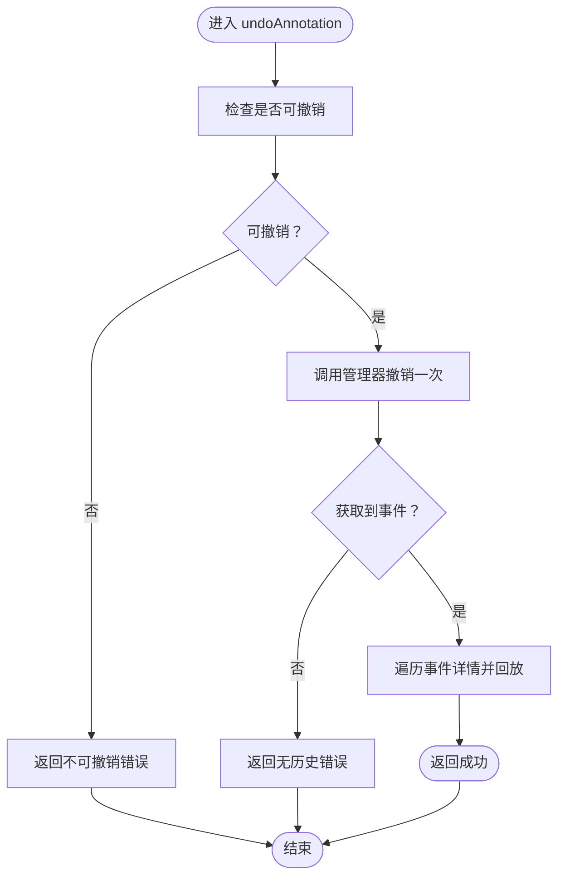
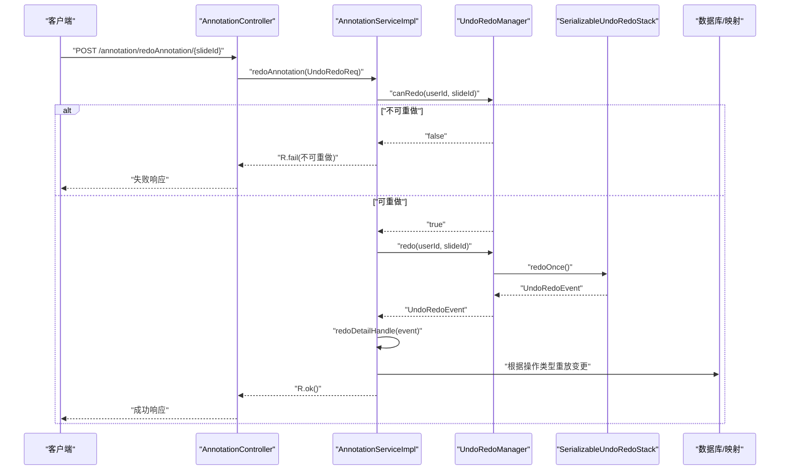
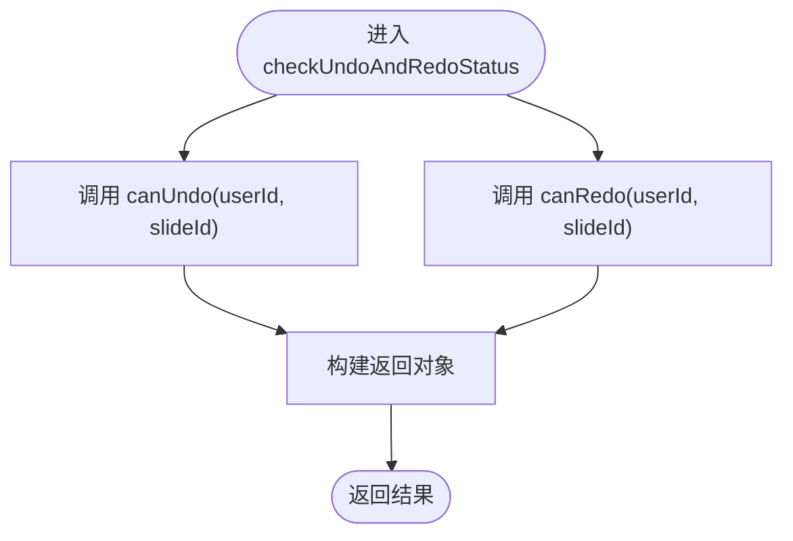
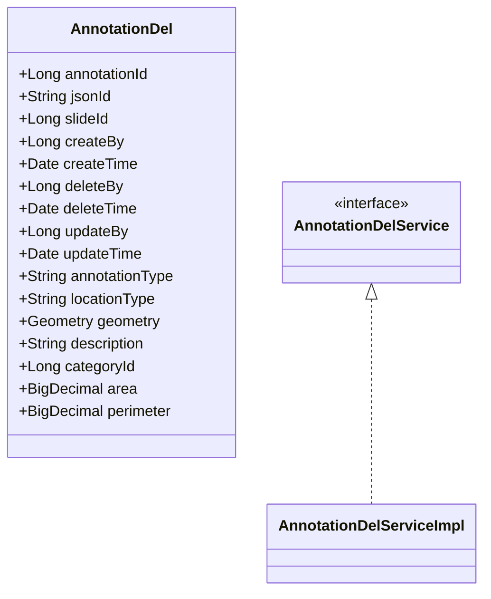
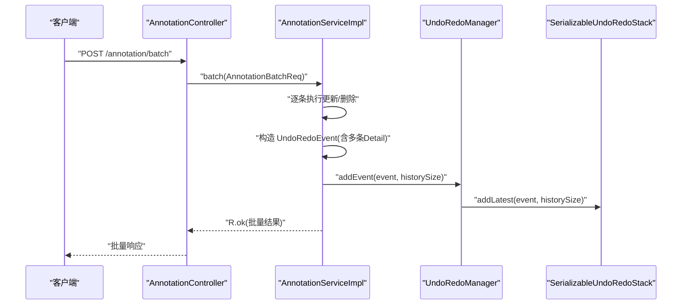
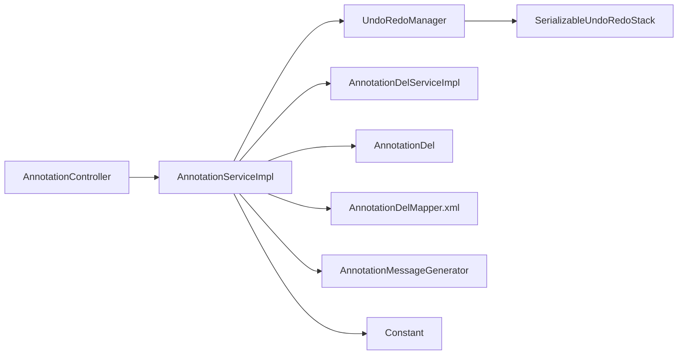

# 撤销重做操作API

<cite>
**本文引用的文件**
- [UndoRedoManager.java](file://src/main/java/cn/staitech/annotation/utils/annotation/UndoRedoManager.java)
- [SerializableUndoRedoStack.java](file://src/main/java/cn/staitech/annotation/utils/annotation/SerializableUndoRedoStack.java)
- [UndoRedoEvent.java](file://src/main/java/cn/staitech/annotation/utils/annotation/UndoRedoEvent.java)
- [UndoRedoDetail.java](file://src/main/java/cn/staitech/annotation/utils/annotation/UndoRedoDetail.java)
- [UndoRedoReq.java](file://src/main/java/cn/staitech/annotation/utils/annotation/UndoRedoReq.java)
- [AnnotationController.java](file://src/main/java/cn/staitech/annotation/controller/AnnotationController.java)
- [AnnotationService.java](file://src/main/java/cn/staitech/annotation/service/AnnotationService.java)
- [AnnotationServiceImpl.java](file://src/main/java/cn/staitech/annotation/service/impl/AnnotationServiceImpl.java)
- [AnnotationDelService.java](file://src/main/java/cn/staitech/annotation/service/AnnotationDelService.java)
- [AnnotationDelServiceImpl.java](file://src/main/java/cn/staitech/annotation/service/impl/AnnotationDelServiceImpl.java)
- [AnnotationDel.java](file://src/main/java/cn/staitech/annotation/domain/AnnotationDel.java)
- [Constant.java](file://src/main/java/cn/staitech/annotation/constant/Constant.java)
- [AnnotationDelMapper.xml](file://src/main/resources/mapper/AnnotationDelMapper.xml)
- [AnnotationMessageGenerator.java](file://src/main/java/cn/staitech/annotation/utils/annotation/AnnotationMessageGenerator.java)
</cite>

## 目录
1. [简介](#简介)
2. [项目结构](#项目结构)
3. [核心组件](#核心组件)
4. [架构总览](#架构总览)
5. [详细组件分析](#详细组件分析)
6. [依赖关系分析](#依赖关系分析)
7. [性能考量](#性能考量)
8. [故障排查指南](#故障排查指南)
9. [结论](#结论)
10. [附录](#附录)

## 简介
本文件面向“撤销/重做”操作API，系统性梳理以下能力：
- 撤销API：undoAnnotation 方法的参数、返回值、异常处理与调用时机
- 重做API：redoAnnotation 方法的实现机制、状态恢复流程与错误回滚策略
- 状态查询API：canUndo/canRedo 的可用性判断逻辑
- 与标注删除服务的集成：AnnotationDelService 的撤销/重做支持、批量操作处理与事务一致性
- 完整使用示例：正常流程、异常处理、边界条件
- 性能优化建议、并发安全保证、错误码定义与故障排查

## 项目结构
围绕撤销/重做的核心模块由“控制器层 → 服务层 → 工具层 → 数据模型/映射”构成，形成清晰的分层职责与调用链。

图表来源
- [AnnotationController.java:1-251](file://src/main/java/cn/staitech/annotation/controller/AnnotationController.java#L1-L251)
- [AnnotationServiceImpl.java:1-724](file://src/main/java/cn/staitech/annotation/service/impl/AnnotationServiceImpl.java#L1-L724)
- [UndoRedoManager.java:1-97](file://src/main/java/cn/staitech/annotation/utils/annotation/UndoRedoManager.java#L1-L97)
- [SerializableUndoRedoStack.java:1-246](file://src/main/java/cn/staitech/annotation/utils/annotation/SerializableUndoRedoStack.java#L1-L246)
- [UndoRedoEvent.java:1-29](file://src/main/java/cn/staitech/annotation/utils/annotation/UndoRedoEvent.java#L1-L29)
- [UndoRedoDetail.java:1-30](file://src/main/java/cn/staitech/annotation/utils/annotation/UndoRedoDetail.java#L1-L30)
- [UndoRedoReq.java:1-18](file://src/main/java/cn/staitech/annotation/utils/annotation/UndoRedoReq.java#L1-L18)
- [AnnotationDelService.java:1-15](file://src/main/java/cn/staitech/annotation/service/AnnotationDelService.java#L1-L15)
- [AnnotationDelServiceImpl.java:1-24](file://src/main/java/cn/staitech/annotation/service/impl/AnnotationDelServiceImpl.java#L1-L24)
- [AnnotationDel.java:1-179](file://src/main/java/cn/staitech/annotation/domain/AnnotationDel.java#L1-L179)
- [AnnotationDelMapper.xml:1-35](file://src/main/resources/mapper/AnnotationDelMapper.xml#L1-L35)
- [Constant.java:1-80](file://src/main/java/cn/staitech/annotation/constant/Constant.java#L1-L80)
- [AnnotationMessageGenerator.java:1-349](file://src/main/java/cn/staitech/annotation/utils/annotation/AnnotationMessageGenerator.java#L1-L349)

章节来源
- [AnnotationController.java:1-251](file://src/main/java/cn/staitech/annotation/controller/AnnotationController.java#L1-L251)
- [AnnotationServiceImpl.java:1-724](file://src/main/java/cn/staitech/annotation/service/impl/AnnotationServiceImpl.java#L1-L724)

## 核心组件
- 撤销/重做管理器：按用户ID与切片ID维护独立的撤销/重做栈，提供添加事件、撤销、重做、可用性查询与清理能力
- 可序列化撤销/重做栈：以二进制序列化当前状态，支持撤销/重做指针移动与容量控制
- 事件与详情：事件封装一次批内多条变更，详情记录操作类型与前后状态
- 控制器与服务：对外暴露REST接口，内部通过服务层编排业务与事务，调用管理器进行状态记录与恢复

章节来源
- [UndoRedoManager.java:1-97](file://src/main/java/cn/staitech/annotation/utils/annotation/UndoRedoManager.java#L1-L97)
- [SerializableUndoRedoStack.java:1-246](file://src/main/java/cn/staitech/annotation/utils/annotation/SerializableUndoRedoStack.java#L1-L246)
- [UndoRedoEvent.java:1-29](file://src/main/java/cn/staitech/annotation/utils/annotation/UndoRedoEvent.java#L1-L29)
- [UndoRedoDetail.java:1-30](file://src/main/java/cn/staitech/annotation/utils/annotation/UndoRedoDetail.java#L1-L30)
- [UndoRedoReq.java:1-18](file://src/main/java/cn/staitech/annotation/utils/annotation/UndoRedoReq.java#L1-L18)

## 架构总览
撤销/重做API的端到端调用路径如下：

图表来源
- [AnnotationController.java:226-230](file://src/main/java/cn/staitech/annotation/controller/AnnotationController.java#L226-L230)
- [AnnotationServiceImpl.java:677-688](file://src/main/java/cn/staitech/annotation/service/impl/AnnotationServiceImpl.java#L677-L688)
- [UndoRedoManager.java:48-53](file://src/main/java/cn/staitech/annotation/utils/annotation/UndoRedoManager.java#L48-L53)
- [SerializableUndoRedoStack.java:113-135](file://src/main/java/cn/staitech/annotation/utils/annotation/SerializableUndoRedoStack.java#L113-L135)

## 详细组件分析

### 撤销API：undoAnnotation
- 接口定义
  - 路径：POST /annotation/undoAnnotation/{slideId}
  - 请求参数：路径参数 slideId；通过上下文获取 userId
  - 返回值：R<Boolean>，成功时返回 true，失败时返回错误信息
- 实现机制
  - 服务层先检查是否可撤销（canUndo），否则直接返回失败
  - 可撤销时调用管理器执行一次撤销，返回事件对象
  - 服务层根据事件中的每条变更详情执行回放：删除→恢复、更新→回滚到历史、新增→删除
- 异常处理
  - 当前无历史：返回“无历史”错误
  - 不可撤销：返回“不可撤销”错误
  - 回放过程中的异常会记录日志并跳过该条目，不影响整体流程
- 调用时机
  - 用户点击“撤销”按钮后触发
  - 仅当 canUndo 返回 true 时才调用

图表来源
- [AnnotationServiceImpl.java:677-688](file://src/main/java/cn/staitech/annotation/service/impl/AnnotationServiceImpl.java#L677-L688)
- [UndoRedoManager.java:66-69](file://src/main/java/cn/staitech/annotation/utils/annotation/UndoRedoManager.java#L66-L69)
- [SerializableUndoRedoStack.java:113-135](file://src/main/java/cn/staitech/annotation/utils/annotation/SerializableUndoRedoStack.java#L113-L135)

章节来源
- [AnnotationController.java:226-230](file://src/main/java/cn/staitech/annotation/controller/AnnotationController.java#L226-L230)
- [AnnotationService.java:37-37](file://src/main/java/cn/staitech/annotation/service/AnnotationService.java#L37-L37)
- [AnnotationServiceImpl.java:677-688](file://src/main/java/cn/staitech/annotation/service/impl/AnnotationServiceImpl.java#L677-L688)
- [UndoRedoManager.java:48-53](file://src/main/java/cn/staitech/annotation/utils/annotation/UndoRedoManager.java#L48-L53)

### 重做API：redoAnnotation
- 接口定义
  - 路径：POST /annotation/redoAnnotation/{slideId}
  - 请求参数：路径参数 slideId；通过上下文获取 userId
  - 返回值：R<Boolean>，成功时返回 true，失败时返回错误信息
- 实现机制
  - 服务层先检查是否可重做（canRedo），否则直接返回失败
  - 可重做时调用管理器执行一次重做，返回事件对象
  - 服务层根据事件中的每条变更详情执行重放：删除→再次删除、更新→应用当前、新增→再次新增
- 异常处理
  - 当前无未来状态：返回“无未来状态”错误
  - 不可重做：返回“不可重做”错误
  - 重放过程中的异常会记录日志并跳过该条目，不影响整体流程
- 错误回滚策略
  - 采用“尽力而为”的回放策略：单条失败不影响其他条目的执行
  - 重放不会破坏数据库一致性，因为每次回放都是幂等的（删除→删除、更新→更新、新增→新增）

图表来源
- [AnnotationController.java:232-236](file://src/main/java/cn/staitech/annotation/controller/AnnotationController.java#L232-L236)
- [AnnotationServiceImpl.java:690-701](file://src/main/java/cn/staitech/annotation/service/impl/AnnotationServiceImpl.java#L690-L701)
- [UndoRedoManager.java:71-77](file://src/main/java/cn/staitech/annotation/utils/annotation/UndoRedoManager.java#L71-L77)
- [SerializableUndoRedoStack.java:87-106](file://src/main/java/cn/staitech/annotation/utils/annotation/SerializableUndoRedoStack.java#L87-L106)

章节来源
- [AnnotationController.java:232-236](file://src/main/java/cn/staitech/annotation/controller/AnnotationController.java#L232-L236)
- [AnnotationService.java:39-39](file://src/main/java/cn/staitech/annotation/service/AnnotationService.java#L39-L39)
- [AnnotationServiceImpl.java:690-701](file://src/main/java/cn/staitech/annotation/service/impl/AnnotationServiceImpl.java#L690-L701)
- [UndoRedoManager.java:58-61](file://src/main/java/cn/staitech/annotation/utils/annotation/UndoRedoManager.java#L58-L61)

### 状态查询API：canUndo / canRedo
- 接口定义
  - 路径：POST /annotation/checkUndoAndRedoStatus/{slideId}
  - 返回值：R<Map<String, Boolean>>，包含 "undo" 与 "redo" 字段
- 实现机制
  - 服务层分别调用管理器的 canUndo 与 canRedo，组装结果返回
- 可用性检查机制
  - canUndo：当撤销栈非空时为 true
  - canRedo：当重做栈非空时为 true

图表来源
- [AnnotationController.java:244-248](file://src/main/java/cn/staitech/annotation/controller/AnnotationController.java#L244-L248)
- [AnnotationServiceImpl.java:709-717](file://src/main/java/cn/staitech/annotation/service/impl/AnnotationServiceImpl.java#L709-L717)
- [UndoRedoManager.java:66-77](file://src/main/java/cn/staitech/annotation/utils/annotation/UndoRedoManager.java#L66-L77)

章节来源
- [AnnotationController.java:244-248](file://src/main/java/cn/staitech/annotation/controller/AnnotationController.java#L244-L248)
- [AnnotationServiceImpl.java:709-717](file://src/main/java/cn/staitech/annotation/service/impl/AnnotationServiceImpl.java#L709-L717)
- [UndoRedoManager.java:66-77](file://src/main/java/cn/staitech/annotation/utils/annotation/UndoRedoManager.java#L66-L77)

### 与标注删除服务的集成：AnnotationDelService
- 设计目标
  - 支持撤销/重做对“删除标注”的完整回放：删除→恢复、恢复→删除
  - 通过删除历史表（AnnotationDel）保存删除前的完整状态，用于回放
- 关键点
  - 删除标注时，同时写入 AnnotationDel 表，便于撤销时恢复
  - 撤销删除：将 AnnotationDel 中的记录恢复为 Annotation，同时删除对应 AnnotationDel 记录
  - 重做删除：再次删除对应标注并保持 AnnotationDel 记录
- 事务一致性
  - 删除标注与写入删除历史在服务层统一受事务控制，确保原子性
  - 撤销/重做回放同样在服务层受事务控制，避免部分回放导致的数据不一致

图表来源
- [AnnotationDel.java:1-179](file://src/main/java/cn/staitech/annotation/domain/AnnotationDel.java#L1-L179)
- [AnnotationDelService.java:1-15](file://src/main/java/cn/staitech/annotation/service/AnnotationDelService.java#L1-L15)
- [AnnotationDelServiceImpl.java:1-24](file://src/main/java/cn/staitech/annotation/service/impl/AnnotationDelServiceImpl.java#L1-L24)

章节来源
- [AnnotationServiceImpl.java:273-300](file://src/main/java/cn/staitech/annotation/service/impl/AnnotationServiceImpl.java#L273-L300)
- [AnnotationDelMapper.xml:1-35](file://src/main/resources/mapper/AnnotationDelMapper.xml#L1-L35)

### 批量操作与撤销/重做
- 批量接口
  - 路径：POST /annotation/batch
  - 支持批量更新与批量删除，内部将每条操作转换为 UndoRedoDetail 并一次性记录
- 撤销/重做机制
  - 批量事件包含多条 UndoRedoDetail，撤销时逐条回放；重做时逐条重放
  - 单条操作异常不影响其他条目，保证批量事务的局部性

图表来源
- [AnnotationController.java:177-192](file://src/main/java/cn/staitech/annotation/controller/AnnotationController.java#L177-L192)
- [AnnotationServiceImpl.java:574-623](file://src/main/java/cn/staitech/annotation/service/impl/AnnotationServiceImpl.java#L574-L623)
- [UndoRedoManager.java:42-45](file://src/main/java/cn/staitech/annotation/utils/annotation/UndoRedoManager.java#L42-L45)
- [SerializableUndoRedoStack.java:144-173](file://src/main/java/cn/staitech/annotation/utils/annotation/SerializableUndoRedoStack.java#L144-L173)

章节来源
- [AnnotationController.java:177-192](file://src/main/java/cn/staitech/annotation/controller/AnnotationController.java#L177-L192)
- [AnnotationServiceImpl.java:574-623](file://src/main/java/cn/staitech/annotation/service/impl/AnnotationServiceImpl.java#L574-L623)

## 依赖关系分析
- 组件耦合
  - 控制器仅依赖服务接口，降低对具体实现的耦合
  - 服务层依赖管理器与删除服务实现，管理器内部持有可序列化栈
  - 删除历史实体与映射文件提供持久化支撑
- 外部依赖
  - WebSocket消息生成器用于广播变更
  - 远程业务服务用于标签与用户信息查询

图表来源
- [AnnotationController.java:1-251](file://src/main/java/cn/staitech/annotation/controller/AnnotationController.java#L1-L251)
- [AnnotationServiceImpl.java:1-724](file://src/main/java/cn/staitech/annotation/service/impl/AnnotationServiceImpl.java#L1-L724)
- [UndoRedoManager.java:1-97](file://src/main/java/cn/staitech/annotation/utils/annotation/UndoRedoManager.java#L1-L97)
- [SerializableUndoRedoStack.java:1-246](file://src/main/java/cn/staitech/annotation/utils/annotation/SerializableUndoRedoStack.java#L1-L246)
- [AnnotationDelService.java:1-15](file://src/main/java/cn/staitech/annotation/service/AnnotationDelService.java#L1-L15)
- [AnnotationDelServiceImpl.java:1-24](file://src/main/java/cn/staitech/annotation/service/impl/AnnotationDelServiceImpl.java#L1-L24)
- [AnnotationDel.java:1-179](file://src/main/java/cn/staitech/annotation/domain/AnnotationDel.java#L1-L179)
- [AnnotationDelMapper.xml:1-35](file://src/main/resources/mapper/AnnotationDelMapper.xml#L1-L35)
- [AnnotationMessageGenerator.java:1-349](file://src/main/java/cn/staitech/annotation/utils/annotation/AnnotationMessageGenerator.java#L1-L349)
- [Constant.java:1-80](file://src/main/java/cn/staitech/annotation/constant/Constant.java#L1-L80)

## 性能考量
- 序列化与内存
  - 可序列化栈以二进制形式保存状态，占用内存与历史深度成正比
  - 提供历史深度上限（常量配置）与可用内存估算，低内存时自动清理撤销栈
- 并发安全
  - 撤销/重做栈与管理器均采用同步方法，保证多线程下的原子性
  - 按用户+切片维度隔离，避免跨用户干扰
- I/O与网络
  - 批量操作减少往返次数，提升吞吐
  - 标签与用户信息查询通过远程服务缓存字典，避免重复查询

章节来源
- [SerializableUndoRedoStack.java:144-173](file://src/main/java/cn/staitech/annotation/utils/annotation/SerializableUndoRedoStack.java#L144-L173)
- [SerializableUndoRedoStack.java:230-243](file://src/main/java/cn/staitech/annotation/utils/annotation/SerializableUndoRedoStack.java#L230-L243)
- [UndoRedoManager.java:21-37](file://src/main/java/cn/staitech/annotation/utils/annotation/UndoRedoManager.java#L21-L37)

## 故障排查指南
- 常见错误码与含义
  - ANNOTATION_CANNOT_UNDO：当前无撤销记录
  - ANNOTATION_CANNOT_REDO：当前无可重做记录
  - ANNOTATION_NO_HISTORY：尝试撤销但无历史
  - ANNOTATION_NO_FUTURE_STATE：尝试重做但无未来状态
  - ARGUMENT_INVALID：批量请求参数无效
- 排查步骤
  - 使用状态查询接口确认 canUndo/canRedo
  - 若撤销/重做失败，检查服务层日志中“撤销还原操作标注数据失败”的异常堆栈
  - 确认删除历史表是否正确写入与清理
- 事务问题
  - 删除标注与写入删除历史需在同一事务内，确保一致性
  - 撤销/重做回放同样需在事务内执行，避免部分回放

章节来源
- [AnnotationServiceImpl.java:677-701](file://src/main/java/cn/staitech/annotation/service/impl/AnnotationServiceImpl.java#L677-L701)
- [AnnotationServiceImpl.java:273-300](file://src/main/java/cn/staitech/annotation/service/impl/AnnotationServiceImpl.java#L273-L300)
- [AnnotationDelMapper.xml:1-35](file://src/main/resources/mapper/AnnotationDelMapper.xml#L1-L35)

## 结论
本撤销/重做系统通过“事件驱动 + 可序列化栈 + 事务回放”的方式，实现了对标注增删改的可靠撤销/重做。其设计具备：
- 明确的API边界与清晰的调用链
- 完备的状态查询与错误处理
- 与删除服务的紧密集成与事务一致性保障
- 面向性能的内存控制与并发安全

## 附录

### API清单与使用示例

- 撤销
  - 路径：POST /annotation/undoAnnotation/{slideId}
  - 正常流程：用户点击撤销 → 服务层检查可撤销 → 执行撤销 → 回放删除/更新/新增
  - 异常场景：无历史、不可撤销
- 重做
  - 路径：POST /annotation/redoAnnotation/{slideId}
  - 正常流程：用户点击重做 → 服务层检查可重做 → 执行重做 → 回放删除/更新/新增
  - 异常场景：无未来状态、不可重做
- 状态查询
  - 路径：POST /annotation/checkUndoAndRedoStatus/{slideId}
  - 返回：{ "undo": true/false, "redo": true/false }
- 清理
  - 路径：POST /annotation/clear/{slideId}
  - 功能：清空指定用户+切片的撤销/重做记录
- 批量
  - 路径：POST /annotation/batch
  - 支持批量更新/删除，撤销/重做时逐条回放

章节来源
- [AnnotationController.java:226-248](file://src/main/java/cn/staitech/annotation/controller/AnnotationController.java#L226-L248)
- [AnnotationService.java:37-42](file://src/main/java/cn/staitech/annotation/service/AnnotationService.java#L37-L42)
- [AnnotationServiceImpl.java:574-623](file://src/main/java/cn/staitech/annotation/service/impl/AnnotationServiceImpl.java#L574-L623)