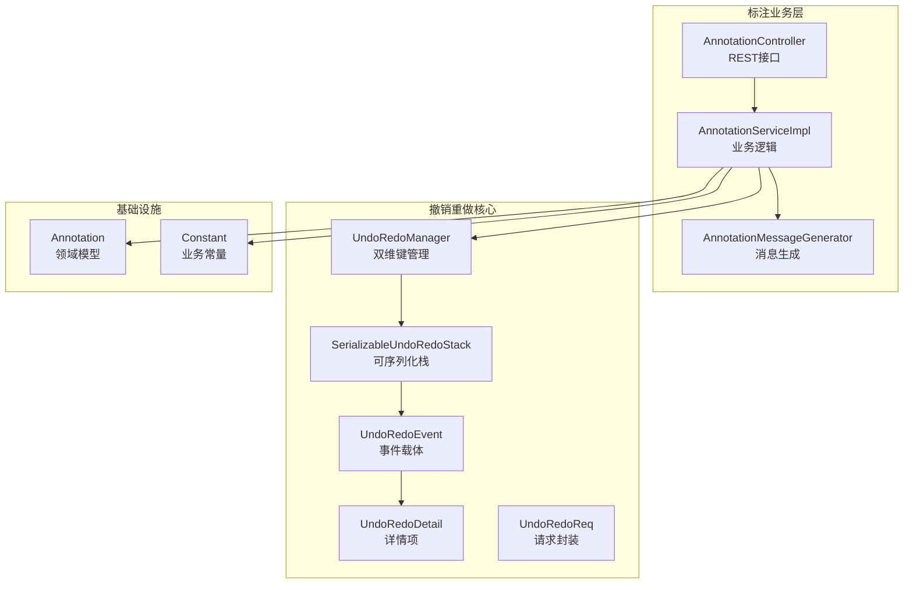
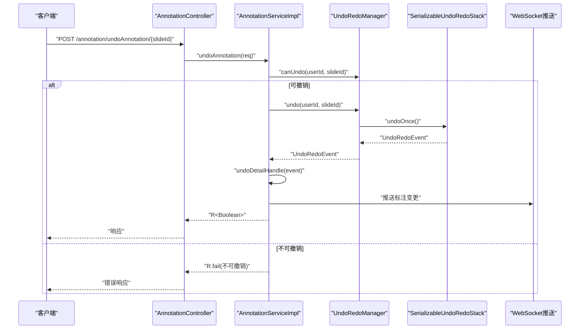
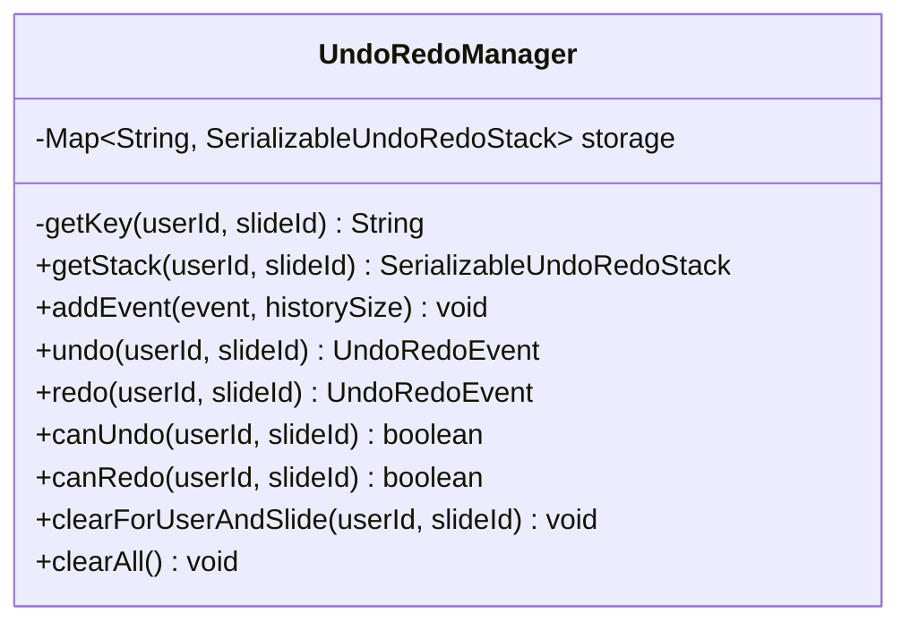
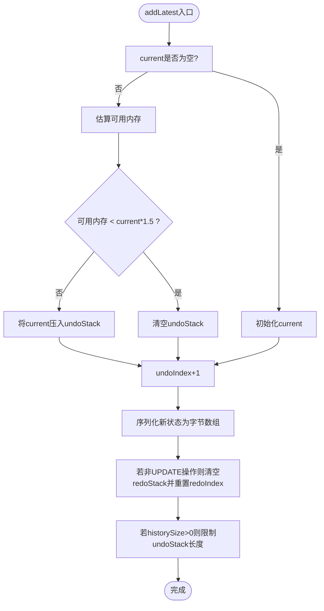
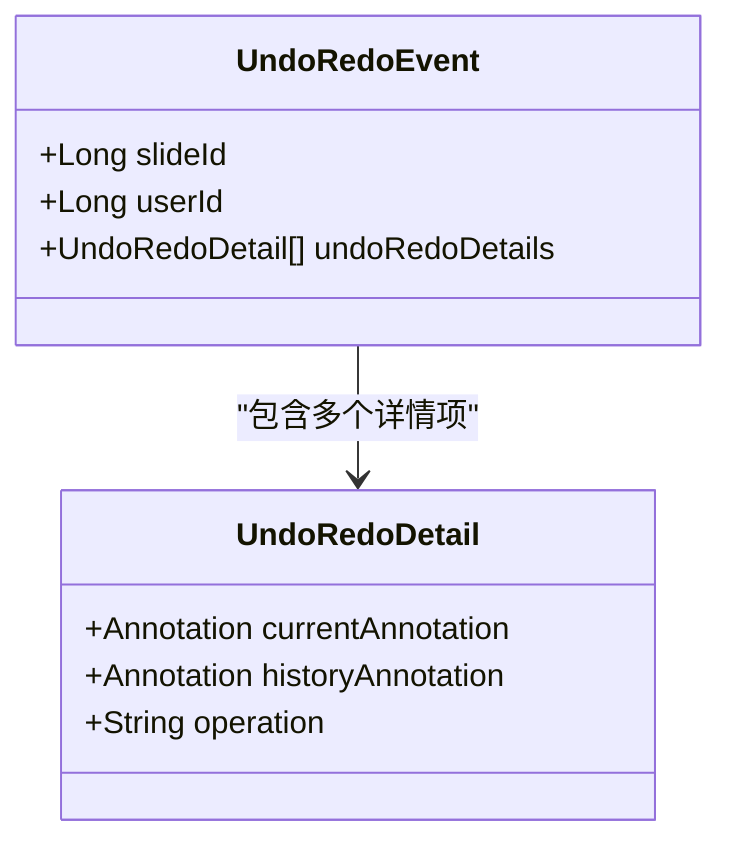
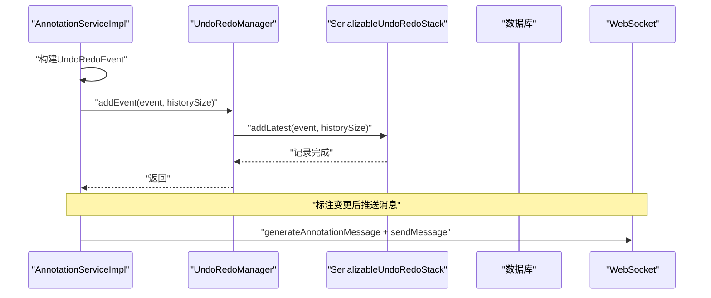
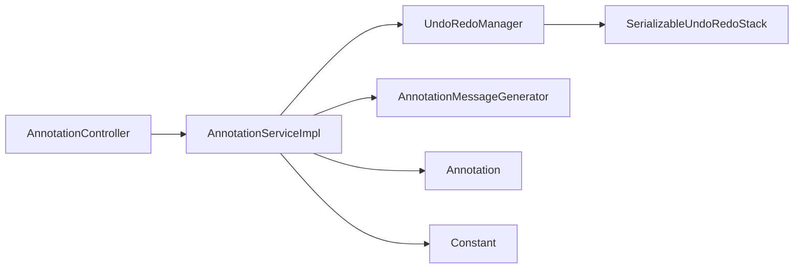

# 撤销重做架构设计

<cite>
**本文档引用的文件**
- [UndoRedoManager.java](file://src/main/java/cn/staitech/annotation/utils/annotation/UndoRedoManager.java)
- [UndoRedoEvent.java](file://src/main/java/cn/staitech/annotation/utils/annotation/UndoRedoEvent.java)
- [UndoRedoDetail.java](file://src/main/java/cn/staitech/annotation/utils/annotation/UndoRedoDetail.java)
- [UndoRedoReq.java](file://src/main/java/cn/staitech/annotation/utils/annotation/UndoRedoReq.java)
- [SerializableUndoRedoStack.java](file://src/main/java/cn/staitech/annotation/utils/annotation/SerializableUndoRedoStack.java)
- [AnnotationServiceImpl.java](file://src/main/java/cn/staitech/annotation/service/impl/AnnotationServiceImpl.java)
- [AnnotationController.java](file://src/main/java/cn/staitech/annotation/controller/AnnotationController.java)
- [AnnotationMessageGenerator.java](file://src/main/java/cn/staitech/annotation/utils/annotation/AnnotationMessageGenerator.java)
- [AnnotationJsonIdGenerator.java](file://src/main/java/cn/staitech/annotation/utils/annotation/AnnotationJsonIdGenerator.java)
- [Annotation.java](file://src/main/java/cn/staitech/annotation/domain/Annotation.java)
- [Constant.java](file://src/main/java/cn/staitech/annotation/constant/Constant.java)
</cite>

## 目录
1. [引言](#引言)
2. [项目结构](#项目结构)
3. [核心组件](#核心组件)
4. [架构总览](#架构总览)
5. [详细组件分析](#详细组件分析)
6. [依赖关系分析](#依赖关系分析)
7. [性能考虑](#性能考虑)
8. [故障排查指南](#故障排查指南)
9. [结论](#结论)
10. [附录](#附录)

## 引言
本文件面向撤销重做系统的设计与实现，围绕“基于用户ID与切片ID的双维度管理架构”展开，系统性阐述以下主题：
- 存储结构设计：以ConcurrentHashMap为核心的键值映射，键生成策略与并发安全保证
- 事件驱动架构：事件捕获、状态快照、历史记录维护的完整流程
- 撤销重做栈：数据结构、栈操作、历史长度限制与内存优化策略
- 组件交互：UndoRedoManager如何协调各模块协同工作
- 技术决策与性能影响：内存估算、GC触发、序列化开销与扩展性
- 开发者实践指南：最佳实践、常见问题与排障建议

## 项目结构
该撤销重做系统位于标注业务模块内，采用“领域模型 + 工具类 + 控制器 + 服务实现”的分层组织方式。核心文件分布如下：
- 工具类与实体：UndoRedoManager、UndoRedoEvent、UndoRedoDetail、UndoRedoReq、SerializableUndoRedoStack
- 业务服务：AnnotationServiceImpl（承载撤销/重做业务逻辑）
- 控制器：AnnotationController（对外暴露撤销/重做接口）
- 消息生成：AnnotationMessageGenerator（用于推送标注变更）
- 常量与实体：Constant、Annotation

图表来源
- [AnnotationController.java:226-248](file://src/main/java/cn/staitech/annotation/controller/AnnotationController.java#L226-L248)
- [AnnotationServiceImpl.java:677-717](file://src/main/java/cn/staitech/annotation/service/impl/AnnotationServiceImpl.java#L677-L717)
- [UndoRedoManager.java:16-94](file://src/main/java/cn/staitech/annotation/utils/annotation/UndoRedoManager.java#L16-L94)
- [SerializableUndoRedoStack.java:18-245](file://src/main/java/cn/staitech/annotation/utils/annotation/SerializableUndoRedoStack.java#L18-L245)
- [UndoRedoEvent.java:19-28](file://src/main/java/cn/staitech/annotation/utils/annotation/UndoRedoEvent.java#L19-L28)
- [UndoRedoDetail.java:19-29](file://src/main/java/cn/staitech/annotation/utils/annotation/UndoRedoDetail.java#L19-L29)
- [UndoRedoReq.java:14-17](file://src/main/java/cn/staitech/annotation/utils/annotation/UndoRedoReq.java#L14-L17)
- [Annotation.java:25-110](file://src/main/java/cn/staitech/annotation/domain/Annotation.java#L25-L110)
- [Constant.java:60-61](file://src/main/java/cn/staitech/annotation/constant/Constant.java#L60-L61)

章节来源
- [AnnotationController.java:226-248](file://src/main/java/cn/staitech/annotation/controller/AnnotationController.java#L226-L248)
- [AnnotationServiceImpl.java:677-717](file://src/main/java/cn/staitech/annotation/service/impl/AnnotationServiceImpl.java#L677-L717)
- [UndoRedoManager.java:16-94](file://src/main/java/cn/staitech/annotation/utils/annotation/UndoRedoManager.java#L16-L94)
- [SerializableUndoRedoStack.java:18-245](file://src/main/java/cn/staitech/annotation/utils/annotation/SerializableUndoRedoStack.java#L18-L245)

## 核心组件
本节聚焦撤销重做系统的关键构件及其职责与协作关系。

- UndoRedoManager：双维度键空间管理器，负责按“用户ID:切片ID”生成键，提供撤销/重做栈的获取、添加事件、状态查询与清理能力，并内置定时清理策略。
- SerializableUndoRedoStack：可序列化的撤销/重做栈，内部维护当前状态与两个双向栈（撤销/重做），支持序列化/反序列化、内存估算与历史长度控制。
- UndoRedoEvent：事件载体，封装一次操作的上下文（用户ID、切片ID）与多个UndoRedoDetail。
- UndoRedoDetail：事件详情项，包含当前标注与历史标注、操作类型（新增/更新/删除）。
- UndoRedoReq：撤销/重做请求封装，包含用户ID与切片ID。
- AnnotationServiceImpl：业务实现，负责在标注增删改时构建UndoRedoEvent并调用UndoRedoManager记录历史；同时提供撤销/重做接口的具体执行。
- AnnotationController：对外REST接口，暴露撤销/重做、状态查询与清理等操作。
- AnnotationMessageGenerator：标注变更消息生成器，配合WebSocket推送标注变更。
- Annotation/Constant：领域模型与业务常量，如UNDO_REDO_STACK_SIZE等。

章节来源
- [UndoRedoManager.java:16-94](file://src/main/java/cn/staitech/annotation/utils/annotation/UndoRedoManager.java#L16-L94)
- [SerializableUndoRedoStack.java:18-245](file://src/main/java/cn/staitech/annotation/utils/annotation/SerializableUndoRedoStack.java#L18-L245)
- [UndoRedoEvent.java:19-28](file://src/main/java/cn/staitech/annotation/utils/annotation/UndoRedoEvent.java#L19-L28)
- [UndoRedoDetail.java:19-29](file://src/main/java/cn/staitech/annotation/utils/annotation/UndoRedoDetail.java#L19-L29)
- [UndoRedoReq.java:14-17](file://src/main/java/cn/staitech/annotation/utils/annotation/UndoRedoReq.java#L14-L17)
- [AnnotationServiceImpl.java:677-717](file://src/main/java/cn/staitech/annotation/service/impl/AnnotationServiceImpl.java#L677-L717)
- [AnnotationController.java:226-248](file://src/main/java/cn/staitech/annotation/controller/AnnotationController.java#L226-L248)
- [AnnotationMessageGenerator.java:40-50](file://src/main/java/cn/staitech/annotation/utils/annotation/AnnotationMessageGenerator.java#L40-L50)
- [Annotation.java:25-110](file://src/main/java/cn/staitech/annotation/domain/Annotation.java#L25-L110)
- [Constant.java:60-61](file://src/main/java/cn/staitech/annotation/constant/Constant.java#L60-L61)

## 架构总览
撤销重做系统采用“事件驱动 + 双维度键空间 + 可序列化栈”的架构模式，整体交互流程如下：

图表来源
- [AnnotationController.java:226-230](file://src/main/java/cn/staitech/annotation/controller/AnnotationController.java#L226-L230)
- [AnnotationServiceImpl.java:677-688](file://src/main/java/cn/staitech/annotation/service/impl/AnnotationServiceImpl.java#L677-L688)
- [UndoRedoManager.java:47-77](file://src/main/java/cn/staitech/annotation/utils/annotation/UndoRedoManager.java#L47-L77)
- [SerializableUndoRedoStack.java:113-135](file://src/main/java/cn/staitech/annotation/utils/annotation/SerializableUndoRedoStack.java#L113-L135)
- [AnnotationMessageGenerator.java:40-50](file://src/main/java/cn/staitech/annotation/utils/annotation/AnnotationMessageGenerator.java#L40-L50)

## 详细组件分析

### UndoRedoManager：双维度键空间管理器
- 键生成策略：采用“userId:slideId”字符串拼接作为键，确保同一用户在同一切片内的独立历史空间。
- 并发安全：基于ConcurrentHashMap，提供线程安全的初始化与访问。
- 栈获取与操作：提供getStack、addEvent、undo、redo、canUndo、canRedo、clearForUserAndSlide、定时清理等方法。
- 定时清理：每日凌晨执行一次storage.clear()，避免长期运行导致的内存膨胀。

图表来源
- [UndoRedoManager.java:19-94](file://src/main/java/cn/staitech/annotation/utils/annotation/UndoRedoManager.java#L19-L94)

章节来源
- [UndoRedoManager.java:21-94](file://src/main/java/cn/staitech/annotation/utils/annotation/UndoRedoManager.java#L21-L94)

### SerializableUndoRedoStack：可序列化撤销/重做栈
- 数据结构：current（当前状态字节数组）、undoStack（撤销栈，ArrayDeque）、redoStack（重做栈，ArrayDeque）。
- 索引管理：undoIndex、redoIndex用于快速判断可撤销/可重做状态。
- 栈操作：
  - addLatest：记录最新状态，必要时将current压入undoStack，清空redoStack，限制历史长度。
  - undoOnce：将current压入redoStack，从undoStack弹出新current，返回上一状态。
  - redoOnce：将current压入undoStack，从redoStack弹出新current，返回下一状态。
- 内存管理：
  - totalBytes：统计当前占用总内存。
  - estimateAvailableMemory/estimateUsedMemory：通过JVM Runtime估算可用/已用内存，辅助内存阈值判断。
  - 序列化/反序列化：自定义resolveClass以使用当前类加载器，增强安全性。
- 历史长度限制：根据historySize参数限制undoStack大小，超出则淘汰最旧状态。

图表来源
- [SerializableUndoRedoStack.java:144-173](file://src/main/java/cn/staitech/annotation/utils/annotation/SerializableUndoRedoStack.java#L144-L173)

章节来源
- [SerializableUndoRedoStack.java:18-245](file://src/main/java/cn/staitech/annotation/utils/annotation/SerializableUndoRedoStack.java#L18-L245)

### UndoRedoEvent 与 UndoRedoDetail：事件与详情
- UndoRedoEvent：包含slideId、userId与UndoRedoDetail列表，作为一次操作的完整快照。
- UndoRedoDetail：包含currentAnnotation、historyAnnotation与operation（ADD/UPDATE/DELETE），用于撤销/重做时的精确回放。

图表来源
- [UndoRedoEvent.java:19-28](file://src/main/java/cn/staitech/annotation/utils/annotation/UndoRedoEvent.java#L19-L28)
- [UndoRedoDetail.java:19-29](file://src/main/java/cn/staitech/annotation/utils/annotation/UndoRedoDetail.java#L19-L29)
- [Annotation.java:25-110](file://src/main/java/cn/staitech/annotation/domain/Annotation.java#L25-L110)

章节来源
- [UndoRedoEvent.java:19-28](file://src/main/java/cn/staitech/annotation/utils/annotation/UndoRedoEvent.java#L19-L28)
- [UndoRedoDetail.java:19-29](file://src/main/java/cn/staitech/annotation/utils/annotation/UndoRedoDetail.java#L19-L29)
- [Annotation.java:25-110](file://src/main/java/cn/staitech/annotation/domain/Annotation.java#L25-L110)

### AnnotationServiceImpl：撤销/重做业务实现
- 事件构建：在标注新增/删除/更新时，构造UndoRedoEvent并调用UndoRedoManager.addEvent记录历史。
- 撤销/重做执行：调用UndoRedoManager.undo/redo获取事件，再根据operation分别执行undoDetailHandle/redoDetailHandle进行回放。
- 批量操作：支持批量更新/删除，统一封装为UndoRedoEvent后提交历史。
- WebSocket推送：每次标注变更后通过AnnotationMessageGenerator生成消息并推送。

图表来源
- [AnnotationServiceImpl.java:224-228](file://src/main/java/cn/staitech/annotation/service/impl/AnnotationServiceImpl.java#L224-L228)
- [AnnotationServiceImpl.java:390-394](file://src/main/java/cn/staitech/annotation/service/impl/AnnotationServiceImpl.java#L390-L394)
- [AnnotationServiceImpl.java:677-701](file://src/main/java/cn/staitech/annotation/service/impl/AnnotationServiceImpl.java#L677-L701)
- [AnnotationMessageGenerator.java:40-50](file://src/main/java/cn/staitech/annotation/utils/annotation/AnnotationMessageGenerator.java#L40-L50)

章节来源
- [AnnotationServiceImpl.java:189-238](file://src/main/java/cn/staitech/annotation/service/impl/AnnotationServiceImpl.java#L189-L238)
- [AnnotationServiceImpl.java:273-300](file://src/main/java/cn/staitech/annotation/service/impl/AnnotationServiceImpl.java#L273-L300)
- [AnnotationServiceImpl.java:336-440](file://src/main/java/cn/staitech/annotation/service/impl/AnnotationServiceImpl.java#L336-L440)
- [AnnotationServiceImpl.java:463-466](file://src/main/java/cn/staitech/annotation/service/impl/AnnotationServiceImpl.java#L463-L466)
- [AnnotationServiceImpl.java:566-570](file://src/main/java/cn/staitech/annotation/service/impl/AnnotationServiceImpl.java#L566-L570)
- [AnnotationServiceImpl.java:578-623](file://src/main/java/cn/staitech/annotation/service/impl/AnnotationServiceImpl.java#L578-L623)
- [AnnotationServiceImpl.java:625-675](file://src/main/java/cn/staitech/annotation/service/impl/AnnotationServiceImpl.java#L625-L675)
- [AnnotationServiceImpl.java:677-717](file://src/main/java/cn/staitech/annotation/service/impl/AnnotationServiceImpl.java#L677-L717)

### AnnotationController：撤销/重做接口
- 提供撤销/重做、状态查询、清理等REST接口，统一注入当前用户ID并转发至服务层。

章节来源
- [AnnotationController.java:226-248](file://src/main/java/cn/staitech/annotation/controller/AnnotationController.java#L226-L248)

## 依赖关系分析
- 组件耦合：
  - AnnotationServiceImpl依赖UndoRedoManager、AnnotationMessageGenerator、Constant、Annotation等。
  - UndoRedoManager依赖SerializableUndoRedoStack与ConcurrentHashMap。
  - AnnotationController依赖AnnotationServiceImpl与UndoRedoReq。
- 外部依赖：
  - WebSocket推送依赖NioWebSocketHandler（在服务层注入）。
  - 标签与用户信息查询依赖RemoteBizService与RemoteUserService（通过SpringUtil获取）。

图表来源
- [AnnotationController.java:45-48](file://src/main/java/cn/staitech/annotation/controller/AnnotationController.java#L45-L48)
- [AnnotationServiceImpl.java:49-60](file://src/main/java/cn/staitech/annotation/service/impl/AnnotationServiceImpl.java#L49-L60)
- [UndoRedoManager.java:21-37](file://src/main/java/cn/staitech/annotation/utils/annotation/UndoRedoManager.java#L21-L37)
- [SerializableUndoRedoStack.java:18-36](file://src/main/java/cn/staitech/annotation/utils/annotation/SerializableUndoRedoStack.java#L18-L36)
- [AnnotationMessageGenerator.java:38-49](file://src/main/java/cn/staitech/annotation/utils/annotation/AnnotationMessageGenerator.java#L38-L49)
- [Annotation.java:25-110](file://src/main/java/cn/staitech/annotation/domain/Annotation.java#L25-L110)
- [Constant.java:60-61](file://src/main/java/cn/staitech/annotation/constant/Constant.java#L60-L61)

章节来源
- [AnnotationServiceImpl.java:49-60](file://src/main/java/cn/staitech/annotation/service/impl/AnnotationServiceImpl.java#L49-L60)
- [UndoRedoManager.java:21-37](file://src/main/java/cn/staitech/annotation/utils/annotation/UndoRedoManager.java#L21-L37)
- [SerializableUndoRedoStack.java:18-36](file://src/main/java/cn/staitech/annotation/utils/annotation/SerializableUndoRedoStack.java#L18-L36)

## 性能考虑
- 内存估算与GC触发：
  - 通过estimateAvailableMemory/estimateUsedMemory估算JVM可用/已用内存，当可用内存低于current状态的1.5倍时，主动清空undoStack，避免OOM风险。
  - 在估算前调用System.gc()，促使JVM回收，提高估算准确性。
- 序列化成本：
  - 每次addLatest都会序列化当前状态为字节数组，序列化初始容量通过initialSize参数传入，减少扩容次数。
  - 反序列化时使用自定义resolveClass，确保类加载稳定与安全。
- 历史长度限制：
  - 通过historySize限制undoStack长度，默认值来自Constant.UNDO_REDO_STACK_SIZE，平衡内存占用与功能完整性。
- 并发与锁粒度：
  - UndoRedoManager使用ConcurrentHashMap，getStack线程安全；栈操作在SerializableUndoRedoStack内部使用synchronized，保证单实例内操作原子性。
- I/O与网络：
  - WebSocket推送在标注变更后立即触发，注意在高并发场景下的消息队列与带宽压力。

章节来源
- [SerializableUndoRedoStack.java:144-173](file://src/main/java/cn/staitech/annotation/utils/annotation/SerializableUndoRedoStack.java#L144-L173)
- [SerializableUndoRedoStack.java:230-243](file://src/main/java/cn/staitech/annotation/utils/annotation/SerializableUndoRedoStack.java#L230-L243)
- [Constant.java:60-61](file://src/main/java/cn/staitech/annotation/constant/Constant.java#L60-L61)
- [AnnotationServiceImpl.java:224-228](file://src/main/java/cn/staitech/annotation/service/impl/AnnotationServiceImpl.java#L224-L228)
- [AnnotationServiceImpl.java:390-394](file://src/main/java/cn/staitech/annotation/service/impl/AnnotationServiceImpl.java#L390-L394)

## 故障排查指南
- 撤销/重做不可用：
  - 检查UndoRedoManager.canUndo/canRedo返回值，确认历史记录是否存在。
  - 章节来源
    - [AnnotationServiceImpl.java:677-688](file://src/main/java/cn/staitech/annotation/service/impl/AnnotationServiceImpl.java#L677-L688)
    - [AnnotationServiceImpl.java:690-701](file://src/main/java/cn/staitech/annotation/service/impl/AnnotationServiceImpl.java#L690-L701)
- 反序列化失败：
  - 查看SerializableUndoRedoStack.deserialize异常日志，确认类加载器与序列化版本兼容性。
  - 章节来源
    - [SerializableUndoRedoStack.java:202-221](file://src/main/java/cn/staitech/annotation/utils/annotation/SerializableUndoRedoStack.java#L202-L221)
- 内存不足或频繁GC：
  - 观察estimateAvailableMemory估算值与undoStack大小，适当降低historySize或增加JVM堆内存。
  - 章节来源
    - [SerializableUndoRedoStack.java:151-158](file://src/main/java/cn/staitech/annotation/utils/annotation/SerializableUndoRedoStack.java#L151-L158)
    - [SerializableUndoRedoStack.java:230-243](file://src/main/java/cn/staitech/annotation/utils/annotation/SerializableUndoRedoStack.java#L230-L243)
- WebSocket未推送：
  - 确认AnnotationMessageGenerator生成消息与NioWebSocketHandler发送逻辑正常。
  - 章节来源
    - [AnnotationMessageGenerator.java:40-50](file://src/main/java/cn/staitech/annotation/utils/annotation/AnnotationMessageGenerator.java#L40-L50)
    - [AnnotationServiceImpl.java:236-237](file://src/main/java/cn/staitech/annotation/service/impl/AnnotationServiceImpl.java#L236-L237)

## 结论
本撤销重做系统通过“双维度键空间 + 可序列化栈 + 事件驱动”的设计，在保证线程安全与内存可控的前提下，实现了对标注操作的精确回放与恢复。其关键优势包括：
- 明确的双维度隔离，避免跨用户/跨切片的历史串扰
- 基于字节数组的序列化快照，便于跨进程/持久化扩展
- 动态内存阈值与历史长度限制，兼顾功能完整性与资源消耗
- 事件驱动与WebSocket推送，形成闭环的变更通知链路

建议后续优化方向：
- 将序列化策略抽象为SPI，支持多种序列化格式（如JSON、Protobuf）
- 引入异步清理与压缩策略，进一步降低内存峰值
- 增加历史记录的持久化存储与恢复机制，提升系统鲁棒性

## 附录
- 常量参考：UNDO_REDO_STACK_SIZE默认值为100，可在业务配置中调整
- 类加载器：反序列化阶段使用当前类加载器，确保类可见性与稳定性
- 键空间：ConcurrentHashMap提供O(1)级别的查找与插入，满足高并发场景

章节来源
- [Constant.java:60-61](file://src/main/java/cn/staitech/annotation/constant/Constant.java#L60-L61)
- [SerializableUndoRedoStack.java:204-211](file://src/main/java/cn/staitech/annotation/utils/annotation/SerializableUndoRedoStack.java#L204-L211)