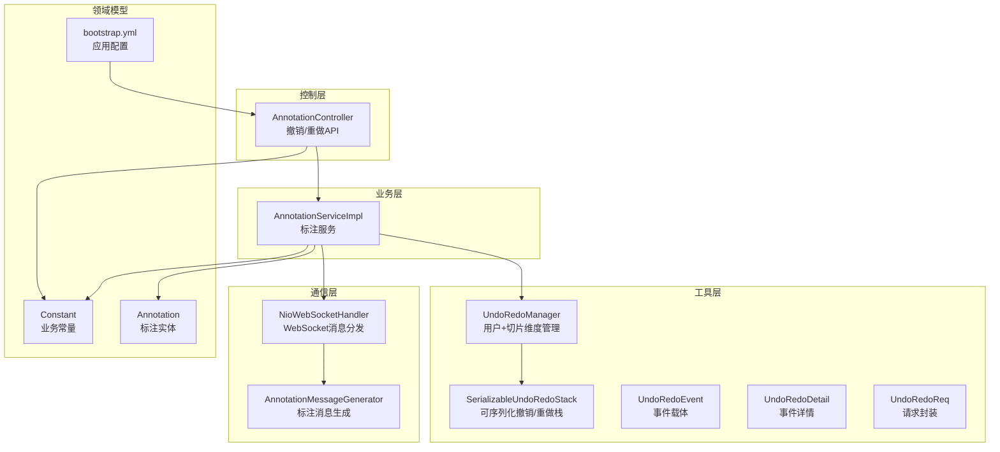
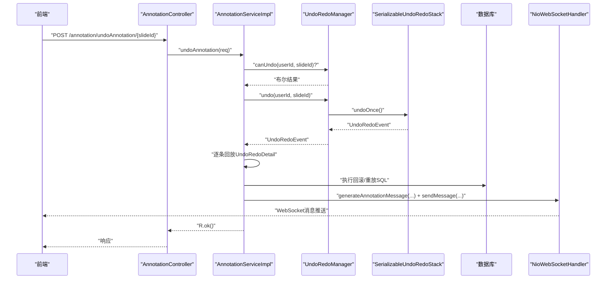
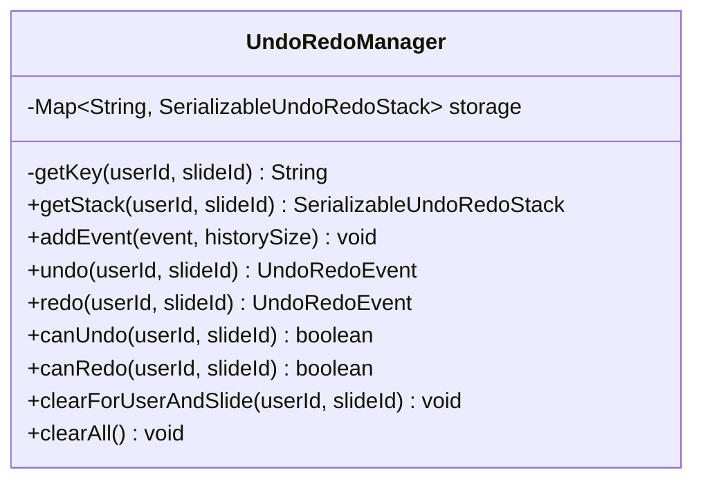
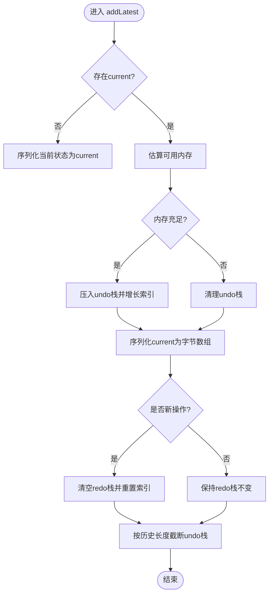
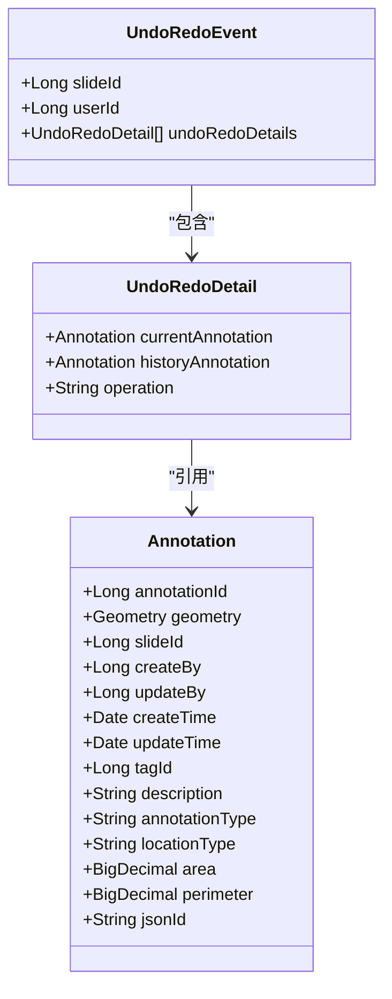
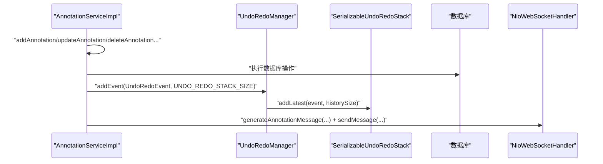
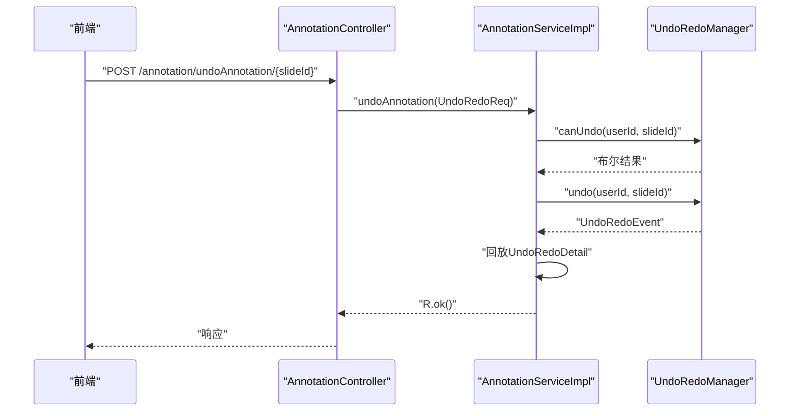
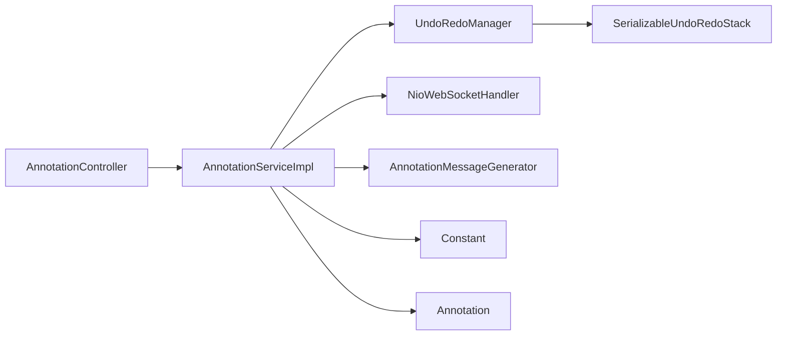

# 撤销重做系统

<cite>
**本文引用的文件**
- [UndoRedoManager.java](file://src/main/java/cn/staitech/annotation/utils/annotation/UndoRedoManager.java)
- [SerializableUndoRedoStack.java](file://src/main/java/cn/staitech/annotation/utils/annotation/SerializableUndoRedoStack.java)
- [UndoRedoEvent.java](file://src/main/java/cn/staitech/annotation/utils/annotation/UndoRedoEvent.java)
- [UndoRedoDetail.java](file://src/main/java/cn/staitech/annotation/utils/annotation/UndoRedoDetail.java)
- [UndoRedoReq.java](file://src/main/java/cn/staitech/annotation/utils/annotation/UndoRedoReq.java)
- [AnnotationServiceImpl.java](file://src/main/java/cn/staitech/annotation/service/impl/AnnotationServiceImpl.java)
- [AnnotationController.java](file://src/main/java/cn/staitech/annotation/controller/AnnotationController.java)
- [NioWebSocketHandler.java](file://src/main/java/cn/staitech/annotation/netty/websocket/NioWebSocketHandler.java)
- [AnnotationMessageGenerator.java](file://src/main/java/cn/staitech/annotation/utils/annotation/AnnotationMessageGenerator.java)
- [Annotation.java](file://src/main/java/cn/staitech/annotation/domain/Annotation.java)
- [Constant.java](file://src/main/java/cn/staitech/annotation/constant/Constant.java)
- [bootstrap.yml](file://src/main/resources/bootstrap.yml)
</cite>

## 目录
1. [简介](#简介)
2. [项目结构](#项目结构)
3. [核心组件](#核心组件)
4. [架构总览](#架构总览)
5. [详细组件分析](#详细组件分析)
6. [依赖关系分析](#依赖关系分析)
7. [性能考量](#性能考量)
8. [故障排查指南](#故障排查指南)
9. [结论](#结论)
10. [附录](#附录)

## 简介
本文件面向医学图像标注系统的“撤销/重做”子系统，提供从架构设计到实现细节的完整说明。系统采用事件驱动模型，通过“事件捕获-历史记录存储-状态恢复”的闭环机制，支持用户维度与切片维度的并发控制，确保在高并发场景下的状态一致性与性能稳定。同时，系统具备完善的内存管理策略、序列化与反序列化能力，以及与标注系统的深度集成（事件监听、状态广播）。

## 项目结构
围绕撤销/重做功能的相关模块分布如下：
- 工具层：事件模型与撤销/重做栈（UndoRedoEvent、UndoRedoDetail、SerializableUndoRedoStack、UndoRedoManager）
- 业务层：标注服务（AnnotationServiceImpl），负责在标注变更时生成事件并调用撤销/重做管理器
- 控制层：标注控制器（AnnotationController），对外暴露撤销/重做API
- 通信层：WebSocket处理器（NioWebSocketHandler）与消息生成器（AnnotationMessageGenerator），负责将标注变更广播至前端
- 常量与配置：业务常量（Constant）、应用配置（bootstrap.yml）

**图表来源**
- [UndoRedoManager.java:19-94](file://src/main/java/cn/staitech/annotation/utils/annotation/UndoRedoManager.java#L19-L94)
- [SerializableUndoRedoStack.java:18-36](file://src/main/java/cn/staitech/annotation/utils/annotation/SerializableUndoRedoStack.java#L18-L36)
- [UndoRedoEvent.java:19-28](file://src/main/java/cn/staitech/annotation/utils/annotation/UndoRedoEvent.java#L19-L28)
- [UndoRedoDetail.java:19-29](file://src/main/java/cn/staitech/annotation/utils/annotation/UndoRedoDetail.java#L19-L29)
- [UndoRedoReq.java:14-17](file://src/main/java/cn/staitech/annotation/utils/annotation/UndoRedoReq.java#L14-L17)
- [AnnotationServiceImpl.java:46-61](file://src/main/java/cn/staitech/annotation/service/impl/AnnotationServiceImpl.java#L46-L61)
- [AnnotationController.java:43-251](file://src/main/java/cn/staitech/annotation/controller/AnnotationController.java#L43-L251)
- [NioWebSocketHandler.java:29-68](file://src/main/java/cn/staitech/annotation/netty/websocket/NioWebSocketHandler.java#L29-L68)
- [AnnotationMessageGenerator.java:38-50](file://src/main/java/cn/staitech/annotation/utils/annotation/AnnotationMessageGenerator.java#L38-L50)
- [Annotation.java:25-110](file://src/main/java/cn/staitech/annotation/domain/Annotation.java#L25-L110)
- [Constant.java:9-80](file://src/main/java/cn/staitech/annotation/constant/Constant.java#L9-L80)
- [bootstrap.yml:1-42](file://src/main/resources/bootstrap.yml#L1-L42)

**章节来源**
- [UndoRedoManager.java:19-94](file://src/main/java/cn/staitech/annotation/utils/annotation/UndoRedoManager.java#L19-L94)
- [AnnotationServiceImpl.java:46-61](file://src/main/java/cn/staitech/annotation/service/impl/AnnotationServiceImpl.java#L46-L61)
- [AnnotationController.java:43-251](file://src/main/java/cn/staitech/annotation/controller/AnnotationController.java#L43-L251)
- [NioWebSocketHandler.java:29-68](file://src/main/java/cn/staitech/annotation/netty/websocket/NioWebSocketHandler.java#L29-L68)
- [AnnotationMessageGenerator.java:38-50](file://src/main/java/cn/staitech/annotation/utils/annotation/AnnotationMessageGenerator.java#L38-L50)
- [Annotation.java:25-110](file://src/main/java/cn/staitech/annotation/domain/Annotation.java#L25-L110)
- [Constant.java:9-80](file://src/main/java/cn/staitech/annotation/constant/Constant.java#L9-L80)
- [bootstrap.yml:1-42](file://src/main/resources/bootstrap.yml#L1-L42)

## 核心组件
- 事件模型
  - UndoRedoEvent：承载一次撤销/重做的事件，包含用户ID、切片ID、事件详情列表
  - UndoRedoDetail：具体标注变更的详情，包含当前状态、历史状态、操作类型
- 撤销/重做栈
  - SerializableUndoRedoStack：基于字节数组的可序列化栈，支持撤销、重做、清理、内存估算
- 管理器
  - UndoRedoManager：按“用户ID:切片ID”维度管理撤销/重做栈，提供添加事件、撤销、重做、状态查询、定时清理等能力
- 业务集成
  - AnnotationServiceImpl：在标注增删改、批量操作、轮廓运算等关键路径生成UndoRedoEvent并调用管理器
  - AnnotationController：对外提供撤销/重做API，绑定当前登录用户
  - NioWebSocketHandler + AnnotationMessageGenerator：将标注变更广播至前端，保持界面一致

**章节来源**
- [UndoRedoEvent.java:19-28](file://src/main/java/cn/staitech/annotation/utils/annotation/UndoRedoEvent.java#L19-L28)
- [UndoRedoDetail.java:19-29](file://src/main/java/cn/staitech/annotation/utils/annotation/UndoRedoDetail.java#L19-L29)
- [SerializableUndoRedoStack.java:18-36](file://src/main/java/cn/staitech/annotation/utils/annotation/SerializableUndoRedoStack.java#L18-L36)
- [UndoRedoManager.java:19-94](file://src/main/java/cn/staitech/annotation/utils/annotation/UndoRedoManager.java#L19-L94)
- [AnnotationServiceImpl.java:184-238](file://src/main/java/cn/staitech/annotation/service/impl/AnnotationServiceImpl.java#L184-L238)
- [AnnotationController.java:226-248](file://src/main/java/cn/staitech/annotation/controller/AnnotationController.java#L226-L248)
- [NioWebSocketHandler.java:38-68](file://src/main/java/cn/staitech/annotation/netty/websocket/NioWebSocketHandler.java#L38-L68)
- [AnnotationMessageGenerator.java:40-50](file://src/main/java/cn/staitech/annotation/utils/annotation/AnnotationMessageGenerator.java#L40-L50)

## 架构总览
系统采用“事件驱动 + 并发隔离 + 内存自适应”的设计：
- 事件捕获：标注服务在关键变更点生成UndoRedoEvent并提交到UndoRedoManager
- 历史记录存储：UndoRedoManager按用户+切片维度维护SerializableUndoRedoStack，内部以字节数组序列化当前状态
- 状态恢复：撤销/重做时，从栈顶弹出序列化状态并反序列化，再逐条回放UndoRedoDetail完成实际数据库回滚或重放
- 广播通知：标注变更通过WebSocket推送到前端，确保界面与后端状态一致
- 并发控制：以“用户ID:切片ID”为键的ConcurrentHashMap实现天然的用户+切片维度隔离；栈操作使用synchronized保证原子性
- 内存管理：根据可用内存动态决定是否清理撤销栈，避免OOM；支持定时全量清理

**图表来源**
- [AnnotationController.java:226-230](file://src/main/java/cn/staitech/annotation/controller/AnnotationController.java#L226-L230)
- [AnnotationServiceImpl.java:677-701](file://src/main/java/cn/staitech/annotation/service/impl/AnnotationServiceImpl.java#L677-L701)
- [UndoRedoManager.java:50-61](file://src/main/java/cn/staitech/annotation/utils/annotation/UndoRedoManager.java#L50-L61)
- [SerializableUndoRedoStack.java:113-135](file://src/main/java/cn/staitech/annotation/utils/annotation/SerializableUndoRedoStack.java#L113-L135)
- [NioWebSocketHandler.java:38-68](file://src/main/java/cn/staitech/annotation/netty/websocket/NioWebSocketHandler.java#L38-L68)
- [AnnotationMessageGenerator.java:40-50](file://src/main/java/cn/staitech/annotation/utils/annotation/AnnotationMessageGenerator.java#L40-L50)

## 详细组件分析

### 组件A：UndoRedoManager（用户+切片维度管理）
- 角色定位：全局撤销/重做管理器，按“用户ID:切片ID”键管理独立的撤销/重做栈
- 关键能力
  - 获取/初始化栈：按键计算并懒加载
  - 添加事件：将UndoRedoEvent写入对应栈，限制历史长度
  - 撤销/重做：返回上一状态或下一状态的UndoRedoEvent
  - 状态查询：canUndo/canRedo
  - 清理：按用户+切片清理；定时全量清理
- 并发与一致性
  - 使用ConcurrentHashMap作为存储容器，天然支持多用户并发
  - 栈内操作使用synchronized，保证撤销/重做过程的原子性

**图表来源**
- [UndoRedoManager.java:19-94](file://src/main/java/cn/staitech/annotation/utils/annotation/UndoRedoManager.java#L19-L94)

**章节来源**
- [UndoRedoManager.java:19-94](file://src/main/java/cn/staitech/annotation/utils/annotation/UndoRedoManager.java#L19-L94)

### 组件B：SerializableUndoRedoStack（可序列化撤销/重做栈）
- 数据结构
  - current：当前状态的字节数组
  - undoStack/redoStack：分别存放历史与未来状态的字节数组
  - undoIndex/redoIndex：索引，用于canUndo/canRedo判断
- 核心算法
  - addLatest：序列化当前状态，压入undo栈；若发生新操作则清空redo栈；根据历史长度截断
  - undoOnce：将current压入redo栈，索引递减；从undo栈弹出并反序列化
  - redoOnce：将current压入undo栈，索引递增；从redo栈弹出并反序列化
  - 内存自适应：当可用内存不足时清理undo栈，避免OOM
- 错误处理
  - 反序列化失败抛出运行时异常，便于上层统一处理

**图表来源**
- [SerializableUndoRedoStack.java:144-173](file://src/main/java/cn/staitech/annotation/utils/annotation/SerializableUndoRedoStack.java#L144-L173)

**章节来源**
- [SerializableUndoRedoStack.java:18-246](file://src/main/java/cn/staitech/annotation/utils/annotation/SerializableUndoRedoStack.java#L18-L246)

### 组件C：事件模型（UndoRedoEvent / UndoRedoDetail）
- UndoRedoEvent：包含slideId、userId、undoRedoDetails
- UndoRedoDetail：包含currentAnnotation、historyAnnotation、operation
- 作用：在标注服务的关键节点生成事件，记录变更前后的状态与操作类型，供撤销/重做时回放

**图表来源**
- [UndoRedoEvent.java:19-28](file://src/main/java/cn/staitech/annotation/utils/annotation/UndoRedoEvent.java#L19-L28)
- [UndoRedoDetail.java:19-29](file://src/main/java/cn/staitech/annotation/utils/annotation/UndoRedoDetail.java#L19-L29)
- [Annotation.java:25-110](file://src/main/java/cn/staitech/annotation/domain/Annotation.java#L25-L110)

**章节来源**
- [UndoRedoEvent.java:19-28](file://src/main/java/cn/staitech/annotation/utils/annotation/UndoRedoEvent.java#L19-L28)
- [UndoRedoDetail.java:19-29](file://src/main/java/cn/staitech/annotation/utils/annotation/UndoRedoDetail.java#L19-L29)
- [Annotation.java:25-110](file://src/main/java/cn/staitech/annotation/domain/Annotation.java#L25-L110)

### 组件D：标注服务与撤销/重做集成
- 事件生成
  - 新增：生成ADD事件，记录当前状态
  - 删除：生成DELETE事件，记录当前状态
  - 更新：生成UPDATE事件，记录当前与历史状态
  - 批量：将多个变更打包为一个UndoRedoEvent，逐条回放
  - 轮廓运算：生成UPDATE事件，记录运算前后状态
- 回放策略
  - 撤销：根据operation回放ADD/DELETE/UPDATE
  - 重做：同理，但方向相反
- 广播通知
  - 每次成功变更后，通过WebSocket推送AnnotationMessage，前端即时刷新

**图表来源**
- [AnnotationServiceImpl.java:184-238](file://src/main/java/cn/staitech/annotation/service/impl/AnnotationServiceImpl.java#L184-L238)
- [AnnotationServiceImpl.java:268-300](file://src/main/java/cn/staitech/annotation/service/impl/AnnotationServiceImpl.java#L268-L300)
- [AnnotationServiceImpl.java:330-440](file://src/main/java/cn/staitech/annotation/service/impl/AnnotationServiceImpl.java#L330-L440)
- [AnnotationServiceImpl.java:537-571](file://src/main/java/cn/staitech/annotation/service/impl/AnnotationServiceImpl.java#L537-L571)
- [AnnotationServiceImpl.java:574-623](file://src/main/java/cn/staitech/annotation/service/impl/AnnotationServiceImpl.java#L574-L623)
- [UndoRedoManager.java:42-45](file://src/main/java/cn/staitech/annotation/utils/annotation/UndoRedoManager.java#L42-L45)
- [NioWebSocketHandler.java:38-68](file://src/main/java/cn/staitech/annotation/netty/websocket/NioWebSocketHandler.java#L38-L68)
- [AnnotationMessageGenerator.java:40-50](file://src/main/java/cn/staitech/annotation/utils/annotation/AnnotationMessageGenerator.java#L40-L50)

**章节来源**
- [AnnotationServiceImpl.java:184-238](file://src/main/java/cn/staitech/annotation/service/impl/AnnotationServiceImpl.java#L184-L238)
- [AnnotationServiceImpl.java:268-300](file://src/main/java/cn/staitech/annotation/service/impl/AnnotationServiceImpl.java#L268-L300)
- [AnnotationServiceImpl.java:330-440](file://src/main/java/cn/staitech/annotation/service/impl/AnnotationServiceImpl.java#L330-L440)
- [AnnotationServiceImpl.java:442-501](file://src/main/java/cn/staitech/annotation/service/impl/AnnotationServiceImpl.java#L442-L501)
- [AnnotationServiceImpl.java:537-571](file://src/main/java/cn/staitech/annotation/service/impl/AnnotationServiceImpl.java#L537-L571)
- [AnnotationServiceImpl.java:574-623](file://src/main/java/cn/staitech/annotation/service/impl/AnnotationServiceImpl.java#L574-L623)
- [AnnotationServiceImpl.java:625-701](file://src/main/java/cn/staitech/annotation/service/impl/AnnotationServiceImpl.java#L625-L701)
- [NioWebSocketHandler.java:38-68](file://src/main/java/cn/staitech/annotation/netty/websocket/NioWebSocketHandler.java#L38-L68)
- [AnnotationMessageGenerator.java:40-50](file://src/main/java/cn/staitech/annotation/utils/annotation/AnnotationMessageGenerator.java#L40-L50)

### 组件E：API与触发条件
- 撤销API：POST /annotation/undoAnnotation/{slideId}
- 重做API：POST /annotation/redoAnnotation/{slideId}
- 触发条件
  - 用户维度：当前登录用户
  - 切片维度：URL路径中的slideId
  - 状态检查：先检查canUndo/canRedo，再执行undo/redo
- 执行流程
  - 控制器接收请求，构造UndoRedoReq
  - 调用服务层undoAnnotation/redoAnnotation
  - 服务层委托UndoRedoManager执行，并回放UndoRedoDetail
  - 成功后通过WebSocket广播最新状态

**图表来源**
- [AnnotationController.java:226-230](file://src/main/java/cn/staitech/annotation/controller/AnnotationController.java#L226-L230)
- [AnnotationServiceImpl.java:677-701](file://src/main/java/cn/staitech/annotation/service/impl/AnnotationServiceImpl.java#L677-L701)
- [UndoRedoManager.java:66-69](file://src/main/java/cn/staitech/annotation/utils/annotation/UndoRedoManager.java#L66-L69)

**章节来源**
- [AnnotationController.java:226-248](file://src/main/java/cn/staitech/annotation/controller/AnnotationController.java#L226-L248)
- [AnnotationServiceImpl.java:677-701](file://src/main/java/cn/staitech/annotation/service/impl/AnnotationServiceImpl.java#L677-L701)
- [UndoRedoManager.java:66-69](file://src/main/java/cn/staitech/annotation/utils/annotation/UndoRedoManager.java#L66-L69)

## 依赖关系分析
- 组件耦合
  - AnnotationServiceImpl依赖UndoRedoManager与WebSocket组件，形成“业务-撤销/重做-通信”的三层依赖
  - UndoRedoManager依赖SerializableUndoRedoStack，形成“管理-存储”的单向依赖
- 外部依赖
  - JTS几何库用于轮廓运算与距离计算
  - Netty WebSocket用于实时消息推送
  - Spring Boot与Spring Cloud用于配置与服务发现

**图表来源**
- [AnnotationController.java:43-251](file://src/main/java/cn/staitech/annotation/controller/AnnotationController.java#L43-L251)
- [AnnotationServiceImpl.java:46-61](file://src/main/java/cn/staitech/annotation/service/impl/AnnotationServiceImpl.java#L46-L61)
- [UndoRedoManager.java:19-94](file://src/main/java/cn/staitech/annotation/utils/annotation/UndoRedoManager.java#L19-L94)
- [SerializableUndoRedoStack.java:18-36](file://src/main/java/cn/staitech/annotation/utils/annotation/SerializableUndoRedoStack.java#L18-L36)
- [NioWebSocketHandler.java:29-68](file://src/main/java/cn/staitech/annotation/netty/websocket/NioWebSocketHandler.java#L29-L68)
- [AnnotationMessageGenerator.java:38-50](file://src/main/java/cn/staitech/annotation/utils/annotation/AnnotationMessageGenerator.java#L38-L50)
- [Annotation.java:25-110](file://src/main/java/cn/staitech/annotation/domain/Annotation.java#L25-L110)
- [Constant.java:9-80](file://src/main/java/cn/staitech/annotation/constant/Constant.java#L9-L80)

**章节来源**
- [AnnotationController.java:43-251](file://src/main/java/cn/staitech/annotation/controller/AnnotationController.java#L43-L251)
- [AnnotationServiceImpl.java:46-61](file://src/main/java/cn/staitech/annotation/service/impl/AnnotationServiceImpl.java#L46-L61)
- [UndoRedoManager.java:19-94](file://src/main/java/cn/staitech/annotation/utils/annotation/UndoRedoManager.java#L19-L94)
- [SerializableUndoRedoStack.java:18-36](file://src/main/java/cn/staitech/annotation/utils/annotation/SerializableUndoRedoStack.java#L18-L36)
- [NioWebSocketHandler.java:29-68](file://src/main/java/cn/staitech/annotation/netty/websocket/NioWebSocketHandler.java#L29-L68)
- [AnnotationMessageGenerator.java:38-50](file://src/main/java/cn/staitech/annotation/utils/annotation/AnnotationMessageGenerator.java#L38-L50)
- [Annotation.java:25-110](file://src/main/java/cn/staitech/annotation/domain/Annotation.java#L25-L110)
- [Constant.java:9-80](file://src/main/java/cn/staitech/annotation/constant/Constant.java#L9-L80)

## 性能考量
- 内存管理
  - 采用字节数组序列化当前状态，避免直接持有复杂对象图
  - 当可用内存低于阈值时主动清理undo栈，防止内存溢出
  - 提供totalBytes统计，便于监控与告警
- 历史长度控制
  - 通过常量UNDO_REDO_STACK_SIZE限制历史深度，默认100
- 并发与锁粒度
  - 按“用户ID:切片ID”键隔离，降低锁竞争
  - 栈内操作synchronized，保证单用户单切片内的原子性
- I/O与网络
  - WebSocket推送标注变更，减少轮询开销
  - 消息序列化失败时记录日志并快速返回，避免阻塞

[本节为通用性能建议，不直接分析具体文件]

## 故障排查指南
- 常见问题
  - 无法撤销/重做：检查canUndo/canRedo状态，确认历史记录是否存在
  - 反序列化失败：查看日志中的异常堆栈，确认类加载器与序列化版本兼容
  - WebSocket未推送：检查消息序列化与通道有效性
- 定位方法
  - 查看AnnotationServiceImpl中的回放逻辑与异常日志
  - 检查UndoRedoManager与SerializableUndoRedoStack的日志输出
  - 使用/checkUndoAndRedoStatus接口确认当前状态

**章节来源**
- [AnnotationServiceImpl.java:625-701](file://src/main/java/cn/staitech/annotation/service/impl/AnnotationServiceImpl.java#L625-L701)
- [SerializableUndoRedoStack.java:100-105](file://src/main/java/cn/staitech/annotation/utils/annotation/SerializableUndoRedoStack.java#L100-L105)
- [NioWebSocketHandler.java:38-68](file://src/main/java/cn/staitech/annotation/netty/websocket/NioWebSocketHandler.java#L38-L68)

## 结论
该撤销/重做系统以事件驱动为核心，结合用户+切片维度的并发隔离与内存自适应策略，在保证状态一致性的同时兼顾了性能与可维护性。通过与标注服务的深度集成与WebSocket广播，实现了从后端到前端的完整闭环。建议在生产环境中配合监控指标（如totalBytes、canUndo/canRedo状态）与定期清理策略，持续优化内存占用与用户体验。

[本节为总结性内容，不直接分析具体文件]

## 附录

### API定义与触发条件
- 撤销
  - 方法：POST
  - 路径：/annotation/undoAnnotation/{slideId}
  - 请求体：无（使用当前登录用户）
  - 触发条件：canUndo为真
  - 执行流程：服务层回放UndoRedoDetail，数据库回滚，WebSocket推送
- 重做
  - 方法：POST
  - 路径：/annotation/redoAnnotation/{slideId}
  - 请求体：无（使用当前登录用户）
  - 触发条件：canRedo为真
  - 执行流程：服务层回放UndoRedoDetail，数据库重放，WebSocket推送
- 清除
  - 方法：POST
  - 路径：/annotation/clear/{slideId}
  - 功能：清除当前用户在该切片的撤销/重做记录
- 状态检查
  - 方法：POST
  - 路径：/annotation/checkUndoAndRedoStatus/{slideId}
  - 返回：{ "undo": true/false, "redo": true/false }

**章节来源**
- [AnnotationController.java:226-248](file://src/main/java/cn/staitech/annotation/controller/AnnotationController.java#L226-L248)
- [AnnotationServiceImpl.java:703-717](file://src/main/java/cn/staitech/annotation/service/impl/AnnotationServiceImpl.java#L703-L717)

### 事件序列化机制
- 序列化
  - 使用Java标准序列化，提供初始容量参数以提升性能
- 反序列化
  - 自定义resolveClass，使用当前类加载器加载类，避免类版本不匹配
- 异常处理
  - 捕获ClassNotFoundException、IOException与通用异常，记录日志并抛出运行时异常

**章节来源**
- [SerializableUndoRedoStack.java:183-221](file://src/main/java/cn/staitech/annotation/utils/annotation/SerializableUndoRedoStack.java#L183-L221)

### 内存管理策略
- 内存估算
  - estimateAvailableMemory/estimateUsedMemory，结合JVM最大内存与已用内存估算剩余空间
- 自适应清理
  - 当可用内存小于当前状态大小的1.5倍时，清理undo栈
- 历史长度控制
  - addLatest后按UNDO_REDO_STACK_SIZE截断undo栈

**章节来源**
- [SerializableUndoRedoStack.java:230-243](file://src/main/java/cn/staitech/annotation/utils/annotation/SerializableUndoRedoStack.java#L230-L243)
- [SerializableUndoRedoStack.java:148-173](file://src/main/java/cn/staitech/annotation/utils/annotation/SerializableUndoRedoStack.java#L148-L173)
- [Constant.java](file://src/main/java/cn/staitech/annotation/constant/Constant.java#L61)

### 并发控制与一致性
- 锁机制
  - ConcurrentHashMap按“用户ID:切片ID”键隔离
  - 栈内操作synchronized，保证单用户单切片原子性
- 冲突检测
  - 通过键隔离天然避免跨用户/跨切片冲突
  - 栈索引与canUndo/canRedo保证操作顺序一致性

**章节来源**
- [UndoRedoManager.java:21-37](file://src/main/java/cn/staitech/annotation/utils/annotation/UndoRedoManager.java#L21-L37)
- [SerializableUndoRedoStack.java:43-54](file://src/main/java/cn/staitech/annotation/utils/annotation/SerializableUndoRedoStack.java#L43-L54)

### 与标注系统的集成
- 事件监听
  - 在标注增删改、批量、轮廓运算等关键路径生成UndoRedoEvent
- 历史状态持久化
  - 通过UndoRedoManager与SerializableUndoRedoStack的序列化机制，将状态以字节数组形式保存
- 实时广播
  - 通过NioWebSocketHandler与AnnotationMessageGenerator将标注变更推送给前端

**章节来源**
- [AnnotationServiceImpl.java:184-238](file://src/main/java/cn/staitech/annotation/service/impl/AnnotationServiceImpl.java#L184-L238)
- [AnnotationServiceImpl.java:268-300](file://src/main/java/cn/staitech/annotation/service/impl/AnnotationServiceImpl.java#L268-L300)
- [AnnotationServiceImpl.java:330-440](file://src/main/java/cn/staitech/annotation/service/impl/AnnotationServiceImpl.java#L330-L440)
- [AnnotationServiceImpl.java:537-571](file://src/main/java/cn/staitech/annotation/service/impl/AnnotationServiceImpl.java#L537-L571)
- [AnnotationServiceImpl.java:574-623](file://src/main/java/cn/staitech/annotation/service/impl/AnnotationServiceImpl.java#L574-L623)
- [NioWebSocketHandler.java:38-68](file://src/main/java/cn/staitech/annotation/netty/websocket/NioWebSocketHandler.java#L38-L68)
- [AnnotationMessageGenerator.java:40-50](file://src/main/java/cn/staitech/annotation/utils/annotation/AnnotationMessageGenerator.java#L40-L50)