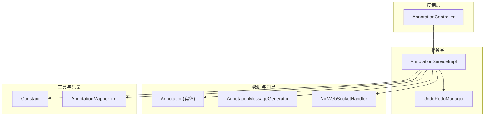
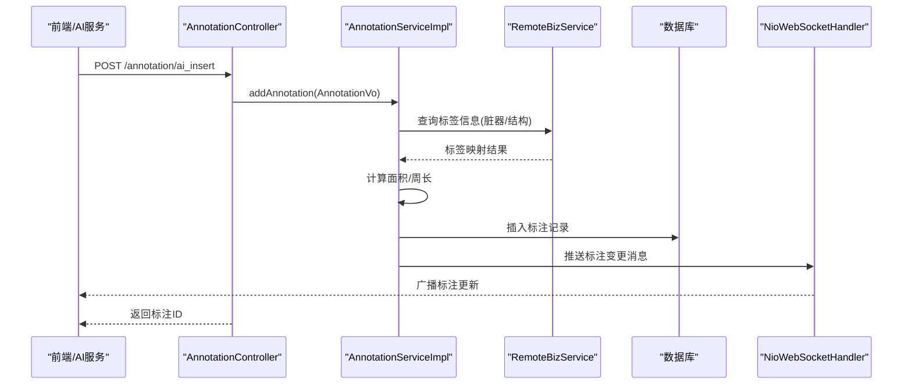
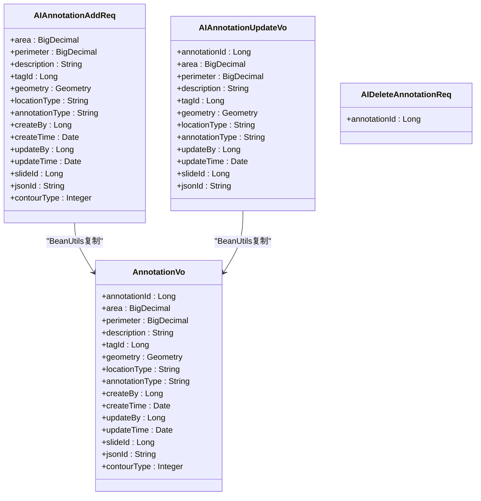
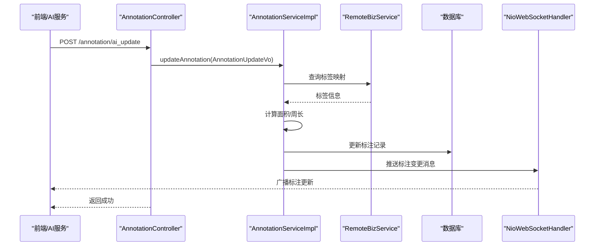
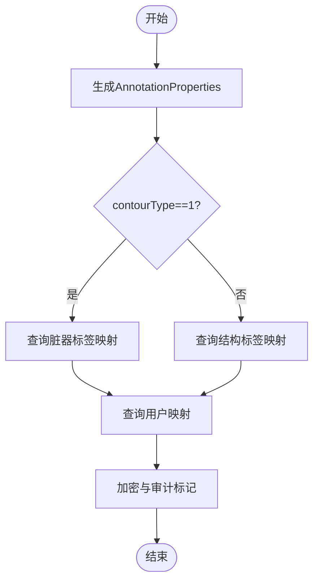
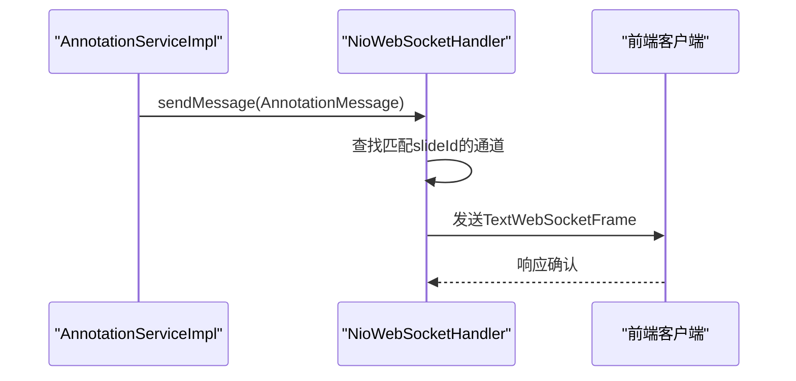
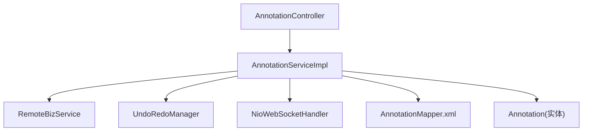

# AI辅助标注集成

<cite>
**本文引用的文件**
- [AIAnnotationAddReq.java](file://src/main/java/cn/staitech/annotation/vo/anno/AIAnnotationAddReq.java)
- [AIAnnotationUpdateVo.java](file://src/main/java/cn/staitech/annotation/vo/anno/AIAnnotationUpdateVo.java)
- [AIDeleteAnnotationReq.java](file://src/main/java/cn/staitech/annotation/vo/anno/AIDeleteAnnotationReq.java)
- [AnnotationController.java](file://src/main/java/cn/staitech/annotation/controller/AnnotationController.java)
- [AnnotationServiceImpl.java](file://src/main/java/cn/staitech/annotation/service/impl/AnnotationServiceImpl.java)
- [Annotation.java](file://src/main/java/cn/staitech/annotation/domain/Annotation.java)
- [Constant.java](file://src/main/java/cn/staitech/annotation/constant/Constant.java)
- [AnnotationMessageGenerator.java](file://src/main/java/cn/staitech/annotation/utils/annotation/AnnotationMessageGenerator.java)
- [AnnotationFeature.java](file://src/main/java/cn/staitech/annotation/netty/message/AnnotationFeature.java)
- [NioWebSocketHandler.java](file://src/main/java/cn/staitech/annotation/netty/websocket/NioWebSocketHandler.java)
- [UndoRedoManager.java](file://src/main/java/cn/staitech/annotation/utils/annotation/UndoRedoManager.java)
- [AnnotationVo.java](file://src/main/java/cn/staitech/annotation/vo/anno/AnnotationVo.java)
- [AnnotationMapper.xml](file://src/main/resources/mapper/AnnotationMapper.xml)
</cite>

## 目录
1. [简介](#简介)
2. [项目结构](#项目结构)
3. [核心组件](#核心组件)
4. [架构总览](#架构总览)
5. [详细组件分析](#详细组件分析)
6. [依赖分析](#依赖分析)
7. [性能考虑](#性能考虑)
8. [故障排除指南](#故障排除指南)
9. [结论](#结论)
10. [附录](#附录)

## 简介
本技术文档围绕AI辅助标注集成功能展开，系统性阐述AI标注数据的处理流程、请求体设计、与人工标注的差异、数据格式转换与兼容性、质量控制与审核流程、人工修正能力，以及完整的实现示例、性能优化策略、缓存与并发处理机制。目标是帮助开发者快速理解并高效集成AI标注能力，确保标注数据的准确性、一致性与可追溯性。

## 项目结构
标注模块采用分层架构：
- 控制层：AnnotationController 提供REST接口，区分AI与人工标注的新增、更新、删除、粘贴等操作。
- 服务层：AnnotationServiceImpl 实现标注业务逻辑，包含几何运算、标签映射、撤销/重做、WebSocket广播等。
- 数据模型：Annotation 表示标注实体，支持几何字段与扩展属性。
- 工具与消息：AnnotationMessageGenerator 负责生成GeoJSON Feature与属性，NioWebSocketHandler 负责向前端推送标注变更。
- 常量与配置：Constant 定义标注类型、操作动作、分辨率等常量；UndoRedoManager 提供撤销/重做栈管理。

图表来源
- [AnnotationController.java:44-251](file://src/main/java/cn/staitech/annotation/controller/AnnotationController.java#L44-L251)
- [AnnotationServiceImpl.java:46-724](file://src/main/java/cn/staitech/annotation/service/impl/AnnotationServiceImpl.java#L46-L724)
- [Annotation.java:23-187](file://src/main/java/cn/staitech/annotation/domain/Annotation.java#L23-L187)
- [AnnotationMessageGenerator.java:38-349](file://src/main/java/cn/staitech/annotation/utils/annotation/AnnotationMessageGenerator.java#L38-L349)
- [NioWebSocketHandler.java:29-197](file://src/main/java/cn/staitech/annotation/netty/websocket/NioWebSocketHandler.java#L29-L197)
- [Constant.java:9-80](file://src/main/java/cn/staitech/annotation/constant/Constant.java#L9-L80)
- [AnnotationMapper.xml:1-9](file://src/main/resources/mapper/AnnotationMapper.xml#L1-L9)

章节来源
- [AnnotationController.java:44-251](file://src/main/java/cn/staitech/annotation/controller/AnnotationController.java#L44-L251)
- [AnnotationServiceImpl.java:46-724](file://src/main/java/cn/staitech/annotation/service/impl/AnnotationServiceImpl.java#L46-L724)

## 核心组件
- AI专用请求体
  - AIAnnotationAddReq：用于接收AI生成的标注，包含几何、标签、标注类型、切片ID等字段，便于与人工标注区分。
  - AIAnnotationUpdateVo：用于AI标注的更新，支持几何、标签、标注类型等字段更新。
  - AIDeleteAnnotationReq：用于AI标注的删除，主要携带主键ID。
- 控制器接口
  - ai_insert、ai_update、ai_delete：分别对应AI标注的新增、更新、删除。
  - insert、update、delete：对应人工标注的接口，便于对比与兼容。
- 服务层实现
  - addAnnotation、updateAnnotation、deleteAnnotation：封装AI与人工标注的通用逻辑，同时处理标签映射、几何面积/周长计算、撤销/重做、WebSocket广播。
- 消息与同步
  - AnnotationMessageGenerator：生成GeoJSON Feature与属性，支持脏器标签与结构标签映射。
  - NioWebSocketHandler：根据切片ID向前端推送标注变更消息。
- 撤销/重做
  - UndoRedoManager：基于userId:slideId维度的并发安全撤销/重做栈，支持定时清理。

章节来源
- [AIAnnotationAddReq.java:24-118](file://src/main/java/cn/staitech/annotation/vo/anno/AIAnnotationAddReq.java#L24-L118)
- [AIAnnotationUpdateVo.java:22-101](file://src/main/java/cn/staitech/annotation/vo/anno/AIAnnotationUpdateVo.java#L22-L101)
- [AIDeleteAnnotationReq.java:8-16](file://src/main/java/cn/staitech/annotation/vo/anno/AIDeleteAnnotationReq.java#L8-L16)
- [AnnotationController.java:62-81](file://src/main/java/cn/staitech/annotation/controller/AnnotationController.java#L62-L81)
- [AnnotationServiceImpl.java:184-440](file://src/main/java/cn/staitech/annotation/service/impl/AnnotationServiceImpl.java#L184-L440)
- [AnnotationMessageGenerator.java:38-349](file://src/main/java/cn/staitech/annotation/utils/annotation/AnnotationMessageGenerator.java#L38-L349)
- [NioWebSocketHandler.java:38-68](file://src/main/java/cn/staitech/annotation/netty/websocket/NioWebSocketHandler.java#L38-L68)
- [UndoRedoManager.java:19-95](file://src/main/java/cn/staitech/annotation/utils/annotation/UndoRedoManager.java#L19-L95)

## 架构总览
AI标注集成通过REST接口接收AI数据，服务层进行格式验证与转换，调用远程标签服务完成标签映射，计算几何面积/周长，持久化到数据库，并通过WebSocket向前端推送变更。同时支持撤销/重做与批量操作，保证标注质量与可追溯性。

图表来源
- [AnnotationController.java:62-69](file://src/main/java/cn/staitech/annotation/controller/AnnotationController.java#L62-L69)
- [AnnotationServiceImpl.java:184-238](file://src/main/java/cn/staitech/annotation/service/impl/AnnotationServiceImpl.java#L184-L238)
- [AnnotationMessageGenerator.java:114-126](file://src/main/java/cn/staitech/annotation/utils/annotation/AnnotationMessageGenerator.java#L114-L126)
- [NioWebSocketHandler.java:38-68](file://src/main/java/cn/staitech/annotation/netty/websocket/NioWebSocketHandler.java#L38-L68)

## 详细组件分析

### AI专用请求体设计与数据模型
- 设计理念
  - 字段命名与注解：使用@JsonProperty映射前后端字段名，如category_id、slide_id、annotation_type等，确保与前端约定一致。
  - 几何字段：geometry为必填字段，使用JTS Geometry类型，便于后续几何运算与精度换算。
  - 标注类型：annotation_type用于区分AI与Draw（人工绘制）标注，便于后续流程控制与质量控制。
  - 标签映射：tagId与tagIdLog配合，前者为数据库存储，后者为审计/日志显示。
  - 标识字段：jsonId用于GeoJSON数据标识，contourType用于脏器/结构区分。
- 与人工标注的差异
  - AIAnnotationAddReq/AIAnnotationUpdateVo缺少部分人工标注特有的字段（如描述、位置类型），更偏向于几何与标签的最小必要字段集合，便于AI输出标准化。
  - annotation_type统一设置为“AI”，便于后端与前端区分处理路径。
- 数据格式转换与兼容性
  - 通过BeanUtils复制到AnnotationVo，实现与人工标注的统一处理。
  - 标签映射通过远程服务查询，兼容脏器标签与结构标签两种类型。
  - 几何面积/周长计算时使用Constant中的IMAGE_RESOLUTION与IMAGE_RESOLUTION_SQUARE进行像素到实际尺寸换算。

图表来源
- [AIAnnotationAddReq.java:24-118](file://src/main/java/cn/staitech/annotation/vo/anno/AIAnnotationAddReq.java#L24-L118)
- [AIAnnotationUpdateVo.java:22-101](file://src/main/java/cn/staitech/annotation/vo/anno/AIAnnotationUpdateVo.java#L22-L101)
- [AIDeleteAnnotationReq.java:8-16](file://src/main/java/cn/staitech/annotation/vo/anno/AIDeleteAnnotationReq.java#L8-L16)
- [AnnotationVo.java:26-202](file://src/main/java/cn/staitech/annotation/vo/anno/AnnotationVo.java#L26-L202)

章节来源
- [AIAnnotationAddReq.java:24-118](file://src/main/java/cn/staitech/annotation/vo/anno/AIAnnotationAddReq.java#L24-L118)
- [AIAnnotationUpdateVo.java:22-101](file://src/main/java/cn/staitech/annotation/vo/anno/AIAnnotationUpdateVo.java#L22-L101)
- [AIDeleteAnnotationReq.java:8-16](file://src/main/java/cn/staitech/annotation/vo/anno/AIDeleteAnnotationReq.java#L8-L16)
- [AnnotationVo.java:26-202](file://src/main/java/cn/staitech/annotation/vo/anno/AnnotationVo.java#L26-L202)

### 控制器与服务层流程
- 接口设计
  - ai_insert：接收AIAnnotationAddReq，复制到AnnotationVo后调用addAnnotation，返回标注ID。
  - ai_update：接收AIAnnotationUpdateVo，复制到AnnotationUpdateVo后调用updateAnnotation。
  - ai_delete：接收AIDeleteAnnotationReq，调用deleteAnnotation。
  - insert/update/delete：对应人工标注的接口，便于对比与兼容。
- 服务层处理
  - addAnnotation：查询标签映射（脏器/结构），生成jsonId与tagIdLog，计算面积/周长，插入数据库，触发撤销/重做事件，推送WebSocket消息。
  - updateAnnotation：更新标签映射，计算面积/周长，更新数据库，触发撤销/重做事件，推送WebSocket消息。
  - deleteAnnotation：软删除（写入删除表），触发撤销/重做事件，推送WebSocket消息。
  - 批量操作：支持批量更新与删除，统一记录撤销/重做事件。
- 撤销/重做
  - 基于UndoRedoManager的并发安全栈，按userId:slideId维度管理历史状态，支持撤销与重做，定时清理。

图表来源
- [AnnotationController.java:105-110](file://src/main/java/cn/staitech/annotation/controller/AnnotationController.java#L105-L110)
- [AnnotationServiceImpl.java:336-440](file://src/main/java/cn/staitech/annotation/service/impl/AnnotationServiceImpl.java#L336-L440)
- [NioWebSocketHandler.java:38-68](file://src/main/java/cn/staitech/annotation/netty/websocket/NioWebSocketHandler.java#L38-L68)

章节来源
- [AnnotationController.java:62-131](file://src/main/java/cn/staitech/annotation/controller/AnnotationController.java#L62-L131)
- [AnnotationServiceImpl.java:184-440](file://src/main/java/cn/staitech/annotation/service/impl/AnnotationServiceImpl.java#L184-L440)
- [UndoRedoManager.java:42-61](file://src/main/java/cn/staitech/annotation/utils/annotation/UndoRedoManager.java#L42-L61)

### 数据格式转换与消息生成
- GeoJSON生成
  - AnnotationMessageGenerator根据Annotation生成AnnotationFeature，包含geometry与properties。
  - properties中包含标注ID、类型、标签ID、面积、周长、描述、创建/更新者等信息，并根据contourType选择脏器标签或结构标签映射。
- 标签映射
  - 脏器标签：通过OrganTagQuery查询，生成OrganTagQueryVo映射。
  - 结构标签：通过StructureTagPageQuery查询，生成StructureTagPageVo映射。
- 用户映射
  - 通过RemoteUserService查询用户列表，生成userId到SysUser的映射，填充创建者与更新者名称。
- 加密与审计
  - 使用注解标记忽略日志字段，结合加密响应与审计日志，确保敏感信息保护。

图表来源
- [AnnotationMessageGenerator.java:61-88](file://src/main/java/cn/staitech/annotation/utils/annotation/AnnotationMessageGenerator.java#L61-L88)
- [AnnotationMessageGenerator.java:114-126](file://src/main/java/cn/staitech/annotation/utils/annotation/AnnotationMessageGenerator.java#L114-L126)
- [AnnotationMessageGenerator.java:249-276](file://src/main/java/cn/staitech/annotation/utils/annotation/AnnotationMessageGenerator.java#L249-L276)
- [AnnotationMessageGenerator.java:316-328](file://src/main/java/cn/staitech/annotation/utils/annotation/AnnotationMessageGenerator.java#L316-L328)

章节来源
- [AnnotationMessageGenerator.java:38-349](file://src/main/java/cn/staitech/annotation/utils/annotation/AnnotationMessageGenerator.java#L38-L349)
- [AnnotationFeature.java:14-33](file://src/main/java/cn/staitech/annotation/netty/message/AnnotationFeature.java#L14-L33)

### 同步机制与WebSocket推送
- 推送策略
  - NioWebSocketHandler根据message.getSlideId()匹配通道，向对应切片的客户端推送标注变更。
  - 支持文本帧与心跳（Ping/Pong），保持连接稳定。
- 消息内容
  - AnnotationMessage包含type（add/update/delete）、annotation_type、slideId与data（AnnotationFeature）。
- 广播范围
  - 仅向订阅该切片的客户端推送，避免无关干扰。

图表来源
- [NioWebSocketHandler.java:38-68](file://src/main/java/cn/staitech/annotation/netty/websocket/NioWebSocketHandler.java#L38-L68)
- [AnnotationMessageGenerator.java:40-50](file://src/main/java/cn/staitech/annotation/utils/annotation/AnnotationMessageGenerator.java#L40-L50)

章节来源
- [NioWebSocketHandler.java:29-197](file://src/main/java/cn/staitech/annotation/netty/websocket/NioWebSocketHandler.java#L29-L197)
- [AnnotationMessageGenerator.java:38-50](file://src/main/java/cn/staitech/annotation/utils/annotation/AnnotationMessageGenerator.java#L38-L50)

### 质量控制、审核与人工修正
- 质量控制
  - 标注类型区分：annotation_type为“AI”时，服务层按AI流程处理，便于后续质量评估与统计。
  - 几何计算：自动计算面积与周长，减少人工误差。
  - 标签映射：统一通过远程服务查询，确保标签一致性。
- 审核流程
  - 通过撤销/重做机制，支持对AI标注进行人工审核与修正。
  - 支持批量操作与历史状态检查，便于审核人员回溯。
- 人工修正
  - ai_stickup接口支持将AI标注复制为新标注，便于人工进一步编辑。
  - updateAnnotation支持修改标签与几何，结合撤销/重做实现修正闭环。

章节来源
- [AnnotationController.java:126-131](file://src/main/java/cn/staitech/annotation/controller/AnnotationController.java#L126-L131)
- [AnnotationServiceImpl.java:336-440](file://src/main/java/cn/staitech/annotation/service/impl/AnnotationServiceImpl.java#L336-L440)
- [UndoRedoManager.java:42-77](file://src/main/java/cn/staitech/annotation/utils/annotation/UndoRedoManager.java#L42-L77)

## 依赖分析
- 组件耦合
  - AnnotationController依赖AnnotationService与AnnotationSdService，职责清晰。
  - AnnotationServiceImpl依赖RemoteBizService、UndoRedoManager、NioWebSocketHandler、AnnotationDelMapper等，形成松耦合。
- 外部依赖
  - JTS用于几何运算与精度换算。
  - MyBatis用于数据库访问，Mapper文件位于resources目录。
  - Netty用于WebSocket通信。
- 循环依赖
  - 未发现循环依赖，各层职责明确。

图表来源
- [AnnotationController.java:45-48](file://src/main/java/cn/staitech/annotation/controller/AnnotationController.java#L45-L48)
- [AnnotationServiceImpl.java:49-60](file://src/main/java/cn/staitech/annotation/service/impl/AnnotationServiceImpl.java#L49-L60)
- [AnnotationMapper.xml:5-8](file://src/main/resources/mapper/AnnotationMapper.xml#L5-L8)

章节来源
- [AnnotationController.java:45-48](file://src/main/java/cn/staitech/annotation/controller/AnnotationController.java#L45-L48)
- [AnnotationServiceImpl.java:49-60](file://src/main/java/cn/staitech/annotation/service/impl/AnnotationServiceImpl.java#L49-L60)

## 性能考虑
- 几何运算优化
  - 采样点计算平均距离，避免大规模点集带来的性能问题。
  - 合并几何前先判断相交，减少无效运算。
- 缓存与映射
  - 标签与用户映射通过一次性查询构建Map，避免重复远程调用。
  - UndoRedo栈按userId:slideId维度管理，避免全局锁竞争。
- 并发处理
  - UndoRedoManager使用ConcurrentHashMap与线程安全栈，支持高并发场景。
  - WebSocket推送按切片维度筛选通道，降低广播压力。
- 数据库访问
  - 批量操作统一记录历史状态，减少多次事务开销。
  - Mapper文件预留扩展空间，便于后续SQL优化。

章节来源
- [AnnotationServiceImpl.java:68-113](file://src/main/java/cn/staitech/annotation/service/impl/AnnotationServiceImpl.java#L68-L113)
- [AnnotationServiceImpl.java:504-535](file://src/main/java/cn/staitech/annotation/service/impl/AnnotationServiceImpl.java#L504-L535)
- [AnnotationMessageGenerator.java:249-276](file://src/main/java/cn/staitech/annotation/utils/annotation/AnnotationMessageGenerator.java#L249-L276)
- [UndoRedoManager.java:22-37](file://src/main/java/cn/staitech/annotation/utils/annotation/UndoRedoManager.java#L22-L37)

## 故障排除指南
- 常见错误与定位
  - “NO_ANNOTATION_DATA”：标注不存在或几何为空，检查请求参数与数据库状态。
  - “ARGUMENT_INVALID”：必填字段缺失，检查geometry、slide_id等字段。
  - “FAILED_TO_CALCULATE_NEAREST_POINTS”：几何计算失败，检查几何有效性。
  - “ANNOTATION_CANNOT_UNDO/ANNOTATION_CANNOT_REDO”：撤销/重做栈为空或不可用，检查用户权限与切片状态。
- 日志与审计
  - 使用注解标记忽略日志字段，避免敏感信息泄露。
  - 加密响应与审计日志结合，便于问题追踪。
- 网络与同步
  - WebSocket连接失败：检查URI路径与握手过程，确认slideId参数正确。
  - 消息未送达：确认NioWebSocketHandler的通道映射与slideId匹配。

章节来源
- [AnnotationServiceImpl.java:122-138](file://src/main/java/cn/staitech/annotation/service/impl/AnnotationServiceImpl.java#L122-L138)
- [AnnotationServiceImpl.java:141-181](file://src/main/java/cn/staitech/annotation/service/impl/AnnotationServiceImpl.java#L141-L181)
- [NioWebSocketHandler.java:167-194](file://src/main/java/cn/staitech/annotation/netty/websocket/NioWebSocketHandler.java#L167-L194)

## 结论
AI辅助标注集成通过清晰的请求体设计、统一的服务层处理、完善的标签映射与几何计算、可靠的WebSocket同步与撤销/重做机制，实现了从AI数据接收、格式验证、存储处理到实时同步的完整闭环。该方案兼顾了性能与可维护性，适合在病理图像标注等高精度场景中推广使用。

## 附录
- 最佳实践
  - 明确标注类型：AI标注统一设置annotation_type为“AI”，便于流程控制与质量评估。
  - 标签一致性：通过远程服务统一查询标签，避免本地缓存不一致。
  - 几何有效性：在AI输出阶段即进行几何有效性校验，减少后端计算负担。
  - 审计与加密：对敏感字段使用注解标记，结合加密响应与审计日志。
  - 并发与性能：合理使用UndoRedoManager与WebSocket通道映射，避免全局锁与广播风暴。
- 故障排除清单
  - 检查必填字段：geometry、slide_id、annotation_type等。
  - 校验标签映射：确认OrganTagQuery/StructureTagPageQuery返回正常。
  - 验证WebSocket：确认URI与slideId参数，检查通道映射。
  - 回溯历史：使用撤销/重做接口与历史状态检查接口定位问题。