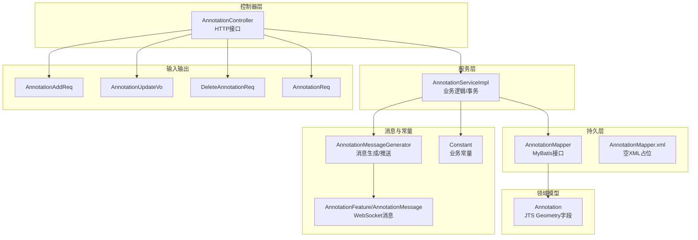
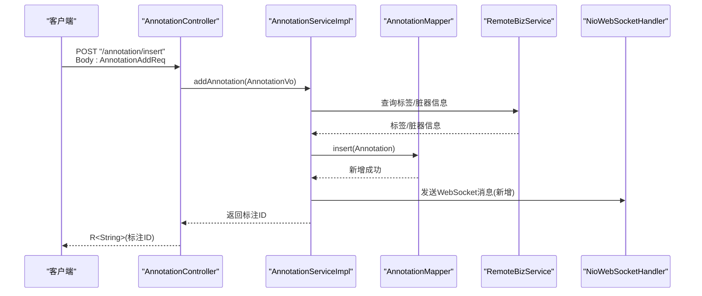
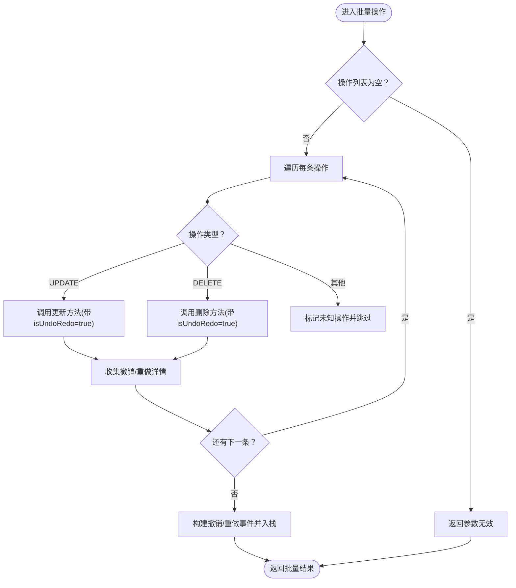
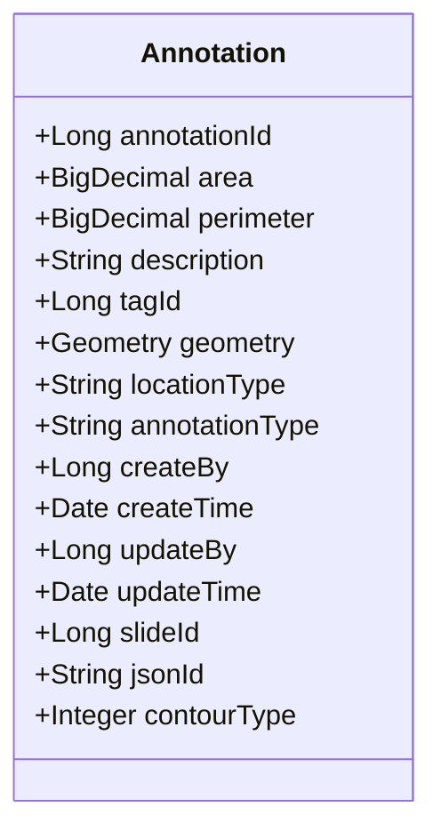
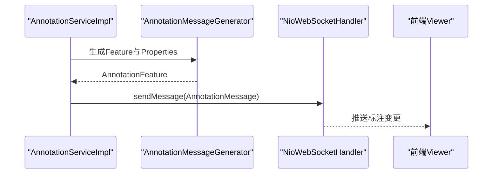
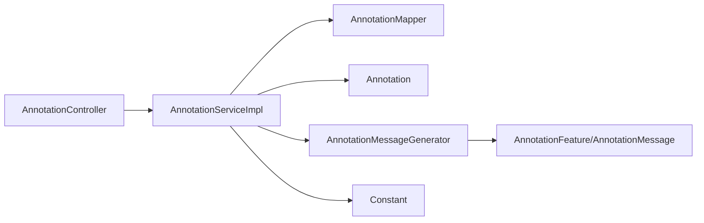

# 标注CRUD操作

<cite>
**本文引用的文件**
- [AnnotationController.java](file://src/main/java/cn/staitech/annotation/controller/AnnotationController.java)
- [AnnotationServiceImpl.java](file://src/main/java/cn/staitech/annotation/service/impl/AnnotationServiceImpl.java)
- [Annotation.java](file://src/main/java/cn/staitech/annotation/domain/Annotation.java)
- [AnnotationMapper.java](file://src/main/java/cn/staitech/annotation/mapper/AnnotationMapper.java)
- [AnnotationMapper.xml](file://src/main/resources/mapper/AnnotationMapper.xml)
- [AnnotationAddReq.java](file://src/main/java/cn/staitech/annotation/vo/anno/AnnotationAddReq.java)
- [AnnotationUpdateVo.java](file://src/main/java/cn/staitech/annotation/vo/anno/AnnotationUpdateVo.java)
- [DeleteAnnotationReq.java](file://src/main/java/cn/staitech/annotation/vo/anno/DeleteAnnotationReq.java)
- [AnnotationReq.java](file://src/main/java/cn/staitech/annotation/vo/anno/AnnotationReq.java)
- [AnnotationMessageGenerator.java](file://src/main/java/cn/staitech/annotation/utils/annotation/AnnotationMessageGenerator.java)
- [AnnotationFeature.java](file://src/main/java/cn/staitech/annotation/netty/message/AnnotationFeature.java)
- [AnnotationMessage.java](file://src/main/java/cn/staitech/annotation/netty/message/AnnotationMessage.java)
- [Constant.java](file://src/main/java/cn/staitech/annotation/constant/Constant.java)
</cite>

## 目录
1. [简介](#简介)
2. [项目结构](#项目结构)
3. [核心组件](#核心组件)
4. [架构总览](#架构总览)
5. [详细组件分析](#详细组件分析)
6. [依赖分析](#依赖分析)
7. [性能考虑](#性能考虑)
8. [故障排查指南](#故障排查指南)
9. [结论](#结论)
10. [附录](#附录)

## 简介
本技术文档围绕标注CRUD操作进行深入解析，覆盖标注实体设计、控制器API接口、服务层业务逻辑、JTS Geometry使用、权限与审计、数据验证与事务策略、错误处理与最佳实践等内容。目标是帮助开发者快速理解并正确使用标注相关接口，完成创建、读取、更新、删除等完整流程。

## 项目结构
标注模块采用分层架构：控制器层负责HTTP接口与参数校验；服务层承载业务逻辑与事务控制；领域模型承载数据库映射与JTS几何字段；VO/DTO用于接口入参与响应；工具类负责消息生成与WebSocket推送；常量集中管理业务常量。

图表来源
- [AnnotationController.java:43-251](file://src/main/java/cn/staitech/annotation/controller/AnnotationController.java#L43-L251)
- [AnnotationServiceImpl.java:46-724](file://src/main/java/cn/staitech/annotation/service/impl/AnnotationServiceImpl.java#L46-L724)
- [AnnotationMapper.java:12-14](file://src/main/java/cn/staitech/annotation/mapper/AnnotationMapper.java#L12-L14)
- [Annotation.java:23-110](file://src/main/java/cn/staitech/annotation/domain/Annotation.java#L23-L110)
- [AnnotationMessageGenerator.java:38-50](file://src/main/java/cn/staitech/annotation/utils/annotation/AnnotationMessageGenerator.java#L38-L50)
- [AnnotationFeature.java:14-32](file://src/main/java/cn/staitech/annotation/netty/message/AnnotationFeature.java#L14-L32)
- [AnnotationMessage.java:14-26](file://src/main/java/cn/staitech/annotation/netty/message/AnnotationMessage.java#L14-L26)
- [Constant.java:9-79](file://src/main/java/cn/staitech/annotation/constant/Constant.java#L9-L79)

章节来源
- [AnnotationController.java:43-251](file://src/main/java/cn/staitech/annotation/controller/AnnotationController.java#L43-L251)
- [AnnotationServiceImpl.java:46-724](file://src/main/java/cn/staitech/annotation/service/impl/AnnotationServiceImpl.java#L46-L724)
- [Annotation.java:23-110](file://src/main/java/cn/staitech/annotation/domain/Annotation.java#L23-L110)

## 核心组件
- 控制器：提供标注的增删改查、批量操作、撤销/重做、几何运算、距离计算、筛差数据查询等接口。
- 服务实现：封装业务规则、调用远程标签服务、生成JSON ID、计算面积/周长、触发WebSocket消息、维护撤销/重做栈。
- 领域模型：标注实体，包含JTS Geometry字段、切片ID、标签ID、类型、创建/更新信息等。
- 输入输出：各类VO/DTO定义请求参数与响应结构。
- 工具与消息：消息生成器负责将标注转换为GeoJSON Feature并注入属性，通过WebSocket广播。
- 常量：统一管理标注类型、操作类型、分辨率换算、撤销/重做栈大小等。

章节来源
- [AnnotationController.java:50-251](file://src/main/java/cn/staitech/annotation/controller/AnnotationController.java#L50-L251)
- [AnnotationServiceImpl.java:184-724](file://src/main/java/cn/staitech/annotation/service/impl/AnnotationServiceImpl.java#L184-L724)
- [Annotation.java:25-110](file://src/main/java/cn/staitech/annotation/domain/Annotation.java#L25-L110)
- [AnnotationMessageGenerator.java:38-202](file://src/main/java/cn/staitech/annotation/utils/annotation/AnnotationMessageGenerator.java#L38-L202)
- [Constant.java:9-79](file://src/main/java/cn/staitech/annotation/constant/Constant.java#L9-L79)

## 架构总览
标注CRUD涉及的关键交互如下：

图表来源
- [AnnotationController.java:50-59](file://src/main/java/cn/staitech/annotation/controller/AnnotationController.java#L50-L59)
- [AnnotationServiceImpl.java:184-238](file://src/main/java/cn/staitech/annotation/service/impl/AnnotationServiceImpl.java#L184-L238)
- [AnnotationMapper.java:12-14](file://src/main/java/cn/staitech/annotation/mapper/AnnotationMapper.java#L12-L14)
- [AnnotationMessageGenerator.java:40-50](file://src/main/java/cn/staitech/annotation/utils/annotation/AnnotationMessageGenerator.java#L40-L50)

## 详细组件分析

### 控制器：AnnotationController
- 接口概览
  - 新增标注：支持普通新增与AI新增，返回新标注ID字符串。
  - 删除标注：支持普通删除与AI删除，支持按切片批量删除。
  - 更新标注：支持普通更新与AI更新，支持填充轮廓、复制/粘贴轮廓。
  - 几何运算：合并/裁剪轮廓，支持合并预览。
  - 查询：按切片与轮廓类型查询GeoJSON Feature列表，查询筛差数据。
  - 批量操作：批量删除/更新，记录审计日志。
  - 撤销/重做：按切片维度维护撤销/重做栈。
  - 辅助查询：检查标签使用状态、用户是否有标注、统计标注数量等。

- 关键接口与参数
  - 新增标注
    - 路径：POST /annotation/insert
    - 请求体：AnnotationAddReq（包含几何、标签ID、切片ID、轮廓类型等）
    - 响应：R<String>（标注ID）
  - AI新增标注
    - 路径：POST /annotation/ai_insert
    - 请求体：AIAnnotationAddReq（与普通新增类似）
    - 响应：R<String>（标注ID）
  - 删除标注
    - 路径：POST /annotation/delete 或 /annotation/ai_delete
    - 请求体：DeleteAnnotationReq 或 AIDeleteAnnotationReq（含标注ID）
    - 响应：R<String>（操作成功提示）
  - 批量删除/更新
    - 路径：POST /annotation/batch
    - 请求体：AnnotationBatchReq（包含操作列表）
    - 响应：R<List<AnnotationBatchRespVo>>
  - 合并/裁剪轮廓
    - 路径：POST /annotation/updateOperation
    - 请求体：AnnotationOperationReq（含几何与操作类型）
    - 响应：R<Geometry>
  - 合并预览
    - 路径：POST /annotation/mergePreview
    - 请求体：AnnotationMergePreviewReq（含标注ID列表）
    - 响应：R<Geometry>
  - 查询GeoJSON
    - 路径：POST /annotation/selectLists
    - 请求体：AnnotationReq（切片ID与可选轮廓类型）
    - 响应：R<List<AnnotationFeature>>

- 权限与审计
  - 多数写操作使用审计注解与安全上下文获取当前用户ID。
  - 日志审计开启，部分接口忽略敏感字段加密输出。

章节来源
- [AnnotationController.java:50-251](file://src/main/java/cn/staitech/annotation/controller/AnnotationController.java#L50-L251)
- [AnnotationAddReq.java:24-117](file://src/main/java/cn/staitech/annotation/vo/anno/AnnotationAddReq.java#L24-L117)
- [AnnotationUpdateVo.java:23-101](file://src/main/java/cn/staitech/annotation/vo/anno/AnnotationUpdateVo.java#L23-L101)
- [DeleteAnnotationReq.java:10-17](file://src/main/java/cn/staitech/annotation/vo/anno/DeleteAnnotationReq.java#L10-L17)
- [AnnotationReq.java:16-24](file://src/main/java/cn/staitech/annotation/vo/anno/AnnotationReq.java#L16-L24)

### 服务实现：AnnotationServiceImpl
- 新增标注
  - 依据轮廓类型查询标签或脏器信息，生成JSON ID与标签日志字段。
  - 设置创建者/更新者为当前用户，插入数据库。
  - 触发撤销/重做事件，必要时同步脏器状态。
  - 通过WebSocket广播新增消息。

- 删除标注
  - 读取历史标注，写入删除归档表，再删除主表记录。
  - 触发撤销/重做事件，必要时同步脏器状态。
  - 通过WebSocket广播删除消息。

- 更新标注
  - 若更新标签，重新查询标签信息并生成JSON ID与标签日志。
  - 计算几何面积与周长（基于分辨率常量）。
  - 触发撤销/重做事件，必要时同步脏器状态。
  - 通过WebSocket广播更新消息。

- 填充轮廓
  - 将多边形外环作为轮廓，计算面积与周长，更新数据库。

- 复制/粘贴轮廓
  - 读取原标注，清空ID后插入，视为新增。

- 合并/裁剪轮廓
  - 支持UNION与DIFFERENCE操作，校验几何相交关系（可选）。
  - 更新几何并计算面积/周长，触发撤销/重做与WebSocket通知。

- 合并预览
  - 对多个标注几何进行相交判断与合并，返回结果几何。

- 批量操作
  - 支持批量更新与批量删除，逐条执行并收集撤销/重做详情。
  - 统一提交撤销/重做事件。

- 撤销/重做
  - 基于用户+切片维度维护事件栈，支持检查状态、清理栈。

- 距离计算
  - 从标注或测量几何中取两组几何，计算最短距离与平均距离，并返回对应点。

- WebSocket消息
  - 通过消息生成器将标注转换为Feature并注入属性，发送至前端。

图表来源
- [AnnotationServiceImpl.java:574-623](file://src/main/java/cn/staitech/annotation/service/impl/AnnotationServiceImpl.java#L574-L623)

章节来源
- [AnnotationServiceImpl.java:184-724](file://src/main/java/cn/staitech/annotation/service/impl/AnnotationServiceImpl.java#L184-L724)
- [AnnotationMessageGenerator.java:38-202](file://src/main/java/cn/staitech/annotation/utils/annotation/AnnotationMessageGenerator.java#L38-L202)
- [Constant.java:30-61](file://src/main/java/cn/staitech/annotation/constant/Constant.java#L30-L61)

### 实体模型：Annotation
- 字段定义
  - 标注ID、面积、周长、描述、标签ID、几何（JTS Geometry）、位置类型、标注类型、创建者/时间、更新者/时间、切片ID、JSON ID、轮廓类型等。
- 约束与校验
  - 几何字段与切片ID为非空校验。
  - equals/hashCode/toString覆盖以支持比较与序列化。
- JTS Geometry使用
  - 用于存储标注几何，支持面积、长度、相交、并集、差集等几何运算。

图表来源
- [Annotation.java:25-110](file://src/main/java/cn/staitech/annotation/domain/Annotation.java#L25-L110)

章节来源
- [Annotation.java:25-187](file://src/main/java/cn/staitech/annotation/domain/Annotation.java#L25-L187)

### 数据访问：AnnotationMapper
- 接口继承MyBatis-Plus的BaseMapper，提供通用CRUD能力。
- XML文件为空，使用注解与自动映射。

章节来源
- [AnnotationMapper.java:12-14](file://src/main/java/cn/staitech/annotation/mapper/AnnotationMapper.java#L12-L14)
- [AnnotationMapper.xml:5-8](file://src/main/resources/mapper/AnnotationMapper.xml#L5-L8)

### 输入输出：VO/DTO
- 新增请求：AnnotationAddReq（含几何、标签ID、切片ID、轮廓类型等）
- 更新请求：AnnotationUpdateVo（含标注ID、几何、标签ID等）
- 删除请求：DeleteAnnotationReq（含标注ID）
- 查询请求：AnnotationReq（含切片ID与轮廓类型）

章节来源
- [AnnotationAddReq.java:24-117](file://src/main/java/cn/staitech/annotation/vo/anno/AnnotationAddReq.java#L24-L117)
- [AnnotationUpdateVo.java:23-101](file://src/main/java/cn/staitech/annotation/vo/anno/AnnotationUpdateVo.java#L23-L101)
- [DeleteAnnotationReq.java:10-17](file://src/main/java/cn/staitech/annotation/vo/anno/DeleteAnnotationReq.java#L10-L17)
- [AnnotationReq.java:16-24](file://src/main/java/cn/staitech/annotation/vo/anno/AnnotationReq.java#L16-L24)

### 消息与WebSocket
- 消息生成：将标注转换为GeoJSON Feature，注入属性（如面积、周长、标签信息、用户信息等），并设置加密标志。
- WebSocket：通过NioWebSocketHandler发送标注变更消息。

图表来源
- [AnnotationMessageGenerator.java:40-50](file://src/main/java/cn/staitech/annotation/utils/annotation/AnnotationMessageGenerator.java#L40-L50)
- [AnnotationFeature.java:14-32](file://src/main/java/cn/staitech/annotation/netty/message/AnnotationFeature.java#L14-L32)
- [AnnotationMessage.java:14-26](file://src/main/java/cn/staitech/annotation/netty/message/AnnotationMessage.java#L14-L26)

章节来源
- [AnnotationMessageGenerator.java:38-202](file://src/main/java/cn/staitech/annotation/utils/annotation/AnnotationMessageGenerator.java#L38-L202)
- [AnnotationFeature.java:14-32](file://src/main/java/cn/staitech/annotation/netty/message/AnnotationFeature.java#L14-L32)
- [AnnotationMessage.java:14-26](file://src/main/java/cn/staitech/annotation/netty/message/AnnotationMessage.java#L14-L26)

## 依赖分析
- 控制器依赖服务实现，服务实现依赖Mapper与远程业务服务。
- 服务实现依赖JTS Geometry进行几何运算，依赖常量进行分辨率换算。
- 消息生成器依赖远程标签与用户服务，生成属性并注入用户与标签信息。
- WebSocket处理器负责向前端推送标注变更。

图表来源
- [AnnotationController.java:45-48](file://src/main/java/cn/staitech/annotation/controller/AnnotationController.java#L45-L48)
- [AnnotationServiceImpl.java:49-60](file://src/main/java/cn/staitech/annotation/service/impl/AnnotationServiceImpl.java#L49-L60)
- [Annotation.java:13-63](file://src/main/java/cn/staitech/annotation/domain/Annotation.java#L13-L63)
- [AnnotationMessageGenerator.java:14-22](file://src/main/java/cn/staitech/annotation/utils/annotation/AnnotationMessageGenerator.java#L14-L22)
- [Constant.java:30-61](file://src/main/java/cn/staitech/annotation/constant/Constant.java#L30-L61)

章节来源
- [AnnotationController.java:45-48](file://src/main/java/cn/staitech/annotation/controller/AnnotationController.java#L45-L48)
- [AnnotationServiceImpl.java:49-60](file://src/main/java/cn/staitech/annotation/service/impl/AnnotationServiceImpl.java#L49-L60)

## 性能考虑
- 几何运算复杂度
  - 合并/裁剪几何、相交判断、面积/周长计算均依赖JTS，复杂度与顶点数相关。
  - 批量操作建议分批处理，避免一次性处理过多几何导致内存与CPU压力。
- 分辨率换算
  - 面积与周长换算使用常量，确保单位一致性。
- 缓存与远程调用
  - 标签与用户信息查询建议结合缓存策略，减少远程调用次数。
- WebSocket推送
  - 大量并发更新时注意消息队列与带宽，避免阻塞。

## 故障排查指南
- 常见错误与定位
  - 未找到标注数据：检查标注ID是否正确，确认几何字段非空。
  - 几何不满足规则：合并/裁剪前需满足相交条件，否则抛出规则异常。
  - 参数无效：检查请求体字段是否符合校验规则（如切片ID、几何非空）。
  - 撤销/重做不可用：检查用户与切片维度是否允许撤销/重做。
- 审计与日志
  - 写操作开启审计注解，可通过日志定位操作人与变更内容。
  - 加密响应用于敏感字段保护，避免明文传输。
- 远程服务异常
  - 标签查询失败会抛出运行时异常，需检查远程服务可用性与网络。

章节来源
- [AnnotationServiceImpl.java:140-181](file://src/main/java/cn/staitech/annotation/service/impl/AnnotationServiceImpl.java#L140-L181)
- [AnnotationServiceImpl.java:267-300](file://src/main/java/cn/staitech/annotation/service/impl/AnnotationServiceImpl.java#L267-L300)
- [AnnotationServiceImpl.java:537-571](file://src/main/java/cn/staitech/annotation/service/impl/AnnotationServiceImpl.java#L537-L571)
- [AnnotationController.java:50-59](file://src/main/java/cn/staitech/annotation/controller/AnnotationController.java#L50-L59)

## 结论
标注CRUD模块通过清晰的分层设计与完善的业务逻辑，实现了从几何数据到可视化展示的全链路能力。JTS Geometry的引入使得几何运算成为可能，配合撤销/重做、批量操作与审计日志，提升了系统的可用性与可追溯性。开发者在扩展或维护时，应重点关注几何有效性、事务一致性、远程服务稳定性与WebSocket推送的实时性。

## 附录

### API定义与示例（路径与要点）
- 新增标注
  - 方法：POST
  - 路径：/annotation/insert
  - 请求体：AnnotationAddReq（几何、标签ID、切片ID、轮廓类型等）
  - 响应：R<String>（标注ID）
- AI新增标注
  - 方法：POST
  - 路径：/annotation/ai_insert
  - 请求体：AIAnnotationAddReq
  - 响应：R<String>（标注ID）
- 删除标注
  - 方法：POST
  - 路径：/annotation/delete 或 /annotation/ai_delete
  - 请求体：DeleteAnnotationReq 或 AIDeleteAnnotationReq（含标注ID）
  - 响应：R<String>（操作成功提示）
- 更新标注
  - 方法：POST
  - 路径：/annotation/update 或 /annotation/ai_update
  - 请求体：AnnotationUpdateVo 或 AIAnnotationUpdateVo
  - 响应：R<String>（操作成功提示）
- 合并/裁剪轮廓
  - 方法：POST
  - 路径：/annotation/updateOperation
  - 请求体：AnnotationOperationReq（含几何与操作类型）
  - 响应：R<Geometry>
- 合并预览
  - 方法：POST
  - 路径：/annotation/mergePreview
  - 请求体：AnnotationMergePreviewReq（含标注ID列表）
  - 响应：R<Geometry>
- 查询GeoJSON
  - 方法：POST
  - 路径：/annotation/selectLists
  - 请求体：AnnotationReq（切片ID与可选轮廓类型）
  - 响应：R<List<AnnotationFeature>>
- 批量操作
  - 方法：POST
  - 路径：/annotation/batch
  - 请求体：AnnotationBatchReq（包含操作列表）
  - 响应：R<List<AnnotationBatchRespVo>>
- 撤销/重做
  - 方法：POST
  - 路径：/annotation/undoAnnotation/{slideId} 与 /annotation/redoAnnotation/{slideId}
  - 请求体：无（使用安全上下文）
  - 响应：R<Boolean>

章节来源
- [AnnotationController.java:50-251](file://src/main/java/cn/staitech/annotation/controller/AnnotationController.java#L50-L251)
- [AnnotationAddReq.java:24-117](file://src/main/java/cn/staitech/annotation/vo/anno/AnnotationAddReq.java#L24-L117)
- [AnnotationUpdateVo.java:23-101](file://src/main/java/cn/staitech/annotation/vo/anno/AnnotationUpdateVo.java#L23-L101)
- [DeleteAnnotationReq.java:10-17](file://src/main/java/cn/staitech/annotation/vo/anno/DeleteAnnotationReq.java#L10-L17)
- [AnnotationReq.java:16-24](file://src/main/java/cn/staitech/annotation/vo/anno/AnnotationReq.java#L16-L24)

### 数据验证与约束
- 几何字段与切片ID为必填。
- 更新请求需提供标注ID。
- 批量操作列表不能为空。

章节来源
- [AnnotationAddReq.java:57-105](file://src/main/java/cn/staitech/annotation/vo/anno/AnnotationAddReq.java#L57-L105)
- [AnnotationUpdateVo.java:28-95](file://src/main/java/cn/staitech/annotation/vo/anno/AnnotationUpdateVo.java#L28-L95)
- [AnnotationReq.java:18-23](file://src/main/java/cn/staitech/annotation/vo/anno/AnnotationReq.java#L18-L23)

### 事务与一致性
- 删除与新增/更新均在事务内执行，保证一致性。
- 撤销/重做通过事件栈回放，确保可恢复。

章节来源
- [AnnotationServiceImpl.java:267-300](file://src/main/java/cn/staitech/annotation/service/impl/AnnotationServiceImpl.java#L267-L300)
- [AnnotationServiceImpl.java:329-440](file://src/main/java/cn/staitech/annotation/service/impl/AnnotationServiceImpl.java#L329-L440)
- [AnnotationServiceImpl.java:677-717](file://src/main/java/cn/staitech/annotation/service/impl/AnnotationServiceImpl.java#L677-L717)

### 权限控制与审计
- 当前用户ID通过安全工具获取，写操作记录创建者/更新者。
- 审计注解开启，日志审计与响应加密可按需启用。

章节来源
- [AnnotationController.java:50-59](file://src/main/java/cn/staitech/annotation/controller/AnnotationController.java#L50-L59)
- [AnnotationServiceImpl.java:219-220](file://src/main/java/cn/staitech/annotation/service/impl/AnnotationServiceImpl.java#L219-L220)