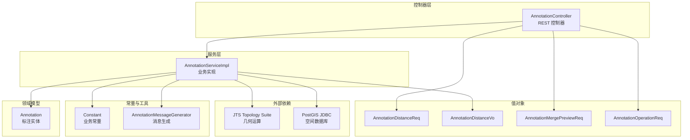
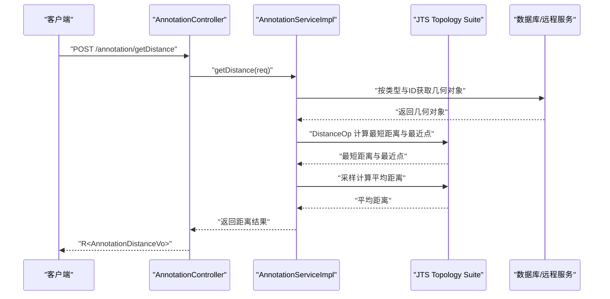
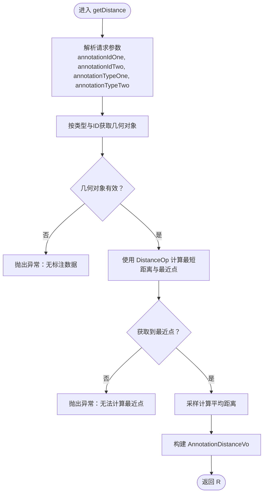
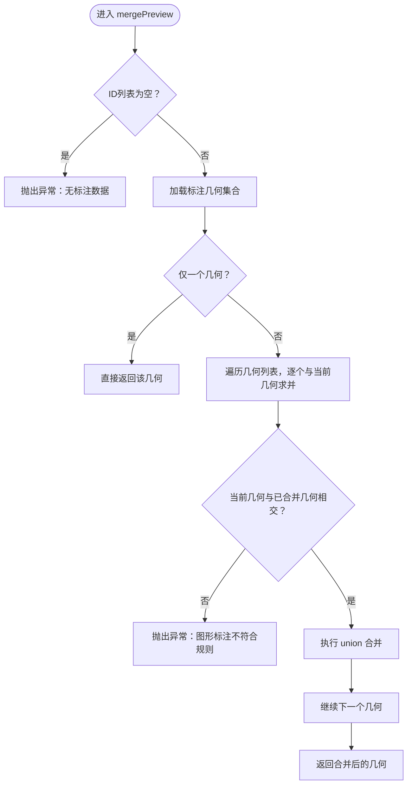
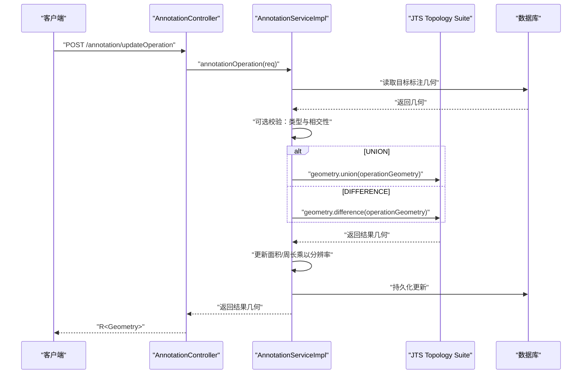
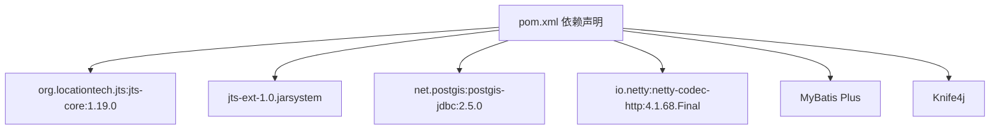

# 标注几何操作

<cite>
**本文引用的文件**
- [AnnotationController.java](file://src/main/java/cn/staitech/annotation/controller/AnnotationController.java)
- [AnnotationServiceImpl.java](file://src/main/java/cn/staitech/annotation/service/impl/AnnotationServiceImpl.java)
- [Annotation.java](file://src/main/java/cn/staitech/annotation/domain/Annotation.java)
- [AnnotationDistanceReq.java](file://src/main/java/cn/staitech/annotation/vo/anno/AnnotationDistanceReq.java)
- [AnnotationDistanceVo.java](file://src/main/java/cn/staitech/annotation/vo/anno/AnnotationDistanceVo.java)
- [AnnotationMergePreviewReq.java](file://src/main/java/cn/staitech/annotation/vo/anno/AnnotationMergePreviewReq.java)
- [AnnotationOperationReq.java](file://src/main/java/cn/staitech/annotation/vo/anno/AnnotationOperationReq.java)
- [Constant.java](file://src/main/java/cn/staitech/annotation/constant/Constant.java)
- [AnnotationMessageGenerator.java](file://src/main/java/cn/staitech/annotation/utils/annotation/AnnotationMessageGenerator.java)
- [pom.xml](file://pom.xml)
- [bootstrap.yml](file://src/main/resources/bootstrap.yml)
</cite>

## 目录
1. [简介](#简介)
2. [项目结构](#项目结构)
3. [核心组件](#核心组件)
4. [架构总览](#架构总览)
5. [详细组件分析](#详细组件分析)
6. [依赖分析](#依赖分析)
7. [性能考量](#性能考量)
8. [故障排查指南](#故障排查指南)
9. [结论](#结论)
10. [附录](#附录)

## 简介
本技术文档聚焦于标注几何操作功能，围绕以下目标展开：
- 深入解释标注轮廓的几何处理能力，包括距离计算、轮廓合并预览、轮廓合并裁剪等操作
- 详解 AnnotationController 中 getDistance、mergePreview、annotationOperation 接口的实现原理
- 解释 JTS Topology Suite 在标注几何处理中的应用，包括几何对象的创建、操作与转换
- 提供几何操作的完整代码示例路径（以源码路径代替具体代码），涵盖距离计算算法、轮廓合并策略与精度控制
- 说明几何操作的性能考虑、内存管理与错误处理机制
- 为开发者提供几何计算的最佳实践与调试技巧

## 项目结构
该模块采用分层架构，主要目录与职责如下：
- controller：对外暴露 REST 接口，负责请求参数校验与响应封装
- service：业务逻辑实现，包含几何运算、撤销重做、消息推送等
- domain：实体模型，承载几何字段与业务属性
- vo：请求/响应值对象，用于接口契约定义
- utils：工具类，如消息生成、撤销重做栈等
- resources：配置文件与静态资源

图表来源
- [AnnotationController.java:43-250](file://src/main/java/cn/staitech/annotation/controller/AnnotationController.java#L43-L250)
- [AnnotationServiceImpl.java:46-724](file://src/main/java/cn/staitech/annotation/service/impl/AnnotationServiceImpl.java#L46-L724)
- [Annotation.java:23-187](file://src/main/java/cn/staitech/annotation/domain/Annotation.java#L23-L187)
- [AnnotationDistanceReq.java:14-34](file://src/main/java/cn/staitech/annotation/vo/anno/AnnotationDistanceReq.java#L14-L34)
- [AnnotationDistanceVo.java:14-31](file://src/main/java/cn/staitech/annotation/vo/anno/AnnotationDistanceVo.java#L14-L31)
- [AnnotationMergePreviewReq.java:15-23](file://src/main/java/cn/staitech/annotation/vo/anno/AnnotationMergePreviewReq.java#L15-L23)
- [AnnotationOperationReq.java:14-37](file://src/main/java/cn/staitech/annotation/vo/anno/AnnotationOperationReq.java#L14-L37)
- [Constant.java:9-80](file://src/main/java/cn/staitech/annotation/constant/Constant.java#L9-L80)
- [AnnotationMessageGenerator.java:37-349](file://src/main/java/cn/staitech/annotation/utils/annotation/AnnotationMessageGenerator.java#L37-L349)

章节来源
- [AnnotationController.java:43-250](file://src/main/java/cn/staitech/annotation/controller/AnnotationController.java#L43-L250)
- [AnnotationServiceImpl.java:46-724](file://src/main/java/cn/staitech/annotation/service/impl/AnnotationServiceImpl.java#L46-L724)
- [Annotation.java:23-187](file://src/main/java/cn/staitech/annotation/domain/Annotation.java#L23-L187)
- [AnnotationDistanceReq.java:14-34](file://src/main/java/cn/staitech/annotation/vo/anno/AnnotationDistanceReq.java#L14-L34)
- [AnnotationDistanceVo.java:14-31](file://src/main/java/cn/staitech/annotation/vo/anno/AnnotationDistanceVo.java#L14-L31)
- [AnnotationMergePreviewReq.java:15-23](file://src/main/java/cn/staitech/annotation/vo/anno/AnnotationMergePreviewReq.java#L15-L23)
- [AnnotationOperationReq.java:14-37](file://src/main/java/cn/staitech/annotation/vo/anno/AnnotationOperationReq.java#L14-L37)
- [Constant.java:9-80](file://src/main/java/cn/staitech/annotation/constant/Constant.java#L9-L80)
- [AnnotationMessageGenerator.java:37-349](file://src/main/java/cn/staitech/annotation/utils/annotation/AnnotationMessageGenerator.java#L37-L349)

## 核心组件
- AnnotationController：提供标注管理的 REST 接口，包括距离计算、合并预览、合并裁剪、批量操作、撤销/重做等
- AnnotationServiceImpl：实现具体的几何运算与业务逻辑，包括距离计算、合并预览、合并裁剪、面积周长换算、撤销重做
- Annotation：标注实体，包含几何字段与业务属性
- 值对象：用于接口契约的数据载体
- 常量：标注类型、操作类型、分辨率等常量定义
- 工具类：消息生成、撤销重做栈管理等

章节来源
- [AnnotationController.java:43-250](file://src/main/java/cn/staitech/annotation/controller/AnnotationController.java#L43-L250)
- [AnnotationServiceImpl.java:46-724](file://src/main/java/cn/staitech/annotation/service/impl/AnnotationServiceImpl.java#L46-L724)
- [Annotation.java:23-187](file://src/main/java/cn/staitech/annotation/domain/Annotation.java#L23-L187)
- [Constant.java:9-80](file://src/main/java/cn/staitech/annotation/constant/Constant.java#L9-L80)

## 架构总览
标注几何操作的端到端流程如下：
- 控制器接收请求，进行参数校验与封装
- 服务层调用 JTS 进行几何运算，必要时从数据库或远程服务获取几何数据
- 服务层维护撤销重做栈，更新标注并推送消息
- 返回统一响应结构

图表来源
- [AnnotationController.java:71-75](file://src/main/java/cn/staitech/annotation/controller/AnnotationController.java#L71-L75)
- [AnnotationServiceImpl.java:140-181](file://src/main/java/cn/staitech/annotation/service/impl/AnnotationServiceImpl.java#L140-L181)
- [AnnotationDistanceReq.java:14-34](file://src/main/java/cn/staitech/annotation/vo/anno/AnnotationDistanceReq.java#L14-L34)
- [AnnotationDistanceVo.java:14-31](file://src/main/java/cn/staitech/annotation/vo/anno/AnnotationDistanceVo.java#L14-L31)

## 详细组件分析

### 距离计算接口：getDistance
- 接口路径：/annotation/getDistance
- 请求体：AnnotationDistanceReq（包含两个标注的ID与类型）
- 实现要点：
  - 根据标注类型与ID获取几何对象（支持 Draw/AI/Measure）
  - 使用 JTS 的 DistanceOp 计算两几何对象的最短距离与最近点
  - 通过采样计算平均距离（可选）
  - 返回包含最短距离、平均距离与最近点的 AnnotationDistanceVo

图表来源
- [AnnotationServiceImpl.java:140-181](file://src/main/java/cn/staitech/annotation/service/impl/AnnotationServiceImpl.java#L140-L181)
- [AnnotationDistanceReq.java:14-34](file://src/main/java/cn/staitech/annotation/vo/anno/AnnotationDistanceReq.java#L14-L34)
- [AnnotationDistanceVo.java:14-31](file://src/main/java/cn/staitech/annotation/vo/anno/AnnotationDistanceVo.java#L14-L31)

章节来源
- [AnnotationController.java:71-75](file://src/main/java/cn/staitech/annotation/controller/AnnotationController.java#L71-L75)
- [AnnotationServiceImpl.java:140-181](file://src/main/java/cn/staitech/annotation/service/impl/AnnotationServiceImpl.java#L140-L181)
- [AnnotationDistanceReq.java:14-34](file://src/main/java/cn/staitech/annotation/vo/anno/AnnotationDistanceReq.java#L14-L34)
- [AnnotationDistanceVo.java:14-31](file://src/main/java/cn/staitech/annotation/vo/anno/AnnotationDistanceVo.java#L14-L31)

### 轮廓合并预览：mergePreview
- 接口路径：/annotation/mergePreview
- 请求体：AnnotationMergePreviewReq（包含标注ID列表）
- 实现要点：
  - 支持单个或多个标注的几何合并预览
  - 若多几何，仅当相邻几何相交时才进行合并
  - 不相交则抛出“图形标注不符合规则”异常
  - 返回合并后的几何对象

图表来源
- [AnnotationServiceImpl.java:504-535](file://src/main/java/cn/staitech/annotation/service/impl/AnnotationServiceImpl.java#L504-L535)
- [AnnotationMergePreviewReq.java:15-23](file://src/main/java/cn/staitech/annotation/vo/anno/AnnotationMergePreviewReq.java#L15-L23)

章节来源
- [AnnotationController.java:133-138](file://src/main/java/cn/staitech/annotation/controller/AnnotationController.java#L133-L138)
- [AnnotationServiceImpl.java:504-535](file://src/main/java/cn/staitech/annotation/service/impl/AnnotationServiceImpl.java#L504-L535)
- [AnnotationMergePreviewReq.java:15-23](file://src/main/java/cn/staitech/annotation/vo/anno/AnnotationMergePreviewReq.java#L15-L23)

### 轮廓合并裁剪：annotationOperation
- 接口路径：/annotation/updateOperation
- 请求体：AnnotationOperationReq（包含目标标注ID、新几何、操作类型、是否校验）
- 实现要点：
  - 支持 UNION（并集）与 DIFFERENCE（差集）两种操作
  - 可选校验：若开启校验且新几何不是多边形或不相交，则抛出“图形标注不符合规则”异常
  - 执行几何运算后，更新标注面积与周长（乘以分辨率系数），持久化并推送消息
  - 维护撤销重做事件

图表来源
- [AnnotationController.java:171-175](file://src/main/java/cn/staitech/annotation/controller/AnnotationController.java#L171-L175)
- [AnnotationServiceImpl.java:537-571](file://src/main/java/cn/staitech/annotation/service/impl/AnnotationServiceImpl.java#L537-L571)
- [AnnotationOperationReq.java:14-37](file://src/main/java/cn/staitech/annotation/vo/anno/AnnotationOperationReq.java#L14-L37)

章节来源
- [AnnotationController.java:171-175](file://src/main/java/cn/staitech/annotation/controller/AnnotationController.java#L171-L175)
- [AnnotationServiceImpl.java:537-571](file://src/main/java/cn/staitech/annotation/service/impl/AnnotationServiceImpl.java#L537-L571)
- [AnnotationOperationReq.java:14-37](file://src/main/java/cn/staitech/annotation/vo/anno/AnnotationOperationReq.java#L14-L37)

### 几何对象与JTS应用
- 几何字段：Annotation 实体的 geometry 字段类型为 org.locationtech.jts.geom.Geometry
- 常用操作：
  - 距离计算：使用 DistanceOp 计算最短距离与最近点
  - 并集/差集：union/difference
  - 相交检测：intersects
  - 面积/长度：getArea/getLength（结合分辨率换算）
- 采样策略：sampleGeometry 通过线性插值在几何边界上均匀采样，用于平均距离计算

章节来源
- [Annotation.java:13-63](file://src/main/java/cn/staitech/annotation/domain/Annotation.java#L13-L63)
- [AnnotationServiceImpl.java:68-113](file://src/main/java/cn/staitech/annotation/service/impl/AnnotationServiceImpl.java#L68-L113)
- [AnnotationServiceImpl.java:157-168](file://src/main/java/cn/staitech/annotation/service/impl/AnnotationServiceImpl.java#L157-L168)

### 数据模型与序列化
- Annotation 实体包含 geometry 字段，用于存储 JTS 几何对象
- AnnotationMessageGenerator 将标注实体转换为 GeoJSON Feature，便于前端展示与交互

章节来源
- [Annotation.java:23-187](file://src/main/java/cn/staitech/annotation/domain/Annotation.java#L23-L187)
- [AnnotationMessageGenerator.java:52-88](file://src/main/java/cn/staitech/annotation/utils/annotation/AnnotationMessageGenerator.java#L52-L88)

## 依赖分析
- JTS Topology Suite：核心几何运算库，提供 DistanceOp、union、difference、intersects 等能力
- PostGIS JDBC：用于与 PostgreSQL/PostGIS 空间数据库交互
- Netty：用于 WebSocket 消息推送
- MyBatis Plus：数据访问层框架
- Swagger/Knife4j：接口文档与调试

图表来源
- [pom.xml:94-110](file://pom.xml#L94-L110)

章节来源
- [pom.xml:94-110](file://pom.xml#L94-L110)

## 性能考量
- 几何采样与距离计算
  - 采样点数量与复杂度成正比，建议在高复杂度几何场景下限制采样点数或采用更高效的采样策略
  - 多点对多点距离计算的时间复杂度为 O(n*m)，应避免在大规模几何集合上进行全量对比
- 相交与合并
  - 合并前先进行相交检测，避免无效合并导致的性能浪费
  - 对于大量几何的合并，建议分批处理或在数据库层面进行空间索引优化
- 分辨率换算
  - 面积与周长换算使用常量 IMAGE_RESOLUTION 与 IMAGE_RESOLUTION_SQUARE，确保单位一致性
- 内存管理
  - 大几何对象在序列化与网络传输时注意内存占用，必要时进行几何简化
- 错误处理
  - 对空几何、无法计算最近点、不符合规则等异常进行明确捕获与提示

[本节为通用指导，不直接分析具体文件]

## 故障排查指南
- 常见异常与定位
  - “无标注数据”：检查请求参数中的标注ID与类型是否正确，确认数据库中存在对应记录
  - “无法计算最近点”：确认几何对象有效且非空，必要时对几何进行有效性检查
  - “图形标注不符合规则”：检查几何相交性与操作类型，确保仅对相交几何执行合并/裁剪
- 日志与审计
  - 控制器层使用日志审计注解，便于追踪操作行为
  - 服务层对关键步骤进行日志输出，便于问题定位
- 撤销/重做
  - 通过撤销/重做接口回滚误操作，确保数据一致性

章节来源
- [AnnotationServiceImpl.java:153-165](file://src/main/java/cn/staitech/annotation/service/impl/AnnotationServiceImpl.java#L153-L165)
- [AnnotationServiceImpl.java:530-532](file://src/main/java/cn/staitech/annotation/service/impl/AnnotationServiceImpl.java#L530-L532)
- [AnnotationController.java:226-248](file://src/main/java/cn/staitech/annotation/controller/AnnotationController.java#L226-L248)

## 结论
本模块通过清晰的分层设计与 JTS 几何库的深度集成，提供了完整的标注几何处理能力。getDistance、mergePreview、annotationOperation 等接口覆盖了距离计算、合并预览与合并裁剪的核心需求。配合常量定义、消息生成与撤销重做机制，系统在保证功能完整性的同时兼顾了可维护性与可扩展性。建议在实际部署中关注几何复杂度与采样策略，结合数据库空间索引与网络传输优化，持续提升性能与稳定性。

[本节为总结性内容，不直接分析具体文件]

## 附录
- 接口与实现映射参考
  - getDistance：[AnnotationController.java:71-75](file://src/main/java/cn/staitech/annotation/controller/AnnotationController.java#L71-L75) → [AnnotationServiceImpl.java:140-181](file://src/main/java/cn/staitech/annotation/service/impl/AnnotationServiceImpl.java#L140-L181)
  - mergePreview：[AnnotationController.java:133-138](file://src/main/java/cn/staitech/annotation/controller/AnnotationController.java#L133-L138) → [AnnotationServiceImpl.java:504-535](file://src/main/java/cn/staitech/annotation/service/impl/AnnotationServiceImpl.java#L504-L535)
  - annotationOperation：[AnnotationController.java:171-175](file://src/main/java/cn/staitech/annotation/controller/AnnotationController.java#L171-L175) → [AnnotationServiceImpl.java:537-571](file://src/main/java/cn/staitech/annotation/service/impl/AnnotationServiceImpl.java#L537-L571)
- 配置参考
  - 应用端口与国际化：[bootstrap.yml:1-42](file://src/main/resources/bootstrap.yml#L1-L42)
  - JTS 依赖与 PostGIS：[pom.xml:94-110](file://pom.xml#L94-L110)