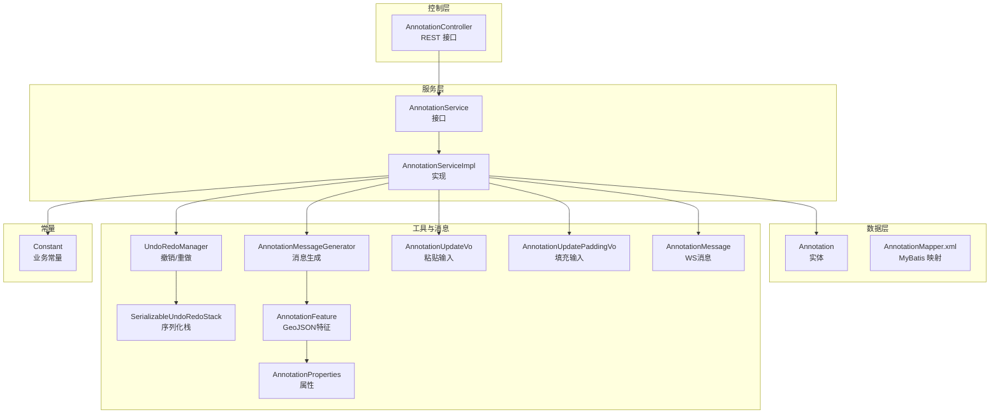
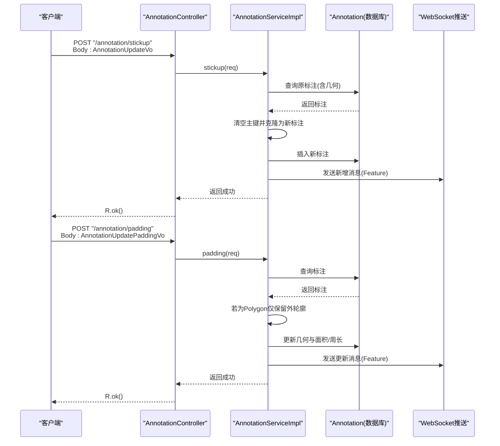
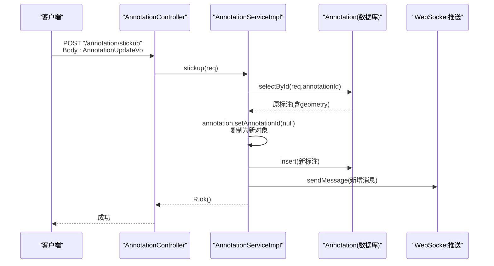
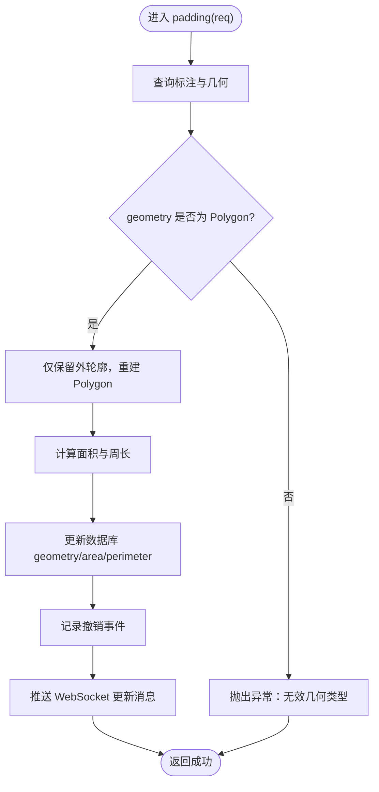
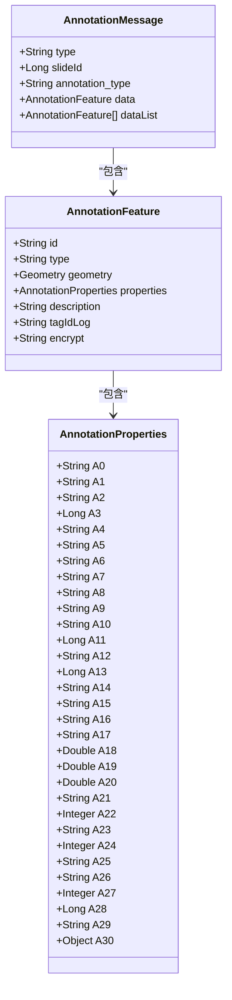
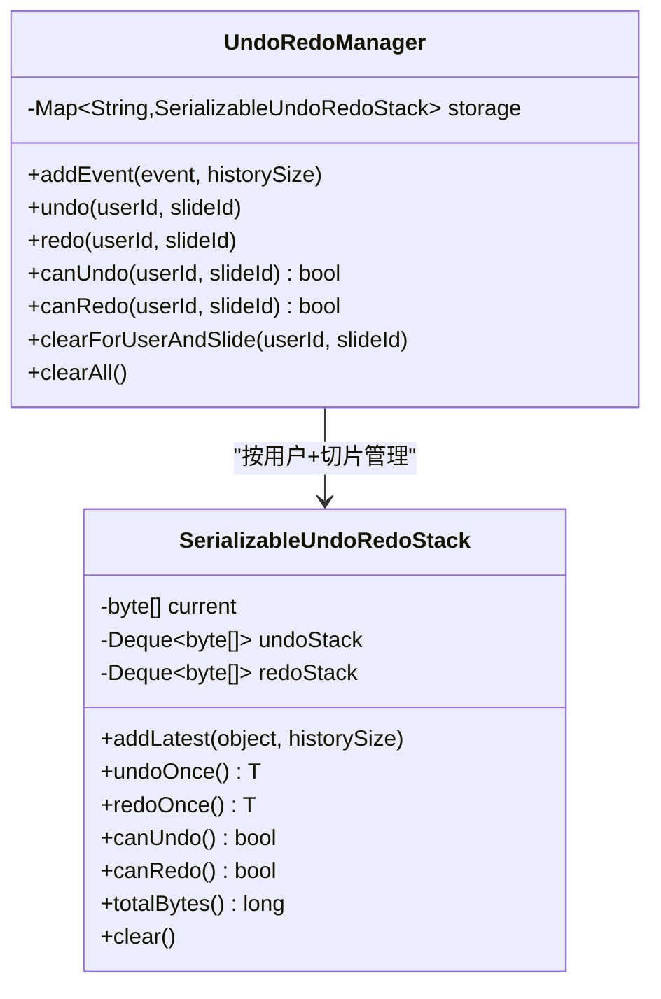
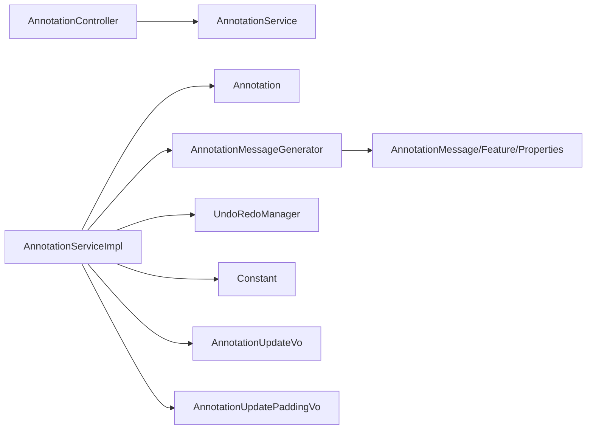

# 标注剪贴板操作

<cite>
**本文引用的文件**
- [AnnotationController.java](file://src/main/java/cn/staitech/annotation/controller/AnnotationController.java)
- [AnnotationService.java](file://src/main/java/cn/staitech/annotation/service/AnnotationService.java)
- [AnnotationServiceImpl.java](file://src/main/java/cn/staitech/annotation/service/impl/AnnotationServiceImpl.java)
- [Annotation.java](file://src/main/java/cn/staitech/annotation/domain/Annotation.java)
- [AnnotationUpdateVo.java](file://src/main/java/cn/staitech/annotation/vo/anno/AnnotationUpdateVo.java)
- [AnnotationUpdatePaddingVo.java](file://src/main/java/cn/staitech/annotation/vo/anno/AnnotationUpdatePaddingVo.java)
- [AnnotationMessageGenerator.java](file://src/main/java/cn/staitech/annotation/utils/annotation/AnnotationMessageGenerator.java)
- [UndoRedoManager.java](file://src/main/java/cn/staitech/annotation/utils/annotation/UndoRedoManager.java)
- [SerializableUndoRedoStack.java](file://src/main/java/cn/staitech/annotation/utils/annotation/SerializableUndoRedoStack.java)
- [Constant.java](file://src/main/java/cn/staitech/annotation/constant/Constant.java)
- [AnnotationMessage.java](file://src/main/java/cn/staitech/annotation/netty/message/AnnotationMessage.java)
- [AnnotationFeature.java](file://src/main/java/cn/staitech/annotation/netty/message/AnnotationFeature.java)
- [AnnotationProperties.java](file://src/main/java/cn/staitech/annotation/netty/message/AnnotationProperties.java)
- [AnnotationMapper.xml](file://src/main/resources/mapper/AnnotationMapper.xml)
</cite>

## 目录
1. [简介](#简介)
2. [项目结构](#项目结构)
3. [核心组件](#核心组件)
4. [架构总览](#架构总览)
5. [详细组件分析](#详细组件分析)
6. [依赖分析](#依赖分析)
7. [性能考虑](#性能考虑)
8. [故障排查指南](#故障排查指南)
9. [结论](#结论)
10. [附录](#附录)

## 简介
本技术文档聚焦于标注系统的“剪贴板”能力，包括：
- 复制/粘贴轮廓（stickup）：基于现有标注进行克隆与粘贴，保持几何与属性一致。
- 轮廓填充（padding）：针对面状几何（Polygon）仅保留外轮廓，丢弃内部洞环，确保几何有效性与一致性。

文档将从架构、数据流、处理逻辑、错误处理、性能优化与并发控制等方面进行深入剖析，并提供完整的使用示例与最佳实践建议。

## 项目结构
标注模块采用典型的分层架构：
- 控制层：接收HTTP请求，校验参数，调用服务层。
- 服务层：封装业务逻辑，协调数据访问与消息推送。
- 数据模型：持久化实体与几何字段。
- VO/消息：输入输出参数与WebSocket消息载体。
- 工具与常量：几何运算、撤销/重做、常量定义。

图表来源
- [AnnotationController.java:118-131](file://src/main/java/cn/staitech/annotation/controller/AnnotationController.java#L118-L131)
- [AnnotationService.java:27-27](file://src/main/java/cn/staitech/annotation/service/AnnotationService.java#L27-L27)
- [AnnotationServiceImpl.java:472-501](file://src/main/java/cn/staitech/annotation/service/impl/AnnotationServiceImpl.java#L472-L501)
- [Annotation.java:62-63](file://src/main/java/cn/staitech/annotation/domain/Annotation.java#L62-L63)
- [AnnotationUpdateVo.java:23-101](file://src/main/java/cn/staitech/annotation/vo/anno/AnnotationUpdateVo.java#L23-L101)
- [AnnotationUpdatePaddingVo.java:15-92](file://src/main/java/cn/staitech/annotation/vo/anno/AnnotationUpdatePaddingVo.java#L15-L92)
- [AnnotationMessageGenerator.java:40-50](file://src/main/java/cn/staitech/annotation/utils/annotation/AnnotationMessageGenerator.java#L40-L50)
- [UndoRedoManager.java:19-94](file://src/main/java/cn/staitech/annotation/utils/annotation/UndoRedoManager.java#L19-L94)
- [SerializableUndoRedoStack.java:18-245](file://src/main/java/cn/staitech/annotation/utils/annotation/SerializableUndoRedoStack.java#L18-L245)
- [AnnotationMessage.java:14-27](file://src/main/java/cn/staitech/annotation/netty/message/AnnotationMessage.java#L14-L27)
- [AnnotationFeature.java:14-32](file://src/main/java/cn/staitech/annotation/netty/message/AnnotationFeature.java#L14-L32)
- [AnnotationProperties.java:12-74](file://src/main/java/cn/staitech/annotation/netty/message/AnnotationProperties.java#L12-L74)
- [AnnotationMapper.xml:5-8](file://src/main/resources/mapper/AnnotationMapper.xml#L5-L8)
- [Constant.java:9-79](file://src/main/java/cn/staitech/annotation/constant/Constant.java#L9-L79)

章节来源
- [AnnotationController.java:118-131](file://src/main/java/cn/staitech/annotation/controller/AnnotationController.java#L118-L131)
- [AnnotationService.java:17-43](file://src/main/java/cn/staitech/annotation/service/AnnotationService.java#L17-L43)
- [AnnotationServiceImpl.java:472-501](file://src/main/java/cn/staitech/annotation/service/impl/AnnotationServiceImpl.java#L472-L501)
- [Annotation.java:23-113](file://src/main/java/cn/staitech/annotation/domain/Annotation.java#L23-L113)
- [AnnotationUpdateVo.java:23-101](file://src/main/java/cn/staitech/annotation/vo/anno/AnnotationUpdateVo.java#L23-L101)
- [AnnotationUpdatePaddingVo.java:15-92](file://src/main/java/cn/staitech/annotation/vo/anno/AnnotationUpdatePaddingVo.java#L15-L92)
- [AnnotationMessageGenerator.java:40-50](file://src/main/java/cn/staitech/annotation/utils/annotation/AnnotationMessageGenerator.java#L40-L50)
- [UndoRedoManager.java:19-94](file://src/main/java/cn/staitech/annotation/utils/annotation/UndoRedoManager.java#L19-L94)
- [SerializableUndoRedoStack.java:18-245](file://src/main/java/cn/staitech/annotation/utils/annotation/SerializableUndoRedoStack.java#L18-L245)
- [AnnotationMessage.java:14-27](file://src/main/java/cn/staitech/annotation/netty/message/AnnotationMessage.java#L14-L27)
- [AnnotationFeature.java:14-32](file://src/main/java/cn/staitech/annotation/netty/message/AnnotationFeature.java#L14-L32)
- [AnnotationProperties.java:12-74](file://src/main/java/cn/staitech/annotation/netty/message/AnnotationProperties.java#L12-L74)
- [AnnotationMapper.xml:5-8](file://src/main/resources/mapper/AnnotationMapper.xml#L5-L8)
- [Constant.java:9-79](file://src/main/java/cn/staitech/annotation/constant/Constant.java#L9-L79)

## 核心组件
- 控制器：提供 /annotation/stickup 与 /annotation/padding 接口，分别处理复制粘贴与轮廓填充。
- 服务实现：负责读取标注、克隆标注、更新几何、计算面积/周长、推送消息与维护撤销/重做。
- 数据模型：标注实体包含几何字段（JTS Geometry），用于承载矢量轮廓。
- 输入VO：粘贴输入与填充输入分别携带标注ID、几何与元信息。
- 消息生成器：将标注转换为GeoJSON Feature与WebSocket消息，支持属性映射与加密标记。
- 撤销/重做：基于序列化的事件栈，按用户+切片维度管理历史状态。

章节来源
- [AnnotationController.java:118-131](file://src/main/java/cn/staitech/annotation/controller/AnnotationController.java#L118-L131)
- [AnnotationServiceImpl.java:442-501](file://src/main/java/cn/staitech/annotation/service/impl/AnnotationServiceImpl.java#L442-L501)
- [Annotation.java:62-63](file://src/main/java/cn/staitech/annotation/domain/Annotation.java#L62-L63)
- [AnnotationUpdateVo.java:23-101](file://src/main/java/cn/staitech/annotation/vo/anno/AnnotationUpdateVo.java#L23-L101)
- [AnnotationUpdatePaddingVo.java:15-92](file://src/main/java/cn/staitech/annotation/vo/anno/AnnotationUpdatePaddingVo.java#L15-L92)
- [AnnotationMessageGenerator.java:40-50](file://src/main/java/cn/staitech/annotation/utils/annotation/AnnotationMessageGenerator.java#L40-L50)
- [UndoRedoManager.java:19-94](file://src/main/java/cn/staitech/annotation/utils/annotation/UndoRedoManager.java#L19-L94)
- [SerializableUndoRedoStack.java:18-245](file://src/main/java/cn/staitech/annotation/utils/annotation/SerializableUndoRedoStack.java#L18-L245)

## 架构总览
标注剪贴板操作的端到端流程如下：

图表来源
- [AnnotationController.java:118-131](file://src/main/java/cn/staitech/annotation/controller/AnnotationController.java#L118-L131)
- [AnnotationServiceImpl.java:472-501](file://src/main/java/cn/staitech/annotation/service/impl/AnnotationServiceImpl.java#L472-L501)
- [AnnotationServiceImpl.java:442-469](file://src/main/java/cn/staitech/annotation/service/impl/AnnotationServiceImpl.java#L442-L469)
- [AnnotationMessageGenerator.java:40-50](file://src/main/java/cn/staitech/annotation/utils/annotation/AnnotationMessageGenerator.java#L40-L50)

## 详细组件分析

### 组件A：复制/粘贴轮廓（stickup）
- 功能目标：以现有标注为模板，克隆并插入一条新的标注，保留几何与属性，同时更新面积/周长与撤销/重做状态。
- 关键逻辑
  - 读取原标注并校验存在性与几何有效性。
  - 清空主键，复制为新对象，插入数据库。
  - 记录撤销事件（新增），推送WebSocket消息。
- 几何与坐标系
  - 使用JTS几何工厂创建几何副本，保持原始坐标与拓扑不变。
- 数据一致性
  - 通过事务性插入与撤销栈记录，确保状态可回溯。
- 并发与性能
  - 插入操作为单条记录写入，开销低；撤销栈按用户+切片隔离，避免串扰。

图表来源
- [AnnotationController.java:118-131](file://src/main/java/cn/staitech/annotation/controller/AnnotationController.java#L118-L131)
- [AnnotationServiceImpl.java:472-501](file://src/main/java/cn/staitech/annotation/service/impl/AnnotationServiceImpl.java#L472-L501)
- [AnnotationMessageGenerator.java:40-50](file://src/main/java/cn/staitech/annotation/utils/annotation/AnnotationMessageGenerator.java#L40-L50)

章节来源
- [AnnotationController.java:118-131](file://src/main/java/cn/staitech/annotation/controller/AnnotationController.java#L118-L131)
- [AnnotationServiceImpl.java:472-501](file://src/main/java/cn/staitech/annotation/service/impl/AnnotationServiceImpl.java#L472-L501)
- [Annotation.java:62-63](file://src/main/java/cn/staitech/annotation/domain/Annotation.java#L62-L63)
- [AnnotationUpdateVo.java:23-101](file://src/main/java/cn/staitech/annotation/vo/anno/AnnotationUpdateVo.java#L23-L101)
- [AnnotationMessageGenerator.java:40-50](file://src/main/java/cn/staitech/annotation/utils/annotation/AnnotationMessageGenerator.java#L40-L50)
- [UndoRedoManager.java:42-61](file://src/main/java/cn/staitech/annotation/utils/annotation/UndoRedoManager.java#L42-L61)
- [SerializableUndoRedoStack.java:144-173](file://src/main/java/cn/staitech/annotation/utils/annotation/SerializableUndoRedoStack.java#L144-L173)

### 组件B：轮廓填充（padding）
- 功能目标：将面状几何（Polygon）仅保留外轮廓，移除内部洞环，确保几何有效且符合业务规则。
- 关键逻辑
  - 读取标注并校验存在性与几何类型。
  - 若为Polygon，构造仅含外环的新几何对象，覆盖原几何。
  - 重新计算面积与周长，更新数据库并推送消息。
- 几何修复与坐标系
  - 通过几何工厂重建Polygon，确保拓扑正确性。
- 数据一致性
  - 更新前保存历史版本，记录撤销事件，支持回滚。

图表来源
- [AnnotationServiceImpl.java:442-469](file://src/main/java/cn/staitech/annotation/service/impl/AnnotationServiceImpl.java#L442-L469)
- [AnnotationMessageGenerator.java:40-50](file://src/main/java/cn/staitech/annotation/utils/annotation/AnnotationMessageGenerator.java#L40-L50)

章节来源
- [AnnotationServiceImpl.java:442-469](file://src/main/java/cn/staitech/annotation/service/impl/AnnotationServiceImpl.java#L442-L469)
- [AnnotationUpdatePaddingVo.java:15-92](file://src/main/java/cn/staitech/annotation/vo/anno/AnnotationUpdatePaddingVo.java#L15-L92)
- [Annotation.java:62-63](file://src/main/java/cn/staitech/annotation/domain/Annotation.java#L62-L63)
- [Constant.java:30-31](file://src/main/java/cn/staitech/annotation/constant/Constant.java#L30-L31)

### 组件C：消息生成与推送
- 将标注转换为GeoJSON Feature，设置属性与描述，通过WebSocket广播给前端。
- 支持脏器/结构标签映射与用户信息注入。

图表来源
- [AnnotationMessage.java:14-27](file://src/main/java/cn/staitech/annotation/netty/message/AnnotationMessage.java#L14-L27)
- [AnnotationFeature.java:14-32](file://src/main/java/cn/staitech/annotation/netty/message/AnnotationFeature.java#L14-L32)
- [AnnotationProperties.java:12-74](file://src/main/java/cn/staitech/annotation/netty/message/AnnotationProperties.java#L12-L74)

章节来源
- [AnnotationMessageGenerator.java:40-50](file://src/main/java/cn/staitech/annotation/utils/annotation/AnnotationMessageGenerator.java#L40-L50)
- [AnnotationMessage.java:14-27](file://src/main/java/cn/staitech/annotation/netty/message/AnnotationMessage.java#L14-L27)
- [AnnotationFeature.java:14-32](file://src/main/java/cn/staitech/annotation/netty/message/AnnotationFeature.java#L14-L32)
- [AnnotationProperties.java:12-74](file://src/main/java/cn/staitech/annotation/netty/message/AnnotationProperties.java#L12-L74)

### 组件D：撤销/重做（Undo/Redo）
- 按用户ID与切片ID隔离管理，支持最大历史深度。
- 事件栈采用序列化存储，内存占用动态评估，必要时清理旧状态。
- 提供撤销、重做、状态查询与定时清理。

图表来源
- [UndoRedoManager.java:19-94](file://src/main/java/cn/staitech/annotation/utils/annotation/UndoRedoManager.java#L19-L94)
- [SerializableUndoRedoStack.java:18-245](file://src/main/java/cn/staitech/annotation/utils/annotation/SerializableUndoRedoStack.java#L18-L245)

章节来源
- [UndoRedoManager.java:42-61](file://src/main/java/cn/staitech/annotation/utils/annotation/UndoRedoManager.java#L42-L61)
- [SerializableUndoRedoStack.java:144-173](file://src/main/java/cn/staitech/annotation/utils/annotation/SerializableUndoRedoStack.java#L144-L173)
- [Constant.java:61-61](file://src/main/java/cn/staitech/annotation/constant/Constant.java#L61-L61)

## 依赖分析
- 控制器依赖服务接口，服务实现依赖实体、消息生成器与撤销管理器。
- 输入VO作为粘贴与填充的参数载体，承载标注ID、几何与元信息。
- 常量集中管理标注类型、操作类型与分辨率换算因子。

图表来源
- [AnnotationController.java:45-48](file://src/main/java/cn/staitech/annotation/controller/AnnotationController.java#L45-L48)
- [AnnotationService.java:17-43](file://src/main/java/cn/staitech/annotation/service/AnnotationService.java#L17-L43)
- [AnnotationServiceImpl.java:46-60](file://src/main/java/cn/staitech/annotation/service/impl/AnnotationServiceImpl.java#L46-L60)
- [Annotation.java:23-113](file://src/main/java/cn/staitech/annotation/domain/Annotation.java#L23-L113)
- [AnnotationMessageGenerator.java:38-38](file://src/main/java/cn/staitech/annotation/utils/annotation/AnnotationMessageGenerator.java#L38-L38)
- [UndoRedoManager.java:19-22](file://src/main/java/cn/staitech/annotation/utils/annotation/UndoRedoManager.java#L19-L22)
- [Constant.java:9-79](file://src/main/java/cn/staitech/annotation/constant/Constant.java#L9-L79)
- [AnnotationUpdateVo.java:23-101](file://src/main/java/cn/staitech/annotation/vo/anno/AnnotationUpdateVo.java#L23-L101)
- [AnnotationUpdatePaddingVo.java:15-92](file://src/main/java/cn/staitech/annotation/vo/anno/AnnotationUpdatePaddingVo.java#L15-L92)

章节来源
- [AnnotationController.java:45-48](file://src/main/java/cn/staitech/annotation/controller/AnnotationController.java#L45-L48)
- [AnnotationServiceImpl.java:46-60](file://src/main/java/cn/staitech/annotation/service/impl/AnnotationServiceImpl.java#L46-L60)
- [AnnotationMessageGenerator.java:38-38](file://src/main/java/cn/staitech/annotation/utils/annotation/AnnotationMessageGenerator.java#L38-L38)
- [UndoRedoManager.java:19-22](file://src/main/java/cn/staitech/annotation/utils/annotation/UndoRedoManager.java#L19-L22)
- [Constant.java:9-79](file://src/main/java/cn/staitech/annotation/constant/Constant.java#L9-L79)

## 性能考虑
- 几何计算
  - 面积与周长通过几何对象直接计算，避免额外投影或单位换算开销。
  - 分辨率常量统一换算，减少重复计算。
- 内存与序列化
  - 撤销栈采用序列化存储，提供内存估算与阈值清理，防止OOM。
  - 历史深度受常量限制，平衡内存占用与可用性。
- 并发控制
  - 按用户+切片维度隔离撤销栈，避免跨会话干扰。
  - WebSocket推送为异步广播，不影响主业务流程。
- I/O与事务
  - 粘贴与填充均为单条记录读写，事务范围小，性能稳定。

章节来源
- [AnnotationServiceImpl.java:374-381](file://src/main/java/cn/staitech/annotation/service/impl/AnnotationServiceImpl.java#L374-L381)
- [SerializableUndoRedoStack.java:152-173](file://src/main/java/cn/staitech/annotation/utils/annotation/SerializableUndoRedoStack.java#L152-L173)
- [Constant.java:30-31](file://src/main/java/cn/staitech/annotation/constant/Constant.java#L30-L31)
- [UndoRedoManager.java:34-37](file://src/main/java/cn/staitech/annotation/utils/annotation/UndoRedoManager.java#L34-L37)

## 故障排查指南
- 无标注数据
  - 现象：查询不到标注或几何为空。
  - 处理：检查标注ID与类型，确认几何字段非空。
- 几何类型不符
  - 现象：填充接口对非Polygon几何报错。
  - 处理：确保传入几何为Polygon类型。
- 操作规则不满足
  - 现象：合并/裁剪等操作因几何不相交而失败。
  - 处理：检查几何相交关系或调整输入。
- 撤销/重做不可用
  - 现象：提示无法撤销或重做。
  - 处理：检查用户+切片维度的历史栈状态，确认未被定时清理。

章节来源
- [AnnotationServiceImpl.java:447-449](file://src/main/java/cn/staitech/annotation/service/impl/AnnotationServiceImpl.java#L447-L449)
- [AnnotationServiceImpl.java:547-551](file://src/main/java/cn/staitech/annotation/service/impl/AnnotationServiceImpl.java#L547-L551)
- [UndoRedoManager.java:66-77](file://src/main/java/cn/staitech/annotation/utils/annotation/UndoRedoManager.java#L66-L77)
- [SerializableUndoRedoStack.java:87-106](file://src/main/java/cn/staitech/annotation/utils/annotation/SerializableUndoRedoStack.java#L87-L106)

## 结论
标注剪贴板操作通过清晰的分层设计与稳健的几何处理，实现了高效的复制粘贴与轮廓填充能力。结合撤销/重做与消息推送，确保了操作的可追溯性与实时反馈。在性能方面，采用轻量事务、序列化栈与内存阈值控制，兼顾了稳定性与资源占用。

## 附录

### 使用示例与参数配置
- 复制/粘贴轮廓（stickup）
  - 请求路径：POST /annotation/stickup
  - 参数要点：Body需包含目标标注ID（marking_id），服务将克隆该标注并插入新记录。
  - 结果验证：返回成功；前端可通过WebSocket接收新增Feature消息。
- 轮廓填充（padding）
  - 请求路径：POST /annotation/padding
  - 参数要点：Body需包含目标标注ID（marking_id），服务将仅保留外轮廓并更新几何。
  - 结果验证：返回成功；前端可通过WebSocket接收更新Feature消息。

章节来源
- [AnnotationController.java:118-131](file://src/main/java/cn/staitech/annotation/controller/AnnotationController.java#L118-L131)
- [AnnotationUpdateVo.java:23-101](file://src/main/java/cn/staitech/annotation/vo/anno/AnnotationUpdateVo.java#L23-L101)
- [AnnotationUpdatePaddingVo.java:15-92](file://src/main/java/cn/staitech/annotation/vo/anno/AnnotationUpdatePaddingVo.java#L15-L92)
- [AnnotationMessageGenerator.java:40-50](file://src/main/java/cn/staitech/annotation/utils/annotation/AnnotationMessageGenerator.java#L40-L50)

### 开发者技巧与高级应用
- 几何一致性保障
  - 在粘贴前可先对几何进行有效性检查与修复，确保后续操作稳定。
- 批量操作与撤销
  - 批量更新/删除时，利用撤销栈聚合事件，减少历史碎片。
- 前后端协同
  - 前端监听WebSocket消息，自动刷新标注列表与选中状态，提升交互体验。
- 性能优化建议
  - 大量粘贴场景下，建议分批处理并设置合理的撤销历史深度。
  - 对高频几何计算，可缓存分辨率换算结果，避免重复计算。