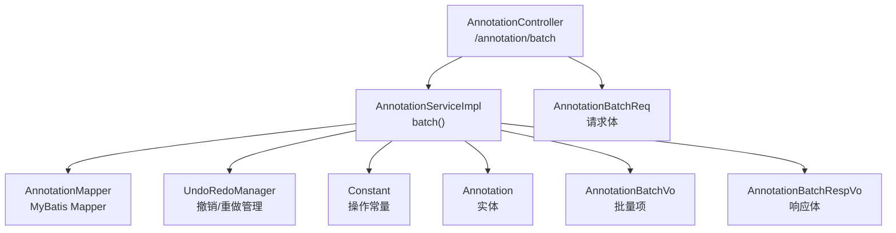
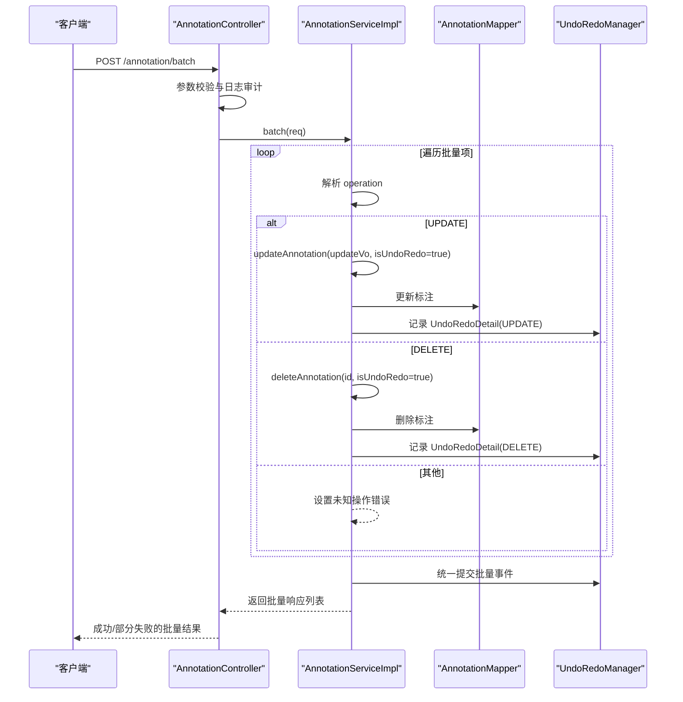
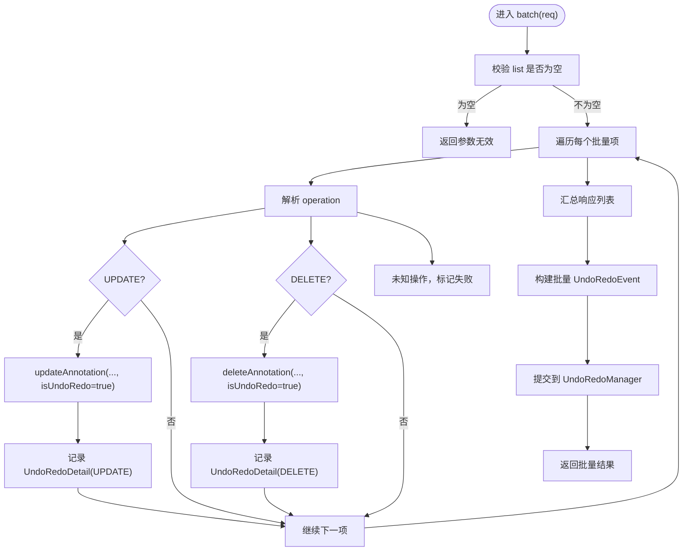
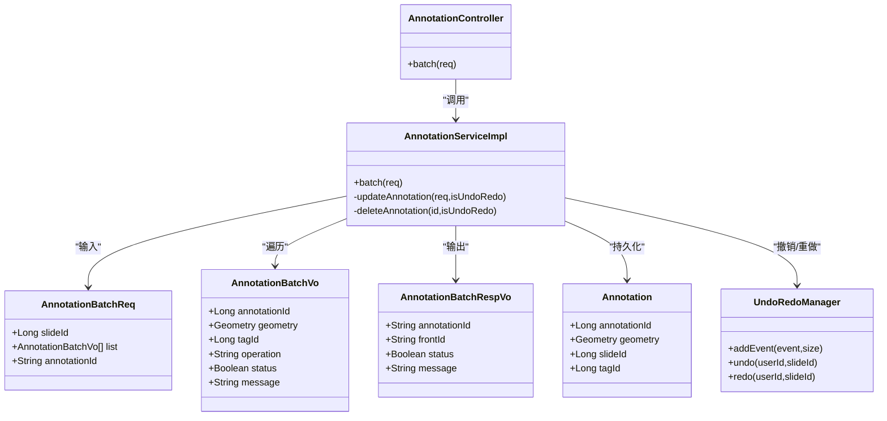

# 标注批量操作

<cite>
**本文引用的文件**
- [AnnotationController.java](file://src/main/java/cn/staitech/annotation/controller/AnnotationController.java)
- [AnnotationServiceImpl.java](file://src/main/java/cn/staitech/annotation/service/impl/AnnotationServiceImpl.java)
- [AnnotationBatchReq.java](file://src/main/java/cn/staitech/annotation/vo/anno/AnnotationBatchReq.java)
- [AnnotationBatchVo.java](file://src/main/java/cn/staitech/annotation/vo/anno/AnnotationBatchVo.java)
- [AnnotationBatchRespVo.java](file://src/main/java/cn/staitech/annotation/vo/anno/AnnotationBatchRespVo.java)
- [Annotation.java](file://src/main/java/cn/staitech/annotation/domain/Annotation.java)
- [Constant.java](file://src/main/java/cn/staitech/annotation/constant/Constant.java)
- [UndoRedoManager.java](file://src/main/java/cn/staitech/annotation/utils/annotation/UndoRedoManager.java)
- [UndoRedoEvent.java](file://src/main/java/cn/staitech/annotation/utils/annotation/UndoRedoEvent.java)
- [UndoRedoDetail.java](file://src/main/java/cn/staitech/annotation/utils/annotation/UndoRedoDetail.java)
</cite>

## 目录
1. [简介](#简介)
2. [项目结构](#项目结构)
3. [核心组件](#核心组件)
4. [架构总览](#架构总览)
5. [详细组件分析](#详细组件分析)
6. [依赖分析](#依赖分析)
7. [性能考虑](#性能考虑)
8. [故障排查指南](#故障排查指南)
9. [结论](#结论)
10. [附录](#附录)

## 简介
本技术文档围绕标注批量操作功能展开，重点解释 AnnotationController 中 /annotation/batch 接口的实现机制，涵盖批量删除、批量更新等操作的处理流程；详细说明 AnnotationBatchReq 请求体的结构设计、字段含义、校验规则；阐述批量操作的事务管理、错误处理与性能优化策略；并提供完整的使用示例、最佳实践与性能调优建议。同时对比批量操作与单个操作的差异、适用场景与性能表现，帮助开发者高效、安全地使用该能力。

## 项目结构
标注批量操作位于后端服务模块中，涉及控制器、服务层、领域模型、常量与撤销/重做工具等组件。关键文件如下：
- 控制器：负责接收请求、参数校验与转发到服务层
- 服务实现：负责批量调度、事务控制、撤销/重做事件聚合
- VO/Domain：承载请求体、响应体与持久化实体
- 常量：统一定义操作类型与业务常量
- 撤销/重做：支持批量操作的统一撤销/重做

图表来源
- [AnnotationController.java:177-192](file://src/main/java/cn/staitech/annotation/controller/AnnotationController.java#L177-L192)
- [AnnotationServiceImpl.java:574-623](file://src/main/java/cn/staitech/annotation/service/impl/AnnotationServiceImpl.java#L574-L623)
- [AnnotationBatchReq.java:15-30](file://src/main/java/cn/staitech/annotation/vo/anno/AnnotationBatchReq.java#L15-L30)
- [AnnotationBatchVo.java:19-71](file://src/main/java/cn/staitech/annotation/vo/anno/AnnotationBatchVo.java#L19-L71)
- [AnnotationBatchRespVo.java:20-34](file://src/main/java/cn/staitech/annotation/vo/anno/AnnotationBatchRespVo.java#L20-L34)
- [Annotation.java:25-112](file://src/main/java/cn/staitech/annotation/domain/Annotation.java#L25-L112)
- [Constant.java:49-58](file://src/main/java/cn/staitech/annotation/constant/Constant.java#L49-L58)
- [UndoRedoManager.java:19-97](file://src/main/java/cn/staitech/annotation/utils/annotation/UndoRedoManager.java#L19-L97)

章节来源
- [AnnotationController.java:177-192](file://src/main/java/cn/staitech/annotation/controller/AnnotationController.java#L177-L192)
- [AnnotationServiceImpl.java:574-623](file://src/main/java/cn/staitech/annotation/service/impl/AnnotationServiceImpl.java#L574-L623)

## 核心组件
- AnnotationController：暴露 /annotation/batch 接口，负责参数校验与日志审计，随后委托服务层执行批量操作。
- AnnotationServiceImpl：实现批量操作的核心逻辑，包含事务控制、逐条执行、错误隔离与统一撤销/重做事件聚合。
- AnnotationBatchReq：批量请求体，包含切片标识、批量项列表与可选的主键标识字段。
- AnnotationBatchVo：批量项，包含标注主键、几何、标签、轮廓类型、操作类型等字段。
- AnnotationBatchRespVo：批量响应体，包含每条子操作的结果状态、消息与前端展示用的 front_id。
- Annotation：持久化实体，承载标注数据的字段与约束。
- Constant：定义操作类型常量（如 UPDATE、DELETE、INSERT）与业务常量。
- UndoRedoManager/UndoRedoEvent/UndoRedoDetail：支持批量操作的统一撤销/重做管理，按用户+切片维度维护历史栈。

章节来源
- [AnnotationController.java:177-192](file://src/main/java/cn/staitech/annotation/controller/AnnotationController.java#L177-L192)
- [AnnotationServiceImpl.java:574-623](file://src/main/java/cn/staitech/annotation/service/impl/AnnotationServiceImpl.java#L574-L623)
- [AnnotationBatchReq.java:15-30](file://src/main/java/cn/staitech/annotation/vo/anno/AnnotationBatchReq.java#L15-L30)
- [AnnotationBatchVo.java:19-71](file://src/main/java/cn/staitech/annotation/vo/anno/AnnotationBatchVo.java#L19-L71)
- [AnnotationBatchRespVo.java:20-34](file://src/main/java/cn/staitech/annotation/vo/anno/AnnotationBatchRespVo.java#L20-L34)
- [Annotation.java:25-112](file://src/main/java/cn/staitech/annotation/domain/Annotation.java#L25-L112)
- [Constant.java:49-58](file://src/main/java/cn/staitech/annotation/constant/Constant.java#L49-L58)
- [UndoRedoManager.java:19-97](file://src/main/java/cn/staitech/annotation/utils/annotation/UndoRedoManager.java#L19-L97)

## 架构总览
批量操作从控制器进入，经服务层逐条执行具体操作，并在事务内完成数据库变更与撤销/重做事件收集，最后统一返回每条操作的执行结果。

图表来源
- [AnnotationController.java:177-192](file://src/main/java/cn/staitech/annotation/controller/AnnotationController.java#L177-L192)
- [AnnotationServiceImpl.java:574-623](file://src/main/java/cn/staitech/annotation/service/impl/AnnotationServiceImpl.java#L574-L623)

## 详细组件分析

### AnnotationController 中的 batch 接口
- 路由与权限：POST /annotation/batch，启用日志审计注解。
- 参数校验：使用 @Validated 校验请求体。
- 语言处理：当批量项包含 DELETE 操作时，根据语言环境拼接多个标注主键，便于审计日志记录。
- 转发执行：将请求体直接传递给服务层的 batch 方法。

章节来源
- [AnnotationController.java:177-192](file://src/main/java/cn/staitech/annotation/controller/AnnotationController.java#L177-L192)

### AnnotationServiceImpl 中的 batch 实现
- 输入：AnnotationBatchReq，包含 slideId、list（批量项）、annotationId（可选主键标识）。
- 流程：
  - 校验 list 是否为空，为空则返回参数无效。
  - 逐条遍历批量项，构建响应体并尝试执行对应操作：
    - UPDATE：将批量项映射为更新请求，调用 updateAnnotation(isUndoRedo=true)，记录 UndoRedoDetail(UPDATE)。
    - DELETE：调用 deleteAnnotation(id, isUndoRedo=true)，记录 UndoRedoDetail(DELETE)。
    - 其他：标记未知操作错误。
  - 异常处理：捕获单条操作异常，记录错误信息并继续处理后续项，保证“部分失败不影响整体返回”。
  - 事务与撤销/重做：批量项执行完成后，统一构造 UndoRedoEvent 并加入撤销/重做栈，支持按用户+切片维度进行撤销/重做。
- 输出：R<List<AnnotationBatchRespVo>>，包含每条子操作的状态、消息与前端展示字段。

图表来源
- [AnnotationServiceImpl.java:574-623](file://src/main/java/cn/staitech/annotation/service/impl/AnnotationServiceImpl.java#L574-L623)

章节来源
- [AnnotationServiceImpl.java:574-623](file://src/main/java/cn/staitech/annotation/service/impl/AnnotationServiceImpl.java#L574-L623)

### AnnotationBatchReq 请求体结构
- slide_id：必填，用于确定批量操作作用于哪个切片。
- list：批量项数组，元素为 AnnotationBatchVo。
- marking_id（可选）：用于审计日志中记录被删除的多个标注主键。

章节来源
- [AnnotationBatchReq.java:15-30](file://src/main/java/cn/staitech/annotation/vo/anno/AnnotationBatchReq.java#L15-L30)

### AnnotationBatchVo 批量项结构
- marking_id：必填，标注主键。
- category_id：标签ID（可选）。
- geometry：几何对象（可选，用于更新）。
- location_type：轮廓类型（可选）。
- operation：必填，操作类型（UPDATE/DELETE/INSERT 等）。
- message/status/front_id：用于响应与前端展示。

章节来源
- [AnnotationBatchVo.java:19-71](file://src/main/java/cn/staitech/annotation/vo/anno/AnnotationBatchVo.java#L19-L71)

### AnnotationBatchRespVo 响应体结构
- marking_id：标注主键字符串。
- front_id：前端展示用 ID 字符串。
- status：布尔，表示该子操作是否成功。
- message：字符串，包含错误信息或成功提示。

章节来源
- [AnnotationBatchRespVo.java:20-34](file://src/main/java/cn/staitech/annotation/vo/anno/AnnotationBatchRespVo.java#L20-L34)

### Annotation 实体与字段
- 包含标注主键、面积、周长、描述、标签ID、几何、轮廓类型、标注类型、创建/更新者与时间、切片ID、JSON ID、轮廓类型等字段。
- 字段级校验与约束确保数据完整性。

章节来源
- [Annotation.java:25-112](file://src/main/java/cn/staitech/annotation/domain/Annotation.java#L25-L112)

### 操作类型与常量
- 操作类型：UPDATE、DELETE、INSERT 等，来源于 Constant。
- 通过常量统一管理，避免魔法字符串，提升可维护性。

章节来源
- [Constant.java:49-58](file://src/main/java/cn/staitech/annotation/constant/Constant.java#L49-L58)

### 撤销/重做机制
- UndoRedoManager：以 userId:slideId 为键维护可序列化的撤销/重做栈。
- UndoRedoEvent：包含 slideId、userId 与一组 UndoRedoDetail。
- UndoRedoDetail：记录当前/历史标注与操作类型。
- 批量操作结束后统一提交 UndoRedoEvent，支持按用户+切片维度进行撤销/重做。

章节来源
- [UndoRedoManager.java:19-97](file://src/main/java/cn/staitech/annotation/utils/annotation/UndoRedoManager.java#L19-L97)
- [UndoRedoEvent.java:19-28](file://src/main/java/cn/staitech/annotation/utils/annotation/UndoRedoEvent.java#L19-L28)
- [UndoRedoDetail.java:19-29](file://src/main/java/cn/staitech/annotation/utils/annotation/UndoRedoDetail.java#L19-L29)

## 依赖分析
- 控制器依赖服务层；服务层依赖 Mapper、撤销/重做管理器与常量。
- 批量操作依赖 MyBatis 进行数据库读写；依赖 JTS 几何库进行几何运算（在其他方法中使用，批量操作主要通过服务层封装）。
- 错误处理采用异常捕获与状态标记，避免单条失败影响整体返回。

图表来源
- [AnnotationController.java:177-192](file://src/main/java/cn/staitech/annotation/controller/AnnotationController.java#L177-L192)
- [AnnotationServiceImpl.java:574-623](file://src/main/java/cn/staitech/annotation/service/impl/AnnotationServiceImpl.java#L574-L623)
- [AnnotationBatchReq.java:15-30](file://src/main/java/cn/staitech/annotation/vo/anno/AnnotationBatchReq.java#L15-L30)
- [AnnotationBatchVo.java:19-71](file://src/main/java/cn/staitech/annotation/vo/anno/AnnotationBatchVo.java#L19-L71)
- [AnnotationBatchRespVo.java:20-34](file://src/main/java/cn/staitech/annotation/vo/anno/AnnotationBatchRespVo.java#L20-L34)
- [Annotation.java:25-112](file://src/main/java/cn/staitech/annotation/domain/Annotation.java#L25-L112)
- [UndoRedoManager.java:19-97](file://src/main/java/cn/staitech/annotation/utils/annotation/UndoRedoManager.java#L19-L97)

## 性能考虑
- 单条执行与事务：服务层逐条执行 UPDATE/DELETE，每条操作均在事务内完成，保证原子性与一致性。
- 错误隔离：单条异常被捕获并标记失败，不影响其他项的执行，适合大规模批量操作。
- 撤销/重做聚合：批量结束后统一提交 UndoRedoEvent，减少多次交互带来的开销。
- 数据库访问：MyBatis Mapper 提供高效的 CRUD 操作，批量场景下建议控制单次请求数量，避免超大列表导致内存与网络压力。
- 几何运算：批量操作本身不直接进行复杂几何运算，但服务层其他方法使用 JTS 库，若未来扩展批量几何合并/裁剪，需评估性能并考虑分批处理。

[本节为通用性能建议，不直接分析具体文件]

## 故障排查指南
- 参数无效：当批量项列表为空时，返回参数无效错误。
- 未知操作：当 operation 不属于已知类型时，标记失败并返回相应消息。
- 单条失败：批量中某一项抛出异常时，记录错误信息并继续处理后续项，最终返回部分失败结果。
- 审计日志：当包含 DELETE 操作时，会根据语言环境拼接多个标注主键，便于审计追踪。
- 撤销/重做：若批量操作后需要回滚，可通过撤销/重做接口按用户+切片维度恢复。

章节来源
- [AnnotationServiceImpl.java:619-623](file://src/main/java/cn/staitech/annotation/service/impl/AnnotationServiceImpl.java#L619-L623)
- [AnnotationServiceImpl.java:607-614](file://src/main/java/cn/staitech/annotation/service/impl/AnnotationServiceImpl.java#L607-L614)
- [AnnotationController.java:184-189](file://src/main/java/cn/staitech/annotation/controller/AnnotationController.java#L184-L189)

## 结论
标注批量操作通过 AnnotationController 的 /annotation/batch 接口实现，服务层在事务内逐条执行 UPDATE/DELETE，并统一记录撤销/重做事件，具备良好的错误隔离与审计能力。请求体结构清晰、字段明确，适合大规模标注数据的批量处理。结合撤销/重做机制，可在保证数据一致性的前提下，灵活应对批量变更后的回滚需求。

[本节为总结性内容，不直接分析具体文件]

## 附录

### 使用示例（请求/响应与异常处理）
- 请求格式
  - 路径：POST /annotation/batch
  - 请求体：包含 slide_id、list（批量项数组）、可选 marking_id
  - 批量项字段：marking_id、operation（UPDATE/DELETE/INSERT）、geometry（可选）、category_id（可选）、location_type（可选）
- 响应格式
  - 返回 R<List<AnnotationBatchRespVo>>，每项包含 marking_id、front_id、status、message
- 异常处理
  - 参数无效：返回参数无效错误
  - 未知操作：标记失败并返回相应消息
  - 单条异常：记录错误并继续处理，最终返回部分失败结果

章节来源
- [AnnotationBatchReq.java:15-30](file://src/main/java/cn/staitech/annotation/vo/anno/AnnotationBatchReq.java#L15-L30)
- [AnnotationBatchVo.java:19-71](file://src/main/java/cn/staitech/annotation/vo/anno/AnnotationBatchVo.java#L19-L71)
- [AnnotationBatchRespVo.java:20-34](file://src/main/java/cn/staitech/annotation/vo/anno/AnnotationBatchRespVo.java#L20-L34)
- [AnnotationServiceImpl.java:619-623](file://src/main/java/cn/staitech/annotation/service/impl/AnnotationServiceImpl.java#L619-L623)

### 与单个操作的区别、适用场景与性能对比
- 区别
  - 单个操作：每次请求仅处理一个标注，适合精细控制与实时反馈。
  - 批量操作：一次请求处理多个标注，适合大规模变更与统一审计。
- 适用场景
  - 批量删除：清理某个切片下的多条标注
  - 批量更新：统一修改多个标注的几何或标签
- 性能对比
  - 批量操作在服务层逐条执行，具备错误隔离与统一撤销/重做，适合高并发与大批量场景；单个操作更轻量，适合小规模或需要即时确认的场景。

[本节为概念性对比，不直接分析具体文件]

### 最佳实践与性能调优建议
- 控制批量大小：避免单次请求过大，建议分批提交，降低内存与网络压力。
- 合理使用 operation：优先使用 UPDATE/DELETE，避免不必要的 INSERT。
- 关注异常处理：利用响应中的 status/message 快速定位失败项。
- 审计与回滚：批量操作后可通过撤销/重做接口进行回滚，建议在关键业务前做好备份或确认。
- 日志与监控：结合日志审计与监控指标，观察批量操作的吞吐与延迟。

[本节为通用建议，不直接分析具体文件]