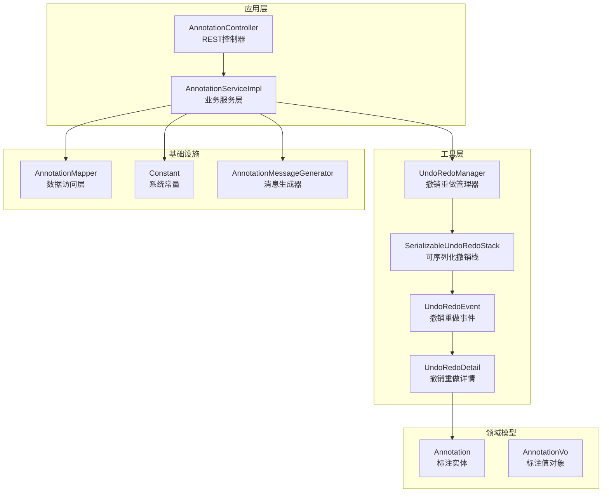
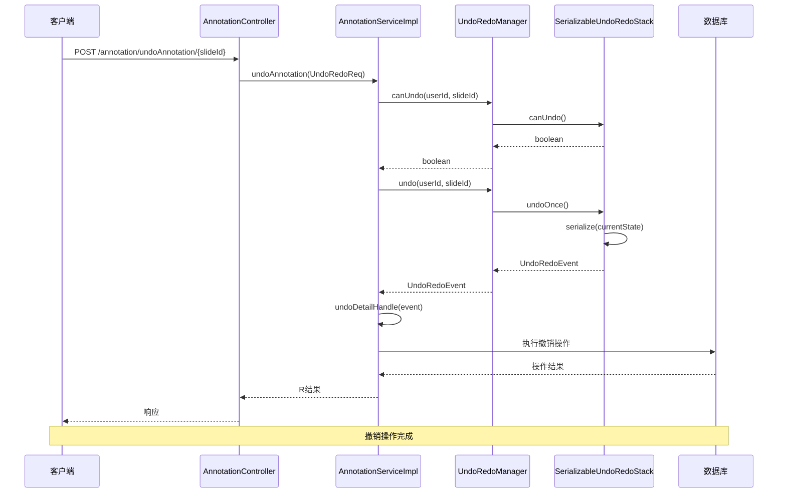
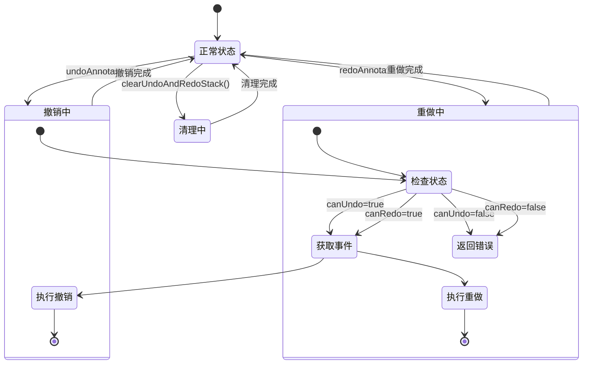
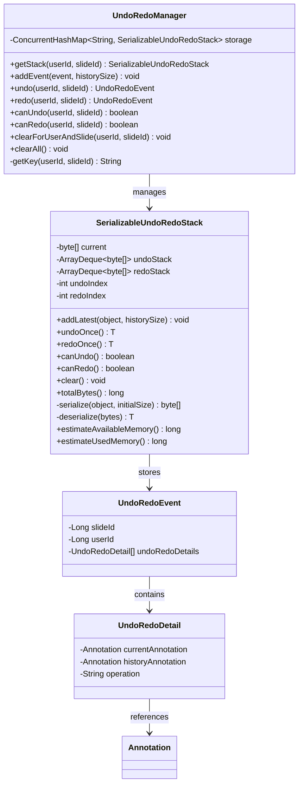
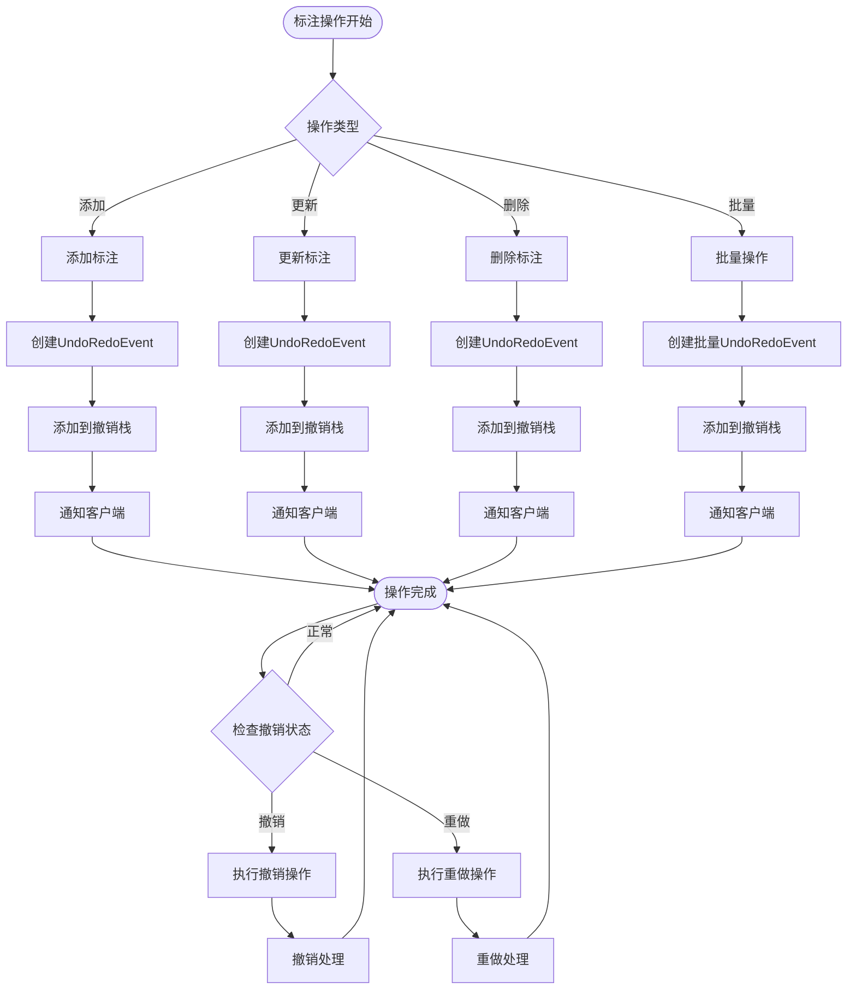
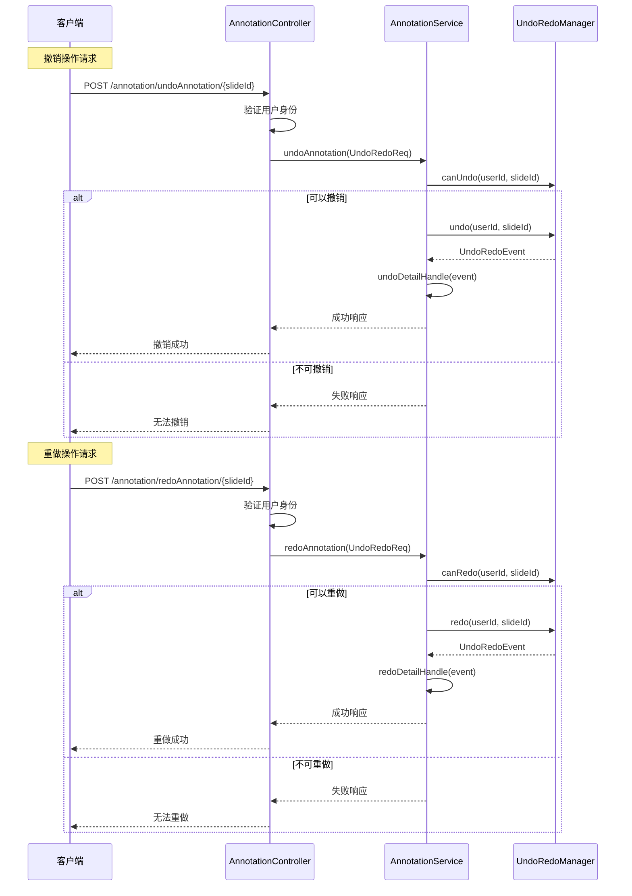
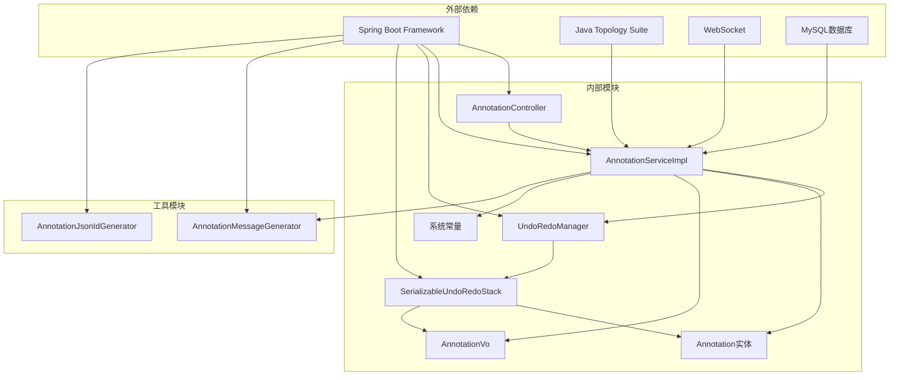

# 标注撤销重做系统

<cite>
**本文档引用的文件**
- [UndoRedoManager.java](file://src/main/java/cn/staitech/annotation/utils/annotation/UndoRedoManager.java)
- [UndoRedoEvent.java](file://src/main/java/cn/staitech/annotation/utils/annotation/UndoRedoEvent.java)
- [UndoRedoDetail.java](file://src/main/java/cn/staitech/annotation/utils/annotation/UndoRedoDetail.java)
- [UndoRedoReq.java](file://src/main/java/cn/staitech/annotation/utils/annotation/UndoRedoReq.java)
- [SerializableUndoRedoStack.java](file://src/main/java/cn/staitech/annotation/utils/annotation/SerializableUndoRedoStack.java)
- [AnnotationServiceImpl.java](file://src/main/java/cn/staitech/annotation/service/impl/AnnotationServiceImpl.java)
- [AnnotationController.java](file://src/main/java/cn/staitech/annotation/controller/AnnotationController.java)
- [Constant.java](file://src/main/java/cn/staitech/annotation/constant/Constant.java)
- [Annotation.java](file://src/main/java/cn/staitech/annotation/domain/Annotation.java)
- [AnnotationMessageGenerator.java](file://src/main/java/cn/staitech/annotation/utils/annotation/AnnotationMessageGenerator.java)
</cite>

## 目录
1. [简介](#简介)
2. [项目结构](#项目结构)
3. [核心组件](#核心组件)
4. [架构概览](#架构概览)
5. [详细组件分析](#详细组件分析)
6. [依赖关系分析](#依赖关系分析)
7. [性能考虑](#性能考虑)
8. [故障排除指南](#故障排除指南)
9. [结论](#结论)
10. [附录](#附录)

## 简介

标注撤销重做系统是一个基于Java开发的高性能标注管理系统，专门设计用于医学影像标注的撤销和重做功能。该系统实现了完整的标注操作历史记录机制，支持按用户和切片维度进行独立的历史管理，提供了完整的撤销（undo）和重做（redo）功能，以及内存优化和持久化策略。

系统的核心特性包括：
- 基于用户和切片维度的历史管理
- 内存友好的序列化存储机制
- 并发安全的撤销重做操作
- 完整的错误处理和恢复机制
- 支持批量操作的历史记录
- 实时状态检查和监控

## 项目结构

标注撤销重做系统采用标准的Spring Boot项目结构，主要包含以下模块：



**图表来源**
- [AnnotationController.java:1-251](file://src/main/java/cn/staitech/annotation/controller/AnnotationController.java#L1-L251)
- [AnnotationServiceImpl.java:1-724](file://src/main/java/cn/staitech/annotation/service/impl/AnnotationServiceImpl.java#L1-L724)
- [UndoRedoManager.java:1-97](file://src/main/java/cn/staitech/annotation/utils/annotation/UndoRedoManager.java#L1-L97)

**章节来源**
- [AnnotationController.java:1-251](file://src/main/java/cn/staitech/annotation/controller/AnnotationController.java#L1-L251)
- [AnnotationServiceImpl.java:1-724](file://src/main/java/cn/staitech/annotation/service/impl/AnnotationServiceImpl.java#L1-L724)

## 核心组件

### 撤销重做管理器

UndoRedoManager是整个系统的核心组件，负责管理所有用户的撤销重做状态。它使用ConcurrentHashMap实现线程安全的存储，支持按用户ID和切片ID进行维度化的状态管理。

关键特性：
- 基于"userId:slideId"的复合键存储
- 自动清理过期历史记录
- 支持定时任务清理所有记录
- 提供完整的撤销重做状态查询

### 可序列化撤销栈

SerializableUndoRedoStack实现了高效的内存管理机制，通过二进制序列化存储标注状态，支持：
- 动态内存估算和优化
- 同步操作保证线程安全
- 完整的状态回放能力
- 内存使用监控和清理

### 撤销重做事件模型

系统使用分层的数据模型来表示撤销重做操作：
- UndoRedoEvent：顶层事件容器
- UndoRedoDetail：具体操作详情
- Annotation：标注实体状态

**章节来源**
- [UndoRedoManager.java:16-97](file://src/main/java/cn/staitech/annotation/utils/annotation/UndoRedoManager.java#L16-L97)
- [SerializableUndoRedoStack.java:10-246](file://src/main/java/cn/staitech/annotation/utils/annotation/SerializableUndoRedoStack.java#L10-L246)
- [UndoRedoEvent.java:10-29](file://src/main/java/cn/staitech/annotation/utils/annotation/UndoRedoEvent.java#L10-L29)

## 架构概览

系统采用分层架构设计，确保职责分离和高内聚低耦合：



**图表来源**
- [AnnotationController.java:226-236](file://src/main/java/cn/staitech/annotation/controller/AnnotationController.java#L226-L236)
- [AnnotationServiceImpl.java:677-688](file://src/main/java/cn/staitech/annotation/service/impl/AnnotationServiceImpl.java#L677-L688)
- [UndoRedoManager.java:48-77](file://src/main/java/cn/staitech/annotation/utils/annotation/UndoRedoManager.java#L48-L77)

### 状态管理流程



**图表来源**
- [AnnotationServiceImpl.java:677-707](file://src/main/java/cn/staitech/annotation/service/impl/AnnotationServiceImpl.java#L677-L707)
- [UndoRedoManager.java:63-77](file://src/main/java/cn/staitech/annotation/utils/annotation/UndoRedoManager.java#L63-L77)

## 详细组件分析

### UndoRedoManager 组件分析

UndoRedoManager是系统的核心协调器，负责管理所有用户的撤销重做状态：



**图表来源**
- [UndoRedoManager.java:19-97](file://src/main/java/cn/staitech/annotation/utils/annotation/UndoRedoManager.java#L19-L97)
- [SerializableUndoRedoStack.java:18-246](file://src/main/java/cn/staitech/annotation/utils/annotation/SerializableUndoRedoStack.java#L18-L246)
- [UndoRedoEvent.java:19-28](file://src/main/java/cn/staitech/annotation/utils/annotation/UndoRedoEvent.java#L19-L28)
- [UndoRedoDetail.java:19-29](file://src/main/java/cn/staitech/annotation/utils/annotation/UndoRedoDetail.java#L19-L29)

#### 并发控制策略

系统采用多层并发控制机制：

1. **外部并发控制**：使用`@Scheduled`注解确保定时任务的线程安全
2. **内部并发控制**：在`SerializableUndoRedoStack`中使用`synchronized`关键字保护关键操作
3. **存储并发控制**：使用`ConcurrentHashMap`确保存储操作的线程安全

#### 内存优化机制

系统实现了智能的内存管理策略：

1. **动态内存估算**：定期评估可用内存，避免内存不足
2. **自动清理机制**：当内存压力过大时自动清理撤销栈
3. **历史记录限制**：通过`UNDO_REDO_STACK_SIZE`常量限制历史记录数量
4. **序列化优化**：使用二进制序列化减少内存占用

**章节来源**
- [UndoRedoManager.java:16-97](file://src/main/java/cn/staitech/annotation/utils/annotation/UndoRedoManager.java#L16-L97)
- [SerializableUndoRedoStack.java:144-173](file://src/main/java/cn/staitech/annotation/utils/annotation/SerializableUndoRedoStack.java#L144-L173)

### AnnotationServiceImpl 组件分析

AnnotationServiceImpl实现了完整的标注业务逻辑，集成了撤销重做功能：



**图表来源**
- [AnnotationServiceImpl.java:184-238](file://src/main/java/cn/staitech/annotation/service/impl/AnnotationServiceImpl.java#L184-L238)
- [AnnotationServiceImpl.java:329-440](file://src/main/java/cn/staitech/annotation/service/impl/AnnotationServiceImpl.java#L329-L440)
- [AnnotationServiceImpl.java:267-300](file://src/main/java/cn/staitech/annotation/service/impl/AnnotationServiceImpl.java#L267-L300)

#### 撤销重做事件序列化

系统实现了完整的事件序列化机制：

1. **事件构建**：根据不同的标注操作类型构建相应的`UndoRedoEvent`
2. **状态捕获**：捕获操作前后的标注状态
3. **序列化存储**：将事件对象序列化为二进制数据存储
4. **状态回放**：通过反序列化恢复历史状态

#### 错误处理机制

系统实现了多层次的错误处理：

1. **业务异常处理**：捕获并处理标注操作中的各种异常
2. **序列化异常处理**：处理序列化和反序列化过程中的错误
3. **网络异常处理**：处理WebSocket通信中的异常情况
4. **资源清理**：确保异常情况下资源的正确释放

**章节来源**
- [AnnotationServiceImpl.java:574-623](file://src/main/java/cn/staitech/annotation/service/impl/AnnotationServiceImpl.java#L574-L623)
- [AnnotationServiceImpl.java:625-675](file://src/main/java/cn/staitech/annotation/service/impl/AnnotationServiceImpl.java#L625-L675)

### AnnotationController 组件分析

AnnotationController提供了REST API接口，支持撤销重做操作：



**图表来源**
- [AnnotationController.java:226-248](file://src/main/java/cn/staitech/annotation/controller/AnnotationController.java#L226-L248)
- [AnnotationServiceImpl.java:677-707](file://src/main/java/cn/staitech/annotation/service/impl/AnnotationServiceImpl.java#L677-L707)

#### API接口设计

系统提供了完整的REST API接口：

1. **撤销接口**：`POST /annotation/undoAnnotation/{slideId}`
2. **重做接口**：`POST /annotation/redoAnnotation/{slideId}`
3. **状态检查接口**：`POST /annotation/checkUndoAndRedoStatus/{slideId}`
4. **清理接口**：`POST /annotation/clear/{slideId}`

每个接口都包含了适当的参数验证和错误处理。

**章节来源**
- [AnnotationController.java:226-248](file://src/main/java/cn/staitech/annotation/controller/AnnotationController.java#L226-L248)

## 依赖关系分析

系统采用了清晰的依赖关系设计，确保模块间的松耦合：



**图表来源**
- [AnnotationServiceImpl.java:1-724](file://src/main/java/cn/staitech/annotation/service/impl/AnnotationServiceImpl.java#L1-L724)
- [AnnotationController.java:1-251](file://src/main/java/cn/staitech/annotation/controller/AnnotationController.java#L1-L251)

### 关键依赖关系

1. **业务层依赖**：Service层依赖于Manager层进行撤销重做管理
2. **数据层依赖**：Service层直接依赖于数据库访问层
3. **工具层依赖**：Service层依赖于各种工具类进行消息生成和ID管理
4. **外部服务依赖**：系统依赖于远程业务服务进行标签查询

### 循环依赖检测

系统设计避免了循环依赖：
- 控制器只依赖服务接口
- 服务实现不依赖控制器
- 工具类相互独立
- 数据模型保持纯净

**章节来源**
- [AnnotationServiceImpl.java:1-724](file://src/main/java/cn/staitech/annotation/service/impl/AnnotationServiceImpl.java#L1-L724)
- [AnnotationController.java:1-251](file://src/main/java/cn/staitech/annotation/controller/AnnotationController.java#L1-L251)

## 性能考虑

### 内存管理优化

系统实现了多项内存优化策略：

1. **序列化存储**：使用二进制序列化替代文本序列化，减少内存占用
2. **动态内存估算**：实时监控JVM内存使用情况，避免内存溢出
3. **智能清理机制**：当内存压力超过阈值时自动清理历史记录
4. **历史记录限制**：通过配置常量限制最大历史记录数量

### 并发性能优化

1. **线程安全设计**：使用`synchronized`关键字确保操作的原子性
2. **无锁存储**：使用`ConcurrentHashMap`提供高效的并发访问
3. **异步处理**：WebSocket消息处理采用异步方式提高响应速度
4. **连接池管理**：合理配置数据库连接池参数

### 网络性能优化

1. **消息压缩**：WebSocket消息采用压缩传输减少带宽占用
2. **批量处理**：支持批量标注操作，减少网络往返次数
3. **增量更新**：只发送必要的状态变更信息
4. **连接复用**：复用WebSocket连接避免频繁建立连接

## 故障排除指南

### 常见问题及解决方案

#### 撤销重做功能异常

**问题现象**：撤销或重做按钮不可用
**可能原因**：
1. 历史记录已被清理
2. 当前用户无权操作该切片
3. 系统内存不足导致历史记录丢失

**解决步骤**：
1. 检查历史记录状态：调用`checkUndoAndRedoStatus`接口
2. 验证用户权限：确认用户对目标切片的操作权限
3. 监控内存使用：检查系统内存使用情况
4. 重新执行标注操作：重新进行标注操作以生成新的历史记录

#### 序列化异常

**问题现象**：撤销或重做操作抛出序列化异常
**可能原因**：
1. 类版本不兼容
2. 序列化数据损坏
3. 内存不足导致序列化失败

**解决步骤**：
1. 检查类版本一致性
2. 清理历史记录：调用`clearUndoAndRedoStack`接口
3. 增加JVM内存：调整JVM启动参数
4. 重启服务：重启应用服务恢复功能

#### WebSocket连接问题

**问题现象**：客户端无法接收标注更新通知
**可能原因**：
1. WebSocket服务器异常
2. 网络连接中断
3. 客户端连接超时

**解决步骤**：
1. 检查WebSocket服务器状态
2. 验证网络连接稳定性
3. 重新建立WebSocket连接
4. 查看服务器日志获取详细错误信息

### 调试和监控

系统提供了完善的调试和监控机制：

1. **日志记录**：详细的日志记录便于问题诊断
2. **状态监控**：实时监控撤销重做状态变化
3. **内存监控**：监控内存使用情况和垃圾回收
4. **性能指标**：记录关键性能指标如响应时间、吞吐量等

**章节来源**
- [AnnotationServiceImpl.java:677-707](file://src/main/java/cn/staitech/annotation/service/impl/AnnotationServiceImpl.java#L677-L707)
- [SerializableUndoRedoStack.java:100-134](file://src/main/java/cn/staitech/annotation/utils/annotation/SerializableUndoRedoStack.java#L100-L134)

## 结论

标注撤销重做系统是一个设计精良、功能完整的标注管理解决方案。系统通过以下关键特性实现了高效可靠的撤销重做功能：

1. **架构设计**：采用分层架构确保职责分离和高内聚低耦合
2. **并发安全**：实现了多层并发控制机制，确保线程安全
3. **内存优化**：通过智能内存管理和序列化优化减少资源消耗
4. **错误处理**：建立了完整的错误处理和恢复机制
5. **扩展性**：提供了良好的扩展接口和自定义能力

系统特别适合医学影像标注等对数据准确性要求极高的应用场景，能够有效防止误操作造成的数据损失，提高标注工作的可靠性和效率。

## 附录

### 使用示例

#### 基本撤销重做操作

```java
// 撤销操作
UndoRedoReq req = UndoRedoReq.builder()
    .userId(currentUserId)
    .slideId(currentSlideId)
    .build();

R<Boolean> result = annotationService.undoAnnotation(req);

// 重做操作
R<Boolean> result = annotationService.redoAnnotation(req);

// 检查状态
R<Boolean> status = annotationService.checkUndoAndRedoStatus(req);
```

#### 批量操作示例

```java
// 批量更新和删除
AnnotationBatchReq batchReq = new AnnotationBatchReq();
batchReq.setSlideId(slideId);
batchReq.setUserId(userId);

List<AnnotationBatchVo> operations = new ArrayList<>();
operations.add(AnnotationBatchVo.builder()
    .annotationId(1L)
    .operation("UPDATE")
    .geometry(updatedGeometry)
    .build());

operations.add(AnnotationBatchVo.builder()
    .annotationId(2L)
    .operation("DELETE")
    .build());

batchReq.setList(operations);
annotationService.batch(batchReq);
```

### 配置选项

系统的主要配置选项包括：

1. **历史记录大小**：通过`UNDO_REDO_STACK_SIZE`常量配置
2. **内存阈值**：通过内存估算算法自动调整
3. **定时清理**：通过Cron表达式配置自动清理任务
4. **序列化参数**：通过初始容量参数优化序列化性能

### 扩展指南

#### 自定义事件处理器

开发者可以通过以下方式扩展撤销重做功能：

1. **实现自定义事件处理器**：继承基础事件处理逻辑
2. **扩展数据模型**：添加新的标注属性支持
3. **自定义序列化策略**：针对特定场景优化序列化性能
4. **集成第三方存储**：支持将历史记录持久化到外部存储

#### 性能优化建议

1. **监控内存使用**：定期监控内存使用情况，及时清理历史记录
2. **优化序列化参数**：根据实际数据大小调整序列化初始容量
3. **合理配置历史记录大小**：平衡内存占用和功能需求
4. **使用连接池**：合理配置数据库连接池参数