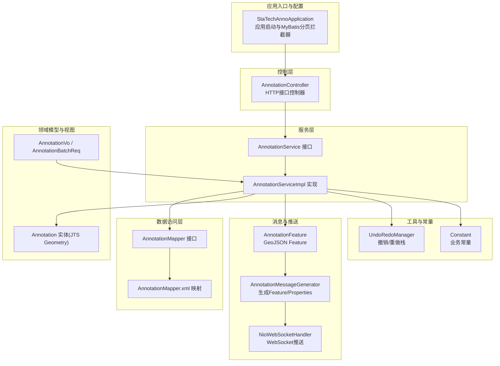
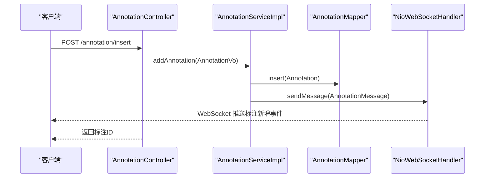
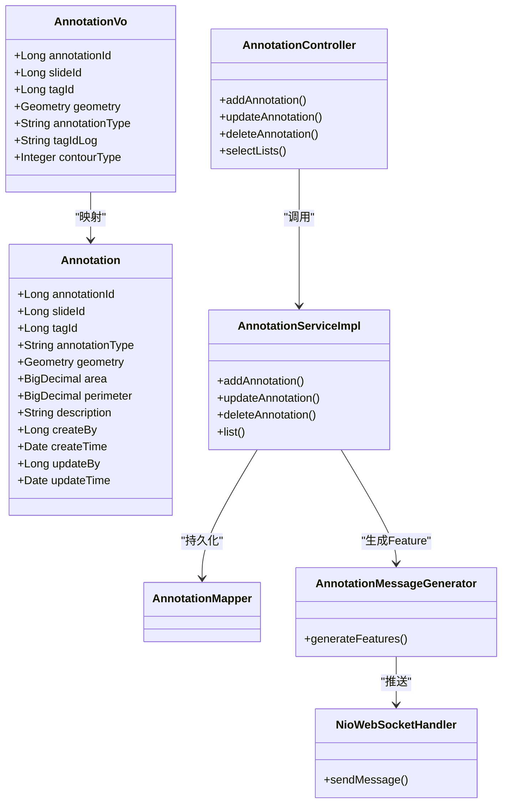
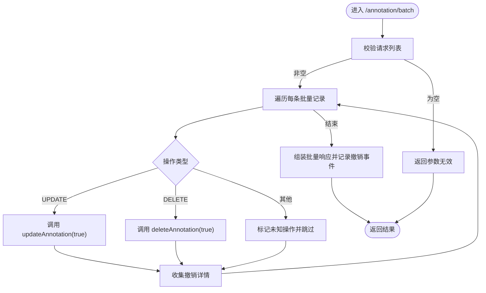
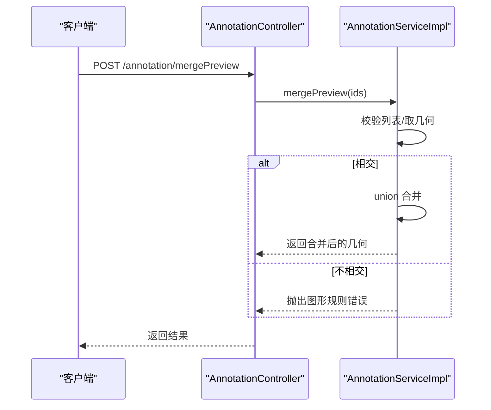
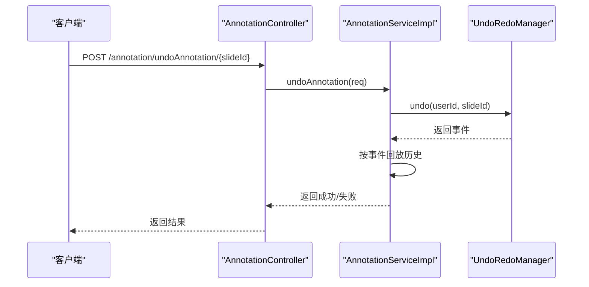
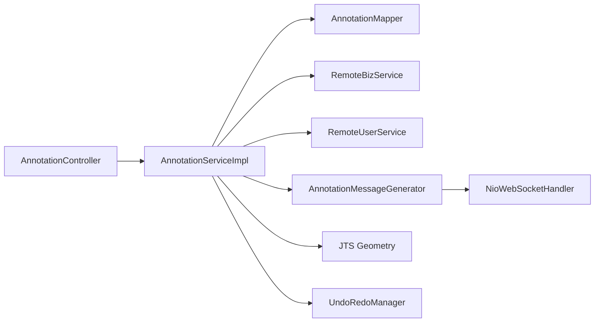

# 标注管理系统

<cite>
**本文引用的文件**
- [StaTechAnnoApplication.java](file://src/main/java/cn/staitech/annotation/StaTechAnnoApplication.java)
- [Annotation.java](file://src/main/java/cn/staitech/annotation/domain/Annotation.java)
- [AnnotationController.java](file://src/main/java/cn/staitech/annotation/controller/AnnotationController.java)
- [AnnotationService.java](file://src/main/java/cn/staitech/annotation/service/AnnotationService.java)
- [AnnotationServiceImpl.java](file://src/main/java/cn/staitech/annotation/service/impl/AnnotationServiceImpl.java)
- [AnnotationMapper.java](file://src/main/java/cn/staitech/annotation/mapper/AnnotationMapper.java)
- [AnnotationMapper.xml](file://src/main/resources/mapper/AnnotationMapper.xml)
- [AnnotationVo.java](file://src/main/java/cn/staitech/annotation/vo/anno/AnnotationVo.java)
- [AnnotationBatchReq.java](file://src/main/java/cn/staitech/annotation/vo/anno/AnnotationBatchReq.java)
- [AnnotationFeature.java](file://src/main/java/cn/staitech/annotation/netty/message/AnnotationFeature.java)
- [AnnotationMessageGenerator.java](file://src/main/java/cn/staitech/annotation/utils/annotation/AnnotationMessageGenerator.java)
- [Constant.java](file://src/main/java/cn/staitech/annotation/constant/Constant.java)
- [NioWebSocketHandler.java](file://src/main/java/cn/staitech/annotation/netty/websocket/NioWebSocketHandler.java)
- [UndoRedoManager.java](file://src/main/java/cn/staitech/annotation/utils/annotation/UndoRedoManager.java)
- [README.md](file://README.md)
</cite>

## 目录
1. [简介](#简介)
2. [项目结构](#项目结构)
3. [核心组件](#核心组件)
4. [架构总览](#架构总览)
5. [详细组件分析](#详细组件分析)
6. [依赖关系分析](#依赖关系分析)
7. [性能考量](#性能考量)
8. [故障排查指南](#故障排查指南)
9. [结论](#结论)
10. [附录](#附录)

## 简介
本系统为医学图像标注管理平台，围绕“标注实体”展开，提供标注的创建、更新、删除、查询、批量处理、几何运算、撤销/重做、实时推送等功能。标注数据采用 JTS Geometry 表达几何形状，结合标签体系与切片关联，支撑病理图像的结构化标注与交互。

## 项目结构
后端采用 Spring Boot + MyBatis-Plus 架构，模块按职责分层：
- 应用入口与配置：StaTechAnnoApplication
- 控制层：AnnotationController
- 服务层：AnnotationService 及其实现 AnnotationServiceImpl
- 数据访问层：AnnotationMapper 及 XML 映射
- 领域模型：Annotation
- 视图对象：AnnotationVo、AnnotationBatchReq 等
- 消息与推送：AnnotationFeature、AnnotationMessageGenerator、NioWebSocketHandler
- 常量与工具：Constant、UndoRedoManager

图表来源
- [StaTechAnnoApplication.java:1-51](file://src/main/java/cn/staitech/annotation/StaTechAnnoApplication.java#L1-L51)
- [AnnotationController.java:1-251](file://src/main/java/cn/staitech/annotation/controller/AnnotationController.java#L1-L251)
- [AnnotationService.java:1-44](file://src/main/java/cn/staitech/annotation/service/AnnotationService.java#L1-L44)
- [AnnotationServiceImpl.java:1-724](file://src/main/java/cn/staitech/annotation/service/impl/AnnotationServiceImpl.java#L1-L724)
- [AnnotationMapper.java:1-19](file://src/main/java/cn/staitech/annotation/mapper/AnnotationMapper.java#L1-L19)
- [AnnotationMapper.xml:1-9](file://src/main/resources/mapper/AnnotationMapper.xml#L1-L9)
- [Annotation.java:1-187](file://src/main/java/cn/staitech/annotation/domain/Annotation.java#L1-L187)
- [AnnotationVo.java:1-202](file://src/main/java/cn/staitech/annotation/vo/anno/AnnotationVo.java#L1-L202)
- [AnnotationBatchReq.java:1-31](file://src/main/java/cn/staitech/annotation/vo/anno/AnnotationBatchReq.java#L1-L31)
- [AnnotationFeature.java:1-33](file://src/main/java/cn/staitech/annotation/netty/message/AnnotationFeature.java#L1-L33)
- [AnnotationMessageGenerator.java:1-349](file://src/main/java/cn/staitech/annotation/utils/annotation/AnnotationMessageGenerator.java#L1-L349)
- [NioWebSocketHandler.java:1-197](file://src/main/java/cn/staitech/annotation/netty/websocket/NioWebSocketHandler.java#L1-L197)
- [Constant.java:1-80](file://src/main/java/cn/staitech/annotation/constant/Constant.java#L1-L80)
- [UndoRedoManager.java:1-97](file://src/main/java/cn/staitech/annotation/utils/annotation/UndoRedoManager.java#L1-L97)

章节来源
- [StaTechAnnoApplication.java:1-51](file://src/main/java/cn/staitech/annotation/StaTechAnnoApplication.java#L1-L51)
- [AnnotationController.java:1-251](file://src/main/java/cn/staitech/annotation/controller/AnnotationController.java#L1-L251)
- [AnnotationService.java:1-44](file://src/main/java/cn/staitech/annotation/service/AnnotationService.java#L1-L44)
- [AnnotationServiceImpl.java:1-724](file://src/main/java/cn/staitech/annotation/service/impl/AnnotationServiceImpl.java#L1-L724)
- [AnnotationMapper.java:1-19](file://src/main/java/cn/staitech/annotation/mapper/AnnotationMapper.java#L1-L19)
- [AnnotationMapper.xml:1-9](file://src/main/resources/mapper/AnnotationMapper.xml#L1-L9)
- [Annotation.java:1-187](file://src/main/java/cn/staitech/annotation/domain/Annotation.java#L1-L187)
- [AnnotationVo.java:1-202](file://src/main/java/cn/staitech/annotation/vo/anno/AnnotationVo.java#L1-L202)
- [AnnotationBatchReq.java:1-31](file://src/main/java/cn/staitech/annotation/vo/anno/AnnotationBatchReq.java#L1-L31)
- [AnnotationFeature.java:1-33](file://src/main/java/cn/staitech/annotation/netty/message/AnnotationFeature.java#L1-L33)
- [AnnotationMessageGenerator.java:1-349](file://src/main/java/cn/staitech/annotation/utils/annotation/AnnotationMessageGenerator.java#L1-L349)
- [NioWebSocketHandler.java:1-197](file://src/main/java/cn/staitech/annotation/netty/websocket/NioWebSocketHandler.java#L1-L197)
- [Constant.java:1-80](file://src/main/java/cn/staitech/annotation/constant/Constant.java#L1-L80)
- [UndoRedoManager.java:1-97](file://src/main/java/cn/staitech/annotation/utils/annotation/UndoRedoManager.java#L1-L97)

## 核心组件
- 标注实体 Annotation：持久化字段含几何字段（JTS Geometry）、面积、周长、标签、切片ID、标注类型、创建/更新信息等。
- 控制器 AnnotationController：提供标注 CRUD、批量处理、几何运算、撤销/重做、查询等接口。
- 服务层 AnnotationService/Impl：封装业务逻辑，包括几何运算、面积/周长换算、脏器粗轮廓联动、撤销/重做、WebSocket 推送。
- 视图对象 AnnotationVo/AnnotationBatchReq：输入参数校验与传输载体。
- 消息与推送：AnnotationFeature/AnnotationMessageGenerator 将标注转为 GeoJSON Feature 并生成属性；NioWebSocketHandler 基于 WebSocket 推送给对应切片的客户端。
- 工具与常量：Constant 定义标注类型、操作类型、分辨率换算等；UndoRedoManager 提供按用户+切片维度的撤销/重做栈。

章节来源
- [Annotation.java:1-187](file://src/main/java/cn/staitech/annotation/domain/Annotation.java#L1-L187)
- [AnnotationController.java:1-251](file://src/main/java/cn/staitech/annotation/controller/AnnotationController.java#L1-L251)
- [AnnotationService.java:1-44](file://src/main/java/cn/staitech/annotation/service/AnnotationService.java#L1-L44)
- [AnnotationServiceImpl.java:1-724](file://src/main/java/cn/staitech/annotation/service/impl/AnnotationServiceImpl.java#L1-L724)
- [AnnotationVo.java:1-202](file://src/main/java/cn/staitech/annotation/vo/anno/AnnotationVo.java#L1-L202)
- [AnnotationBatchReq.java:1-31](file://src/main/java/cn/staitech/annotation/vo/anno/AnnotationBatchReq.java#L1-L31)
- [AnnotationFeature.java:1-33](file://src/main/java/cn/staitech/annotation/netty/message/AnnotationFeature.java#L1-L33)
- [AnnotationMessageGenerator.java:1-349](file://src/main/java/cn/staitech/annotation/utils/annotation/AnnotationMessageGenerator.java#L1-L349)
- [NioWebSocketHandler.java:1-197](file://src/main/java/cn/staitech/annotation/netty/websocket/NioWebSocketHandler.java#L1-L197)
- [Constant.java:1-80](file://src/main/java/cn/staitech/annotation/constant/Constant.java#L1-L80)
- [UndoRedoManager.java:1-97](file://src/main/java/cn/staitech/annotation/utils/annotation/UndoRedoManager.java#L1-L97)

## 架构总览
系统采用分层架构，控制层负责接口编排，服务层承载业务规则，数据访问层通过 MyBatis-Plus 访问数据库，WebSocket 实时推送标注变更。

图表来源
- [AnnotationController.java:50-59](file://src/main/java/cn/staitech/annotation/controller/AnnotationController.java#L50-L59)
- [AnnotationServiceImpl.java:188-238](file://src/main/java/cn/staitech/annotation/service/impl/AnnotationServiceImpl.java#L188-L238)
- [NioWebSocketHandler.java:38-68](file://src/main/java/cn/staitech/annotation/netty/websocket/NioWebSocketHandler.java#L38-L68)

## 详细组件分析

### 标注实体设计与存储结构
- 字段设计
  - 主键 marking_id、切片 slide_id、标签 category_id、标注类型 annotation_type、位置 location_type、几何 contour（JTS Geometry）。
  - 面积 area、周长 perimeter、描述 description、创建/更新者 createBy/updateBy、时间 createTime/updateTime。
  - jsonId 用于 GeoJSON 数据标识；contourType 区分结构标签与脏器粗轮廓。
- 几何存储与表达
  - 几何字段使用 JTS Geometry，支持 Polygon/LineString/Point 等类型，便于后续几何运算（并集、差集、距离、合并预览）。
- 标签与属性
  - 通过远程服务查询脏器标签（OrganTag）或结构标签（StructureTag），生成属性 A4/A5（颜色/名称）及 A9/A10（创建者/更新者）等。
- 校验规则
  - 创建时 contour 与 slide_id 必填；更新时对 geometry 进行面积/周长换算并校验有效性。

章节来源
- [Annotation.java:23-112](file://src/main/java/cn/staitech/annotation/domain/Annotation.java#L23-L112)
- [AnnotationVo.java:67-126](file://src/main/java/cn/staitech/annotation/vo/anno/AnnotationVo.java#L67-L126)
- [AnnotationMessageGenerator.java:90-126](file://src/main/java/cn/staitech/annotation/utils/annotation/AnnotationMessageGenerator.java#L90-L126)

### CRUD 实现机制
- 创建标注
  - 控制器接收 AnnotationAddReq/AIAnnotationAddReq，拷贝至 AnnotationVo 后调用服务层 addAnnotation。
  - 服务层根据 contourType 查询标签，设置 jsonId 与 tagIdLog；插入数据库；记录撤销事件；推送 WebSocket 消息。
- 更新标注
  - 控制器接收 AnnotationUpdateVo，服务层计算面积/周长，更新数据库；记录撤销事件；推送 WebSocket 消息。
- 删除标注
  - 控制器接收 DeleteAnnotationReq 或批量删除；服务层先写入删除快照表，再删除主表；记录撤销事件；推送 WebSocket 消息。
- 查询标注
  - 控制器接收 AnnotationReq，按 slideId 与 contourType 查询，使用 AnnotationMessageGenerator 生成 GeoJSON Feature 列表。

图表来源
- [Annotation.java:23-112](file://src/main/java/cn/staitech/annotation/domain/Annotation.java#L23-L112)
- [AnnotationVo.java:25-126](file://src/main/java/cn/staitech/annotation/vo/anno/AnnotationVo.java#L25-L126)
- [AnnotationController.java:50-153](file://src/main/java/cn/staitech/annotation/controller/AnnotationController.java#L50-L153)
- [AnnotationServiceImpl.java:188-440](file://src/main/java/cn/staitech/annotation/service/impl/AnnotationServiceImpl.java#L188-L440)
- [AnnotationMapper.java:12-14](file://src/main/java/cn/staitech/annotation/mapper/AnnotationMapper.java#L12-L14)
- [AnnotationMessageGenerator.java:52-88](file://src/main/java/cn/staitech/annotation/utils/annotation/AnnotationMessageGenerator.java#L52-L88)
- [NioWebSocketHandler.java:38-68](file://src/main/java/cn/staitech/annotation/netty/websocket/NioWebSocketHandler.java#L38-L68)

章节来源
- [AnnotationController.java:50-153](file://src/main/java/cn/staitech/annotation/controller/AnnotationController.java#L50-L153)
- [AnnotationServiceImpl.java:188-440](file://src/main/java/cn/staitech/annotation/service/impl/AnnotationServiceImpl.java#L188-L440)
- [AnnotationMapper.xml:1-9](file://src/main/resources/mapper/AnnotationMapper.xml#L1-L9)

### 批量处理工作原理
- 接口 /annotation/batch 接收 AnnotationBatchReq，内部遍历 AnnotationBatchVo 列表，分别执行 UPDATE/DELETE 操作。
- 每条记录独立捕获异常，记录状态与消息；最终统一返回批量响应。
- 批量操作会累积撤销事件，支持一次性撤销/重做。

图表来源
- [AnnotationController.java:177-192](file://src/main/java/cn/staitech/annotation/controller/AnnotationController.java#L177-L192)
- [AnnotationServiceImpl.java:574-623](file://src/main/java/cn/staitech/annotation/service/impl/AnnotationServiceImpl.java#L574-L623)

章节来源
- [AnnotationBatchReq.java:15-31](file://src/main/java/cn/staitech/annotation/vo/anno/AnnotationBatchReq.java#L15-L31)
- [AnnotationController.java:177-192](file://src/main/java/cn/staitech/annotation/controller/AnnotationController.java#L177-L192)
- [AnnotationServiceImpl.java:574-623](file://src/main/java/cn/staitech/annotation/service/impl/AnnotationServiceImpl.java#L574-L623)

### 几何运算与合并预览
- 合并预览：对多个标注几何进行 intersect 判断，相交则 union 合并，否则抛出图形规则错误。
- 轮廓运算：支持对现有标注几何与传入几何进行 union/difference，并更新面积/周长。
- 距离计算：基于 JTS DistanceOp 计算两几何最短距离与最近点，并提供平均距离采样算法。

图表来源
- [AnnotationController.java:133-138](file://src/main/java/cn/staitech/annotation/controller/AnnotationController.java#L133-L138)
- [AnnotationServiceImpl.java:504-535](file://src/main/java/cn/staitech/annotation/service/impl/AnnotationServiceImpl.java#L504-L535)

章节来源
- [AnnotationServiceImpl.java:504-571](file://src/main/java/cn/staitech/annotation/service/impl/AnnotationServiceImpl.java#L504-L571)

### 撤销/重做机制
- UndoRedoManager 维护按 userId:slideId 分组的可序列化撤销栈，支持撤销/重做与状态查询。
- 服务层在每次 add/delete/update 时记录 UndoRedoEvent，并在批量操作中聚合多条记录的撤销详情。
- WebSocket 推送与日志审计配合，确保前端与后台一致。

图表来源
- [AnnotationController.java:226-230](file://src/main/java/cn/staitech/annotation/controller/AnnotationController.java#L226-L230)
- [AnnotationServiceImpl.java:677-688](file://src/main/java/cn/staitech/annotation/service/impl/AnnotationServiceImpl.java#L677-L688)
- [UndoRedoManager.java:50-53](file://src/main/java/cn/staitech/annotation/utils/annotation/UndoRedoManager.java#L50-L53)

章节来源
- [UndoRedoManager.java:19-97](file://src/main/java/cn/staitech/annotation/utils/annotation/UndoRedoManager.java#L19-L97)
- [AnnotationServiceImpl.java:625-717](file://src/main/java/cn/staitech/annotation/service/impl/AnnotationServiceImpl.java#L625-L717)

### 标注与切片的关系
- 标注实体包含 slideId 字段，作为与切片的唯一关联标识。
- 控制器按 slideId 查询标注列表，并通过 WebSocket 将标注事件推送到对应切片的客户端通道。

章节来源
- [Annotation.java:100-102](file://src/main/java/cn/staitech/annotation/domain/Annotation.java#L100-L102)
- [AnnotationController.java:140-153](file://src/main/java/cn/staitech/annotation/controller/AnnotationController.java#L140-L153)
- [NioWebSocketHandler.java:56-68](file://src/main/java/cn/staitech/annotation/netty/websocket/NioWebSocketHandler.java#L56-L68)

### 权限控制机制
- 当前实现未在标注服务层显式校验用户权限，但控制器使用安全工具获取当前用户 ID，并在撤销/重做与日志审计中使用该 ID。
- 建议在服务层增加基于 slideId 的权限校验（如仅允许项目成员或标注创建者操作），并在控制器层统一鉴权。

章节来源
- [AnnotationController.java:204-208](file://src/main/java/cn/staitech/annotation/controller/AnnotationController.java#L204-L208)
- [AnnotationServiceImpl.java:224-228](file://src/main/java/cn/staitech/annotation/service/impl/AnnotationServiceImpl.java#L224-L228)

### API 接口说明与使用示例
- 创建标注
  - POST /annotation/insert
  - 请求体：AnnotationAddReq（包含 geometry、slideId、tagId、annotationType 等）
  - 返回：标注ID字符串
- AI 创建标注
  - POST /annotation/ai_insert
  - 请求体：AIAnnotationAddReq
  - 返回：标注ID字符串
- 更新标注
  - POST /annotation/update
  - 请求体：AnnotationUpdateVo（包含 annotationId、geometry 等）
  - 返回：操作成功提示
- AI 更新标注
  - POST /annotation/ai_update
  - 请求体：AIAnnotationUpdateVo
  - 返回：操作成功提示
- 删除标注
  - POST /annotation/delete
  - 请求体：DeleteAnnotationReq（包含 annotationId）
  - 返回：操作成功提示
- AI 删除标注
  - POST /annotation/ai_delete
  - 请求体：AIDeleteAnnotationReq（包含 annotationId）
  - 返回：操作成功提示
- 按切片批量删除
  - POST /annotation/deleteBySlide
  - 请求体：切片ID列表
  - 返回：布尔结果
- 复制/粘贴轮廓
  - POST /annotation/stickup
  - 请求体：AnnotationUpdateVo
  - 返回：操作成功提示
- AI 复制/粘贴轮廓
  - POST /annotation/ai_stickup
  - 请求体：AIAnnotationUpdateVo
  - 返回：操作成功提示
- 填充轮廓（Polygon 外环）
  - POST /annotation/padding
  - 请求体：AnnotationUpdatePaddingVo
  - 返回：操作成功提示
- 合并/裁剪轮廓
  - POST /annotation/updateOperation
  - 请求体：AnnotationOperationReq（包含 geometry、operation、check）
  - 返回：合并/裁剪后的几何
- 合并预览
  - POST /annotation/mergePreview
  - 请求体：AnnotationMergePreviewReq（包含 markingIdList）
  - 返回：合并后的几何
- 获取 GeoJSON 数据
  - POST /annotation/selectLists
  - 请求体：AnnotationReq（包含 slideId、contourType）
  - 返回：标注 Feature 列表
- 获取筛差数据
  - POST /annotation/selectSdLists
  - 请求体：AnnotationSdReq
  - 返回：筛差 Feature 列表
- 批量操作
  - POST /annotation/batch
  - 请求体：AnnotationBatchReq（包含 slideId、list）
  - 返回：批量响应列表
- 撤销/重做/清空/状态检查
  - POST /annotation/undoAnnotation/{slideId}
  - POST /annotation/redoAnnotation/{slideId}
  - POST /annotation/clear/{slideId}
  - POST /annotation/checkUndoAndRedoStatus/{slideId}
  - 返回：布尔或状态对象

章节来源
- [AnnotationController.java:50-251](file://src/main/java/cn/staitech/annotation/controller/AnnotationController.java#L50-L251)

### 导入导出与质量控制
- 导入
  - 通过 /annotation/insert 或 /annotation/ai_insert 导入标注；建议在导入前进行几何有效性校验（如是否闭合、是否为有效 Polygon）。
- 导出
  - 通过 /annotation/selectLists 获取标注 Feature 列表，前端可进一步保存为 GeoJSON 文件。
- 质量控制最佳实践
  - 几何规则：强制相交才允许合并；对 Polygon 外环进行填充；对 LineString 进行闭合检查。
  - 面积/周长：依据 Constant 中分辨率换算，确保单位一致性。
  - 标签一致性：更新标签时同步脏器粗轮廓联动，避免标签与几何不一致。
  - 撤销/重做：合理设置撤销栈大小，定期清理历史记录，保证内存占用可控。

章节来源
- [AnnotationServiceImpl.java:504-571](file://src/main/java/cn/staitech/annotation/service/impl/AnnotationServiceImpl.java#L504-L571)
- [Constant.java:30-31](file://src/main/java/cn/staitech/annotation/constant/Constant.java#L30-L31)
- [AnnotationServiceImpl.java:247-265](file://src/main/java/cn/staitech/annotation/service/impl/AnnotationServiceImpl.java#L247-L265)

## 依赖关系分析
- 控制器依赖服务层；服务层依赖数据访问层与外部远程服务（标签、用户、业务服务）。
- 消息生成依赖远程服务查询标签与用户信息；WebSocket 推送依赖通道管理。
- 几何运算依赖 JTS；撤销/重做依赖内存栈。

图表来源
- [AnnotationController.java:45-48](file://src/main/java/cn/staitech/annotation/controller/AnnotationController.java#L45-L48)
- [AnnotationServiceImpl.java:49-60](file://src/main/java/cn/staitech/annotation/service/impl/AnnotationServiceImpl.java#L49-L60)
- [AnnotationMessageGenerator.java:114-126](file://src/main/java/cn/staitech/annotation/utils/annotation/AnnotationMessageGenerator.java#L114-L126)
- [NioWebSocketHandler.java:38-68](file://src/main/java/cn/staitech/annotation/netty/websocket/NioWebSocketHandler.java#L38-L68)
- [UndoRedoManager.java:21-37](file://src/main/java/cn/staitech/annotation/utils/annotation/UndoRedoManager.java#L21-L37)

章节来源
- [AnnotationServiceImpl.java:49-60](file://src/main/java/cn/staitech/annotation/service/impl/AnnotationServiceImpl.java#L49-L60)
- [AnnotationMessageGenerator.java:114-126](file://src/main/java/cn/staitech/annotation/utils/annotation/AnnotationMessageGenerator.java#L114-L126)
- [NioWebSocketHandler.java:38-68](file://src/main/java/cn/staitech/annotation/netty/websocket/NioWebSocketHandler.java#L38-L68)
- [UndoRedoManager.java:21-37](file://src/main/java/cn/staitech/annotation/utils/annotation/UndoRedoManager.java#L21-L37)

## 性能考量
- 几何运算复杂度：合并/差集/距离计算受顶点数影响，建议对大面标注进行简化或抽稀。
- 批量操作：批量更新/删除应尽量减少远程查询次数，可合并标签与用户查询。
- 撤销/重做：撤销栈大小有限（默认100），建议在高频操作场景下适当降低批量粒度。
- 数据库：按 slideId 建索引，提高查询效率；对 geometry 字段可考虑空间索引（需数据库支持）。

## 故障排查指南
- 参数校验失败：检查请求体字段是否符合注解约束（如 geometry、slideId 必填）。
- 无标注数据：当查询不到几何或标注不存在时，服务层会抛出相应错误信息。
- 图形规则错误：合并/运算时几何不满足相交条件会抛出错误。
- 撤销/重做不可用：检查当前用户与切片是否已有历史记录，或是否超过撤销栈上限。
- WebSocket 推送失败：确认客户端已建立 WebSocket 连接且通道映射正常。

章节来源
- [AnnotationServiceImpl.java:122-138](file://src/main/java/cn/staitech/annotation/service/impl/AnnotationServiceImpl.java#L122-L138)
- [AnnotationServiceImpl.java:504-535](file://src/main/java/cn/staitech/annotation/service/impl/AnnotationServiceImpl.java#L504-L535)
- [AnnotationServiceImpl.java:677-717](file://src/main/java/cn/staitech/annotation/service/impl/AnnotationServiceImpl.java#L677-L717)
- [NioWebSocketHandler.java:38-68](file://src/main/java/cn/staitech/annotation/netty/websocket/NioWebSocketHandler.java#L38-L68)

## 结论
本系统以 JTS 几何为核心，结合标签体系与切片关联，提供了完整的标注 CRUD、批量处理、几何运算与实时推送能力。通过 UndoRedoManager 实现了可靠的撤销/重做机制。建议在服务层补充权限校验与几何质量控制策略，持续优化批量与几何运算性能。

## 附录
- 系统启动与配置参考：应用入口启用 MyBatis 分页拦截器与扫描 Mapper 包。
- 端口与部署：参考项目根目录 README，了解端口开放与 Docker 启动信息。

章节来源
- [StaTechAnnoApplication.java:34-49](file://src/main/java/cn/staitech/annotation/StaTechAnnoApplication.java#L34-L49)
- [README.md:1-95](file://README.md#L1-L95)