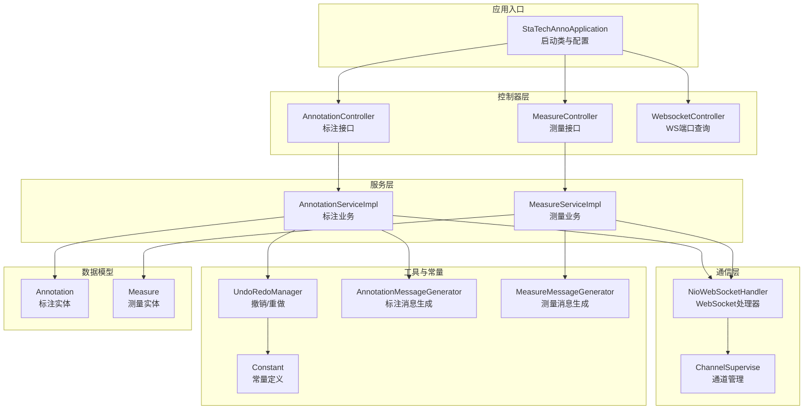
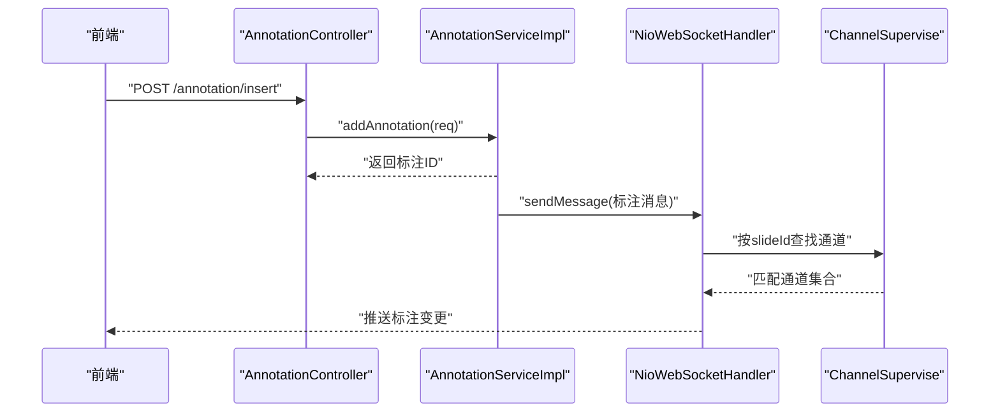
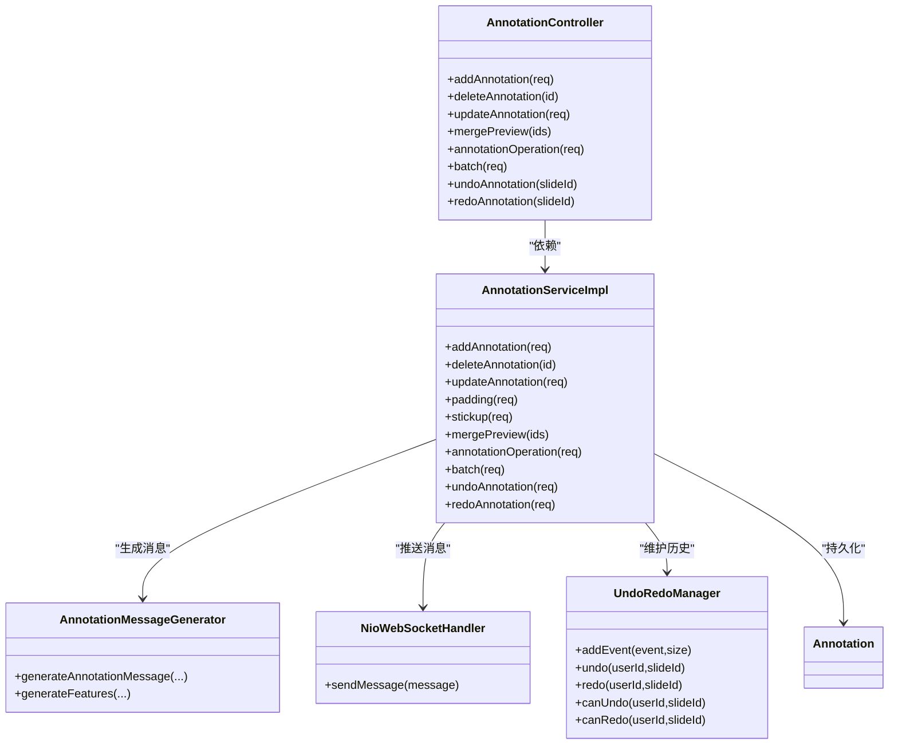
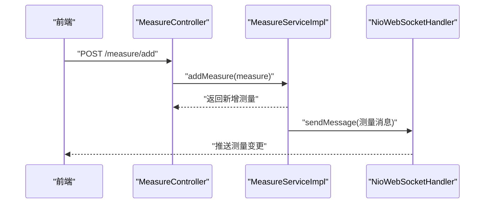
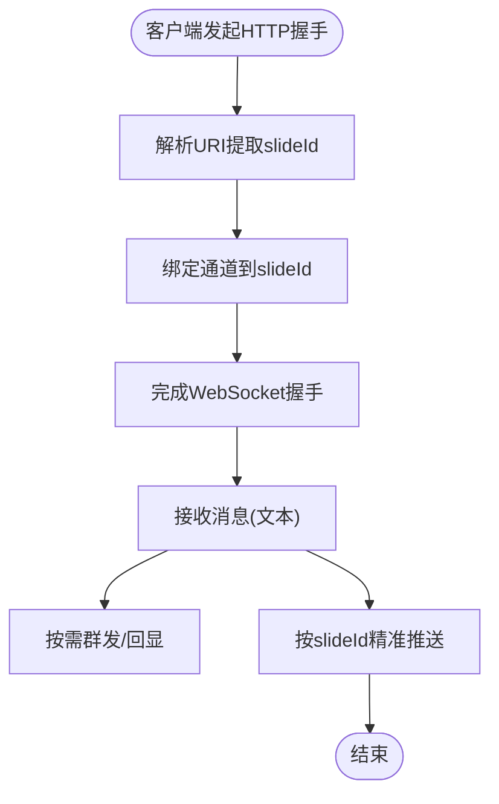
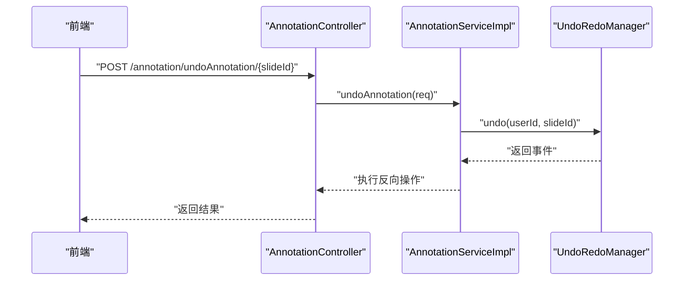
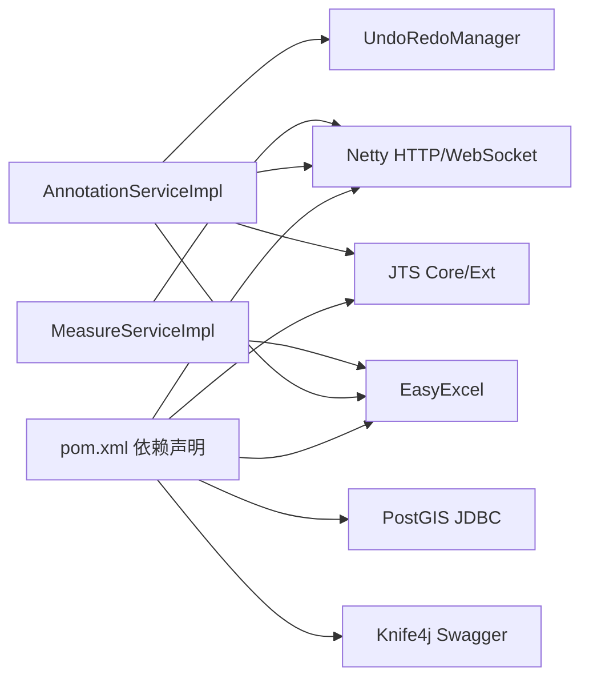

# 核心模块

<cite>
**本文引用的文件**
- [StaTechAnnoApplication.java](file://src/main/java/cn/staitech/annotation/StaTechAnnoApplication.java)
- [AnnotationController.java](file://src/main/java/cn/staitech/annotation/controller/AnnotationController.java)
- [MeasureController.java](file://src/main/java/cn/staitech/annotation/controller/MeasureController.java)
- [WebsocketController.java](file://src/main/java/cn/staitech/annotation/controller/WebsocketController.java)
- [AnnotationServiceImpl.java](file://src/main/java/cn/staitech/annotation/service/impl/AnnotationServiceImpl.java)
- [MeasureServiceImpl.java](file://src/main/java/cn/staitech/annotation/service/impl/MeasureServiceImpl.java)
- [NioWebSocketHandler.java](file://src/main/java/cn/staitech/annotation/netty/websocket/NioWebSocketHandler.java)
- [UndoRedoManager.java](file://src/main/java/cn/staitech/annotation/utils/annotation/UndoRedoManager.java)
- [AnnotationMessageGenerator.java](file://src/main/java/cn/staitech/annotation/utils/annotation/AnnotationMessageGenerator.java)
- [MeasureMessageGenerator.java](file://src/main/java/cn/staitech/annotation/utils/measure/MeasureMessageGenerator.java)
- [Annotation.java](file://src/main/java/cn/staitech/annotation/domain/Annotation.java)
- [Measure.java](file://src/main/java/cn/staitech/annotation/domain/Measure.java)
- [ChannelSupervise.java](file://src/main/java/cn/staitech/annotation/netty/global/ChannelSupervise.java)
- [Constant.java](file://src/main/java/cn/staitech/annotation/constant/Constant.java)
- [bootstrap.yml](file://src/main/resources/bootstrap.yml)
- [pom.xml](file://pom.xml)
</cite>

## 目录
1. [简介](#简介)
2. [项目结构](#项目结构)
3. [核心组件](#核心组件)
4. [架构总览](#架构总览)
5. [详细组件分析](#详细组件分析)
6. [依赖分析](#依赖分析)
7. [性能考虑](#性能考虑)
8. [故障排查指南](#故障排查指南)
9. [结论](#结论)
10. [附录](#附录)

## 简介
本文件面向医学图像标注系统的核心模块，围绕标注管理、实时通信、撤销与重做、几何测量四大主题，系统阐述设计理念、实现方式与模块间交互关系。文档既提供高层架构视图，也给出代码级的类图与流程图，帮助初学者快速建立概念理解，同时为有经验的开发者提供深入的技术细节与最佳实践建议。

## 项目结构
系统采用标准的 Spring Boot 分层架构，主要模块包括：
- 控制器层：提供 HTTP 接口，分别处理标注与测量的 CRUD、批量操作、撤销/重做、Websocket 端口查询等。
- 服务层：封装业务逻辑，负责几何运算、标签映射、远程调用、事务控制与消息推送。
- 数据模型层：标注与测量实体，承载几何字段与元数据。
- Netty 实时通信：基于 WebSocket 的消息广播与按切片分发。
- 工具与常量：消息生成器、撤销/重做管理器、常量定义等。

图表来源
- [StaTechAnnoApplication.java:34-50](file://src/main/java/cn/staitech/annotation/StaTechAnnoApplication.java#L34-L50)
- [AnnotationController.java:43-251](file://src/main/java/cn/staitech/annotation/controller/AnnotationController.java#L43-L251)
- [MeasureController.java:36-118](file://src/main/java/cn/staitech/annotation/controller/MeasureController.java#L36-L118)
- [WebsocketController.java:21-41](file://src/main/java/cn/staitech/annotation/controller/WebsocketController.java#L21-L41)
- [AnnotationServiceImpl.java:46-724](file://src/main/java/cn/staitech/annotation/service/impl/AnnotationServiceImpl.java#L46-L724)
- [MeasureServiceImpl.java:49-161](file://src/main/java/cn/staitech/annotation/service/impl/MeasureServiceImpl.java#L49-L161)
- [NioWebSocketHandler.java:29-197](file://src/main/java/cn/staitech/annotation/netty/websocket/NioWebSocketHandler.java#L29-L197)
- [ChannelSupervise.java:17-45](file://src/main/java/cn/staitech/annotation/netty/global/ChannelSupervise.java#L17-L45)
- [UndoRedoManager.java:19-97](file://src/main/java/cn/staitech/annotation/utils/annotation/UndoRedoManager.java#L19-L97)
- [AnnotationMessageGenerator.java:38-349](file://src/main/java/cn/staitech/annotation/utils/annotation/AnnotationMessageGenerator.java#L38-L349)
- [MeasureMessageGenerator.java:28-128](file://src/main/java/cn/staitech/annotation/utils/measure/MeasureMessageGenerator.java#L28-L128)
- [Annotation.java:23-187](file://src/main/java/cn/staitech/annotation/domain/Annotation.java#L23-L187)
- [Measure.java:20-256](file://src/main/java/cn/staitech/annotation/domain/Measure.java#L20-L256)
- [Constant.java:9-80](file://src/main/java/cn/staitech/annotation/constant/Constant.java#L9-L80)

章节来源
- [StaTechAnnoApplication.java:34-50](file://src/main/java/cn/staitech/annotation/StaTechAnnoApplication.java#L34-L50)
- [bootstrap.yml:1-42](file://src/main/resources/bootstrap.yml#L1-L42)

## 核心组件
- 标注管理模块：提供标注的增删改、填充轮廓、复制粘贴、轮廓合并预览、几何运算、批量操作与撤销/重做。
- 几何测量模块：提供测量的增删、分页查询、GeoJSON 导出、截图占位接口。
- 实时通信模块：基于 Netty 的 WebSocket 服务器，按切片分发标注与测量变更。
- 撤销重做模块：按用户与切片维度维护可序列化的事件栈，支持定时清理。

章节来源
- [AnnotationController.java:43-251](file://src/main/java/cn/staitech/annotation/controller/AnnotationController.java#L43-L251)
- [MeasureController.java:36-118](file://src/main/java/cn/staitech/annotation/controller/MeasureController.java#L36-L118)
- [WebsocketController.java:21-41](file://src/main/java/cn/staitech/annotation/controller/WebsocketController.java#L21-L41)
- [AnnotationServiceImpl.java:46-724](file://src/main/java/cn/staitech/annotation/service/impl/AnnotationServiceImpl.java#L46-L724)
- [MeasureServiceImpl.java:49-161](file://src/main/java/cn/staitech/annotation/service/impl/MeasureServiceImpl.java#L49-L161)
- [NioWebSocketHandler.java:29-197](file://src/main/java/cn/staitech/annotation/netty/websocket/NioWebSocketHandler.java#L29-L197)
- [UndoRedoManager.java:19-97](file://src/main/java/cn/staitech/annotation/utils/annotation/UndoRedoManager.java#L19-L97)

## 架构总览
系统通过控制器暴露 REST 接口，服务层完成业务处理与几何计算，消息生成器将领域对象转换为前端可用的 GeoJSON Feature 结构，再由 WebSocket 处理器推送到对应切片的客户端。撤销/重做通过独立的内存栈管理，支持跨操作聚合与历史清理。

图表来源
- [AnnotationController.java:50-69](file://src/main/java/cn/staitech/annotation/controller/AnnotationController.java#L50-L69)
- [AnnotationServiceImpl.java:184-238](file://src/main/java/cn/staitech/annotation/service/impl/AnnotationServiceImpl.java#L184-L238)
- [NioWebSocketHandler.java:38-68](file://src/main/java/cn/staitech/annotation/netty/websocket/NioWebSocketHandler.java#L38-L68)
- [ChannelSupervise.java:19-43](file://src/main/java/cn/staitech/annotation/netty/global/ChannelSupervise.java#L19-L43)

## 详细组件分析

### 标注管理系统
- 关键职责
  - 标注增删改：创建、更新、删除标注，维护面积/周长等派生字段。
  - 几何处理：距离计算、轮廓填充、合并预览、布尔运算（并集/差集）。
  - 操作复用：复制/粘贴、批量操作、按用户与切片维度的撤销/重做。
  - 标签映射：根据脏器/结构标签查询颜色与名称，生成属性。
- 数据模型
  - 标注实体包含几何字段、标签ID、轮廓类型、切片ID、创建/更新信息等。
- 通信集成
  - 每次变更通过消息生成器构造标注 Feature，经 WebSocket 推送至对应切片。
- 错误处理
  - 对无效参数、不存在的数据、几何不合法等情况抛出本地化错误信息。

图表来源
- [AnnotationController.java:43-251](file://src/main/java/cn/staitech/annotation/controller/AnnotationController.java#L43-L251)
- [AnnotationServiceImpl.java:46-724](file://src/main/java/cn/staitech/annotation/service/impl/AnnotationServiceImpl.java#L46-L724)
- [AnnotationMessageGenerator.java:38-349](file://src/main/java/cn/staitech/annotation/utils/annotation/AnnotationMessageGenerator.java#L38-L349)
- [NioWebSocketHandler.java:29-197](file://src/main/java/cn/staitech/annotation/netty/websocket/NioWebSocketHandler.java#L29-L197)
- [UndoRedoManager.java:19-97](file://src/main/java/cn/staitech/annotation/utils/annotation/UndoRedoManager.java#L19-L97)
- [Annotation.java:23-187](file://src/main/java/cn/staitech/annotation/domain/Annotation.java#L23-L187)

章节来源
- [AnnotationController.java:43-251](file://src/main/java/cn/staitech/annotation/controller/AnnotationController.java#L43-L251)
- [AnnotationServiceImpl.java:184-724](file://src/main/java/cn/staitech/annotation/service/impl/AnnotationServiceImpl.java#L184-L724)
- [Annotation.java:23-187](file://src/main/java/cn/staitech/annotation/domain/Annotation.java#L23-L187)
- [AnnotationMessageGenerator.java:38-349](file://src/main/java/cn/staitech/annotation/utils/annotation/AnnotationMessageGenerator.java#L38-L349)

### 几何测量系统
- 关键职责
  - 测量增删：校验几何合法性，生成唯一标识与序号，写入数据库。
  - 分页查询：支持按切片与名称模糊查询，统计点状测量数量。
  - 导出：生成 Excel 报表，按语言切换列名。
  - 截图：预留接口，便于后续扩展。
- 数据模型
  - 测量实体包含几何字段、测量名称、类型、距离与角度等指标。
- 通信集成
  - 新增/删除后通过测量消息生成器构造 Feature，经 WebSocket 推送。

图表来源
- [MeasureController.java:81-93](file://src/main/java/cn/staitech/annotation/controller/MeasureController.java#L81-L93)
- [MeasureServiceImpl.java:59-81](file://src/main/java/cn/staitech/annotation/service/impl/MeasureServiceImpl.java#L59-L81)
- [MeasureMessageGenerator.java:28-128](file://src/main/java/cn/staitech/annotation/utils/measure/MeasureMessageGenerator.java#L28-L128)
- [NioWebSocketHandler.java:29-197](file://src/main/java/cn/staitech/annotation/netty/websocket/NioWebSocketHandler.java#L29-L197)

章节来源
- [MeasureController.java:36-118](file://src/main/java/cn/staitech/annotation/controller/MeasureController.java#L36-L118)
- [MeasureServiceImpl.java:49-161](file://src/main/java/cn/staitech/annotation/service/impl/MeasureServiceImpl.java#L49-L161)
- [Measure.java:20-256](file://src/main/java/cn/staitech/annotation/domain/Measure.java#L20-L256)
- [MeasureMessageGenerator.java:28-128](file://src/main/java/cn/staitech/annotation/utils/measure/MeasureMessageGenerator.java#L28-L128)

### 实时通信系统
- 设计要点
  - 基于 Netty 的 WebSocket 服务器，握手阶段根据 URI 提取切片ID并绑定通道。
  - 通道管理器维护“通道→切片ID”的映射，支持按切片精准推送。
  - 支持群发与心跳（Ping/Pong），保证连接稳定性。
- 使用模式
  - 控制器通过 WebSocket 端口查询接口获取 WS 地址，前端按 /slide/{slideId} 建立连接。
  - 服务层在标注/测量变更后统一调用消息发送方法。

图表来源
- [NioWebSocketHandler.java:167-194](file://src/main/java/cn/staitech/annotation/netty/websocket/NioWebSocketHandler.java#L167-L194)
- [ChannelSupervise.java:19-43](file://src/main/java/cn/staitech/annotation/netty/global/ChannelSupervise.java#L19-L43)
- [WebsocketController.java:21-41](file://src/main/java/cn/staitech/annotation/controller/WebsocketController.java#L21-L41)

章节来源
- [NioWebSocketHandler.java:29-197](file://src/main/java/cn/staitech/annotation/netty/websocket/NioWebSocketHandler.java#L29-L197)
- [ChannelSupervise.java:17-45](file://src/main/java/cn/staitech/annotation/netty/global/ChannelSupervise.java#L17-L45)
- [WebsocketController.java:21-41](file://src/main/java/cn/staitech/annotation/controller/WebsocketController.java#L21-L41)

### 撤销重做系统
- 设计理念
  - 以“事件”为单位记录操作历史，支持按用户与切片维度隔离。
  - 事件聚合：批量操作会聚合成一个事件，便于一次性撤销/重做。
  - 定时清理：每日凌晨清空历史，避免内存膨胀。
- 关键接口
  - addEvent(event, size)：添加最新事件并限制历史长度。
  - undo(userId, slideId)/redo(userId, slideId)：执行一次撤销/重做。
  - canUndo/canRedo：查询可执行状态。
  - clearForUserAndSlide：手动清理指定用户与切片的历史。
- 与标注服务的协作
  - 标注服务在每次增删改时生成 UndoRedoDetail，并在撤销/重做时反向执行。

图表来源
- [AnnotationController.java:226-236](file://src/main/java/cn/staitech/annotation/controller/AnnotationController.java#L226-L236)
- [AnnotationServiceImpl.java:677-717](file://src/main/java/cn/staitech/annotation/service/impl/AnnotationServiceImpl.java#L677-L717)
- [UndoRedoManager.java:42-61](file://src/main/java/cn/staitech/annotation/utils/annotation/UndoRedoManager.java#L42-L61)

章节来源
- [UndoRedoManager.java:19-97](file://src/main/java/cn/staitech/annotation/utils/annotation/UndoRedoManager.java#L19-L97)
- [AnnotationServiceImpl.java:625-717](file://src/main/java/cn/staitech/annotation/service/impl/AnnotationServiceImpl.java#L625-L717)

## 依赖分析
- 外部依赖
  - Netty：WebSocket 通信。
  - JTS：几何计算与布尔运算。
  - EasyExcel：测量导出。
  - PostGIS JDBC：地理空间数据支持。
- 内部模块耦合
  - 控制器仅依赖服务接口，降低耦合度。
  - 服务层通过消息生成器与 WebSocket 解耦通信细节。
  - 撤销/重做管理器独立于业务，通过事件聚合实现通用能力。

图表来源
- [pom.xml:82-133](file://pom.xml#L82-L133)
- [AnnotationServiceImpl.java:46-724](file://src/main/java/cn/staitech/annotation/service/impl/AnnotationServiceImpl.java#L46-L724)
- [MeasureServiceImpl.java:49-161](file://src/main/java/cn/staitech/annotation/service/impl/MeasureServiceImpl.java#L49-L161)
- [UndoRedoManager.java:19-97](file://src/main/java/cn/staitech/annotation/utils/annotation/UndoRedoManager.java#L19-L97)

章节来源
- [pom.xml:19-134](file://pom.xml#L19-L134)

## 性能考虑
- 几何计算
  - 采样点策略用于平均距离计算，需平衡精度与性能；建议在大规模几何场景下限制采样数量或采用空间索引预筛选。
- 批量操作
  - 批量接口会将多个子操作聚合为单一事件，减少历史栈压力；但单次批量可能产生大量几何运算，建议前端分批提交。
- WebSocket 推送
  - 按切片分发避免全量广播，提升效率；注意通道数量增长带来的内存占用。
- 撤销/重做
  - 历史栈大小受控于常量配置；建议结合业务场景调整容量，避免频繁 GC 或内存溢出。

## 故障排查指南
- 常见问题定位
  - “未找到标注数据”：检查请求参数与数据库一致性，确认几何字段非空且有效。
  - “几何不合法”：确保输入几何满足简单性与拓扑规则。
  - “撤销/重做不可用”：确认当前用户与切片维度是否存在历史记录，或是否已被定时清理。
- 日志与审计
  - 控制器层使用日志审计注解，便于追踪关键操作；服务层对异常进行本地化消息包装。
- 通信问题
  - 握手失败：检查请求头 Upgrade 字段与 WS 地址；确认端口配置正确。
  - 无法按切片推送：核对通道绑定与 slideId 匹配情况。

章节来源
- [AnnotationServiceImpl.java:122-138](file://src/main/java/cn/staitech/annotation/service/impl/AnnotationServiceImpl.java#L122-L138)
- [MeasureServiceImpl.java:63-65](file://src/main/java/cn/staitech/annotation/service/impl/MeasureServiceImpl.java#L63-L65)
- [NioWebSocketHandler.java:167-194](file://src/main/java/cn/staitech/annotation/netty/websocket/NioWebSocketHandler.java#L167-L194)
- [UndoRedoManager.java:88-94](file://src/main/java/cn/staitech/annotation/utils/annotation/UndoRedoManager.java#L88-L94)

## 结论
该系统通过清晰的分层设计与模块化实现，将标注、测量、通信与撤销/重做有机结合。标注服务承担几何计算与标签映射，测量服务专注指标与报表，WebSocket 提供低延迟的增量推送，撤销/重做机制保障操作安全与可恢复性。建议在生产环境中结合业务规模优化几何采样策略与历史栈容量，并持续监控 WebSocket 连接与导出性能。

## 附录
- 关键接口一览
  - 标注管理
    - POST /annotation/insert：新增标注
    - POST /annotation/delete：删除标注
    - POST /annotation/update：更新标注
    - POST /annotation/padding：填充轮廓
    - POST /annotation/stickup：复制/粘贴
    - POST /annotation/mergePreview：合并预览
    - POST /annotation/updateOperation：几何运算
    - POST /annotation/batch：批量操作
    - POST /annotation/undoAnnotation/{slideId}：撤销
    - POST /annotation/redoAnnotation/{slideId}：重做
    - POST /annotation/checkUndoAndRedoStatus/{slideId}：检查状态
  - 测量管理
    - POST /measure/page：分页查询
    - GET /measure/getDataList：获取 GeoJSON
    - POST /measure/add：新增测量
    - POST /measure/del：删除测量
    - POST /measure/export：导出 Excel
    - POST /measure/screenshot：截图
  - 实时通信
    - GET /websocket/getWebsocketPort：获取 WS 端口
- 配置项参考
  - 服务端口：server.port（bootstrap.yml）
  - 国际化：spring.messages.basename（bootstrap.yml）
  - Nacos 注册与配置：spring.cloud.nacos.*（bootstrap.yml）

章节来源
- [AnnotationController.java:50-251](file://src/main/java/cn/staitech/annotation/controller/AnnotationController.java#L50-L251)
- [MeasureController.java:41-118](file://src/main/java/cn/staitech/annotation/controller/MeasureController.java#L41-L118)
- [WebsocketController.java:27-37](file://src/main/java/cn/staitech/annotation/controller/WebsocketController.java#L27-L37)
- [bootstrap.yml:1-42](file://src/main/resources/bootstrap.yml#L1-L42)