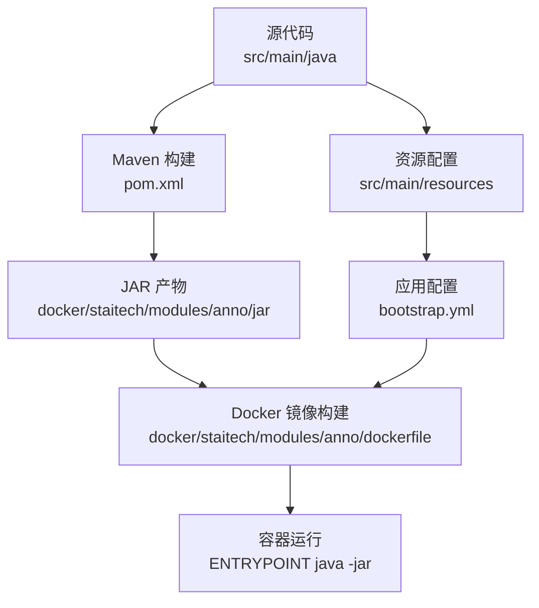
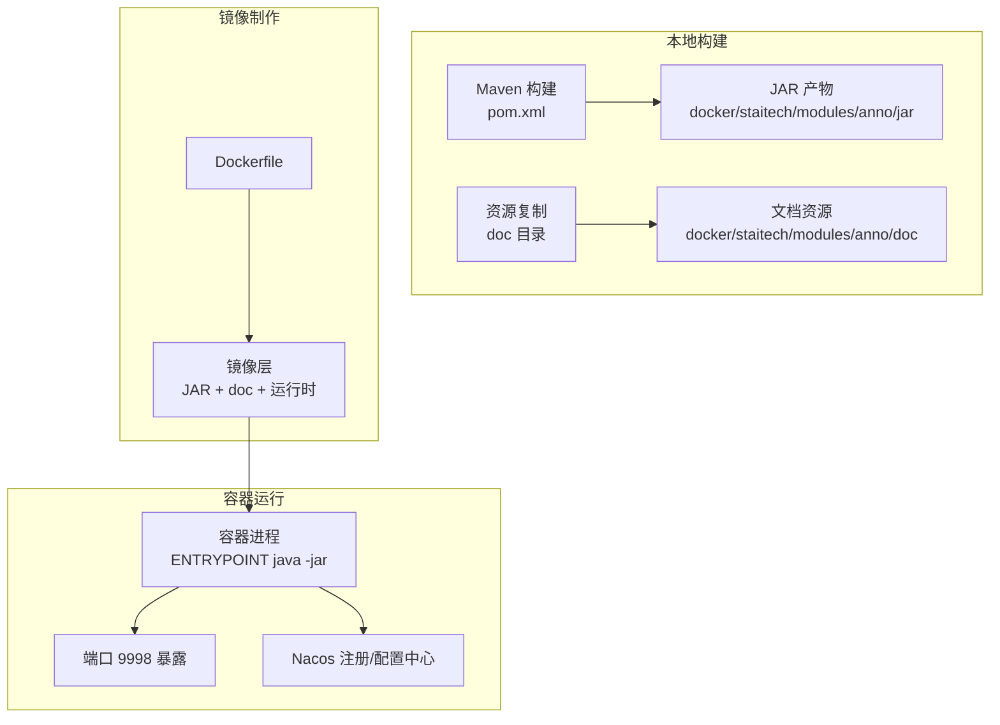
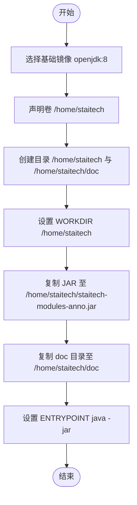
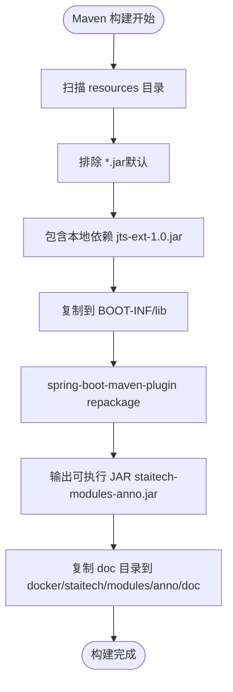
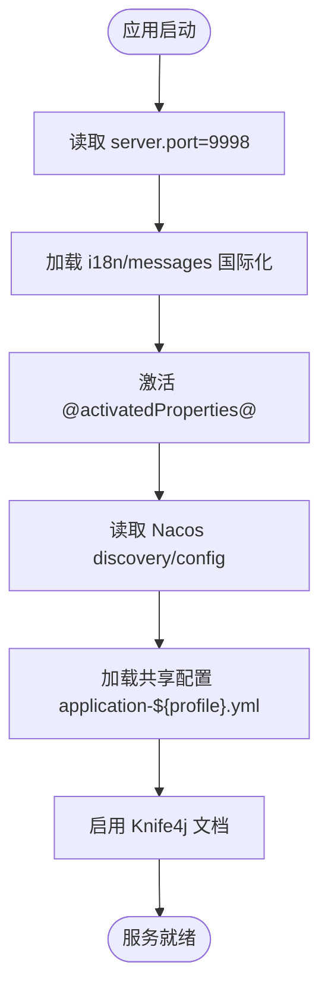
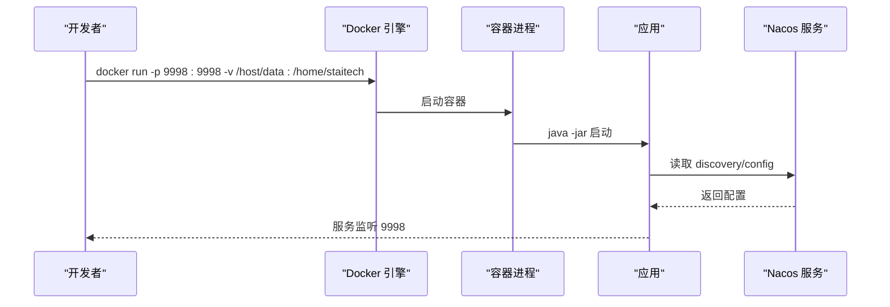
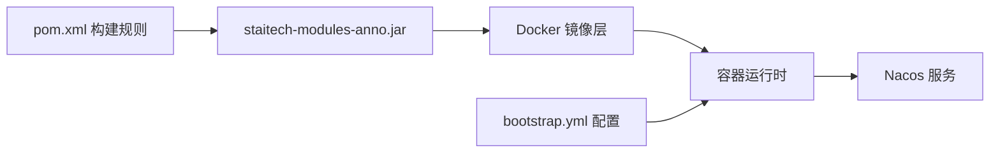

# 容器化部署

<cite>
**本文引用的文件**
- [dockerfile](file://docker/staitech/modules/anno/dockerfile)
- [pom.xml](file://pom.xml)
- [bootstrap.yml](file://src/main/resources/bootstrap.yml)
- [StaTechAnnoApplication.java](file://src/main/java/cn/staitech/annotation/StaTechAnnoApplication.java)
- [README.md](file://README.md)
</cite>

## 目录
1. [简介](#简介)
2. [项目结构](#项目结构)
3. [核心组件](#核心组件)
4. [架构总览](#架构总览)
5. [详细组件分析](#详细组件分析)
6. [依赖关系分析](#依赖关系分析)
7. [性能与资源建议](#性能与资源建议)
8. [故障排查指南](#故障排查指南)
9. [结论](#结论)
10. [附录](#附录)

## 简介
本文件面向医学图像标注系统（注释模块）的容器化部署与运维，围绕现有 Dockerfile、Maven 打包配置、Spring Boot 引导配置展开，帮助开发者完成从本地开发到生产编排的全链路落地。内容涵盖：
- Dockerfile 构建流程与镜像设计
- JAR 包打包策略与文档资源复制
- 容器运行参数、端口映射与数据卷挂载最佳实践
- 本地开发与生产编排建议

## 项目结构
该模块采用标准 Spring Boot 工程结构，容器化相关的关键位置如下：
- Dockerfile：位于 docker/staitech/modules/anno/dockerfile
- 打包产物：目标 JAR 位于 docker/staitech/modules/anno/jar 下（由 Maven 构建生成）
- 文档资源：位于 docker/staitech/modules/anno/doc 下
- 应用引导：StaTechAnnoApplication.java
- 运行配置：bootstrap.yml（含端口、Nacos 注册与配置中心）

**图表来源**
- [dockerfile:1-22](file://docker/staitech/modules/anno/dockerfile#L1-L22)
- [pom.xml:172-223](file://pom.xml#L172-L223)
- [bootstrap.yml:1-42](file://src/main/resources/bootstrap.yml#L1-L42)

**章节来源**
- [dockerfile:1-22](file://docker/staitech/modules/anno/dockerfile#L1-L22)
- [pom.xml:172-223](file://pom.xml#L172-L223)
- [bootstrap.yml:1-42](file://src/main/resources/bootstrap.yml#L1-L42)

## 核心组件
- Dockerfile 负责基础镜像选择、工作目录与卷挂载、JAR 与文档资源复制、以及启动入口定义。
- Maven 构建负责打包可执行 JAR，并将必要的本地依赖复制到 BOOT-INF/lib。
- Spring Boot 引导配置负责端口、国际化、Nacos 注册与配置中心、共享配置等。

**章节来源**
- [dockerfile:1-22](file://docker/staitech/modules/anno/dockerfile#L1-L22)
- [pom.xml:172-223](file://pom.xml#L172-L223)
- [bootstrap.yml:1-42](file://src/main/resources/bootstrap.yml#L1-L42)
- [StaTechAnnoApplication.java:1-51](file://src/main/java/cn/staitech/annotation/StaTechAnnoApplication.java#L1-L51)

## 架构总览
下图展示容器化部署的端到端视图：本地构建 JAR → 制作镜像 → 运行容器 → 通过端口暴露服务与配置中心对接。

**图表来源**
- [dockerfile:1-22](file://docker/staitech/modules/anno/dockerfile#L1-L22)
- [pom.xml:172-223](file://pom.xml#L172-L223)
- [bootstrap.yml:1-42](file://src/main/resources/bootstrap.yml#L1-L42)

## 详细组件分析

### Dockerfile 构建流程与镜像设计
- 基础镜像：使用 openjdk:8（精简运行时），避免引入额外图形或桌面组件。
- 卷挂载：声明 /home/staitech 为持久卷，便于挂载外部数据或日志目录。
- 目录结构：创建工作目录并预建 doc 子目录，确保文档资源可被复制。
- 工作目录：切换至 /home/staitech，保证后续 COPY 与 ENTRYPOINT 的一致性。
- 文件复制：将 JAR 与 doc 目录复制到镜像内。
- 启动命令：ENTRYPOINT 使用 java -jar 直接启动应用。

**图表来源**
- [dockerfile:1-22](file://docker/staitech/modules/anno/dockerfile#L1-L22)

**章节来源**
- [dockerfile:1-22](file://docker/staitech/modules/anno/dockerfile#L1-L22)

### JAR 包打包流程与资源复制策略
- 产物命名：最终 JAR 名称为 staitech-modules-anno（由 Maven 插件配置 finalName 决定）。
- 资源过滤：默认排除 JAR，但显式包含 src/main/resources/lib 下的 jts-ext-1.0.jar 并复制到 BOOT-INF/lib，确保运行时可用。
- 打包插件：spring-boot-maven-plugin 使用 ZIP 布局并包含 system 作用域依赖，repackage 目标生成可执行 JAR。
- 文档复制：构建后将 doc 目录复制到 docker/staitech/modules/anno/doc，供 Dockerfile 在镜像构建阶段复制。

**图表来源**
- [pom.xml:172-223](file://pom.xml#L172-L223)

**章节来源**
- [pom.xml:172-223](file://pom.xml#L172-L223)

### Spring Boot 引导配置与运行参数
- 服务器端口：默认 9998（可在运行时通过环境变量覆盖）。
- 国际化：i18n/messages，UTF-8 编码，缓存秒数 3600。
- 应用名称：staitech-anno。
- 激活配置：@activatedProperties@（由 Maven Profile 注入）。
- Nacos 发现与配置：server-addr、namespace、group 由 Profile 注入；共享配置 application-${spring.profiles.active}.yml。
- Knife4j：启用在线文档。

**图表来源**
- [bootstrap.yml:1-42](file://src/main/resources/bootstrap.yml#L1-L42)

**章节来源**
- [bootstrap.yml:1-42](file://src/main/resources/bootstrap.yml#L1-L42)
- [StaTechAnnoApplication.java:1-51](file://src/main/java/cn/staitech/annotation/StaTechAnnoApplication.java#L1-L51)

### 容器运行参数、端口映射与数据卷挂载
- 端口映射：容器暴露 9998，建议在 docker run 或编排时映射到宿主机非特权端口（如 9998:9998）。
- 数据卷挂载：/home/staitech 为卷挂载点，可挂载外部日志、配置或数据目录以实现持久化与热更新。
- 环境变量：可通过 -e 覆盖 spring.profiles.active、Nacos 地址与命名空间等（由 Profile 注入）。
- 网络与服务发现：容器需能访问 Nacos 与后端依赖服务（如数据库、缓存等）。

**图表来源**
- [dockerfile:1-22](file://docker/staitech/modules/anno/dockerfile#L1-L22)
- [bootstrap.yml:1-42](file://src/main/resources/bootstrap.yml#L1-L42)

**章节来源**
- [dockerfile:1-22](file://docker/staitech/modules/anno/dockerfile#L1-L22)
- [bootstrap.yml:1-42](file://src/main/resources/bootstrap.yml#L1-L42)

### 本地开发与生产编排建议
- 本地开发
  - 使用 Docker Compose 将应用容器与 Nacos、数据库、消息队列等服务编排在一起，便于快速联调。
  - 将 /home/staitech 映射到本地目录，便于查看日志与临时修改配置。
- 生产编排
  - 使用 Kubernetes Deployment/Service 管理副本与暴露服务。
  - 通过 ConfigMap/Secret 注入 Nacos 地址、命名空间与分组信息。
  - 使用 PersistentVolumeClaim 挂载日志与审计数据目录，确保高可用与可恢复性。

[本节为通用实践建议，不直接分析具体文件，故无“章节来源”]

## 依赖关系分析
- 构建期依赖：Maven 插件与资源过滤规则决定 JAR 结构与运行时依赖。
- 运行期依赖：应用通过 Nacos 进行服务注册与配置拉取，依赖网络可达性。
- 容器期依赖：镜像内仅包含运行时所需 JRE 与应用 JAR，减少攻击面。

**图表来源**
- [pom.xml:172-223](file://pom.xml#L172-L223)
- [dockerfile:1-22](file://docker/staitech/modules/anno/dockerfile#L1-L22)
- [bootstrap.yml:1-42](file://src/main/resources/bootstrap.yml#L1-L42)

**章节来源**
- [pom.xml:172-223](file://pom.xml#L172-L223)
- [bootstrap.yml:1-42](file://src/main/resources/bootstrap.yml#L1-L42)

## 性能与资源建议
- JVM 参数：在生产环境可通过 JAVA_OPTS 或 JVM 配置调整堆大小与 GC 策略，结合容器资源限制进行配额规划。
- 端口与并发：9998 为应用端口，建议配合网关或反向代理统一入口，合理设置连接数与超时时间。
- 日志与审计：将日志输出到 stdout/stderr，结合容器日志收集系统集中管理；必要时将审计数据目录持久化。

[本节为通用建议，不直接分析具体文件，故无“章节来源”]

## 故障排查指南
- 端口占用
  - 现象：容器启动后无法访问 9998。
  - 排查：确认宿主机端口未被占用，或调整映射端口。
- Nacos 连接失败
  - 现象：应用启动时报 Nacos 连接异常。
  - 排查：确认容器网络可达 Nacos 地址与端口，检查命名空间与分组配置是否正确。
- 配置未生效
  - 现象：国际化或功能开关未按预期。
  - 排查：确认 spring.profiles.active 与共享配置文件名一致，检查 Nacos 中对应配置项。
- 权限与卷挂载
  - 现象：日志或审计数据无法写入。
  - 排查：确认 /home/staitech 可写权限，检查宿主机目录权限与 SELinux/AppArmor 设置。

**章节来源**
- [bootstrap.yml:1-42](file://src/main/resources/bootstrap.yml#L1-L42)
- [README.md:1-95](file://README.md#L1-L95)

## 结论
本容器化方案以最小镜像为基础，通过明确的目录结构与资源复制策略，实现了 JAR 与文档资源的一致交付。结合 Profile 注入的 Nacos 配置，可灵活适配不同环境。建议在生产环境中配合编排平台与日志/监控体系，确保稳定性与可观测性。

[本节为总结性内容，不直接分析具体文件，故无“章节来源”]

## 附录

### 容器构建与镜像管理指南
- 构建镜像
  - 在仓库根目录执行构建，确保 docker/staitech/modules/anno/jar 与 docker/staitech/modules/anno/doc 已存在。
  - 使用 docker build -t <镜像名>:<标签> -f docker/staitech/modules/anno/dockerfile .
- 镜像管理
  - 查看镜像：docker images
  - 删除镜像：docker rmi <镜像ID>
  - 清理悬空镜像：docker image prune

**章节来源**
- [dockerfile:1-22](file://docker/staitech/modules/anno/dockerfile#L1-L22)

### 容器运行参数与最佳实践
- 基本运行
  - docker run -d --name anno-app -p 9998:9998 -v /host/log:/home/staitech <镜像名>:<标签>
- 环境变量覆盖
  - -e spring.profiles.active=pacmvsdev
  - -e nacos.server-addr=192.168.x.x:8848
- 数据卷与持久化
  - 将日志、审计、配置等目录映射到宿主机，确保容器重建后数据不丢失。

**章节来源**
- [dockerfile:1-22](file://docker/staitech/modules/anno/dockerfile#L1-L22)
- [bootstrap.yml:1-42](file://src/main/resources/bootstrap.yml#L1-L42)

### 本地开发与生产编排要点
- 开发环境
  - 使用 Docker Compose 将应用与 Nacos、数据库、消息队列等服务组合，便于联调。
- 生产环境
  - 使用 Kubernetes 管理应用生命周期，结合 ConfigMap/Secret 注入配置，使用 PVC 持久化日志与审计数据。

[本节为通用实践建议，不直接分析具体文件，故无“章节来源”]