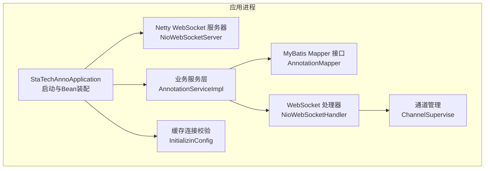
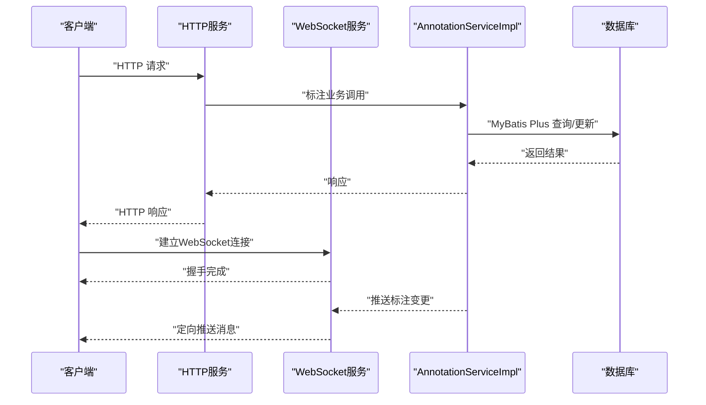
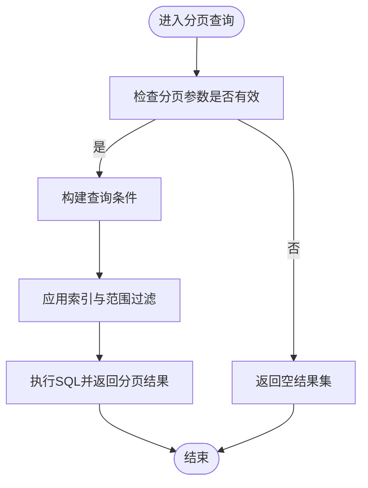
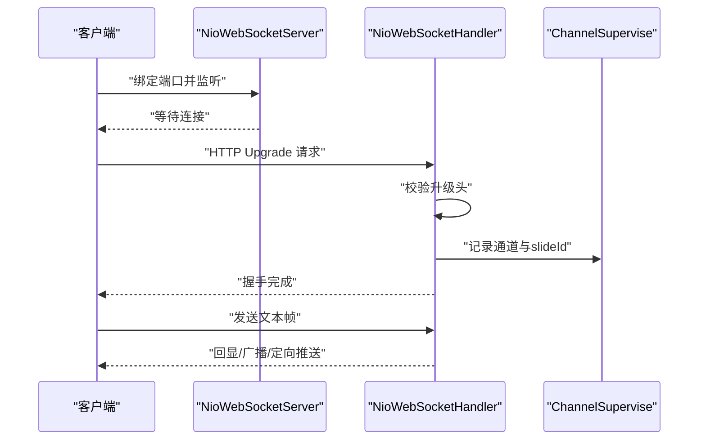
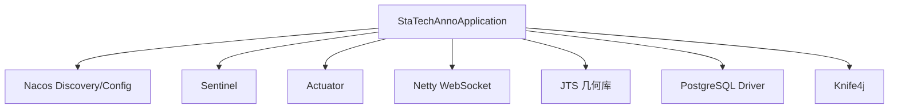

# 性能优化

<cite>
**本文引用的文件**
- [StaTechAnnoApplication.java](file://src/main/java/cn/staitech/annotation/StaTechAnnoApplication.java)
- [bootstrap.yml](file://src/main/resources/bootstrap.yml)
- [pom.xml](file://pom.xml)
- [InitializinConfig.java](file://src/main/java/cn/staitech/annotation/config/InitializinConfig.java)
- [NioWebSocketServer.java](file://src/main/java/cn/staitech/annotation/netty/websocket/NioWebSocketServer.java)
- [NioWebSocketHandler.java](file://src/main/java/cn/staitech/annotation/netty/websocket/NioWebSocketHandler.java)
- [ChannelSupervise.java](file://src/main/java/cn/staitech/annotation/netty/global/ChannelSupervise.java)
- [WebsocketController.java](file://src/main/java/cn/staitech/annotation/controller/WebsocketController.java)
- [AnnotationServiceImpl.java](file://src/main/java/cn/staitech/annotation/service/impl/AnnotationServiceImpl.java)
- [AnnotationMapper.java](file://src/main/java/cn/staitech/annotation/mapper/AnnotationMapper.java)
- [AnnotationMapper.xml](file://src/main/resources/mapper/AnnotationMapper.xml)
- [UndoRedoManager.java](file://src/main/java/cn/staitech/annotation/utils/annotation/UndoRedoManager.java)
</cite>

## 目录
1. [引言](#引言)
2. [项目结构](#项目结构)
3. [核心组件](#核心组件)
4. [架构总览](#架构总览)
5. [详细组件分析](#详细组件分析)
6. [依赖分析](#依赖分析)
7. [性能考虑](#性能考虑)
8. [故障排查指南](#故障排查指南)
9. [结论](#结论)
10. [附录](#附录)

## 引言
本文件面向医学图像标注系统的性能优化目标，围绕应用启动性能、数据库查询优化与WebSocket连接性能展开，结合代码实现细节，给出MyBatis Plus分页插件配置与优化策略、JVM参数调优、线程池配置、缓存策略、网络延迟优化、并发控制与资源利用率提升的具体方案，并提供性能测试方法、瓶颈识别工具与优化效果评估指标，以及高并发场景下的扩容与负载均衡建议。

## 项目结构
系统采用Spring Boot + Netty 的架构组合：
- 启动入口与MyBatis Plus分页拦截器配置位于应用主类
- WebSocket服务由Netty独立启动，与HTTP服务分离
- 业务层通过MyBatis Plus访问数据库，部分几何计算使用JTS库
- 缓存通过Redis连接工厂配置启用连接校验

**图表来源**
- [StaTechAnnoApplication.java:44-49](file://src/main/java/cn/staitech/annotation/StaTechAnnoApplication.java#L44-L49)
- [NioWebSocketServer.java:14-41](file://src/main/java/cn/staitech/annotation/netty/websocket/NioWebSocketServer.java#L14-L41)
- [AnnotationServiceImpl.java:46-60](file://src/main/java/cn/staitech/annotation/service/impl/AnnotationServiceImpl.java#L46-L60)
- [AnnotationMapper.java:12-14](file://src/main/java/cn/staitech/annotation/mapper/AnnotationMapper.java#L12-L14)
- [NioWebSocketHandler.java:29-68](file://src/main/java/cn/staitech/annotation/netty/websocket/NioWebSocketHandler.java#L29-L68)
- [ChannelSupervise.java:17-44](file://src/main/java/cn/staitech/annotation/netty/global/ChannelSupervise.java#L17-L44)
- [InitializinConfig.java:16-29](file://src/main/java/cn/staitech/annotation/config/InitializinConfig.java#L16-L29)

**章节来源**
- [StaTechAnnoApplication.java:34-49](file://src/main/java/cn/staitech/annotation/StaTechAnnoApplication.java#L34-L49)
- [bootstrap.yml:1-42](file://src/main/resources/bootstrap.yml#L1-L42)
- [pom.xml:19-134](file://pom.xml#L19-L134)

## 核心组件
- 启动与配置
  - 应用主类负责设置时区、开启异步、事务管理、Mapper扫描，并注册MyBatis Plus分页拦截器
  - 配置文件定义了HTTP端口、国际化缓存、Nacos注册与配置中心、Knife4j开关
- WebSocket子系统
  - Netty服务器独立启动，Boss/Work线程组分离；处理器负责握手、心跳、消息广播与按切片ID定向推送
  - 通道管理使用ConcurrentHashMap维护“Channel -> slideId”映射，支持定向推送
- 业务与数据访问
  - AnnotationServiceImpl封装标注增删改、几何运算、批量操作与撤销/重做
  - Mapper接口与XML文件定义基础CRUD，未见复杂SQL与索引配置
- 缓存与连接
  - Redis连接工厂在启动后启用连接校验，降低无效连接带来的抖动

**章节来源**
- [StaTechAnnoApplication.java:40-49](file://src/main/java/cn/staitech/annotation/StaTechAnnoApplication.java#L40-L49)
- [bootstrap.yml:2-41](file://src/main/resources/bootstrap.yml#L2-L41)
- [NioWebSocketServer.java:16-31](file://src/main/java/cn/staitech/annotation/netty/websocket/NioWebSocketServer.java#L16-L31)
- [NioWebSocketHandler.java:38-68](file://src/main/java/cn/staitech/annotation/netty/websocket/NioWebSocketHandler.java#L38-L68)
- [ChannelSupervise.java:19-43](file://src/main/java/cn/staitech/annotation/netty/global/ChannelSupervise.java#L19-L43)
- [AnnotationServiceImpl.java:46-60](file://src/main/java/cn/staitech/annotation/service/impl/AnnotationServiceImpl.java#L46-L60)
- [AnnotationMapper.java:12-14](file://src/main/java/cn/staitech/annotation/mapper/AnnotationMapper.java#L12-L14)
- [InitializinConfig.java:25-28](file://src/main/java/cn/staitech/annotation/config/InitializinConfig.java#L25-L28)

## 架构总览
系统采用“HTTP API + Netty WebSocket”的双通道架构，业务逻辑集中在Spring服务层，数据持久化通过MyBatis Plus访问数据库。WebSocket独立于HTTP端口，便于扩展与隔离。

**图表来源**
- [WebsocketController.java:24-37](file://src/main/java/cn/staitech/annotation/controller/WebsocketController.java#L24-L37)
- [NioWebSocketServer.java:20-31](file://src/main/java/cn/staitech/annotation/netty/websocket/NioWebSocketServer.java#L20-L31)
- [NioWebSocketHandler.java:167-194](file://src/main/java/cn/staitech/annotation/netty/websocket/NioWebSocketHandler.java#L167-L194)
- [AnnotationServiceImpl.java:236-237](file://src/main/java/cn/staitech/annotation/service/impl/AnnotationServiceImpl.java#L236-L237)

## 详细组件分析

### 启动与初始化性能
- 关键点
  - 设置默认时区，避免跨时区问题引发的额外计算
  - 注册MyBatis Plus分页拦截器，确保分页查询统一走拦截器
  - Netty服务器作为CommandLineRunner启动，避免阻塞主应用启动
  - Redis连接工厂启用连接校验，减少无效连接导致的异常重试
- 优化建议
  - 将Netty端口从配置读取改为外部注入，便于容器化部署与弹性扩缩容
  - 对静态资源与国际化缓存进行合理预热，缩短首次访问延迟
  - 启动阶段避免重IO与重CPU操作，必要时异步化

**章节来源**
- [StaTechAnnoApplication.java:40-49](file://src/main/java/cn/staitech/annotation/StaTechAnnoApplication.java#L40-L49)
- [NioWebSocketServer.java:16-31](file://src/main/java/cn/staitech/annotation/netty/websocket/NioWebSocketServer.java#L16-L31)
- [InitializinConfig.java:25-28](file://src/main/java/cn/staitech/annotation/config/InitializinConfig.java#L25-L28)

### 数据库查询优化与MyBatis Plus分页
- 当前实现
  - 分页拦截器已注册，但未见具体分页参数传递与SQL日志配置
  - Mapper接口为BaseMapper，XML中未声明SQL，查询依赖通用CRUD
- 优化策略
  - 显式传入分页参数，避免全表扫描
  - 为高频查询字段建立合适索引（如切片ID、标签ID、创建时间）
  - 开启SQL日志与慢查询监控，定位热点SQL
  - 对几何字段查询使用空间索引（PostGIS）与范围过滤
  - 批量写入使用批处理或存储过程，减少往返次数
- 复杂度与性能影响
  - 几何运算（DistanceOp、union、difference）属于O(n^2)或更高，需限制参与运算的几何数量或引入空间分区

**图表来源**
- [StaTechAnnoApplication.java:44-49](file://src/main/java/cn/staitech/annotation/StaTechAnnoApplication.java#L44-L49)
- [AnnotationMapper.java:12-14](file://src/main/java/cn/staitech/annotation/mapper/AnnotationMapper.java#L12-L14)
- [AnnotationMapper.xml:5-8](file://src/main/resources/mapper/AnnotationMapper.xml#L5-L8)

**章节来源**
- [AnnotationServiceImpl.java:508-519](file://src/main/java/cn/staitech/annotation/service/impl/AnnotationServiceImpl.java#L508-L519)
- [AnnotationServiceImpl.java:521-535](file://src/main/java/cn/staitech/annotation/service/impl/AnnotationServiceImpl.java#L521-L535)

### WebSocket连接性能与并发控制
- 当前实现
  - Boss/Work线程组分离，独立于HTTP容器
  - 处理器支持握手、心跳、文本帧处理与群发/定向推送
  - 通道管理使用ConcurrentHashMap，支持按slideId定向推送
- 优化策略
  - 调整Boss/Work线程数与事件循环队列容量，匹配CPU核数与并发连接数
  - 限制单连接消息速率与消息大小，防止内存峰值
  - 使用零拷贝缓冲与合适的ByteBuf池化策略
  - 定期清理无效连接，降低Map膨胀
- 并发与资源利用
  - 通道Map为线程安全，但遍历定向推送仍需注意锁竞争
  - 可考虑按slideId分桶，降低全局Map竞争

**图表来源**
- [NioWebSocketServer.java:20-31](file://src/main/java/cn/staitech/annotation/netty/websocket/NioWebSocketServer.java#L20-L31)
- [NioWebSocketHandler.java:167-194](file://src/main/java/cn/staitech/annotation/netty/websocket/NioWebSocketHandler.java#L167-L194)
- [ChannelSupervise.java:37-43](file://src/main/java/cn/staitech/annotation/netty/global/ChannelSupervise.java#L37-L43)

**章节来源**
- [NioWebSocketServer.java:20-41](file://src/main/java/cn/staitech/annotation/netty/websocket/NioWebSocketServer.java#L20-L41)
- [NioWebSocketHandler.java:38-68](file://src/main/java/cn/staitech/annotation/netty/websocket/NioWebSocketHandler.java#L38-L68)
- [ChannelSupervise.java:19-43](file://src/main/java/cn/staitech/annotation/netty/global/ChannelSupervise.java#L19-L43)

### 撤销/重做与内存占用控制
- 实现要点
  - 基于ConcurrentHashMap按“用户+切片”维度维护可序列化的撤销栈
  - 提供定时清理策略，避免长期运行内存膨胀
- 优化建议
  - 控制历史栈深度，结合业务场景设置最大容量
  - 对大对象序列化进行压缩或延迟序列化
  - 定期持久化热点状态，降低内存压力

**章节来源**
- [UndoRedoManager.java:21-94](file://src/main/java/cn/staitech/annotation/utils/annotation/UndoRedoManager.java#L21-L94)

## 依赖分析
- 外部依赖
  - Spring Cloud Alibaba Nacos（注册与配置）、Sentinel（流量治理）、Actuator（健康与指标）
  - Netty（WebSocket）、Knife4j（接口文档）、JTS（几何计算）、PostgreSQL（数据库驱动）
- 内部耦合
  - 业务层依赖WebSocket处理器进行消息推送
  - 服务层依赖远程业务服务与审计AOP，可能引入网络延迟

**图表来源**
- [pom.xml:20-134](file://pom.xml#L20-L134)

**章节来源**
- [pom.xml:20-134](file://pom.xml#L20-L134)

## 性能考虑

### JVM 参数调优（建议）
- 堆内存
  - 初始堆与最大堆按容器可用内存的70%-80%设置，预留GC与操作系统内存
- 垃圾收集
  - 生产推荐G1或ZGC，缩短STW时间；对长尾延迟敏感场景优先ZGC
- 线程与编译
  - 线程栈大小适中（典型1MB），避免过多轻量线程造成上下文切换
- 监控
  - 启用GC日志、JFR采样与JMX暴露，结合APM平台观测

### 线程池配置（建议）
- Netty线程池
  - Boss线程数=CPU核数，Work线程数=CPU核数×2，依据连接数与I/O密集度调整
  - 事件循环队列容量按峰值QPS与RT估算，避免频繁拒绝
- 应用线程池
  - 对远程调用与IO密集任务使用有界队列与饱和策略，防止OOM
  - 对CPU密集任务单独隔离，避免相互抢占

### 缓存策略（建议）
- Redis
  - 启用连接校验与健康检查，避免连接泄漏导致的超时
  - 对热点数据设置TTL与过期策略，避免无限增长
- 本地缓存
  - 对只读字典、标签元数据使用本地缓存，配合失效策略

### 网络延迟优化（建议）
- 连接复用
  - HTTP/2与Keep-Alive，减少握手开销
- 压缩
  - 对大JSON响应启用Gzip/Brotli压缩
- 传输优化
  - WebSocket使用二进制帧承载结构化消息，减少序列化成本

### 并发控制与资源利用率
- 限流与熔断
  - 借助Sentinel对热点接口与下游依赖进行限流与降级
- 并发模型
  - 采用事件驱动与异步非阻塞，避免阻塞式I/O
- 资源回收
  - 及时关闭通道与释放缓冲区，避免内存泄漏

### 性能测试方法与评估指标
- 压力测试
  - 使用JMeter/Locust模拟并发用户，覆盖标注增删改、批量操作与WebSocket推送
- 指标采集
  - RT（P50/P95/P99）、吞吐、错误率、GC停顿、堆外内存、连接数、队列长度
- 瓶颈识别
  - 结合火焰图、线程转储与数据库慢查询日志定位CPU、内存、I/O瓶颈
- 优化验证
  - 对比优化前后指标变化，确认分页、索引、线程池与缓存策略的效果

### 高并发扩容与负载均衡
- 扩容策略
  - 无状态服务横向扩展，结合Nacos注册与健康检查
  - WebSocket连接与HTTP服务解耦，可独立扩缩容
- 负载均衡
  - 使用Nginx/ALB进行四层/七层转发，开启会话亲和或无状态路由
  - 对WebSocket使用支持长连接的LB，确保心跳与断线重连策略一致

## 故障排查指南
- 启动阶段
  - 检查时区设置与端口占用，确认Netty端口配置正确
- WebSocket
  - 观察握手失败、心跳超时与连接断开日志，排查网络与LB配置
  - 定位通道Map异常增长，检查清理策略是否生效
- 数据库
  - 开启慢查询与SQL日志，分析未命中索引与全表扫描
  - 对几何运算进行采样与阈值控制，避免极端耗时
- 缓存
  - 监控连接校验失败与超时，检查Redis实例健康状况

**章节来源**
- [NioWebSocketServer.java:32-40](file://src/main/java/cn/staitech/annotation/netty/websocket/NioWebSocketServer.java#L32-L40)
- [NioWebSocketHandler.java:167-194](file://src/main/java/cn/staitech/annotation/netty/websocket/NioWebSocketHandler.java#L167-L194)
- [InitializinConfig.java:25-28](file://src/main/java/cn/staitech/annotation/config/InitializinConfig.java#L25-L28)

## 结论
通过对启动流程、数据库分页与几何查询、WebSocket连接与通道管理的系统性分析，结合JVM、线程池、缓存与网络层面的优化建议，可在保证功能正确性的前提下显著提升系统吞吐与稳定性。建议以压测为依据持续迭代，逐步完善索引、限流与资源治理策略，并在高并发场景下实施水平扩展与合理的负载均衡配置。

## 附录
- 配置参考
  - HTTP端口、国际化缓存、Nacos与Knife4j开关均已在配置文件中定义
- 依赖清单
  - 见POM文件中的外部依赖项与版本

**章节来源**
- [bootstrap.yml:2-41](file://src/main/resources/bootstrap.yml#L2-L41)
- [pom.xml:20-134](file://pom.xml#L20-L134)