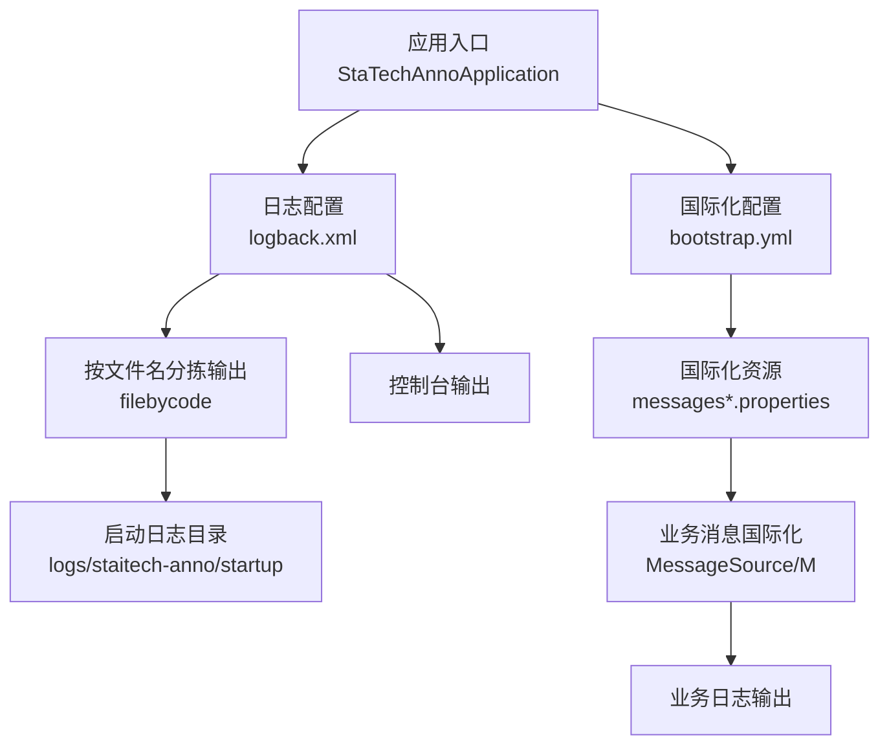
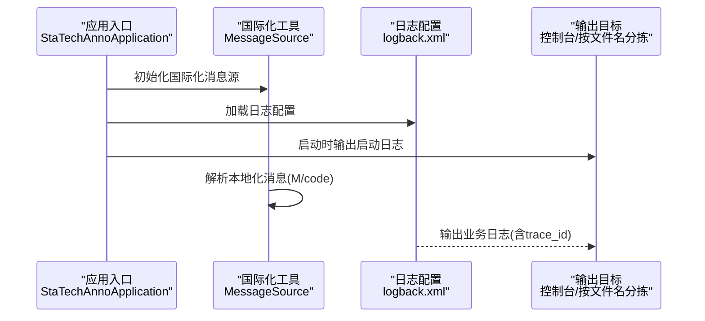
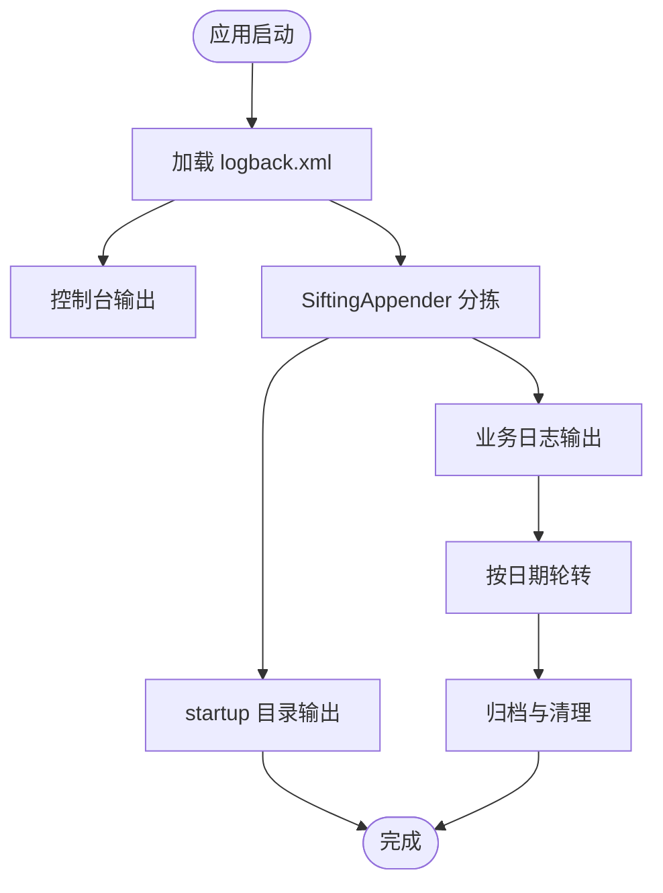
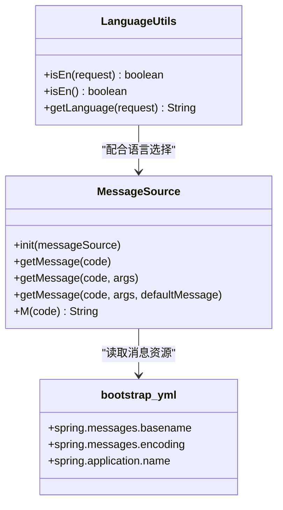
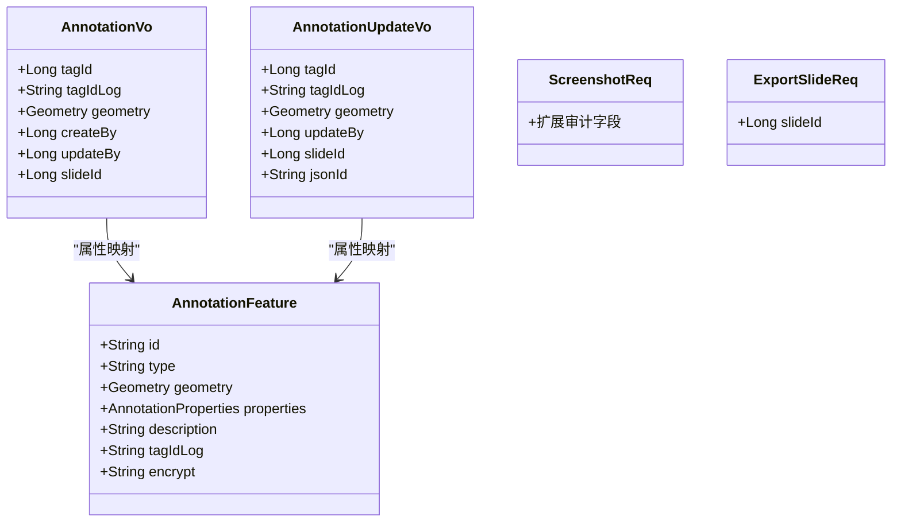
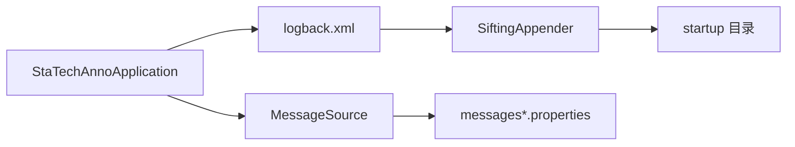

# 日志管理

<cite>
**本文引用的文件**
- [logback.xml](file://src/main/resources/logback.xml)
- [StaTechAnnoApplication.java](file://src/main/java/cn/staitech/annotation/StaTechAnnoApplication.java)
- [bootstrap.yml](file://src/main/resources/bootstrap.yml)
- [LanguageUtils.java](file://src/main/java/cn/staitech/annotation/utils/LanguageUtils.java)
- [MessageSource.java](file://src/main/java/cn/staitech/annotation/utils/MessageSource.java)
- [messages.properties](file://src/main/resources/i18n/messages.properties)
- [messages_en.properties](file://src/main/resources/i18n/messages_en.properties)
- [messages_zh.properties](file://src/main/resources/i18n/messages_zh.properties)
- [AnnotationFeature.java](file://src/main/java/cn/staitech/annotation/netty/message/AnnotationFeature.java)
- [AnnotationVo.java](file://src/main/java/cn/staitech/annotation/vo/anno/AnnotationVo.java)
- [AnnotationUpdateVo.java](file://src/main/java/cn/staitech/annotation/vo/anno/AnnotationUpdateVo.java)
- [ScreenshotReq.java](file://src/main/java/cn/staitech/annotation/vo/anno/ScreenshotReq.java)
- [ExportSlideReq.java](file://src/main/java/cn/staitech/annotation/vo/measure/ExportSlideReq.java)
- [README.md](file://README.md)
</cite>

## 目录
1. [简介](#简介)
2. [项目结构](#项目结构)
3. [核心组件](#核心组件)
4. [架构总览](#架构总览)
5. [详细组件分析](#详细组件分析)
6. [依赖分析](#依赖分析)
7. [性能考虑](#性能考虑)
8. [故障排查指南](#故障排查指南)
9. [结论](#结论)
10. [附录](#附录)

## 简介
本文件面向医学图像标注系统的运维与开发团队，提供一套完整的日志管理方案。内容涵盖 Logback 配置结构与日志级别策略、应用启动日志与业务日志的分类管理、日志轮转与归档清理自动化、多语言国际化消息处理机制，以及日志分析工具、搜索技巧与安全合规建议。目标是帮助团队在高并发、多租户、多语言环境下实现可观测性与可追溯性。

## 项目结构
- 日志配置位于资源目录，采用 Logback XML 配置文件集中管理。
- 国际化消息资源位于 i18n 目录，支持中文与英文。
- 应用入口负责初始化国际化消息源，并设置时区。
- 业务对象与请求体中存在日志审计注解，用于标识敏感字段与转换逻辑。

图表来源
- [logback.xml:1-100](file://src/main/resources/logback.xml#L1-L100)
- [bootstrap.yml:1-42](file://src/main/resources/bootstrap.yml#L1-L42)
- [StaTechAnnoApplication.java:1-51](file://src/main/java/cn/staitech/annotation/StaTechAnnoApplication.java#L1-L51)

章节来源
- [logback.xml:1-100](file://src/main/resources/logback.xml#L1-L100)
- [bootstrap.yml:1-42](file://src/main/resources/bootstrap.yml#L1-L42)
- [StaTechAnnoApplication.java:1-51](file://src/main/java/cn/staitech/annotation/StaTechAnnoApplication.java#L1-L51)

## 核心组件
- 日志配置与输出
  - 控制台输出与按文件名分拣输出（SiftingAppender），支持启动日志与业务日志分离存储。
  - 根日志级别为 info，模块日志级别细粒度控制（如 Spring、Web MVC、Nacos 客户端等）。
- 国际化消息与语言选择
  - 基于 Spring MessageSource 的国际化工具类，支持根据登录用户语言或请求头语言动态获取本地化消息。
  - 提供简化的 M 方法，便于在日志与业务层直接输出本地化文本。
- 业务对象与日志审计注解
  - VO/Req 对象中通过注解标识忽略日志字段与数据库转换字段，确保日志中不泄露敏感信息。
- 应用入口与时区设置
  - 应用启动时设置 Asia/Shanghai 时区，保证日志时间一致性。

章节来源
- [logback.xml:85-99](file://src/main/resources/logback.xml#L85-L99)
- [MessageSource.java:1-82](file://src/main/java/cn/staitech/annotation/utils/MessageSource.java#L1-L82)
- [LanguageUtils.java:1-27](file://src/main/java/cn/staitech/annotation/utils/LanguageUtils.java#L1-L27)
- [StaTechAnnoApplication.java:36-42](file://src/main/java/cn/staitech/annotation/StaTechAnnoApplication.java#L36-L42)

## 架构总览
下图展示日志从应用到输出的全链路：应用入口初始化国际化与时区；Logback 读取配置进行输出；国际化消息根据语言环境动态解析；业务对象通过注解控制日志字段。

图表来源
- [StaTechAnnoApplication.java:36-42](file://src/main/java/cn/staitech/annotation/StaTechAnnoApplication.java#L36-L42)
- [MessageSource.java:40-44](file://src/main/java/cn/staitech/annotation/utils/MessageSource.java#L40-L44)
- [logback.xml:96-99](file://src/main/resources/logback.xml#L96-L99)

## 详细组件分析

### 日志配置与输出策略
- 输出目标
  - 控制台输出：便于开发与调试阶段快速定位问题。
  - 按文件名分拣输出（SiftingAppender）：通过 discriminator 动态选择输出目录，支持启动日志与业务日志隔离。
- 日志格式
  - 包含时间戳、线程名、trace_id、级别、Logger 名称、方法与行号、消息正文。
- 日志级别
  - 根级别 info，模块级别细粒度控制，如 Spring 与 Web MVC 打印 debug 日志，便于问题定位。
- 归档与轮转
  - 使用 TimeBasedRollingPolicy，按日期生成日志文件，保留策略可按 appender 配置调整。
- 启动日志目录
  - 默认输出至 logs/staitech-anno/startup 目录，便于独立检索与分析。

图表来源
- [logback.xml:59-83](file://src/main/resources/logback.xml#L59-L83)
- [logback.xml:96-99](file://src/main/resources/logback.xml#L96-L99)

章节来源
- [logback.xml:1-100](file://src/main/resources/logback.xml#L1-L100)

### 国际化消息与多语言支持
- 消息源初始化
  - 应用入口通过构造函数注入 Spring MessageSource 并初始化工具类。
- 语言选择
  - 支持根据请求头 Language 或登录用户语言动态切换。
  - 提供简化方法 M(code)，自动将 en-us 映射为 en，zh-cn 映射为 zh。
- 资源文件
  - messages.properties（默认）、messages_en.properties（英文）、messages_zh.properties（中文）。
- 在日志中的应用
  - 可在业务日志中直接输出本地化消息，提升日志可读性与跨语言支持。

图表来源
- [MessageSource.java:14-82](file://src/main/java/cn/staitech/annotation/utils/MessageSource.java#L14-L82)
- [LanguageUtils.java:14-27](file://src/main/java/cn/staitech/annotation/utils/LanguageUtils.java#L14-L27)
- [bootstrap.yml:9-13](file://src/main/resources/bootstrap.yml#L9-L13)

章节来源
- [StaTechAnnoApplication.java:36-38](file://src/main/java/cn/staitech/annotation/StaTechAnnoApplication.java#L36-L38)
- [MessageSource.java:1-82](file://src/main/java/cn/staitech/annotation/utils/MessageSource.java#L1-L82)
- [LanguageUtils.java:1-27](file://src/main/java/cn/staitech/annotation/utils/LanguageUtils.java#L1-L27)
- [bootstrap.yml:1-42](file://src/main/resources/bootstrap.yml#L1-L42)
- [messages.properties:1-328](file://src/main/resources/i18n/messages.properties#L1-L328)
- [messages_en.properties:1-323](file://src/main/resources/i18n/messages_en.properties#L1-L323)
- [messages_zh.properties:1-324](file://src/main/resources/i18n/messages_zh.properties#L1-L324)

### 业务日志与审计字段控制
- 注解驱动的日志审计
  - 通过 IgnoreLogField 标识不应出现在日志中的字段（如几何数据、内部标识等）。
  - 通过 LogFieldDBConvert 指定字段转换映射，便于在日志中输出可读信息。
- 典型对象
  - AnnotationFeature：包含描述、标签日志字段与加密字段，日志中仅记录必要信息。
  - AnnotationVo/AnnotationUpdateVo：大量字段被标记为忽略日志，避免敏感信息泄露。
  - ScreenshotReq/ExportSlideReq：扩展基础审计请求体，便于统一审计。

图表来源
- [AnnotationFeature.java:14-32](file://src/main/java/cn/staitech/annotation/netty/message/AnnotationFeature.java#L14-L32)
- [AnnotationVo.java:51-114](file://src/main/java/cn/staitech/annotation/vo/anno/AnnotationVo.java#L51-L114)
- [AnnotationUpdateVo.java:49-101](file://src/main/java/cn/staitech/annotation/vo/anno/AnnotationUpdateVo.java#L49-L101)
- [ScreenshotReq.java:7-9](file://src/main/java/cn/staitech/annotation/vo/anno/ScreenshotReq.java#L7-L9)
- [ExportSlideReq.java:7-9](file://src/main/java/cn/staitech/annotation/vo/measure/ExportSlideReq.java#L7-L9)

章节来源
- [AnnotationFeature.java:1-32](file://src/main/java/cn/staitech/annotation/netty/message/AnnotationFeature.java#L1-L32)
- [AnnotationVo.java:51-114](file://src/main/java/cn/staitech/annotation/vo/anno/AnnotationVo.java#L51-L114)
- [AnnotationUpdateVo.java:49-101](file://src/main/java/cn/staitech/annotation/vo/anno/AnnotationUpdateVo.java#L49-L101)
- [ScreenshotReq.java:1-9](file://src/main/java/cn/staitech/annotation/vo/anno/ScreenshotReq.java#L1-L9)
- [ExportSlideReq.java:1-9](file://src/main/java/cn/staitech/annotation/vo/measure/ExportSlideReq.java#L1-L9)

### 启动日志与业务日志分类管理
- 启动日志
  - 通过 SiftingAppender 的 defaultValue 与 discriminator 键，将启动日志输出到 startup 目录，便于独立检索。
- 业务日志
  - 业务对象通过注解控制敏感字段，结合国际化消息输出，形成可读性强且合规的日志。

章节来源
- [logback.xml:59-83](file://src/main/resources/logback.xml#L59-L83)
- [logback.xml:96-99](file://src/main/resources/logback.xml#L96-L99)

### 日志轮转、归档与清理自动化
- 轮转策略
  - TimeBasedRollingPolicy：按日期生成日志文件，避免单文件过大。
- 保留策略
  - 可在不同 appender 中设置 maxHistory，平衡磁盘占用与历史查询需求。
- 清理建议
  - 结合操作系统定时任务或容器日志收集系统，定期清理过期日志，确保磁盘空间可用。

章节来源
- [logback.xml:72-77](file://src/main/resources/logback.xml#L72-L77)

### 多语言日志与国际化消息处理
- 语言选择优先级
  - 登录用户语言 > 请求头 Language > 默认语言。
- 消息解析
  - 通过 MessageSource.getMessage(code, args, defaultMessage) 获取本地化文本。
- 在日志中的应用
  - 使用 M(code) 直接输出本地化消息，减少重复解析逻辑。

章节来源
- [MessageSource.java:40-80](file://src/main/java/cn/staitech/annotation/utils/MessageSource.java#L40-L80)
- [LanguageUtils.java:15-26](file://src/main/java/cn/staitech/annotation/utils/LanguageUtils.java#L15-L26)

## 依赖分析
- 应用入口依赖国际化消息源，确保日志与业务消息一致。
- 日志配置依赖 SiftingAppender 实现按文件名分拣输出。
- 业务对象依赖注解实现日志字段控制，降低敏感信息泄露风险。

图表来源
- [StaTechAnnoApplication.java:36-38](file://src/main/java/cn/staitech/annotation/StaTechAnnoApplication.java#L36-L38)
- [logback.xml:59-83](file://src/main/resources/logback.xml#L59-L83)
- [messages.properties:1-328](file://src/main/resources/i18n/messages.properties#L1-L328)

章节来源
- [StaTechAnnoApplication.java:1-51](file://src/main/java/cn/staitech/annotation/StaTechAnnoApplication.java#L1-L51)
- [logback.xml:1-100](file://src/main/resources/logback.xml#L1-L100)
- [messages.properties:1-328](file://src/main/resources/i18n/messages.properties#L1-L328)

## 性能考虑
- 日志级别
  - 生产环境建议将非关键模块降为 warn 或 info，避免过多 debug 日志影响性能。
- 输出目标
  - 控制台输出适合开发环境；生产环境建议关闭控制台输出，仅保留文件输出。
- 字段过滤
  - 通过注解过滤大字段（如几何数据）可显著降低序列化与 IO 开销。
- 时间格式
  - 当前模式包含 trace_id 与方法/行号，有助于定位但会增加字符串拼接开销；可根据需要调整。

## 故障排查指南
- 启动失败排查
  - 查看 startup 目录下的启动日志，确认依赖服务（如 Nacos、数据库）连接状态。
  - 关注 Nacos 客户端与 Spring Web MVC 的日志，定位配置加载与路由问题。
- 业务异常排查
  - 使用 trace_id 在日志中快速定位同一请求链路的所有日志条目。
  - 结合国际化消息，确认错误提示是否符合当前语言环境。
- 端口与网络
  - 参考项目文档中的端口开放情况，确认服务端口与外部访问路径。
- 日志轮转与磁盘
  - 检查日志文件大小与轮转策略，避免磁盘占满导致服务中断。

章节来源
- [logback.xml:92-94](file://src/main/resources/logback.xml#L92-L94)
- [README.md:5-27](file://README.md#L5-L27)

## 结论
本方案通过 Logback 的分拣输出、模块化日志级别、国际化消息与注解驱动的日志审计，实现了启动日志与业务日志的清晰分离、可读性强且合规的日志输出。结合轮转与清理策略，可在高并发场景下保持良好的可观测性与稳定性。建议在生产环境中进一步优化日志级别与输出目标，并完善日志采集与告警体系。

## 附录
- 日志格式示例（字段说明）
  - 时间戳、线程名、trace_id、日志级别、Logger 名称、方法与行号、消息正文。
- 常用搜索技巧
  - 使用 trace_id 快速定位请求链路。
  - 使用日志级别筛选（如 ERROR、WARN）快速发现异常。
  - 使用正则表达式匹配关键字段（如用户 ID、切片 ID）。
- 安全与合规建议
  - 严格使用注解过滤敏感字段，避免日志泄露。
  - 对包含个人健康信息（PHI）的日志进行脱敏处理。
  - 遵循组织与法规的保留期限与销毁流程。