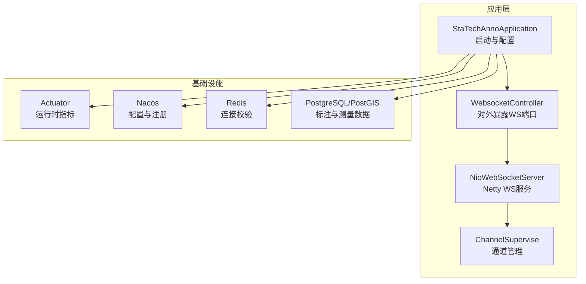
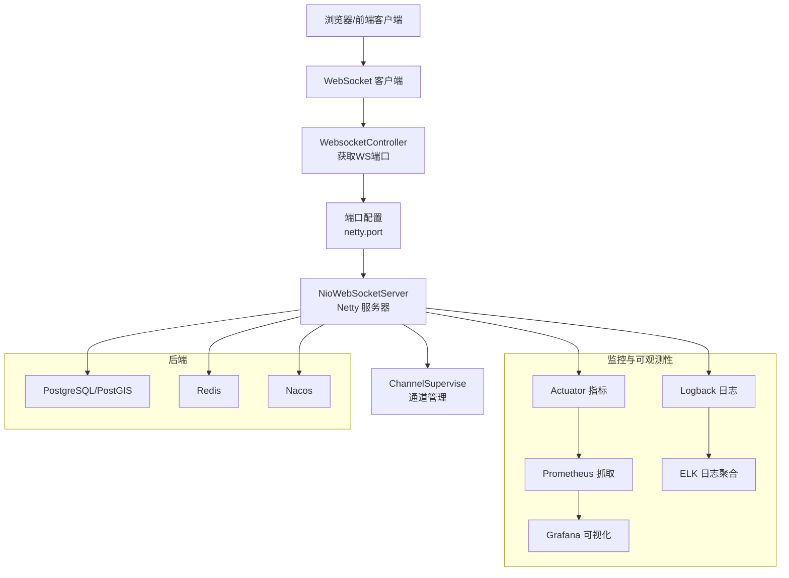
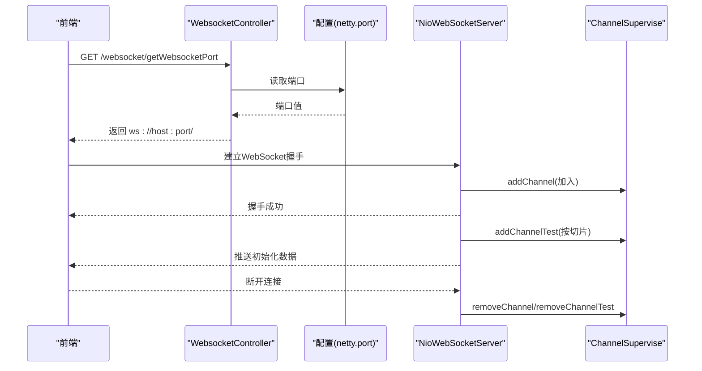
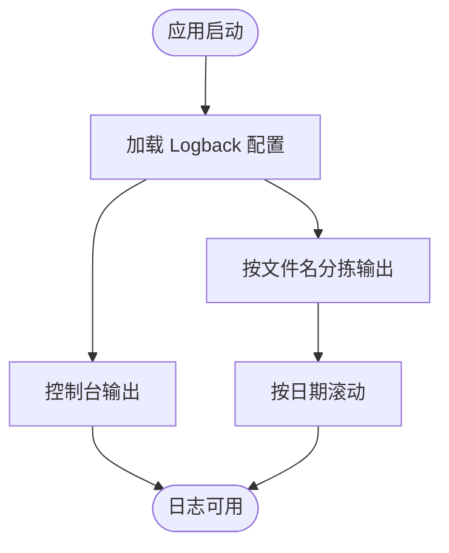
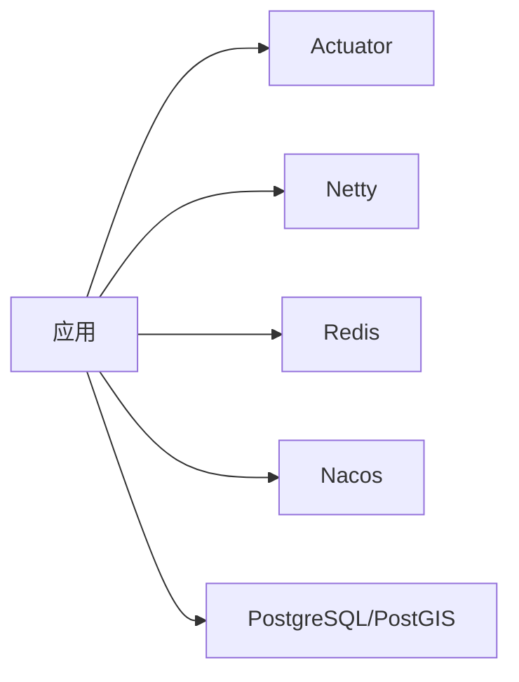

# 监控告警

<cite>
**本文引用的文件**
- [StaTechAnnoApplication.java](file://src/main/java/cn/staitech/annotation/StaTechAnnoApplication.java)
- [bootstrap.yml](file://src/main/resources/bootstrap.yml)
- [logback.xml](file://src/main/resources/logback.xml)
- [NioWebSocketServer.java](file://src/main/java/cn/staitech/annotation/netty/websocket/NioWebSocketServer.java)
- [ChannelSupervise.java](file://src/main/java/cn/staitech/annotation/netty/global/ChannelSupervise.java)
- [WebsocketController.java](file://src/main/java/cn/staitech/annotation/controller/WebsocketController.java)
- [InitializinConfig.java](file://src/main/java/cn/staitech/annotation/config/InitializinConfig.java)
- [pom.xml](file://pom.xml)
- [README.md](file://README.md)
- [update_pg_v2.6.0.sql](file://sql/update_pg_v2.6.0.sql)
</cite>

## 目录
1. [简介](#简介)
2. [项目结构](#项目结构)
3. [核心组件](#核心组件)
4. [架构总览](#架构总览)
5. [详细组件分析](#详细组件分析)
6. [依赖分析](#依赖分析)
7. [性能考虑](#性能考虑)
8. [故障排查指南](#故障排查指南)
9. [结论](#结论)
10. [附录](#附录)

## 简介
本文件面向运维与平台工程团队，围绕医学图像标注系统在容器化与微服务背景下的监控与告警，提供从指标采集、日志监控、异常告警到可视化与容量规划的完整实践指南。重点覆盖以下方面：
- 应用层指标：CPU 使用率、内存占用、线程与事件循环状态
- 数据层指标：数据库连接数、查询延迟与慢查询
- 通信层指标：WebSocket 连接数、消息吞吐与丢包
- 日志监控：结构化日志、按模块分级、滚动策略与审计
- 告警规则：阈值设定、通知渠道与升级策略
- 工具集成：Prometheus、Grafana、ELK Stack 的落地配置思路
- 运维工具：健康检查、故障预警与容量规划方法

## 项目结构
该标注系统采用 Spring Boot + Netty 自建 WebSocket 服务，结合 Actuator 暴露运行时指标，通过 Nacos 进行配置与服务发现。项目资源与模块分布如下：
- 启动入口与配置：应用启动类、Spring 配置、日志配置
- WebSocket 通信：Netty 服务器、通道管理器、控制器
- 依赖与集成：Actuator、Redis、Nacos、PostgreSQL/PostGIS
- 数据库脚本：标注与测量表结构及索引



**图表来源**
- [StaTechAnnoApplication.java:1-51](file://src/main/java/cn/staitech/annotation/StaTechAnnoApplication.java#L1-L51)
- [WebsocketController.java:1-41](file://src/main/java/cn/staitech/annotation/controller/WebsocketController.java#L1-L41)
- [NioWebSocketServer.java:1-44](file://src/main/java/cn/staitech/annotation/netty/websocket/NioWebSocketServer.java#L1-L44)
- [ChannelSupervise.java:1-45](file://src/main/java/cn/staitech/annotation/netty/global/ChannelSupervise.java#L1-L45)
- [bootstrap.yml:1-42](file://src/main/resources/bootstrap.yml#L1-L42)
- [InitializinConfig.java:1-31](file://src/main/java/cn/staitech/annotation/config/InitializinConfig.java#L1-L31)
- [pom.xml:38-42](file://pom.xml#L38-L42)

**章节来源**
- [StaTechAnnoApplication.java:1-51](file://src/main/java/cn/staitech/annotation/StaTechAnnoApplication.java#L1-L51)
- [bootstrap.yml:1-42](file://src/main/resources/bootstrap.yml#L1-L42)
- [logback.xml:1-101](file://src/main/resources/logback.xml#L1-L101)
- [pom.xml:38-42](file://pom.xml#L38-L42)

## 核心组件
- 应用启动与配置
  - 启动类启用 Actuator、事务、异步、MyBatis 分页拦截器等，便于后续指标采集与分页能力
  - 配置文件启用 Knife4j 文档、Nacos 注册与配置中心、多环境 profile
- WebSocket 服务
  - Netty 服务器在独立端口启动，控制器提供 WS 地址查询接口
  - 通道管理器维护全局通道集合与按切片映射，支持广播与定向推送
- 日志系统
  - Logback 配置控制台输出与按模块/级别输出，支持结构化字段与滚动策略
- 基础设施集成
  - Actuator 提供健康检查与运行指标
  - Redis 连接工厂开启连接校验
  - PostgreSQL/PostGIS 作为空间数据存储

**章节来源**
- [StaTechAnnoApplication.java:19-51](file://src/main/java/cn/staitech/annotation/StaTechAnnoApplication.java#L19-L51)
- [bootstrap.yml:1-42](file://src/main/resources/bootstrap.yml#L1-L42)
- [logback.xml:1-101](file://src/main/resources/logback.xml#L1-L101)
- [NioWebSocketServer.java:12-44](file://src/main/java/cn/staitech/annotation/netty/websocket/NioWebSocketServer.java#L12-L44)
- [ChannelSupervise.java:13-45](file://src/main/java/cn/staitech/annotation/netty/global/ChannelSupervise.java#L13-L45)
- [WebsocketController.java:14-41](file://src/main/java/cn/staitech/annotation/controller/WebsocketController.java#L14-L41)
- [InitializinConfig.java:15-31](file://src/main/java/cn/staitech/annotation/config/InitializinConfig.java#L15-L31)
- [pom.xml:38-42](file://pom.xml#L38-L42)

## 架构总览
下图展示了标注系统在监控与告警维度的关键交互：应用通过 Actuator 暴露指标，日志由 Logback 输出；WebSocket 服务由 Netty 承载，通道管理器集中维护连接；数据库与缓存作为后端支撑。



**图表来源**
- [WebsocketController.java:20-41](file://src/main/java/cn/staitech/annotation/controller/WebsocketController.java#L20-L41)
- [NioWebSocketServer.java:12-44](file://src/main/java/cn/staitech/annotation/netty/websocket/NioWebSocketServer.java#L12-L44)
- [ChannelSupervise.java:13-45](file://src/main/java/cn/staitech/annotation/netty/global/ChannelSupervise.java#L13-L45)
- [bootstrap.yml:1-42](file://src/main/resources/bootstrap.yml#L1-L42)
- [logback.xml:1-101](file://src/main/resources/logback.xml#L1-L101)
- [pom.xml:38-42](file://pom.xml#L38-L42)

## 详细组件分析

### WebSocket 连接与通道管理
- Netty 服务器在启动时绑定端口，记录启动与关闭日志，异常中断时进行优雅关闭
- 通道管理器维护：
  - 全局通道组，用于广播消息
  - 通道 ID 映射，用于快速定位
  - 通道到切片的映射，用于定向推送
- 控制器提供 WS 地址查询接口，便于前端动态获取连接地址



**图表来源**
- [WebsocketController.java:20-41](file://src/main/java/cn/staitech/annotation/controller/WebsocketController.java#L20-L41)
- [NioWebSocketServer.java:12-44](file://src/main/java/cn/staitech/annotation/netty/websocket/NioWebSocketServer.java#L12-L44)
- [ChannelSupervise.java:17-45](file://src/main/java/cn/staitech/annotation/netty/global/ChannelSupervise.java#L17-L45)

**章节来源**
- [NioWebSocketServer.java:12-44](file://src/main/java/cn/staitech/annotation/netty/websocket/NioWebSocketServer.java#L12-L44)
- [ChannelSupervise.java:17-45](file://src/main/java/cn/staitech/annotation/netty/global/ChannelSupervise.java#L17-L45)
- [WebsocketController.java:20-41](file://src/main/java/cn/staitech/annotation/controller/WebsocketController.java#L20-L41)

### 日志监控与结构化
- 日志输出包含时间戳、线程、追踪 ID、级别、类名方法行号与消息体
- 支持按模块与级别控制输出，根日志级别为 info，Spring MVC 与 Nacos 客户端等关键模块单独配置
- 提供按日志文件名的分拣输出，便于启动与运行期日志分离



**图表来源**
- [logback.xml:1-101](file://src/main/resources/logback.xml#L1-L101)

**章节来源**
- [logback.xml:1-101](file://src/main/resources/logback.xml#L1-L101)

### 数据库连接与空间数据
- 系统依赖 PostgreSQL 与 PostGIS，用于存储标注与测量的空间几何数据
- SQL 脚本定义了标注、删除标注与测量三张核心表，并建立常用字段索引以提升查询效率
- 建议在数据库侧开启连接池监控与慢查询日志，结合应用侧 Actuator 指标进行综合观测

```mermaid
erDiagram
FR_ANNOTATION {
bigserial annotation_id PK
decimal area
decimal perimeter
varchar description
bigint tag_id
geometry contour
varchar location_type
varchar annotation_type
bigint create_by
timestamp create_time
bigint update_by
timestamp update_time
bigint slide_id
varchar json_id
}
FR_ANNOTATION_DEL {
bigserial annotation_id PK
decimal area
decimal perimeter
varchar description
bigint tag_id
geometry contour
varchar location_type
varchar annotation_type
bigint create_by
timestamp create_time
bigint delete_by
timestamp delete_time
bigint update_by
timestamp update_time
bigint slide_id
varchar json_id
}
FR_MEASURE {
bigserial measure_id PK
bigint slide_id
varchar annotation_type
varchar area
varchar perimeter
bigint number
int measure_type
varchar measure_relation
varchar measure_name
int measure_number
double precision mean_distance
double precision max_distance
double precision min_distance
varchar inner_angle
varchar exterior_angle
varchar center_point
varchar location_type
varchar radius
geometry contour
bigint create_by
timestamp create_time
bigint update_by
timestamp update_time
varchar measure_full_name
}
```

**图表来源**
- [update_pg_v2.6.0.sql:2-164](file://sql/update_pg_v2.6.0.sql#L2-L164)

**章节来源**
- [update_pg_v2.6.0.sql:2-164](file://sql/update_pg_v2.6.0.sql#L2-L164)

## 依赖分析
- Actuator：提供健康检查与运行指标，是 Prometheus 抓取的核心来源
- Netty：自建 WebSocket 服务，需关注事件循环组与通道生命周期
- Redis：连接工厂开启连接校验，有助于提前发现连接异常
- Nacos：配置与注册中心，建议纳入统一监控与告警
- PostgreSQL/PostGIS：空间数据存储，建议配合数据库侧监控



**图表来源**
- [pom.xml:38-42](file://pom.xml#L38-L42)
- [InitializinConfig.java:15-31](file://src/main/java/cn/staitech/annotation/config/InitializinConfig.java#L15-L31)

**章节来源**
- [pom.xml:38-42](file://pom.xml#L38-L42)
- [InitializinConfig.java:15-31](file://src/main/java/cn/staitech/annotation/config/InitializinConfig.java#L15-L31)

## 性能考虑
- CPU 与内存
  - 关注 Netty EventLoopGroup 的线程数量与任务队列长度，避免背压
  - 结合 Actuator 的 JVM 指标观察 GC 与堆内存变化
- WebSocket 吞吐
  - 通道广播与定向推送的负载差异较大，建议对广播频率与消息大小进行限流
  - 对长连接进行心跳检测与空闲断开，减少僵尸连接
- 数据库
  - 利用索引与查询计划优化，结合慢查询日志定位热点
  - 连接池参数与最大连接数需与实例规格匹配，避免连接争用
- 日志
  - 控制台输出在高并发场景可能成为瓶颈，建议以文件输出为主
  - 合理设置滚动周期与保留天数，避免磁盘压力

[本节为通用指导，无需特定文件引用]

## 故障排查指南
- WebSocket 连接异常
  - 检查 Netty 服务器端口与防火墙放通情况
  - 查看通道管理器是否正确加入/移除通道，确认握手与 ping/pong 处理逻辑
  - 关注控制器返回的 WS 地址是否与实际端口一致
- 日志问题
  - 确认 Logback 配置生效，检查模块级别与输出路径
  - 若出现大量 ERROR 日志，优先定位序列化与通道写入异常
- 数据库问题
  - 检查连接池与慢查询日志，核对索引使用情况
  - 关注空间几何字段的查询与写入性能
- 健康检查
  - 通过 Actuator 的健康端点快速判断应用、数据库、缓存等依赖状态

**章节来源**
- [NioWebSocketServer.java:12-44](file://src/main/java/cn/staitech/annotation/netty/websocket/NioWebSocketServer.java#L12-L44)
- [ChannelSupervise.java:17-45](file://src/main/java/cn/staitech/annotation/netty/global/ChannelSupervise.java#L17-L45)
- [WebsocketController.java:20-41](file://src/main/java/cn/staitech/annotation/controller/WebsocketController.java#L20-L41)
- [logback.xml:1-101](file://src/main/resources/logback.xml#L1-L101)
- [update_pg_v2.6.0.sql:2-164](file://sql/update_pg_v2.6.0.sql#L2-L164)

## 结论
通过在应用层引入 Actuator 指标、在通信层完善 WebSocket 通道管理、在日志层实现结构化与分拣输出，并结合数据库与缓存的专项监控，可形成覆盖“指标—日志—告警—可视化”的闭环。建议尽快落地 Prometheus 抓取与 Grafana 展示，以及 ELK 日志聚合，以支撑持续的健康检查、故障预警与容量规划。

[本节为总结性内容，无需特定文件引用]

## 附录

### 指标采集与展示清单
- 应用层
  - 健康检查：/actuator/health
  - JVM 指标：/actuator/metrics/jvm.*
  - 运行时指标：/actuator/metrics/process.*, /actuator/metrics/spring.*
- WebSocket 层
  - 通道总数、按切片连接数、广播/定向消息速率
- 数据层
  - 数据库连接池指标、慢查询计数、查询延迟分位数
- 日志层
  - 错误日志量、模块级错误分布、日志滚动与磁盘占用

**章节来源**
- [bootstrap.yml:1-42](file://src/main/resources/bootstrap.yml#L1-L42)
- [pom.xml:38-42](file://pom.xml#L38-L42)

### 告警规则与阈值建议
- CPU 使用率
  - 5 分钟平均 > 80% 持续 5 分钟触发预警，> 90% 触发严重
- 内存占用
  - 堆内存使用率 > 85% 持续 3 分钟预警，> 90% 严重
- WebSocket 连接
  - 连接数 > 预设上限 × 0.9 预警，> 上限 严重
  - 广播/定向消息失败率 > 1% 预警
- 数据库
  - 连接池等待时间 > 5s 预警，> 10s 严重
  - 慢查询次数 > 0 持续 1 分钟触发告警
- 日志
  - ERROR 级别日志量 > 阈值 持续 1 分钟告警

[本节为通用指导，无需特定文件引用]

### 通知机制与升级策略
- 通知渠道：邮件、IM、电话（按级别）
- 升级策略：首次告警后未恢复，自动升级至更高优先级
- 通知模板：包含时间、实例、指标、阈值、影响面与处置建议

[本节为通用指导，无需特定文件引用]

### Prometheus、Grafana、ELK 集成要点
- Prometheus
  - 在应用中暴露指标端点，配置抓取任务与标签
- Grafana
  - 创建仪表板：CPU/内存/连接数/消息速率/错误率/慢查询
- ELK
  - 将 Logback 输出接入 Filebeat/Logstash，按模块与级别检索与聚合

[本节为通用指导，无需特定文件引用]

### 端口与防火墙参考
- 应用端口：9998
- 相关端口：9000、9200-9203、9002-9003、15672、5672、6379、3306、9990、9999、8080、80、5000、8000、1514、4369、5671、15671、15691、15692、25672、82 等
- 建议仅开放必要端口，确保安全基线

**章节来源**
- [README.md:5-60](file://README.md#L5-L60)