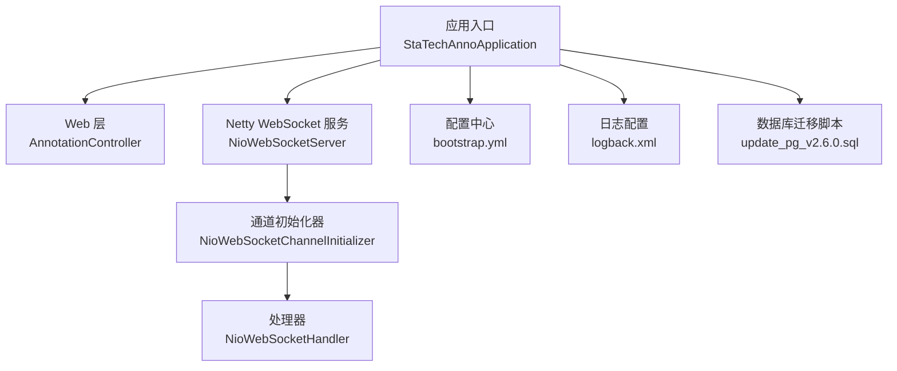
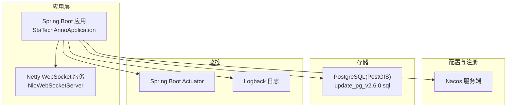
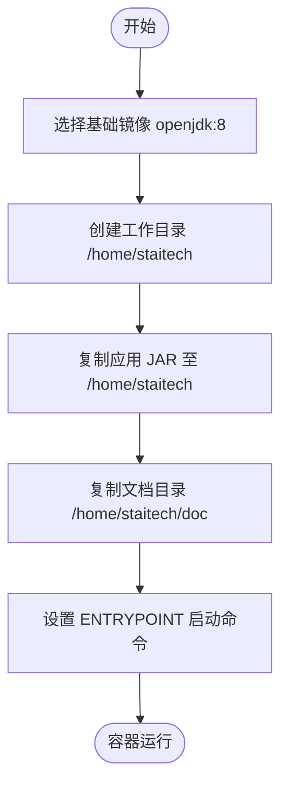
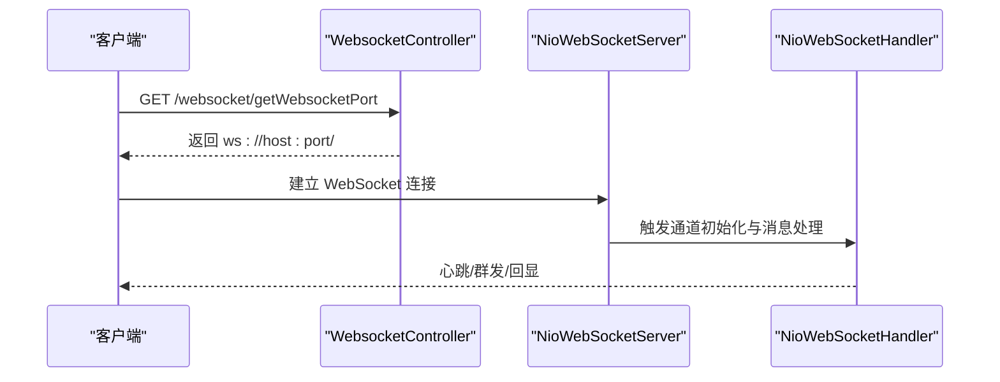
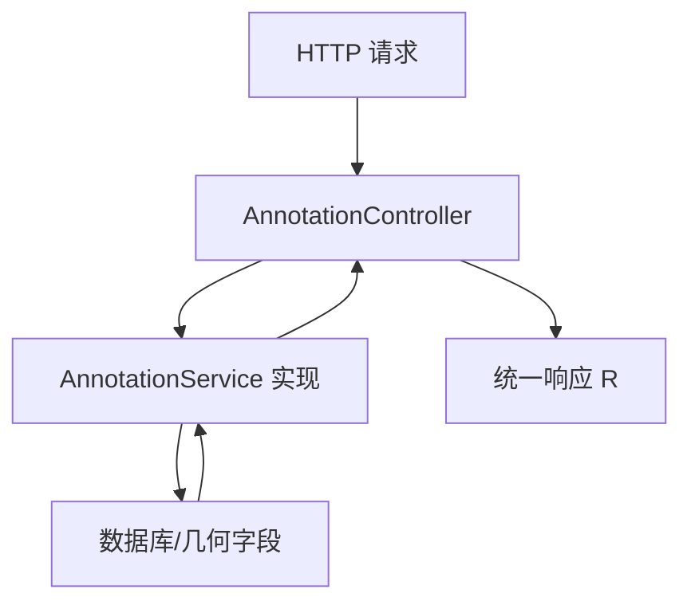
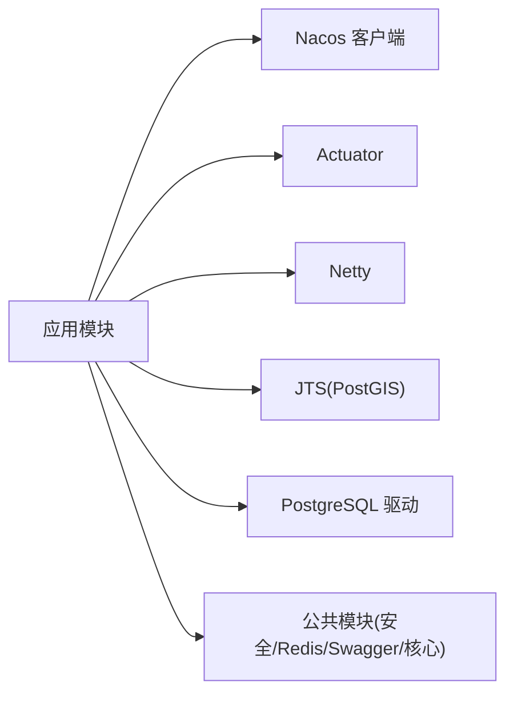

# 部署运维

<cite>
**本文引用的文件**
- [README.md](file://README.md)
- [pom.xml](file://pom.xml)
- [bootstrap.yml](file://src/main/resources/bootstrap.yml)
- [StaTechAnnoApplication.java](file://src/main/java/cn/staitech/annotation/StaTechAnnoApplication.java)
- [NioWebSocketServer.java](file://src/main/java/cn/staitech/annotation/netty/websocket/NioWebSocketServer.java)
- [NioWebSocketChannelInitializer.java](file://src/main/java/cn/staitech/annotation/netty/websocket/NioWebSocketChannelInitializer.java)
- [NioWebSocketHandler.java](file://src/main/java/cn/staitech/annotation/netty/websocket/NioWebSocketHandler.java)
- [WebsocketController.java](file://src/main/java/cn/staitech/annotation/controller/WebsocketController.java)
- [AnnotationController.java](file://src/main/java/cn/staitech/annotation/controller/AnnotationController.java)
- [InitializinConfig.java](file://src/main/java/cn/staitech/annotation/config/InitializinConfig.java)
- [logback.xml](file://src/main/resources/logback.xml)
- [update_pg_v2.6.0.sql](file://sql/update_pg_v2.6.0.sql)
- [dockerfile](file://docker/staitech/modules/anno/dockerfile)
</cite>

## 目录
1. [简介](#简介)
2. [项目结构](#项目结构)
3. [核心组件](#核心组件)
4. [架构总览](#架构总览)
5. [详细组件分析](#详细组件分析)
6. [依赖分析](#依赖分析)
7. [性能考虑](#性能考虑)
8. [故障排查指南](#故障排查指南)
9. [结论](#结论)
10. [附录](#附录)

## 简介
本文件面向运维与平台工程团队，提供医学图像标注系统（后端模块）的完整部署与运维指南。内容覆盖：
- Docker 容器化与镜像构建
- Kubernetes 部署与集群管理建议
- 监控告警、日志管理与性能优化
- 数据库与中间件部署要点
- 网络拓扑与端口要求
- 部署清单、环境准备与验证步骤
- 故障恢复、备份与灾备策略
- 运维监控、性能调优与容量规划实务

## 项目结构
该模块为独立的 Spring Boot 应用，集成 Netty WebSocket 服务，使用 Nacos 作为注册与配置中心，Actuator 提供健康与指标端点，日志通过 Logback 输出。

图表来源
- [StaTechAnnoApplication.java:1-51](file://src/main/java/cn/staitech/annotation/StaTechAnnoApplication.java#L1-L51)
- [AnnotationController.java:1-251](file://src/main/java/cn/staitech/annotation/controller/AnnotationController.java#L1-L251)
- [NioWebSocketServer.java:1-44](file://src/main/java/cn/staitech/annotation/netty/websocket/NioWebSocketServer.java#L1-L44)
- [NioWebSocketChannelInitializer.java:1-29](file://src/main/java/cn/staitech/annotation/netty/websocket/NioWebSocketChannelInitializer.java#L1-L29)
- [NioWebSocketHandler.java:1-168](file://src/main/java/cn/staitech/annotation/netty/websocket/NioWebSocketHandler.java#L1-L168)
- [bootstrap.yml:1-42](file://src/main/resources/bootstrap.yml#L1-L42)
- [logback.xml:1-101](file://src/main/resources/logback.xml#L1-L101)
- [update_pg_v2.6.0.sql:1-245](file://sql/update_pg_v2.6.0.sql#L1-L245)

章节来源
- [pom.xml:1-265](file://pom.xml#L1-L265)
- [bootstrap.yml:1-42](file://src/main/resources/bootstrap.yml#L1-L42)
- [logback.xml:1-101](file://src/main/resources/logback.xml#L1-L101)

## 核心组件
- 应用入口与装配
  - Spring Boot 启动类启用发现、异步、事务与分页插件，扫描 Mapper。
  - 默认时区设置为 Asia/Shanghai。
- Web 接口层
  - 提供标注增删改查、批量操作、距离计算、轮廓合并预览等接口。
- Netty WebSocket 服务
  - 自定义端口启动，处理握手、心跳、群发消息。
  - 提供查询当前 WebSocket 端口的辅助接口。
- 配置中心与环境
  - 通过 bootstrap.yml 指定 Nacos 地址、命名空间、分组与激活的 profile。
  - Maven Profile 支持 dev/test/prod 三套环境参数。
- 日志
  - 使用 Logback，按日期滚动，支持按模块与级别控制。
- 数据库
  - PostGIS/PostgreSQL 扩展，提供几何字段与索引；包含迁移脚本。

章节来源
- [StaTechAnnoApplication.java:1-51](file://src/main/java/cn/staitech/annotation/StaTechAnnoApplication.java#L1-L51)
- [AnnotationController.java:1-251](file://src/main/java/cn/staitech/annotation/controller/AnnotationController.java#L1-L251)
- [NioWebSocketServer.java:1-44](file://src/main/java/cn/staitech/annotation/netty/websocket/NioWebSocketServer.java#L1-L44)
- [WebsocketController.java:1-40](file://src/main/java/cn/staitech/annotation/controller/WebsocketController.java#L1-L40)
- [bootstrap.yml:1-42](file://src/main/resources/bootstrap.yml#L1-L42)
- [pom.xml:225-263](file://pom.xml#L225-L263)
- [logback.xml:1-101](file://src/main/resources/logback.xml#L1-L101)
- [update_pg_v2.6.0.sql:1-245](file://sql/update_pg_v2.6.0.sql#L1-L245)

## 架构总览
系统采用“Spring Boot + Netty WebSocket + Nacos + Actuator + PostgreSQL(PostGIS)”的组合。应用通过 Nacos 注册与配置中心获取运行参数，Actuator 对外暴露健康与指标端点，WebSocket 独立于 HTTP 端口提供实时通信能力。

图表来源
- [StaTechAnnoApplication.java:1-51](file://src/main/java/cn/staitech/annotation/StaTechAnnoApplication.java#L1-L51)
- [NioWebSocketServer.java:1-44](file://src/main/java/cn/staitech/annotation/netty/websocket/NioWebSocketServer.java#L1-L44)
- [bootstrap.yml:1-42](file://src/main/resources/bootstrap.yml#L1-L42)
- [update_pg_v2.6.0.sql:1-245](file://sql/update_pg_v2.6.0.sql#L1-L245)
- [logback.xml:1-101](file://src/main/resources/logback.xml#L1-L101)

## 详细组件分析

### 组件一：Docker 容器化与镜像构建
- 基础镜像与工作目录
  - 使用 openjdk:8 作为基础镜像，创建工作目录与挂载点。
- 镜像构建要点
  - 将打包产物 jar 复制至镜像内，拷贝 doc 文档目录。
  - 以 java -jar 方式启动应用。
- 运行建议
  - 映射必要端口（HTTP 9998、WebSocket 端口、Actuator 端口等）。
  - 挂载日志目录以便持久化与采集。
  - 通过环境变量或 Nacos 参数注入运行配置。

图表来源
- [dockerfile:1-22](file://docker/staitech/modules/anno/dockerfile#L1-L22)

章节来源
- [dockerfile:1-22](file://docker/staitech/modules/anno/dockerfile#L1-L22)

### 组件二：Kubernetes 部署与集群管理
- 资源建议
  - Deployment：副本数、探针（Liveness/Readiness）、资源限制与请求。
  - Service：ClusterIP 暴露 HTTP 与 Actuator；NodePort 或 Ingress 暴露 WebSocket。
  - ConfigMap：注入 bootstrap.yml 中的 Nacos 地址、命名空间、分组与激活 profile。
  - Secret：敏感信息（如数据库连接、第三方密钥）。
  - PersistentVolumeClaim：挂载日志目录。
- 可观测性
  - 开启 Actuator 指标端点，Prometheus 抓取。
  - 日志采集（stdout/stderr + 文件采集）。
- 网络策略
  - 仅开放必要端口，限制入站访问。
  - WebSocket 端口单独暴露，避免与 HTTP 端口冲突。

（本节为通用实践建议，未直接分析具体文件）

### 组件三：监控与告警
- 指标与健康
  - Actuator 暴露健康、指标端点，结合 Prometheus/Grafana 监控。
- 日志
  - Logback 按日期滚动，区分 info/error，支持模块级日志级别。
  - 建议集中采集与检索，设置错误率与延迟阈值告警。
- WebSocket
  - 关注连接数、消息吞吐、丢包率与心跳失败率。

章节来源
- [logback.xml:1-101](file://src/main/resources/logback.xml#L1-L101)
- [pom.xml:38-42](file://pom.xml#L38-L42)

### 组件四：日志管理策略
- 输出位置与轮转
  - 日志路径与模式在 logback.xml 中定义，按日期滚动。
- 分类与级别
  - 控制 Spring、项目包的日志级别，减少噪声。
- 采集与归档
  - 建议使用 Filebeat/Fluent Bit 采集，Elasticsearch/日志服务归档。

章节来源
- [logback.xml:1-101](file://src/main/resources/logback.xml#L1-L101)

### 组件五：数据库部署与中间件
- 数据库
  - PostgreSQL + PostGIS，提供几何类型与索引；迁移脚本包含表结构与索引。
- 中间件
  - Redis：Lettuce 连接工厂校验连接，建议开启连接池与健康检查。
  - RabbitMQ：参考仓库中的示例命令，用于消息队列场景（如审计、异步任务）。

章节来源
- [update_pg_v2.6.0.sql:1-245](file://sql/update_pg_v2.6.0.sql#L1-L245)
- [InitializinConfig.java:1-31](file://src/main/java/cn/staitech/annotation/config/InitializinConfig.java#L1-L31)
- [README.md:86-95](file://README.md#L86-L95)

### 组件六：网络拓扑与端口要求
- 已开放端口（防火墙）
  - 包括 HTTP 80/8080、WebSocket 端口（netty.port）、Nacos 8848、RabbitMQ 5672/15672、Redis 6379、PostgreSQL 3306/3307、ES 系列端口（9200/9201/9202/9203）、日志收集 1514、Kafka/JMS 等。
- 建议
  - 在 Kubernetes 中通过 Service/Ingress 控制暴露面，仅放通必要端口。
  - WebSocket 端口与 HTTP 端口分离，避免混淆。

章节来源
- [README.md:5-63](file://README.md#L5-L63)

### 组件七：WebSocket 服务与 API 流程
- 启动流程
  - 应用启动后，Netty 服务绑定 netty.port 并监听连接。
  - 提供查询 WebSocket 端口的接口，便于前端拼接 ws 地址。
- 请求处理
  - 握手、心跳、文本消息处理与群发。

图表来源
- [WebsocketController.java:1-40](file://src/main/java/cn/staitech/annotation/controller/WebsocketController.java#L1-L40)
- [NioWebSocketServer.java:1-44](file://src/main/java/cn/staitech/annotation/netty/websocket/NioWebSocketServer.java#L1-L44)
- [NioWebSocketHandler.java:1-168](file://src/main/java/cn/staitech/annotation/netty/websocket/NioWebSocketHandler.java#L1-L168)

章节来源
- [WebsocketController.java:1-40](file://src/main/java/cn/staitech/annotation/controller/WebsocketController.java#L1-L40)
- [NioWebSocketServer.java:1-44](file://src/main/java/cn/staitech/annotation/netty/websocket/NioWebSocketServer.java#L1-L44)
- [NioWebSocketChannelInitializer.java:1-29](file://src/main/java/cn/staitech/annotation/netty/websocket/NioWebSocketChannelInitializer.java#L1-L29)
- [NioWebSocketHandler.java:1-168](file://src/main/java/cn/staitech/annotation/netty/websocket/NioWebSocketHandler.java#L1-L168)

### 组件八：标注接口与业务流程
- 主要接口
  - 新增/更新/删除标注、批量操作、距离计算、轮廓填充/粘贴、合并预览、GeoJSON 查询、撤销/重做等。
- 处理逻辑
  - 控制器接收请求，转换为领域对象，调用服务层执行业务逻辑，返回统一响应包装。

图表来源
- [AnnotationController.java:1-251](file://src/main/java/cn/staitech/annotation/controller/AnnotationController.java#L1-L251)

章节来源
- [AnnotationController.java:1-251](file://src/main/java/cn/staitech/annotation/controller/AnnotationController.java#L1-L251)

## 依赖分析
- 外部依赖
  - Spring Cloud Alibaba Nacos Discovery/Config、Sentinel
  - Spring Boot Actuator
  - Netty、Knife4j、JTS(PostGIS JDBC)
  - PostgreSQL 驱动
- 内部模块
  - 依赖公共模块（安全、Swagger、Redis、核心等），排除部分可选组件。

图表来源
- [pom.xml:19-134](file://pom.xml#L19-L134)

章节来源
- [pom.xml:19-134](file://pom.xml#L19-L134)

## 性能考虑
- WebSocket
  - 合理设置线程池与背压，避免大包与高并发导致内存压力。
  - 心跳间隔与超时阈值需平衡实时性与资源消耗。
- 数据库
  - 几何字段建立索引，避免全表扫描；批量写入与事务拆分降低锁竞争。
- 应用
  - 启用分页插件，避免一次性加载大量数据；合理缓存热点数据。
- 监控
  - 关注 GC、堆内存、连接池占用、SQL 耗时与错误率。

（本节提供通用指导，未直接分析具体文件）

## 故障排查指南
- 启动与注册
  - 检查 Nacos 地址、命名空间、分组与激活 profile 是否正确。
  - 查看 Actuator 健康与指标端点，确认依赖可用。
- WebSocket
  - 确认 netty.port 配置与防火墙放通；查看日志中握手与心跳记录。
- 日志
  - 关注 ERROR 级别日志与模块日志级别，定位异常堆栈。
- 数据库
  - 检查 PostGIS 几何类型与索引；核对迁移脚本执行情况。

章节来源
- [bootstrap.yml:1-42](file://src/main/resources/bootstrap.yml#L1-L42)
- [logback.xml:1-101](file://src/main/resources/logback.xml#L1-L101)
- [update_pg_v2.6.0.sql:1-245](file://sql/update_pg_v2.6.0.sql#L1-L245)

## 结论
本指南提供了从容器化、Kubernetes 部署到监控、日志、数据库与中间件的全栈运维实践。建议结合企业标准流程完善 CI/CD、密钥管理与网络策略，并持续优化容量与性能。

## 附录

### 部署清单与环境准备
- 基础设施
  - 容器运行时、Kubernetes 集群、存储与网络策略。
- 依赖服务
  - Nacos、Redis、PostgreSQL(PostGIS)、可选 RabbitMQ。
- 应用配置
  - bootstrap.yml 中的 Nacos 地址、命名空间、分组与激活 profile。
- 端口与防火墙
  - 参考防火墙开放端口列表，确保仅放通必要端口。
- 验证步骤
  - 访问 HTTP 端口与 Actuator 健康端点；WebSocket 可用性测试；日志输出与轮转验证。

章节来源
- [README.md:5-63](file://README.md#L5-L63)
- [bootstrap.yml:1-42](file://src/main/resources/bootstrap.yml#L1-L42)