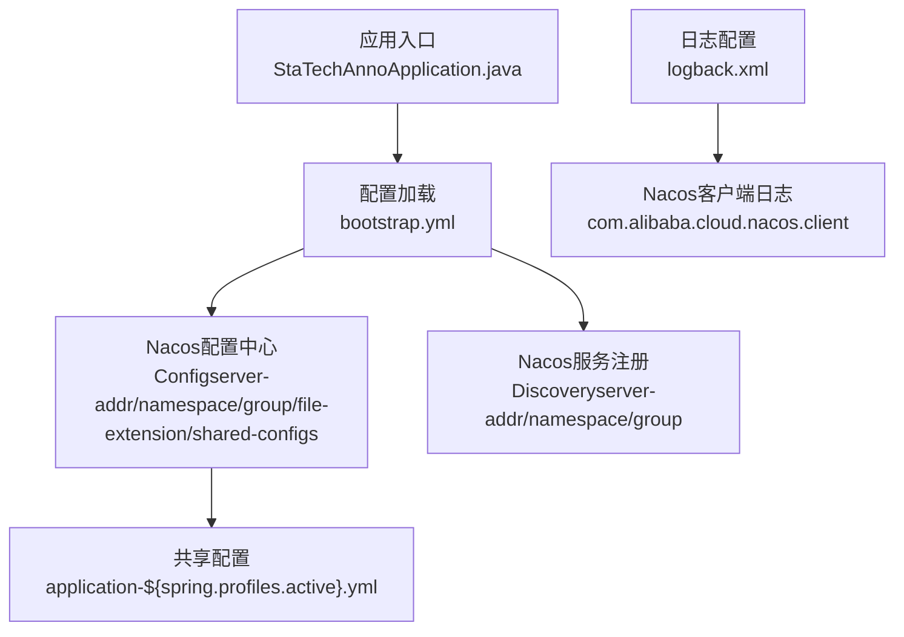
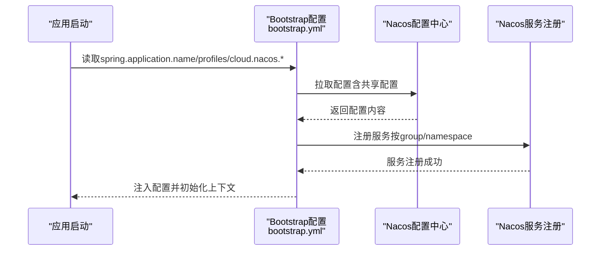
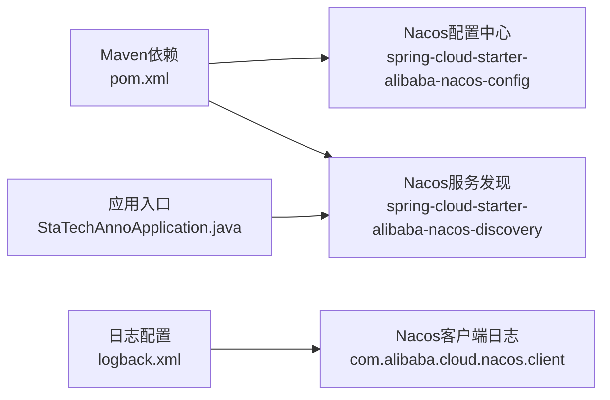

# Nacos配置中心

<cite>
**本文引用的文件**
- [bootstrap.yml](file://src/main/resources/bootstrap.yml)
- [pom.xml](file://pom.xml)
- [StaTechAnnoApplication.java](file://src/main/java/cn/staitech/annotation/StaTechAnnoApplication.java)
- [logback.xml](file://src/main/resources/logback.xml)
- [InitializinConfig.java](file://src/main/java/cn/staitech/annotation/config/InitializinConfig.java)
- [README.md](file://README.md)
</cite>

## 目录
1. [简介](#简介)
2. [项目结构](#项目结构)
3. [核心组件](#核心组件)
4. [架构总览](#架构总览)
5. [详细组件分析](#详细组件分析)
6. [依赖分析](#依赖分析)
7. [性能考虑](#性能考虑)
8. [故障排查指南](#故障排查指南)
9. [结论](#结论)
10. [附录](#附录)

## 简介
本文件面向“医学图像标注系统”的Nacos配置中心使用与运维，系统通过Spring Cloud Alibaba Nacos实现配置中心与服务发现能力。本文围绕以下目标展开：
- 解释Nacos在系统中的角色与工作原理（配置发布、订阅、动态更新）
- 详解bootstrap.yml中Nacos相关配置项的含义与作用（如server-addr、namespace、group等）
- 记录共享配置的使用方式与配置文件命名规范
- 提供配置中心管理界面使用要点与配置变更的热更新流程
- 给出安全配置与权限管理建议

## 项目结构
该模块采用标准Spring Boot工程结构，Nacos配置位于资源目录下的bootstrap.yml，Maven依赖在pom.xml中声明，应用入口类启用服务发现与配置中心能力。

图表来源
- [bootstrap.yml:20-41](file://src/main/resources/bootstrap.yml#L20-L41)
- [pom.xml:20-30](file://pom.xml#L20-L30)
- [StaTechAnnoApplication.java:29-33](file://src/main/java/cn/staitech/annotation/StaTechAnnoApplication.java#L29-L33)
- [logback.xml:90-92](file://src/main/resources/logback.xml#L90-L92)

章节来源
- [bootstrap.yml:1-42](file://src/main/resources/bootstrap.yml#L1-L42)
- [pom.xml:19-30](file://pom.xml#L19-L30)
- [StaTechAnnoApplication.java:29-33](file://src/main/java/cn/staitech/annotation/StaTechAnnoApplication.java#L29-L33)

## 核心组件
- 配置中心客户端（Nacos Config）
  - 通过spring.cloud.nacos.config.*进行配置，包括server-addr、namespace、group、file-extension、shared-configs等
  - 启动时从Nacos拉取配置，并支持动态刷新
- 服务注册与发现（Nacos Discovery）
  - 通过spring.cloud.nacos.discovery.*进行配置，用于服务注册与发现
- 应用入口与生命周期
  - 启用@EnableDiscoveryClient以接入Nacos服务发现
  - 通过日志观察Nacos客户端行为

章节来源
- [bootstrap.yml:20-41](file://src/main/resources/bootstrap.yml#L20-L41)
- [pom.xml:20-30](file://pom.xml#L20-L30)
- [StaTechAnnoApplication.java:29-33](file://src/main/java/cn/staitech/annotation/StaTechAnnoApplication.java#L29-L33)
- [logback.xml:90-92](file://src/main/resources/logback.xml#L90-L92)

## 架构总览
下图展示应用启动阶段如何加载Nacos配置与共享配置，并与服务发现协同工作：

图表来源
- [bootstrap.yml:14-41](file://src/main/resources/bootstrap.yml#L14-L41)
- [pom.xml:20-30](file://pom.xml#L20-L30)
- [StaTechAnnoApplication.java:29-33](file://src/main/java/cn/staitech/annotation/StaTechAnnoApplication.java#L29-L33)

## 详细组件分析

### bootstrap.yml中的Nacos配置项详解
- spring.application.name
  - 作用：标识应用在Nacos中的标识，用于区分不同应用
- spring.profiles.active
  - 作用：激活的环境，决定共享配置文件名与命名空间、分组等
- spring.cloud.nacos.config.server-addr
  - 作用：Nacos配置中心地址，支持IP:Port或域名
- spring.cloud.nacos.config.namespace
  - 作用：命名空间隔离，避免配置冲突
- spring.cloud.nacos.config.group
  - 作用：分组隔离，默认通常为DEFAULT_GROUP
- spring.cloud.nacos.config.file-extension
  - 作用：配置文件格式，此处为yml
- spring.cloud.nacos.config.shared-configs
  - 作用：共享配置列表，系统通过${spring.profiles.active}拼接文件名，实现按环境加载
- spring.cloud.nacos.discovery.server-addr/namespace/group
  - 作用：服务注册与发现相关配置，与配置中心同源但用途不同

章节来源
- [bootstrap.yml:14-41](file://src/main/resources/bootstrap.yml#L14-L41)

### Maven依赖与环境配置
- 依赖
  - spring-cloud-starter-alibaba-nacos-config：启用Nacos配置中心
  - spring-cloud-starter-alibaba-nacos-discovery：启用Nacos服务发现
- 环境Profile
  - pacmvsdev/testpvcmvs/pathmedics三套环境，分别定义了serverAddr、nacosNamespace、nacosGroup等属性
  - 通过Maven Profile切换，实现不同环境的配置中心连接参数

章节来源
- [pom.xml:20-30](file://pom.xml#L20-L30)
- [pom.xml:226-261](file://pom.xml#L226-L261)

### 共享配置与命名规范
- 共享配置
  - 在bootstrap.yml中通过shared-configs声明，系统会按application-${spring.profiles.active}.${file-extension}规则加载
  - 例如：当spring.profiles.active为pacmvsdev时，会加载名为application-pacmvsdev.yml的共享配置
- 命名规范
  - 文件名：application-${spring.profiles.active}.${file-extension}
  - 文件扩展名：由file-extension指定（本项目为yml）
  - 建议：不同环境使用独立的命名空间与分组，避免冲突

章节来源
- [bootstrap.yml:38-41](file://src/main/resources/bootstrap.yml#L38-L41)

### 动态更新与热部署
- 动态更新机制
  - Nacos客户端在应用启动后持续监听配置变化，当配置中心发生变更时，客户端会推送变更事件
  - 应用侧可通过注解或编程方式感知配置变化并触发业务逻辑更新
- 观察与验证
  - 通过日志观察Nacos客户端行为，定位配置加载与更新过程
  - 可结合Actuator端点监控应用状态

章节来源
- [logback.xml:90-92](file://src/main/resources/logback.xml#L90-L92)
- [pom.xml:38-42](file://pom.xml#L38-L42)

### 管理界面使用指南
- 登录与基本操作
  - 使用Nacos控制台登录，选择对应的命名空间与分组
  - 在“配置管理”页面创建或编辑配置，确保Data ID符合application-${spring.profiles.active}.yml的命名规范
- 发布与回滚
  - 发布前先预览配置内容，确认无误后再发布
  - 若发布后出现异常，可快速回滚至上一个版本
- 权限与安全
  - 建议为不同环境配置独立命名空间与只读/可写账号，限制操作范围
  - 对敏感配置（如数据库密码、第三方密钥）建议加密存储或通过外部密管系统集成

（本节为通用实践说明，未直接分析具体文件）

### 安全配置与权限管理建议
- 账号与权限
  - 为开发、测试、生产环境分别配置独立账号与权限
  - 生产环境建议最小权限原则，仅允许必要人员具备写权限
- 网络与访问控制
  - Nacos服务端口需在防火墙策略中开放，同时限制来源IP
  - 建议通过内网或VPN访问，避免公网暴露
- 配置加密与审计
  - 对涉及凭证的配置项建议加密存储
  - 开启操作审计日志，追踪配置变更历史

章节来源
- [README.md:15-17](file://README.md#L15-L17)

## 依赖分析
- 应用对Nacos的依赖
  - Nacos配置中心：spring-cloud-starter-alibaba-nacos-config
  - Nacos服务发现：spring-cloud-starter-alibaba-nacos-discovery
- 与应用入口的关系
  - 应用入口启用@EnableDiscoveryClient，使应用同时具备服务注册与发现能力
- 日志与可观测性
  - 通过logback.xml开启Nacos客户端日志，便于定位配置加载与更新问题

图表来源
- [pom.xml:20-30](file://pom.xml#L20-L30)
- [StaTechAnnoApplication.java:29-33](file://src/main/java/cn/staitech/annotation/StaTechAnnoApplication.java#L29-L33)
- [logback.xml:90-92](file://src/main/resources/logback.xml#L90-L92)

章节来源
- [pom.xml:20-30](file://pom.xml#L20-L30)
- [StaTechAnnoApplication.java:29-33](file://src/main/java/cn/staitech/annotation/StaTechAnnoApplication.java#L29-L33)
- [logback.xml:90-92](file://src/main/resources/logback.xml#L90-L92)

## 性能考虑
- 配置拉取频率
  - 合理设置shared-configs数量，避免一次性拉取过多配置导致启动延迟
- 命名空间与分组
  - 将不同环境置于独立命名空间，减少不必要的配置扫描
- 动态更新开销
  - 频繁变更的配置建议拆分，降低单次更新的影响面
- 日志级别
  - 在生产环境适当降低Nacos客户端日志级别，避免I/O开销过大

（本节为通用指导，未直接分析具体文件）

## 故障排查指南
- 启动阶段无法连接Nacos
  - 检查bootstrap.yml中的server-addr是否正确
  - 确认网络连通性与防火墙策略
- 配置未生效或加载失败
  - 核对Data ID是否符合application-${spring.profiles.active}.yml命名
  - 确认namespace与group是否与bootstrap.yml一致
- 配置变更未热更新
  - 检查应用是否正确感知配置变更（如使用@RefreshScope或相应监听器）
  - 查看Nacos客户端日志，确认监听与推送正常
- Redis连接校验
  - 应用初始化时对Redis连接进行校验，可辅助定位连接类问题

章节来源
- [bootstrap.yml:20-41](file://src/main/resources/bootstrap.yml#L20-L41)
- [logback.xml:90-92](file://src/main/resources/logback.xml#L90-L92)
- [InitializinConfig.java:23-29](file://src/main/java/cn/staitech/annotation/config/InitializinConfig.java#L23-L29)

## 结论
本系统通过Nacos实现了配置中心与服务发现的统一管理，借助Maven Profile与共享配置机制，能够按环境灵活加载配置。建议在生产环境中严格划分命名空间与分组，完善权限与审计策略，并通过日志与监控保障配置变更的可控与可观测。

## 附录
- 关键文件索引
  - 配置中心与共享配置：[bootstrap.yml:20-41](file://src/main/resources/bootstrap.yml#L20-L41)
  - 依赖与环境Profile：[pom.xml:20-30](file://pom.xml#L20-L30), [pom.xml:226-261](file://pom.xml#L226-L261)
  - 应用入口与服务发现：[StaTechAnnoApplication.java:29-33](file://src/main/java/cn/staitech/annotation/StaTechAnnoApplication.java#L29-L33)
  - Nacos客户端日志：[logback.xml:90-92](file://src/main/resources/logback.xml#L90-92)
  - Redis连接校验：[InitializinConfig.java:23-29](file://src/main/java/cn/staitech/annotation/config/InitializinConfig.java#L23-L29)
  - 端口与网络：[README.md:15-17](file://README.md#L15-L17)