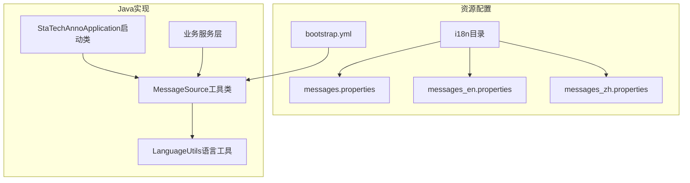
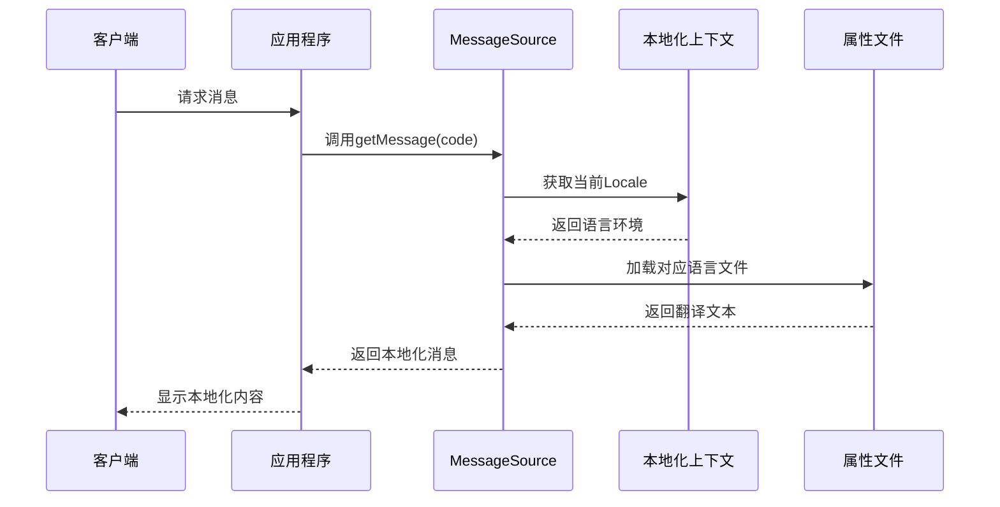
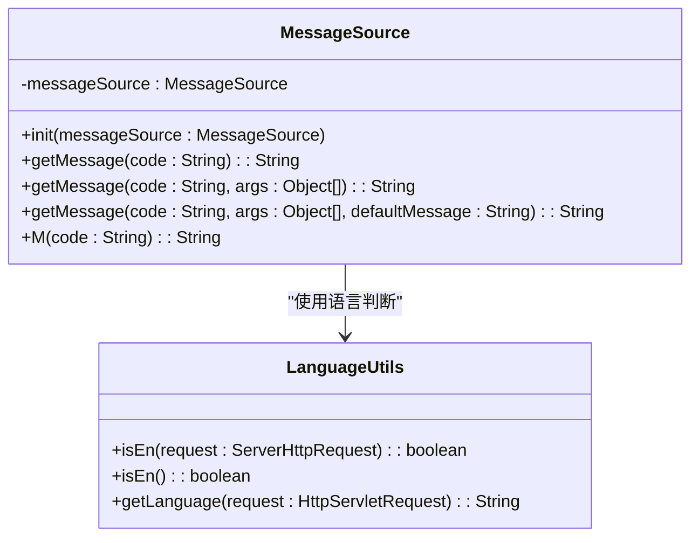
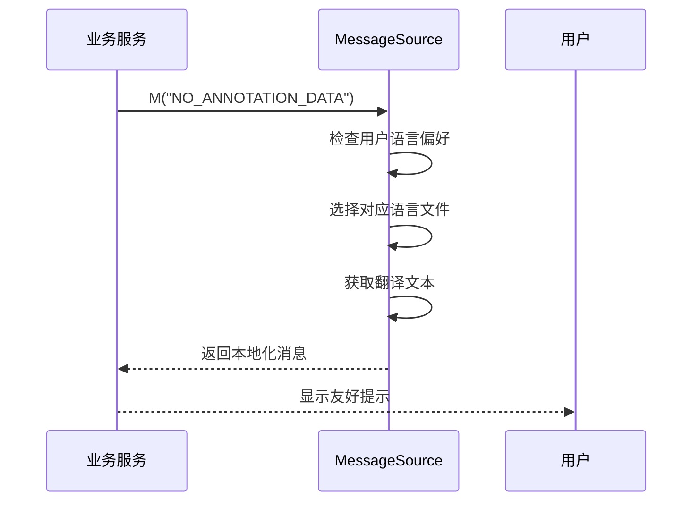
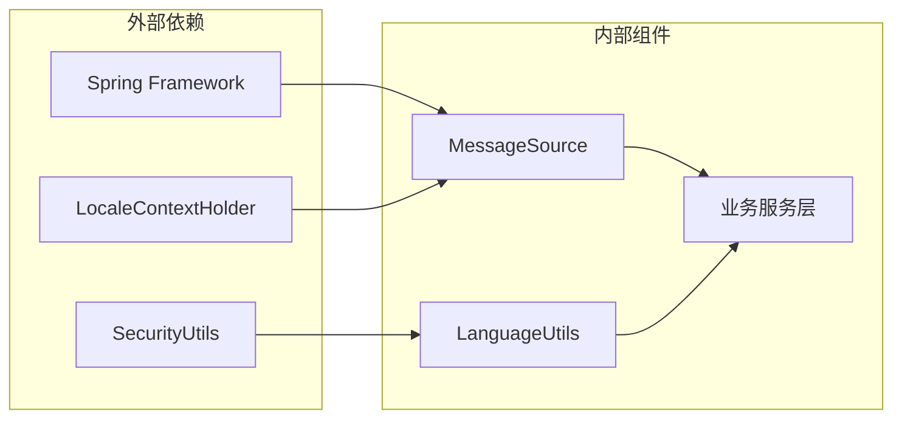

# 国际化配置

<cite>
**本文档引用的文件**
- [messages.properties](file://src/main/resources/i18n/messages.properties)
- [messages_en.properties](file://src/main/resources/i18n/messages_en.properties)
- [messages_zh.properties](file://src/main/resources/i18n/messages_zh.properties)
- [bootstrap.yml](file://src/main/resources/bootstrap.yml)
- [LanguageUtils.java](file://src/main/java/cn/staitech/annotation/utils/LanguageUtils.java)
- [MessageSource.java](file://src/main/java/cn/staitech/annotation/utils/MessageSource.java)
- [StaTechAnnoApplication.java](file://src/main/java/cn/staitech/annotation/StaTechAnnoApplication.java)
- [AnnotationServiceImpl.java](file://src/main/java/cn/staitech/annotation/service/impl/AnnotationServiceImpl.java)
</cite>

## 目录
1. [简介](#简介)
2. [项目结构](#项目结构)
3. [核心组件](#核心组件)
4. [架构概览](#架构概览)
5. [详细组件分析](#详细组件分析)
6. [依赖关系分析](#依赖关系分析)
7. [性能考虑](#性能考虑)
8. [故障排除指南](#故障排除指南)
9. [结论](#结论)

## 简介

本文件详细说明了医学图像标注系统中的国际化配置实现。系统基于Spring Framework的MessageSource机制，实现了多语言支持功能，当前支持中文（简体）和英文两种语言。通过统一的消息源管理和语言切换机制，系统能够根据用户偏好动态显示相应语言的提示信息。

## 项目结构

国际化配置主要分布在以下位置：



**图表来源**
- [bootstrap.yml:8-13](file://src/main/resources/bootstrap.yml#L8-L13)
- [MessageSource.java:13-82](file://src/main/java/cn/staitech/annotation/utils/MessageSource.java#L13-L82)

**章节来源**
- [bootstrap.yml:1-42](file://src/main/resources/bootstrap.yml#L1-L42)
- [messages.properties:1-328](file://src/main/resources/i18n/messages.properties#L1-L328)

## 核心组件

### 消息资源文件

系统采用标准的Spring MessageSource命名约定：

| 文件名 | 语言 | 用途 |
|--------|------|------|
| messages.properties | 默认语言（中文） | 基础消息定义，包含所有键值对 |
| messages_en.properties | 英文 | 英文翻译版本 |
| messages_zh.properties | 中文 | 中文翻译版本 |

每个属性文件包含约320+条消息键值对，涵盖：
- 操作状态消息（成功/失败）
- 错误提示信息
- 业务逻辑描述
- 参数验证错误
- 权限控制提示

### Spring配置

在`bootstrap.yml`中配置了消息源的基本信息：

```yaml
spring:
  messages:
    basename: i18n/messages
    cache-seconds: 3600
    encoding: UTF-8
    fallbackToSystemLocale: false
```

**章节来源**
- [bootstrap.yml:8-13](file://src/main/resources/bootstrap.yml#L8-L13)
- [messages_en.properties:1-323](file://src/main/resources/i18n/messages_en.properties#L1-L323)
- [messages_zh.properties:1-324](file://src/main/resources/i18n/messages_zh.properties#L1-L324)

## 架构概览



**图表来源**
- [MessageSource.java:40-44](file://src/main/java/cn/staitech/annotation/utils/MessageSource.java#L40-L44)
- [StaTechAnnoApplication.java:36-38](file://src/main/java/cn/staitech/annotation/StaTechAnnoApplication.java#L36-L38)

## 详细组件分析

### MessageSource工具类

MessageSource是系统的核心国际化工具类，提供了多种消息获取方式：



**图表来源**
- [MessageSource.java:13-82](file://src/main/java/cn/staitech/annotation/utils/MessageSource.java#L13-L82)
- [LanguageUtils.java:14-27](file://src/main/java/cn/staitech/annotation/utils/LanguageUtils.java#L14-L27)

#### 主要功能特性

1. **自动初始化**：通过构造函数自动注入Spring的MessageSource实例
2. **多级消息获取**：支持带参数和默认值的消息获取
3. **自定义语言切换**：根据用户偏好动态选择语言
4. **异常安全处理**：消息获取失败时返回原始键值

**章节来源**
- [MessageSource.java:17-19](file://src/main/java/cn/staitech/annotation/utils/MessageSource.java#L17-L19)
- [MessageSource.java:54-80](file://src/main/java/cn/staitech/annotation/utils/MessageSource.java#L54-L80)

### 语言工具类

LanguageUtils提供了语言检测和切换功能：

| 方法 | 功能 | 参数 | 返回值 |
|------|------|------|--------|
| isEn(ServerHttpRequest) | 检测请求是否为英文 | HTTP请求对象 | 布尔值 |
| isEn() | 检测当前登录用户语言 | 无 | 布尔值 |
| getLanguage(HttpServletRequest) | 获取请求语言 | HTTP请求 | 语言代码 |

**章节来源**
- [LanguageUtils.java:15-26](file://src/main/java/cn/staitech/annotation/utils/LanguageUtils.java#L15-L26)

### 启动类集成

StaTechAnnoApplication通过构造函数自动初始化MessageSource：

```mermaid
flowchart TD
A[应用启动] --> B[创建MessageSource实例]
B --> C[调用MessageSource.init()]
C --> D[注入到静态变量]
D --> E[准备就绪]
```

**图表来源**
- [StaTechAnnoApplication.java:36-38](file://src/main/java/cn/staitech/annotation/StaTechAnnoApplication.java#L36-L38)

**章节来源**
- [StaTechAnnoApplication.java:34-42](file://src/main/java/cn/staitech/annotation/StaTechAnnoApplication.java#L34-L42)

### 业务层使用示例

在AnnotationServiceImpl中广泛使用MessageSource进行国际化消息处理：



**图表来源**
- [AnnotationServiceImpl.java:126-128](file://src/main/java/cn/staitech/annotation/service/impl/AnnotationServiceImpl.java#L126-L128)

**章节来源**
- [AnnotationServiceImpl.java:120-180](file://src/main/java/cn/staitech/annotation/service/impl/AnnotationServiceImpl.java#L120-L180)

## 依赖关系分析



**图表来源**
- [MessageSource.java:3-7](file://src/main/java/cn/staitech/annotation/utils/MessageSource.java#L3-L7)
- [LanguageUtils.java:3-6](file://src/main/java/cn/staitech/annotation/utils/LanguageUtils.java#L3-L6)

### 组件耦合度

- **低耦合设计**：MessageSource独立于具体业务逻辑
- **依赖注入**：通过Spring容器管理依赖关系
- **接口清晰**：对外提供简洁的静态方法接口

**章节来源**
- [MessageSource.java:15-19](file://src/main/java/cn/staitech/annotation/utils/MessageSource.java#L15-L19)

## 性能考虑

### 缓存策略

系统配置了1小时的消息缓存时间，有效减少文件I/O操作：

- **cache-seconds: 3600**：缓存1小时
- **UTF-8编码**：确保字符正确显示
- **禁用系统回退**：避免意外的语言回退行为

### 优化建议

1. **批量消息获取**：对于频繁使用的消息，考虑批量预加载
2. **动态语言切换**：支持运行时语言切换而无需重启
3. **缓存失效机制**：实现热更新支持

## 故障排除指南

### 常见问题及解决方案

| 问题类型 | 症状 | 解决方案 |
|----------|------|----------|
| 消息未翻译 | 显示原始键值 | 检查对应语言文件是否存在 |
| 语言切换无效 | 语言不随用户偏好变化 | 验证LanguageUtils配置 |
| 字符乱码 | 显示为乱码 | 确认UTF-8编码设置 |
| 缓存过期 | 更新后仍显示旧消息 | 调整cache-seconds配置 |

### 调试技巧

1. **检查日志输出**：MessageSource在获取失败时会返回原始键值
2. **验证文件完整性**：确保所有必需的语言文件都已正确部署
3. **测试语言切换**：通过Header或用户偏好验证语言切换功能

**章节来源**
- [MessageSource.java:74-77](file://src/main/java/cn/staitech/annotation/utils/MessageSource.java#L74-L77)

## 结论

该国际化配置实现了以下目标：

1. **完整的多语言支持**：支持中文和英文两种语言
2. **灵活的语言切换**：基于用户偏好和请求头动态切换
3. **易于维护的结构**：清晰的文件组织和命名规范
4. **良好的扩展性**：便于添加新的语言支持

系统通过MessageSource工具类提供了统一的消息获取接口，结合LanguageUtils实现了智能的语言检测和切换功能。这种设计既保证了开发效率，又确保了用户体验的一致性。