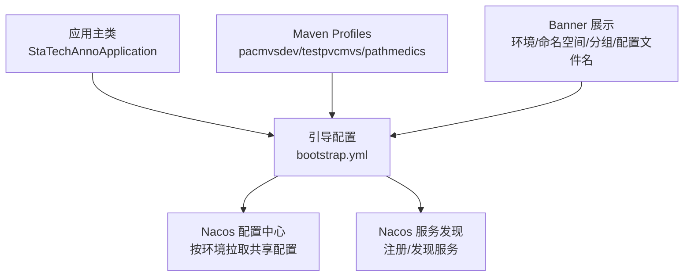
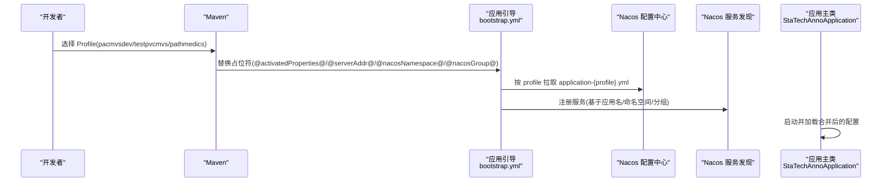
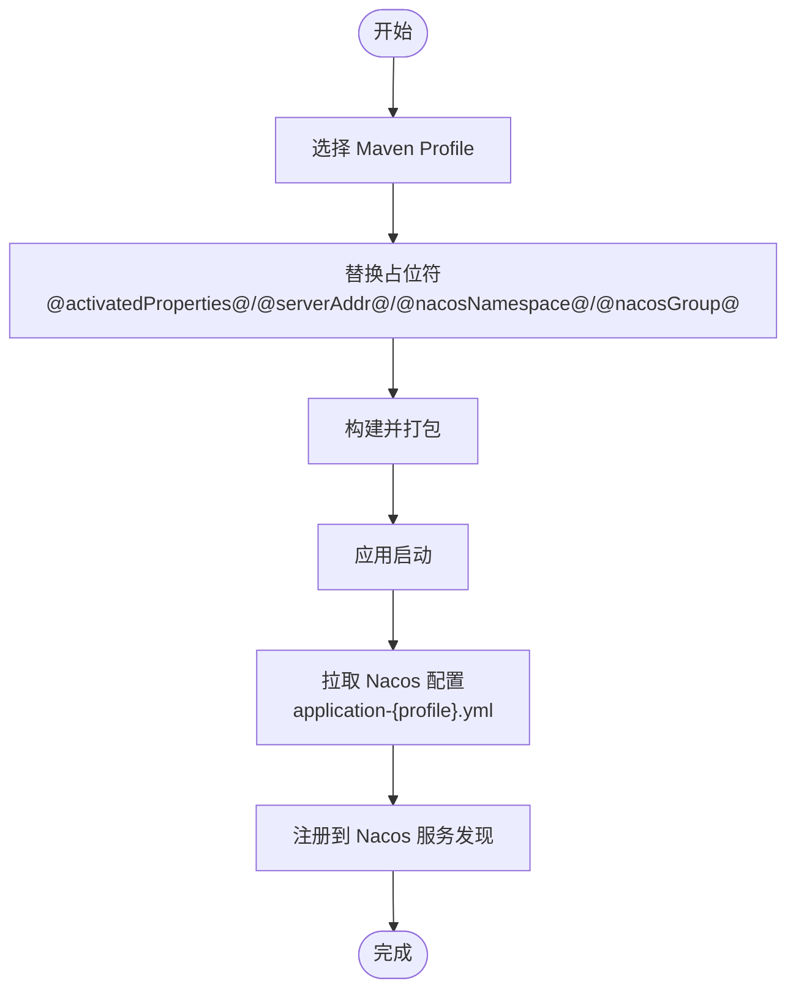
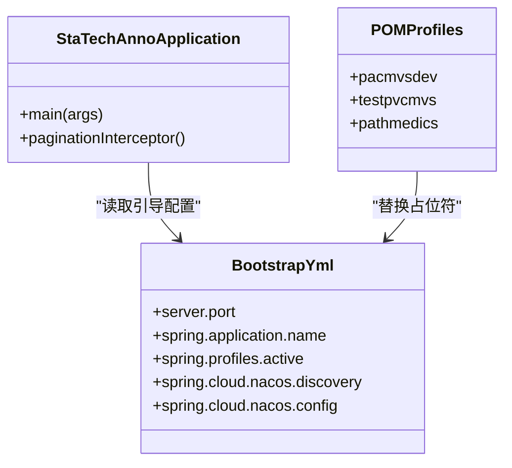
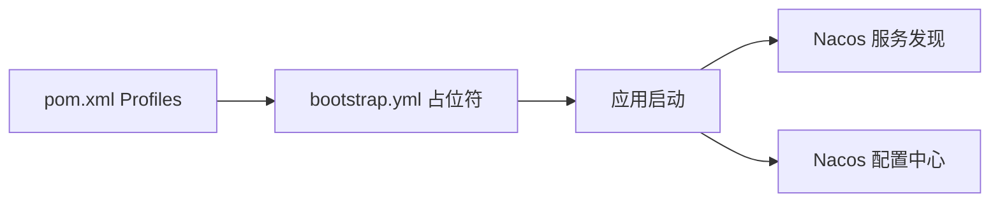

# 应用配置

<cite>
**本文引用的文件**
- [bootstrap.yml](file://src/main/resources/bootstrap.yml)
- [pom.xml](file://pom.xml)
- [StaTechAnnoApplication.java](file://src/main/java/cn/staitech/annotation/StaTechAnnoApplication.java)
- [banner.txt](file://src/main/resources/banner.txt)
- [logback.xml](file://src/main/resources/logback.xml)
</cite>

## 目录
1. [简介](#简介)
2. [项目结构与配置入口](#项目结构与配置入口)
3. [核心配置项详解](#核心配置项详解)
4. [架构总览](#架构总览)
5. [组件详细分析](#组件详细分析)
6. [依赖关系分析](#依赖关系分析)
7. [性能与稳定性考量](#性能与稳定性考量)
8. [故障排查指南](#故障排查指南)
9. [结论](#结论)
10. [附录：最佳实践与规范](#附录最佳实践与规范)

## 简介
本文件面向医学图像标注系统的应用配置，聚焦于 bootstrap.yml 的各项配置作用与含义，涵盖：
- Tomcat 端口、Spring 应用名称、国际化消息配置、Knife4j 文档开关等基础配置
- Spring Cloud Alibaba（Nacos）服务发现与配置中心集成要点
- profiles 环境配置的使用方法与不同环境的切换机制
- 占位符 @activatedProperties@、@serverAddr@、@nacosNamespace@ 等的含义与替换流程
- 配置文件结构化说明与最佳实践建议

## 项目结构与配置入口
- bootstrap.yml 是 Spring Cloud 应用的引导配置文件，优先级高于 application.yml，用于加载远端配置中心（Nacos）与服务发现元数据。
- pom.xml 中定义了 Spring Cloud Alibaba 的 Nacos Discovery 与 Nacos Config 依赖，并通过 Maven Profile 定义多环境占位符属性。
- 应用主类启用服务发现注解，确保在启动阶段完成 Nacos 注册与配置拉取。

图表来源
- [StaTechAnnoApplication.java:30](file://src/main/java/cn/staitech/annotation/StaTechAnnoApplication.java#L30)
- [bootstrap.yml:19](file://src/main/resources/bootstrap.yml#L19)
- [pom.xml:226](file://pom.xml#L226)
- [banner.txt:3](file://src/main/resources/banner.txt#L3)

章节来源
- [bootstrap.yml:1-42](file://src/main/resources/bootstrap.yml#L1-L42)
- [pom.xml:226-264](file://pom.xml#L226-L264)
- [StaTechAnnoApplication.java:30](file://src/main/java/cn/staitech/annotation/StaTechAnnoApplication.java#L30)
- [banner.txt:1-7](file://src/main/resources/banner.txt#L1-L7)

## 核心配置项详解
以下逐项解释 bootstrap.yml 中的关键配置及其作用与影响范围。

- Tomcat 端口
  - 作用：指定应用监听的 HTTP 端口，避免与其他服务冲突。
  - 影响：容器启动后对外暴露的访问端口；需与网关或反向代理配置保持一致。
  - 参考路径：[bootstrap.yml:3](file://src/main/resources/bootstrap.yml#L3)

- Knife4j 文档开关
  - 作用：开启 Knife4j 增强文档能力，便于接口调试与联调。
  - 影响：开发与测试环境常用；生产环境可按需关闭以降低资源占用。
  - 参考路径：[bootstrap.yml:6](file://src/main/resources/bootstrap.yml#L6)

- Spring 国际化配置
  - basename：消息文件基础路径（不包含语言与编码后缀）
  - cache-seconds：消息缓存时间
  - encoding：消息文件编码
  - fallbackToSystemLocale：未匹配语言时是否回退到系统区域
  - 影响：决定运行期多语言支持与缓存策略
  - 参考路径：[bootstrap.yml:9-13](file://src/main/resources/bootstrap.yml#L9-L13)

- Spring 应用名称
  - 作用：作为服务在 Nacos 中的标识之一，用于服务发现与配置分组
  - 影响：与命名空间、分组共同构成 Nacos 中的配置与服务隔离边界
  - 参考路径：[bootstrap.yml:16](file://src/main/resources/bootstrap.yml#L16)

- 环境激活配置
  - active：当前激活的环境标识，由 Maven Profile 的 activatedProperties 注入
  - 影响：决定从 Nacos 拉取的共享配置文件名（application-{profile}.yml）
  - 参考路径：[bootstrap.yml:19](file://src/main/resources/bootstrap.yml#L19)

- Nacos 服务发现
  - server-addr：Nacos 地址（IP:Port）
  - namespace：命名空间 ID，用于逻辑隔离
  - group：分组，默认 DEFAULT_GROUP
  - 影响：决定服务注册与发现的目标集群与命名空间
  - 参考路径：[bootstrap.yml:24-28](file://src/main/resources/bootstrap.yml#L24-L28)

- Nacos 配置中心
  - server-addr：同上
  - file-extension：配置文件格式（如 yml）
  - namespace/group：同上
  - shared-configs：共享配置列表，按 profile 拉取对应配置文件
  - 影响：启动时从 Nacos 拉取 application-{profile}.yml 并合并到本地配置
  - 参考路径：[bootstrap.yml:31-40](file://src/main/resources/bootstrap.yml#L31-L40)

章节来源
- [bootstrap.yml:1-42](file://src/main/resources/bootstrap.yml#L1-L42)

## 架构总览
下图展示应用启动时的配置与服务发现流程，以及 Maven Profile 对占位符的替换过程。

图表来源
- [pom.xml:226](file://pom.xml#L226)
- [bootstrap.yml:19](file://src/main/resources/bootstrap.yml#L19)
- [bootstrap.yml:31](file://src/main/resources/bootstrap.yml#L31)
- [bootstrap.yml:24](file://src/main/resources/bootstrap.yml#L24)
- [StaTechAnnoApplication.java:30](file://src/main/java/cn/staitech/annotation/StaTechAnnoApplication.java#L30)

## 组件详细分析

### 占位符与 Profile 切换机制
- 占位符说明
  - @activatedProperties@：激活的环境标识，最终被替换为 pacmvsdev/testpvcmvs/pathmedics
  - @serverAddr@：Nacos 地址（IP:Port），用于配置中心与服务发现
  - @nacosNamespace@：命名空间 ID，用于配置与服务的逻辑隔离
  - @nacosGroup@：分组，默认 DEFAULT_GROUP
- 替换过程
  - Maven 在构建阶段扫描 pom.xml 的 profiles，将对应属性注入到 bootstrap.yml 的占位符
  - 过滤后的 bootstrap.yml 被打包进最终镜像/包体，启动时生效
- 影响范围
  - 不同 Profile 下，命名空间、分组、Nacos 地址均不同，确保各环境配置与服务相互隔离

图表来源
- [pom.xml:226](file://pom.xml#L226)
- [bootstrap.yml:19](file://src/main/resources/bootstrap.yml#L19)
- [bootstrap.yml:31](file://src/main/resources/bootstrap.yml#L31)
- [bootstrap.yml:24](file://src/main/resources/bootstrap.yml#L24)

章节来源
- [pom.xml:226-264](file://pom.xml#L226-L264)
- [bootstrap.yml:19](file://src/main/resources/bootstrap.yml#L19)
- [bootstrap.yml:24-28](file://src/main/resources/bootstrap.yml#L24-L28)
- [bootstrap.yml:31-40](file://src/main/resources/bootstrap.yml#L31-L40)

### Spring Cloud Alibaba 集成要点
- 依赖引入
  - Nacos Discovery 与 Nacos Config 依赖已声明，确保应用具备服务发现与配置中心能力
- 启动行为
  - 应用主类启用服务发现注解，启动时自动注册到 Nacos
  - 引导配置中的命名空间、分组、地址决定注册与配置拉取目标
- 配置文件命名
  - 共享配置按 application-{profile}.yml 规则从 Nacos 拉取，与本地配置合并

图表来源
- [StaTechAnnoApplication.java:30](file://src/main/java/cn/staitech/annotation/StaTechAnnoApplication.java#L30)
- [bootstrap.yml:19](file://src/main/resources/bootstrap.yml#L19)
- [pom.xml:226](file://pom.xml#L226)

章节来源
- [pom.xml:20-30](file://pom.xml#L20-L30)
- [StaTechAnnoApplication.java:30](file://src/main/java/cn/staitech/annotation/StaTechAnnoApplication.java#L30)
- [bootstrap.yml:20-40](file://src/main/resources/bootstrap.yml#L20-L40)

### Banner 与日志联动
- Banner 展示
  - 展示当前激活的环境、命名空间、分组、配置文件名，便于快速核对配置生效情况
  - 参考路径：[banner.txt:3-6](file://src/main/resources/banner.txt#L3-L6)
- 日志联动
  - 开启 Nacos 客户端日志，有助于定位配置拉取与服务注册问题
  - 参考路径：[logback.xml:92](file://src/main/resources/logback.xml#L92)

章节来源
- [banner.txt:1-7](file://src/main/resources/banner.txt#L1-L7)
- [logback.xml:92](file://src/main/resources/logback.xml#L92)

## 依赖关系分析
- Maven Profile 与占位符
  - pacmvsdev/testpvcmvs/pathmedics 三个 Profile 分别定义了 activatedProperties、nacosNamespace、serverAddr、nacosGroup 等属性
  - 构建时由 Maven 将这些属性注入到 bootstrap.yml 的占位符中
- 依赖与功能耦合
  - Nacos Discovery 与 Config 依赖确保应用具备服务发现与配置中心能力
  - 应用主类启用服务发现注解，保证启动即注册

图表来源
- [pom.xml:226](file://pom.xml#L226)
- [bootstrap.yml:19](file://src/main/resources/bootstrap.yml#L19)
- [StaTechAnnoApplication.java:30](file://src/main/java/cn/staitech/annotation/StaTechAnnoApplication.java#L30)

章节来源
- [pom.xml:226-264](file://pom.xml#L226-L264)
- [bootstrap.yml:19](file://src/main/resources/bootstrap.yml#L19)
- [StaTechAnnoApplication.java:30](file://src/main/java/cn/staitech/annotation/StaTechAnnoApplication.java#L30)

## 性能与稳定性考量
- 配置拉取与合并
  - 共享配置按 profile 拉取，建议仅存放必要配置，避免过大的配置文件导致启动延迟
- 命名空间与分组
  - 使用独立命名空间与分组，避免跨环境配置污染
- 端口与并发
  - Tomcat 端口应避免冲突；若部署多实例，注意负载均衡与健康检查配置
- 日志级别
  - 生产环境建议降低 Nacos 客户端日志级别，减少 IO 压力

## 故障排查指南
- 启动后无法连接 Nacos
  - 检查 @serverAddr@ 是否正确替换为 IP:Port
  - 确认网络连通性与防火墙策略
  - 参考路径：[bootstrap.yml:24](file://src/main/resources/bootstrap.yml#L24)
- 配置未生效或缺失
  - 确认 @activatedProperties@ 已被正确替换为目标 profile
  - 确认 Nacos 中存在 application-{profile}.yml 文件且命名空间/分组一致
  - 参考路径：[bootstrap.yml:39-40](file://src/main/resources/bootstrap.yml#L39-L40)
- 服务未注册或注册异常
  - 检查 @nacosNamespace@ 与 @nacosGroup@ 是否与 Nacos 控制台一致
  - 参考路径：[bootstrap.yml:26](file://src/main/resources/bootstrap.yml#L26)
- 日志辅助定位
  - 开启 com.alibaba.cloud.nacos.client 日志，观察配置拉取与注册日志
  - 参考路径：[logback.xml:92](file://src/main/resources/logback.xml#L92)

章节来源
- [bootstrap.yml:24-28](file://src/main/resources/bootstrap.yml#L24-L28)
- [bootstrap.yml:39-40](file://src/main/resources/bootstrap.yml#L39-L40)
- [logback.xml:92](file://src/main/resources/logback.xml#L92)

## 结论
本配置体系通过 Maven Profile 与占位符机制，实现了环境隔离与动态配置拉取，结合 Nacos 的服务发现与配置中心能力，满足多环境部署与运维需求。建议在生产环境中严格管理命名空间与分组，最小化共享配置体量，并通过日志与 Banner 快速核验配置生效状态。

## 附录：最佳实践与规范
- 环境命名与占位符
  - Profile 名称与 activatedProperties 保持一致，便于检索与维护
  - 建议统一命名规范：dev/test/prod 或自定义业务域前缀
- 配置文件组织
  - 将通用配置放入 application.yml，环境相关配置放入 application-{profile}.yml
  - 避免在共享配置中存放敏感信息，必要时使用加密或外部密钥管理
- 命名空间与分组
  - 开发/测试/生产分别使用独立 namespace 与 group，防止误配
- 启动与验证
  - 启动后检查 Banner 输出的 active/namespace/group/配置文件名
  - 通过日志确认 Nacos 客户端成功拉取配置与注册服务