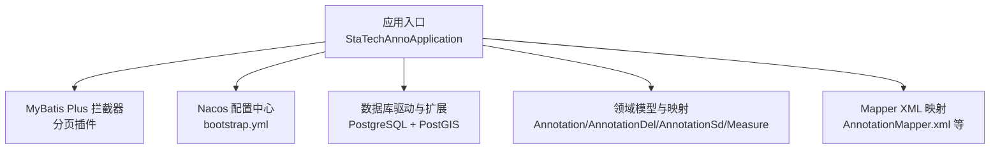
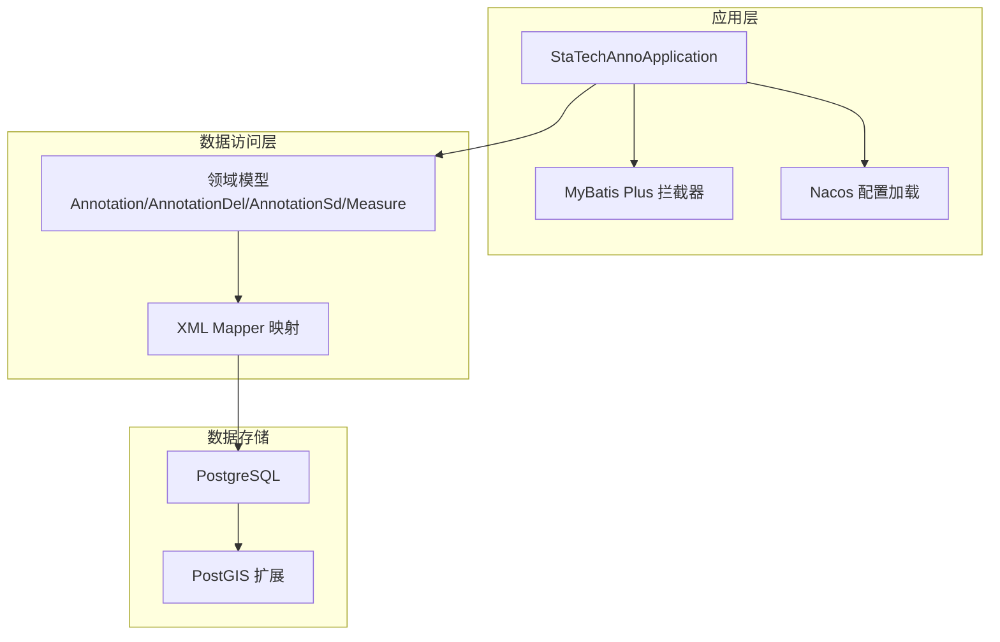
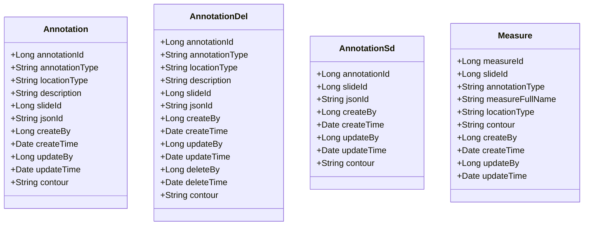
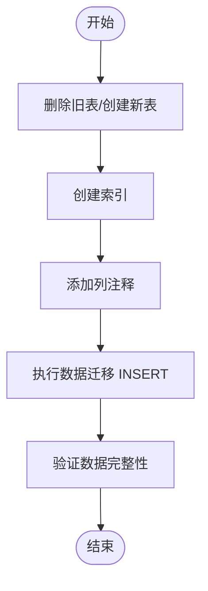
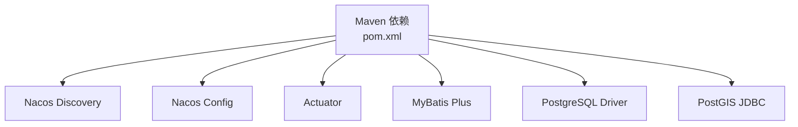

# 数据库配置

<cite>
**本文引用的文件**
- [bootstrap.yml](file://src/main/resources/bootstrap.yml)
- [pom.xml](file://pom.xml)
- [StaTechAnnoApplication.java](file://src/main/java/cn/staitech/annotation/StaTechAnnoApplication.java)
- [InitializinConfig.java](file://src/main/java/cn/staitech/annotation/config/InitializinConfig.java)
- [update_pg_v2.6.0.sql](file://sql/update_pg_v2.6.0.sql)
- [Annotation.java](file://src/main/java/cn/staitech/annotation/domain/Annotation.java)
- [AnnotationDel.java](file://src/main/java/cn/staitech/annotation/domain/AnnotationDel.java)
- [AnnotationSd.java](file://src/main/java/cn/staitech/annotation/domain/AnnotationSd.java)
- [Measure.java](file://src/main/java/cn/staitech/annotation/domain/Measure.java)
- [AnnotationMapper.xml](file://src/main/resources/mapper/AnnotationMapper.xml)
- [AnnotationDelMapper.xml](file://src/main/resources/mapper/AnnotationDelMapper.xml)
- [AnnotationSdMapper.xml](file://src/main/resources/mapper/AnnotationSdMapper.xml)
- [MeasureMapper.xml](file://src/main/resources/mapper/MeasureMapper.xml)
</cite>

## 目录
1. [简介](#简介)
2. [项目结构](#项目结构)
3. [核心组件](#核心组件)
4. [架构总览](#架构总览)
5. [详细组件分析](#详细组件分析)
6. [依赖分析](#依赖分析)
7. [性能考虑](#性能考虑)
8. [故障排查指南](#故障排查指南)
9. [结论](#结论)
10. [附录](#附录)

## 简介
本文件面向医学图像标注系统后端模块，聚焦数据库与持久层配置，围绕以下目标展开：
- 在 Spring Cloud Alibaba Nacos 配置中心中如何集中管理数据库连接配置（含连接池参数、事务配置等）
- MyBatis Plus 的关键配置（分页插件、自动字段填充等）
- 数据库初始化脚本的使用方法与版本升级策略
- 不同数据库环境（PostgreSQL/MySQL）的配置差异与迁移方案
- 数据库性能优化与连接监控建议

## 项目结构
该模块基于 Spring Boot 与 MyBatis Plus，通过 Nacos 进行配置中心与服务发现，使用 PostgreSQL 驱动与 PostGIS 扩展支持几何类型存储。

图表来源
- [StaTechAnnoApplication.java:44-49](file://src/main/java/cn/staitech/annotation/StaTechAnnoApplication.java#L44-L49)
- [bootstrap.yml:20-41](file://src/main/resources/bootstrap.yml#L20-L41)
- [pom.xml:112-116](file://pom.xml#L112-L116)
- [pom.xml:107-110](file://pom.xml#L107-L110)

章节来源
- [bootstrap.yml:1-42](file://src/main/resources/bootstrap.yml#L1-L42)
- [pom.xml:19-134](file://pom.xml#L19-L134)

## 核心组件
- Nacos 配置中心接入：通过 bootstrap.yml 声明 Nacos 地址、命名空间、分组及共享配置加载，实现配置集中化与多环境隔离。
- MyBatis Plus 分页拦截器：在应用入口显式注册分页插件，确保所有分页查询统一生效。
- 数据库驱动与扩展：引入 PostgreSQL 驱动与 PostGIS JDBC，支撑几何类型字段存储与查询。
- 领域模型与映射：通过实体类与 XML Mapper 定义表结构、字段映射与索引策略。

章节来源
- [bootstrap.yml:20-41](file://src/main/resources/bootstrap.yml#L20-L41)
- [StaTechAnnoApplication.java:44-49](file://src/main/java/cn/staitech/annotation/StaTechAnnoApplication.java#L44-L49)
- [pom.xml:107-116](file://pom.xml#L107-L116)
- [pom.xml:107-110](file://pom.xml#L107-L110)

## 架构总览
下图展示应用与配置中心、数据库及几何扩展之间的关系：

图表来源
- [StaTechAnnoApplication.java:34-50](file://src/main/java/cn/staitech/annotation/StaTechAnnoApplication.java#L34-L50)
- [Annotation.java:22](file://src/main/java/cn/staitech/annotation/domain/Annotation.java#L22)
- [AnnotationDel.java:11](file://src/main/java/cn/staitech/annotation/domain/AnnotationDel.java#L11)
- [AnnotationSd.java:16](file://src/main/java/cn/staitech/annotation/domain/AnnotationSd.java#L16)
- [Measure.java:19](file://src/main/java/cn/staitech/annotation/domain/Measure.java#L19)
- [AnnotationMapper.xml](file://src/main/resources/mapper/AnnotationMapper.xml)
- [AnnotationDelMapper.xml](file://src/main/resources/mapper/AnnotationDelMapper.xml)
- [AnnotationSdMapper.xml](file://src/main/resources/mapper/AnnotationSdMapper.xml)
- [MeasureMapper.xml](file://src/main/resources/mapper/MeasureMapper.xml)

## 详细组件分析

### Spring Cloud Alibaba 配置中心中的数据库连接配置
- 配置中心地址与命名空间：通过 bootstrap.yml 中的 Nacos 配置项声明，支持按环境切换命名空间与分组。
- 多环境 Profile：pom.xml 中定义了开发、测试、生产三套 Profile，分别指定不同的 Nacos 地址与命名空间，便于在不同环境加载对应配置。
- 共享配置：bootstrap.yml 使用 shared-configs 加载带环境变量的配置文件，实现配置集中化与动态刷新的基础能力。

建议在配置中心中新增数据库连接配置（示例键名，具体以实际为准）：
- spring.datasource.url
- spring.datasource.username
- spring.datasource.password
- spring.datasource.type
- spring.datasource.hikari.*（连接池参数）
- spring.flyway.locations（如使用 Flyway）

章节来源
- [bootstrap.yml:20-41](file://src/main/resources/bootstrap.yml#L20-L41)
- [pom.xml:226-263](file://pom.xml#L226-L263)

### MyBatis Plus 配置与使用
- 分页插件：在应用入口注册 MyBatis Plus 拦截器，并添加分页内部拦截器，确保分页查询统一处理。
- 自动字段填充：实体类中存在 createBy、createTime、updateBy、updateTime 等字段，可结合元对象处理器实现自动填充；当前仓库未直接展示元对象处理器实现，需在业务侧补充。
- 几何字段映射：实体类中 contour 字段映射至数据库 geometry 类型，需确保数据库驱动与类型处理器正确配置。

图表来源
- [Annotation.java:22-82](file://src/main/java/cn/staitech/annotation/domain/Annotation.java#L22-L82)
- [AnnotationDel.java:11-96](file://src/main/java/cn/staitech/annotation/domain/AnnotationDel.java#L11-L96)
- [AnnotationSd.java:16-82](file://src/main/java/cn/staitech/annotation/domain/AnnotationSd.java#L16-L82)
- [Measure.java:19-152](file://src/main/java/cn/staitech/annotation/domain/Measure.java#L19-L152)

章节来源
- [StaTechAnnoApplication.java:44-49](file://src/main/java/cn/staitech/annotation/StaTechAnnoApplication.java#L44-L49)
- [Annotation.java:22-82](file://src/main/java/cn/staitech/annotation/domain/Annotation.java#L22-L82)
- [AnnotationDel.java:11-96](file://src/main/java/cn/staitech/annotation/domain/AnnotationDel.java#L11-L96)
- [AnnotationSd.java:16-82](file://src/main/java/cn/staitech/annotation/domain/AnnotationSd.java#L16-L82)
- [Measure.java:19-152](file://src/main/java/cn/staitech/annotation/domain/Measure.java#L19-L152)

### 数据库初始化与版本升级策略
- 初始化脚本：提供 PostgreSQL 脚本用于创建标注与测量相关表、索引与注释，覆盖主表、删除归档表与测量表。
- 版本升级：脚本中包含从旧表迁移数据的 INSERT 语句，体现版本升级时的数据迁移策略。
- 建议：在生产环境中，使用数据库迁移工具（如 Flyway/Liquibase）管理版本变更，配合配置中心的 flyway.locations 指定迁移脚本位置，确保升级过程可追踪、可回滚。

图表来源
- [update_pg_v2.6.0.sql:1-245](file://sql/update_pg_v2.6.0.sql#L1-L245)

章节来源
- [update_pg_v2.6.0.sql:1-245](file://sql/update_pg_v2.6.0.sql#L1-L245)

### 不同数据库环境的配置差异与迁移方案
- PostgreSQL 与 PostGIS：当前依赖明确引入 PostgreSQL 驱动与 PostGIS JDBC，几何类型字段通过数据库原生 geometry 存储。
- MySQL 迁移要点（概念性说明）：
  - 将 geometry 类型替换为对应的 MySQL 空间数据类型（如 geometry、point、polygon 等），并引入 MySQL 空间函数支持。
  - 修改分页方言与 SQL 语法适配（MyBatis Plus 默认分页方言需确认是否兼容）。
  - 连接池参数与事务隔离级别在不同数据库上可能存在差异，需分别校验。
- 迁移流程建议：
  - 使用数据库迁移工具（Flyway/Liquibase）维护跨库迁移脚本。
  - 在配置中心按环境区分数据库类型与方言配置，避免硬编码。
  - 通过灰度发布逐步切换流量，配合回滚策略保障稳定性。

[本节为概念性内容，不直接分析具体文件，故无“章节来源”]

### 事务配置与连接池参数
- 事务管理：应用启用注解式事务管理，事务边界由业务层方法控制。
- 连接池参数：建议在配置中心集中管理 HikariCP 参数（如连接超时、空闲超时、最大池大小、最小空闲等），并按环境调优。
- 事务传播与隔离：根据业务需求设置合理的传播行为与隔离级别，避免长事务与死锁。

章节来源
- [StaTechAnnoApplication.java:32-33](file://src/main/java/cn/staitech/annotation/StaTechAnnoApplication.java#L32-L33)

## 依赖分析
- 配置中心与服务发现：Nacos Discovery 与 Nacos Config 启用，支持配置集中化与服务注册。
- 数据库驱动：PostgreSQL 驱动与 PostGIS JDBC，满足几何类型存储需求。
- MyBatis Plus：提供分页与通用 CRUD 能力，结合拦截器实现全局分页。
- Actuator：提供健康检查与指标暴露，便于连接监控与运维。

图表来源
- [pom.xml:19-134](file://pom.xml#L19-L134)

章节来源
- [pom.xml:19-134](file://pom.xml#L19-L134)

## 性能考虑
- 连接池参数：根据 QPS 与并发线程数调整连接池大小、超时与回收策略，避免连接泄漏与抖动。
- SQL 优化：为高频查询字段建立合适索引（如 annotation_type、slide_id、location_type、measure_full_name 等），减少全表扫描。
- 分页策略：对大数据量表进行分页查询时，优先使用覆盖索引与游标分页，降低排序成本。
- 几何查询：PostGIS 查询建议使用空间索引（GIST）与合理范围过滤，避免对大范围几何字段进行全量扫描。
- 监控与告警：通过 Actuator 暴露指标，结合外部监控平台（Prometheus/Grafana）观察连接池利用率、慢查询与错误率。

[本节提供通用指导，不直接分析具体文件，故无“章节来源”]

## 故障排查指南
- 连接失败：检查 Nacos 配置中心连通性与命名空间/分组配置；核对数据库地址、账号与密码。
- 连接池异常：查看连接池指标与日志，确认最大连接数、空闲超时与连接泄漏情况。
- 几何类型异常：确认 PostGIS 扩展已启用且版本兼容，几何字段序列化/反序列化处理器正确配置。
- 分页失效：确认分页拦截器已在应用入口注册，且业务未绕过拦截器。
- 数据迁移问题：核对迁移脚本执行顺序与目标表结构，关注数据类型转换与约束冲突。

章节来源
- [bootstrap.yml:20-41](file://src/main/resources/bootstrap.yml#L20-L41)
- [InitializinConfig.java:23-28](file://src/main/java/cn/staitech/annotation/config/InitializinConfig.java#L23-L28)

## 结论
本模块通过 Nacos 实现配置集中化，结合 MyBatis Plus 分页拦截器与 PostgreSQL/PostGIS 支持，满足医学图像标注场景下的几何数据存储与查询需求。建议进一步完善自动字段填充、连接池与事务参数的集中化配置，并采用数据库迁移工具规范版本升级流程，持续优化索引与查询性能，配合监控体系保障生产稳定运行。

[本节为总结性内容，不直接分析具体文件，故无“章节来源”]

## 附录

### 关键配置清单（示例）
- Nacos 配置项（示例键名）
  - spring.cloud.nacos.config.server-addr
  - spring.cloud.nacos.config.namespace
  - spring.cloud.nacos.config.group
  - spring.cloud.nacos.config.shared-configs
  - spring.datasource.url
  - spring.datasource.username
  - spring.datasource.password
  - spring.datasource.type
  - spring.datasource.hikari.*
  - spring.flyway.locations
- 应用级配置
  - MyBatis Plus 分页拦截器已注册
  - 事务管理已启用
  - Mapper 扫描包已配置

章节来源
- [bootstrap.yml:20-41](file://src/main/resources/bootstrap.yml#L20-L41)
- [StaTechAnnoApplication.java:44-49](file://src/main/java/cn/staitech/annotation/StaTechAnnoApplication.java#L44-L49)
- [pom.xml:112-116](file://pom.xml#L112-L116)
- [pom.xml:107-110](file://pom.xml#L107-L110)