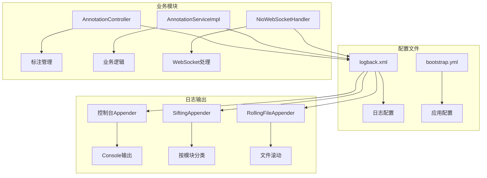
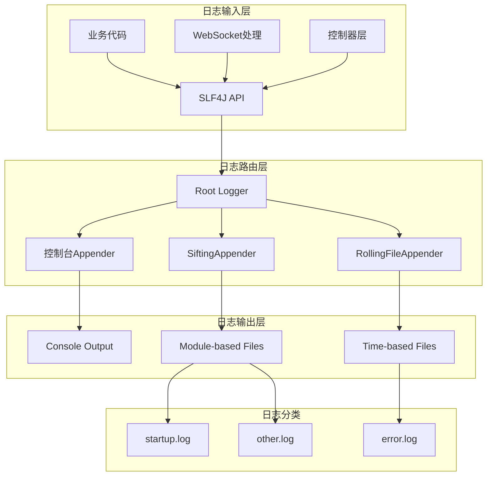
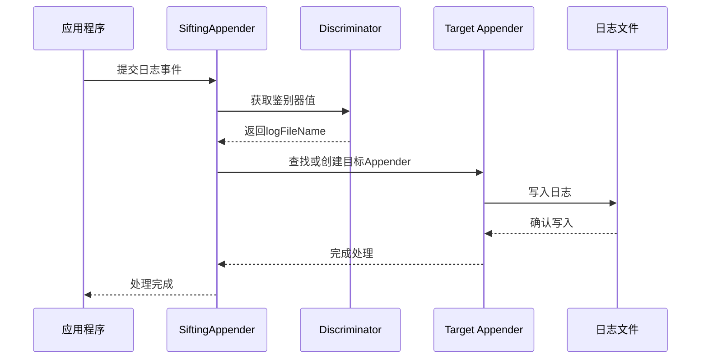
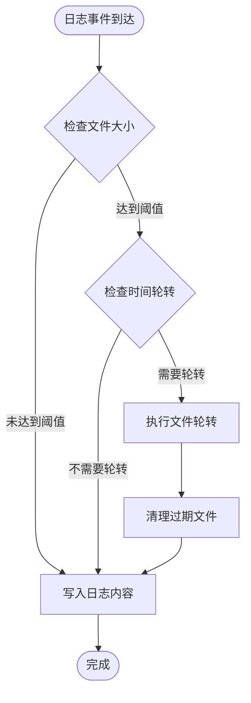
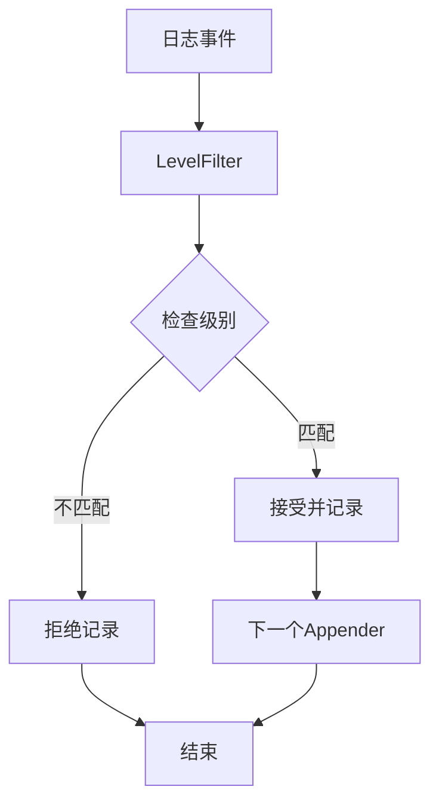
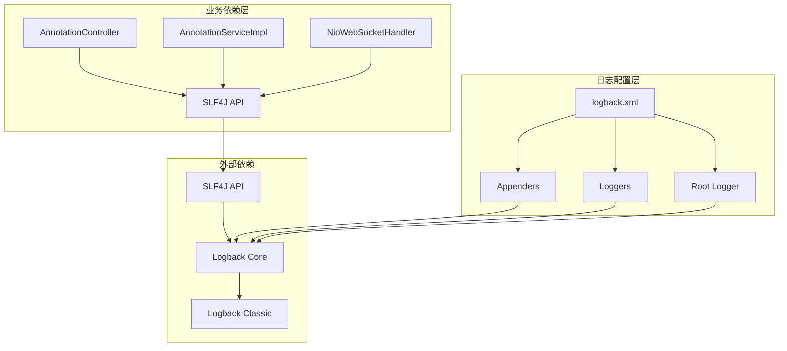

# 日志配置

<cite>
**本文引用的文件**
- [logback.xml](file://src/main/resources/logback.xml)
- [bootstrap.yml](file://src/main/resources/bootstrap.yml)
- [StaTechAnnoApplication.java](file://src/main/java/cn/staitech/annotation/StaTechAnnoApplication.java)
- [AnnotationController.java](file://src/main/java/cn/staitech/annotation/controller/AnnotationController.java)
- [AnnotationServiceImpl.java](file://src/main/java/cn/staitech/annotation/service/impl/AnnotationServiceImpl.java)
- [NioWebSocketHandler.java](file://src/main/java/cn/staitech/annotation/netty/websocket/NioWebSocketHandler.java)
- [pom.xml](file://pom.xml)
</cite>

## 目录
1. [简介](#简介)
2. [项目结构](#项目结构)
3. [核心组件](#核心组件)
4. [架构概览](#架构概览)
5. [详细组件分析](#详细组件分析)
6. [依赖关系分析](#依赖关系分析)
7. [性能考虑](#性能考虑)
8. [故障排除指南](#故障排除指南)
9. [结论](#结论)

## 简介

本文件为医学图像标注系统提供完整的日志配置详细文档。该系统采用Logback作为日志框架，实现了多维度的日志管理策略，包括控制台输出、文件滚动、按模块分类记录等功能。系统通过精心设计的日志配置，为开发、测试、生产环境提供了差异化的日志级别和输出策略，确保了系统的可观测性和可维护性。

## 项目结构

医学图像标注系统的日志配置位于资源目录下，与Spring Boot的标准配置保持一致。系统采用分层架构设计，日志配置文件与业务逻辑分离，便于维护和扩展。



**图表来源**
- [logback.xml:1-101](file://src/main/resources/logback.xml#L1-L101)
- [AnnotationController.java:1-251](file://src/main/java/cn/staitech/annotation/controller/AnnotationController.java#L1-L251)

**章节来源**
- [logback.xml:1-101](file://src/main/resources/logback.xml#L1-L101)
- [bootstrap.yml:1-42](file://src/main/resources/bootstrap.yml#L1-L42)

## 核心组件

### 日志配置基础结构

系统采用Logback配置文件作为核心配置入口，支持动态扫描和调试功能。配置文件定义了日志存储路径、输出格式模板，并建立了多种日志输出通道。

**日志存储路径配置**
- 存储位置：`logs/staitech-anno`
- 输出格式：包含时间戳、线程信息、追踪ID、日志级别、类名、方法名、行号和消息内容

**日志输出格式详解**
- 时间戳：精确到毫秒的HH:mm:ss.SSS格式
- 线程信息：显示当前执行线程名称
- 追踪ID：支持分布式链路追踪的trace_id上下文
- 日志级别：左对齐的五字符宽度级别标识
- 类名：限制20字符长度的包名+类名
- 方法信息：方法名和行号
- 消息内容：实际的日志输出

**章节来源**
- [logback.xml:2-6](file://src/main/resources/logback.xml#L2-L6)

### 控制台输出组件

控制台Appender负责将日志直接输出到标准输出流，适用于开发和测试环境的实时监控。

**控制台输出特性**
- 实时性：日志立即显示，便于开发调试
- 可读性：完整的日志格式，包含所有上下文信息
- 性能：低延迟输出，适合快速反馈

**章节来源**
- [logback.xml:8-13](file://src/main/resources/logback.xml#L8-L13)

### 文件滚动组件

系统实现了两种主要的文件滚动策略：基于时间的滚动和基于模块的分类滚动。

**时间滚动策略**
- 文件命名：`error.%d{yyyy-MM-dd}.log`
- 历史保留：最多60天
- 级别过滤：仅记录ERROR级别及以上的日志

**模块分类策略**
- 动态分类：通过`logFileName`鉴别器实现
- 历史保留：最多2天
- 自动创建：按需创建对应模块的日志目录

**章节来源**
- [logback.xml:38-58](file://src/main/resources/logback.xml#L38-L58)
- [logback.xml:59-83](file://src/main/resources/logback.xml#L59-L83)

### 日志级别控制

系统通过多个logger节点实现精细化的日志级别控制，针对不同模块和框架设置了合适的默认级别。

**模块级控制**
- 项目根包：`cn.staitech` 设置为DEBUG级别
- Spring框架：`org.springframework` 设置为INFO级别
- Nacos客户端：`com.alibaba.cloud.nacos.client` 设置为INFO级别
- Spring MVC：`org.springframework.web` 设置为DEBUG级别

**章节来源**
- [logback.xml:85-94](file://src/main/resources/logback.xml#L85-L94)

## 架构概览

系统日志架构采用多通道输出设计，结合静态配置和动态分类，实现了灵活的日志管理策略。



**图表来源**
- [logback.xml:96-99](file://src/main/resources/logback.xml#L96-L99)
- [logback.xml:59-83](file://src/main/resources/logback.xml#L59-L83)

## 详细组件分析

### 控制台Appender分析

控制台Appender是系统中最简单的日志输出组件，直接将日志写入标准输出流。

```mermaid
classDiagram
class ConsoleAppender {
+encoder : PatternLayoutEncoder
+immediateFlush : true
+withJansi : false
+doEncode(logEvent) void
}
class PatternLayoutEncoder {
+pattern : ${log.pattern}
+charset : UTF-8
+doEncode(logEvent) void
}
ConsoleAppender --> PatternLayoutEncoder : uses
note for ConsoleAppender "用于开发和测试环境的实时日志输出"
```

**图表来源**
- [logback.xml:9-13](file://src/main/resources/logback.xml#L9-L13)

**章节来源**
- [logback.xml:9-13](file://src/main/resources/logback.xml#L9-L13)

### SiftingAppender分析

SiftingAppender是系统的核心创新组件，实现了基于上下文的动态日志分类。



**图表来源**
- [logback.xml:59-83](file://src/main/resources/logback.xml#L59-L83)

**SiftingAppender工作原理**
- 鉴别器：通过`logFileName`键获取上下文值
- 默认值：当未指定时，默认使用`startup`
- 动态创建：按需为每个模块创建独立的文件Appender
- 路径结构：`logs/staitech-anno/${logFileName}/${logFileName}.info.log`

**章节来源**
- [logback.xml:59-83](file://src/main/resources/logback.xml#L59-L83)

### RollingFileAppender分析

RollingFileAppender实现了基于时间的文件滚动策略，确保日志文件不会无限增长。



**图表来源**
- [logback.xml:38-58](file://src/main/resources/logback.xml#L38-L58)

**滚动策略配置**
- 时间基：基于日期进行文件轮转
- 文件命名：`error.%d{yyyy-MM-dd}.log`
- 历史保留：最多60天
- 级别过滤：仅记录ERROR级别

**章节来源**
- [logback.xml:38-58](file://src/main/resources/logback.xml#L38-L58)

### 日志级别过滤机制

系统通过LevelFilter实现精确的日志级别控制，确保只记录符合要求的日志。



**图表来源**
- [logback.xml:28-35](file://src/main/resources/logback.xml#L28-L35)
- [logback.xml:50-57](file://src/main/resources/logback.xml#L50-L57)

**章节来源**
- [logback.xml:28-35](file://src/main/resources/logback.xml#L28-L35)
- [logback.xml:50-57](file://src/main/resources/logback.xml#L50-L57)

## 依赖关系分析

系统日志配置与业务模块之间存在紧密的依赖关系，通过SLF4J API实现松耦合的日志记录。



**图表来源**
- [AnnotationController.java:39](file://src/main/java/cn/staitech/annotation/controller/AnnotationController.java#L39)
- [AnnotationServiceImpl.java:25](file://src/main/java/cn/staitech/annotation/service/impl/AnnotationServiceImpl.java#L25)
- [NioWebSocketHandler.java:39](file://src/main/java/cn/staitech/annotation/netty/websocket/NioWebSocketHandler.java#L39)

**依赖关系特点**
- 松耦合：业务代码通过SLF4J API记录日志，不直接依赖具体实现
- 可替换性：可以在不修改业务代码的情况下更换日志实现
- 统一接口：所有业务模块使用相同的日志API

**章节来源**
- [AnnotationController.java:39](file://src/main/java/cn/staitech/annotation/controller/AnnotationController.java#L39)
- [AnnotationServiceImpl.java:25](file://src/main/java/cn/staitech/annotation/service/impl/AnnotationServiceImpl.java#L25)
- [NioWebSocketHandler.java:39](file://src/main/java/cn/staitech/annotation/netty/websocket/NioWebSocketHandler.java#L39)

## 性能考虑

### 日志级别优化

系统根据不同环境和需求设置了差异化的日志级别策略：

**开发环境建议**
- 项目包级别：DEBUG
- Spring框架：DEBUG  
- Spring MVC：DEBUG
- 优点：详细的问题诊断信息
- 缺点：较高的性能开销

**生产环境建议**
- 项目包级别：INFO
- Spring框架：WARN
- Spring MVC：WARN
- 优点：较低的性能影响
- 缺点：较少的调试信息

**章节来源**
- [logback.xml:85-94](file://src/main/resources/logback.xml#L85-L94)

### 输出性能优化

**控制台输出优化**
- 异步输出：考虑使用异步Appender减少阻塞
- 批量写入：合理设置缓冲区大小
- 过滤策略：在Appender层面进行级别过滤

**文件输出优化**
- 延迟刷新：设置适当的flush间隔
- 压缩策略：启用GZIP压缩减少磁盘占用
- 分割策略：合理设置文件大小阈值

### 内存使用优化

**日志缓冲区**
- 合理设置队列大小避免内存溢出
- 实现适当的丢弃策略
- 监控内存使用情况

**对象池化**
- 复用日志事件对象
- 减少垃圾回收压力
- 优化字符串处理

## 故障排除指南

### 常见问题诊断

**日志不输出问题**
1. 检查Root Logger级别设置
2. 验证Appender引用配置
3. 确认文件权限和路径存在

**日志格式异常**
1. 检查PatternLayout配置
2. 验证占位符使用正确性
3. 确认编码格式设置

**性能问题排查**
1. 分析日志级别设置
2. 检查Appender配置
3. 监控磁盘空间使用

### 调试技巧

**开发阶段调试**
- 使用DEBUG级别获取详细信息
- 启用Spring MVC调试日志
- 监控WebSocket连接状态

**生产环境监控**
- 设置合理的ERROR级别告警
- 监控关键业务流程日志
- 建立日志聚合和分析系统

**章节来源**
- [AnnotationServiceImpl.java:378](file://src/main/java/cn/staitech/annotation/service/impl/AnnotationServiceImpl.java#L378)
- [NioWebSocketHandler.java:46](file://src/main/java/cn/staitech/annotation/netty/websocket/NioWebSocketHandler.java#L46)

## 结论

医学图像标注系统的日志配置展现了现代Java应用的日志管理最佳实践。通过Logback的强大功能，系统实现了：

1. **多层次的日志输出**：控制台、文件、网络等多种输出方式
2. **智能化的日志分类**：基于模块的动态分类和基于时间的滚动策略
3. **精细化的日志控制**：针对不同模块和环境的差异化配置
4. **高性能的日志处理**：平衡性能和功能的优化策略

该配置体系为系统的稳定运行提供了坚实的基础，既满足了开发调试的需求，又保证了生产环境的高效运行。通过合理的日志管理策略，系统能够有效支持医学图像标注这一高精度应用的复杂需求。