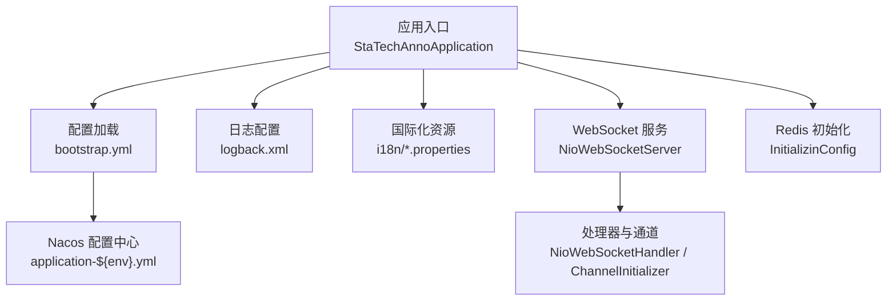
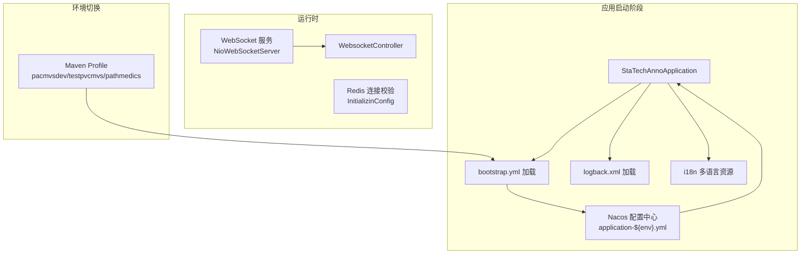
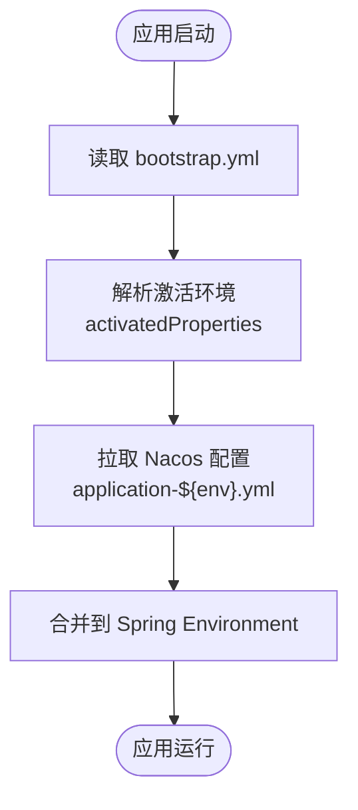
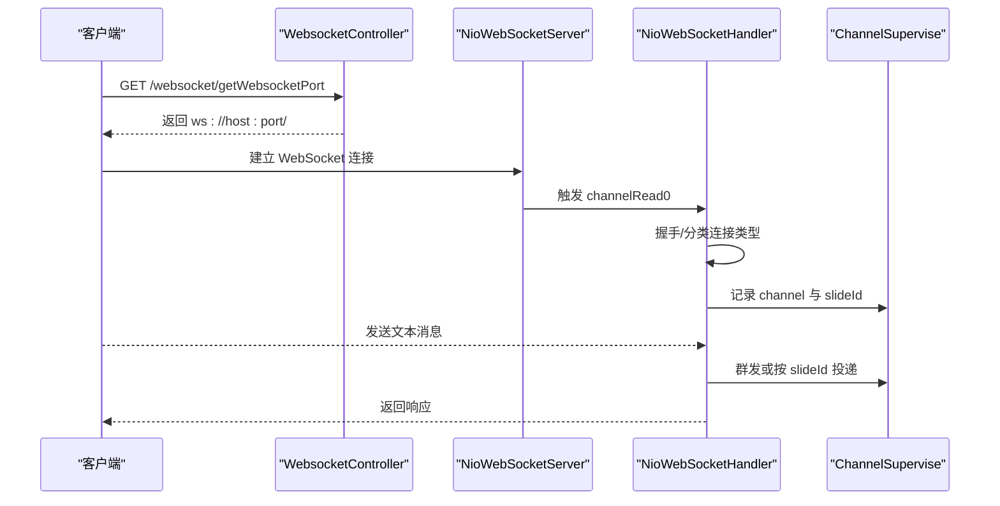
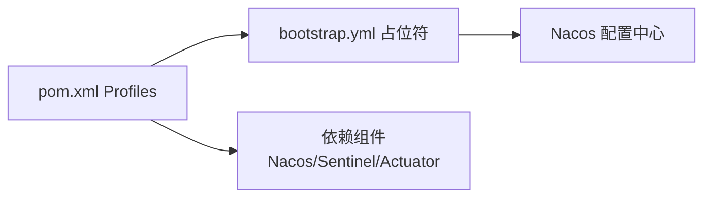

# 配置管理

<cite>
**本文引用的文件**
- [bootstrap.yml](file://src/main/resources/bootstrap.yml)
- [logback.xml](file://src/main/resources/logback.xml)
- [pom.xml](file://pom.xml)
- [InitializinConfig.java](file://src/main/java/cn/staitech/annotation/config/InitializinConfig.java)
- [NioWebSocketServer.java](file://src/main/java/cn/staitech/annotation/netty/websocket/NioWebSocketServer.java)
- [NioWebSocketHandler.java](file://src/main/java/cn/staitech/annotation/netty/websocket/NioWebSocketHandler.java)
- [NioWebSocketChannelInitializer.java](file://src/main/java/cn/staitech/annotation/netty/websocket/NioWebSocketChannelInitializer.java)
- [ChannelSupervise.java](file://src/main/java/cn/staitech/annotation/netty/global/ChannelSupervise.java)
- [WebsocketController.java](file://src/main/java/cn/staitech/annotation/controller/WebsocketController.java)
- [messages.properties](file://src/main/resources/i18n/messages.properties)
- [messages_en.properties](file://src/main/resources/i18n/messages_en.properties)
- [messages_zh.properties](file://src/main/resources/i18n/messages_zh.properties)
- [StaTechAnnoApplication.java](file://src/main/java/cn/staitech/annotation/StaTechAnnoApplication.java)
</cite>

## 目录
1. [简介](#简介)
2. [项目结构](#项目结构)
3. [核心组件](#核心组件)
4. [架构总览](#架构总览)
5. [详细组件分析](#详细组件分析)
6. [依赖关系分析](#依赖关系分析)
7. [性能考量](#性能考量)
8. [故障排查指南](#故障排查指南)
9. [结论](#结论)
10. [附录](#附录)

## 简介
本文件面向医学图像标注系统，聚焦于配置管理与动态配置更新能力，重点说明以下内容：
- Spring Cloud Alibaba 配置中心与 Nacos 的集成方式与参数含义
- bootstrap.yml 中的关键配置项（应用名、环境、Nacos 地址、命名空间、分组、共享配置）
- 日志、国际化、WebSocket、Redis 连接校验等配置要点
- 不同环境（开发/测试/生产）的 profile 差异与切换方法
- 动态配置更新的实现原理与使用注意事项

## 项目结构
系统采用 Spring Boot + Spring Cloud Alibaba 架构，资源目录中包含：
- 配置层：bootstrap.yml（应用级与 Nacos 配置）、logback.xml（日志）
- 国际化：i18n 下的多语言属性文件
- WebSocket：Netty 实现的独立 WebSocket 服务与控制器
- Redis：通过初始化 Bean 对 Lettuce 连接进行校验
- Maven Profile：按环境注入 Nacos 地址、命名空间、分组与激活的环境标识

图示来源
- [StaTechAnnoApplication.java:25-34](file://src/main/java/cn/staitech/annotation/StaTechAnnoApplication.java#L25-L34)
- [bootstrap.yml:17-41](file://src/main/resources/bootstrap.yml#L17-L41)
- [logback.xml:1-101](file://src/main/resources/logback.xml#L1-L101)
- [messages.properties:1-328](file://src/main/resources/i18n/messages.properties#L1-L328)
- [NioWebSocketServer.java:14-43](file://src/main/java/cn/staitech/annotation/netty/websocket/NioWebSocketServer.java#L14-L43)
- [NioWebSocketHandler.java:27-196](file://src/main/java/cn/staitech/annotation/netty/websocket/NioWebSocketHandler.java#L27-L196)
- [NioWebSocketChannelInitializer.java:13-28](file://src/main/java/cn/staitech/annotation/netty/websocket/NioWebSocketChannelInitializer.java#L13-L28)
- [InitializinConfig.java:15-31](file://src/main/java/cn/staitech/annotation/config/InitializinConfig.java#L15-L31)

章节来源
- [bootstrap.yml:17-41](file://src/main/resources/bootstrap.yml#L17-L41)
- [pom.xml:225-264](file://pom.xml#L225-L264)

## 核心组件
- Nacos 配置中心集成
  - 通过 spring.cloud.nacos.config.* 参数指定配置中心地址、命名空间、分组与文件扩展名
  - 使用 shared-configs 引入 application-${spring.profiles.active}.${file-extension}，实现按环境加载
  - 通过 Maven Profile 注入 serverAddr、nacosNamespace、nacosGroup、activatedProperties 等占位符
- 日志配置
  - logback.xml 定义日志路径、输出格式、滚动策略与级别控制；开启 Nacos 客户端日志便于调试
- 国际化
  - basename 指向 i18n/messages，缓存秒数、编码与回退策略可配置
  - 多语言属性文件提供默认与英文版本
- WebSocket
  - Netty 实现独立 WebSocket 服务，端口由配置项 netty.port 提供
  - 通过 WebsocketController 暴露 ws://host:port/ 的访问地址
- Redis
  - 启动阶段对 Lettuce 连接启用 validateConnection，提升连接稳定性

章节来源
- [bootstrap.yml:8-41](file://src/main/resources/bootstrap.yml#L8-L41)
- [logback.xml:1-101](file://src/main/resources/logback.xml#L1-L101)
- [messages.properties:1-328](file://src/main/resources/i18n/messages.properties#L1-L328)
- [messages_en.properties:1-323](file://src/main/resources/i18n/messages_en.properties#L1-L323)
- [messages_zh.properties:1-324](file://src/main/resources/i18n/messages_zh.properties#L1-L324)
- [NioWebSocketServer.java:16](file://src/main/java/cn/staitech/annotation/netty/websocket/NioWebSocketServer.java#L16)
- [WebsocketController.java:24-37](file://src/main/java/cn/staitech/annotation/controller/WebsocketController.java#L24-L37)
- [InitializinConfig.java:23-29](file://src/main/java/cn/staitech/annotation/config/InitializinConfig.java#L23-L29)

## 架构总览
下图展示配置加载与动态更新在系统中的位置与交互：

图示来源
- [StaTechAnnoApplication.java:25-34](file://src/main/java/cn/staitech/annotation/StaTechAnnoApplication.java#L25-L34)
- [bootstrap.yml:17-41](file://src/main/resources/bootstrap.yml#L17-L41)
- [logback.xml:1-101](file://src/main/resources/logback.xml#L1-L101)
- [messages.properties:1-328](file://src/main/resources/i18n/messages.properties#L1-L328)
- [NioWebSocketServer.java:14-43](file://src/main/java/cn/staitech/annotation/netty/websocket/NioWebSocketServer.java#L14-L43)
- [WebsocketController.java:20-37](file://src/main/java/cn/staitech/annotation/controller/WebsocketController.java#L20-L37)
- [InitializinConfig.java:15-31](file://src/main/java/cn/staitech/annotation/config/InitializinConfig.java#L15-L31)
- [pom.xml:225-264](file://pom.xml#L225-L264)

## 详细组件分析

### Nacos 配置中心与 bootstrap.yml
- 关键参数说明
  - spring.application.name：应用名
  - spring.profiles.active：激活的环境标识（由 Maven Profile 注入）
  - spring.cloud.nacos.config.server-addr：Nacos 配置中心地址
  - spring.cloud.nacos.config.namespace/group：命名空间与分组
  - spring.cloud.nacos.config.file-extension：配置文件格式（如 yml）
  - spring.cloud.nacos.config.shared-configs：共享配置列表，按环境加载 application-${env}.yml
  - spring.cloud.nacos.discovery.*：服务发现相关参数（与配置中心同源）
- 动态配置更新机制
  - 应用启动时从 Nacos 拉取对应环境的配置文件
  - 通过 Spring Cloud Alibaba 的配置刷新能力（如 @RefreshScope 或 Actuator）可实现热更新
  - 本仓库未显式声明 Actuator 依赖，建议在需要热更新时引入 actuator 并配合 Nacos 控制台或 API 触发刷新
- 环境差异与切换
  - 开发：pacmvsdev（serverAddr、namespace、group）
  - 测试：testpvcmvs（serverAddr、namespace、group）
  - 生产：pathmedics（serverAddr、namespace、group）

图示来源
- [bootstrap.yml:17-41](file://src/main/resources/bootstrap.yml#L17-L41)
- [pom.xml:225-264](file://pom.xml#L225-L264)

章节来源
- [bootstrap.yml:8-41](file://src/main/resources/bootstrap.yml#L8-L41)
- [pom.xml:225-264](file://pom.xml#L225-L264)

### 日志配置（Logback）
- 主要特性
  - 日志路径与输出格式通过 property 统一管理
  - 控制台与滚动文件输出分离，支持按级别过滤
  - 开启 Nacos 客户端日志（com.alibaba.cloud.nacos.client），便于定位配置加载问题
- 最佳实践
  - 在生产环境建议开启滚动策略与最大保留天数
  - 为不同模块设置合适的 logger 级别，避免过度打印
  - 保持日志路径与容器/主机挂载一致，确保日志持久化

章节来源
- [logback.xml:1-101](file://src/main/resources/logback.xml#L1-L101)

### 国际化配置
- 配置要点
  - basename 指向 i18n/messages，缓存秒数、编码与回退策略可调
  - 多语言资源文件：messages.properties（默认）、messages_en.properties（英文）、messages_zh.properties（中文）
- 使用建议
  - 新增文案统一在 messages.properties 中维护，其他语言文件同步更新
  - 保持 key 唯一性，避免重复覆盖
  - 前端按当前 locale 获取对应文案，后端通过 MessageSource 获取

章节来源
- [bootstrap.yml:9-13](file://src/main/resources/bootstrap.yml#L9-L13)
- [messages.properties:1-328](file://src/main/resources/i18n/messages.properties#L1-L328)
- [messages_en.properties:1-323](file://src/main/resources/i18n/messages_en.properties#L1-L323)
- [messages_zh.properties:1-324](file://src/main/resources/i18n/messages_zh.properties#L1-L324)

### WebSocket 配置与实现
- 独立服务与端口
  - NioWebSocketServer 通过 @Value("${netty.port}") 读取端口并启动 Netty 服务
  - WebsocketController 提供接口返回 ws://host:port/ 访问地址
- 连接与消息处理
  - NioWebSocketHandler 支持握手、Ping/Pong、文本帧群发与按 slideId 精确投递
  - ChannelSupervise 维护连接与 slideId 映射，实现定向推送
- 最佳实践
  - 为不同业务场景划分 URI 路径（如 /slide/{id}），便于连接分类与限流
  - 对消息体进行严格校验与长度限制，防止内存溢出
  - 结合网关或反向代理暴露 WebSocket 服务，确保跨域与长连接稳定

图示来源
- [WebsocketController.java:20-37](file://src/main/java/cn/staitech/annotation/controller/WebsocketController.java#L20-L37)
- [NioWebSocketServer.java:14-43](file://src/main/java/cn/staitech/annotation/netty/websocket/NioWebSocketServer.java#L14-L43)
- [NioWebSocketHandler.java:94-196](file://src/main/java/cn/staitech/annotation/netty/websocket/NioWebSocketHandler.java#L94-L196)
- [NioWebSocketChannelInitializer.java:13-28](file://src/main/java/cn/staitech/annotation/netty/websocket/NioWebSocketChannelInitializer.java#L13-L28)
- [ChannelSupervise.java:17-44](file://src/main/java/cn/staitech/annotation/netty/global/ChannelSupervise.java#L17-L44)

章节来源
- [NioWebSocketServer.java:16](file://src/main/java/cn/staitech/annotation/netty/websocket/NioWebSocketServer.java#L16)
- [NioWebSocketHandler.java:167-196](file://src/main/java/cn/staitech/annotation/netty/websocket/NioWebSocketHandler.java#L167-L196)
- [ChannelSupervise.java:19-43](file://src/main/java/cn/staitech/annotation/netty/global/ChannelSupervise.java#L19-L43)
- [WebsocketController.java:24-37](file://src/main/java/cn/staitech/annotation/controller/WebsocketController.java#L24-L37)

### Redis 连接校验
- 实现方式
  - InitializinConfig 在 afterPropertiesSet 中检测 RedisConnectionFactory 是否为 Lettuce 类型，并开启 validateConnection
- 作用
  - 提升连接池健康度，减少无效连接带来的异常
- 注意事项
  - 若使用其他连接工厂（如 Jedis），需补充相应校验逻辑
  - 在高并发场景下，适当调整连接池大小与超时参数

章节来源
- [InitializinConfig.java:23-29](file://src/main/java/cn/staitech/annotation/config/InitializinConfig.java#L23-L29)

### 数据库与分页插件
- MyBatis-Plus 分页拦截器
  - 在应用入口注册 PaginationInnerInterceptor，实现分页查询的自动拦截与 SQL 改写
- 建议
  - 对大结果集分页查询增加索引与条件优化
  - 在高并发场景下评估分页深度与排序字段的性能影响

章节来源
- [StaTechAnnoApplication.java:44-49](file://src/main/java/cn/staitech/annotation/StaTechAnnoApplication.java#L44-L49)

## 依赖关系分析
- Maven Profile 与 Nacos 集成
  - 通过 <profile> 注入 serverAddr、nacosNamespace、nacosGroup、activatedProperties
  - bootstrap.yml 中以占位符形式引用上述属性，实现环境隔离
- 依赖组件
  - Spring Cloud Alibaba Nacos Discovery/Config
  - Knife4j 文档增强
  - Netty WebSocket 服务
  - Logback 日志
  - 国际化资源

图示来源
- [pom.xml:225-264](file://pom.xml#L225-L264)
- [bootstrap.yml:17-41](file://src/main/resources/bootstrap.yml#L17-L41)

章节来源
- [pom.xml:19-134](file://pom.xml#L19-L134)
- [pom.xml:225-264](file://pom.xml#L225-L264)
- [bootstrap.yml:17-41](file://src/main/resources/bootstrap.yml#L17-L41)

## 性能考量
- Nacos 配置中心
  - 建议开启配置缓存与合理的扫描周期，避免频繁拉取
  - 对大体量配置文件拆分为多个共享配置，按需加载
- WebSocket
  - 合理设置 Netty 线程池大小与背压策略，避免内存峰值
  - 对消息体进行压缩与长度限制，降低网络与 CPU 压力
- 日志
  - 生产环境建议将 info 以上级别落盘，减少磁盘 IO
  - 控制日志文件滚动大小与保留天数，平衡存储与排查成本
- Redis
  - validateConnection 会增加握手开销，建议结合连接池参数综合评估

## 故障排查指南
- Nacos 配置无法加载
  - 检查 spring.profiles.active 与 shared-configs 是否匹配
  - 确认 serverAddr、namespace、group 与 Maven Profile 一致
  - 查看 logback 中 com.alibaba.cloud.nacos.client 日志定位问题
- WebSocket 连接失败
  - 核对 WebsocketController 返回的端口与实际绑定端口一致
  - 检查 NioWebSocketHandler 握手逻辑与 URI 路径
  - 关注 Ping/Pong 心跳与连接生命周期日志
- Redis 连接异常
  - 确认 Lettuce 连接工厂已启用 validateConnection
  - 检查连接池参数与目标 Redis 实例状态
- 国际化文案缺失
  - 确认 basename 与资源文件命名一致
  - 检查浏览器/客户端 locale 设置与对应语言文件是否存在

章节来源
- [logback.xml:92](file://src/main/resources/logback.xml#L92)
- [bootstrap.yml:39-40](file://src/main/resources/bootstrap.yml#L39-L40)
- [NioWebSocketHandler.java:167-196](file://src/main/java/cn/staitech/annotation/netty/websocket/NioWebSocketHandler.java#L167-L196)
- [WebsocketController.java:24-37](file://src/main/java/cn/staitech/annotation/controller/WebsocketController.java#L24-L37)
- [InitializinConfig.java:23-29](file://src/main/java/cn/staitech/annotation/config/InitializinConfig.java#L23-L29)

## 结论
本系统通过 Maven Profile 与 Nacos 配置中心实现了环境隔离与配置集中管理，结合 Logback、国际化与 Netty WebSocket 形成了完整的运行时配置体系。建议在生产环境中完善动态刷新与可观测性配置，持续优化连接池与消息处理策略，以保障高并发场景下的稳定性与性能。

## 附录
- 环境切换步骤
  - 开发：mvn clean package -P pacmvsdev
  - 测试：mvn clean package -P testpvcmvs
  - 生产：mvn clean package -P pathmedics
- 动态配置更新建议
  - 引入 Spring Boot Actuator 与 @RefreshScope
  - 通过 Nacos 控制台或 API 修改配置后触发刷新
  - 对关键配置（如数据库、Redis、WebSocket 端口）变更进行灰度验证