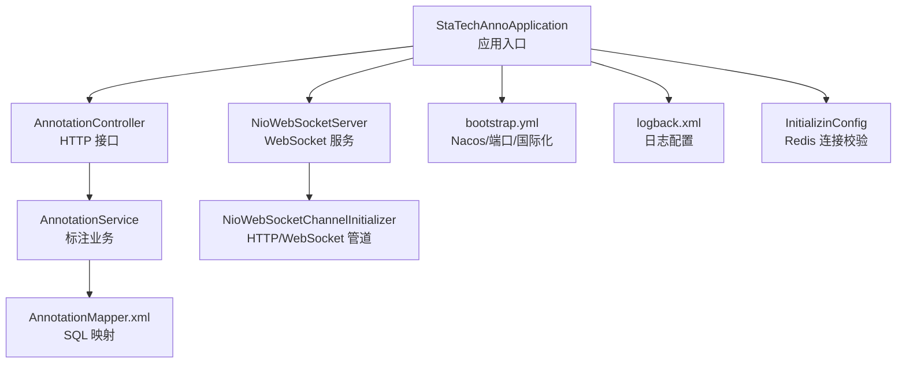
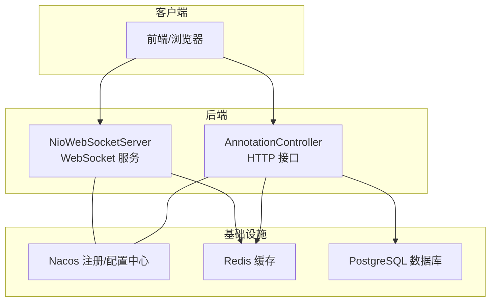
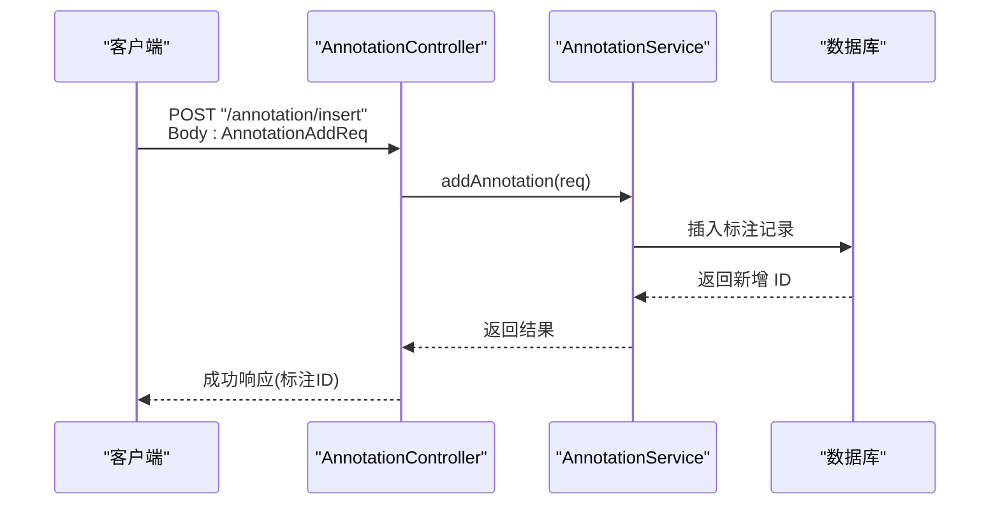
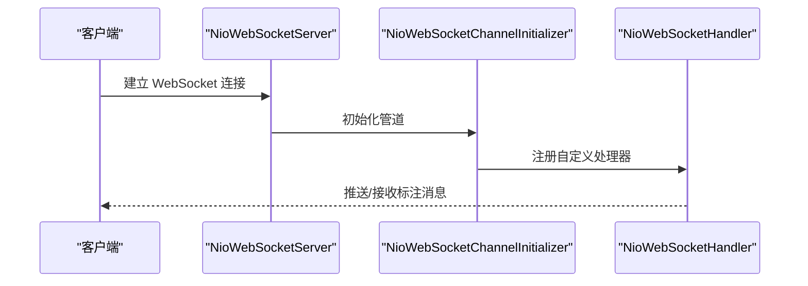
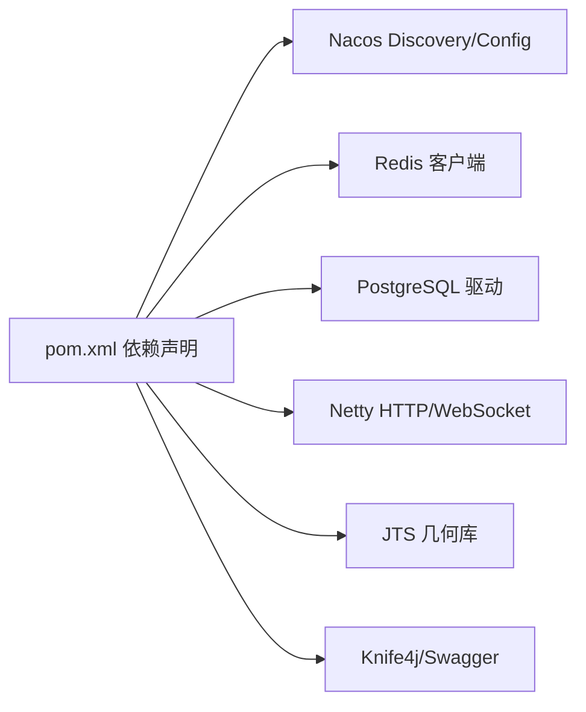

# 快速开始

<cite>
**本文引用的文件**
- [pom.xml](file://pom.xml)
- [README.md](file://README.md)
- [StaTechAnnoApplication.java](file://src/main/java/cn/staitech/annotation/StaTechAnnoApplication.java)
- [bootstrap.yml](file://src/main/resources/bootstrap.yml)
- [logback.xml](file://src/main/resources/logback.xml)
- [InitializinConfig.java](file://src/main/java/cn/staitech/annotation/config/InitializinConfig.java)
- [AnnotationController.java](file://src/main/java/cn/staitech/annotation/controller/AnnotationController.java)
- [NioWebSocketServer.java](file://src/main/java/cn/staitech/annotation/netty/websocket/NioWebSocketServer.java)
- [NioWebSocketChannelInitializer.java](file://src/main/java/cn/staitech/annotation/netty/websocket/NioWebSocketChannelInitializer.java)
- [AnnotationMessage.java](file://src/main/java/cn/staitech/annotation/netty/message/AnnotationMessage.java)
- [AnnotationAddReq.java](file://src/main/java/cn/staitech/annotation/vo/anno/AnnotationAddReq.java)
- [update_pg_v2.6.0.sql](file://sql/update_pg_v2.6.0.sql)
</cite>

## 目录
1. [简介](#简介)
2. [项目结构](#项目结构)
3. [核心组件](#核心组件)
4. [架构总览](#架构总览)
5. [详细组件分析](#详细组件分析)
6. [依赖分析](#依赖分析)
7. [性能考虑](#性能考虑)
8. [故障排查指南](#故障排查指南)
9. [结论](#结论)
10. [附录](#附录)

## 简介
本快速开始指南面向新开发者，帮助你在最短时间内完成医学图像标注系统的环境准备、依赖安装、数据库初始化、应用启动与基本功能验证。系统采用 Spring Boot + Netty WebSocket 的架构，支持标注数据的实时通信与持久化。

## 项目结构
该模块为“标注”子系统，主要包含：
- 后端应用入口与配置
- 控制器层（标注、测量、WebSocket）
- 持久层（MyBatis Plus Mapper/XML）
- 业务服务层（标注、测量、标注删除、标注SD）
- Netty WebSocket 实现
- 外部依赖（Nacos、Sentinel、Redis、PostgreSQL、Netty、JTS）

图表来源
- [StaTechAnnoApplication.java:34-50](file://src/main/java/cn/staitech/annotation/StaTechAnnoApplication.java#L34-L50)
- [AnnotationController.java:42-251](file://src/main/java/cn/staitech/annotation/controller/AnnotationController.java#L42-L251)
- [NioWebSocketServer.java:14-43](file://src/main/java/cn/staitech/annotation/netty/websocket/NioWebSocketServer.java#L14-L43)
- [NioWebSocketChannelInitializer.java:13-29](file://src/main/java/cn/staitech/annotation/netty/websocket/NioWebSocketChannelInitializer.java#L13-L29)
- [bootstrap.yml:1-42](file://src/main/resources/bootstrap.yml#L1-L42)
- [logback.xml:1-101](file://src/main/resources/logback.xml#L1-L101)
- [InitializinConfig.java:15-31](file://src/main/java/cn/staitech/annotation/config/InitializinConfig.java#L15-L31)

章节来源
- [StaTechAnnoApplication.java:34-50](file://src/main/java/cn/staitech/annotation/StaTechAnnoApplication.java#L34-L50)
- [bootstrap.yml:1-42](file://src/main/resources/bootstrap.yml#L1-L42)

## 核心组件
- 应用入口与扫描
  - 扫描包、事务、异步、MyBatis Plus 分页拦截器、国际化消息源初始化。
- 配置中心与注册中心
  - 通过 Nacos 发现与配置中心，支持 dev/test/prod 三套环境 profile。
- 日志与国际化
  - Logback 输出到文件与控制台，国际化资源位于 i18n。
- Redis 连接校验
  - 初始化阶段启用连接校验，提升稳定性。
- WebSocket 服务
  - 基于 Netty 的 WebSocket 服务器，监听配置端口。

章节来源
- [StaTechAnnoApplication.java:34-50](file://src/main/java/cn/staitech/annotation/StaTechAnnoApplication.java#L34-L50)
- [bootstrap.yml:1-42](file://src/main/resources/bootstrap.yml#L1-L42)
- [logback.xml:1-101](file://src/main/resources/logback.xml#L1-L101)
- [InitializinConfig.java:15-31](file://src/main/java/cn/staitech/annotation/config/InitializinConfig.java#L15-L31)
- [NioWebSocketServer.java:14-43](file://src/main/java/cn/staitech/annotation/netty/websocket/NioWebSocketServer.java#L14-L43)

## 架构总览
系统采用“HTTP + WebSocket”的双通道架构：
- HTTP 接口：提供标注 CRUD、批量操作、距离计算、撤销/重做等。
- WebSocket：提供标注数据的实时推送与订阅（如标注变更通知）。

图表来源
- [AnnotationController.java:42-251](file://src/main/java/cn/staitech/annotation/controller/AnnotationController.java#L42-L251)
- [NioWebSocketServer.java:14-43](file://src/main/java/cn/staitech/annotation/netty/websocket/NioWebSocketServer.java#L14-L43)
- [bootstrap.yml:20-41](file://src/main/resources/bootstrap.yml#L20-L41)

## 详细组件分析

### HTTP 接口与标注操作
- 接口路径前缀：/annotation
- 主要能力：
  - 新增标注、AI 新标注
  - 删除标注、按切片批量删除
  - 更新标注、AI 更新
  - 填充轮廓、复制/粘贴轮廓
  - 轮廓合并预览、合并/裁剪轮廓
  - 查询 GeoJSON 特征列表、筛差数据
  - 批量操作、撤销/重做、清理栈、检查状态
- 请求体示例参考 VO 类：
  - 新增标注请求体：[AnnotationAddReq.java:24-118](file://src/main/java/cn/staitech/annotation/vo/anno/AnnotationAddReq.java#L24-L118)

图表来源
- [AnnotationController.java:50-60](file://src/main/java/cn/staitech/annotation/controller/AnnotationController.java#L50-L60)
- [AnnotationAddReq.java:24-118](file://src/main/java/cn/staitech/annotation/vo/anno/AnnotationAddReq.java#L24-L118)

章节来源
- [AnnotationController.java:42-251](file://src/main/java/cn/staitech/annotation/controller/AnnotationController.java#L42-L251)
- [AnnotationAddReq.java:24-118](file://src/main/java/cn/staitech/annotation/vo/anno/AnnotationAddReq.java#L24-L118)

### WebSocket 实时通信
- 启动方式：随应用启动，读取配置端口。
- 管道组成：HTTP 解码器 + 聚合器 + 分块写处理器 + 自定义 Handler。
- 报文模型：包含类型、切片ID、标注类型、单条或多条标注特征。

图表来源
- [NioWebSocketServer.java:14-43](file://src/main/java/cn/staitech/annotation/netty/websocket/NioWebSocketServer.java#L14-L43)
- [NioWebSocketChannelInitializer.java:13-29](file://src/main/java/cn/staitech/annotation/netty/websocket/NioWebSocketChannelInitializer.java#L13-L29)
- [AnnotationMessage.java:14-27](file://src/main/java/cn/staitech/annotation/netty/message/AnnotationMessage.java#L14-L27)

章节来源
- [NioWebSocketServer.java:14-43](file://src/main/java/cn/staitech/annotation/netty/websocket/NioWebSocketServer.java#L14-L43)
- [NioWebSocketChannelInitializer.java:13-29](file://src/main/java/cn/staitech/annotation/netty/websocket/NioWebSocketChannelInitializer.java#L13-L29)
- [AnnotationMessage.java:14-27](file://src/main/java/cn/staitech/annotation/netty/message/AnnotationMessage.java#L14-L27)

## 依赖分析
- 构建与运行
  - Maven 构建插件：Spring Boot Maven 插件、资源过滤插件。
  - 依赖范围：provided/system 等，确保打包时正确包含本地 JAR。
- 外部依赖
  - Nacos 注册与配置中心
  - Redis 客户端连接校验
  - PostgreSQL 驱动与 PostGIS JDBC
  - Netty HTTP/WebSocket
  - JTS 几何库与本地扩展 JAR
  - Swagger/Knife4j 文档
- 环境 Profile
  - pacmvsdev/testpvcmvs/pathmedics 三套环境，分别指向不同 Nacos 地址与命名空间。

图表来源
- [pom.xml:19-134](file://pom.xml#L19-L134)
- [pom.xml:226-263](file://pom.xml#L226-L263)

章节来源
- [pom.xml:19-134](file://pom.xml#L19-L134)
- [pom.xml:226-263](file://pom.xml#L226-L263)

## 性能考虑
- 分页与拦截器
  - 已启用 MyBatis Plus 分页内核，建议在查询接口中合理使用分页参数。
- 日志级别
  - 生产环境建议调整日志级别，避免过多 INFO/DEBUG 输出影响性能。
- WebSocket
  - 大数据分块传输与聚合器已配置，注意消息体大小与并发连接数。

章节来源
- [StaTechAnnoApplication.java:44-49](file://src/main/java/cn/staitech/annotation/StaTechAnnoApplication.java#L44-L49)
- [logback.xml:85-99](file://src/main/resources/logback.xml#L85-L99)
- [NioWebSocketChannelInitializer.java:13-29](file://src/main/java/cn/staitech/annotation/netty/websocket/NioWebSocketChannelInitializer.java#L13-L29)

## 故障排查指南
- 端口占用与防火墙
  - 应用默认端口与依赖端口清单见 README；需开放对应 TCP 端口并重启防火墙。
- Nacos 连接失败
  - 检查 bootstrap.yml 中的 server-addr、namespace、group 是否与环境一致。
- Redis 连接异常
  - 初始化配置会启用连接校验，确认 Redis 地址与认证配置。
- PostgreSQL 初始化
  - 使用提供的 SQL 脚本初始化标注、筛差、测量相关表结构。
- WebSocket 启动失败
  - 检查 netty.port 配置与端口占用情况。
- 日志定位
  - 查看 logs/staitech-anno 下的启动与错误日志文件。

章节来源
- [README.md:5-60](file://README.md#L5-L60)
- [bootstrap.yml:1-42](file://src/main/resources/bootstrap.yml#L1-L42)
- [InitializinConfig.java:15-31](file://src/main/java/cn/staitech/annotation/config/InitializinConfig.java#L15-L31)
- [update_pg_v2.6.0.sql:1-245](file://sql/update_pg_v2.6.0.sql#L1-L245)
- [NioWebSocketServer.java:14-43](file://src/main/java/cn/staitech/annotation/netty/websocket/NioWebSocketServer.java#L14-L43)
- [logback.xml:1-101](file://src/main/resources/logback.xml#L1-L101)

## 结论
按照本指南完成环境准备、依赖安装、数据库初始化与应用启动后，你即可通过 HTTP 接口与 WebSocket 实时通道进行标注与协作的基本验证。后续可结合前端或第三方工具进行更深入的功能联调。

## 附录

### 环境准备与依赖安装
- JDK 版本
  - 使用 Maven 父工程版本，建议 JDK 8 或 17（以父工程为准）。
- Maven
  - 使用标准 Maven 命令构建与打包。
- 外部依赖
  - Nacos 注册与配置中心
  - Redis 缓存
  - PostgreSQL + PostGIS
  - RabbitMQ（参考 README 的 Docker 启动示例）

章节来源
- [pom.xml:1-20](file://pom.xml#L1-L20)
- [README.md:86-95](file://README.md#L86-L95)

### 数据库初始化
- 使用脚本初始化标注、筛差、测量相关表与索引。
- 注意 geometry 字段与 PostGIS 扩展的兼容性。

章节来源
- [update_pg_v2.6.0.sql:1-245](file://sql/update_pg_v2.6.0.sql#L1-L245)

### 应用启动步骤
- 修改配置
  - 在 bootstrap.yml 中确认 Nacos 地址、命名空间、组与激活的 profile。
  - 如需调整端口，请同步修改 server.port 与 netty.port。
- 开放端口
  - 参考 README 中的防火墙开放命令。
- 启动应用
  - 使用 Maven 打包后运行生成的可执行 JAR，或通过 IDE 启动入口类。
- 访问文档
  - 启用 Knife4j 后访问应用根路径查看接口文档。

章节来源
- [bootstrap.yml:1-42](file://src/main/resources/bootstrap.yml#L1-L42)
- [README.md:5-60](file://README.md#L5-L60)
- [StaTechAnnoApplication.java:34-50](file://src/main/java/cn/staitech/annotation/StaTechAnnoApplication.java#L34-L50)

### 基本使用示例
- HTTP 接口
  - 新增标注：POST /annotation/insert（请求体参考 AnnotationAddReq）
  - 删除标注：POST /annotation/delete（Body: DeleteAnnotationReq）
  - 查询标注列表：POST /annotation/selectLists（Body: AnnotationReq）
  - 撤销/重做：POST /annotation/undoAnnotation/{slideId}、POST /annotation/redoAnnotation/{slideId}
- WebSocket 实时通信
  - 连接后订阅切片标注变更，接收标注消息（类型、数据、列表等）。

章节来源
- [AnnotationController.java:50-153](file://src/main/java/cn/staitech/annotation/controller/AnnotationController.java#L50-L153)
- [AnnotationAddReq.java:24-118](file://src/main/java/cn/staitech/annotation/vo/anno/AnnotationAddReq.java#L24-L118)
- [AnnotationMessage.java:14-27](file://src/main/java/cn/staitech/annotation/netty/message/AnnotationMessage.java#L14-L27)